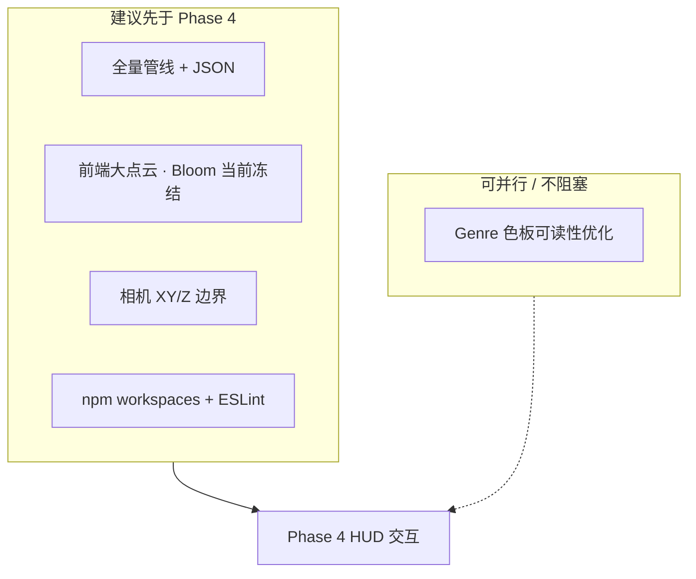

# 代码审查后续：进入 Phase 4 前的收尾计划

## 背景与进度对齐

- 主计划 [tmdb_galaxy_dev_plan_5ad6bea5.plan.md](.cursor/plans/tmdb_galaxy_dev_plan_5ad6bea5.plan.md) 中 **Phase 0–3.6 已完成**，**Phase 4（Raycaster / Tooltip / Drawer 等）仍为 pending**。
- [Project_Status_and_Code_Review_Report.md](docs/reports/Project_Status_and_Code_Review_Report.md) 的结论与主计划一致：在进入 Phase 4 前，应先消除「仅 subsample 规模验证」带来的性能与视觉盲区。

**已确认决策（2026-04-14）**

- **大 JSON 与 Git**：继续将全量生成的 [frontend/public/data/galaxy_data.json](frontend/public/data/galaxy_data.json) **纳入版本跟踪**；若远程托管有单文件大小上限，再考虑 Git LFS 或拆仓，不在本计划内默认 gitignore。
- **根目录包管理**：采用 **npm workspaces**（根 `package.json` 声明 `workspaces: ["frontend"]`），替代仅 `--prefix` 代理。

---

## 1. 全量数据管线与前端联调（审查 3.1 — 最高优先级）

**目标**：用真实清洗后规模（管线对 canonical 输入 [scripts/run_pipeline.py](scripts/run_pipeline.py) 默认断言约 **55k–65k** 行）生成 `galaxy_data.json` / `.json.gz`，并在浏览器中验证帧率、Overdraw 等。**Bloom 生产标定本阶段不做**：代码中保持当前默认，过曝/辉光强度留待未来迭代。

**执行要点**：

- 确认输入为 **`data/raw/TMDB_all_movies.csv`**（默认），且**不要**把输入指到 `data/subsample/tmdb2025_random20.csv`（该路径会触发 Phase 2.6 自动 `--through-phase-2` 与小行数断言，见 `is_smoke_input` 逻辑）。
- 运行（与审查报告一致，可加显式 `--input` 避免歧义）：
  - `python scripts/run_pipeline.py --through-phase-2`
  - 或显式：`python scripts/run_pipeline.py --input data/raw/TMDB_all_movies.csv --through-phase-2`
- 输出默认写入 [frontend/public/data/galaxy_data.json](frontend/public/data/galaxy_data.json)（及同 stem 的 gzip）；全量 JSON 体积大，注意**本地磁盘**与 **push 体积**（你已选择继续跟踪该文件；若接近平台限制再评估 LFS）。
- **验收**：清洗行数落在断言区间；`validate_galaxy_json` 通过；本地 `npm run dev`（workspaces 落地后在根目录执行）加载后 **FPS 可接受**。**Bloom**：不强制本阶段定稿；开发期保持 [frontend/src/three/scene.ts](frontend/src/three/scene.ts) 当前默认，需要时用 `window.__bloom` 本地试参即可，**生产向数值未来再写回**。

**风险备忘**：Embedding + UMAP 全量耗时长、占 GPU/内存；OOM 时按 [Tech Spec](docs/project_docs/TMDB%20电影宇宙%20Tech%20Spec.md) / [python-pipeline.mdc](.cursor/rules/python-pipeline.mdc) 降低 batch，而非丢样本。

---

## 2. 根目录 `package.json` 与 monorepo DX（审查 3.2）

**现状**：[package.json](package.json) 使用 `npm run <script> --prefix frontend` 代理。

**目标**：减少「双根」带来的 ESLint/TS 解析歧义。

**已定方案**：根 [package.json](package.json) 增加 **`"workspaces": ["frontend"]`**；在根执行 `npm install` 安装依赖；根级 `dev` / `build` / `lint` / `storybook` 等脚本改为调用 workspace 包（或 `npm run -w frontend <script>`，以 npm 文档为准）。完成后验证与 [frontend/README.md](frontend/README.md) 中的说明一致，必要时更新 README 中的安装命令。

---

## 3. 相机漫游边界（审查 3.3）

**现状**：[frontend/src/three/camera.ts](frontend/src/three/camera.ts) 已接收 `zRange` 与 `xyRange`，但 **wheel / drag 未做 clamp**；滚轮与拖拽可无限偏离数据云。

**目标**：用 `meta.z_range` 与 `meta.xy_range`（已由 [frontend/src/three/scene.ts](frontend/src/three/scene.ts) 传入）限制 `camera.position`。

**实现建议**：

- 在 `onPointerMove` / `onWheel` 更新位置后调用统一的 **`clampCameraToBounds(camera, options)`**：
  - **Z**：在 `[zMin - padZ, zMax + padZ]` 内夹紧（`padZ` 可取数据 Z 跨度的比例或固定 world 单位，避免贴脸裁切）。
  - **X/Y**：在 `xy_range` 各轴加 **对称 padding**（可按 UMAP 跨度比例），避免用户把星系拖出视野后迷路。
- 审查提到的 **弹簧阻尼软边界**可作为第二阶段：第一版硬 clamp 已能解决「飞出宇宙」；若需手感，再在 clamp 外加速度/插值（注意与现有无物理 tick 的纯事件模型协调）。

---

## 4. ESLint 历史告警（审查 3.5）

**目标**：`npm run lint`（根或 frontend）**零告警或仅可解释的窄范围 disable**。

**常见处理**（针对 `react-refresh/only-export-components`）：

- 将「仅应导出组件」的文件与「导出 store / 常量 / hooks」的文件拆分；或对 **非组件模块** 在文件级配置 eslint 例外（附一行理由）。
- 涉及配置：[frontend/eslint.config.js](frontend/eslint.config.js)。

---

## 5. Genre OKLCH 色板在全量下的可读性（审查 3.4 — **非阻塞 backlog**）

报告正确指出：全量时流派种类多，**仅靠当前「数据集内出现流派 → OKLCH 均分」** 可能显得花。此条**不阻止 Phase 4**，建议在主计划或 issue 中记为 **「视觉打磨 / 设计迭代」**：例如按占比排序、合并长尾为 Other、或固定 Tech Spec 色表位置等。实施前应对照 [TMDB 电影宇宙 Design Spec.md](docs/project_docs/TMDB%20电影宇宙%20Design%20Spec.md)。

---

## 6. 与主开发计划的衔接

完成 **§1–§4** 并在可行范围内记录全量下的**性能**观察后，再回到 [tmdb_galaxy_dev_plan_5ad6bea5.plan.md](.cursor/plans/tmdb_galaxy_dev_plan_5ad6bea5.plan.md) 从 **Phase 4.1 Raycaster** 继续；此时 Raycaster 与 HUD 将在真实点密度上开发，避免二次返工。**Bloom 生产标定**不纳入本阶段门禁，与 §1 决策一致。
