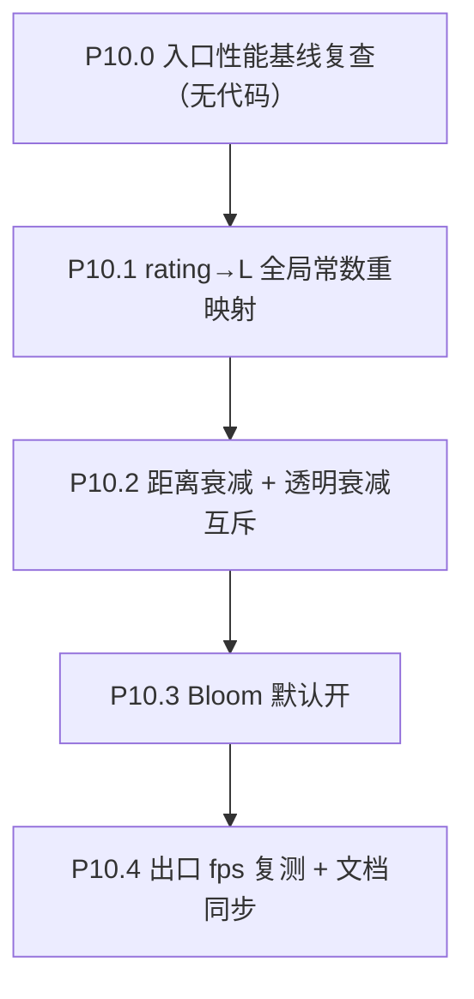

# Phase 10 — 全局视觉重映射（rating→L、距离衰减、Bloom 默认开）

> 与 Phase 9（HUD）解耦；不动数据 schema、不动 mesh 拓扑、不动状态机。仅触及 idle/active 顶点+片段着色器、`scene.ts` 后处理初始化、leva 调参面板。

## 范围

- 子节点：P10.0 → P10.4
- 涉及文件：
  - [frontend/src/three/galaxyMeshes.ts](frontend/src/three/galaxyMeshes.ts)（uniform 扩充）
  - [frontend/src/three/shaders/galaxyIdle.vert.glsl](frontend/src/three/shaders/galaxyIdle.vert.glsl) / [.frag.glsl](frontend/src/three/shaders/galaxyIdle.frag.glsl)
  - [frontend/src/three/shaders/galaxyActive.vert.glsl](frontend/src/three/shaders/galaxyActive.vert.glsl) / [.frag.glsl](frontend/src/three/shaders/galaxyActive.frag.glsl)
  - [frontend/src/three/scene.ts](frontend/src/three/scene.ts)（Bloom 默认开 + leva 挂钩）
  - [docs/project_docs/Phase 8 基线 P8.0 性能与 P8.4 准入.md](docs/project_docs/Phase%208%20基线%20P8.0%20性能与%20P8.4%20准入.md)（P10 入口/出口 fps 行）
  - [docs/project_docs/视觉参数总表.md](docs/project_docs/视觉参数总表.md)
  - [docs/project_docs/TMDB 电影宇宙 Tech Spec.md](docs/project_docs/TMDB%20电影宇宙%20Tech%20Spec.md) §1.2 Bloom

## 执行顺序



依赖说明：
- P10.1 单独修改 `voteNorm → L` 数学，与 P10.2/P10.3 正交，但建议先做（在无 bloom / 无距离衰减条件下确认基色对比度，再叠层验收）
- P10.2 需在 idle/active.vert 与 .frag 均触手，与 P10.3 bloom 开启可能互相加亮，留 P10.4 统一回归

## P10.0 入口性能基线复查（无代码）

- 在 [`Phase 8 基线 P8.0 性能与 P8.4 准入.md`](docs/project_docs/Phase%208%20基线%20P8.0%20性能与%20P8.4%20准入.md) 末尾新增 `## P10.0 入口` 节
- 重跑 P8.0.1 三个 5 s 片段（idle / timeline 拖动 / focus），同口径填表（GPU time / JS Main / fps 中位数）
- 用作 P10.4 出口对照的 baseline；fps 退化 > 5% 时 P10.3 bloom 参数需回退

## P10.1 rating→L 全局常数重映射

**数学**（`voteNorm` 现含义为 `vote_average / 10`，已有 attribute）：

```glsl
// 等价伪 GLSL — 实际实现在 idle/active.vert 中插入
const float HIGH_T = 0.85;             // uHighRatingT — 对应 vote≈8.5
const float HIGH_SCALE = 0.4;          // uHighTierTRangeScale
const float K_EXP = 3.0;               // uLightnessRatingExponent

float t = clamp(voteNorm, 0.0, 1.0);   // 分母锁 10，不用 batch min/max
// 高分段斜率压缩
float tCompressed = t < HIGH_T
  ? t
  : HIGH_T + (t - HIGH_T) * HIGH_SCALE;
// 非线性
float tPow = pow(tCompressed, K_EXP);
float L = mix(uLMin, uLMax, tPow);
```

**实施细节**：
- 在 [galaxyIdle.vert.glsl](frontend/src/three/shaders/galaxyIdle.vert.glsl) line 44 与 [galaxyActive.vert.glsl](frontend/src/three/shaders/galaxyActive.vert.glsl) line 44 的 `float L = mix(uLMin, uLMax, clamp(voteNorm, 0.0, 1.0));` 替换为上述公式
- 新增三个 uniform：`uHighRatingT`、`uHighTierTRangeScale`、`uLightnessRatingExponent`，挂在 [galaxyMeshes.ts](frontend/src/three/galaxyMeshes.ts) `makeSharedUniforms` 中（默认值 `0.85 / 0.4 / 3.0`）
- 在 [scene.ts](frontend/src/three/scene.ts) leva 面板添加这三档（沿用现有 `pointScaleDebug` / `__bloom` 的 `window.__galaxyL` 模式或 leva）
- `uLMin/uLMax` 默认建议从当前 `0.4 / 0.85` 调到 `0.2 / 1.0`（更宽对比，与你笔记中"默认 0.2–1.0"一致）；leva 仍可调

**验收**：
- 低分（vote_average < 4）电影明显变暗（之前的 `voteNorm × L` 线性映射在低分区不够暗）
- 高分集中区（8.0–9.5）不会全部挤到最亮（HIGH_SCALE=0.4 拉开差距）
- 截图对照 P8.4 收尾态 + 本次出口态：高分前 25% 仍能与 Bloom 阈值 0.85 配合（P10.3）

## P10.2 距离衰减 + 透明衰减互斥

**目标**：远场星亮度按 `1/(1 + k·d²)` 衰减；启用衰减时禁用 idle 现有 `alpha = 1 - vInFocus` 透明衰减（避免远星既暗又透明而被 bloom 削成"光环"）。

**实施**：

1. 在 idle/active.vert 计算 `dCam = length(mvPosition.xyz)`（已有 `mvPosition`，零额外开销），通过 varying `vDistFalloff` 传入 frag：

```glsl
float vDistFalloff = 1.0 / (1.0 + uDistanceFalloffK * dot(mvPosition.xyz, mvPosition.xyz));
```

2. 共享 uniform 新增：
   - `uDistanceFalloffK: float`（默认 `0.0001`，挂 leva 调）
   - `uDistanceFalloffMode: int`（`0` = off，`1` = on）

3. [galaxyIdle.frag.glsl](frontend/src/three/shaders/galaxyIdle.frag.glsl) 改为：

```glsl
varying vec3 vColor;
varying float vInFocus;
varying float vDistFalloff;
uniform int uDistanceFalloffMode;

void main() {
  vec3 c = vColor * mix(1.0, vDistFalloff, float(uDistanceFalloffMode));
  // mode=1 时 alpha 走固定 floor（避免双重衰减）；mode=0 保留原 alpha=1-vInFocus 行为
  float alpha = (uDistanceFalloffMode == 1)
    ? clamp(1.0 - vInFocus * 0.0, 0.85, 0.95)   // 锁高 alpha 让亮度承担"远暗"
    : clamp(1.0 - vInFocus, 0.14, 0.95);
  gl_FragColor = vec4(c, alpha);
}
```

4. [galaxyActive.frag.glsl](frontend/src/three/shaders/galaxyActive.frag.glsl) 改为：

```glsl
varying vec3 vColor;
varying float vDistFalloff;
uniform int uDistanceFalloffMode;

void main() {
  vec3 c = vColor * mix(1.0, vDistFalloff, float(uDistanceFalloffMode));
  gl_FragColor = vec4(c, 1.0);
}
```

5. leva 把 `uDistanceFalloffK` 与 `uDistanceFalloffMode` 暴露；hot-reload 调参后定稿数值写入视觉参数总表

**验收**：
- mode=1 时远端星层（`dCam` 大）整体变暗但**不变透明**，bloom 不再泄漏成光环
- mode=0 时画面回到 Phase 8.4 收尾态（idle alpha = 1 - inFocus 衰减保持）
- mode 切换不引入闪烁（同帧 uniform 更新即可）

## P10.3 Bloom 默认开

**实施**：
- 在 [scene.ts](frontend/src/three/scene.ts) line 308 `let postFxBloomEnabled = false` 改为 `true`，并在初始化 `composer.addPass(bloomPass)` 一次（移除 `enable()` 的"延迟 addPass"模式或在初始化时直接调用 `bloomDebug.enable()`）
- 保留 `window.__bloom.disable()` 调试接口
- 不改 strength/radius/threshold 初值（沿用 0.95 / 0.52 / 0.82，与 Tech Spec §1.2 一致）；P10.1 提高 `uLMax` 到 1.0 后 vote_average ≈ 7+ 的星会跨过 threshold 0.82，刚好让前 25% 高分电影发光
- 在 leva / `window.__bloom` 中保留三档实时调参；P10.4 收尾时把 strength/radius/threshold 最终值（如有调整）写回 [Tech Spec §1.2](docs/project_docs/TMDB%20电影宇宙%20Tech%20Spec.md)

**风险与对策**：
- 集成显卡 fps 退化超过 P8.0 准入门槛 → 优先降 strength（0.95 → 0.7）或 radius（0.52 → 0.4），不动 idle/active 几何 detail
- bloom 与 P10.2 透明 alpha 同时启用导致泄漏 → 通过 P10.2 的 `mode=1 时 alpha → 0.85+` 闭合

## P10.4 出口 fps 复测 + 文档同步

- 在 [`Phase 8 基线`](docs/project_docs/Phase%208%20基线%20P8.0%20性能与%20P8.4%20准入.md) 新建 `## P10.4 出口` 节，重跑 P10.0 同口径三片段
- fps 退化 ≤ 5% 即通过；超 5% 时回退 P10.3 bloom 参数或暂关 P10.2 距离衰减并记入风险栏
- 文档同步：
  - [视觉参数总表.md](docs/project_docs/视觉参数总表.md)：登记 `uLMin/uLMax/uHighRatingT/uHighTierTRangeScale/uLightnessRatingExponent/uDistanceFalloffK/uDistanceFalloffMode` 的定稿值
  - [Tech Spec §1.2](docs/project_docs/TMDB%20电影宇宙%20Tech%20Spec.md)：Bloom 默认状态从"off"改为"on"，引用 P10.4 fps
  - 不要求实施报告（沿用 Phase 7/8 节奏）

## 验收（Phase 10 总）

- 低分电影显著更暗、高分集中区有可读对比度
- 远场星层有距离感（mode=1 默认开）
- Bloom 默认开后高分电影发光，整体画面"金属感 → 星空感"切换明显
- fps 不破 P8.0 准入门槛 95%
- HUD / Drawer / Tooltip / 选中链路全部无回归
- mode 与 leva 调参运行时切换无崩溃 / 无闪烁

## 风险与对策

| 风险                                                                    | 对策                                                                                                                            |
| ----------------------------------------------------------------------- | ------------------------------------------------------------------------------------------------------------------------------- |
| `uLMax=1.0` 后高分星过爆，bloom 阈值 0.82 全数过线                      | leva 调 threshold → 0.88 或保留 `uLMax=0.85` 做 A/B                                                                             |
| 距离衰减 `1/(1+k·d²)` 在 zCamDistance=30 / focus zCam=1 两态下 d 跨度大 | `k=0.0001` 起步，leva 在 idle/focus 各取一组手感后写常量；必要时把 mode 默认在 focus 态自动切 0（由 `uFocusedInstanceId` 派生） |
| Bloom 默认开后集成显卡 fps 退化                                         | P10.4 必跑出口 fps，超阈值时回退 strength/radius                                                                                |
| `uDistanceFalloffMode=1` 与现有 idle alpha 行为不一致引入"画面突变"     | leva 实时切换肉眼对照；`mode=0` 严格等价 P8.4 收尾态作为 fallback                                                               |
