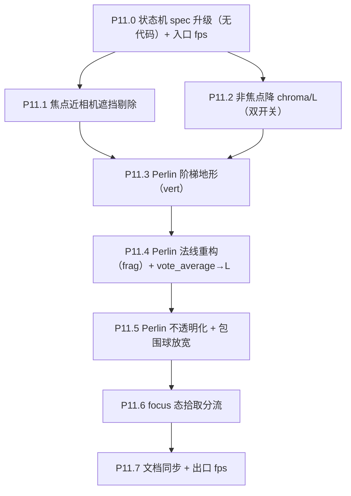

# Phase 11 — Focus 态视觉聚焦升级

> 接 Phase 8.4 双 InstancedMesh + Phase 8.3 Perlin focus 球的现状；不动数据契约，不引入新 attribute / DataTexture（那条留给后续搜索/select Phase）。本 Phase 完成后 focus 态从"几何聚焦"升级为"视觉聚焦"，且 Perlin 球获得真实立体阶梯地形。

## 范围

- 子节点：P11.0 → P11.7
- 涉及文件：
  - [frontend/src/three/galaxyMeshes.ts](frontend/src/three/galaxyMeshes.ts)（新增 focus 态相关 uniform）
  - [frontend/src/three/shaders/galaxyIdle.vert.glsl](frontend/src/three/shaders/galaxyIdle.vert.glsl) / [.frag.glsl](frontend/src/three/shaders/galaxyIdle.frag.glsl)
  - [frontend/src/three/shaders/galaxyActive.vert.glsl](frontend/src/three/shaders/galaxyActive.vert.glsl) / [.frag.glsl](frontend/src/three/shaders/galaxyActive.frag.glsl)
  - [frontend/src/three/planet.ts](frontend/src/three/planet.ts)（uniform 扩充、worldRadius 包围球放宽）
  - [frontend/src/three/shaders/perlin.vert.glsl](frontend/src/three/shaders/perlin.vert.glsl) / [.frag.glsl](frontend/src/three/shaders/perlin.frag.glsl)
  - [frontend/src/three/interaction.ts](frontend/src/three/interaction.ts)（focus 态拾取分流）
  - [frontend/src/three/scene.ts](frontend/src/three/scene.ts)（leva 调参挂钩、focus uniform 同步）
  - [docs/project_docs/星球状态机 spec.md](docs/project_docs/星球状态机%20spec.md)（focus 视觉降级 + 双开关 spec）
  - [docs/benchmarks/Phase 8 基线 P8.0 性能与 P8.4 准入.md](docs/benchmarks/Phase%208%20基线%20P8.0%20性能与%20P8.4%20准入.md)（P11 入口/出口 fps）
  - [docs/project_docs/视觉参数总表.md](docs/project_docs/视觉参数总表.md)
  - [docs/project_docs/TMDB 电影宇宙 Tech Spec.md](docs/project_docs/TMDB%20电影宇宙%20Tech%20Spec.md) §1.1 / §1.5

## 执行顺序



依赖说明：
- P11.0 一次性把 spec 与双开关 uniform 命名定下，避免 P11.2 与未来 selection 路径互相踩
- P11.1 与 P11.2 都改 idle/active.vert/.frag，建议同 commit 系列内连续完成
- P11.3 → P11.5 是 Perlin 链，必须严格顺序（顶点位移 → 重构法线 → 关闭透明）

## P11.0 状态机 spec 升级（无代码）+ 入口 fps

- 在 [`星球状态机 spec.md`](docs/project_docs/星球状态机%20spec.md) §3.4 focus 节追加：
  - 「focus 视觉降级」子节：`uFocusDimChroma` / `uFocusDimL` 数学；focus 焦点本身**不被降级**
  - 「focus 暗化 vs selection 高亮」双开关：`uFocusDimMode: 0|1`（0 = 焦点暗化全场非焦点；1 = 仅在 `selectionMask`=0 时暗化非焦点。**本 Phase 仅实装 mode=0；预留 mode=1 接口与 uniform，但 selectionMask 通道留给后续 Phase**）
  - 「焦点近相机遮挡剔除」子节：`uFocusOcclusionRadius` 默认值与作用域（仅 `uFocusedInstanceId >= 0` 时生效）
- Perlin 球新增「阶梯地形」一节：`uStepHeight` 上限约束（≤ `1/(1+hMax)`）+ vert 计算流程
- 在 [`Phase 8 基线`](docs/benchmarks/Phase%208%20基线%20P8.0%20性能与%20P8.4%20准入.md) 末尾新增 `## P11.0 入口` 节，重跑 P8.0.1 三片段（**重点录 focus 片段**作为 P11 主战场）

## P11.1 焦点近相机遮挡剔除

**目标**：focus 态相机距 `FOCUS_PERLIN_CAMERA_STANDOFF=1`（见 [camera.ts](frontend/src/three/camera.ts) line 11），任何 active/idle 实例若距相机过近会与 Perlin 球穿模/遮挡。直接把这些实例 alpha → 0 + `gl_Position` 推 NDC 外（复用现有 `< 1e-6` 出口），既消除遮挡又规避 bloom 甜甜圈光环。

**实施**：
- 共享 uniform 新增（在 [galaxyMeshes.ts](frontend/src/three/galaxyMeshes.ts) `makeSharedUniforms`）：
  - `uFocusOcclusionRadius: float`（默认 `2.5`，含义为 world units，挂 leva）
  - `uCameraWorldPos: vec3`（每帧 RAF 内由 [scene.ts](frontend/src/three/scene.ts) 写入 `camera.position`）
- idle.vert / active.vert 在 `isFocused` 分支后追加：

```glsl
// instance world position from instanceMatrix translation column
vec3 instWorldPos = vec3(instanceMatrix[3][0], instanceMatrix[3][1], instanceMatrix[3][2]);
bool occluded = (uFocusedInstanceId >= 0)
  && !isFocused
  && distance(instWorldPos, uCameraWorldPos) < uFocusOcclusionRadius;
if (occluded) {
  sIdle = 0.0;   // active.vert 同名 sActive
}
// 后续保留现有 `if (sIdle < 1e-6) { gl_Position = vec4(2,2,2,1); return; }` 出口
```

- 注意：`instanceMatrix` 在 idle/active 各 InstancedMesh 内是 world 矩阵（非 modelMatrix 嵌套），现有 vert 已用 `instanceMatrix[3][2]` 取 `aZ`，参考即可

**验收**：
- focus 一颗高 vote_count 电影后，相机周围 worldRadius < `uFocusOcclusionRadius` 范围内的 active/idle 实例**完全不可见**（不闪、不光环）
- 退出 focus 后所有被剔除实例正常恢复
- leva 调 `uFocusOcclusionRadius` 实时生效；过大时 Perlin 球四周可见空洞，过小时仍有遮挡

## P11.2 非焦点降 chroma/L（双开关 uniform 接口）

**目标**：focus 态把非焦点星球的 chroma/L 整体压低（用户决策：焦点星不动）。

**实施**：
- 共享 uniform 新增：
  - `uFocusDimChroma: float`（默认 `0.3`，倍率，挂 leva）
  - `uFocusDimL: float`（默认 `0.4`，目标 L 值，挂 leva）
  - `uFocusDimMode: int`（默认 `0`；mode=1 接口预留，本 Phase 不消费 selectionMask，行为退化为与 mode=0 相同 — 通过条件 `(uFocusDimMode == 0) || /* selection mask read 接口预留 */ false` 判定）
- idle.vert / active.vert 现有色彩计算（line 44–47）扩展：

```glsl
float L_base = mix(uLMin, uLMax, clamp(voteNorm, 0.0, 1.0));
float C_base = uChroma;

bool dimEligible = (uFocusedInstanceId >= 0) && !isFocused;
float dimMix = dimEligible ? 1.0 : 0.0;
float L = mix(L_base, uFocusDimL, dimMix);
float C = mix(C_base, C_base * uFocusDimChroma, dimMix);

float a = C * cos(hue);
float labB = C * sin(hue);
vColor = linear_to_srgb(oklab_to_linear_srgb(vec3(L, a, labB)));
```

- 焦点星本身（`isFocused == true`）走原色彩公式（不触此降级）
- leva 暴露 `uFocusDimChroma` / `uFocusDimL`；mode 默认 0 即可

**注**：若 Phase 10 已落地 `uHighRatingT/uHighTierTRangeScale/uLightnessRatingExponent` 公式，`L_base` 应使用 Phase 10 的最终公式而非简单 `mix`；本 Phase 实施时先 `cat` 当时的 vert 文件确认状态再写入。

**验收**：
- focus 进入后非焦点星整体变暗、变灰；焦点星仍鲜艳明亮
- 退出 focus 全场恢复
- leva 调 `uFocusDimChroma=0` 时非焦点几乎纯灰；`uFocusDimL=L_base` 时仅降饱和

## P11.3 Perlin 阶梯地形（vert）

**目标**：把 [perlin.frag.glsl](frontend/src/three/shaders/perlin.frag.glsl) 中已有的 4 段 step 分色（line 22–25）升级为**带物理高度的阶梯地形**：在 vert 中按累加 smoothstep 算 `level ∈ [0, 4]`，沿法线推顶点。

**实施**：
- [perlin.vert.glsl](frontend/src/three/shaders/perlin.vert.glsl) 重写：

```glsl
varying float vNoise;
varying vec3 vWorldPos;
varying float vLevel;

attribute float aNoise;

uniform float uThresh1;
uniform float uThresh2;
uniform float uThresh3;
uniform float uThresh4;
uniform float uStepHeight;       // world units, e.g. 0.04 — 占 worldRadius 的比例由 planet.ts 控制
uniform float uStepSmoothness;   // smoothstep band half-width, e.g. 0.02

void main() {
  vNoise = aNoise;
  float n = aNoise;

  float level = 0.0;
  level += smoothstep(uThresh1 - uStepSmoothness, uThresh1 + uStepSmoothness, n);
  level += smoothstep(uThresh2 - uStepSmoothness, uThresh2 + uStepSmoothness, n);
  level += smoothstep(uThresh3 - uStepSmoothness, uThresh3 + uStepSmoothness, n);
  // uThresh4 = max；通常不再加一档（4 段对应 0..3 的 level）
  vLevel = level;

  vec3 displaced = position + normal * (level * uStepHeight);
  vec4 worldPos4 = modelMatrix * vec4(displaced, 1.0);
  vWorldPos = worldPos4.xyz;
  gl_Position = projectionMatrix * viewMatrix * worldPos4;
}
```

- [planet.ts](frontend/src/three/planet.ts) `material.uniforms` 加 `uStepHeight: { value: 0.06 }` / `uStepSmoothness: { value: 0.02 }`，挂 leva
- **关键约束**：`mesh.scale.setScalar(worldRadius)` 仍然把整个 mesh（含位移后顶点）缩放，故 world-space 实际峰值高度 ≈ `worldRadius × (1 + 3*uStepHeight)`。需要在 `setFromMovie` 内 `lastRadius = worldRadius * (1 + 3 * uStepHeight)` 用于 P11.6 拾取与 P11.5 包围球放宽
- 不要把 smoothstep 累加搬回 CPU；CPU 仍只算 base FBM noise + 4 阈值（保持现有 [planet.ts](frontend/src/three/planet.ts) `recomputeNoiseAndThresholds` 不变）

**验收**：
- focus 球可见 4 个清晰阶梯（峰 / 高原 / 中带 / 谷地）
- 阶梯边缘有平滑过渡（`uStepSmoothness=0` 时硬切作为对照）
- 不破 `near=0.05` / `FOCUS_PERLIN_CAMERA_STANDOFF=1`：`worldRadius * (1 + 3*0.06) ≈ 1.18 × r`，r 通常 < 0.5 → 安全

## P11.4 Perlin 法线重构（frag）+ vote_average→L

**目标**：顶点位移后球面法线被破坏，需要在 frag 用屏幕导数实时重构；同时把 4 色 base hue 映射到统一 L 值（来源 vote_average）。

**实施**：
- [perlin.frag.glsl](frontend/src/three/shaders/perlin.frag.glsl) 重写：

```glsl
#include "./oklab.glsl"

varying float vNoise;
varying vec3 vWorldPos;
varying float vLevel;

uniform float uThresh1;
uniform float uThresh2;
uniform float uThresh3;
uniform float uHue0;          // 4 色按 hue 数组，由 planet.ts 写入
uniform float uHue1;
uniform float uHue2;
uniform float uHue3;
uniform float uPerlinL;       // = mix(uLMin, uLMax, voteNormFromMovie) — focus 入场时计算并写入
uniform float uPerlinChroma;
uniform float uAlpha;
uniform vec3 uLightDir;       // world-space, e.g. normalize(vec3(0.4, 0.6, 0.8))
uniform float uAmbient;       // 0.35
uniform float uDiffuse;       // 0.65
uniform float uFlatShadingMix; // 0..1; 0 = use mesh normal, 1 = derivative-reconstructed

vec3 hueToOkSrgb(float hue, float L, float C) {
  float a = C * cos(hue);
  float b = C * sin(hue);
  return linear_to_srgb(oklab_to_linear_srgb(vec3(L, a, b)));
}

void main() {
  // 4 段硬切（保持 P8.3 step 分色，仅替换 col 颜色构造）
  float n = vNoise;
  float s0 = 1.0 - step(uThresh1, n);
  float s1 = step(uThresh1, n) * (1.0 - step(uThresh2, n));
  float s2 = step(uThresh2, n) * (1.0 - step(uThresh3, n));
  float s3 = step(uThresh3, n);

  vec3 col0 = hueToOkSrgb(uHue0, uPerlinL, uPerlinChroma);
  vec3 col1 = hueToOkSrgb(uHue1, uPerlinL, uPerlinChroma);
  vec3 col2 = hueToOkSrgb(uHue2, uPerlinL, uPerlinChroma);
  vec3 col3 = hueToOkSrgb(uHue3, uPerlinL, uPerlinChroma);
  vec3 baseCol = col0 * s0 + col1 * s1 + col2 * s2 + col3 * s3;

  // dFdx/dFdy 重构法线（WebGL2 内置，无需 extension）
  vec3 nDeriv = normalize(cross(dFdx(vWorldPos), dFdy(vWorldPos)));
  // 几何法线 fallback（modelMatrix 非平移 only 时才需要 normalMatrix；这里 mesh 仅 uniform scale，可近似 normalize(vWorldPos - mesh.position) 但 frag 里没有 mesh.position；用 nDeriv 主导）
  vec3 N = nDeriv;  // P11.4 起步直接用导数法线；uFlatShadingMix 留给调试

  float lambert = max(dot(N, normalize(uLightDir)), 0.0);
  vec3 lit = baseCol * (uAmbient + uDiffuse * lambert);

  gl_FragColor = vec4(lit, uAlpha);
}
```

- [planet.ts](frontend/src/three/planet.ts) `setFromMovie` 内：
  - 移除当前 `(u.uColor0..3.value as Vector3).copy(...)` 路径
  - 改为写 `u.uHue0..3.value = resolveGenreHue(genres[i], palette, fbHue)`（hue 弧度）
  - 新增写 `u.uPerlinL.value = mix(uLMin, uLMax, voteNorm)`（与 idle/active 同公式；可读取 [galaxyMeshes.ts](frontend/src/three/galaxyMeshes.ts) shared uniforms 当前值）
  - `u.uPerlinChroma.value = (galaxy.uChroma)`（同步即可）
- material 加 `uLightDir`（默认 `normalize(0.4, 0.6, 0.8)`）/ `uAmbient: 0.35` / `uDiffuse: 0.65` / `uFlatShadingMix: 1`，挂 leva

**验收**：
- focus 球阶梯切面有清晰光影（暗面 + 高光面）
- 不同 movie.id 仍稳定可复现（因 CPU 端 noise 流程未变）
- 切到 `uDiffuse=0` 时回到纯 ambient 平涂（对照）
- 高 vote 焦点球更亮、低 vote 更暗（验证 vote_average→L 链路）

## P11.5 Perlin 不透明化 + 包围球放宽

**目标**：阶梯边缘的透明 alpha 在 bloom + 多重叠后会出现锯齿；切到 opaque + alphaTest 与 active mesh 一致。

**实施**：
- [planet.ts](frontend/src/three/planet.ts) ShaderMaterial 构造（line 195–197）：
  - `transparent: false`（原 `true`）
  - `depthWrite: true`（原 `false`）
  - `alphaTest: 0.01`
- `uAlpha` 改为 0/1 二态（仍由 `setOpacity(alpha)` 控制，但 `mesh.visible` 已经处理"不可见"，`uAlpha` 只剩 1 的实际值）；保留 setOpacity 接口供相机飞入时配合 visible 切换
- `lastRadius = worldRadius * (1 + 3 * uStepHeight.value)` 在 `setFromMovie` 内更新，给 P11.6 拾取用包围球
- 风险注意：opaque 后 focus 球若 z-fight 双 mesh 上同 instance（已 scale=0），保险起见保留 `mesh.renderOrder = 1`，并在 [scene.ts](frontend/src/three/scene.ts) 验证 perlin renderOrder ≥ active.renderOrder

**验收**：
- 阶梯边缘锐利无锯齿
- bloom 默认开（若 Phase 10 已落地）下无光环泄漏
- focus 飞入/退出仍丝滑（visible 控制 + `uAlpha` 二态足够）

## P11.6 focus 态拾取分流

**目标**：focus 态时 raycaster 优先命中 Perlin 球（点击仍可触发，例如未来 select 取消等）；命中 active mesh 仅在"用户确实点击焦点星屏幕半径外的另一颗 active"时才算"切换 focus"，避免误命中后景。

**实施**：
- [interaction.ts](frontend/src/three/interaction.ts) `attachGalaxyActiveMeshInteraction`：
  - 入参新增 `selectionPlanetMesh: THREE.Mesh`（来自 `planet.ts` 返回的 `mesh`）
  - 命中逻辑：
    - `selectedMovieId !== null` 时，先 `raycaster.intersectObject(selectionPlanetMesh, false)`：命中即"焦点星仍被聚焦"，hover/click 走焦点星语义（hover 显示 tooltip 焦点星即可；点击 = 保持 focus 或触发抽屉）
    - 然后再 `pickClosestActiveMovieAlongRay`（active mesh 路径）；命中其他 active 时走"切换 focus"（已有的 `setState({ selectedMovieId: id })`）
  - `idle` 态行为不变
- 拾取的 worldRadius 包围球用 `selectionPlanetHandle.lastRadius`（P11.5 已放宽，含阶梯地形最大高度）

**验收**：
- focus 态把鼠标停在焦点 Perlin 球上，tooltip 显示焦点电影；停在背景另一颗 active 上 → 切换 focus
- 移动到空白处 → 无 hover；点击空白处保留现有取消 focus 行为（`setState({ selectedMovieId: null })`）

## P11.7 文档同步 + 出口 fps

- [`Phase 8 基线`](docs/benchmarks/Phase%208%20基线%20P8.0%20性能与%20P8.4%20准入.md) 末尾新增 `## P11.7 出口` 节：focus 片段 fps 不退化超 5%
- [星球状态机 spec.md](docs/project_docs/星球状态机%20spec.md)：
  - §3.4 focus 节 视觉降级 / 遮挡剔除 / Perlin 阶梯地形子节正式定稿
  - 「focus 暗化 vs selection 高亮」双开关接口写明（`uFocusDimMode` mode=1 留为接口）
- [视觉参数总表.md](docs/project_docs/视觉参数总表.md)：登记新增 8 个 uniform 的定稿值
  - `uFocusOcclusionRadius` / `uFocusDimChroma` / `uFocusDimL` / `uFocusDimMode`
  - `uStepHeight` / `uStepSmoothness` / `uLightDir` / `uAmbient` / `uDiffuse` / `uFlatShadingMix`
- [Tech Spec §1.1](docs/project_docs/TMDB%20电影宇宙%20Tech%20Spec.md)：Perlin 球小节追加阶梯地形与法线重构
- [Tech Spec §1.5](docs/project_docs/TMDB%20电影宇宙%20Tech%20Spec.md)：拾取小节追加 focus 态优先 Perlin 球的分流规则

## 验收（Phase 11 总）

- focus 进入后非焦点星整体降 chroma/L、焦点星保持高对比
- 焦点近相机区无遮挡/穿模、无 bloom 光环
- Perlin 球可见 4 段阶梯地形、有锐利光影
- focus 拾取分流：焦点星 hover 显示焦点信息，背景星可切换 focus
- fps 不破 P8.0 准入门槛 95%
- HUD / Drawer / Tooltip / 其他相位无回归

## 风险与对策

| 风险                                                                            | 对策                                                                                                                                        |
| ------------------------------------------------------------------------------- | ------------------------------------------------------------------------------------------------------------------------------------------- |
| 阶梯位移后 worldRadius 变大，撞 `near=0.05` 与 `FOCUS_PERLIN_CAMERA_STANDOFF=1` | `uStepHeight` 默认 0.06，最大峰值 1.18×r；可在 leva 上限锁 0.1                                                                              |
| dFdx/dFdy 重构法线在屏幕边缘像素或 mesh 边缘出现噪点                            | 保留 `uFlatShadingMix` 在 derivative-normal 与 mesh-normal 间渐变（mesh-normal 路径需要在 vert 传几何法线 varying，作为 fallback 留好接口） |
| `uFocusDimMode` mode=1 留接口但本 Phase 不消费 selectionMask                    | shader 内显式注释 mode=1 行为退化等同 mode=0；后续 Phase 再激活                                                                             |
| focus 拾取分流后 hover 焦点星 tooltip 文案与背景星撞                            | tooltip 文案沿用 `MovieTooltip` 由 `hoveredMovieId` 驱动；focus 态单独的 hover 字段在状态机 spec 内写"沿用 hoveredMovieId 单一来源"         |
| Perlin 不透明化后 z-fight 双 mesh 同 instance                                   | 双 mesh 上焦点 instance 已 `gl_Position 推 NDC 外`（P8.4 既有出口），与 P11.5 不冲突                                                        |
| focus dim 与 Phase 10 距离衰减叠加导致非焦点过暗                                | leva 调 `uFocusDimChroma/uFocusDimL` 与 `uDistanceFalloffK`；定稿值写视觉参数总表                                                           |

## 总验收清单（按用户笔记原始 4 条对照）

- ① 临近遮挡：✅ P11.1
- ② focus 全场降 chroma/L、焦点除外：✅ P11.2
- ③ focus 禁用 active 拾取（保留 Perlin 拾取）：✅ P11.6（实质是"分流 + 优先级"）
- ④ Perlin 阶梯海拔（smoothstep 累加 + 法线位移 + dFdx/dFdy 重构）：✅ P11.3 + P11.4
- ⑤ Perlin 颜色统一 L（跟 vote_average）：✅ P11.4 `uPerlinL = mix(uLMin, uLMax, voteNorm)`
