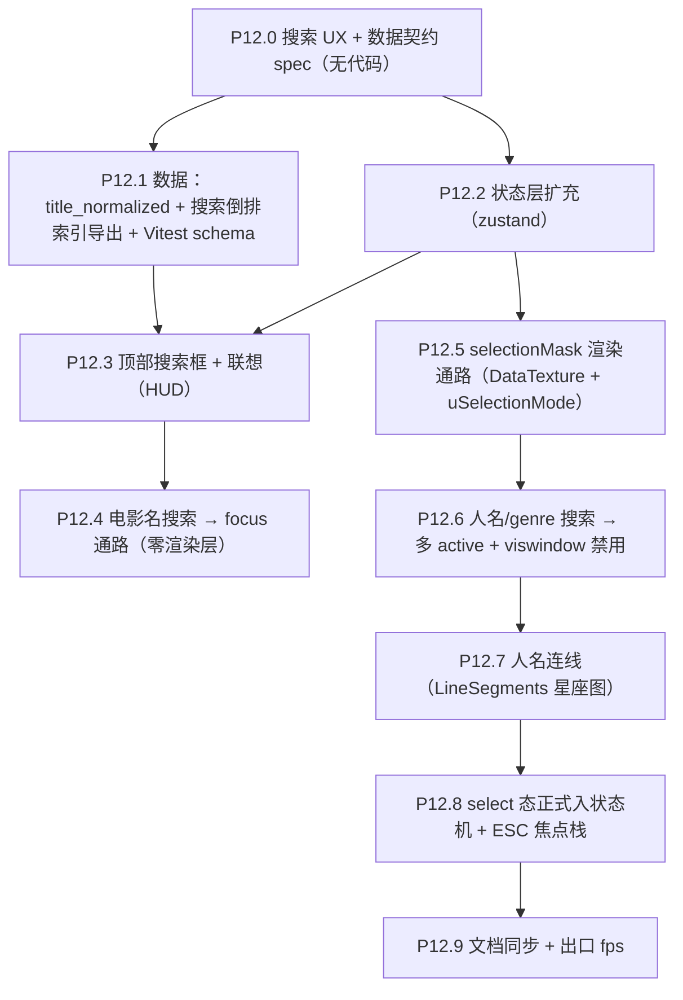

# Phase 12 — 搜索基础设施 + Select 态

> 接 Phase 8.4 双 InstancedMesh + Phase 9 HUD 视觉收尾后的状态。本 Phase **新增**渲染层 selectionMask 通道（每实例 0..1 的 R8 DataTexture）与 LineSegments 星座连线，**新增** `select` 状态机正式态，**新增**搜索倒排索引数据契约。前置：Phase 9（搜索框是 HUD 的一部分）；其它 Phase 不强依赖。

## 范围

- 子节点：P12.0 → P12.9
- 数据契约：升级（新增 `meta.has_search_index` + 新文件 `galaxy_search_index.json.gz`；`meta.version` minor bump）
- 状态机：`select` 从延后态转正
- 渲染管线：`uSelectionMask: DataTexture(R8)` + `uSelectionMode: int`
- 涉及文件：
  - [scripts/export/export_galaxy_json.py](scripts/export/export_galaxy_json.py)
  - 新建 `scripts/export/export_search_index.py`（也可整合在主导出脚本里，按用户偏好定）
  - [frontend/src/types/galaxy.ts](frontend/src/types/galaxy.ts)（Movie / Meta 类型扩充）
  - 新建 `frontend/src/data/loadSearchIndex.ts`（gzip + JSON 解析，与 `loadGalaxyGzip.ts` 同模式）
  - 新建 `frontend/src/components/SearchBar.tsx`（顶部搜索 + 联想下拉）
  - [frontend/src/store/galaxyInteractionStore.ts](frontend/src/store/galaxyInteractionStore.ts)（state 扩充）
  - [frontend/src/three/galaxyMeshes.ts](frontend/src/three/galaxyMeshes.ts)（uSelectionMask uniform + DataTexture 创建）
  - [frontend/src/three/shaders/galaxyIdle.vert.glsl](frontend/src/three/shaders/galaxyIdle.vert.glsl) / [galaxyActive.vert.glsl](frontend/src/three/shaders/galaxyActive.vert.glsl)（mask 采样 + 模式切换）
  - 新建 `frontend/src/three/constellation.ts`（人名连线 LineSegments）
  - [frontend/src/three/scene.ts](frontend/src/three/scene.ts)（挂连线 mesh + 监听 store 同步）
  - [frontend/src/App.tsx](frontend/src/App.tsx)（挂载 SearchBar + 加载 search index）
  - [frontend/src/three/interaction.ts](frontend/src/three/interaction.ts)（select 模式下拾取行为分流）
  - 新建 `frontend/src/utils/searchScore.ts`（打分排序工具 + Vitest 用例）
  - [docs/project_docs/星球状态机 spec.md](docs/project_docs/星球状态机%20spec.md)（select 转正、search 流程）
  - [docs/project_docs/TMDB 电影宇宙 Tech Spec.md](docs/project_docs/TMDB%20电影宇宙%20Tech%20Spec.md) §1.5 / §4
  - [docs/project_docs/TMDB 电影宇宙 Design Spec.md](docs/project_docs/TMDB%20电影宇宙%20Design%20Spec.md)（搜索 UX）
  - [docs/project_docs/视觉参数总表.md](docs/project_docs/视觉参数总表.md)
  - [docs/benchmarks/Phase 8 基线 P8.0 性能与 P8.4 准入.md](docs/benchmarks/Phase%208%20基线%20P8.0%20性能与%20P8.4%20准入.md)（P12 入口/出口 fps）

## 执行顺序



依赖说明：
- P12.0 把搜索 UX 与 selectionMask 数据流定义清楚，避免后续 P12.5/P12.6 来回返工
- P12.1 是数据前置；前端 P12.3 的联想列表无此索引会需要扫 60K × 6 字段（性能不可接受）
- P12.4 完全复用现有 `selectedMovieId` 链路，可独立验收为"电影搜索 MVP"
- P12.5 是 P12.6 / P12.7 的渲染基础设施
- P12.8 在所有功能落地后才把状态机正式收口

## P12.0 搜索 UX + 数据契约 spec（无代码）

- 在 [`Design Spec`](docs/project_docs/TMDB%20电影宇宙%20Design%20Spec.md) 末新增 `## 搜索 UX` 节：
  - 顶部居中搜索框（max-w-md）+ 三类 segmented（movie / person / genre）+ 清除 X
  - 联想下拉规格（电影名 / 人名 / genre 各自的过滤、排序、格式、高亮）—— 直接吸收用户笔记 `新增搜索功能 ...md` 的所有细则，不二次设计
  - ESC 焦点栈（搜索框 > drawer > 取消选中 > 关闭 search 模式）
- 在 [`星球状态机 spec.md`](docs/project_docs/星球状态机%20spec.md) §3.5 select 节扩充：
  - `select` 提为正式态；含义"selectionIds 非空 + viswindowDisabled"
  - 与 focus 互斥优先级：focus > select > active/idle/hover
  - selectionMask 数据流（uSelectionMask R8 DataTexture, length = movies.length）
- 在 [`Tech Spec §4`](docs/project_docs/TMDB%20电影宇宙%20Tech%20Spec.md) 数据契约小节预留 `meta.has_search_index: bool` 与 `galaxy_search_index.json.gz` 顶层结构

## P12.1 数据：title_normalized + 搜索倒排索引导出 + Vitest schema

**目标**：管线一次性产出搜索所需的索引文件，前端只 hydrate。

**实施**：
- [scripts/export/export_galaxy_json.py](scripts/export/export_galaxy_json.py)：
  - `_movie_row` 内新增 `title_normalized: str`：`unicodedata.normalize('NFKD', title).encode('ascii','ignore').decode('ascii').casefold()`，`original_title` 同理（用空格分隔拼接，方便子串包含）
  - `meta` 加 `has_search_index: True`
  - `meta.version` minor bump（沿用 P8.1 的 `meta.version` 双字段过渡风格）
- 新建 `scripts/export/export_search_index.py`（或在主脚本内追加 `--write-search-index`）：
  - 输出 `frontend/public/data/galaxy_search_index.json.gz`，顶层结构：
    ```jsonc
    {
      "version": "<同 galaxy_data.meta.version>",
      "people": {
        "<normalized_name>": {
          "full": "Original Name",
          "role_mask": 0b00111101,            // bit: cast=1, director=2, dop=4, writers=8, producers=16, music_composer=32
          "movie_ids": [123, 456]
        }
      },
      "genres": ["Action", "Drama", ...]       // 等价 keys(meta.genre_palette) 的稳定排序
    }
    ```
  - 人名 normalized：`NFKD + ascii + casefold`，与 `title_normalized` 同函数
  - 同一人在多角色下合并 role_mask + movie_ids 去重
  - `print` 索引人数、平均每人参演数、文件大小（gzip 后）；`assert` 关键路径（人数 > 0、role_mask ∈ uint8）
- 类型层 [frontend/src/types/galaxy.ts](frontend/src/types/galaxy.ts)：
  - `Movie` 加 `title_normalized: string`
  - `Meta` 加 `has_search_index?: boolean`
  - 新文件 `frontend/src/types/searchIndex.ts`：`SearchIndex / PersonEntry / RoleMask` 类型
- Vitest（沿用 P8.1 安装的 vitest）：
  - `loadSearchIndex.spec.ts`：`has_search_index=true` 时 schema 必含 `people / genres`；role_mask ∈ [0, 63]
  - `searchScore.spec.ts`（P12.3 实施时再补打分用例）

**验收**：
- `npm run pipeline-export`（或等价命令）一次产出 `galaxy_data.json.gz` + `galaxy_search_index.json.gz`
- 前端 dev 加载两文件均成功；console 输出 `[SearchIndex] persons=NN genres=MM size=XXkB`
- Vitest 全绿

## P12.2 状态层扩充（zustand）

**实施**：
- [frontend/src/store/galaxyInteractionStore.ts](frontend/src/store/galaxyInteractionStore.ts) 新增字段：

```ts
export type SearchMode = 'idle' | 'movie' | 'person' | 'genre'

// state 追加
searchMode: SearchMode                  // 'idle' = 搜索关闭
searchQuery: string                     // 当前 input 值
searchResults: SearchSuggestion[]       // 联想列表
selectionIds: number[] | null           // person/genre 命中的 movie.id 数组（保持稳定顺序：按 release_date 升序，便于连线）
constellationEnabled: boolean           // person 模式下连线开关，默认 true
```

- 派生（不存储）：`viswindowDisabled = searchMode === 'person' || searchMode === 'genre'`
- 导出 helpers：`setSearchMode / setSearchQuery / setSearchResults / setSelectionIds / clearSearch`，封装互斥规则（清搜索时 `selectionIds=null`）
- 状态变更日志（沿用 P8.4 风格）：`console.log('[Search] mode=...', length=...)` 关键转移

**验收**：
- store 直读直写，无副作用
- 新字段不破坏现有 5 个字段（hover / select / zCurrent / zVisWindow / zCamDistance）

## P12.3 顶部搜索框 + 联想（HUD）

**实施**：
- 新建 [frontend/src/components/SearchBar.tsx](frontend/src/components/SearchBar.tsx)（参考 [Drawer.tsx](frontend/src/components/Drawer.tsx) 的 shadcn 风格）：
  - 布局：顶部居中 `fixed top-4 left-1/2 -translate-x-1/2 z-[90] w-full max-w-md`
  - segmented：`Tabs` 或自建三键 ToggleGroup（movie / person / genre）；切换时清空 query
  - input + clear X（`lucide-react X` 图标）
  - 联想列表：浮动 `Popover` / 或自实装 `<ul>`（200ms debounce、`useDeferredValue` 抗顿）
- 联想算法（新文件 `frontend/src/utils/searchScore.ts`）：
  - **电影名**：扫 `movie.title_normalized + original_title`（已小写 + 去重音）；前缀匹配优先于包含；同档按 `Math.log10(vote_count + 1) * vote_average` 降序；格式 `Title 原始标题 (YYYY) Genre0`（去重相同 original/title）；高亮：`<mark>` 包裹匹配子串（CSS 用 `bg-primary/30`）
  - **人名**：直接扫 `searchIndex.people` keys（已 normalized）；同档按 `movie_ids.length` 降序；格式：人名 + role_mask 角色标签（导演/演员等）
  - **genre**：扫 `searchIndex.genres`，同算法
  - 限上限：联想列表最多 12 条（电影名）/ 8 条（人名）/ 5 条（genre）
- 数据加载：
  - [frontend/src/App.tsx](frontend/src/App.tsx) 在 `status === 'ready'` 后 `void fetchSearchIndex()`（新增 `useSearchIndexStore` 或挂在现有 `galaxyDataStore`）
  - `meta.has_search_index !== true` 时 SearchBar 显示 disabled 状态 + 提示
- Vitest：`searchScore.spec.ts` 覆盖前缀/包含、加权排序、空值边界

**验收**：
- 顶部搜索框出现在 canvas 上方
- 三档切换与 200ms debounce 流畅
- 60K 电影 / 几万人名下 keystroke 不卡（<16ms / frame）
- 高亮渲染正确

## P12.4 电影名搜索 → focus 通路

**目标**：最小可用 slice，零渲染层改动。

**实施**：
- [SearchBar.tsx](frontend/src/components/SearchBar.tsx) 联想项点击（电影名）：
  - `useGalaxyInteractionStore.setState({ selectedMovieId: id })` —— 直接复用现有 P8.4 selection 链路
  - 关闭联想下拉，保留 query 文本以便用户继续搜
- 不动 `setSelectionIds` / `searchMode`（搜电影不进入 select 态）
- camera 飞入由现有 [scene.ts](frontend/src/three/scene.ts) `onSelectionStore` 处理

**验收**：
- 搜电影名 → 选中 → 自动相机飞入 → drawer 弹出
- ESC 取消 focus 行为不变

## P12.5 selectionMask 渲染通路（DataTexture + uSelectionMode）

**目标**：建立 per-instance 0..1 mask 通道，给 P12.6 / P12.7 消费。

**实施**：
- [galaxyMeshes.ts](frontend/src/three/galaxyMeshes.ts) `makeSharedUniforms` 新增：
  - `uSelectionMask: { value: DataTexture }`：`new THREE.DataTexture(new Uint8Array(n), n, 1, THREE.RedFormat, THREE.UnsignedByteType)`；`magFilter/minFilter = NearestFilter`；初始全 0
  - `uSelectionCount: { value: 0 }`（前端写入）
  - `uSelectionMode: { value: 0 }`（0 = off, 1 = override-active, 2 = mix-with-inFocus；本 Phase 实装 0 与 1 即可，2 留接口）
  - `uMovieCount: { value: n }`
- 新建 helper [frontend/src/three/selectionMask.ts](frontend/src/three/selectionMask.ts)：
  - `setSelectionMask(idsOrNull: number[] | null, idToIndex: Map<number, number>)`：写入 DataTexture，`needsUpdate=true`，更新 `uSelectionMask/uSelectionCount/uSelectionMode`；`null` → mode=0 全清
- idle.vert / active.vert（在 P11 落地的 occlusion + dim 公式之上）插入：

```glsl
uniform sampler2D uSelectionMask;
uniform int uSelectionMode;
uniform int uMovieCount;

// 采样 0..1
float idF = float(gl_InstanceID) + 0.5;
float u = idF / float(uMovieCount);
float mask = texture2D(uSelectionMask, vec2(u, 0.5)).r;

// inFocus 覆盖规则：mode=0 不动；mode=1 整个 mask 集合视为强制 active（条带禁用），其它实例 inFocus=0
if (uSelectionMode == 1) {
  inFocus = mask;
}
```

- [scene.ts](frontend/src/three/scene.ts) 监听 store `selectionIds` 变化 → 调用 `setSelectionMask`
- 必要的 `idToIndex` Map 在 `mountGalaxyScene` 一次构建后传入

**验收**：
- 手动通过 devtools `useGalaxyInteractionStore.setState({ selectionIds: [123,456,...] })` + mode=1 → 仅命中 60+ 颗 active 显示，其它退化到 idle scale=0
- mode=0 时画面与 P11 收尾态完全一致（regression baseline）

## P12.6 人名/genre 搜索 → 多 active + viswindow 禁用

**实施**：
- [SearchBar.tsx](frontend/src/components/SearchBar.tsx) 联想项点击（人名 / genre）：
  - 人名：取 `searchIndex.people[name].movie_ids`
  - genre：扫 `movies` 找 `m.genres.includes(name)` 的 id 列表（首次扫描后用 `useMemo` 按 genre 缓存）
  - 写入 store：`setState({ searchMode: 'person'|'genre', selectionIds: ids, selectedMovieId: null, constellationEnabled: searchMode === 'person' })`
- [scene.ts](frontend/src/three/scene.ts) RAF 内：当 `searchMode in {'person','genre'}` 时 `uSelectionMode.value = 1`（mask override）；否则 `0`
- viswindow 禁用：`uSelectionMode == 1` 时 idle/active.vert 已经覆盖 inFocus，**实质等价**于禁用条带；不需要额外改 `uZCurrent / uZVisWindow`（不破坏 timeline 的 zCurrent 状态，方便用户随时退出 search 回到原 z 轴）

**验收**：
- 搜某导演 → 60+ 颗其参与的电影同时变 active；其他完全 idle
- 搜 "Drama" → 几千颗 active；fps 仍稳定（与 P12.5 验收同口径）
- 清空搜索（X 或 ESC）→ mask 清零 → 画面恢复 timeline 状态

## P12.7 人名连线（LineSegments 星座图）

**实施**：
- 新建 [frontend/src/three/constellation.ts](frontend/src/three/constellation.ts)：
  - `createConstellation(movies)` 返回 `THREE.LineSegments(geometry, material) handle`，初始 `geometry.setDrawRange(0, 0)`、`visible=false`
  - 几何：`BufferGeometry` + `Float32Array(maxLineCount × 6)` `position` 属性，`maxLineCount = 200` 起步（人参演极值通常 < 200，可 leva 调）
  - 材质：`LineBasicMaterial({ color: 0xffffff, transparent: true, opacity: 0.5, depthTest: true, depthWrite: false })`；线宽走 1px（WebGL Line 限制）
  - `setFromIds(ids: number[])`：按 movie 的 release_date 升序排序后，逐对 `[i, i+1]` 写入 position（每段 2 顶点）；颜色可选用第一颗的 `genre_color` 染色
- [scene.ts](frontend/src/three/scene.ts) 挂载 constellation mesh（`renderOrder` 在 idle 之后、active 之前），监听 `searchMode === 'person' && constellationEnabled` 并同步 `setFromIds(selectionIds)`
- 与 focus 兼容：focus 一颗 selection 内电影时仅高亮该段（可选 stretch；P12.7 起步可不实现，仅"focus 不破坏连线"）
- store 加 leva 开关 `constellationEnabled` 默认 true

**验收**：
- 搜某导演 → 连线沿时间顺序串起所有作品，可见星座效果
- 搜 genre → 不出现连线（`searchMode === 'genre'` 时不画）
- fps 不退化（200 段线段成本 < 0.1ms）

## P12.8 select 态正式入状态机 + ESC 焦点栈

**实施**：
- [`星球状态机 spec.md`](docs/project_docs/星球状态机%20spec.md)：把 §3.5 select 从"延后"改为"正式"，写明 mask + viswindow 禁用 + 连线（人名）规则
- ESC 焦点栈（[App.tsx](frontend/src/App.tsx) 全局 keydown）：
  - 搜索框 input focused → 清 query / 关闭联想
  - drawer open → 关 drawer
  - selectedMovieId !== null → 取消 focus
  - searchMode !== 'idle' → 退出 search
  - 顺序按上述优先级匹配
- 顺手补 [frontend/src/hud/infoCopy.ts](frontend/src/hud/infoCopy.ts) 的占位文案（按需，作为收尾窗口）

**验收**：
- 焦点栈四级 ESC 行为符合预期
- search 与 focus 切换不冲突（搜电影名 → 选中 → ESC 取消 focus → 仍保留 query 但 search 模式自动回 idle 也可，按 spec 收口）

## P12.9 文档同步 + 出口 fps

- [`Phase 8 基线`](docs/benchmarks/Phase%208%20基线%20P8.0%20性能与%20P8.4%20准入.md) 末尾新增 `## P12 入口/出口` 节，重跑 P8.0.1 三片段 + 新增"search person 60+ active"压力片段
- [视觉参数总表.md](docs/project_docs/视觉参数总表.md)：`uSelectionMask / uSelectionMode / uMovieCount / constellation maxLineCount / opacity` 登记
- [Tech Spec §1.5](docs/project_docs/TMDB%20电影宇宙%20Tech%20Spec.md)：拾取小节追加 `searchMode in {'person','genre'}` 时 `inFocus` 由 mask 覆盖、active 拾取行为不变（可点击 selection 内任意 active 进 focus）
- [Tech Spec §4.3](docs/project_docs/TMDB%20电影宇宙%20Tech%20Spec.md)：Movie 字段加 `title_normalized`；新增 `galaxy_search_index.json.gz` Schema 节
- [Design Spec](docs/project_docs/TMDB%20电影宇宙%20Design%20Spec.md)：搜索 UX 节定稿
- 不要求实施报告

## 验收（Phase 12 总）

- 数据：`galaxy_data.json.gz` 含 `title_normalized` + `meta.has_search_index=true`；`galaxy_search_index.json.gz` 可加载
- 搜索：电影名 / 人名 / genre 三档联想正确高亮 + 加权排序
- 电影名 → focus（与现有链路无差别）
- 人名 → 多 active + 时间顺序连线
- genre → 多 active 无连线
- viswindow 禁用：search 模式下 timeline 拖动不影响 selection（zCurrent 写入仍工作，但视觉被 mask override）
- ESC 焦点栈四级正确
- fps 不破 P8.0 准入门槛 95%
- 退出 search 后画面 100% 回归 P11/P10 收尾态

## 风险与对策

| 风险                                                                                        | 对策                                                                                                                                                                                                                                     |
| ------------------------------------------------------------------------------------------- | ---------------------------------------------------------------------------------------------------------------------------------------------------------------------------------------------------------------------------------------- |
| `meta.version` bump 后旧 `galaxy_data.json.gz` 不含 `title_normalized` 导致 schema 校验失败 | loader 在 `has_search_index !== true` 时跳过校验、disable 搜索框（参考 P8.1 双字段过渡）                                                                                                                                                 |
| 60K × 6 字段构建索引前端做太慢                                                              | 已通过 P12.1 在 pipeline 出 `galaxy_search_index.json.gz` 闭合                                                                                                                                                                           |
| genre 搜索每次 keystroke 全表扫 60K 找 `genres.includes(name)`                              | 在 P12.6 第一次访问时按 genre 缓存 `Map<genre, number[]>` 到本地 useMemo                                                                                                                                                                 |
| `uSelectionMode==1` 与 P11.2 `uFocusDimMode` 在 search + focus 同时态下交互未定义           | spec 优先级写明"focus > select"：`uFocusedInstanceId >= 0` 时 mask 仅决定**非焦点**实例的 dim/无 dim；shader 内 `if (isFocused) inFocus = ...` 不被 mask 覆盖；`uFocusDimMode=1` 路径在 mask=1 时不暗化（保留焦点时 selection 高亮意图） |
| LineSegments 在 bloom 下泛白                                                                | 线材质 `transparent + opacity 0.5` 起步；超亮时降到 0.35 或换 `Line2`（fat lines）作为 stretch                                                                                                                                           |
| ESC 焦点栈与 shadcn Sheet/Dialog 自带 ESC 冲突                                              | 在全局 handler 内 `event.target.tagName === 'INPUT'` 优先；shadcn `onOpenChange(false)` 走 store 同一通路                                                                                                                                |
| Storybook 中无 search index 时 SearchBar 故事卡死                                           | SearchBar 接受 `searchIndex: SearchIndex                                                                                                                                                                                                 | null` prop；null 时显示 disabled |

## 总验收清单（按用户笔记 `新增搜索功能 ...md` 三条 UX 对照）

- 1) 电影名搜索 → focus：✅ P12.4
- 2) 人名搜索 → 全部 active + 连线（禁 viswindow）：✅ P12.6 + P12.7
- 3) genre 搜索 → 全部 active（禁 viswindow）：✅ P12.6
- 联想：前缀+包含、加权 score 排序、格式化、高亮：✅ P12.3
