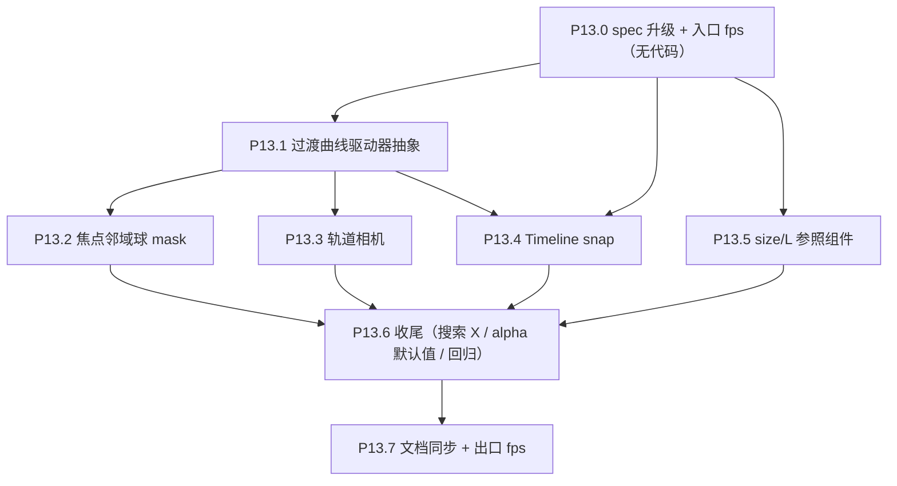

# Phase 13 — Focus 态体验重构

> 接 Phase 12 搜索基础设施的状态。本 Phase 不动数据契约，但会**第一次破例打破 `GALAXY_CAMERA_EULER` 恒定约束**（仅 focus 态），引入新 `uSelectionMode=2` 通道，扩 store 与 transition driver 基础设施。

## 范围

- 子节点：P13.0 → P13.7
- 数据契约：**不变**
- 渲染管线：`uSelectionMode` 取值集扩为 `{0,1,2}`，新增 store 字段 `focusNeighborRadius` / `focusNeighborIds` / `focusOrbit: { yaw, pitch }`（无 r — 见 D4）
- 相机契约：focus 态启用轨道相机；进入/退出 focus 期间走 quaternion slerp
- 状态机契约：`focus` 态新增「邻域 active 子集」与「轨道相机」两个语义维度
- 涉及文件（预计）：
  - 新建 `frontend/src/three/transitionDriver.ts`（P13.1 基础设施）
  - 新建 `frontend/src/three/focusNeighborMask.ts`（P13.2 邻域计算 + 写 mask）
  - [frontend/src/three/scene.ts](frontend/src/three/scene.ts)（applySelectionFrame 重构、Timeline snap、orbit 集成、focus mask 同步）
  - [frontend/src/three/camera.ts](frontend/src/three/camera.ts)（轨道相机控制器分支）
  - [frontend/src/three/interaction.ts](frontend/src/three/interaction.ts)（focus 邻域 pick set 接入）
  - [frontend/src/three/screenRadius.ts](frontend/src/three/screenRadius.ts)（`getSelectionMaskPickSet` 扩 mode=2 / focus 邻域）
  - [frontend/src/three/galaxyMeshes.ts](frontend/src/three/galaxyMeshes.ts)（uSelectionMode 取值文档；shader 内 mode≥1 时统一用 mask）
  - [frontend/src/store/galaxyInteractionStore.ts](frontend/src/store/galaxyInteractionStore.ts)（store 字段扩充）
  - 新建 `frontend/src/three/FocusSizeReferenceRings.ts`（P13.5 size 参照圆环）
  - 新建 `frontend/src/hud/FocusLReference.tsx`（P13.5 L 参照指针）
  - [frontend/src/components/SearchBar.tsx](frontend/src/components/SearchBar.tsx)（X 按钮同步清 selectedMovieId）
  - [frontend/src/components/Timeline.tsx](frontend/src/components/Timeline.tsx)（snap 视觉同步；如有需要）
  - [docs/project_docs/星球状态机 spec.md](docs/project_docs/星球状态机%20spec.md) §3.4
  - [docs/project_docs/TMDB 电影宇宙 Tech Spec.md](docs/project_docs/TMDB%20电影宇宙%20Tech%20Spec.md) §1.4.1 / §1.4.2 / §1.4.3 / §1.4.4 / §1.5
  - [docs/project_docs/TMDB 电影宇宙 Design Spec.md](docs/project_docs/TMDB%20电影宇宙%20Design%20Spec.md) §2.2
  - [docs/project_docs/视觉参数总表.md](docs/project_docs/视觉参数总表.md)
  - [docs/project_docs/TMDB 电影宇宙 PRD.md](docs/project_docs/TMDB%20电影宇宙%20PRD.md) §3.1 层级二（focus 邻域探索的 PRD 描述）
  - [docs/benchmarks/Phase 8 基线 P8.0 性能与 P8.4 准入.md](docs/benchmarks/Phase%208%20基线%20P8.0%20性能与%20P8.4%20准入.md)（P13 入口/出口 fps）

## 执行顺序




依赖说明：

- **P13.0** 必须先行：明确 `uSelectionMode=2` 语义、轨道相机相机契约破例、`focus×select` 嵌套时 mask 行为，否则 P13.2 / P13.3 会返工
- **P13.1** 是 P13.2 / P13.3 / P13.4 / P13.5 的共同基础设施（统一 progress 驱动）
- **P13.2 / P13.3 / P13.4 / P13.5** 之间无强依赖，可并行实施
- **P13.6** 在所有功能落地后做收尾扫参 + 回归

---

## P13.0 spec 升级 + 入口 fps（无代码）

### 状态机 spec §3.4 增补

新增 §3.4.5 「focus 态周边邻域 active」：

- `uSelectionMode = 2` 时，shader 内 `inFocus` 与 mode=1 行为一致（按 `uSelectionMask` 采样覆盖条带 inFocus），区别在 CPU 写 mask 来源
- 邻域定义：以焦点电影 world 位置为球心、`focusNeighborRadius` 为半径，欧氏距离 `<= R` 的所有 movies → mask 内
- `focusNeighborRadius` 默认值：**TBD（Leva 扫参后定）**，初值建议 `5` world units
- 退出 focus → 邻域 mask 清空、`uSelectionMode` 回 0（idle）或 1（如有 person/genre select）

新增 §3.4.6 「focus 态轨道相机」：

- `selected` phase 期间，`GALAXY_CAMERA_EULER` 恒定约束**破例失效**
- 相机位置 = `pivot + offset(yaw, pitch)`；半径恒为 `FOCUS_PERLIN_CAMERA_STANDOFF`（**不可拖动 / 不可滚轮调整**，因 Perlin 球屏幕尺寸严格映射 vote_count）
- 朝向恒为 `lookAt(pivot)`
- `selecting` / `deselecting` 走 `transitionDriver` 同时插值 position（lerpVectors）与 quaternion（slerp）
- `idle` 阶段恢复 `GALAXY_CAMERA_EULER`，`focusOrbit` store 字段（yaw / pitch）重置为 0

修订 §3.4 表「focus」行：「点空白退出」语义**删除**；退出路径仅 ESC / Drawer 关闭按钮 / 搜索 X 按钮（与 Design Spec §4.6 一致）。

### Tech Spec §1.4 增补

- §1.4.2 加红线例外：「`GALAXY_CAMERA_EULER` 恒定」**仅在 `selectionPhase === 'idle'`** 成立；focus 态轨道相机为 Phase 13 起的设计正案
- §1.4.3 滚轮行为表新增 focus 态行：focus 态滚轮 **noop**（不响应；不动 `zCurrent` / `camera.position.z` / `focusOrbit`）。理由：相机到 Perlin 球距离严格 = `FOCUS_PERLIN_CAMERA_STANDOFF`，使 Perlin 球屏幕尺寸严格表达 `vote_count`
- §1.4.1 「Timeline 等效读数」改为：`bridgeZ = zCurrent`（去除 `selectionPhase==='idle'` 二分支；理由：进 focus 时 zCurrent 已 snap 到 movie.z）
- §1.5 拾取 `uSelectionMode=2` 行：`getSelectionMaskPickSet` 在 `selectedMovieId !== null` 时返回 focus 邻域集合（与 search mask 互斥优先）

### Design Spec §2.2 增补

- 进入 focus 时 Timeline 同步指向焦点电影年份；退出 focus 后 zCurrent 留在 movie.z（不回退）
- 「环境景深重构」一段保留，但补充：focus 态周边邻域 active 球可见可拾取

### 视觉参数总表 §1 / §2 增补

- §1 标注 focus 态相机距离恒为 `FOCUS_PERLIN_CAMERA_STANDOFF=1`（轨道相机半径不可调）；`focusNeighborRadius` 默认值
- §2 `uSelectionMode` 取值集 `{0,1,2}` 与各自语义；轨道相机由 store `focusOrbit.{yaw,pitch}` 驱动（非 GPU uniform）
- §6 store 默认值：`focusNeighborRadius=5`，`focusNeighborIds=null`，`focusOrbit={yaw:0,pitch:0}`（不含 r）

### PRD §3.1 增补

- 层级二「深度档案检视」加一句：进入 focus 后用户可拖动旋转视角观察焦点星与周围邻域影片，点击周边 active 切换 focus
- §4 未来计划保留不变（数据管线已锁定 Phase 18）

### P13.0 决策表（已锁定 · 写入 spec）


| #   | 决策项                                       | 选定方案                                 | 备注                                                                                                                                                                      |
| --- | -------------------------------------------- | ---------------------------------------- | ------------------------------------------------------------------------------------------------------------------------------------------------------------------------- |
| D1  | focus × person/genre select 嵌套时 mask 行为 | **A — focus 邻域 mask 替换 search mask** | 退出 focus 后 RAF 检测 `selectedMovieId === null && searchMode in {person,genre}` → 自动恢复 search mask                                                                  |
| D2  | Timeline snap 是瞬时还是渐变                 | **渐变**                                 | 与相机飞入共用 `focusDriver.progress`；deselecting 时 zCurrent 不再回退（"stay at movie.z"）                                                                              |
| D3  | focusNeighborRadius 默认值                   | **5 world units（初值，待扫参收口）**    | Leva `__galaxy.focusNeighborRadius` 暴露；P13.6 决定最终默认值并写回 store                                                                                                |
| D4  | focus 态滚轮行为                             | **noop（不响应）**                       | Perlin 球屏幕尺寸严格映射 `vote_count`，相机与焦点星距离恒为 `FOCUS_PERLIN_CAMERA_STANDOFF=1`；不允许 dolly 改变此距离。`focusOrbit` 仅含 `{yaw, pitch}`，**无 `r` 字段** |


### Phase 8 基线入口

- 在末尾加 `## P13.0 入口` 节，重跑 P8.0.1 三片段（**重点 focus 片段**作为 P13 主战场）

---

## P13.1 过渡曲线驱动器抽象（基础设施）

**目标**：把 `scene.ts` `applySelectionFrame` 内零散的 `easeOutCubic(t)` 抽到通用驱动器，所有需要"focus 进出 0→1 渐变"的通道统一订阅同一 progress；后续 P13.2/P13.3/P13.4/P13.5 直接挂入。**本子 phase 不改任何视觉行为**——焦点进入/退出动画的现有时序（700/450ms + easeOutCubic）保持 1:1。

### 接口设计

新建 `frontend/src/three/transitionDriver.ts`：

```ts
export type EasingFn = (t: number) => number
export const easeOutCubic: EasingFn = (t) => 1 - Math.pow(1 - Math.min(1, Math.max(0, t)), 3)

export interface TransitionDriver {
  /** 当前进度 [0, 1]（已 ease） */
  readonly progress: number
  /** 是否处于活动状态（progress 是否在 0/1 端点） */
  readonly active: boolean
  /** 启动一次 0→1 过渡 */
  start(durationMs: number, options?: { easing?: EasingFn; onDone?: () => void }): void
  /** 启动一次 1→0 过渡（当前 progress 起点反向） */
  reverse(durationMs: number, options?: { easing?: EasingFn; onDone?: () => void }): void
  /** 立即跳到 endpoint（不走动画） */
  setImmediate(value: 0 | 1): void
  /** RAF 内调用，根据 now 推进 progress */
  tick(nowMs: number): void
}

export function createTransitionDriver(): TransitionDriver { ... }
```

### scene.ts 重构

- `applySelectionFrame` 内的 `selecting / deselecting` 分支用同一 `focusDriver` 实例：
  - `beginSelect` → `focusDriver.start(SELECT_MS)`
  - `beginDeselect` → `focusDriver.reverse(DESELECT_MS)`
  - `selected` → `focusDriver` 维持 `progress=1`
  - `idle` → `focusDriver` 维持 `progress=0`
- 现有挂载点改为读 `focusDriver.progress`：
  - `camera.position.lerpVectors(fromCam, toCam, progress)`
  - `uFocusCameraBlend.value = progress`
  - 焦点完成 / 退出完成时分别 `uFocused.value = pendingIdx / -1`、`planet.mesh.visible = true / false`、`uAlpha = 1 / 0`

### 验收

- focus 进入 700ms / 退出 450ms 节奏与现状完全一致（用 console.log timestamp 抽样比对）
- `__galaxyColor.focusNonTargetActiveAlpha` 跨 progress 变化曲线与现状 1:1
- 任何视觉回归 = 失败

---

## P13.2 焦点邻域球 active mask

**目标**：focus 态把 viswindow 条带激活 → 替换为以焦点星为中心、半径 R 的球形邻域激活。

### CPU 计算

新建 `frontend/src/three/focusNeighborMask.ts`：

```ts
/** O(n) 邻域 ids；focus 切换 / R 调整 时调用一次。 */
export function computeFocusNeighborIds(
  movies: Movie[],
  pivot: { x: number; y: number; z: number },
  radius: number,
): number[] {
  const r2 = radius * radius
  const out: number[] = []
  for (const m of movies) {
    const dx = m.x - pivot.x
    const dy = m.y - pivot.y
    const dz = m.z - pivot.z
    if (dx*dx + dy*dy + dz*dz <= r2) out.push(m.id)
  }
  return out
}
```

### Store 扩充

[galaxyInteractionStore.ts](frontend/src/store/galaxyInteractionStore.ts)：

- 新增 `focusNeighborRadius: number`（默认 `5`）
- 新增 `focusNeighborIds: number[] | null`（缓存计算结果，避免每帧重算）
- `clearSearch()` 不动 focus 邻域（focus 与 search 独立）

### scene.ts 集成

- `beginSelect(movie)` 内调 `computeFocusNeighborIds` → `setState({ focusNeighborIds })`
- 订阅 `focusNeighborRadius` 变化 → 重算
- RAF tick 决定 `uSelectionMode`：

```ts
  const mode =
    selectedMovieId !== null ? 2 :          // focus → 邻域 mask
    (searchMode === 'person' || 'genre') ? 1 : // search → search mask
    0                                        // idle → 条带
  

```

- mask atlas 写入：mode=2 时写 `focusNeighborIds`，mode=1 时写 `selectionIds`，mode=0 时清零

### Shader

[galaxyIdle.vert.glsl](frontend/src/three/shaders/galaxyIdle.vert.glsl) / [galaxyActive.vert.glsl](frontend/src/three/shaders/galaxyActive.vert.glsl)：

- 现有 `if (uSelectionMode == 1)` 分支扩为 `if (uSelectionMode >= 1)` 即可——mode=1/2 行为一致，区别在 CPU 写 mask
- **不改 shader**（仅文档说明 mode=2 含义）

### 拾取 / 连线

- [screenRadius.ts](frontend/src/three/screenRadius.ts) `getSelectionMaskPickSet`：

```ts
  if (selectedMovieId !== null && focusNeighborIds) return new Set(focusNeighborIds)
  if (searchMode === 'person' || 'genre') return new Set(selectionIds)
  return null
  

```

- 焦点星本身在双 mesh 上 sActive=0（已 P11 实装），不参与拾取；`focusPlanetBeatsActiveAlongRay` 的"焦点优先"路径继续生效
- 连线（人名）：focus 嵌套 person select 时按 D1 决策处理（建议 A：focus 期间隐藏连线，退出 focus 后恢复 — 已是当前行为）

### 验收

- 进入 focus 后周围 R 内的影片可见（active alpha 0.1，可调）、可 hover、可点击切换 focus
- 退出 focus 后邻域恢复 viswindow 条带
- 性能：60K × 一次邻域计算 ~5ms（实测后填入 P13.7 出口）

---

## P13.3 focus 态轨道相机（破例）

**目标**：focus 态用户可拖动绕焦点星旋转视角；退出 focus 时相机朝向自动 slerp 回 `GALAXY_CAMERA_EULER`。

### 控制器设计

[camera.ts](frontend/src/three/camera.ts) 扩 `attachGalaxyCameraControls` options：

- 新增 `getCameraMode?: () => 'macro' | 'orbit'`：scene.ts 提供（`selectionPhase === 'selected'` ? 'orbit' : 'macro'`）
- 新增 `getOrbitPivot?: () => Vector3 | null`：scene.ts 提供焦点电影 world position

`onPointerMove` 分支：

```ts
if (mode === 'orbit' && pivot) {
  // 改 store.focusOrbit.yaw / pitch；半径不变
  const dyaw = -dx * ORBIT_YAW_SPEED
  const dpitch = -dy * ORBIT_PITCH_SPEED
  setOrbit({ yaw: y + dyaw, pitch: clamp(p + dpitch, -PI/2 + 0.05, PI/2 - 0.05) })
} else {
  // 现有 truck/pedestal
}
```

`onWheel` 分支：focus 态 **noop**（D4 决策）：

```ts
if (mode === 'orbit') {
  // 不响应：相机半径恒为 FOCUS_PERLIN_CAMERA_STANDOFF；保证 Perlin 球屏幕尺寸严格映射 vote_count
  e.preventDefault()
  return
} else if (macro) { /* 现有 zCurrent 写入 */ }
```

### 相机更新（scene.ts RAF tick）

```ts
if (selectionPhase === 'selected') {
  const { yaw, pitch } = focusOrbit
  const r = FOCUS_PERLIN_CAMERA_STANDOFF // 恒定，D4
  const pivot = movies[pendingSelectInstanceIndex] // x,y,z
  const cosP = Math.cos(pitch), sinP = Math.sin(pitch)
  camera.position.set(
    pivot.x + r * cosP * Math.sin(yaw),
    pivot.y + r * sinP,
    pivot.z - r * cosP * Math.cos(yaw),  // yaw=0,pitch=0 时 = pivot.z - r（与现 setFocusCameraPosition 一致）
  )
  camera.lookAt(pivot.x, pivot.y, pivot.z)
}
```

### 进入 / 退出动画（接 P13.1 driver）

- **进入 focus**：现有 `selecting` lerpVectors 飞入到 `toCam`（相机朝向仍 `GALAXY_CAMERA_EULER`）；`selected` 抵达后才允许 orbit 拖拽
- **退出 focus**：`deselecting` 走 lerpVectors 回 `restCam`，**同时** quaternion slerp `from = currentQuaternion → to = GALAXY_CAMERA_EULER quaternion`，二者共用 `focusDriver.progress`
- 实现：`fromQuat = camera.quaternion.clone()` 在 `beginDeselect` 时 snapshot；`toQuat = new Quaternion().setFromEuler(GALAXY_CAMERA_EULER)`；tick 内 `camera.quaternion.slerpQuaternions(fromQuat, toQuat, progress)`

### 「点空白退出 focus」的删除

- 当前实现：检视 `interaction.ts` `onWindowPointerUp`：拾取空 → `setSelectedMovieId(null)`
- 改：focus 态下空命中 = 拾取无对象 = 不动 selection（保留 focus）
- 改造点：`onWindowPointerUp` 内 `if (selectedMovieId !== null && pickedActive === null && !focusPlanetBeats) return`（即不写 null 也不切换）；只有点中其他 active 才切焦点

### 验收

- focus 态拖拽 → 相机绕焦点星旋转，焦点星始终在屏幕中心附近，且离相机距离恒为 `FOCUS_PERLIN_CAMERA_STANDOFF`
- focus 态滚轮 → 无响应（不动相机、不动 zCurrent、不动 orbit）；console 抽样可见 `e.preventDefault()` 调用、无 store 写入
- 切换不同焦点电影时 Perlin 球屏幕尺寸严格反映 `vote_count` 对数尺度（相机距离恒定 → vote 大小直接可比）
- 退出 focus → 相机位置 + 朝向同步插值回 macro 配置
- 点空白处 → 不退出 focus；ESC / Drawer 关闭 / 搜索 X 仍可退出

---

## P13.4 Timeline snap 到 movie.z

**目标**：进入 focus 时 Timeline 指针随相机同步指向焦点电影年份；退出后留在 movie.z（"stay" 决策）。

### 实施

[scene.ts](frontend/src/three/scene.ts)：

- `beginSelect` 末尾：snapshot `prevZCurrent`，**不**立即写 `zCurrent`；改用 driver
- RAF tick 内：

```ts
  if (selectionPhase === 'selecting' || 'deselecting') {
    // 与相机飞入同曲线
    const targetZ = selectionPhase === 'selecting' ? movie.z : prevZCurrent_isUnneeded_useMovieZ
    const z = lerp(zStartSnapshot, targetZ, focusDriver.progress)
    useGalaxyInteractionStore.setState({ zCurrent: z })
  }
  

```

  实际"stay" 语义：

- selecting：`zStartSnapshot = prev zCurrent` → `targetZ = movie.z`
- deselecting：起点 `movie.z` → 终点 `movie.z`（不动）；即 deselecting 不再改 zCurrent
- `bridgeZ` 简化为 `bridgeZ = st.zCurrent`（去掉 `selectionPhase==='idle' ? ... : ...` 二分支）

### Timeline.tsx 视觉

- 现有逻辑读 `bridgeZ` 显示指针，无需改动
- 进入 focus 时指针随相机同步移动到 focus 年份，体验自然

### 验收

- 点击 1995 年电影 → Timeline 指针在 700ms 内平滑滑到 1995 年并停住
- 退出 focus → 指针留在 1995 年（不回退）
- 后续滚轮（`selectionPhase==='idle'`）从 1995 年起继续穿梭

---

## P13.5 focus 态 size/L 参照组件

**目标**：focus 态显示两组独立的视觉编码参照组件，让用户能"读懂"焦点星球大小与亮度的语义；如本节与早期 P13.0 描述冲突，以本节为准。

### 内容设计

- **Size 参照组件**：围绕 Perlin 球绘制 5 个圆环
  - vote_count 档位：`[10, 100, 1k, 10k, 100k]`
  - 5 个圆环与 Perlin 球同圆心、同一平面；圆环整体平面角度按当前 `movie.id` 做 seed 生成固定随机姿态，确保同一电影每次加载角度一致
  - 每个圆环半径（或直径）分别等于 10 / 100 / 1k / 10k / 100k votes 在当前 Perlin 球 sizing 公式下对应的星球半径（或直径）；实现时必须复用/抽出 size 映射函数，避免与 Perlin 球实际尺寸漂移
  - 每个圆环在相应圆周上标注 `10` / `100` / `1k` / `10k` / `100k`；标签跟随圆环显示，保持可读，不遮挡焦点星主体
  - 5 个圆环跟随 Perlin 球显示 / 隐藏：进入 focus 时随 Perlin 球淡入，退出 focus 时同步淡出或隐藏；切换焦点电影时圆心与随机姿态随新电影更新
- **L 参照组件**：仅用指针指向当前星球的 L
  - 保留 0–10 评分到 OKLab L 的参照语义，但不在上方写 `Rating 0 → 10`
  - 颜色：固定 hue = 焦点电影 `movie.genre_hue`（或回退 `genreHueForGenreName(genres[0])`），L 沿 X 由 `mix(uLMin, uLMax, voteNorm)` 应用 P10.1 压缩 + pow 公式
  - 指针位置由当前焦点电影 `vote_average` 映射得到，指针指向对应 L 值；可保留底部或侧边刻度/渐变作为参照，但标题文本必须删除
  - 位置：HUD 正下方（与 InfoButton / Timeline 不互相遮挡）

### 实施

拆成两个组件实施：

- 新建 `frontend/src/three/FocusSizeReferenceRings.ts`（或同等命名）：管理 5 个 Three.js ring/line mesh + label sprite/CSS2D label；props/inputs 至少包含 `movie`, `focusDriver.progress`, `perlinSphereCenter`, `perlinSphereVisible`
- 新建 `frontend/src/hud/FocusLReference.tsx`：只负责 L 参照与当前 L 指针；props: `movie: Movie | null`（焦点电影；为 null 不渲染）
- size 映射：抽出或复用 Perlin 球现有 vote_count → 半径/直径函数；实现后用 `assert` 校验 5 档映射为严格递增，避免 ring 半径异常或单位不一致
- 随机角度：新增纯函数 `seededRingOrientation(movie.id)`，用 movie id seed 生成稳定伪随机 yaw/roll（或 quaternion），同一电影跨刷新结果一致；切换电影后按新 id 更新
- 圆环生命周期：在 `scene.ts` focus 进入 / 退出与 Perlin 球 `visible` / alpha 通道同步；`focusDriver.progress` 驱动圆环材质 opacity，退出完成后隐藏或 dispose 临时对象
- L 颜色计算：复用 [frontend/src/utils/genreHue.ts](frontend/src/utils/genreHue.ts) 的 `genreHueForGenreName`；抽出一个 lib `frontend/src/lib/colorMath.ts`（或 `lib/oklch.ts`），把 P10.1 公式 + OKLab→sRGB 移到 TS（与 GLSL 同公式），供 `FocusLReference` 消费

### 验收

- focus 态 Perlin 球周围出现 5 个同圆心、同一平面的圆环；退出 focus 时 5 个圆环随 Perlin 球同步隐藏
- 5 个圆环大小分别对应 10 / 100 / 1k / 10k / 100k votes 的星球大小，半径（或直径）严格递增，且与 Perlin 球实际 size 映射一致
- 圆环平面角度对同一 `movie.id` 稳定；刷新页面或重新进入同一电影 focus 后角度一致，切换到不同电影后可变化
- 每个圆环有对应 `10` / `100` / `1k` / `10k` / `100k` 标注，标注在对应圆环上且可读
- L 参照不显示 `Rating 0 → 10` 标题；仅用指针准确指向当前焦点星球的 L，切换不同 `vote_average` 的电影时指针位置更新
- L 参照颜色随焦点电影 genre0 hue 变化（点不同电影 hue 切换）

---

## P13.6 收尾（搜索 X / alpha 默认值 / 回归）

### 6a. 搜索 X 同步清 selectedMovieId

[components/SearchBar.tsx](frontend/src/components/SearchBar.tsx)：

- X 按钮 onClick 改为：`clearSearch()` + `setState({ selectedMovieId: null })`
- 与 ESC §4.6 第 3 级 + 第 4 级一次完成（避免用户按 X 后还得再按 ESC 退出 focus）

### 6b. uFocusNonTargetActiveAlpha 默认值扫参

- 当前默认 `0.1`，P13.2 邻域球点亮后周围 active 增多，可能视觉过吵
- 在浏览器内通过 `__galaxyColor.focusNonTargetActiveAlpha` 扫 `0.05 / 0.08 / 0.10` 三档抽样
- 决定后写回 [galaxyMeshes.ts](frontend/src/three/galaxyMeshes.ts) 默认值

### 6c. 回归清单

- focus 进入 → orbit 拖拽 → 切换到周边 active → orbit 仍可拖拽（pivot 切换）
- focus 进入 → ESC → 全部状态恢复（mask 清、orbit 重置、Timeline 留 movie.z）
- person select → 点其中一颗 → focus 嵌套 → ESC 仅退 focus、保留 select（mask 由邻域回到 person）
- genre select → focus 嵌套（同上）
- hover ring 在 focus 邻域上正确显示
- Drawer 关闭按钮、搜索 X、ESC 三种退出路径行为一致

---

## P13.7 文档同步 + 出口 fps

- [星球状态机 spec.md](docs/project_docs/星球状态机%20spec.md) §3.4.5 / §3.4.6 / §3.6 / 变更记录追加 Phase 13 行
- [视觉参数总表.md](docs/project_docs/视觉参数总表.md) §1 / §2 / §6 同步
- [Tech Spec.md](docs/project_docs/TMDB%20电影宇宙%20Tech%20Spec.md) §1.4 / §1.5 红线例外补丁
- [Design Spec.md](docs/project_docs/TMDB%20电影宇宙%20Design%20Spec.md) §2.2 / §3.1 同步
- [PRD.md](docs/project_docs/TMDB%20电影宇宙%20PRD.md) §3.1 层级二补充
- [Phase 8 基线](docs/benchmarks/Phase%208%20基线%20P8.0%20性能与%20P8.4%20准入.md) 加 `## P13 出口` 节，重跑三片段（focus 邻域球 mask × orbit × transition driver 综合开销）
- 每个子 phase 一份实施报告（沿用 Phase 11/12 命名格式）

---

## 风险与回滚预案


| 风险                                                         | 影响 | 缓解                                                                                  |
| ------------------------------------------------------------ | ---- | ------------------------------------------------------------------------------------- |
| 轨道相机与 `GALAXY_CAMERA_EULER` 红线冲突影响其他 Phase 假设 | 中   | spec §3.4.6 明确 "仅 selectedphase"；deselect 走 quaternion slerp 完整恢复            |
| focus 邻域球计算每次切换 60K × O(n) ~5ms                     | 低   | 仅在 selecting / R 变化时算；非 RAF                                                   |
| Timeline snap 渐变与相机飞入不同步会出现 Z 跳变              | 低   | 共用 `focusDriver.progress` 标量；P13.1 收口后 1:1                                    |
| size 参照图例公式与 GPU 不一致                               | 低   | 抽 SSOT TS lib，同时给 shader 与 HUD 消费；vitest 校对一组样本                        |
| focus×person/genre select 嵌套 mask 行为决策 (D1) 反复       | 中   | P13.0 写死决策 A（替换语义）；如需 B 后续再开 phase                                   |
| 删除"点空白退出"导致用户误操作不知如何退出                   | 中   | 三条退出路径（ESC / Drawer / 搜索 X）保留；Drawer 关闭按钮做视觉强化（Phase 14 顺手） |


## 出口准入

- 所有 P13.0–P13.7 todos `completed`
- focus 进入 / 退出 / 切换三场景手测通过
- Phase 8 基线 P13 出口 fps ≥ 入口 - 5%（容差）
- 三份项目 spec 与代码一致；变更记录有 Phase 13 行

