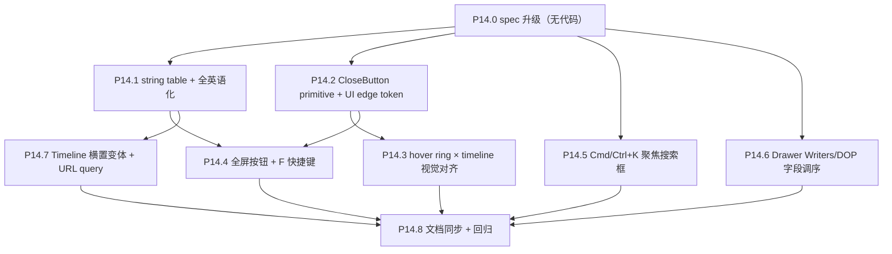

# Phase 14 — HUD/UI 抛光

> 接 Phase 13（focus 体验重构）。本 Phase **不动**渲染管线、数据契约、状态机；仅在 React/HUD 层做工程化抽象与样式统一。所有改动都应可在 Storybook 内独立验收。

## 范围

- 子节点：P14.0 → P14.8
- 数据契约：**不变**
- 渲染管线：**不变**
- 涉及文件（预计）：
  - 新建 `frontend/src/lib/strings.ts`（string table SSOT）
  - 新建 `frontend/src/components/ui/close-button.tsx`（CloseButton primitive）
  - 新建 `frontend/src/hud/FullscreenButton.tsx`
  - [frontend/src/components/Loading.tsx](frontend/src/components/Loading.tsx)（英语化）
  - [frontend/src/App.tsx](frontend/src/App.tsx)（错误页英语化 + Cmd/Ctrl+K + F 全局 keydown 接入）
  - [frontend/src/components/Drawer.tsx](frontend/src/components/Drawer.tsx)（英语化 + 字段调序 + 接 CloseButton）
  - [frontend/src/components/MovieTooltip.tsx](frontend/src/components/MovieTooltip.tsx)（英语化）
  - [frontend/src/components/SearchBar.tsx](frontend/src/components/SearchBar.tsx)（placeholder 英语化 + X 接 CloseButton）
  - [frontend/src/components/Timeline.tsx](frontend/src/components/Timeline.tsx)（接 `orientation` prop + URL query 钩子）
  - [frontend/src/hud/InfoButton.tsx](frontend/src/hud/InfoButton.tsx) / [InfoModal.tsx](frontend/src/hud/InfoModal.tsx) / [infoCopy.ts](frontend/src/hud/infoCopy.ts)（英语化）
  - [frontend/src/hud/HoverRing.tsx](frontend/src/hud/HoverRing.tsx) / [hoverRingLayout.ts](frontend/src/hud/hoverRingLayout.ts)（接 UI edge token）
  - [frontend/src/hooks/useThemeFromQuery.ts](frontend/src/hooks/useThemeFromQuery.ts)（参照模式新建 `useTimelineOrientationFromQuery`）
  - [frontend/src/index.css](frontend/src/index.css)（UI edge design token）
  - [docs/project_docs/TMDB 电影宇宙 Design Spec.md](docs/project_docs/TMDB%20电影宇宙%20Design%20Spec.md) §3 / §3.1 / §3.4 同步
  - [docs/project_docs/视觉参数总表.md](docs/project_docs/视觉参数总表.md) §7 / §7a 同步 token
  - 各组件的 `*.stories.tsx`（双 orientation / 多 variant）

## 决策表（已锁定）

| #   | 决策项                | 选定方案                                                                                                                                 | 备注                                                      |
| --- | --------------------- | ---------------------------------------------------------------------------------------------------------------------------------------- | --------------------------------------------------------- |
| D1  | 全英语化实现策略      | **string table 常量表（不接 i18n 框架）**                                                                                                | 文件 `frontend/src/lib/strings.ts`，未来可作 en.json 种子 |
| D2  | Timeline 横置交付形态 | **横置 + 纵置双变体共存**，URL `?timeline=horizontal\|vertical` 切换；默认沿用现有纵置                                                   | 后续 A/B 评估再决最终形态                                 |
| D3  | 键盘快捷键集合        | **F = 全屏 + Cmd/Ctrl+K = 聚焦搜索框**（不上单 `/` 键避免与文本输入冲突）                                                                | ESC 焦点栈维持 Phase 12.8 §4.6                            |
| D4  | 关闭按钮共用粒度      | **primitive + token 双管齐下**：抽 `CloseButton` 组件（variants）+ 抽 UI edge CSS token（hover ring / timeline / close button 视觉对齐） |                                                           |

## 执行顺序



依赖说明：
- **P14.0** 先行：明确 string table 命名空间、token 命名、Timeline orientation prop 形态
- **P14.1 / P14.2** 是 cross-cutting 基础设施，先做后续 P14.3–P14.7 都受益
- **P14.3** 视觉对齐依赖 P14.2 token 落地
- **P14.4** 同时用 string table（按钮 aria-label / 提示）与 CloseButton 风格的 IconButton primitive
- **P14.5 / P14.6** 独立小改，可与 P14.1 / P14.2 并行
- **P14.7** Timeline 双变体只用 string table（年份本身无需翻译，但 aria-label 走 strings）

---

## P14.0 spec 升级（无代码）

### Design Spec §3 增补

- §3 头部声明：HUD 文案 SSOT 在 `frontend/src/lib/strings.ts`，所有文字字面量须来自该表；不在组件内写死字面量（除一次性 dev-only console.log）
- §3.1 Timeline 节加「**orientation 双变体**」子节：`vertical`（默认 / 现状）/ `horizontal`（底部居中、刻度朝下）；URL `?timeline=horizontal` 切换；二者外观规则与刻度算法共享
- §3.x（新增）「Close 控件 primitive」：`CloseButton` variants `default` / `ghost-sm` / `ghost-lg`；图标 `lucide-react X`；颜色与线宽来自 UI edge token
- §3.x（新增）「键盘快捷键」节：
  - **F** → toggle fullscreen（焦点不在 input 时生效）
  - **Cmd/Ctrl+K** → 聚焦搜索框（搜索 disabled 时 noop；与文本输入不冲突）
  - **Esc** → 维持 §4.6 焦点栈
- §3.4 加 dev / 验收章节末尾备注：UI 主体英语；中文仅出现在项目文档与 console.log（开发审计用）

### 视觉参数总表 §7 / §7a 增补

- §7 hover 环：HOVER_RING_STROKE_PX 与 timeline 主线 / CloseButton 边框统一来自 `--ui-edge-stroke-width`（默认 `1px`）；颜色统一 `--ui-edge-color`（详见 §7a）
- 新增 §7a 「UI edge tokens」：
  - `--ui-edge-color: rgb(var(--foreground) / 0.45)`（hover ring / timeline 主线 / close button 普通态）
  - `--ui-edge-color-strong: rgb(var(--foreground) / 0.7)`（hover / focus 强调）
  - `--ui-edge-stroke-width: 1px`
  - 落点：`frontend/src/index.css` `:root` 与 `.dark`

### 状态机 spec / Tech Spec / PRD

- 不变（P14 不动渲染语义）

---

## P14.1 string table + 全英语化

### 目标

抽出全 HUD 文字字面量到 `frontend/src/lib/strings.ts`，并把现存中文字面量替换为英语 STRINGS.xxx 引用；**不引 i18n 框架**（react-i18next 等），未来若需多语言，本表可直接作为 `en.json` 种子。

### 实施步骤

1. **审计**：rg 扫一遍 `frontend/src/**/*.{ts,tsx}` 中含中文字符 `[\u4e00-\u9fff]+` 的字面量（排除 console.log / 注释 / 文档）；常见命中位置：
   - [Loading.tsx](frontend/src/components/Loading.tsx) 三阶段「下载/解压/解析」
   - [App.tsx](frontend/src/App.tsx) 错误页「Could not load galaxy data」/「重试」/「本地开发：…」
   - [InfoModal.tsx](frontend/src/hud/InfoModal.tsx) / [infoCopy.ts](frontend/src/hud/infoCopy.ts)
   - [Drawer.tsx](frontend/src/components/Drawer.tsx) 区块标题（Cast / Writers / Producers …）
   - [MovieTooltip.tsx](frontend/src/components/MovieTooltip.tsx)
   - [SearchBar.tsx](frontend/src/components/SearchBar.tsx) placeholder（Phase 16 会补三档专属，本 Phase 仅放泛用 placeholder）

2. **strings.ts 结构**：
   ```ts
   export const STRINGS = {
     loading: {
       title: 'Loading galaxy data',
       phaseDownload: 'Download',
       phaseDecompress: 'Decompress',
       phaseParse: 'Parse',
     },
     error: {
       title: 'Could not load galaxy data',
       retry: 'Retry',
       localDevHint: 'Local dev: run the Python pipeline to generate ...',
     },
     drawer: {
       cast: 'Cast',
       director: 'Director',
       directorOfPhotography: 'Director of Photography',
       writers: 'Writers',
       producers: 'Producers',
       musicComposer: 'Music Composer',
       overview: 'Overview',
       tagline: 'Tagline',
       releaseDate: 'Release date',
       runtime: 'Runtime',
       budget: 'Budget',
       revenue: 'Revenue',
       genres: 'Genres',
       countries: 'Production countries',
       companies: 'Production companies',
       languages: 'Spoken languages',
       imdb: 'IMDb',
       tmdb: 'TMDB',
     },
     searchBar: {
       placeholder: 'Search…',
       clear: 'Clear',
       noResults: 'No results',
     },
     hud: {
       openInfo: 'Info',
       toggleFullscreen: 'Toggle fullscreen (F)',
       focusSearch: 'Focus search (Cmd/Ctrl+K)',
       close: 'Close',
     },
     timeline: {
       label: 'Timeline (release year)',
     },
   } as const
   ```

3. **替换**：所有命中位置 import STRINGS 后替换；非平凡片段（如错误页 retry hint 含 `<code>` 标签）按 React 组件构造，文案部分仍走 STRINGS。

4. **`infoCopy.ts`**：直接重写为英语版（Phase 9.4 排版规则保留；段落标题与正文同源 typo 不变）。

### 验收

- `rg '[\u4e00-\u9fff]' frontend/src/**/*.{ts,tsx}` 仅在 console.log / 注释 / `*.test.ts` / `*.stories.tsx` mock 数据中命中，非生产 UI
- 三方主流程（loading / error / focus drawer）截图英语完整
- Storybook 各 story 文案英语

---

## P14.2 CloseButton primitive + UI edge design token

### CloseButton primitive

新建 `frontend/src/components/ui/close-button.tsx`：

```tsx
import { X } from 'lucide-react'
import { cva, type VariantProps } from 'class-variance-authority'

const closeBtnVariants = cva(
  'inline-flex items-center justify-center rounded-md transition-colors focus-visible:outline-none focus-visible:ring-1 focus-visible:ring-[--ui-edge-color-strong]',
  {
    variants: {
      variant: {
        default: 'h-8 w-8 border border-[color:var(--ui-edge-color)] hover:border-[color:var(--ui-edge-color-strong)] hover:bg-foreground/5',
        ghostSm: 'h-5 w-5 text-muted-foreground hover:text-foreground',
        ghostLg: 'h-9 w-9 text-muted-foreground hover:text-foreground',
      },
    },
    defaultVariants: { variant: 'default' },
  },
)

export interface CloseButtonProps
  extends React.ButtonHTMLAttributes<HTMLButtonElement>,
    VariantProps<typeof closeBtnVariants> {
  /** Required for a11y; defaults to STRINGS.hud.close */
  label?: string
}

export function CloseButton({ variant, label, className, ...rest }: CloseButtonProps) {
  return (
    <button
      type="button"
      aria-label={label ?? STRINGS.hud.close}
      className={cn(closeBtnVariants({ variant }), className)}
      {...rest}
    >
      <X className="size-3.5" aria-hidden />
    </button>
  )
}
```

### UI edge design token

[frontend/src/index.css](frontend/src/index.css) 在 `:root` 与 `.dark` 内补：

```css
:root {
  --ui-edge-color: rgb(15 23 42 / 0.45);
  --ui-edge-color-strong: rgb(15 23 42 / 0.7);
  --ui-edge-stroke-width: 1px;
}
.dark {
  --ui-edge-color: rgb(255 255 255 / 0.45);
  --ui-edge-color-strong: rgb(255 255 255 / 0.7);
}
```

### 接入点

- [Drawer.tsx](frontend/src/components/Drawer.tsx) 关闭按钮 → `<CloseButton variant="ghostLg" />`
- [SearchBar.tsx](frontend/src/components/SearchBar.tsx) X 按钮 → `<CloseButton variant="ghostSm" label={STRINGS.searchBar.clear} />`（Phase 13 P13.6 已决：onClick 同时清 selectedMovieId）
- 未来全屏退出按钮（如有）也走同 primitive

### 验收

- Drawer 关闭、SearchBar X 视觉一致（除 size variant）；Storybook 三个 variants 各一个 story
- token 修改 `--ui-edge-color` 即可一键调全 HUD edge 色

---

## P14.3 hover ring × timeline 视觉对齐

### 目标

[hud/HoverRing.tsx](frontend/src/hud/HoverRing.tsx) 与 [components/Timeline.tsx](frontend/src/components/Timeline.tsx) 主线 / 刻度的 stroke 宽度与颜色统一来自 P14.2 token；二者放在一起看视觉上「同一个家族」。

### 实施

- [hud/hoverRingLayout.ts](frontend/src/hud/hoverRingLayout.ts) 中 `HOVER_RING_STROKE_PX = 1` 改为读 `--ui-edge-stroke-width`（CSS 注入，不通过 JS 常量）；如必须 JS 常量，在 hud 内部加一层 token 解析
- HoverRing 的 `<svg>` `stroke="var(--ui-edge-color)"` 与 `stroke-width="var(--ui-edge-stroke-width)"`
- Timeline 的 track 主线、刻度线同样切到 `var(--ui-edge-color)` + `var(--ui-edge-stroke-width)`
- hover/focus 增强态用 `--ui-edge-color-strong`

### 验收

- 在 hover state（光标停留某 active 球，hover ring 显示）与 idle Timeline 同屏截图：ring 描边与 timeline 主线在 px 级别同色同宽
- 切 light / dark theme 各看一组（`?theme=light` / `?theme=dark`），token 切换正确

---

## P14.4 全屏按钮 + F 快捷键

### 组件

新建 `frontend/src/hud/FullscreenButton.tsx`：

- 位置：HUD 右上角（与 [InfoButton](frontend/src/hud/InfoButton.tsx) 同列；具体相对位置在 P14.0 spec 内确认 — 建议 InfoButton 左侧）
- 图标：`Maximize` / `Minimize` from lucide
- onClick：`document.fullscreenElement` ? `document.exitFullscreen()` : `document.documentElement.requestFullscreen()`
- 监听 `fullscreenchange` 事件切换 icon
- 兼容 webkit 前缀（Safari）：`(document as any).webkitFullscreenEnabled` 检测
- aria-label = `STRINGS.hud.toggleFullscreen`（包含 "(F)" 提示）

### F 快捷键

[App.tsx](frontend/src/App.tsx) 现有 ESC capture handler 内**新增** F 处理：
- 仅当 `document.activeElement` 不是 input / textarea / contenteditable 时响应
- `e.key === 'f' || 'F'`，preventDefault + 调用 toggle 函数
- 与 ESC 焦点栈不冲突（不同 key）

### 验收

- 点击按钮、按 F → 全屏切换；icon 同步
- 焦点在搜索框时按 F 可输入字母 f（不被 hijack）
- 全屏切换触发 `resize` → 3D 画布正确响应（已在 [scene.ts](frontend/src/three/scene.ts) ResizeObserver 内接管）

---

## P14.5 Cmd/Ctrl+K 聚焦搜索框

### 实施

[App.tsx](frontend/src/App.tsx) ESC capture handler 同位置增加：
- `(e.metaKey || e.ctrlKey) && e.key.toLowerCase() === 'k'`
- preventDefault + stopPropagation
- 找 `document.querySelector('input[data-galaxy-search-input]')` → `focus()`
- 若该 input `disabled`（无搜索索引）→ noop

### 验收

- mac Cmd+K / win Ctrl+K → 搜索框 focus + 全选已有 query 文本
- 已聚焦时再按 Cmd/Ctrl+K → 仍 focus（不报错）

---

## P14.6 Drawer Writers / DOP 字段调序

### 实施

[components/Drawer.tsx](frontend/src/components/Drawer.tsx) 内 「director / writers / cast」之外的六字段当前顺序：`director_of_photography → producers → music_composer → writers`（按现 `Drawer.tsx` 实际 JSX 顺序，需打开文件确认）

调整为用户期望顺序：将 **Writers** 与 **Director of Photography** 位置交换。

具体由 P14.6 实施时按 `Drawer.tsx` 现状确认精准 JSX 节点位置；语义结果是 Writers 出现在 DOP 之前（或反向，按用户当时直觉确认）。

### 验收

- Drawer story 截图新顺序与设计意图一致

---

## P14.7 Timeline 横置变体 + URL query

### 组件改造

[components/Timeline.tsx](frontend/src/components/Timeline.tsx) 接受 prop `orientation: 'vertical' | 'horizontal'`，默认 `'vertical'`：

- **vertical**（现状）：左侧固定，长条上下，刻度朝左
- **horizontal**（新增）：底部固定居中，长条左右，刻度朝下；Z 轴映射方向：左 = `zMin`，右 = `zMax`
- 内部布局 / 刻度 / hover thumb 计算复用 `yearTickList` 等纯函数；仅 SVG 主轴方向变化
- 共用 P14.2 / P14.3 token

### URL query 钩子

新建 `frontend/src/hooks/useTimelineOrientationFromQuery.ts`：

```ts
export function useTimelineOrientationFromQuery(): 'vertical' | 'horizontal' {
  const [o, setO] = useState<'vertical' | 'horizontal'>('vertical')
  useEffect(() => {
    const q = new URLSearchParams(window.location.search).get('timeline')
    if (q === 'horizontal' || q === 'vertical') setO(q)
  }, [])
  return o
}
```

[App.tsx](frontend/src/App.tsx) 调用并传入 `<Timeline orientation={...} />`。

### Storybook

[Timeline.stories.tsx](frontend/src/components/Timeline.stories.tsx) 新增 `Horizontal` story（默认 args 改 orientation='horizontal'）；保留 vertical 默认 story。

### 验收

- 默认 URL → vertical（不 break 现状）
- `?timeline=horizontal` → 底部横置，刻度朝下，可正常显示当前年份指针
- Storybook 双 story 截图存档（Phase 14.8 文档报告引用）

---

## P14.8 文档同步 + 回归

- [Design Spec §3](docs/project_docs/TMDB%20电影宇宙%20Design%20Spec.md) 同步 P14.0 spec 变更
- [视觉参数总表 §7 / §7a](docs/project_docs/视觉参数总表.md) 同步 token
- 全局快捷键节加入 F / Cmd-K（与 ESC §4.6 并列）
- 实施报告 P14.1 / P14.2 / P14.7 各一份（其它子节合并到 Phase 14 总报告）
- 回归清单：
  - Loading / Error 页英语完整
  - Drawer 字段顺序、关闭按钮、Tooltip / SearchBar / InfoModal 英语完整
  - hover ring 与 timeline 同色同宽（dark + light）
  - 全屏按钮 + F 快捷键全链路
  - Cmd-K 聚焦不与文本输入冲突
  - URL `?timeline=horizontal` 验收
  - Phase 13 已落地的 focus 体验在英语化后无回归

---

## 风险与回滚

| 风险                                             | 影响 | 缓解                                                                               |
| ------------------------------------------------ | ---- | ---------------------------------------------------------------------------------- |
| string table 未来若接 i18n 需返工                | 低   | strings.ts 已按 namespace 组织；可直接转 `en.json`                                 |
| UI edge token 切色与现有 chip / badge 不一致     | 低   | token 仅作用 hover ring / timeline / close button 三处；其它色块仍走 shadcn 语义类 |
| Cmd-K 与浏览器 / OS 快捷键冲突                   | 中   | 仅在 capture 阶段处理；输入框聚焦时仍允许默认；mac Safari 测一遍                   |
| 横置 Timeline 与 Phase 13 Timeline snap 渐变交互 | 中   | snap 路径不依赖 orientation；orientation 只影响视觉，store 字段不变                |

## 出口准入

- 所有 P14.0–P14.8 todos `completed`
- 中文字符在生产 UI 路径上为 0（实现 `rg` 报告）
- Storybook 三类 variants（CloseButton / Timeline 双向 / FullscreenButton）story 完整
- Design Spec / 视觉参数总表 / strings.ts 三方与代码一致
