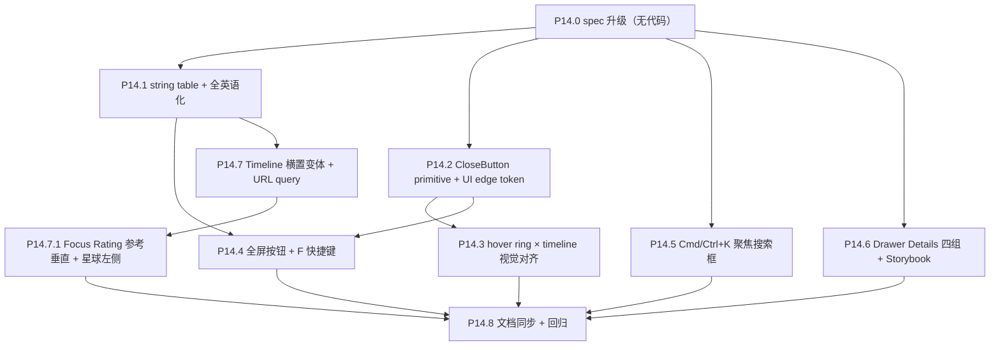

# Phase 14 — HUD/UI 抛光

> 接 Phase 13（focus 体验重构）。本 Phase **不动**渲染管线、数据契约、状态机；仅在 React/HUD 层做工程化抽象与样式统一。所有改动都应可在 Storybook 内独立验收。

## 范围

- 子节点：P14.0 → P14.8（含 **P14.7.1** 紧跟 P14.7）
- 数据契约：**不变**
- 渲染管线：**不变**
- 涉及文件（预计）：
  - 新建 `frontend/src/lib/locales/en.json`（英文文案键值 / `{{placeholder}}` SSOT）
  - 新建 `frontend/src/lib/strings.ts`（`import en.json` → 导出 `STRINGS`，含插值函数）
  - 新建 `frontend/src/components/ui/close-button.tsx`（CloseButton primitive）
  - 新建 `frontend/src/hud/FullscreenButton.tsx`
  - [frontend/src/components/Loading.tsx](frontend/src/components/Loading.tsx)（英语化）
  - [frontend/src/App.tsx](frontend/src/App.tsx)（错误页英语化 + Cmd/Ctrl+K + F 全局 keydown 接入）
  - [frontend/src/components/Drawer.tsx](frontend/src/components/Drawer.tsx)（英语化 + Details 四组排序/显隐 + 接 CloseButton）
  - [frontend/src/components/Drawer.stories.tsx](frontend/src/components/Drawer.stories.tsx)（P14.6：Details 规则矩阵 story）
  - [frontend/src/components/MovieTooltip.tsx](frontend/src/components/MovieTooltip.tsx)（英语化）
  - [frontend/src/components/SearchBar.tsx](frontend/src/components/SearchBar.tsx)（placeholder 英语化 + X 接 CloseButton）
  - [frontend/src/components/Timeline.tsx](frontend/src/components/Timeline.tsx)（接 `orientation` prop + URL query 钩子）
  - [frontend/src/hud/FocusLReference.tsx](frontend/src/hud/FocusLReference.tsx)（**P14.7.1**：Focus 态垂直 Rating 光谱 + 星球左侧布局）
  - [frontend/src/hud/InfoButton.tsx](frontend/src/hud/InfoButton.tsx) / [InfoModal.tsx](frontend/src/hud/InfoModal.tsx) / [infoCopy.ts](frontend/src/hud/infoCopy.ts)（英语化）
  - [frontend/src/hud/HoverRing.tsx](frontend/src/hud/HoverRing.tsx) / [hoverRingLayout.ts](frontend/src/hud/hoverRingLayout.ts)（P14.3：线宽 `--ui-edge-stroke-width` + 画布色 `--ui-edge-canvas-*`）
  - [frontend/src/hooks/useThemeFromQuery.ts](frontend/src/hooks/useThemeFromQuery.ts)（参照模式新建 `useTimelineOrientationFromQuery`）
  - [frontend/src/index.css](frontend/src/index.css)（UI edge design token）
  - [docs/project_docs/TMDB 电影宇宙 Design Spec.md](docs/project_docs/TMDB%20电影宇宙%20Design%20Spec.md) §3 / §3.1 / §3.4 同步
  - [docs/project_docs/视觉参数总表.md](docs/project_docs/视觉参数总表.md) §7 / §7a 同步 token
  - 各组件的 `*.stories.tsx`（双 orientation / 多 variant）

## 决策表（已锁定）

| #   | 决策项                  | 选定方案                                                                                                                                 | 备注                                                                                                                                                      |
| --- | ----------------------- | ---------------------------------------------------------------------------------------------------------------------------------------- | --------------------------------------------------------------------------------------------------------------------------------------------------------- |
| D1  | 全英语化实现策略        | **string table（不接 i18n 框架）**                                                                                                       | **`frontend/src/lib/locales/en.json`** 为英文 SSOT；**`strings.ts`** 聚合为 **`STRINGS`**；其它 locale 可复制 `en.json` 结构扩展                          |
| D2  | Timeline 横置交付形态   | **横置 + 纵置双变体共存**，URL `?timeline=horizontal\|vertical` 切换；默认沿用现有纵置                                                   | 后续 A/B 评估再决最终形态                                                                                                                                 |
| D3  | 键盘快捷键集合          | **F = 全屏 + Cmd/Ctrl+K = 聚焦搜索框**（不上单 `/` 键避免与文本输入冲突）                                                                | ESC 焦点栈维持 Phase 12.8 §4.6                                                                                                                            |
| D4  | 关闭按钮共用粒度        | **primitive + token 双管齐下**：抽 `CloseButton` 组件（variants）+ 抽 UI edge CSS token（hover ring / timeline / close button 视觉对齐） |                                                                                                                                                           |
| D5  | Drawer **Details** 区块 | **四组顺序 + 显隐**（见 §P14.6）；用语：**栏**=单条标签+值；**行**=两列网格的一行（最多两栏）；组间无新增分隔样式，仅换行                | 仅改 HUD；**Budget/Revenue**：`0`、`null`、`undefined`、缺失皆无；**Runtime**：`0` 分钟视为**有**（须正常展示），`null`/`undefined`/缺失为无（见 §P14.6） |

## 执行顺序



依赖说明：
- **P14.0** 先行：明确 string table 命名空间、token 命名、Timeline orientation prop 形态
- **P14.1 / P14.2** 是 cross-cutting 基础设施，先做后续 P14.3–P14.7 都受益
- **P14.3** 视觉对齐依赖 P14.2 token 落地
- **P14.4** 同时用 string table（按钮 aria-label / 提示）与 CloseButton 风格的 IconButton primitive
- **P14.5 / P14.6** 独立小改，可与 P14.1 / P14.2 并行
- **P14.7** Timeline 双变体只用 string table（年份本身无需翻译，但 aria-label 走 strings）
- **P14.7.1** 依赖 P14.7 横置落地后的 HUD 留白与视觉评审；仅改 `FocusLReference` 布局与条方向，不改 shader / 数据

---

## P14.0 spec 升级（无代码）

### Design Spec §3 增补

- §3 头部声明：HUD 英文文案 SSOT 在 **`frontend/src/lib/locales/en.json`**，运行时经 **`frontend/src/lib/strings.ts`** 的 **`STRINGS`** 引用；不在组件内写死可复用字面量（除一次性 dev-only console.log）
- §3.1 Timeline 节加「**orientation 双变体**」子节：`vertical`（默认 / 现状）/ `horizontal`（底部居中、刻度朝下）；URL `?timeline=horizontal` 切换；二者外观规则与刻度算法共享
- §3.x（新增）「Close 控件 primitive」：`CloseButton` variants `default` / `ghost-sm` / `ghost-lg`；图标 `lucide-react X`；颜色与线宽来自 UI edge token
- §3.x（新增）「键盘快捷键」节：
  - **F** → toggle fullscreen（焦点不在 input 时生效）
  - **Cmd/Ctrl+K** → 聚焦搜索框（搜索 disabled 时 noop；与文本输入不冲突）
  - **Esc** → 维持 §4.6 焦点栈
- §3.4 加 dev / 验收章节末尾备注：UI 主体英语；中文仅出现在项目文档与 console.log（开发审计用）

### 视觉参数总表 §7 / §7a 增补

- §7 hover 环：HOVER_RING_STROKE_PX 与 timeline 主线 / CloseButton 边框统一来自 `--ui-edge-stroke-width`（默认 `1px`）；颜色统一 `--ui-edge-color`（详见 §7a）
- 新增 §7a 「UI edge tokens」：
  - `--ui-edge-color: rgb(var(--foreground) / 0.45)`（hover ring / timeline 主线 / close button 普通态）
  - `--ui-edge-color-strong: rgb(var(--foreground) / 0.7)`（hover / focus 强调）
  - `--ui-edge-stroke-width: 1px`
  - 落点：`frontend/src/index.css` `:root` 与 `.dark`

### 状态机 spec / Tech Spec / PRD

- 不变（P14 不动渲染语义）

---

## P14.1 string table + 全英语化

### 目标

抽出全 HUD 用户可见字面量到 **`frontend/src/lib/locales/en.json`**，由 **`frontend/src/lib/strings.ts`** 导出 **`STRINGS`**（含 `{{key}}` 插值）；组件与部分非 React 模块（如 `loadGalaxyGzip.ts`、`three/scene.ts`、`FocusSizeReferenceRings.ts`）统一 `import { STRINGS } from '@/lib/strings'`。**不引 i18n 框架**（react-i18next 等）。**交付记录**：[`docs/reports/Phase 14.1 P14.1 HUD string table 与 en.json 实施报告.md`](../../docs/reports/Phase%2014.1%20P14.1%20HUD%20string%20table%20与%20en.json%20实施报告.md)。

### 实施步骤（归档 — 与代码一致）

1. **审计**：rg 扫一遍 `frontend/src/**/*.{ts,tsx}` 中含中文字符 `[\u4e00-\u9fff]+` 的字面量（排除 console.log / 注释 / 文档）；常见命中位置：
   - [Loading.tsx](frontend/src/components/Loading.tsx) 三阶段「下载/解压/解析」
   - [App.tsx](frontend/src/App.tsx) 错误页「Could not load galaxy data」/「重试」/「本地开发：…」
   - [InfoModal.tsx](frontend/src/hud/InfoModal.tsx) / [infoCopy.ts](frontend/src/hud/infoCopy.ts)
   - [Drawer.tsx](frontend/src/components/Drawer.tsx) 区块标题（Cast / Writers / Producers …）
   - [MovieTooltip.tsx](frontend/src/components/MovieTooltip.tsx)
   - [SearchBar.tsx](frontend/src/components/SearchBar.tsx) placeholder（Phase 16 会补三档专属，本 Phase 仅放泛用 placeholder）

2. **落地形态**：**`en.json`** 存键值与 **`{{placeholder}}`** 模板；**`strings.ts`** `import en` 后导出 **`STRINGS`**（`interpolate()` 装配动态句）。顶层 namespace 以实现为准，含 `loading`、`galaxyData`、`error`、`searchBar`、`hud`、`timeline`、`info`、`scene`、`drawer`、`focusLReference`、`focusVoteReference` 等（见实施报告 §4）。

3. **替换**：所有命中位置 `import { STRINGS } from '@/lib/strings'`；错误页等含 `<code>` 的段落仍拆 JSX，**字面量**来自 `STRINGS.error.*`。

4. **`infoCopy.ts`**：从 **`STRINGS.info`** 再导出各常量（保持 `@/hud/infoCopy` import 路径）；**`InfoModal`** 副标题等直接引用 `STRINGS.info`。

### 验收

- `rg '[\u4e00-\u9fff]' frontend/src/**/*.{ts,tsx}` 仅在 console.log / 注释 / `*.test.ts` / `*.stories.tsx` mock 数据中命中，非生产 UI
- 三方主流程（loading / error / focus drawer）截图英语完整
- Storybook 各 story 文案英语

**实施报告（定稿）**：[`docs/reports/Phase 14.1 P14.1 HUD string table 与 en.json 实施报告.md`](../../docs/reports/Phase%2014.1%20P14.1%20HUD%20string%20table%20与%20en.json%20实施报告.md)

---

## P14.2 CloseButton primitive + UI edge design token

### CloseButton primitive

新建 `frontend/src/components/ui/close-button.tsx`：

```tsx
import { X } from 'lucide-react'
import { cva, type VariantProps } from 'class-variance-authority'

const closeBtnVariants = cva(
  'inline-flex items-center justify-center rounded-md transition-colors focus-visible:outline-none focus-visible:ring-1 focus-visible:ring-[--ui-edge-color-strong]',
  {
    variants: {
      variant: {
        default: 'h-8 w-8 border border-[color:var(--ui-edge-color)] hover:border-[color:var(--ui-edge-color-strong)] hover:bg-foreground/5',
        ghostSm: 'h-5 w-5 text-muted-foreground hover:text-foreground',
        ghostLg: 'h-9 w-9 text-muted-foreground hover:text-foreground',
      },
    },
    defaultVariants: { variant: 'default' },
  },
)

export interface CloseButtonProps
  extends React.ButtonHTMLAttributes<HTMLButtonElement>,
    VariantProps<typeof closeBtnVariants> {
  /** Required for a11y; defaults to STRINGS.hud.close */
  label?: string
}

export function CloseButton({ variant, label, className, ...rest }: CloseButtonProps) {
  return (
    <button
      type="button"
      aria-label={label ?? STRINGS.hud.close}
      className={cn(closeBtnVariants({ variant }), className)}
      {...rest}
    >
      <X className="size-3.5" aria-hidden />
    </button>
  )
}
```

### UI edge design token

[frontend/src/index.css](frontend/src/index.css) 在 `:root` 与 `.dark` 内补：

```css
:root {
  --ui-edge-color: rgb(15 23 42 / 0.45);
  --ui-edge-color-strong: rgb(15 23 42 / 0.7);
  --ui-edge-stroke-width: 1px;
}
.dark {
  --ui-edge-color: rgb(255 255 255 / 0.45);
  --ui-edge-color-strong: rgb(255 255 255 / 0.7);
}
```

### 接入点

- [Drawer.tsx](frontend/src/components/Drawer.tsx) 关闭按钮 → `<CloseButton variant="ghostLg" />`
- [SearchBar.tsx](frontend/src/components/SearchBar.tsx) X 按钮 → `<CloseButton variant="ghostSm" label={STRINGS.searchBar.clear} />`（Phase 13 P13.6 已决：onClick 同时清 selectedMovieId）
- 未来全屏退出按钮（如有）也走同 primitive

### 验收

- Drawer 关闭、SearchBar X 视觉一致（除 size variant）；Storybook 三个 variants 各一个 story
- token：**DOM** 细线调 **`--ui-edge-color*`**；**黑底** hover 环 / Timeline 调 **`--ui-edge-canvas-color*`**（见 **P14.3** 报告）

---

## P14.3 hover ring × timeline 视觉对齐

### 目标

[hud/HoverRing.tsx](frontend/src/hud/HoverRing.tsx) 与 [components/Timeline.tsx](frontend/src/components/Timeline.tsx) 主线 / 刻度 / 当前年指示的**线宽与颜色**与 P14.2 UI edge 体系统一；二者同屏时属同一「细线家族」。

### 实施（定稿，与代码一致）

- [hud/hoverRingLayout.ts](frontend/src/hud/hoverRingLayout.ts)：删除 `HOVER_RING_STROKE_PX`；新增 **`readUiEdgeStrokeWidthPx()`** 解析 **`--ui-edge-stroke-width`**；**`hoverRingOuterRadiusPx` / `hoverTooltipSideOffsetPx`** 使用该值。
- **HoverRing**：`div` + **`border`**（非 SVG）；**`borderWidth: var(--ui-edge-stroke-width)`**；**`borderColor: var(--ui-edge-canvas-color)`**（仅黑底画布）。
- **Timeline**：主轴、刻度字、thumb、glow、当前年字色、`focus-visible` ring → **`--ui-edge-canvas-color*`** + **`--ui-edge-stroke-width`**。
- [frontend/src/index.css](frontend/src/index.css)：**`:root`** 增加 **`--ui-edge-canvas-color` / `--ui-edge-canvas-color-strong`**（固定半透明白，不随 `?theme=light` 与 DOM 的 `--ui-edge-color` 混用）。
- **归档**：[`docs/reports/Phase 14.3 P14.3 hover ring 与 Timeline UI edge 对齐实施报告.md`](../../docs/reports/Phase%2014.3%20P14.3%20hover%20ring%20与%20Timeline%20UI%20edge%20对齐实施报告.md)；《视觉参数总表》**§7 / §7a**、Design Spec **§3.5** 已同步。

### 验收

- hover ring 与 Timeline 主线 **px 级**同宽、同「白系半透明」家族色（画布 token）。
- **`?theme=light`**：DOM 上的 **CloseButton** 等仍可随 `--ui-edge-color*` 变化；**环 + Timeline** 仍为黑底可读细线。

---

## P14.4 全屏按钮 + F 快捷键

### 组件

新建 `frontend/src/hud/FullscreenButton.tsx`：

- 位置：HUD 右上角（与 [InfoButton](frontend/src/hud/InfoButton.tsx) 同列；具体相对位置在 P14.0 spec 内确认 — 建议 InfoButton 左侧）
- 图标：`Maximize` / `Minimize` from lucide
- onClick：`document.fullscreenElement` ? `document.exitFullscreen()` : `document.documentElement.requestFullscreen()`
- 监听 `fullscreenchange` 事件切换 icon
- 兼容 webkit 前缀（Safari）：`(document as any).webkitFullscreenEnabled` 检测
- aria-label = `STRINGS.hud.toggleFullscreen`（包含 "(F)" 提示）

### F 快捷键

[App.tsx](frontend/src/App.tsx) 现有 ESC capture handler 内**新增** F 处理：
- 仅当 `document.activeElement` 不是 input / textarea / contenteditable 时响应
- `e.key === 'f' || 'F'`，preventDefault + 调用 toggle 函数
- 与 ESC 焦点栈不冲突（不同 key）

### 验收

- 点击按钮、按 F → 全屏切换；icon 同步
- 焦点在搜索框时按 F 可输入字母 f（不被 hijack）
- 全屏切换触发 `resize` → 3D 画布正确响应（已在 [scene.ts](frontend/src/three/scene.ts) ResizeObserver 内接管）

---

## P14.5 Cmd/Ctrl+K 聚焦搜索框

### 实施

[App.tsx](frontend/src/App.tsx) ESC capture handler 同位置增加：
- `(e.metaKey || e.ctrlKey) && e.key.toLowerCase() === 'k'`
- preventDefault + stopPropagation
- 找 `document.querySelector('input[data-galaxy-search-input]')` → `focus()`
- 若该 input `disabled`（无搜索索引）→ noop

### 验收

- mac Cmd+K / win Ctrl+K → 搜索框 focus + 全选已有 query 文本
- 已聚焦时再按 Cmd/Ctrl+K → 仍 focus（不报错）

---

## P14.6 Drawer **Details** 四组排序与显隐

> 范围仅限 **Details** 小标题下的元数据网格；**Overview / Cast / 外链等**不在本子节重排。数据契约不变。

### 用语（与产品对齐）

- **栏**：一条独立信息（标签 + 值），如 Director、Runtime、Budget 各为一栏。
- **行**：`grid-cols-2` 下的一行，**一行最多两栏**（左、右）；栏按顺序从左到右填满，再换行。**奇数个栏**时末栏仅占左格、右格空（与现状两列网格一致；若未来要末栏 `col-span-2` 需单独决策）。

### 组顺序与规则

组与组之间 **仅换行**，不增加分割线、背景或新区块样式；**现有 typography / gap 保持**。

| 组       | 栏顺序（组内）                           | 规则                                                                                                       |
| -------- | ---------------------------------------- | ---------------------------------------------------------------------------------------------------------- |
| **组 1** | Runtime → Language                       | **整组永远渲染**。某一栏无数据：**值**显示 `/`（占位）。**例外**：Runtime **`0` 分钟视为有**，不显示 `/`。 |
| **组 2** | Director → Producers → Writers           | 某一栏无数据：**该栏不渲染**。三栏可全缺 → 组 2 不出现。                                                   |
| **组 3** | Director of Photography → Music Composer | 同上：无数据栏不渲染；可全缺 → 组 3 不出现。                                                               |
| **组 4** | Budget → Revenue                         | 单栏无数据：该栏**值**为 `/`。Budget 与 Revenue **皆**无可展示数据：**整组不渲染**。                       |

**栏顺序小结**（相对旧实现中 Writers 与 DOP 的线性混排）：Runtime / Language 置顶；创作职务块为 Director、Producers、Writers；技术/音乐块为 DOP、Composer；财务块为 Budget、Revenue。

### 「无数据」判定（已锁定）

- **Budget、Revenue**：`null`、`undefined`、字段缺失，以及 **`0` 一律视为无数据**（单栏 → 值 `/`；两栏皆无 → 组 4 不渲染）。若日后需区分「零」与「未知」，须另开数据契约或产品决策。
- **Runtime**：**`0` 分钟视为有数据**，须按正常时长格式化展示（业务上为有效值）；仅 `null` / `undefined` / 缺失视为无 → 值 `/`。
- **名单 / 字符串栏**（组 2、3 及 Language 等）：`null` / `undefined` / 缺失、空字符串、空数组视为该栏无；**不**用数字 `0` 表示名单语义。

### 一段话复述（可粘贴 Design Spec / 实施报告）

Details 在固定 **两列网格** 中按 **四组** 纵向衔接：**组 1** 永远渲染 Runtime 与 Language；**Language** 及 **Runtime** 仅在 `null` / `undefined` / 缺失时为无（值 `/`），其中 **Runtime = 0 分钟视为有**、须正常展示。**组 2**（Director → Producers → Writers）与 **组 3**（Director of Photography → Music Composer）逐栏判断，无有效数据则**整栏不渲染**，两组皆可因栏尽缺而整体不出现；**组 4**（Budget → Revenue）单栏无有效数据时该栏值为 `/`，两栏皆无有效数据时**整组不渲染**；Budget/Revenue 的「无」**含** `0`。栏按顺序 **从左到右填满一行再换行**（奇数个栏时末栏仅占左格）；**组与组之间**不增加分割线或新区块样式，仅自然换行。**名单/字符串栏**以空值、空集合与缺失为无。

### 实施

- [components/Drawer.tsx](frontend/src/components/Drawer.tsx)：将 Details 内上述栏拆为「组」级数据结构或小块渲染；`showMetaBlock`（或等价）需与**新组规则**一致，避免出现「只有空壳 Details 标题」或漏组。
- 建议抽小纯函数（同文件或 `drawerDetailsLayout.ts`）：输入 `movie`（或已有派生字段）→ 各组「要渲染的栏」列表，便于单测 / Story 对照。

### Storybook

- [components/Drawer.stories.tsx](frontend/src/components/Drawer.stories.tsx)：为 **组 1 `/`、组 2/3 缺栏、组 4 `/ 与整组隐藏、奇数栏换行** 等组合各提供 story（或 args 矩阵），保证每种规则至少一条可见用例。

### 验收

- 对照上表逐组 spot-check；Storybook 截图可并入 P14.8 报告。
- **Budget / Revenue**：含 `0` / `null` / 缺失 的用例在 Storybook 中可验收 `/` 与组 4 整组隐藏。
- **Runtime = 0**：Storybook 用例须展示**非 `/`** 的合法时长文案（与「缺失 → `/`」对照）。

---

## P14.7 Timeline 横置变体 + URL query

### 组件改造

[components/Timeline.tsx](frontend/src/components/Timeline.tsx) 接受 prop `orientation: 'vertical' | 'horizontal'`，默认 `'vertical'`：

- **vertical**（现状）：左侧固定，长条上下，刻度朝左
- **horizontal**（新增）：底部固定居中，长条左右，刻度朝下；Z 轴映射方向：左 = `zMin`，右 = `zMax`
- 内部布局 / 刻度 / hover thumb 计算复用 `yearTickList` 等纯函数；仅 SVG 主轴方向变化
- 共用 P14.2 / P14.3 token

### URL query 钩子

新建 `frontend/src/hooks/useTimelineOrientationFromQuery.ts`：

```ts
export function useTimelineOrientationFromQuery(): 'vertical' | 'horizontal' {
  const [o, setO] = useState<'vertical' | 'horizontal'>('vertical')
  useEffect(() => {
    const q = new URLSearchParams(window.location.search).get('timeline')
    if (q === 'horizontal' || q === 'vertical') setO(q)
  }, [])
  return o
}
```

[App.tsx](frontend/src/App.tsx) 调用并传入 `<Timeline orientation={...} />`。

### Storybook

[Timeline.stories.tsx](frontend/src/components/Timeline.stories.tsx) 新增 `Horizontal` story（默认 args 改 orientation='horizontal'）；保留 vertical 默认 story。

### 验收

- 默认 URL → vertical（不 break 现状）
- `?timeline=horizontal` → 底部横置，刻度朝下，可正常显示当前年份指针
- Storybook 双 story 截图存档（Phase 14.8 文档报告引用）

---

## P14.7.1 Focus 态 Rating 参考（FocusLReference）垂直 + 星球左侧

> **背景**：在 **P14.7** 将 Timeline 改为横置（底部）并通过视觉评审后，原置于星球**下方**的横向 OKLab L / `vote_average` 参考条与横置时间轴在垂直方向上「抢空间」、且与星球关系不清晰。本子节为评审后追加，**不**改 3D、不改编码映射，仅调整 HUD。

### 目标

- [hud/FocusLReference.tsx](frontend/src/hud/FocusLReference.tsx)：**光谱条由水平改为垂直**（10 档色带仍对应 `voteNorm = (k+0.5)/10`，与 shader 一致；**低分在底、高分在上**，连续指针 `vote_average/10` 沿纵轴定位）。
- **位置**：整体移至视口内**星球左侧**（相对画面中心向左偏移的固定/半固定布局，避免与底部横置 Timeline、与右侧 Drawer 抢位）。
- **文案**：仍用 `STRINGS.focusLReference`；`aria-label` 行为不变。

### 验收

- Film focus 下：垂直条 + 横向指针线 + 评分文案可读；与 **横置 Timeline** 同框无重叠或可读性明显下降。
- `?timeline=vertical`（若仍支持）：左侧纵轨与 Focus 参考条间距可接受（允许后续微调 token 化偏移）。
- 窄屏：`left`/`max-w` 不挤出屏幕外。

### 依赖

- **P14.7** 完成或可与本任务同分支联调（本变更逻辑上在横置评审之后）。

---

## P14.8 文档同步 + 回归

- [Design Spec §3](docs/project_docs/TMDB%20电影宇宙%20Design%20Spec.md) 同步 P14.0 spec 变更
- [视觉参数总表 §7 / §7a](docs/project_docs/视觉参数总表.md) 同步 token
- 全局快捷键节加入 F / Cmd-K（与 ESC §4.6 并列）
- 实施报告：**P14.1** 已有 [`Phase 14.1 P14.1 HUD string table 与 en.json 实施报告.md`](../../docs/reports/Phase%2014.1%20P14.1%20HUD%20string%20table%20与%20en.json%20实施报告.md)；**P14.3** [`Phase 14.3 P14.3 hover ring 与 Timeline UI edge 对齐实施报告.md`](../../docs/reports/Phase%2014.3%20P14.3%20hover%20ring%20与%20Timeline%20UI%20edge%20对齐实施报告.md)；P14.2 / P14.7 各一份（其它子节可合并到 Phase 14 总报告）
- 回归清单：
  - Loading / Error 页英语完整
  - Drawer Details 四组规则（§P14.6）、关闭按钮、Tooltip / SearchBar / InfoModal 英语完整
  - hover ring 与 timeline 同色同宽（**画布 `--ui-edge-canvas-*`**）；`?theme=light` 下 DOM 与画布 edge 分工正确
  - 全屏按钮 + F 快捷键全链路
  - Cmd-K 聚焦不与文本输入冲突
  - URL `?timeline=horizontal` 验收
  - Phase 13 已落地的 focus 体验在英语化后无回归
  - **P14.7.1**：FocusLReference 垂直条 + 星球左侧与横置 Timeline / Drawer 同框验收

---

## 风险与回滚

| 风险                                             | 影响 | 缓解                                                                                                    |
| ------------------------------------------------ | ---- | ------------------------------------------------------------------------------------------------------- |
| string table 未来若接 i18n 需返工                | 低   | **`en.json`** 已为独立 locale 文件；`{{key}}` 可迁移为 i18next ICU；`strings.ts` 可换为 provider 装配层 |
| UI edge token 切色与现有 chip / badge 不一致     | 低   | DOM 用 `--ui-edge-*`，黑底环/轴用 `--ui-edge-canvas-*`（P14.3）；其它色块仍走 shadcn 语义类             |
| Cmd-K 与浏览器 / OS 快捷键冲突                   | 中   | 仅在 capture 阶段处理；输入框聚焦时仍允许默认；mac Safari 测一遍                                        |
| 横置 Timeline 与 Phase 13 Timeline snap 渐变交互 | 中   | snap 路径不依赖 orientation；orientation 只影响视觉，store 字段不变                                     |

## 出口准入

- 所有 P14.0–P14.8 todos `completed`
- 中文字符在生产 UI 路径上为 0（实现 `rg` 报告）
- Storybook：`CloseButton` / Timeline 双向 / FullscreenButton；**Drawer Details 规则矩阵**（P14.6）story 完整
- Design Spec / 视觉参数总表 / **`locales/en.json` + `strings.ts`（`STRINGS`）** 与代码一致
