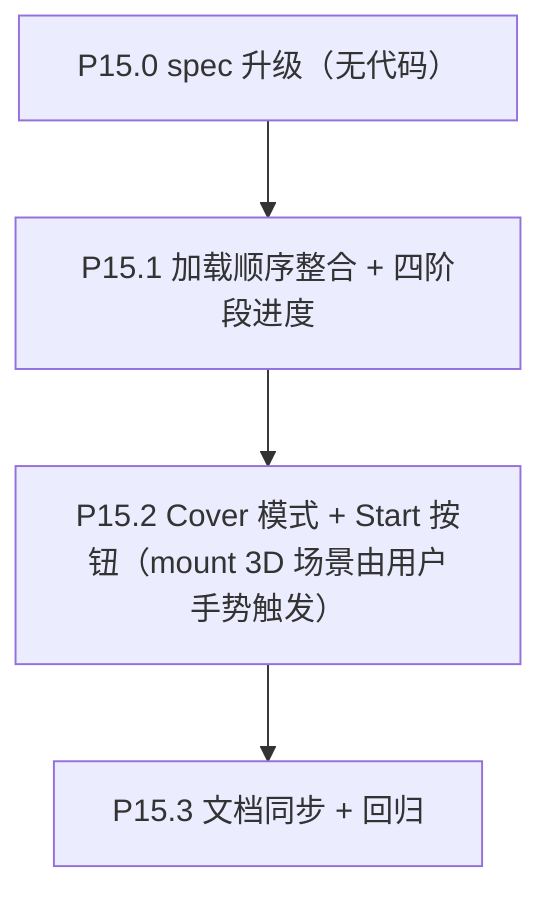

# Phase 15 — 封面与载入整合

> 接 Phase 14（HUD/UI 抛光）。本 Phase **不动** 3D 渲染、数据契约、搜索功能契约；仅重组 React 顶层加载顺序，并新增 Cover-with-Start 覆盖层。

## 范围

- 子节点：P15.0 → P15.3
- 数据契约：**不变**
- 渲染管线：**不变**
- 涉及文件（预计）：
  - [frontend/src/App.tsx](frontend/src/App.tsx)（顶层加载状态机；Cover 渲染分支；3D 场景 mount 改为 user-gesture 触发）
  - [frontend/src/components/Loading.tsx](frontend/src/components/Loading.tsx)（接四阶段进度 + mode `'loading' | 'await-start'`）
  - [frontend/src/components/Loading.stories.tsx](frontend/src/components/Loading.stories.tsx)（Cover / 各阶段 story 补齐）
  - [frontend/src/store/galaxyDataStore.ts](frontend/src/store/galaxyDataStore.ts)（如需顶层 status 扩展，否则 App 内本地 state）
  - [frontend/src/store/searchIndexStore.ts](frontend/src/store/searchIndexStore.ts)（hydrate 调用时机变更，store 本身不变）
  - [docs/project_docs/TMDB 电影宇宙 Tech Spec.md](docs/project_docs/TMDB%20电影宇宙%20Tech%20Spec.md) §1.4.7
  - [docs/project_docs/TMDB 电影宇宙 Design Spec.md](docs/project_docs/TMDB%20电影宇宙%20Design%20Spec.md) §3 / §4.8（无索引退化口径不变）
  - [docs/project_docs/视觉参数总表.md](docs/project_docs/视觉参数总表.md)（如需补 Cover 文案 token）
  - [docs/project_docs/TMDB 电影宇宙 PRD.md](docs/project_docs/TMDB%20电影宇宙%20PRD.md) §3.1 层级零（首屏新增"按 Start 入场"步骤）

## 决策表（已锁定）

| #   | 决策项                | 选定方案                                                                                                                                                                         |
| --- | --------------------- | -------------------------------------------------------------------------------------------------------------------------------------------------------------------------------- |
| D1  | Cover 视觉范围        | **极简**：Loading 完成后保留同一覆盖层，spinner 隐藏，显示 **Start 按钮 + 一句提示语**；不加品牌标题 / 介绍 / 视觉编码教程                                                       |
| D2  | Search index 进度展示 | **合并**：Loading 进度条 ol 由 `download / decompress / parse` 三阶段 → 扩展为 `download / decompress / parse / index` 四阶段，同色同节奏                                        |
| D3  | search index 失败回退 | **不阻塞 Cover**：`status='error'` 或 `status='skipped'` 时，第四阶段标记为对应文案（`Skipped` / `Failed`），仍让用户可点 Start 进入应用（搜索 disabled，与 Phase 12 §4.8 一致） |
| D4  | 3D 场景 mount 时机    | **Start 按钮触发**（首次有效用户手势 / `pointerup`）；之前不创建 `WebGLRenderer`、不申请显存                                                                                     |

## 执行顺序



依赖说明：
- **P15.0** 先行，确认四阶段进度命名与 Cover 文案
- **P15.1** 先把加载流程跑通且 Loading UI 能正确显示新阶段（不动 3D mount 时机）；阶段性可发布
- **P15.2** 在 P15.1 之上把 3D mount 改为 user-gesture 触发，并加 Start 按钮交互；与 P15.1 解耦便于回滚

---

## P15.0 spec 升级（无代码）

### Tech Spec §1.4.7 「首屏加载体验」改写

将原节扩展为：

```
首屏加载分为四阶段（与 Loading.tsx 进度 ol 一一对应）：
1. download   — fetch galaxy_data.json.gz（HTTP 字节流；进度由 Content-Length / 已下载字节驱动）
2. decompress — DecompressionStream 解压（进度仅 phase 切换，无字节级）
3. parse      — JSON.parse + 类型校验
4. index      — galaxy_search_index.json.gz hydrate（meta.has_search_index === true 时执行；
                false 时本阶段直接 status='skipped' 不阻塞）

四阶段全部完成（含 'skipped'）后进入 Cover-await-start 状态：保留 Loading 覆盖层但隐藏
spinner，显示 Start CTA。用户点击 Start 后再 mount Three.js 场景（首次申请 WebGLRenderer
与 GPU buffer）。失败处理：
- galaxy_data download/decompress/parse 任一失败 → 错误页 + Retry（与现状一致）
- galaxy_search_index 失败 → 第四阶段标 'Failed'，仍可继续 Start，搜索框 disabled（Phase 12 §4.8）
```

### Design Spec §3 增 §3.5「Cover-with-Start」节

- 极简风格：Loading.tsx 同一覆盖层，spinner 隐去，进度条保留勾选完成状态
- 文案：标题 `STRINGS.cover.title`（在 **`en.json`** 增加 `cover.title` / `cover.subtitle` 等，**`strings.ts`** 挂到 `STRINGS.cover`）；最终文案在 P15.0 决定
- Start 按钮：`<button>` 走 shadcn variant primary 或自定义 ghost-with-glow；`autoFocus` 让 Enter / Space 也可触发
- 键盘可达：Enter / Space 等同点击；Esc 不响应（无可关闭对象）
- a11y：role="dialog" + `aria-labelledby`；按钮 `aria-label`

### PRD §3.1 层级零增补

- 在「自由漫游」描述前加一句：「应用首次加载完成后，用户在封面页点击 Start 按钮进入宇宙；之后无需再加载」

### 状态机 spec / 视觉参数总表

- 状态机：不动（focus/active/idle 等运行态语义无关）
- 视觉参数总表：如新增 Cover 文案 token，列入 §1（开发者速查），否则不动

---

## P15.1 加载顺序整合 + 四阶段进度

### 顶层状态机（App.tsx 内 / 不进 store）

新增 App 内本地 state（无需污染 store）：

```ts
type AppLoadPhase =
  | { kind: 'galaxy-loading' }     // galaxyDataStore.status === 'loading'
  | { kind: 'galaxy-error' }       // galaxyDataStore.status === 'error'
  | { kind: 'index-loading' }      // galaxy ready; searchIndexStore.status === 'loading'
  | { kind: 'await-start' }        // 全部完成（含 skipped/error）→ 渲染 Cover
  | { kind: 'started' }            // 用户已点 Start → 渲染 3D scene + HUD
```

判定规则：
```ts
const galaxy = useGalaxyDataStore()
const index = useSearchIndexStore()

const phase: AppLoadPhase =
  galaxy.status === 'loading' || galaxy.status === 'idle' ? { kind: 'galaxy-loading' } :
  galaxy.status === 'error' ? { kind: 'galaxy-error' } :
  index.status === 'loading' ? { kind: 'index-loading' } :
  !started ? { kind: 'await-start' } :
  { kind: 'started' }
```

### Hydrate 时机改造

- App.tsx 现有：`useEffect(() => { ...hydrateFromGalaxyMeta(data.meta) }, [status, data])` 在 status==='ready' 后异步触发，**与 3D mount 并行**
- 改造：保留同一 effect，但**移除** "status === 'ready' 自动 mount 3D scene" 的另一 useEffect；scene mount 由 P15.2 的 started state 触发
- 结果：status='ready' 后 hydrate 立刻启动；UI 渲染 Loading（mode='loading' + phase='index'）

### Loading.tsx 改造

新接口：

```tsx
export type LoadingPhase = 'download' | 'decompress' | 'parse' | 'index'

export interface LoadingProps {
  className?: string
  label?: string
  /** Galaxy gzip progress (only meaningful while in download/decompress/parse). */
  progress?: GalaxyGzipProgress | null
  /** Search index hydrate status (drives the 4th step indicator). */
  indexStatus?: 'pending' | 'loading' | 'ready' | 'skipped' | 'error'
  /** P15.2 — when 'await-start', spinner hidden + Start CTA shown. */
  mode?: 'loading' | 'await-start'
  /** P15.2 — Start button click handler. */
  onStart?: () => void
}
```

ol 改为四项：
```
[Download] → [Decompress] → [Parse] → [Search index]
```

每项颜色规则（沿用 Phase 9 token + STRINGS.loading）：
- pending：muted-foreground
- active：foreground + font-medium
- done：primary
- skipped：muted-foreground + 删除线 / opacity-60
- error：destructive

进度条 width：
- 阶段 1（download）：与现状一致，按 `downloadedBytes/totalBytes`
- 阶段 2/3：phase 切换瞬时，无字节进度（条满 1/2、3/4）
- 阶段 4：indexStatus='loading' 时无字节进度（条满 3/4 + 不确定动画 / 持续到 ready）；ready/skipped/error 后条满

### App.tsx 渲染分支

```tsx
if (phase.kind === 'galaxy-loading') return <Loading mode="loading" progress={loadProgress} indexStatus="pending" />
if (phase.kind === 'galaxy-error') return <ErrorPage ... />
if (phase.kind === 'index-loading') return <Loading mode="loading" progress={null} indexStatus="loading" />
if (phase.kind === 'await-start') return <Loading mode="await-start" indexStatus={index.status === 'skipped' ? 'skipped' : index.status === 'error' ? 'error' : 'ready'} onStart={() => setStarted(true)} />
// phase.kind === 'started':
return <main>...3D canvas + HUD...</main>
```

### 验收

- 无搜索索引数据集（meta.has_search_index = false）：第 4 阶段 indicator 标 `Skipped`，进度条满，await-start 立即显示
- 有索引：第 4 阶段经历 loading → ready；进度条平滑推进
- 索引 fetch 失败：第 4 阶段标 `Failed`，console 警告，仍能进 await-start
- 主流程：browser DevTools Network 抓包，`galaxy_search_index.json.gz` 在 status='ready' 后立即开始，与现状（在 useEffect 里延迟）相比时间线提前

---

## P15.2 Cover 模式 + Start 按钮（user-gesture mount 3D）

### Loading.tsx Cover 模式

`mode='await-start'` 时：
- spinner 隐藏（CSS hidden 或不渲染）
- 进度条保留满状态（用户能看到自己已加载完）；indexStatus='skipped' 时第 4 阶段灰显
- 中央追加 CTA 区：
  ```tsx
  <div className="flex flex-col items-center gap-3 mt-2">
    <p className="text-sm text-muted-foreground">{STRINGS.cover.subtitle}</p>
    <button
      type="button"
      autoFocus
      onClick={onStart}
      className="rounded-md bg-primary px-6 py-2 text-sm font-medium text-primary-foreground hover:opacity-90 focus-visible:ring-2 focus-visible:ring-[--ui-edge-color-strong]"
    >
      {STRINGS.cover.start}
    </button>
  </div>
  ```
- ARIA：根容器加 `role="dialog"` `aria-labelledby="cover-title"` `aria-describedby="cover-subtitle"`（hidden h1 用于 SR）
- 键盘：Enter / Space 触发（autoFocus + button 默认行为，无需额外监听）

### App.tsx 3D mount 改造

现状（关键代码引用）：

```37:38:frontend/src/App.tsx
    return () => mount.dispose()
  }, [status, data])
```

改造：
```tsx
const [started, setStarted] = useState(false)

// 3D scene 仅在 started=true 后 mount（首次用户手势）
useEffect(() => {
  if (!started || !data) return
  const el = canvasHostRef.current
  if (!el) return
  const mount = mountGalaxyScene(el, data.meta, data.movies)
  return () => mount.dispose()
}, [started, data])
```

- `setStarted(true)` 由 Loading 的 `onStart` 调用；同步切到 phase='started'
- 一旦 started 永远不回 false（用户重新加载页面才重置；hot reload 走开发者另外的路径）
- 因 3D mount 在用户 click 后才发生，浏览器允许更激进的 GPU 资源申请；同时 Phase 18 未来如有音效自动播放也合规

### Storybook

[Loading.stories.tsx](frontend/src/components/Loading.stories.tsx) 增 stories：
- `LoadingPhaseDownload`（现状）
- `LoadingPhaseIndex`（新）
- `CoverAwaitStart`（mode='await-start'，indexStatus='ready'）
- `CoverIndexSkipped`（mode='await-start'，indexStatus='skipped'）
- `CoverIndexFailed`（mode='await-start'，indexStatus='error'）

### 验收

- 完整链路：刷新页面 → Loading 四阶段 → Cover (Start) → 点 Start → 主场景 mount + HUD 出现
- Start 按钮聚焦后按 Enter / Space 等同点击
- DevTools Memory：Cover 状态下 `WebGLRenderingContext` 数量为 0；Start 后增至 1
- 网速节流（Slow 3G）下进度条递推连贯，第 4 阶段在第 3 阶段后立即开始
- 无搜索索引时 Cover 仍正常显示 Start，进入应用后搜索框 disabled（Phase 12 §4.8 维持）

---

## P15.3 文档同步 + 回归

- [Tech Spec §1.4.7](docs/project_docs/TMDB%20电影宇宙%20Tech%20Spec.md) 覆写为四阶段 + Cover 描述
- [Design Spec §3.5](docs/project_docs/TMDB%20电影宇宙%20Design%20Spec.md) 新增节
- [PRD §3.1](docs/project_docs/TMDB%20电影宇宙%20PRD.md) 层级零加 Start 步骤
- 实施报告 `Phase 15.x ... 实施报告.md`（建议合并为单文件，因子节较少）
- 回归清单：
  - 完整链路（含 Phase 13 focus / Phase 14 全屏 / 全部已落地体验）入场后无回归
  - status='error'（galaxy 数据失败）时仍走错误页 + Retry，**不**走 Cover
  - 重新刷新一次 → 整套流程可重复
  - 浏览器后退 / 前进 → 状态保持 started（如 SPA 路由不重置）

---

## 风险与回滚

| 风险                                                       | 影响 | 缓解                                                                                                    |
| ---------------------------------------------------------- | ---- | ------------------------------------------------------------------------------------------------------- |
| Cover 阶段用户在 Network 故障时无 Retry 入口               | 低   | galaxy 数据失败永远走错误页；search index 失败标 Failed 但允许 Start；Start 后搜索 disabled             |
| 用户多次点击 Start 导致重复 mount 3D                       | 低   | 单次 useState；点击后 setStarted(true) 幂等                                                             |
| 4 阶段进度条 fail 视觉不直观                               | 中   | Storybook 三种异常 story 验收；Phase 14 token 提供 destructive 色                                       |
| 把 hydrateFromGalaxyMeta 推到 Loading 后用户感知"加载更慢" | 中   | 体积说明：`galaxy_search_index.json.gz` 远小于 `galaxy_data.json.gz`，多出秒级；体感由 Cover 仪式感抵消 |

## 出口准入

- 所有 P15.0–P15.3 todos `completed`
- 三 Storybook story（Cover-ready / Cover-skipped / Cover-failed）通过
- DevTools 抓帧确认 3D scene 仅在 Start 后 mount
- 三份项目 spec（Tech / Design / PRD）与代码一致
- Phase 14 string table 已加 `cover.*` 与 `loading.phaseIndex` 等键
