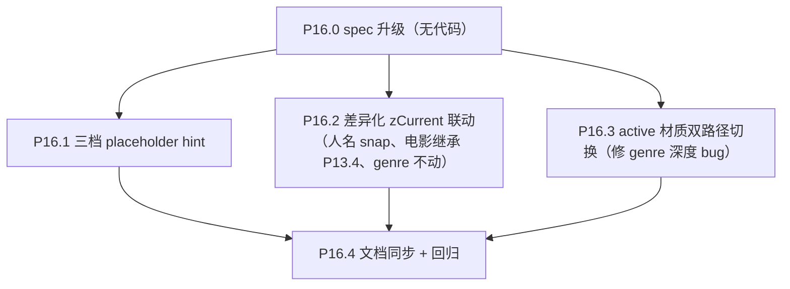

# Phase 16 — 搜索体验完善

> 接 Phase 12（搜索基础设施）+ Phase 13（focus 体验重构）+ Phase 14（HUD 抛光）+ Phase 15（封面/载入）。本 Phase **复用** P13.1 `transitionDriver`、P14.1 **`locales/en.json` + `strings.ts`（`STRINGS`）** 与 P11.1 alpha 渐变路径，不动数据契约。

## 范围

- 子节点：P16.0 → P16.4
- 数据契约：**不变**
- 渲染管线：**仅 active 材质动态切换 transparent/depthWrite**（不新增 uniform / mesh）
- 搜索 UX：**保留** Design Spec §4 既有契约，仅补 placeholder + 差异化 zCurrent 联动
- 涉及文件（预计）：
  - [frontend/src/components/SearchBar.tsx](frontend/src/components/SearchBar.tsx)（placeholder + 联想点击 handler 内 zCurrent 写入）
  - [frontend/src/lib/locales/en.json](frontend/src/lib/locales/en.json) + [frontend/src/lib/strings.ts](frontend/src/lib/strings.ts)（P14.1 已建；本 phase 扩展 `searchBar` 下 placeholder 键并装配到 `STRINGS`）
  - [frontend/src/three/scene.ts](frontend/src/three/scene.ts)（active 材质渲染路径切换；监听 searchMode × selectedMovieId）
  - [frontend/src/three/galaxyMeshes.ts](frontend/src/three/galaxyMeshes.ts)（如需暴露 active material 切换 helper）
  - [frontend/src/store/galaxyInteractionStore.ts](frontend/src/store/galaxyInteractionStore.ts)（如需新增 `setZCurrentAnimated` helper 或在 SearchBar 内直接驱动 transitionDriver）
  - [docs/project_docs/TMDB 电影宇宙 Design Spec.md](docs/project_docs/TMDB%20电影宇宙%20Design%20Spec.md) §4.3 / §4.4 / §4.5 同步差异化 zCurrent 行为
  - [docs/project_docs/星球状态机 spec.md](docs/project_docs/星球状态机%20spec.md) §3.2 active 材质双路径说明
  - [docs/project_docs/视觉参数总表.md](docs/project_docs/视觉参数总表.md) §2 active 材质行
  - [docs/project_docs/TMDB 电影宇宙 Tech Spec.md](docs/project_docs/TMDB%20电影宇宙%20Tech%20Spec.md) §1.1（双路径渲染说明）

## 决策表（已锁定 / 待确认）

| #   | 决策项                         | 选定方案                                                                                                                                                                                                                     | 备注                                                                                                                |
| --- | ------------------------------ | ---------------------------------------------------------------------------------------------------------------------------------------------------------------------------------------------------------------------------- | ------------------------------------------------------------------------------------------------------------------- |
| D1  | 三档 placeholder 文案          | **movie**: `Search movie titles…` / **person**: `Director / Producer / Cast …` / **genre**: `Drama / Comedy / Thriller …`                                                                                                    | 写入 **`en.json`**（SSOT）并在 **`strings.ts`** 暴露；切 tab 时同步切 placeholder                                  |
| D2  | 搜电影 zCurrent 行为           | 进 focus（继承 P13.4 zCurrent snap 到 movie.z 的 transition）                                                                                                                                                                | 不需要在 P16 新写逻辑；仅在 spec 中明确这点                                                                         |
| D3  | 搜人名 zCurrent 行为           | snap 到 `min(movie.z over selectionIds)`（最早 active）；走 P13.1 transitionDriver 与电影飞入同节奏（700ms easeOutCubic）                                                                                                    | 用户原话「最早的 active 星星」                                                                                      |
| D4  | 搜 genre zCurrent 行为         | **不动**；zCurrent 保持点击前位置                                                                                                                                                                                            | 与状态机 spec §3.6 一致：`viswindowDisabled` 时视觉无反馈                                                           |
| D5  | genre 渲染深度修复方案         | **A — active 材质动态切换路径**：select 单态（searchMode∈{person,genre} 且 selectedMovieId=null）下 `transparent=false / depthWrite=true`；其余路径维持 `transparent=true / depthWrite=false`（保留 P11.1 focus alpha 渐变） | 实施中如发现 mesh 内透明度切换 GPU 状态成本过高，**降级方案 B**：第二份 active mesh 走 opaque pass（不变更原 mesh） |
| D6  | 人名 active 屏幕大小不可读问题 | **不修复**（A.5.1.3 决策：工程量过大且不优雅，保留现状）                                                                                                                                                                     | spec 中标注为「已知限制」                                                                                           |

## 执行顺序



依赖说明：
- **P16.0** 先行：把 D5 渲染路径切换、人名 snap 行为写入 spec
- **P16.1 / P16.2 / P16.3** 互相独立，可并行
- **P16.3** 须在 Phase 13 完成后做（focus 嵌套语义已稳定，不会因为 D5 切换路径破坏 P11.1）

---

## P16.0 spec 升级（无代码）

### Design Spec §4 增补

- §4.3「电影名」点击行为补一句：`useGalaxyInteractionStore.setState({ selectedMovieId: id })` 触发 P13.4 transition（zCurrent 自动 snap 到 `movie.z`）；本 phase 不需另写
- §4.4「人名」点击行为补：在写 `selectionIds` / `searchMode='person'` 同帧，**额外**触发 zCurrent 渐变到 `min(z over selectionIds)`，曲线与 P13.1 `focusDriver`/`zCurrentDriver` 同节奏（700ms easeOutCubic）；如 selectionIds 为空（不应发生）则不动
- §4.5「genre」点击行为补：`zCurrent` **不动**；状态机契约已规定 viswindow 视觉无反馈
- §4.1 placeholder 三档文案落入 D1（精确字符串）
- §4 末尾加「已知限制」节：人名 select 下 active 屏幕大小因 z 跨度大投影衰减不显著（A.5.1.3 决策：本阶段不修复）

### 状态机 spec §3.2 active

- 新增 §3.2.1「active 材质双路径」：
  - **路径 A — opaque**：`searchMode ∈ {person, genre}` 且 `selectedMovieId === null`（即纯 select 单态）。`transparent: false`，`depthWrite: true`，`alphaTest: 0.01`。仅 mask 内实例 sActive>0 渲染，深度正确，避免大量 active 同帧时的前后顺序错乱
  - **路径 B — transparent**（默认 / 现状）：其余所有情况（idle、focus 单态、focus 嵌套 select）。`transparent: true`，`depthWrite: false`，`alphaTest: 0.01`。保留 P11.1 `vFocusAlphaMult` 的 alpha 渐变能力
  - 切换由 `scene.ts` RAF 监听 `searchMode × selectedMovieId` 决定；切换瞬时无动画

### 视觉参数总表 §2

- 「Active 材质」行改为列出双路径条件与各自 `transparent / depthWrite` 取值；备注引用状态机 spec §3.2.1

### Tech Spec §1.1

- 「active：`IcosahedronGeometry(1, 1)` …」段补一句双路径切换说明，引用状态机 §3.2.1

---

## P16.1 三档 placeholder hint

### `en.json` / `strings.ts` 扩充

在 [frontend/src/lib/locales/en.json](frontend/src/lib/locales/en.json) 的 `searchBar` 下增加占位键（与现有 `placeholderMovie` 等并列或改为嵌套 `placeholder.*`，由实现选定）；[frontend/src/lib/strings.ts](frontend/src/lib/strings.ts) 将对应字段挂到 **`STRINGS.searchBar`**。示例（`en.json` 片段）：

```json
"searchBar": {
  "placeholderMovie": "Search movie titles…",
  "placeholderPerson": "Director / Producer / Cast …",
  "placeholderGenre": "Drama / Comedy / Thriller …",
  "placeholderDisabled": "Search index unavailable"
}
```

### SearchBar 改造

[frontend/src/components/SearchBar.tsx](frontend/src/components/SearchBar.tsx)：
- 当前 placeholder 取自 `STRINGS.searchBar`；改为按 HUD tab / `searchMode` 切换（键名以实现为准）：
  - `'idle'` → 取 movie 默认（用户未点 segment 时多见）
  - `'movie' | 'person' | 'genre'` → 对应 `STRINGS.searchBar` 下各档文案
  - 搜索 disabled（`!hasSearchIndex`）→ disabled 专用键
- 切换 segment 时（Design Spec §4.1：会清空 query）placeholder 立即生效（受控属性，无需动画）

### 验收

- 三档 segment 各截一张图：placeholder 文字与 D1 完全一致
- 切到无索引数据集（meta.has_search_index = false）→ placeholder = "Search index unavailable"，input disabled

---

## P16.2 差异化 zCurrent 联动

### zCurrent transition driver 复用

P13.1 已建立 `transitionDriver.ts` 通用驱动。本 phase 复用该驱动器构造一个独立 `zCurrentDriver`：

```ts
// 在 scene.ts 内
const zCurrentDriver = createTransitionDriver()
let zCurrentFrom = zCurrent
let zCurrentTo = zCurrent

// RAF tick 内：
if (zCurrentDriver.active) {
  zCurrentDriver.tick(now)
  const next = lerp(zCurrentFrom, zCurrentTo, zCurrentDriver.progress)
  useGalaxyInteractionStore.setState({ zCurrent: next })
}
```

暴露一个 `animateZCurrentTo(target: number, durationMs = 700)`：snapshot from = current store zCurrent，set to = target，driver.start。

### Store helper（可选）

为避免 SearchBar 直接依赖 scene.ts 内部，导出一个简单接口：

```ts
// frontend/src/three/scene.ts 顶层暴露
export interface GalaxySceneController {
  animateZCurrentTo: (z: number, durationMs?: number) => void
}
// mountGalaxyScene 返回值新增 controller 字段
```

或更简单：在 store 加一个全局 helper（如已有事件总线的话），由 scene.ts 订阅。**实施时按当时代码结构决定**；优先选耦合最小的方案。

### SearchBar 联想点击 handler

| 模式   | 已有逻辑                                                                  | 本 phase 新增                                                                           |
| ------ | ------------------------------------------------------------------------- | --------------------------------------------------------------------------------------- |
| movie  | `setState({ selectedMovieId: id })` → P13.4 自动 snap zCurrent 到 movie.z | **无新逻辑**（继承 Phase 13）                                                           |
| person | `setState({ searchMode:'person', selectionIds, selectionPersonKey })`     | 紧接 `animateZCurrentTo(Math.min(...selectionIds.map(id => movieById.get(id).z)), 700)` |
| genre  | `setState({ searchMode:'genre', selectionIds })`                          | **不动 zCurrent**；显式注释「viswindow disabled 期间视觉无反馈，不必滚动」              |

### 边界处理

- 人名 selectionIds 为空（不应发生但保险）：noop，console.warn
- 用户在 person animation 进行中切到另一个人 → 取消旧 driver、开新的：`zCurrentDriver.cancel()` + `start()`（基于 P13.1 driver API）
- ESC 退出 select 不回退 zCurrent（与"stay" 决策一致）

### 验收

- 搜电影 → 点联想 → 相机飞入 + Timeline 同步滑到 movie.z（继承 P13.4，无回归）
- 搜人名 → 点联想 → Timeline 在 700ms 内平滑滑到选区最早年份；星座连线已绘制
- 搜 genre → 点联想 → Timeline **不动**；大量 active 在用户当前 zCurrent 附近全部点亮
- DevTools console 抽样：每条路径仅一次 driver.start 调用

---

## P16.3 active 材质双路径切换（修 genre 深度 bug）

### 问题陈述

当前 [galaxyMeshes.ts](frontend/src/three/galaxyMeshes.ts) `galaxyActiveMaterial` 配置 `transparent: true / depthWrite: false / alphaTest: 0.01`（P11.1 引入，为支持非目标 active alpha 0~0.1 渐变）。在 `searchMode ∈ {person, genre}` 大集合 select 时，所有 active 都 alpha=1，但 depthWrite=false 导致透明排序错乱，视觉上出现「远处球体压在近处球体之上」。

### 主方案 A：runtime 切换材质 transparent / depthWrite

#### 实施

[scene.ts](frontend/src/three/scene.ts) RAF tick 内（在 `applySelectionFrame` 之后）：

```ts
// 计算当前应处于哪条路径
const st = useGalaxyInteractionStore.getState()
const inSelectOnly =
  (st.searchMode === 'person' || st.searchMode === 'genre') &&
  st.selectedMovieId === null

const wantOpaque = inSelectOnly
const mat = galaxy.activeMaterial
if ((mat.transparent !== !wantOpaque) || (mat.depthWrite !== wantOpaque)) {
  mat.transparent = !wantOpaque
  mat.depthWrite = wantOpaque
  mat.needsUpdate = true  // 触发 GPU 状态重编译；切换不频繁，可接受
  console.log('[Active material]', wantOpaque ? 'opaque (select-only)' : 'transparent (default)')
}
```

#### 注意点

- `needsUpdate = true` 会重新编译 shader program；切换频率为 RAF 内每帧检查 + 仅在变化时重编译（基本只在用户点击搜索结果 / 退出 select / 进入 focus 时触发，频率极低，性能可接受）
- `material.needsUpdate` 不必每帧设；只在 transparent / depthWrite 真正变化时设
- 与 P11.1 `vFocusAlphaMult` 路径完全兼容：opaque 模式下片元 alpha=1（mask 外 sActive=0 已不渲染），fragment 内 `gl_FragColor.a` 仍写 1，无视觉差异

#### 路径表（明确切换矩阵）

| searchMode | selectedMovieId | 渲染路径        | 备注                                                                          |
| ---------- | --------------- | --------------- | ----------------------------------------------------------------------------- |
| idle       | null            | B（trans）      | 默认；条带内 active 数少，深度问题不显著                                      |
| idle       | non-null        | B（trans）      | focus 单态，需 P11.1 alpha 渐变                                               |
| movie      | null            | B（trans）      | movie 联想未点击或刚清空                                                      |
| movie      | non-null        | B（trans）      | 同 idle + focus                                                               |
| **person** | null            | **A（opaque）** | select 单态，selectionIds 大量 active                                         |
| **person** | non-null        | B（trans）      | focus 嵌套 person（D1 决策：focus 邻域 mask 替换 search mask；仍 P11.1 渐变） |
| **genre**  | null            | **A（opaque）** | select 单态，selectionIds 大量 active                                         |
| **genre**  | non-null        | B（trans）      | focus 嵌套 genre（同 person 嵌套）                                            |

### 备用方案 B：双 active mesh

若主方案 A 在实施中发现：
- `material.needsUpdate=true` 引发可见 frame hitch（编译延迟）
- 或 transparent 切换在某些 GPU 上不稳定

降级为备用：新建第二份 `galaxyActiveOpaque` mesh（共享 instance attributes），在 select 单态时 `visible=true`、原 transparent mesh `visible=false`；focus 嵌套时反之。两份 mesh 共享 mask uniform。**不进入 P16.3 默认路径**，仅在主方案出问题时启用，工程量约多 1.5 天。

### 验收

- 搜 genre `Drama` → 大量 active 渲染，前后关系正确（远处球体被近处球体遮挡）
- 进入 focus（点其中一颗）→ 切回 transparent 路径，P11.1 非目标 alpha 渐变正常
- 退出 focus → 回到 select 单态，opaque 路径生效
- ESC 全部退出 → idle，transparent 路径
- DevTools console 仅在路径切换时打印一次切换日志，不在 RAF 内每帧打印
- Phase 8 基线 P16 出口 fps：与 P15 入口对比无显著回归（容差 ±5%）

---

## P16.4 文档同步 + 回归

- [Design Spec §4](docs/project_docs/TMDB%20电影宇宙%20Design%20Spec.md) §4.1 / §4.3 / §4.4 / §4.5 / §4 末「已知限制」补完
- [星球状态机 spec §3.2](docs/project_docs/星球状态机%20spec.md) §3.2.1 active 材质双路径
- [视觉参数总表 §2](docs/project_docs/视觉参数总表.md) active 材质行
- [Tech Spec §1.1](docs/project_docs/TMDB%20电影宇宙%20Tech%20Spec.md) 双路径说明
- [Phase 8 基线](docs/benchmarks/Phase%208%20基线%20P8.0%20性能与%20P8.4%20准入.md) 加 `## P16 出口` 节，重跑 P12 出口压力片段（搜 `Drama` 大集合 + 搜 `Christopher Nolan`）
- 实施报告 `Phase 16.x ... 实施报告.md`（建议合并为单文件）
- 回归清单：
  - 搜电影 / 人名 / genre 三条路径联想 + zCurrent 行为符合 D2/D3/D4
  - genre `Drama` 全集深度顺序正确
  - person `Christopher Nolan` 全集深度顺序正确（active 数较 genre 少；同样验收）
  - focus 嵌套 person/genre：focus 邻域 mask 工作（P13.2）+ alpha 渐变工作（P11.1）+ 退出 focus 后回到 select 单态 opaque 路径
  - Cover/Loading/Phase 14 HUD 抛光等已落地体验无回归

---

## 风险与回滚

| 风险                                               | 影响 | 缓解                                                                                            |
| -------------------------------------------------- | ---- | ----------------------------------------------------------------------------------------------- |
| `material.needsUpdate=true` 触发 shader 重编译卡顿 | 中   | 切换频率极低（用户操作触发）；如不可接受降级备用方案 B                                          |
| 双路径切换与 P11.1 `vFocusAlphaMult` 路径冲突      | 中   | 路径表 D5 已显式枚举所有 (searchMode × selectedMovieId) 组合；P16.3 验收覆盖全 8 项             |
| zCurrent driver 与 P13.4 driver 同时跑导致互相打架 | 低   | 二者目标值不冲突（搜人名时 selectedMovieId=null，P13.4 driver 不启动）；如有 race 加显式 cancel |
| placeholder 文案过长导致 input 内换行              | 低   | input 单行 + truncate；shadcn input 默认行为                                                    |

## 出口准入

- 所有 P16.0–P16.4 todos `completed`
- 三档 placeholder 截图 + 三档 zCurrent 联动行为录屏抽样
- genre `Drama` / person `Christopher Nolan` 深度顺序回归通过
- focus 嵌套 select × 退出 focus × 退出 select 三级出栈通过
- Phase 8 基线 P16 出口 fps 无显著回归
- 三份项目 spec 与代码一致；变更记录有 Phase 16 行
