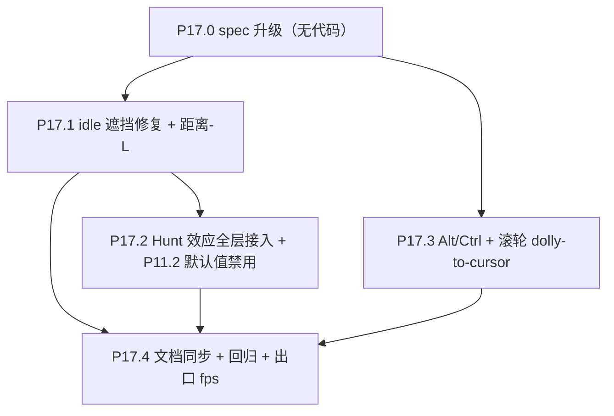

# Phase 17 — 视觉系统升级

> 接 Phase 13/14/15/16 体验与 HUD 抛光后的状态。本 Phase **首次**让 `zCamDistance` 成为运行时变量（之前是 Phase 5.1.5 起的常量），并把 OKLab 色彩公式从「L 来自 vote_average，C 是常量」升级为「距离修正后的 L + Hunt 效应：C 随 L 衰减」。同时把 idle 从半透明雾化层改为深度正确的 opaque 层，属于 shader、材质状态与相机契约级改动，是 Phase 13 后的二档风险。

## 范围

- 子节点：P17.0 → P17.4
- 数据契约：**不变**
- 渲染管线：idle / active vert + perlin.frag 公式扩 Hunt；idle 新增距离-L 路径并切 opaque + depthWrite；新增共享 uniform `uHuntGamma`、`uHuntApplyMask`（位标志，便于关闭单层调试）
- 相机契约：`zCamDistance` 从「常量 30」改为「运行时变量，由 Alt+wheel / dev tool 写入；默认值仍 30」；store 已有该字段，无需扩
- 涉及文件（预计）：
  - [frontend/src/three/galaxyMeshes.ts](frontend/src/three/galaxyMeshes.ts)（新增 uniforms + 默认值；P11.2 默认值改为关闭；idleMaterial 改 `transparent=false` / `depthWrite=true`）
  - [frontend/src/three/shaders/oklab.glsl](frontend/src/three/shaders/oklab.glsl)（新增 `applyHuntChroma(L, L_ref, C_base, gamma) -> C_new` helper）
  - [frontend/src/three/shaders/galaxyIdle.vert.glsl](frontend/src/three/shaders/galaxyIdle.vert.glsl)（接入距离-L + Hunt；P11.2 dim 路径默认无效化；移除旧 P10.2 `vDistFalloff` 语义）
  - [frontend/src/three/shaders/galaxyIdle.frag.glsl](frontend/src/three/shaders/galaxyIdle.frag.glsl)（移除 idle alpha 控制，opaque 路径输出 `alpha=1.0`）
  - [frontend/src/three/shaders/galaxyActive.vert.glsl](frontend/src/three/shaders/galaxyActive.vert.glsl)（接入 Hunt）
  - [frontend/src/three/shaders/perlin.frag.glsl](frontend/src/three/shaders/perlin.frag.glsl)（接入 Hunt — `uPerlinChroma → C_new`）
  - [frontend/src/three/planet.ts](frontend/src/three/planet.ts)（focus 入场快照 `uHuntGamma`）
  - [frontend/src/three/camera.ts](frontend/src/three/camera.ts)（onWheel 分支：Alt/Ctrl 触发 dolly-to-cursor；R_MIN/R_MAX 安全区 clamp）
  - [frontend/src/three/scene.ts](frontend/src/three/scene.ts)（每帧同步 `uZCamDistance`；`__galaxyColor.huntGamma` / `__galaxyColor.huntApplyMask` / distance-L debug；`__galaxyInteraction.zCamDistance` 仍可手写）
  - [docs/project_docs/星球状态机 spec.md](docs/project_docs/星球状态机%20spec.md) §3.1 / §3.2 / §3.4.1 / §3.5
  - [docs/project_docs/视觉参数总表.md](docs/project_docs/视觉参数总表.md) §1（zCamDistance 改为运行时） / §2（Hunt uniforms）/ §4（Perlin Hunt）
  - [docs/project_docs/TMDB 电影宇宙 Tech Spec.md](docs/project_docs/TMDB%20电影宇宙%20Tech%20Spec.md) §1.4.1 / §1.4.3
  - [docs/project_docs/TMDB 电影宇宙 Design Spec.md](docs/project_docs/TMDB%20电影宇宙%20Design%20Spec.md) §1（色彩） / §2.1（滚轮双模式）

## 决策表（已锁定）

| #   | 决策项                      | 选定方案                                                                                                                      | 备注                                                                                                            |
| --- | --------------------------- | ----------------------------------------------------------------------------------------------------------------------------- | --------------------------------------------------------------------------------------------------------------- |
| D1  | Hunt 应用范围               | **全层 idle + active + Perlin**                                                                                               | 三层共享 `uHuntGamma`；perlin.frag 内共享 hue + 同一 L → 同一 C_new                                             |
| D2  | Hunt 公式形式               | `C_new = C_base × clamp(L_actual / L_ref, 0, 1)^γ`                                                                            | `L_ref` = `uLMax`（满分电影 L 端点，与现状参考一致）；`C_base` = 现 `uChroma`；γ 默认 `1.0` 起步，Leva 扫参后定 |
| D3  | P11.2 idle 降 C/L 处置      | **禁用**（默认 `uFocusDimChroma=1.0` / `uFocusDimL=1.0`）                                                                     | 不删 uniform；通过默认值生效。Leva 仍可调；Phase 11.2 spec 标注「Phase 17 起 Hunt 接管语义，默认值保留乘子=1」  |
| D4  | 旧 P10.2 距离衰减处置       | **移除 / 废弃** `uDistanceFalloffK` + `uDistanceFalloffMode` 对 idle/active 颜色或 alpha 的参与                              | Hunt 不再与旧 P10.2 并存；远处视觉由距离-L + Hunt 承担                                                         |
| D5  | Alt + 滚轮放大机制          | **Dolly-to-cursor**：改 `zCamDistance`（推近 / 拉远），同时偏移 camera.x/y 让光标 NDC 命中世界点不变；fov 不变；zCurrent 不变 | 触摸板 pinch（`e.ctrlKey=true`，无键盘修饰）也走该分支；mac Cmd 不触发                                          |
| D6  | dolly 安全区                | `zCamDistance ∈ [2, 300]`                                                                                                     | MIN=2 避免相机进入 zCurrent 平面（`near=0.05` 还有余量）；MAX=300 避免 far culling 大量 active                  |
| D7  | dolly 影响 viswindow 视觉吗 | **不影响**：viswindow 视觉仍由 zCurrent / zVisWindow 驱动；dolly 只改物理距离与可视范围（屏幕投影 size 自然变化）             | Timeline 指针位置不动                                                                                           |
| D8  | idle 遮挡修复               | **彻底移除 idle 透明度控制**，idle 材质默认 `transparent=false` / `depthWrite=true` / `depthTest=true`                        | 修复 idle 层同类透明排序遮挡问题；片元输出 `alpha=1.0`，不再依赖 `vInFocus` 或距离调 alpha                     |
| D9  | 距离-L 公式                 | `L_distance = L_star × clamp(pow(d0 / max(d, eps), 2.0/3.0), L_floor, 1.0)`                                                    | `L_star` 为 vote/Hunt 前该星应有 L；`d0` **不是数学 0**，定义为观测平面参考距离，默认运行时 `zCamDistance`      |
| D10 | 距离 d 定义                 | 初版采用 **Z 轴相机距离** `d = abs(aZ - cameraZ)`，不是完整欧氏距离                                                           | 避免同一 z 平面屏幕边缘因 XY 距离变暗；若后续想要真实空间衰减再另开视觉评估                                    |

## 执行顺序



依赖说明：
- **P17.0** 先行：把 D1–D10 写入三份 spec
- **P17.1** 先落 idle opaque + 距离-L，稳定最终 `L_distance`
- **P17.2** 再接 Hunt，让 idle 消费 P17.1 的 `L_distance`；P17.3 可与 P17.1/P17.2 并行，但最终需回归 `zCamDistance` 与距离-L 同步
- **P17.4** 收尾：扫参定 γ / mask / d0 策略 / distance-L clamp / dolly 速度默认值

---

## P17.0 spec 升级（无代码）

### 状态机 spec §3.1 / §3.2 / §3.4.1 / §3.5

- §3.1 idle 色彩条目：从「`uChroma` 标量 + 透明/距离 alpha」改为「vote 得到 `L_star` → 距离-L 得到 `L_distance` → Hunt 衰减 `C_new = C_base × (L_distance/L_max)^γ`」；idle 材质为 opaque + depthWrite
- §3.2 active 色彩条目：同步加 Hunt 说明
- §3.4.1 focus 视觉降级：保留 P11.2 uniform 接口，**默认值改为 chroma=1.0 / L=1.0**（不压制），把"非焦点降饱和"语义交给 Hunt（Phase 17 起 idle 内 L 已经压低 → C 也跟着压低）
- §3.5.1 Perlin 片元：在 `hueToOkSrgb(uHue[i], uPerlinL, uPerlinChroma)` 之前先计算 `C_new = uPerlinChroma × (uPerlinL/uLMax)^γ`，再传入；**仅当 `uHuntApplyMask` 第 2 位置位时**生效（与 idle/active 第 0/1 位独立）
- 变更记录：Phase 17 行

### 视觉参数总表 §1 / §2 / §4

- §1：把「`zCamDistance = 30`（常量）」改为「**`zCamDistance` 默认 30 / 运行时可调**（Alt/Ctrl + wheel dolly-to-cursor）；安全区 `[2, 300]`」；新增「Wheel 双模式」节
- §2：双 mesh 共享 uniform 列表加 **`uHuntGamma`（默认 1.0）/`uHuntApplyMask`（默认 `0b111` = 7）/ `uZCamDistance` / distance-L 参数**；P11.2 默认值改为 1.0 / 1.0；标注旧 P10.2 `uDistanceFalloffK` / `uDistanceFalloffMode` 在 Phase 17 废弃
- §4：Perlin 表加 Hunt 行（与 §3.5.1 一致）
- §8 Dev 调试桥：`__galaxyColor.huntGamma` / `__galaxyColor.huntApplyMask` / distance-L clamp 参数；`__galaxyInteraction.zCamDistance` 已存在；新增 `__galaxyInteraction.dollyZoomSpeed`

### Tech Spec §1.4.1 / §1.4.3

- §1.4.1 表格 `zCamDistance` 行：注释改为「**Phase 17 起**：默认 30；运行时由 Alt/Ctrl + wheel 写入，安全区 [2, 300]」
- §1.4.3 滚轮控制：扩为「**双模式**」：
  - **默认（无修饰键）**：维持 Phase 5.1.5 macro Z scroll 行为
  - **Alt 或 Ctrl 修饰**：dolly-to-cursor，改 `zCamDistance`，同步偏移 camera.x/y 保持光标命中点 NDC 不变；zCurrent 与 fov 不变
  - 在 focus 态：现状 `getMacroZWheel === false`（特写推拉）保留；Phase 13 P13.3 已决策 focus 态 wheel = noop 不动，因此 Alt+wheel 在 focus 态也 noop（保护 Perlin 球距离恒定）
- §1.4.4 clamp：补 `zCamDistance ∈ [2, 300]`

### Design Spec §1 / §2.1

- §1「内核亮度」段：补一句距离-L + Hunt 说明（"项目内 OKLab L 先随观察距离下降，再由 Hunt 让 C 随 L 同步衰减，模拟远处低光照下的感知变暗与降饱和"）；同时注明 idle 不再使用透明度表达远近
- §2.1 摄像机控制：滚轮节扩为「双模式」（同 Tech Spec §1.4.3）

---

## P17.1 idle 遮挡修复 + 距离-L

### 目标

用 **opaque + depthWrite** 修复 idle 层半透明排序导致的遮挡错乱；同时把旧 P10.2 的"远处变暗 / 透明"语义改为 **OKLab L 的距离修正**。P17.1 只产出稳定的 `L_distance`，P17.2 再让 Hunt 消费该 L 并同步降低 C。

### 可行性评估

结论：**可行，但必须把 d0 定义为参考距离而不是数学 0，并接受 idle 雾状半透明叠层被下线。**

- `transparent=false` / `depthWrite=true` 可直接让 idle 进入不透明深度路径，修复 idle 与 idle 之间"远处盖近处"的同类透明排序问题。
- idle 片元 alpha 需要彻底退出设计语义：`galaxyIdle.frag.glsl` 输出 `vec4(vColor, 1.0)`；`vInFocus` 不再参与 alpha。
- 旧 `vDistFalloff` / `uDistanceFalloffK` / `uDistanceFalloffMode` 不再用于 idle 片元颜色或 alpha；如保留 uniform，只能标 deprecated，不应继续参与视觉。
- 公式 `L(d)=L_star*(d0/d)^(2/3)` 中，`d0` **不能为 0**。若 `d0=0`，所有 `d>0` 的星都会得到 `L=0`。本计划把用户口径"0距离观测星星"解释为"观测平面参考星"，即 `d0 = zCamDistance`。
- 为避免近处星 `d < d0` 被放大到超过自身应有 L，必须 clamp：`distanceLightnessMul = clamp(pow(d0 / max(d, eps), 2.0/3.0), L_floor, 1.0)`。

### 数学与 d 定义

初版采用 **Z 轴相机距离**，不采用完整欧氏距离：

```glsl
float d0 = max(uZCamDistance, 1e-3);
float d = max(abs(aZ - (uZCurrent - uZCamDistance)), 1e-3);
float distanceMul = clamp(pow(d0 / d, 2.0 / 3.0), uDistanceLightnessFloor, 1.0);
float L_distance = L_star * distanceMul;
```

原因：
- `d0 = zCamDistance` 时，位于当前观测平面 `aZ == uZCurrent` 的星有 `d == d0`，因此 `L_distance == L_star`。
- 用 Z 轴距离可以避免同一 z 平面中屏幕边缘星因为 XY 远离相机而变暗，减少"暗角 / vignette"感。
- dolly-to-cursor 改变 `zCamDistance` 时，参考距离同步变化；当前观测平面保持原 L，远离观测平面的星按相对距离变暗。

### galaxyMeshes.ts

- `idleMaterial` 改为：

```ts
transparent: false,
depthWrite: true,
depthTest: true,
blending: THREE.NormalBlending,
```

- 新增 / 保留参数：

```ts
uZCamDistance: { value: 30 },
uDistanceLightnessFloor: { value: 0.08 },
```

- 废弃：

```ts
uDistanceFalloffK
uDistanceFalloffMode
```

若 active / 旧 debug 仍引用这些 uniform，P17.1 内同步清理，避免"旧距离衰减 + 新距离-L + Hunt"三者叠加。

### galaxyIdle.vert.glsl

现有：
1. `voteNorm` → `L_base`
2. 旧 P10.2 计算 `vDistFalloff`
3. P11.2 focus dim 可能压 L/C
4. 片元再用 `vDistFalloff` / alpha 混合做远处衰减

改为：
1. `voteNorm` → `L_star`
2. `distanceMul = clamp(pow(d0 / d, 2.0/3.0), L_floor, 1.0)`
3. `L_distance = L_star * distanceMul`
4. P11.2 乘子保留但默认 1.0，等于无操作
5. `C = uChroma` 暂不接 Hunt；P17.2 再替换为 `applyHuntChroma(L_distance, ...)`
6. OKLab → sRGB 输出 `vColor`

### galaxyIdle.frag.glsl

改为纯 opaque 片元：

```glsl
varying vec3 vColor;

void main() {
  gl_FragColor = vec4(vColor, 1.0);
}
```

`vInFocus` 仍可在 vert 内用于 `sIdle = (1.0 - inFocus) * ...` 控制几何大小 / 是否画 idle，但不再传入片元控制 alpha。

### scene.ts uniform 同步

在 RAF tick 内与 `uZCurrent` 同步的位置补：

```ts
uZCamDistance.value = st.zCamDistance
```

确保 dolly-to-cursor 改变 `zCamDistance` 后，距离-L 的 `d0` 与相机实际距离同帧一致。

### 可能损失的视觉效果

| 原效果 | Phase 17 处置 | 损失 / 变化 |
| ------ | ------------- | ----------- |
| idle 半透明星尘叠层 | 下线 | 背景会更"实"，少一些雾状空气感 |
| `vInFocus` 控 alpha 的窗缘软边 | 下线 | 窗缘过渡更多依赖 idle/active 的尺寸互补；可能变硬 |
| 多颗 idle 半透明混色 | 下线 | 改为深度正确遮挡，颜色不再靠 alpha 叠亮 |
| 旧 P10.2 距离暗化 | 被距离-L 取代 | P17.1 先只变暗；P17.2 Hunt 再同步降饱和，视觉更统一但更"物理化" |

### 验收

- idle 默认态观察密集区域：近处 idle 正确遮挡远处 idle，不再出现明显"远盖近"。
- idle 层在透明度 debug / 截图中不再依赖 alpha：片元输出 alpha 恒为 1，材质为 opaque + depthWrite。
- 当前观测平面 `aZ≈zCurrent` 的星亮度与 Phase 16 同 vote L 基线接近；远离观测平面的星按 `2/3` 幂次柔和变暗。
- P17.1 单独验收时：远处星只按 L 变暗，C 暂不随 L 变；P17.2 再验收 Hunt 后的降饱和。
- 搜索 select / focus：active 层 P16.3 双路径不回退；idle 不写透明不会破坏 active 高亮的可读性。
- 搜索 select / focus 额外检查：前景 idle 写入 depth 后，后景 active 会被真实遮挡；若选中集合可读性显著下降，优先评估 selection/focus 态 idle 尺寸或亮度压低，而不是恢复 idle alpha。
- 若窗缘过硬，优先调 `uBgSizeMul` / `uDistanceLightnessFloor` / `uHuntGamma`，不恢复 idle alpha。

---

## P17.2 Hunt 效应全层接入 + P11.2 默认值禁用

### oklab.glsl 增 helper

[frontend/src/three/shaders/oklab.glsl](frontend/src/three/shaders/oklab.glsl) 增：

```glsl
/**
 * Hunt-style chroma scaling: C drops with L to mimic perceptual desaturation
 * under low lightness. Returns C_new in same units as C_base.
 *
 * - L_actual: current sample lightness (e.g. P17.1 L_distance for idle)
 * - L_ref:    reference lightness — typically uLMax (top-rated star)
 * - C_base:   reference chroma at full lightness (e.g. uChroma)
 * - gamma:    exponent (1.0 = linear; 0.5 = gentler; 1.5+ = aggressive)
 */
float applyHuntChroma(float L_actual, float L_ref, float C_base, float gamma) {
  float t = clamp(L_actual / max(L_ref, 1e-4), 0.0, 1.0);
  return C_base * pow(t, gamma);
}
```

### 共享 uniform

[galaxyMeshes.ts](frontend/src/three/galaxyMeshes.ts) `makeSharedUniforms` 加：

```ts
uHuntGamma: { value: 1.0 },
/** Bit 0 = idle vert apply, bit 1 = active vert apply, bit 2 = perlin frag apply.
 *  Default 0b111 = 7 (all on); set to 0 to A/B compare against pre-Hunt look. */
uHuntApplyMask: { value: 7 },
```

P11.2 默认值同步改：

```ts
uFocusDimChroma: { value: 1.0 }, // was 0.7 — disabled, Hunt 接管降饱和语义
uFocusDimL: { value: 1.0 },      // unchanged 1.0 (was already 1)
```

### Idle vert 接入

[galaxyIdle.vert.glsl](frontend/src/three/shaders/galaxyIdle.vert.glsl) 基于 P17.1 新路径：
1. `voteNorm` → `L_star`
2. P17.1 距离-L → `L_distance`
3. `C_base_after_hunt = (uHuntApplyMask & 1) != 0 ? applyHuntChroma(L_distance, uLMax, uChroma, uHuntGamma) : uChroma`
4. P11.2 乘子继续作用于 `C_base_after_hunt`（保留接口，默认值 1.0 等于无操作）
5. `a = C*cos(hue)`，`b = C*sin(hue)`，OKLab→sRGB

注：使用 GLSL 位运算需确认 WebGL2 GLSL ES 3.00 支持 `&`（支持，对 int 操作）；`uHuntApplyMask` 类型定义为 `int`。

### Active vert 接入

[galaxyActive.vert.glsl](frontend/src/three/shaders/galaxyActive.vert.glsl)：active 的 focus / search select 亮度语义保持由 vote L + Hunt 决定，避免搜索高亮层因相机距离变化而忽明忽暗：

```glsl
float C_base_after_hunt = (uHuntApplyMask & 2) != 0 ? applyHuntChroma(L_base, uLMax, uChroma, uHuntGamma) : uChroma;
```

### Perlin frag 接入

[perlin.frag.glsl](frontend/src/three/shaders/perlin.frag.glsl) 现 `hueToOkSrgb(uHue[i], uPerlinL, uPerlinChroma)`：在调用前一次计算

```glsl
float C_perlin = (uHuntApplyMask & 4) != 0
  ? applyHuntChroma(uPerlinL, uLMax, uPerlinChroma, uHuntGamma)
  : uPerlinChroma;

vec3 col0 = hueToOkSrgb(uHue[0], uPerlinL, C_perlin);
// ...
```

需在 [planet.ts](frontend/src/three/planet.ts) `setFromMovie` 入场快照内复制 `uLMax` 到 perlin material（perlin 现已快照 uLMin/uLMax 等，确认是否需补）。

### Debug

[scene.ts](frontend/src/three/scene.ts) `GalaxyColorDebug` 接口扩：

```ts
huntGamma: number      // [0, 3]
huntApplyMask: number  // 0..7
distanceLightnessFloor: number // [0, 1], P17.1 clamp floor
```

### 验收

- 默认值（γ=1.0，mask=7）下：低分电影（vote_average=2 → 低 L）饱和度自动下降；高分电影（vote_average=9 → 高 L）保持原饱和；中性灰色（vote_average=0 → L=uLMin）几乎接近灰
- `__galaxyColor.huntApplyMask = 0` → 仅关闭 Hunt 做 A/B；P17.1 后仍保留 idle opaque + 距离-L，因此不再与 Phase 16 末态完全等价
- focus 态 P11.2 不再额外压饱和（默认 uFocusDimChroma=1.0）；非焦点 idle 由 P17.1 距离-L + Hunt 自然降饱和
- focus 态 Perlin 球低 vote_average 电影（如 vote_average=3）色彩明显更接近灰；高 vote_average 电影鲜艳 — 与 idle 视觉一致

---

## P17.3 Alt/Ctrl + 滚轮 dolly-to-cursor

### 数学（NDC 不变约束）

设鼠标在屏幕 CSS 坐标 `(cx, cy)`，对应 NDC `(nx, ny) ∈ [-1, 1]²`。Wheel 触发前后世界平面 z = `zCurrent` 上 cursor 命中点 `worldBefore` 与 `worldAfter`，需要满足 `worldBefore == worldAfter` → 偏移 camera.x/y。

简化：因为 fov 不变、相机轴始终沿 +Z（look-at +Z 已破例 focus 但 macro 不破例），可推导：
- `cursor 在 plane z=zCurrent 上的世界偏移 = (nx, ny) × halfWidth × (zCurrent - camera.z) / focalLength`，其中 `halfWidth = tan(fov/2) × distance × aspect`
- 简单做法：直接 unproject 两次

### camera.ts 改造

[camera.ts](frontend/src/three/camera.ts) `onWheel`：

```ts
const onWheel = (e: WheelEvent) => {
  if (options.getInputLocked?.()) return
  e.preventDefault()
  const altLike = e.altKey || e.ctrlKey  // Alt 显式 / Ctrl 含触摸板 pinch
  const dz = Math.sign(e.deltaY) * zScrollSpeed * Math.min(Math.abs(e.deltaY) / 100, 3)

  const macro = options.getMacroZWheel?.() ?? true

  if (altLike && macro) {
    // Phase 17 P17.3 — Dolly-to-cursor（focus 态 P13.3 已决 noop，所以 macro=false 时不进本分支）
    dollyToCursor(camera, e.clientX, e.clientY, dz, options.xyRange, options.xyClampPaddingRatio)
  } else if (macro) {
    // existing macro Z scroll
    const { zCurrent: prev, zCamDistance } = useGalaxyInteractionStore.getState()
    const next = THREE.MathUtils.clamp(prev + dz, zLo, zHi)
    useGalaxyInteractionStore.setState({ zCurrent: next })
    camera.position.z = next - zCamDistance
  } else {
    // legacy non-macro fallback
    camera.position.z += dz
  }
  applyFixedOrientation(camera)
}
```

### dollyToCursor helper

```ts
const _v3a = new THREE.Vector3()
const _v3b = new THREE.Vector3()
const ZCAM_DOLLY_MIN = 2
const ZCAM_DOLLY_MAX = 300
const DOLLY_SPEED_MUL = 5  // 滚轮 dz 单位映射到 zCamDistance 改动 (∝ 当前 zCamDistance 提速远场)

function unprojectToZPlane(
  ndc: { x: number; y: number },
  camera: THREE.PerspectiveCamera,
  worldZ: number,
  out: THREE.Vector3,
): THREE.Vector3 {
  out.set(ndc.x, ndc.y, 0.5).unproject(camera)
  const dirZ = out.z - camera.position.z
  if (Math.abs(dirZ) < 1e-6) {
    out.set(camera.position.x, camera.position.y, worldZ)
    return out
  }
  const t = (worldZ - camera.position.z) / dirZ
  out.set(
    camera.position.x + (out.x - camera.position.x) * t,
    camera.position.y + (out.y - camera.position.y) * t,
    worldZ,
  )
  return out
}

function dollyToCursor(
  camera: THREE.PerspectiveCamera,
  clientX: number,
  clientY: number,
  dz: number,
  xyRange: XyRange,
  xyClampPad: number,
): void {
  const rect = camera.userData.canvas?.getBoundingClientRect?.() ?? null
  // ...或从 domElement 入参传入；细节实现时按现 ndcFromClient 同模式
  const ndc = clientToNdc(clientX, clientY, rect)
  const { zCurrent, zCamDistance: prevR } = useGalaxyInteractionStore.getState()

  const worldBefore = unprojectToZPlane(ndc, camera, zCurrent, _v3a)

  const speed = DOLLY_SPEED_MUL * Math.max(prevR / 30, 0.5)  // 远场加速、近场减速
  const nextR = THREE.MathUtils.clamp(prevR + dz * speed, ZCAM_DOLLY_MIN, ZCAM_DOLLY_MAX)
  useGalaxyInteractionStore.setState({ zCamDistance: nextR })
  camera.position.z = zCurrent - nextR
  camera.updateMatrixWorld(true)

  const worldAfter = unprojectToZPlane(ndc, camera, zCurrent, _v3b)
  camera.position.x += worldBefore.x - worldAfter.x
  camera.position.y += worldBefore.y - worldAfter.y
  clampGalaxyCameraXY(camera, xyRange, xyClampPad)
}
```

注：当用户 dolly 至边界（zCamDistance 触 MIN/MAX）后继续滚动 → noop（不动 cursor 命中点）。

### scene.ts RAF tick 影响

[scene.ts](frontend/src/three/scene.ts) tick 内当前：

```ts
if (selectionPhase === 'idle') {
  camera.position.z = st.zCurrent - st.zCamDistance
}
```

改写无需改动 — `zCamDistance` 现在变化由 store 反映，下一帧 idle tick 自动同步 camera.z。dollyToCursor 内已显式写一次 camera.z，避免一帧延迟。

### 验收

- macOS 触摸板：两指上滑（pinch out，`e.ctrlKey=true`）→ dolly 拉远；两指下滑（pinch in）→ dolly 推近；命中点（光标下）保持 NDC 不变
- Win 鼠标 + Alt：Alt + 滚轮上 → 推近；Alt + 滚轮下 → 拉远
- 默认无修饰键滚轮：仍走 Phase 5.1.5 macro Z scroll，zCurrent 推进
- focus 态：Phase 13 P13.3 决策 wheel = noop；Alt+wheel 同样 noop（在 dollyToCursor 之前 `getMacroZWheel=false` 已分支拦截）
- Timeline 在 dolly 期间不动（zCurrent 不变）
- Cursor 位置在屏幕角落（NDC 接近 ±1）时仍正确收敛（不出现严重偏移；可加更小步长容忍）

---

## P17.4 文档同步 + 回归 + 出口 fps

- [星球状态机 spec.md](docs/project_docs/星球状态机%20spec.md) §3.1 / §3.2 / §3.4.1 / §3.5.1 + 变更记录
- [视觉参数总表.md](docs/project_docs/视觉参数总表.md) §1 / §2 / §4 / §8 同步
- [Tech Spec.md](docs/project_docs/TMDB%20电影宇宙%20Tech%20Spec.md) §1.4.1 / §1.4.3 / §1.4.4
- [Design Spec.md](docs/project_docs/TMDB%20电影宇宙%20Design%20Spec.md) §1 / §2.1
- [Phase 8 基线](docs/benchmarks/Phase%208%20基线%20P8.0%20性能与%20P8.4%20准入.md) 加 `## P17 出口` 节，重跑 P8.0.1 三片段（Hunt + distance-L 主要影响 vertex 计算量；idle opaque 可能改善透明排序成本但增加深度写入，需实测 fps；dolly 对 fps 影响极小）
- 实施报告 P17.1 / P17.2 / P17.3 各一份；P17.4 合入主报告
- 扫参收口：γ / mask / d0 策略 / distance-L floor / dolly speed 默认值最终化并写回 [galaxyMeshes.ts](frontend/src/three/galaxyMeshes.ts)、[camera.ts](frontend/src/three/camera.ts) 默认值
- 回归清单：
  - 三片段视觉对比：Phase 16 末态 vs Hunt on（截图存档）
  - idle opaque 后遮挡关系正确；密集区域不再明显"远盖近"
  - 远处星由距离-L 变暗，且观测平面星不被整体压暗
  - Alt+wheel / pinch dolly-to-cursor 全平台（mac / win / chrome / safari）
  - focus 单态、focus 嵌套、search select 单态在 Hunt 全层应用下颜色一致
  - Phase 13/14/15/16 已落地体验无回归

---

## 风险与回滚

| 风险                                                            | 影响 | 缓解                                                                                        |
| --------------------------------------------------------------- | ---- | ------------------------------------------------------------------------------------------- |
| Hunt 让低分电影几乎消色 → 用户感觉"颜色少了"                    | 中   | γ Leva 调整；保守起步 γ=0.5（更温和）；mask 单层关闭对照                                    |
| Perlin frag Hunt 改色后与 idle/active 在 focus 嵌套时连续性破裂 | 低   | mask bit 2 单独控制 Perlin Hunt；如不一致先关 Perlin Hunt（mask=3）                         |
| `d0` 被误实现为数学 0                                           | 高   | 代码 assert / console.log：`d0 > 0`；以 `zCamDistance` 作为参考距离                           |
| idle opaque 失去半透明雾感、窗缘变硬                            | 中   | 明确作为 P17 新视觉；用距离-L floor、Hunt γ、`uBgSizeMul` 扫参，不恢复 idle alpha             |
| 使用欧氏距离导致屏幕边缘同 z 星变暗                             | 中   | 初版使用 Z 轴相机距离；欧氏距离只作为未来视觉实验                                            |
| idle 写 depth 后前景 idle 遮住后景 active，搜索/聚焦可读性下降   | 中   | P17.1 验收覆盖 search select / focus；必要时压低 selection/focus 态 idle 尺寸或 L             |
| dolly-to-cursor NDC 在边角不稳定                                | 低   | clamp + 速度 magnitude 限制；如发现严重抖动降级为"以屏幕中心为锚点"                         |
| zCamDistance 运行时变化与 Phase 5.1.5 假设冲突影响 Timeline 等  | 中   | Timeline bridgeZ 已在 Phase 13 改为 `bridgeZ = zCurrent`，与 zCamDistance 解耦；spec 已声明 |
| Alt + wheel 与浏览器 / OS 快捷键冲突                            | 低   | `e.preventDefault()` + 仅在 canvas 区域触发；mac 系统级 Alt+wheel 无标准映射                |

## 出口准入

- 所有 P17.0–P17.4 todos `completed`
- Hunt γ / mask / distance-L floor / d0 策略 / dolly speed 默认值最终化
- Phase 8 基线 P17 出口 fps 与 P16 出口对比无显著回归（容差 ±10%；Hunt 增加 vert 一次 pow 调用，可接受）
- 三份项目 spec 与代码一致；变更记录有 Phase 17 行
- mac / win / chrome / safari dolly-to-cursor 各抽一台机器手测通过
