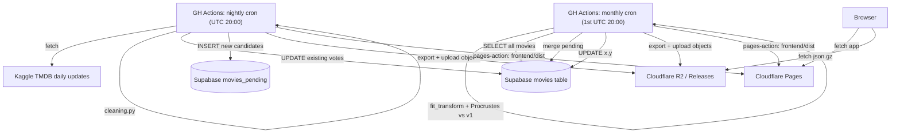
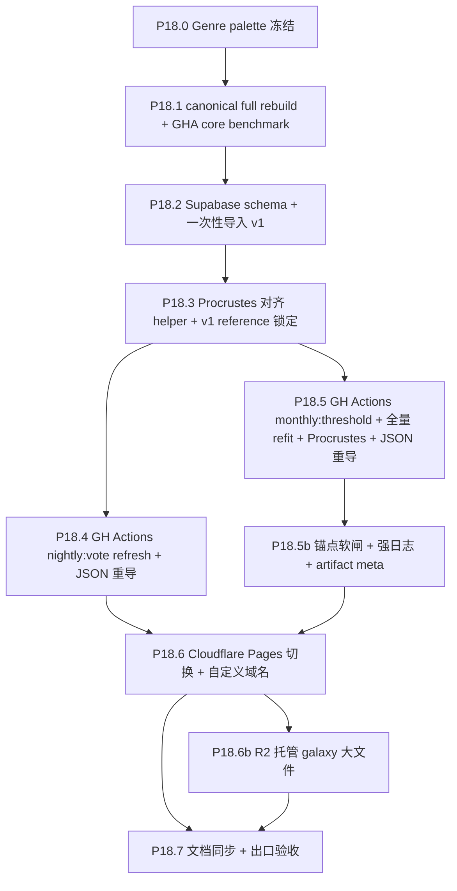

# Phase 18 — 数据流基础设施

## 范围

把当前"本地手工 run pipeline → 提交 galaxy_data.json.gz 到 git → GitHub Pages 部署"的流程，升级为云端自动化的 daily refresh + monthly refit。前端仍消费 **同一 JSON.gz 契约**；大文件默认从 **R2 等对象存储** 拉取（URL 可配置），小体积 shell 由 **Pages** 托管。

**已确认决策**（用户）：
- D1 = A1：Supabase 作 source of truth；前端继续吃 **JSON.gz 契约**，大文件托管 **R2**（URL 可配置），Pages 托管应用壳
- D5 = 不做前端动画（即使 remap 也不插值）
- P18.0 = Genre palette 冻结（独立 export 修复）
- D2 = B1：不持久化 UMAP pkl，每次全量 refit
- 仓库是 **public**：首轮 GHA benchmark 以 GitHub-hosted public `ubuntu-24.04` runner 为目标（4 CPU / 16GB RAM / 14GB SSD）
- 节奏：每日 vote/rating/popularity 轻刷新 + 每月 threshold/membership/topology 全量 refit + **永久 Procrustes 对齐到 v1 reference**
- daily refresh **沿用上一长周期 frozen dynamic threshold**；threshold 版本只在 monthly refit 中更新，避免每日阈值微漂移导致老电影频繁加入/剔除
- 若 GHA runner 无法稳定承担 production 参数重跑，备选为**季度/半年度本地机器 full refit 后上传产物**；基于当前估算每月新增约 0.21%，该降级方案可接受

**当前 production 参数**（来自 [frontend/public/data/galaxy_data.json](frontend/public/data/galaxy_data.json) `meta`，作为 v1 基准锁定）：

```json
{
  "embedding_model": "paraphrase-multilingual-MiniLM-L12-v2",
  "umap_params": {"n_neighbors": 300, "min_dist": 0.4, "metric": "cosine",
                  "random_state": 42, "densmap": true},
  "genre_weight_ratio": 0.6180339887498948,
  "feature_weights": {"text": 1.0, "genre": 1.0, "lang": 1.0}
}
```

注：`densmap=true` 强制 [scripts/feature_engineering/umap_projection.py](scripts/feature_engineering/umap_projection.py) 走 CPU `umap-learn`（cuML 不支持 densmap），所以"GH Actions CPU refit"其实就是当前 production 路径。

### cadence 决策

P18 默认采用 **daily light refresh + monthly full refit**：

- daily：沿用上一 monthly 产出的 frozen dynamic threshold table，只刷新已入库电影的 `vote_count` / `vote_average` / `popularity`，并把新达标电影放入 `movies_pending`；不重算 UMAP，不从 `movies` 删除老电影。
- monthly：重新计算 dynamic threshold，重新评估 membership，合入 pending 新片，全量 `fit_transform`，再 Procrustes 对齐到 v1 reference。
- weekly：不作为默认 cron；仅保留 `workflow_dispatch` 或测试期临时 cron，用于观察数据漂移 / runner 压力。
- fallback：若 public runner production 参数实测不可接受，改为季度或半年度本地机器 full refit + 上传产物，daily refresh 仍保留。

## 数据流图



## 子节点执行顺序



依赖说明：
- **P18.0** 独立可做，可并入当前 phase 17 末（属 export 修复）
- **P18.1** 先做本地 canonical full rebuild，保证当前本地所有产物符合 production 参数；再用 canonical artifacts 在 public `ubuntu-24.04` GHA 上跑 core benchmark（定 P18.5 `timeout-minutes` 与是否坚持 monthly）；本机全链时间用于流程审计，GHA core 时间用于 runner 可行性判断
- **P18.2** v1 锁定：把当前 [frontend/public/data/galaxy_data.json](frontend/public/data/galaxy_data.json) 的 xy 作为永久 Procrustes reference 写入 Supabase 一张专表
- **P18.3** 是 P18.5 的前置 helper
- **P18.5** 与 **P18.5b**：monthly 主路径 + 锚点软闸/观测（同一 workflow 或紧耦合 PR 交付）；**P18.5b** 完成后 **P18.6** 才依赖「可稳定绿」的 monthly（允许软闸下先跑通 CF）
- **P18.4 / P18.5** 互相独立启动，但 **P18.6** 需两者均具备可部署产物；**P18.4** 与 **P18.5b** 无直接依赖
- **P18.6b**：在 Pages 直传稳定后，将超 **25MiB** 的静态数据迁到 **R2**（与 P18.6 同账号生态）；**P18.7** 文档与验收需覆盖 R2 URL / CORS / 版本 manifest
- **P18.7** 收尾

---

## P18.0 Genre Palette 冻结

### 现状隐患

[scripts/export/export_galaxy_json.py](scripts/export/export_galaxy_json.py) `build_genre_palette` (L144-165) 使用 `collect_sorted_genres(df["genres"])` 按当前数据中出现的 genre 排序后等分色环。这意味着：**新数据多/少一个 genre → 所有 hue 整体偏移 → 所有星颜色变化**。当前 19 个 TMDB 官方 genre 实际不会变，但流水线没有强约束。

### 实施

- 新增 `scripts/feature_engineering/genre_palette.py`（或并入 `genre_encoding.py`）：
  - 写死 TMDB 官方 19 genre 的 **id 排序固定列表**（不靠"数据中出现"）
  - 函数 `frozen_genre_hue_table() -> dict[str, float]` 返回名称 → hue (rad) 的固定映射
- [scripts/export/export_galaxy_json.py](scripts/export/export_galaxy_json.py) `build_genre_palette` 改为调用 frozen 表
- 校验：导出时 assert "数据中所有 genre 都在 frozen 表内"，新 genre 出现时显式失败（让人决定是否 bump 全 palette 版本）
- `meta` 加字段 `genre_palette_version: "v1"`（未来真要重排时 bump）

### 验收

- 重导出后 `genre_palette` 与现有 [frontend/public/data/galaxy_data.json](frontend/public/data/galaxy_data.json) `meta.genre_palette` **逐键 hex 完全一致**（v1 兼容）
- 单测：传入"少 1 个 genre 的子集 df"和"包含未知 genre 的 df"两种情况

---

## P18.1 Canonical full rebuild + GHA core benchmark

### 目的

P18.1 分成两件事，避免混淆"产物可信度"与"runner 可行性"：

1. **本地 canonical full rebuild**：从 `data/raw/TMDB_all_movies.csv` 开始完整重跑 cleaning → 384d embedding → genre/lang vectors → DensMAP/UMAP → export → validate，建立 P18 v1 canonical artifacts，确认当前本地数据严格符合 production 参数。
2. **GHA core benchmark**：用 canonical artifacts 中的 feature matrices，在 public `ubuntu-24.04` runner 上只测未来 monthly refit 最重、最关键的 core path：fusion → DensMAP/UMAP → Procrustes → export。该数字决定 P18.5 monthly cron 是否可稳定使用 hosted runner。

production 参数固定为：

- embedding：`sentence-transformers/paraphrase-multilingual-MiniLM-L12-v2`（384d）
- UMAP：`densmap=true`、`n_neighbors=300`、`min_dist=0.4`、`metric=cosine`、`random_state=42`
- feature weights：`text=1.0`、`genre=1.0`、`lang=1.0`
- genre weight ratio：`1/φ`

### P18.1a 本地 canonical full rebuild

新增 `scripts/experiments/phase18_canonical_full_rebuild.py`（或先用 `scripts/run_pipeline.py` 包装）：

1. 输入 `data/raw/TMDB_all_movies.csv`，不直接在对话中读取 raw。
2. 执行 Phase 1 cleaning，输出到独立 run 目录，而非直接覆盖 production：

   

```text
   data/runs/p18_1_full_rebuild_YYYYMMDD_HHMM/
   

```

3. 执行 384d text embedding（优先 GPU；若 CPU 则明确记录）。
4. 执行 genre vectors / language vectors。
5. 执行 CPU `umap-learn` DensMAP full `fit_transform`（当前 production 参数）。
6. 导出 `galaxy_data.json`、`galaxy_data.json.gz`、`galaxy_search_index.json.gz`。
7. 运行 `scripts/validate_galaxy_json.py`。
8. 与当前 production 产物对比：
   - `meta.count`
   - `meta.umap_params`
   - `xy_range` / `z_range`
   - Procrustes 对齐到当前 production 后的位移分布（p50 / p95 / p99 / max）
   - JSON/gzip/search-index 文件大小

本地 full rebuild 必须持续 print：

- 当前步骤名与阶段编号
- 输入/输出路径
- raw 文件 size / mtime / 可选 hash
- 每步开始/结束时间、耗时
- DataFrame shape、过滤后行数、动态阈值摘要
- embedding device / model / batch size / 输出 shape
- feature matrix shape
- UMAP 参数、fit 开始/结束、xy range
- 峰值 RSS 与磁盘剩余
- export 文件大小与 validate 结果

产物命名建议：

```text
data/runs/p18_1_full_rebuild_YYYYMMDD_HHMM/
  cleaned.csv
  text_embeddings.npy
  genre_vectors.npy
  language_vectors.npy
  umap_xy.npy
  galaxy_data.json
  galaxy_data.json.gz
  galaxy_search_index.json.gz
  run_manifest.json
  benchmark_log.txt
```

通过验收后，才决定是否同步覆盖 `data/output/*` 与 `frontend/public/data/*`。

### P18.1b GHA core benchmark

新增 `scripts/experiments/phase18_core_refit_benchmark.py`：

- 输入来自 P18.1a canonical artifacts：`text_embeddings.npy`、`genre_vectors.npy`、`language_vectors.npy`、`cleaned.csv`、`umap_xy.npy`。
- 不重跑 raw cleaning，不重跑老电影 embedding。
- 跑 monthly refit 的核心路径：
  1. load feature matrices
  2. `fuse_modalities`
  3. CPU `umap-learn` DensMAP `fit_transform`
  4. Procrustes 对齐到 canonical v1
  5. export/validate（可选开启，用于测总成本）
- 输出 `umap_xy_p18_core_benchmark.npy` 与 `benchmark_report.json`。
- **必须持续 print 进度**：启动参数、runner CPU/RAM/disk、加载 shape、fusion shape、UMAP 开始/结束、每 30s RSS + disk free heartbeat、xy range、Procrustes 指标。

新增 `.github/workflows/phase18_refit_benchmark.yml`：

- `workflow_dispatch` only。
- `runs-on: ubuntu-24.04`。
- 使用 P18.1a canonical artifacts（cache / artifact / release asset，首次 seed 方式须写进报告）。
- 执行 `python scripts/experiments/phase18_core_refit_benchmark.py`。
- 上传 benchmark report 与日志。

### 本地 vs GHA：不要互相换算墙钟时间

- **本地 full rebuild 时间**：用于证明完整流程和产物可信，不直接代表 CI 月度成本。
- **GHA core benchmark 时间**：用于 P18.5 hosted runner 可行性判断。
- P18.5 的 `timeout-minutes`、是否启用 monthly hosted runner、是否降级 local fallback，均以 **GHA core benchmark** 为主。

### GHA 参数

- **GHA 线程参数初值**（public 4C / 16GB runner）：
  - `OMP_NUM_THREADS=4`
  - `NUMBA_NUM_THREADS=4`
  - `OPENBLAS_NUM_THREADS=1`
  - `MKL_NUM_THREADS=1`
  - `PYTHONUNBUFFERED=1`
  - `timeout-minutes=180` 起步；若实测接近上限再调整

### 验收

- 报告里同时包含：**本地 full rebuild** 与 **GHA core benchmark** 两套数字 + 峰值内存；并注明「P18.5 timeout / 是否需要 fallback 以 GHA core benchmark 为准」。
- 本地 canonical artifacts 的 `meta` 必须与 production 参数一致：384d / DensMAP / `n_neighbors=300` / `min_dist=0.4` / `metric=cosine` / `random_state=42`。
- validate 通过，且 `meta.count == len(movies)`。
- 判定：
  - `< 60 min` 且峰值 RSS `< 10GB`：monthly cron 稳定，weekly 可作为手动实验。
  - `60-120 min`：monthly cron 合理，weekly 不默认启用。
  - `> 120 min` 或接近 OOM：monthly 仍可试一次，但准备 quarterly/local fallback。
  - 接近 6h 或失败：改为季度/半年度本地机器 full refit + 上传产物。
- 输出存档到 `docs/reports/Phase 18.1 Canonical full rebuild 与 GHA core benchmark 实施报告.md`

---

## P18.2 Supabase schema + 一次性导入 v1

### Schema 设计

```sql
-- v1 reference 坐标（永久不变，作为 Procrustes 永久基准）
CREATE TABLE galaxy_v1_reference (
  movie_id BIGINT PRIMARY KEY,
  x_v1 DOUBLE PRECISION NOT NULL,
  y_v1 DOUBLE PRECISION NOT NULL,
  z_v1 DOUBLE PRECISION NOT NULL  -- decimal year + jitter (deterministic)
);

-- 当前生效的电影宇宙数据
CREATE TABLE movies (
  id BIGINT PRIMARY KEY,
  imdb_id TEXT,
  -- 标识与展示
  title TEXT NOT NULL,
  original_title TEXT,
  title_normalized TEXT NOT NULL,
  overview TEXT,
  tagline TEXT,
  poster_path TEXT,
  -- 时间与流派
  release_date DATE NOT NULL,
  genres TEXT[] NOT NULL,
  original_language TEXT NOT NULL,
  spoken_languages TEXT[],
  production_countries TEXT[],
  production_companies TEXT[],
  -- 数值字段（每日刷新的目标）
  vote_count INTEGER NOT NULL,
  vote_average REAL NOT NULL,
  popularity REAL,
  imdb_rating REAL,
  imdb_votes INTEGER,
  runtime INTEGER,
  revenue BIGINT,
  budget BIGINT,
  -- 人员
  cast_list TEXT[],
  director TEXT[],
  writers TEXT[],
  producers TEXT[],
  director_of_photography TEXT[],
  music_composer TEXT[],
  -- 坐标 (UMAP refit + Procrustes 对齐到 v1 后的最新值)
  x DOUBLE PRECISION NOT NULL,
  y DOUBLE PRECISION NOT NULL,
  z DOUBLE PRECISION NOT NULL,
  -- 元数据
  last_vote_update TIMESTAMPTZ DEFAULT now(),
  last_xy_refit TIMESTAMPTZ DEFAULT now()
);

CREATE INDEX idx_movies_release_date ON movies(release_date);
CREATE INDEX idx_movies_vote_count ON movies(vote_count);

-- 候补：通过门槛但还没 fit 入星图的新电影（monthly refit 时合并）
CREATE TABLE movies_pending (
  id BIGINT PRIMARY KEY,
  -- 全部 movies 字段（除了 x/y），feature vectors 也存
  -- (text_embedding, genre_vector, lang_vector 是 BYTEA blob)
  text_embedding BYTEA NOT NULL,  -- float32 (384,) raw bytes
  genre_vector BYTEA NOT NULL,
  lang_vector BYTEA NOT NULL,
  -- ... 其他元数据列同 movies
  detected_at TIMESTAMPTZ DEFAULT now()
);

-- 历史 vote 快照（可选，用于"投票数演变"未来可视化；按月聚合）
CREATE TABLE vote_snapshots (
  movie_id BIGINT NOT NULL,
  snapshot_month DATE NOT NULL,  -- 月初 1 号
  vote_count INTEGER NOT NULL,
  vote_average REAL NOT NULL,
  PRIMARY KEY (movie_id, snapshot_month)
);

-- 长周期阈值版本：monthly refit 更新，daily refresh 只读取当前 active 版本
CREATE TABLE threshold_versions (
  version TEXT PRIMARY KEY,
  computed_at TIMESTAMPTZ NOT NULL DEFAULT now(),
  quantile REAL NOT NULL,
  alpha REAL NOT NULL,
  rolling_window INTEGER NOT NULL,
  abs_min REAL NOT NULL,
  thresholds_json JSONB NOT NULL,  -- year -> vote_count threshold
  is_active BOOLEAN NOT NULL DEFAULT false
);
```

### 一次性导入

新增 `scripts/supabase/initial_import.py`：
- 从 [data/output/cleaned.csv](data/output/cleaned.csv) + [data/output/umap_xy.npy](data/output/umap_xy.npy) 读取当前 v1 数据
- 计算 z（用 `decimal_year_with_jitter`，与 [scripts/export/export_galaxy_json.py](scripts/export/export_galaxy_json.py) 一致）
- 批量 INSERT 进 `galaxy_v1_reference`（永久不变）
- 批量 INSERT 进 `movies`（首次 x = x_v1, y = y_v1, z = z_v1）
- 用 supabase-py（rest API；批量 chunk_size=1000）

### 验收

- Supabase 表行数 = 59014（与 cleaned.csv 一致）
- 抽查 10 条记录字段完整性
- `galaxy_v1_reference` 与导入时刻的 `movies.x/y/z` 数值完全一致

---

## P18.3 Procrustes 对齐 helper + v1 reference 锁定

### 实施

新增 `scripts/feature_engineering/procrustes_align.py`：

```python
import numpy as np
from scipy.linalg import orthogonal_procrustes

def align_to_reference(
    new_xy: np.ndarray,    # shape (N_new + N_existing, 2) UMAP fit_transform 输出
    new_ids: np.ndarray,   # shape (N_new + N_existing,) movie ids
    ref_xy_by_id: dict[int, tuple[float, float]],  # v1 reference 坐标
) -> np.ndarray:
    """
    用 v1 reference 中存在的 ids 求最优正交变换 R + 平移 t + 缩放 s,
    应用到全部 new_xy（包括新 ids）。
    
    Returns: aligned_xy shape (N, 2)
    """
    common_mask = np.array([mid in ref_xy_by_id for mid in new_ids])
    A = new_xy[common_mask]  # 待对齐
    B = np.array([ref_xy_by_id[mid] for mid in new_ids[common_mask]])  # reference
    # 中心化
    A_mean, B_mean = A.mean(axis=0), B.mean(axis=0)
    A_c, B_c = A - A_mean, B - B_mean
    # 求最优正交矩阵 R 和缩放 s
    R, s = orthogonal_procrustes(A_c, B_c)
    # 应用到全部点
    aligned = (new_xy - A_mean) @ R * s + B_mean
    return aligned
```

测试用例：
- 输入：随机 (1000, 2) + 旋转 30° + 反射 + 平移 + 缩放 1.5×
- 输出：与原数据 RMSE < 1e-6
- 加 5% 噪声后 RMSE 应远小于直接对比

### v1 reference 不可变约定

- `galaxy_v1_reference` 表创建后**任何脚本不得 UPDATE/DELETE**（加 RLS policy 或在脚本中加 assert）
- 仅在未来人为决定"重置宇宙"时（比如换 embedding model）由专用脚本一次性重写

---

## P18.4 GH Actions nightly: vote refresh

### Workflow `.github/workflows/nightly_vote_refresh.yml`

```yaml
on:
  schedule:
    - cron: '0 20 * * *'  # 每日 UTC 20:00 (北京时间次日 04:00)
  workflow_dispatch:

jobs:
  refresh:
    runs-on: ubuntu-24.04
    timeout-minutes: 60
    steps:
      - checkout
      - setup-python (3.11)
      - pip install -r requirements.cpu.txt + supabase + kaggle
      - run: python scripts/cron/nightly_vote_refresh.py
        env:
          KAGGLE_USERNAME, KAGGLE_KEY, SUPABASE_URL, SUPABASE_SERVICE_KEY
      - run: python scripts/cron/export_from_supabase.py --output frontend/public/data/galaxy_data.json
      - run: deploy to Cloudflare Pages (action)
```

### 脚本 `scripts/cron/nightly_vote_refresh.py`

1. `kaggle datasets download alanvourch/tmdb-movies-daily-updates` → 解压
2. 加载 `threshold_versions.is_active = true` 的 frozen threshold table；daily **不得重算 dynamic threshold**
3. `cleaning.run_cleaning_pipeline(...)` 得当前过滤后 cleaned df，但 `vote_count` 动态阈值使用上一周期 frozen table
4. 与 Supabase `movies` 表 diff:
   - **现有 id**：批量 UPDATE `vote_count` / `vote_average` / `popularity`（这是每日真实变化）
   - **新 id 通过 frozen threshold 门槛**：跑 embedding + genre encode + lang encode → INSERT `movies_pending`（feature vectors 以 BYTEA 存）
   - **老电影低于当前 frozen threshold**：daily 不删除、不从主星图移除；最多写入状态字段 / 报告，由 monthly membership pass 决定是否处理
5. 月初额外快照：INSERT INTO `vote_snapshots` (按月聚合)
6. 输出统计：本次刷新影响行数、pending 新增数、below-threshold 观察数

### 脚本 `scripts/cron/export_from_supabase.py`

- 从 `movies` 表 SELECT 全部行（59K 量级，分页拉）
- 用 P18.0 的 frozen genre palette
- 调用 [scripts/export/export_galaxy_json.py](scripts/export/export_galaxy_json.py) 的核心函数（拆出 `build_payload(df, xy)` 纯函数版本）生成 JSON.gz
- 写入 `frontend/public/data/galaxy_data.json.gz` + `galaxy_search_index.json.gz`
- meta.version 改为 `YYYY.MM.DD.daily.<seq>` 区分

### 验收

- nightly cron 执行时长 < 30 分钟
- vote_count 在 Supabase 中确实有变化（抽查 10 部高 popularity 电影日间日变化）
- 生成的 JSON.gz 与上次 diff 主要在 size/emissive 字段（log10(vote_count) 平滑变化）
- daily 不改变 `threshold_versions`，不触发主星图 membership 删除

---

## P18.5 GH Actions monthly: threshold + 全量 refit + Procrustes

### Workflow `.github/workflows/monthly_refit.yml`

```yaml
on:
  schedule:
    - cron: '0 20 1 * *'  # 每月 1 日 UTC 20:00
  workflow_dispatch:

jobs:
  refit:
    runs-on: ubuntu-24.04
    timeout-minutes: 180  # 视 P18.1 在 GHA 上的实测墙钟 + 余量调整
    env:
      PYTHONUNBUFFERED: "1"
      OMP_NUM_THREADS: "4"
      NUMBA_NUM_THREADS: "4"
      OPENBLAS_NUM_THREADS: "1"
      MKL_NUM_THREADS: "1"
    steps:
      - checkout
      - setup-python
      - pip install (含 umap-learn[densmap], scipy, sentence-transformers)
      - run: python scripts/cron/monthly_refit.py
      - run: python scripts/cron/export_from_supabase.py
      - deploy to CF Pages
```

### 脚本 `scripts/cron/monthly_refit.py`

1. 拉取 Kaggle 最新数据并运行 cleaning；**重新计算 dynamic threshold table**，写入新的 `threshold_versions`，并设置为 active
2. 根据新 threshold 重新评估 membership：
   - 新达标电影：合入 pending / full refit 输入
   - 低于阈值的既有电影：默认不立即硬删除；先标记并在报告中列出，除非连续多周期低于阈值再人工确认移除策略
3. SELECT 所有 `movies` + `movies_pending`（拼成完整 df）
4. 重新加载 / 重算 feature 矩阵：
   - 旧 ids: 从本地 `text_embeddings.npy` 拉（GH Actions 用 cache action 缓存这些大文件）
   - 新 ids（来自 pending）: 从 Supabase BYTEA 还原 float32 vectors
5. 拼接 → `fuse_modalities` → `_fit_umap_learn`（CPU densmap）
6. 加载 `galaxy_v1_reference` → 用 P18.3 的 `align_to_reference`
7. 把对齐后的 (x, y) UPDATE 回 `movies`（pending 的也一并 INSERT 进 `movies` 并清空 pending）
8. 触发一次 export_from_supabase.py
9. meta.version 改为 `YYYY.MM.DD.monthly.<seq>`，并记录 `threshold_version`

### P18.5b 运营策略：软闸 + 强日志 + Artifact Meta（优先跑通链路）

**背景**：GHA 使用 Kaggle 日更 raw、四件套可能来自本机较早快照时，`cleaned` 行数 / id 集合与缓存 embedding 会错位，Procrustes 后 mean L2 可能显著高于历史 v1 全量重跑时的 `--anchor-rmse-abort=0.25`。**短期目标**是先跑通 **Supabase → monthly job → export → Cloudflare Pages**，数据新鲜度与残差分布用 **观测** 迭代，而非每月因硬闸失败。

**软闸（建议实现约定）**

- **默认**：`mean_anchor_L2` 超过「历史 P95 的若干倍」或超过绝对天文数字（如 `>50`，可配置）才 **fail CI**；中间区间 **只记日志 + 写 artifact，不 abort**（等价于生产上使用 `--skip-anchor-rmse-abort` 或 workflow env `MONTHLY_ANCHOR_MODE=soft`）。
- **结构性错误仍硬失败**：如 `n_anchors < 2`、`NaN`/`Inf`、export validate 失败、四件套缺失。
- **人工 unblock**：保留 `workflow_dispatch` 输入或 env，可在一轮排障中临时 **force hard** 或 **force skip**，避免卡死。

**强日志（stdout / job log 必须可 grep）**

每条 monthly run 至少打印（键名建议稳定）：`anchor_mean_l2`、`anchor_max_l2`、`n_anchors`、`n_fit`（UMAP 行数）、`cleaned_rows`、`cache_bundle_rows`（四件套 `cleaned.csv` 行数）、`membership_count`、`threshold_version`、`raw_source`（kaggle path / hash 前缀）、可选 `bundle_fingerprint`（四文件 mtime 或 sha256 前缀）。

**Artifact（可选但推荐）**

- 在 `monthly_refit` job 内生成 **`monthly_refit_meta.json`**（或 `refit_summary.json`），内容与上述字段一致，并 `actions/upload-artifact` 与 `galaxy_data.json(.gz)` 同次 run 上传；便于离线对比 **数周内残差 P95**，再决定是否恢复硬闸或改为告警 webhook。
- **不向 `galaxy_data.json` 强塞运营字段**（避免前端契约变化）；meta 仅服务运维与复盘。

**re-embed / 四件套节奏**

- 与 **每月一次** monthly 对齐：本地或可信机在 cron 前 **用与 GHA 同源的 raw（或接受 Kaggle 与本地差异）** 重打四件套 zip，更新 `GALAXY_EMBED_BUNDLE_URL`。
- **数周观测期**：只记录 `anchor_max_l2` 等，不收紧 `--anchor-rmse-abort`；观测结束后再写入 Data Pipeline / Tech Spec 的正式阈值。

### 关键：embedding cache 策略

GitHub-hosted public `ubuntu-24.04` runner 为 4 CPU / 16GB RAM / 14GB SSD。`text_embeddings.npy` (~180MB) + `cleaned.csv` (~62MB) + numpy weights = ~250MB，磁盘上足够。用 [actions/cache@v4](https://github.com/actions/cache) 缓存 `data/output/*.npy` + `cleaned.csv`，但 cache miss 时必须 print 清晰错误和恢复步骤。

新增电影的 embedding 只在 P18.4 nightly 时计算（增量小，CPU MiniLM ~100ms/部），存进 `movies_pending.text_embedding` BYTEA。

### 验收（需 P18.1 实测后细化）

- monthly cron 执行时长 < 120 分钟（阈值以 **P18.1 在 GHA 上的墙钟** 为基准留出余量；勿仅用本机时间推断）
- **P18.5b**：至少 2 次手动 dispatch 在**软闸**下全流程绿（含 export + validate）；artifact 中 `anchor_*` 与日志一致；极端 fail 路径有单测或 dry-run 证明
- **对齐质量**：观测期内记录残差分布；不强制「95% 星位移 < 0.01」为当月门禁（该条可作为 healthy 参考，在收紧硬闸后恢复为验收项）
- workflow 保留 `workflow_dispatch`，但默认不启用 weekly schedule

### Runner fallback

若 P18.1 或 P18.5 实测显示 public runner 无法稳定承担 production 参数：

- 保留 daily light refresh 自动化。
- full refit 改为季度或半年度在本地高性能机器运行。
- 本地产物包括：`umap_xy.npy`、对齐后的坐标、导出的 `galaxy_data.json.gz` / `galaxy_search_index.json.gz`、benchmark/report。
- 上传方式：手动上传到 Supabase + Cloudflare Pages / R2，或通过 `workflow_dispatch` 仅执行"接收产物并部署"的轻量 job。

---

## P18.6 Cloudflare Pages 切换

**与 P18.6b**：Pages 负责 **前端静态 bundle**（`pages-action` 上传 `frontend/dist`）；**`galaxy_data.json.gz` 等 >25MiB** 不走 Pages 包内路径，见下文 **P18.6b R2**。

### 步骤

1. 在 Cloudflare 创建 **Pages** 项目；生产以 **GitHub Actions Direct Upload** 为主（可选断开 Git 自动构建，避免与 `npm ci`/optional 原生绑定冲突）
2. 本地/CI 构建：`cd frontend && npm ci && npm run build`（或与 nightly/monthly workflow 一致）
3. Output: `frontend/dist`
4. 配置自定义域名（用户已购或新购）
5. P18.4 / P18.5 cron 末尾用 [cloudflare/pages-action](https://github.com/cloudflare/pages-action) 触发部署；**部署成功不依赖** Procrustes 硬阈值通过（与 P18.5b 软闸一致）。若启用 local fallback，则轻量 `workflow_dispatch` 仅接收/部署本地产物
6. **（推荐）** monthly/nightly job 将 **`monthly_refit_meta.json`**（或等价 summary）作为 **artifact** 保留，便于与 CF 发布结果交叉排障；不向 `galaxy_data` 公共 meta 注入运维专有字段
7. 灰度：保留现有 GitHub Pages 1-2 周作为备线，监控 CF Pages 流量与延迟
8. 国内访问：本 phase **不处理**（标注为 Phase 19+ 任务）

### 验收

- CF Pages 域名能正常加载应用；**完整星系数据**经 R2（或当前配置的 data URL）加载成功
- 首字节延迟（海外）< GitHub Pages
- 一周内 CF Pages bandwidth 用量稳定（free tier 无限带宽，但要监控异常）
- **P18.5 路径**：至少一次由 **monthly 软闸成功** 触发的 Pages 部署（证明链路与 P18.5b 不互斥）
- **P18.6b**：`galaxy_data.json.gz`（及必要时 `galaxy_search_index.json.gz`）从 **R2 公开 URL** 加载成功；无 CORS 错误；更新后浏览器能拿到新版本（缓存/版本策略可验收）

---

## P18.6b Cloudflare R2（大静态数据）

**动机**：Cloudflare Pages 对部署内**单文件 25MiB** 硬限制；当前 `galaxy_data.json.gz` 已超过，无法与前端 bundle 同包发布。

**目标形态**（与数据流图一致）：

1. **GHA**（nightly / monthly）在导出后：用 S3 兼容 API 或 `wrangler r2 object put` 将 `galaxy_data.json.gz`、（可选）`galaxy_search_index.json.gz` 写入指定 **bucket + key**（建议 key 含版本或 `GALAXY_EXPORT_SEQ`，便于长缓存）。
2. **R2** 开启公开读（自定义域 / `*.r2.dev` 等），配置 **CORS** 允许站点源。
3. **Pages** 仅部署 `frontend/dist`；前端通过 **环境变量或 manifest**（小 JSON，可仍在 `public/` 或由构建注入）解析当前数据 URL。
4. **Secrets**：`R2_ACCOUNT_ID`、bucket 名、API token（最小权限：该 bucket 读写）置于 GitHub Actions；**勿**提交到仓库。

**成本与用量**（摘要）：R2 Standard 约 **$0.015/GB·月** 存储，**Class B（Get）** 按百万次量级计费；**出站自 R2 不按流量加价**（详见 [Cloudflare R2 Pricing](https://developers.cloudflare.com/r2/pricing/)）。本项目单对象 ~30MB + 低频全量下载，在免费档内概率高。

**验收**：与上节 P18.6b 勾选项一致；另建议记录首月 R2 dashboard 的 Class A/B 用量作基线。

---

## P18.7 文档同步 + 出口验收

- 更新 [docs/project_docs/TMDB 电影宇宙 Data Pipeline.md](docs/project_docs/TMDB 电影宇宙 Data Pipeline.md)：daily frozen threshold + monthly refit + **P18.5b 软闸/artifact 观测** + public runner benchmark + local fallback + **R2 大文件与 Pages 分工**
- 更新 [docs/project_docs/TMDB 电影宇宙 Tech Spec.md](docs/project_docs/TMDB 电影宇宙 Tech Spec.md) §2 / §4：增加 Supabase + cron + Procrustes 章节
- 更新根 [README.md](README.md)："运行管线"小节加 cron 路径说明
- 实施报告：每个 P18.x 一份，存 `docs/reports/Phase 18.x ...`
- 出口验收清单：
  - [ ] P18.0 frozen palette 与 v1 hex 一致
  - [ ] P18.1：本地 canonical full rebuild 产物完整且 validate 通过；public `ubuntu-24.04` GHA core benchmark 有墙钟/内存数字；可行性（内存/timeout）以 GHA core benchmark 为准
  - [ ] P18.2 Supabase 59014 行 + galaxy_v1_reference 不可变
  - [ ] P18.3 Procrustes helper 单测通过
  - [ ] P18.4 nightly cron 手动 dispatch 成功 + **Pages 部署前端** + **galaxy 数据上 R2**（或等价对象存储）
  - [ ] P18.5 + P18.5b：monthly 在软闸下手动 dispatch 成功 + artifact 含锚点与阈值元数据；观测策略写入实施报告；若启用硬闸则记录触发条件
  - [ ] P18.6 CF Pages 自定义域名生效
  - [ ] P18.6b R2：大 JSON 从 R2 加载、CORS 与版本/缓存策略可验收
  - [ ] 至少 1 周 nightly cron 稳定运行（无失败）

---

## 风险与回滚

| 风险                                                     | 影响                | 缓解                                                                                                                                                                                       |
| :------------------------------------------------------- | :------------------ | :----------------------------------------------------------------------------------------------------------------------------------------------------------------------------------------- |
| Kaggle API 配额或下架 dataset                            | 高                  | 加 fallback：失败时 cron 邮件通知；考虑直接调 TMDB 官方 API（rate-limited 但可控）                                                                                                         |
| Supabase free tier 数据库 500MB 上限                     | 中                  | 59K 行约 80MB 表数据 + BYTEA features ~250MB，接近上限。若超：把 `movies_pending.text_embedding` 等 BYTEA 移到 Supabase Storage                                                            |
| GH Actions public runner 资源限制（4 CPU / 16GB / 14GB） | 中                  | P18.1 先本地 full rebuild 建 canonical artifacts，再用 production 参数跑 GHA core benchmark；打印 heartbeat / RSS / disk；若 OOM 或接近 6h，full refit 改季度/半年度本地运行后上传         |
| GH Actions free tier / 公共仓库配额变化                  | 低                  | public 仓库标准 runner 当前免费；仍需记录 job 分钟与失败率，避免把 heavy refit 设为 weekly 默认                                                                                            |
| CPU refit 在 GHA 上实测超 120 分钟                       | 中                  | 以 **GHA core benchmark 墙钟** 决策（非本机 full rebuild）：60-120min → monthly 保留；>120min 或接近 OOM → 准备 local quarterly/biannual fallback；近 6h → 不再用 hosted runner full refit |
| numba/UMAP 升级再次破坏                                  | 低（B1 已绕开 pkl） | pin 版本于 [requirements.cpu.txt](requirements.cpu.txt)；CI lock 测试                                                                                                                      |
| Procrustes 对齐残差偏大（raw/四件套/库版本漂移）         | 中                  | **P18.5b**：软闸 + 强日志 + artifact；定期更新四件套与 Kaggle 对齐；数周后据 P95 再设硬闸或告警；仍不可接受则 full re-embed 迁 GHA 或更强托管                                              |
| CF Pages **单文件 25MiB** 上限（galaxy_data.json.gz 超限）       | 高                  | **P18.6b**：大文件上 R2 + 公开读；Pages 只托管前端；manifest/版本号控制缓存                                                                                                                |
| CF Pages 国内访问问题                                    | 中                  | 本 phase 不解决；GitHub Pages 保留 1-2 周备线；Phase 19+ 处理                                                                                                                              |
| v1 reference 永久锁定的代价（未来想"宇宙重组"难）        | 低                  | 接受。重置是显式人为操作，不是流水线常规路径                                                                                                                                               |

## 出口准入

- 所有 P18.0–P18.7 todos `completed`（含 **P18.5b** 与 **P18.6b**）
- nightly + monthly cron 各跑过至少 2 次手动 dispatch 成功；monthly 在观测期允许软闸；或明确记录 monthly hosted runner 不可行并启用 local fallback
- 切流量到 CF Pages 后 1 周无重大问题
- 三份项目 spec 与代码一致，变更记录有 Phase 18 行
- v1 reference 表行数固定 = 59014 且 `last_modified` 不变