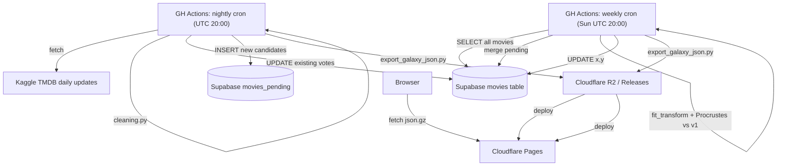
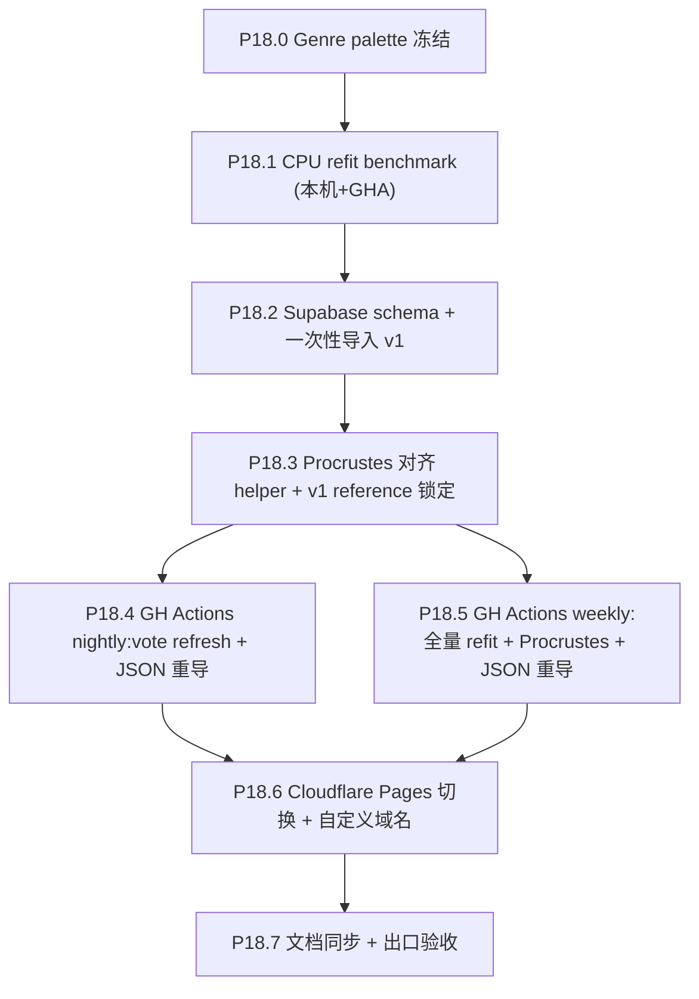

# Phase 18 — 数据流基础设施

## 范围

把当前"本地手工 run pipeline → 提交 galaxy_data.json.gz 到 git → GitHub Pages 部署"的流程，升级为云端自动化的 daily refresh + weekly refit。前端不动（继续吃静态 `galaxy_data.json.gz`）。

**已确认决策**（用户）：
- D1 = A1：Supabase 作 source of truth，前端继续吃静态 JSON.gz
- D5 = 不做前端动画（即使 remap 也不插值）
- P18.0 = Genre palette 冻结（独立 export 修复）
- D2 = B1：不持久化 UMAP pkl，每次全量 refit
- 节奏：每日 vote 刷新 + 每周/每月全量 refit + **永久 Procrustes 对齐到 v1 reference**

**当前 production 参数**（来自 [frontend/public/data/galaxy_data.json](frontend/public/data/galaxy_data.json) `meta`，作为 v1 基准锁定）：

```json
{
  "embedding_model": "paraphrase-multilingual-MiniLM-L12-v2",
  "umap_params": {"n_neighbors": 300, "min_dist": 0.4, "metric": "cosine",
                  "random_state": 42, "densmap": true},
  "genre_weight_ratio": 0.6180339887498948,
  "feature_weights": {"text": 1.0, "genre": 1.0, "lang": 1.0}
}
```

注：`densmap=true` 强制 [scripts/feature_engineering/umap_projection.py](scripts/feature_engineering/umap_projection.py) 走 CPU `umap-learn`（cuML 不支持 densmap），所以"GH Actions CPU refit"其实就是当前 production 路径。

## 数据流图



## 子节点执行顺序



依赖说明：
- **P18.0** 独立可做，可并入当前 phase 17 末（属 export 修复）
- **P18.1** 本机 benchmark + **同脚本在 GHA 上跑一次**拿到墙钟时间（定 P18.5 `timeout-minutes` 与每周/每月）；本机数字只做量级与内存，不可当作 CI 确切耗时
- **P18.2** v1 锁定：把当前 [frontend/public/data/galaxy_data.json](frontend/public/data/galaxy_data.json) 的 xy 作为永久 Procrustes reference 写入 Supabase 一张专表
- **P18.3** 是 P18.5 的前置 helper
- **P18.4 / P18.5** 互相独立，可并行实现
- **P18.6** 切流量到 CF Pages（保留 GitHub Pages 备线 1-2 周观察）
- **P18.7** 收尾

---

## P18.0 Genre Palette 冻结

### 现状隐患

[scripts/export/export_galaxy_json.py](scripts/export/export_galaxy_json.py) `build_genre_palette` (L144-165) 使用 `collect_sorted_genres(df["genres"])` 按当前数据中出现的 genre 排序后等分色环。这意味着：**新数据多/少一个 genre → 所有 hue 整体偏移 → 所有星颜色变化**。当前 19 个 TMDB 官方 genre 实际不会变，但流水线没有强约束。

### 实施

- 新增 `scripts/feature_engineering/genre_palette.py`（或并入 `genre_encoding.py`）：
  - 写死 TMDB 官方 19 genre 的 **id 排序固定列表**（不靠"数据中出现"）
  - 函数 `frozen_genre_hue_table() -> dict[str, float]` 返回名称 → hue (rad) 的固定映射
- [scripts/export/export_galaxy_json.py](scripts/export/export_galaxy_json.py) `build_genre_palette` 改为调用 frozen 表
- 校验：导出时 assert "数据中所有 genre 都在 frozen 表内"，新 genre 出现时显式失败（让人决定是否 bump 全 palette 版本）
- `meta` 加字段 `genre_palette_version: "v1"`（未来真要重排时 bump）

### 验收

- 重导出后 `genre_palette` 与现有 [frontend/public/data/galaxy_data.json](frontend/public/data/galaxy_data.json) `meta.genre_palette` **逐键 hex 完全一致**（v1 兼容）
- 单测：传入"少 1 个 genre 的子集 df"和"包含未知 genre 的 df"两种情况

---

## P18.1 CPU 全量 refit benchmark（实测）

### 目的

把"30-60 分钟"估算变成**可复核的数字**。决定 P18.5 cron 选每周还是每月，以及 `timeout-minutes`（GH Actions 单 job 上限 6h；**hosted runner 的 vCPU / RAM 以 [GitHub 文档](https://docs.github.com/en/actions/using-github-hosted-runners/using-github-hosted-runners/about-github-hosted-runners) 为准**，勿凭记忆写死核数）。

### 本地 vs GHA：不要互相换算墙钟时间

- **本机（如 Win + .venv）**：CPU 架构、核心数、BLAS 线程与 Linux CI 不一致，**墙钟时间不能 1:1 换算成 GHA**。
- **本机仍必跑**：迭代快、验证脚本正确、得到 **fit_transform 段峰值 RSS**（判断是否会顶满 runner 内存）与**耗时数量级**。
- **GHA 上再跑一次**：用与 P18.5 相同的 `runs-on`（如 `ubuntu-latest`）+ `workflow_dispatch`，在同一套缓存/输入假设下跑**同一条 benchmark 命令**，得到 **CI 墙钟时间**；P18.5 的 timeout 与「周/月」决策以 **GHA 实测** 为主，本机为辅。

### 实施

- 新增 `scripts/experiments/phase18_full_refit_benchmark.py`：
  - 参数固定为当前 production：MiniLM 384d / densmap / n_neighbors=300 / min_dist=0.4 / random_state=42
  - 直接复用现有 `data/output/text_embeddings.npy` + `genre_vectors.npy` + `language_vectors.npy`（不重跑 embedding）
  - 调 `umap_projection.fuse_modalities` + `_fit_umap_learn` (CPU)
  - 计时 + 打印峰值内存（`psutil.Process().memory_info().rss`）
  - 输出 `umap_xy_p18_benchmark.npy` 验证与 `umap_xy.npy` 误差（应在 Procrustes 对齐后非常小）
- **本机**：跑一次，记录 fit_transform 段总耗时、峰值 RSS、CPU/OS 简述。
- **GHA**：新增 `.github/workflows/phase18_refit_benchmark.yml`（仅 `workflow_dispatch`），checkout → setup-python → 安装依赖 → 将 benchmark 所需 `data/output/*.npy` 经 **cache 或 artifact** 对齐到与本机相同输入（或文档写明首次 seed 上传方式）→ `python scripts/experiments/phase18_full_refit_benchmark.py`；记录 **job 墙钟**、runner 镜像标签、日期。

### 验收

- 报告里同时包含：**本机**与 **GHA** 两套数字 + 峰值内存；并注明「P18.5 timeout / 频率 以 GHA 为准」。
- 输出存档到 `docs/reports/Phase 18.1 CPU refit benchmark 实施报告.md`

---

## P18.2 Supabase schema + 一次性导入 v1

### Schema 设计

```sql
-- v1 reference 坐标（永久不变，作为 Procrustes 永久基准）
CREATE TABLE galaxy_v1_reference (
  movie_id BIGINT PRIMARY KEY,
  x_v1 DOUBLE PRECISION NOT NULL,
  y_v1 DOUBLE PRECISION NOT NULL,
  z_v1 DOUBLE PRECISION NOT NULL  -- decimal year + jitter (deterministic)
);

-- 当前生效的电影宇宙数据
CREATE TABLE movies (
  id BIGINT PRIMARY KEY,
  imdb_id TEXT,
  -- 标识与展示
  title TEXT NOT NULL,
  original_title TEXT,
  title_normalized TEXT NOT NULL,
  overview TEXT,
  tagline TEXT,
  poster_path TEXT,
  -- 时间与流派
  release_date DATE NOT NULL,
  genres TEXT[] NOT NULL,
  original_language TEXT NOT NULL,
  spoken_languages TEXT[],
  production_countries TEXT[],
  production_companies TEXT[],
  -- 数值字段（每日刷新的目标）
  vote_count INTEGER NOT NULL,
  vote_average REAL NOT NULL,
  popularity REAL,
  imdb_rating REAL,
  imdb_votes INTEGER,
  runtime INTEGER,
  revenue BIGINT,
  budget BIGINT,
  -- 人员
  cast_list TEXT[],
  director TEXT[],
  writers TEXT[],
  producers TEXT[],
  director_of_photography TEXT[],
  music_composer TEXT[],
  -- 坐标 (UMAP refit + Procrustes 对齐到 v1 后的最新值)
  x DOUBLE PRECISION NOT NULL,
  y DOUBLE PRECISION NOT NULL,
  z DOUBLE PRECISION NOT NULL,
  -- 元数据
  last_vote_update TIMESTAMPTZ DEFAULT now(),
  last_xy_refit TIMESTAMPTZ DEFAULT now()
);

CREATE INDEX idx_movies_release_date ON movies(release_date);
CREATE INDEX idx_movies_vote_count ON movies(vote_count);

-- 候补：通过门槛但还没 fit 入星图的新电影（每周 refit 时合并）
CREATE TABLE movies_pending (
  id BIGINT PRIMARY KEY,
  -- 全部 movies 字段（除了 x/y），feature vectors 也存
  -- (text_embedding, genre_vector, lang_vector 是 BYTEA blob)
  text_embedding BYTEA NOT NULL,  -- float32 (384,) raw bytes
  genre_vector BYTEA NOT NULL,
  lang_vector BYTEA NOT NULL,
  -- ... 其他元数据列同 movies
  detected_at TIMESTAMPTZ DEFAULT now()
);

-- 历史 vote 快照（可选，用于"投票数演变"未来可视化；按月聚合）
CREATE TABLE vote_snapshots (
  movie_id BIGINT NOT NULL,
  snapshot_month DATE NOT NULL,  -- 月初 1 号
  vote_count INTEGER NOT NULL,
  vote_average REAL NOT NULL,
  PRIMARY KEY (movie_id, snapshot_month)
);
```

### 一次性导入

新增 `scripts/supabase/initial_import.py`：
- 从 [data/output/cleaned.csv](data/output/cleaned.csv) + [data/output/umap_xy.npy](data/output/umap_xy.npy) 读取当前 v1 数据
- 计算 z（用 `decimal_year_with_jitter`，与 [scripts/export/export_galaxy_json.py](scripts/export/export_galaxy_json.py) 一致）
- 批量 INSERT 进 `galaxy_v1_reference`（永久不变）
- 批量 INSERT 进 `movies`（首次 x = x_v1, y = y_v1, z = z_v1）
- 用 supabase-py（rest API；批量 chunk_size=1000）

### 验收

- Supabase 表行数 = 59014（与 cleaned.csv 一致）
- 抽查 10 条记录字段完整性
- `galaxy_v1_reference` 与导入时刻的 `movies.x/y/z` 数值完全一致

---

## P18.3 Procrustes 对齐 helper + v1 reference 锁定

### 实施

新增 `scripts/feature_engineering/procrustes_align.py`：

```python
import numpy as np
from scipy.linalg import orthogonal_procrustes

def align_to_reference(
    new_xy: np.ndarray,    # shape (N_new + N_existing, 2) UMAP fit_transform 输出
    new_ids: np.ndarray,   # shape (N_new + N_existing,) movie ids
    ref_xy_by_id: dict[int, tuple[float, float]],  # v1 reference 坐标
) -> np.ndarray:
    """
    用 v1 reference 中存在的 ids 求最优正交变换 R + 平移 t + 缩放 s,
    应用到全部 new_xy（包括新 ids）。
    
    Returns: aligned_xy shape (N, 2)
    """
    common_mask = np.array([mid in ref_xy_by_id for mid in new_ids])
    A = new_xy[common_mask]  # 待对齐
    B = np.array([ref_xy_by_id[mid] for mid in new_ids[common_mask]])  # reference
    # 中心化
    A_mean, B_mean = A.mean(axis=0), B.mean(axis=0)
    A_c, B_c = A - A_mean, B - B_mean
    # 求最优正交矩阵 R 和缩放 s
    R, s = orthogonal_procrustes(A_c, B_c)
    # 应用到全部点
    aligned = (new_xy - A_mean) @ R * s + B_mean
    return aligned
```

测试用例：
- 输入：随机 (1000, 2) + 旋转 30° + 反射 + 平移 + 缩放 1.5×
- 输出：与原数据 RMSE < 1e-6
- 加 5% 噪声后 RMSE 应远小于直接对比

### v1 reference 不可变约定

- `galaxy_v1_reference` 表创建后**任何脚本不得 UPDATE/DELETE**（加 RLS policy 或在脚本中加 assert）
- 仅在未来人为决定"重置宇宙"时（比如换 embedding model）由专用脚本一次性重写

---

## P18.4 GH Actions nightly: vote refresh

### Workflow `.github/workflows/nightly_vote_refresh.yml`

```yaml
on:
  schedule:
    - cron: '0 20 * * *'  # 每日 UTC 20:00 (北京时间次日 04:00)
  workflow_dispatch:

jobs:
  refresh:
    runs-on: ubuntu-latest
    timeout-minutes: 60
    steps:
      - checkout
      - setup-python (3.11)
      - pip install -r requirements.cpu.txt + supabase + kaggle
      - run: python scripts/cron/nightly_vote_refresh.py
        env:
          KAGGLE_USERNAME, KAGGLE_KEY, SUPABASE_URL, SUPABASE_SERVICE_KEY
      - run: python scripts/cron/export_from_supabase.py --output frontend/public/data/galaxy_data.json
      - run: deploy to Cloudflare Pages (action)
```

### 脚本 `scripts/cron/nightly_vote_refresh.py`

1. `kaggle datasets download alanvourch/tmdb-movies-daily-updates` → 解压
2. `cleaning.run_cleaning_pipeline(...)` 得当前过滤后 cleaned df
3. 与 Supabase `movies` 表 diff:
   - **现有 id**：批量 UPDATE `vote_count` / `vote_average` / `popularity`（这是每日真实变化）
   - **新 id 通过门槛**：跑 embedding + genre encode + lang encode → INSERT `movies_pending`（feature vectors 以 BYTEA 存）
4. 月初额外快照：INSERT INTO `vote_snapshots` (按月聚合)
5. 输出统计：本次刷新影响行数

### 脚本 `scripts/cron/export_from_supabase.py`

- 从 `movies` 表 SELECT 全部行（59K 量级，分页拉）
- 用 P18.0 的 frozen genre palette
- 调用 [scripts/export/export_galaxy_json.py](scripts/export/export_galaxy_json.py) 的核心函数（拆出 `build_payload(df, xy)` 纯函数版本）生成 JSON.gz
- 写入 `frontend/public/data/galaxy_data.json.gz` + `galaxy_search_index.json.gz`
- meta.version 改为 `YYYY.MM.DD.daily.<seq>` 区分

### 验收

- nightly cron 执行时长 < 30 分钟
- vote_count 在 Supabase 中确实有变化（抽查 10 部高 popularity 电影日间日变化）
- 生成的 JSON.gz 与上次 diff 主要在 size/emissive 字段（log10(vote_count) 平滑变化）

---

## P18.5 GH Actions weekly: 全量 refit + Procrustes

### Workflow `.github/workflows/weekly_refit.yml`

```yaml
on:
  schedule:
    - cron: '0 20 * * 0'  # 每周日 UTC 20:00
  workflow_dispatch:

jobs:
  refit:
    runs-on: ubuntu-latest
    timeout-minutes: 180  # 视 P18.1 在 GHA 上的实测墙钟 + 余量调整
    steps:
      - checkout
      - setup-python
      - pip install (含 umap-learn[densmap], scipy, sentence-transformers)
      - run: python scripts/cron/weekly_refit.py
      - run: python scripts/cron/export_from_supabase.py
      - deploy to CF Pages
```

### 脚本 `scripts/cron/weekly_refit.py`

1. SELECT 所有 `movies` + `movies_pending`（拼成完整 df）
2. 重新加载 / 重算 feature 矩阵：
   - 旧 ids: 从本地 `text_embeddings.npy` 拉（GH Actions 用 cache action 缓存这些大文件）
   - 新 ids（来自 pending）: 从 Supabase BYTEA 还原 float32 vectors
3. 拼接 → `fuse_modalities` → `_fit_umap_learn`（CPU densmap）
4. 加载 `galaxy_v1_reference` → 用 P18.3 的 `align_to_reference`
5. 把对齐后的 (x, y) UPDATE 回 `movies`（pending 的也一并 INSERT 进 `movies` 并清空 pending）
6. 触发一次 export_from_supabase.py
7. meta.version 改为 `YYYY.MM.DD.weekly.<seq>`

### 关键：embedding cache 策略

GH Actions ephemeral disk 14GB，但 `text_embeddings.npy` (~180MB) + `cleaned.csv` (~62MB) + numpy weights = ~250MB。用 [actions/cache@v4](https://github.com/actions/cache) 缓存 `data/output/*.npy` + `cleaned.csv`。

新增电影的 embedding 只在 P18.4 nightly 时计算（增量小，CPU MiniLM ~100ms/部），存进 `movies_pending.text_embedding` BYTEA。

### 验收（需 P18.1 实测后细化）

- weekly cron 执行时长 < 90 分钟（阈值以 **P18.1 在 GHA 上的墙钟** 为基准留出余量；勿仅用本机时间推断）
- Procrustes 对齐后 95% 的星与上一版坐标距离 < 0.01 单位
- 跑一次手动 dispatch 验证全流程

---

## P18.6 Cloudflare Pages 切换

### 步骤

1. 在 Cloudflare 创建 Pages 项目，连接当前 GitHub 仓库
2. Build 命令：`cd frontend && npm ci && npm run build`
3. Output: `frontend/dist`
4. 配置自定义域名（用户已购或新购）
5. P18.4 / P18.5 cron 末尾用 [cloudflare/pages-action](https://github.com/cloudflare/pages-action) 触发部署
6. 灰度：保留现有 GitHub Pages 1-2 周作为备线，监控 CF Pages 流量与延迟
7. 国内访问：本 phase **不处理**（标注为 Phase 19+ 任务）

### 验收

- CF Pages 域名能正常加载完整 galaxy
- 首字节延迟（海外）< GitHub Pages
- 一周内 CF Pages bandwidth 用量稳定（free tier 无限带宽，但要监控异常）

---

## P18.7 文档同步 + 出口验收

- 新建 [docs/project_docs/TMDB 电影宇宙 Data Pipeline.md](docs/project_docs/TMDB 电影宇宙 Data Pipeline.md)（基于 [docs/temp/TMDB 电影宇宙 Data Pipeline.md](docs/temp/TMDB 电影宇宙 Data Pipeline.md) 改写，反映本 plan 实际方案）
- 更新 [docs/project_docs/TMDB 电影宇宙 Tech Spec.md](docs/project_docs/TMDB 电影宇宙 Tech Spec.md) §2 / §4：增加 Supabase + cron + Procrustes 章节
- 更新根 [README.md](README.md)："运行管线"小节加 cron 路径说明
- 实施报告：每个 P18.x 一份，存 `docs/reports/Phase 18.x ...`
- 出口验收清单：
  - [ ] P18.0 frozen palette 与 v1 hex 一致
  - [ ] P18.1：本机 + GHA 各一套 benchmark 数字；可行性（内存/timeout）以 GHA 为准
  - [ ] P18.2 Supabase 59014 行 + galaxy_v1_reference 不可变
  - [ ] P18.3 Procrustes helper 单测通过
  - [ ] P18.4 nightly cron 手动 dispatch 成功 + JSON 部署到 CF Pages
  - [ ] P18.5 weekly cron 手动 dispatch 成功 + Procrustes 对齐误差 < 阈值
  - [ ] P18.6 CF Pages 自定义域名生效
  - [ ] 至少 1 周 nightly cron 稳定运行（无失败）

---

## 风险与回滚

| 风险                                              | 影响                | 缓解                                                                                                                            |
| :------------------------------------------------ | :------------------ | :------------------------------------------------------------------------------------------------------------------------------ |
| Kaggle API 配额或下架 dataset                     | 高                  | 加 fallback：失败时 cron 邮件通知；考虑直接调 TMDB 官方 API（rate-limited 但可控）                                              |
| Supabase free tier 数据库 500MB 上限              | 中                  | 59K 行约 80MB 表数据 + BYTEA features ~250MB，接近上限。若超：把 `movies_pending.text_embedding` 等 BYTEA 移到 Supabase Storage |
| GH Actions free tier 月度配额 2000 分钟           | 低                  | nightly 30min × 30 + weekly 90min × 4 = 1260 min，仍在配额内                                                                    |
| CPU refit 在 GHA 上实测超 90 分钟               | 中                  | 以 **GHA 墙钟** 决策（非本机）：超 90min → 改月度；近 6h → 放宽 timeout 或改月度；超 3h 仍不可接受 → self-hosted / 保留本地手工 refit |
| numba/UMAP 升级再次破坏                           | 低（B1 已绕开 pkl） | pin 版本于 [requirements.cpu.txt](requirements.cpu.txt)；CI lock 测试                                                           |
| Procrustes 对齐失败（边界情况）                   | 低                  | 加 fallback：对齐 RMSE > 阈值时报警 + 跳过 update（保留上一版坐标）                                                             |
| CF Pages 国内访问问题                             | 中                  | 本 phase 不解决；GitHub Pages 保留 1-2 周备线；Phase 19+ 处理                                                                   |
| v1 reference 永久锁定的代价（未来想"宇宙重组"难） | 低                  | 接受。重置是显式人为操作，不是流水线常规路径                                                                                    |

## 出口准入

- 所有 P18.0–P18.7 todos `completed`
- nightly + weekly cron 各跑过至少 2 次手动 dispatch 成功
- 切流量到 CF Pages 后 1 周无重大问题
- 三份项目 spec 与代码一致，变更记录有 Phase 18 行
- v1 reference 表行数固定 = 59014 且 `last_modified` 不变