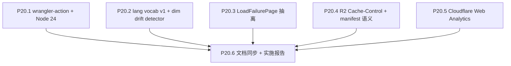

# Phase 20 — Pipeline 维护

## 范围与不做

**做**：CI 升级（wrangler-action / Node 24 / 旧 actions 版本审计）、维度漂移探测（lang vocab 固化 + nightly/monthly fail CI）、加载失败页统一、R2 Cache-Control、Cloudflare Web Analytics。

**不做**：UMAP / Procrustes / threshold 算法变化；JSON 公共契约字段变化；前端 i18n / 视觉 / 搜索功能（留 P21–P23）。

## 决策快照（来自前几轮对话）

- 维度漂移：**fail CI**（不是 alarm）；workflow_dispatch 提供 `force_skip_dim_check` 临时通道
- wrangler 升级方式：**`cloudflare/wrangler-action@v3` 声明式**（不是步骤式 `npx wrangler`）
- 错误监控起步：**Cloudflare Web Analytics**（不引入 Sentry）
- 数据流向架构图：**ad-hoc deliverable，不进 Phase 20 范围**（用户随时可触发，不写代码不改文档）

## 子节点执行顺序



P20.1–P20.5 互相独立，可并行/任意顺序；P20.6 收尾。

---

## P20.1 cloudflare/wrangler-action@v3 + Node 24

### 现状

[`.github/workflows/nightly_vote_refresh.yml`](.github/workflows/nightly_vote_refresh.yml) L91-98 与 [`.github/workflows/monthly_refit.yml`](.github/workflows/monthly_refit.yml) L172-180：

```yaml
- uses: cloudflare/pages-action@v1.5.0
  with:
    apiToken: ${{ secrets.CLOUDFLARE_API_TOKEN }}
    accountId: ${{ secrets.CLOUDFLARE_ACCOUNT_ID }}
    projectName: ${{ secrets.CLOUDFLARE_PAGES_PROJECT_NAME }}
    directory: frontend/dist
    wranglerVersion: "3"
    gitHubToken: ${{ github.token }}
```

`cloudflare/pages-action` 已 archive，`wrangler pages publish` 也 deprecated。

`actions/setup-node@v4 with node-version: "20"` — Node 20 LTS 已结束维护（2026-04-30）。

### 实施

**两处 workflow** 替换为：

```yaml
- uses: cloudflare/wrangler-action@v3
  with:
    apiToken: ${{ secrets.CLOUDFLARE_API_TOKEN }}
    accountId: ${{ secrets.CLOUDFLARE_ACCOUNT_ID }}
    command: pages deploy frontend/dist --project-name=${{ secrets.CLOUDFLARE_PAGES_PROJECT_NAME }} --branch=${{ github.ref_name }}
    gitHubToken: ${{ github.token }}
```

`actions/setup-node` bump：`node-version: "24"`（当前 LTS）；同时检查 [`deploy-pages.yml`](.github/workflows/deploy-pages.yml) 是否需要相同升级。

`npm i -g npm@10.8.3` — 评估是否还需要（Node 24 自带 npm 10+；可能可以直接删除该 step 简化）。

其它 actions 当前都已 @v4 / @v5（`actions/checkout@v4` / `setup-python@v5` / `cache@v4` / `upload-artifact@v4`），不动。

### 验收

- workflow_dispatch 触发 nightly_vote_refresh：Pages 部署成功且 dashboard 显示部署来自 `wrangler-action`
- workflow_dispatch 触发 monthly_refit（`anchor_mode: skip` 走快路径）：Pages 部署成功
- workflow log 中无 `wrangler pages publish is deprecated` / Node 20 弃用告警

---

## P20.2 语言 vocab v1 固化 + 维度漂移探测（fail CI）

### 现状隐患

[`scripts/feature_engineering/language_encoding.py`](scripts/feature_engineering/language_encoding.py) 当前的两条路径：

- `one_hot_language_matrix(series, lang_order)`：未知 ISO 抛 `KeyError`（fail-loud）—— 但 `lang_order` 来自当前 cleaned.csv，新语言会**直接进入 vocab**，不是异常
- `one_hot_language_matrix_with_fallback`（P18.4 nightly 走这里，[`monthly_refit.py`](scripts/cron/monthly_refit.py) L515-521 验证 cache 一致）：未知 ISO **静默** fallback 到 `__unknown__` slot

后者就是漏洞：TMDB 加新语言（如新增小语种码）时，`vote_refresh.py` 静默把它压进 `__unknown__`，UMAP 拓扑悄悄漂移，**无告警**。

genre 侧已经在 [`genre_palette.py`](scripts/feature_engineering/genre_palette.py) 通过 `assert_all_genres_in_frozen_v1` 严格 fail-loud（P18.0 完工），不需要再改实现，只需要在新位置调用。

### 实施

**新增** [`scripts/feature_engineering/language_palette.py`](scripts/feature_engineering/language_palette.py)，结构 mirror `genre_palette.py`：

```python
LANG_PALETTE_VERSION = "v1"

# Frozen original_language ISO codes from P18 v1 canonical cleaned.csv (+ UNKNOWN sentinel).
# Generation: scripts/tools/freeze_language_vocab_v1.py (one-shot; result hardcoded below).
FROZEN_LANG_ORDER_V1: tuple[str, ...] = (
    "__unknown__",
    "en", "fr", "ja", "es", "de", "it", "ru", "ko", "zh", "pt", "hi", ...
    # 完整列表来自当前 production cleaned.csv 的 collect_sorted_languages()
)

def assert_all_languages_in_frozen_v1(lang_series: pd.Series) -> None:
    """Fail fast if cleaned.csv has any ISO outside frozen v1.
    
    On fail: instructs operator to either
      (a) bump LANG_PALETTE_VERSION to v2 + extend FROZEN_LANG_ORDER_V1
          + trigger full re-embed (Phase 23 candidate), or
      (b) workflow_dispatch with `force_skip_dim_check=true` (one-off bypass)."""
```

**新增** 一次性脚本 [`scripts/tools/freeze_language_vocab_v1.py`](scripts/tools/freeze_language_vocab_v1.py)：从当前 `data/output/cleaned.csv` 导出已使用 ISO 列表，由人工把结果粘贴进 `FROZEN_LANG_ORDER_V1` 后**删除生成器**或保留作 audit。

**新增** [`scripts/feature_engineering/dim_drift_detector.py`](scripts/feature_engineering/dim_drift_detector.py) 统一入口：

```python
def assert_no_dim_drift(cleaned_df: pd.DataFrame, *, force_skip: bool = False) -> dict:
    """Single-call gate. Returns drift report (always); raises AssertionError on drift unless force_skip."""
    report = {
        "genre_palette_version": GENRE_PALETTE_VERSION,
        "lang_palette_version": LANG_PALETTE_VERSION,
        "unknown_genres": [],
        "unknown_languages": [],
    }
    # 走两个 assert，但聚合错误而非 fail-fast，让运维一次看到所有维度问题
    ...
    if force_skip:
        # 把 unknown_* 写进 report 但不 raise；caller 负责把 report 写入 monthly_refit_meta.json
        return report
    if report["unknown_genres"] or report["unknown_languages"]:
        raise DimDriftError(report)
    return report
```

**注入位置**（**两处**，都在 cleaning 之后、写库/UMAP 之前）：

1. [`scripts/cron/nightly_vote_refresh.py`](scripts/cron/nightly_vote_refresh.py)：在 `run_cleaning_pipeline` 完成、diff Supabase 之前 —— **新语言/genre 在每日就发现，不等月度**
2. [`scripts/cron/monthly_refit.py`](scripts/cron/monthly_refit.py)：在重新计算 threshold 之前；并把 `report` 写入 [`monthly_refit_meta.json`](monthly_refit_meta.json) 现有 schema

**Workflow 入口加 force_skip 输入**（仅 monthly + nightly 都加，临时 unblock 用）：

```yaml
workflow_dispatch:
  inputs:
    force_skip_dim_check:
      type: boolean
      default: false
      description: "P20.2 一次性跳过维度漂移检查（紧急 unblock 用，记录在 meta）"
```

环境变量 `DIM_DRIFT_FORCE_SKIP=${{ inputs.force_skip_dim_check }}` 传给脚本。

### 验收

- 单测 [`tests/feature_engineering/test_dim_drift_detector.py`](tests/feature_engineering/test_dim_drift_detector.py)：(a) 全合法 → 不 raise；(b) 注入未知 genre → raise；(c) 注入未知 ISO → raise；(d) `force_skip=True` + 未知 ISO → 不 raise 但 report 内有记录
- nightly workflow_dispatch 跑一遍现有 production 数据：通过；report 持久化（artifact 或 stdout）
- monthly workflow_dispatch 同上；`monthly_refit_meta.json` 含 `lang_palette_version`、`genre_palette_version`、`unknown_*` 字段
- 模拟测试：手动改一行 cleaned.csv 给 `original_language` 写 `"xx"`，nightly job 应红 + 错误信息明确指引 v2 bump 或 force_skip 路径

---

## P20.3 LoadFailurePage 统一

### 现状

[`frontend/src/App.tsx`](frontend/src/App.tsx) L171-192 的 `galaxy-error` 分支是 inline JSX，文案散在 `STRINGS.error.*`（包括 `localDevHintBeforeCode`/`...AfterCode` 等），不易复用、缺乏 retry 之外的可观测性。

错误来源（需要被覆盖）：
- 网络失败 / 4xx / 5xx → `loadGalaxyData` 抛 → `galaxyDataStore` 设 `status=error`
- gzip 解压失败 → 同
- JSON parse 失败 → 同
- search index 失败：当前已 graceful 降级到 `'skipped'`（[`searchIndexStore.ts`](frontend/src/store/searchIndexStore.ts) L48）—— **不进入失败页**

### 实施

**新增** [`frontend/src/components/LoadFailurePage.tsx`](frontend/src/components/LoadFailurePage.tsx)：

```tsx
interface LoadFailurePageProps {
  errorMessage: string | null
  onRetry: () => void
}
```

设计点：
- 与 `Loading.tsx` 视觉统一（同 `bg-background/80 backdrop-blur-sm`，居中布局）
- 主标题用 `STRINGS.error.title`
- 错误消息折叠区（默认收起，点击展开 raw error），避免大段堆栈劝退
- "Retry" 主按钮 + "Reload page" 次按钮（hard refresh 兜底）
- 局部开发提示（`STRINGS.error.localDevHint*`）保留但移到折叠区底部

**修改** [`App.tsx`](frontend/src/App.tsx) L171-192：替换为 `<LoadFailurePage errorMessage={errorMessage} onRetry={() => void fetchGalaxyData()} />`。

**新增** Storybook story `LoadFailurePage.stories.tsx`：4 个 fixture（network / gzip / parse / 长 stack）。

### 验收

- 构造网络失败（`VITE_GALAXY_DATA_GZIP_URL=https://invalid.example/`）→ 看到新页面 + 折叠区可展开
- gzip 失败（指向一个非 gzip 文件）→ 同上但 errorMessage 文案不同
- Storybook 4 个 fixture 都正确渲染
- a11y：retry 按钮可键盘 focus + Enter 触发；错误折叠区有 `aria-expanded`
- 现有 [`loadGalaxyData.test.ts`](frontend/src/utils/loadGalaxyData.test.ts) 不需要改（store 行为不变）

---

## P20.4 R2 Cache-Control + manifest 缓存语义

### 现状

[`frontend/src/lib/galaxyAssetUrls.ts`](frontend/src/lib/galaxyAssetUrls.ts) L46 拉 manifest 时已用 `cache: 'no-cache'` —— 浏览器侧 ok。

但 R2 对象本身的 Cache-Control 由 [`scripts/cron/upload_galaxy_r2.py`](scripts/cron/upload_galaxy_r2.py) 上传时写入（需要核验现状）。**目标是让 CDN 边缘和浏览器都能正确缓存**：

- `galaxy/{seq}/galaxy_data.json.gz`：版本化 key → `public, max-age=31536000, immutable`（永不变）
- `galaxy/{seq}/galaxy_search_index.json.gz`：同上
- `galaxy_assets_manifest.json`（在 Pages bundle 内 / 或 R2 上一份）：`public, max-age=60, must-revalidate`（短 cache 让"今天哪个版本"快速生效）

### 实施

**审计** [`scripts/cron/upload_galaxy_r2.py`](scripts/cron/upload_galaxy_r2.py)：用 `boto3` `put_object` 时是否传 `CacheControl=`。若无，加上：

```python
s3.put_object(
    Bucket=bucket,
    Key=key,
    Body=data,
    ContentType="application/gzip",
    ContentEncoding="gzip",
    CacheControl="public, max-age=31536000, immutable",  # 版本化 key
)
```

manifest（同脚本写入 [`frontend/public/data/galaxy_assets_manifest.json`](frontend/public/data/galaxy_assets_manifest.json)）走 Pages 本身的 cache header：在 [`frontend/public/_headers`](frontend/public/_headers)（Cloudflare Pages 标准 header 文件，需新建或追加）加：

```
/data/galaxy_assets_manifest.json
  Cache-Control: public, max-age=60, must-revalidate
```

### 验收

- 部署后 `curl -I` R2 上的 `galaxy_data.json.gz` 应看到 `cache-control: public, max-age=31536000, immutable`
- `curl -I` Pages 上的 `galaxy_assets_manifest.json` 应看到 `cache-control: public, max-age=60, must-revalidate`
- 浏览器 DevTools Network：第一次访问 `galaxy_data.json.gz` `200 OK`；二次刷新 `(disk cache)`；manifest 始终 `200 OK`

---

## P20.5 Cloudflare Web Analytics

### 现状

无任何前端访问数据。无法判断 wrangler-action 切换后流量是否波动。

### 实施

按 [Cloudflare Web Analytics](https://dash.cloudflare.com/?to=/:account/analytics/web) 文档：
1. 控制台为 `the-movie-cosmos.pages.dev` 创建 site → 拿 `beacon token`
2. [`frontend/index.html`](frontend/index.html) 末尾追加官方 beacon script（cookie-free，无需 consent banner）：

```html
<script defer src='https://static.cloudflareinsights.com/beacon.min.js'
        data-cf-beacon='{"token": "<BEACON_TOKEN>"}'></script>
```

token 不算敏感（公开页面所有人都能看到），可以直接 commit；也可以走 `VITE_CF_BEACON_TOKEN` 注入避免历史泄露顾虑（推荐）。

**不做**：Sentry / GA4 / 自建 error logging endpoint —— 留作未来 micro-phase。

### 验收

- 部署后 24h 内 CF Analytics dashboard 能看到 `the-movie-cosmos.pages.dev` 的 PV / 国家分布 / Core Web Vitals
- DevTools Network 中能看到 `cloudflareinsights.com/cdn-cgi/rum` 上报请求
- 无 console error；adblock 用户被静默 block 时不影响主功能

---

## P20.6 文档同步 + 实施报告

### 改动

**Tech Spec** ([`docs/project_docs/TMDB 电影宇宙 Tech Spec.md`](docs/project_docs/TMDB%20电影宇宙%20Tech%20Spec.md))：
- §2 / §4 数据管线小节加一段"维度漂移探测（lang_palette_version + genre_palette_version + force_skip 通道）"
- 部署小节把 `cloudflare/pages-action` 替换为 `cloudflare/wrangler-action@v3`

**Data Pipeline** ([`docs/project_docs/TMDB 电影宇宙 Data Pipeline.md`](docs/project_docs/TMDB%20电影宇宙%20Data%20Pipeline.md))：
- 加 "Phase 20 维度漂移剧本"小节：fail CI 行为 + force_skip 紧急通道 + bump v2 长流程（涉及 re-embed 时机）
- R2 Cache-Control 与 manifest TTL 表

**README** ([`README.md`](README.md))：
- §4 表格里 nightly / monthly 的 workflow 文件链接还在，把"作用"列里加一句"含维度漂移探测（fail CI）"
- §5 Secrets 表加一行 `CF Web Analytics token`（如走 env 注入）

**实施报告** [`docs/reports/Phase 20 P20 Pipeline 维护 实施报告.md`](docs/reports/Phase%2020%20P20%20Pipeline%20维护%20实施报告.md)：背景、决策、变更清单、验收记录、风险与回滚。

---

## 验收清单（出口）

- [ ] P20.1 nightly + monthly workflow 切到 `cloudflare/wrangler-action@v3` 各成功跑过 1 次
- [ ] P20.1 Node 24 升级生效，无弃用告警
- [ ] P20.2 `language_palette.py` v1 vocab 固化；`assert_all_languages_in_frozen_v1` 单测覆盖
- [ ] P20.2 `dim_drift_detector` 在 nightly + monthly 双侧调用；`force_skip` workflow input 联通
- [ ] P20.2 `monthly_refit_meta.json` 含 `lang_palette_version` / `unknown_languages` / `unknown_genres` 字段
- [ ] P20.3 LoadFailurePage 抽离完成，覆盖 fetch/gzip/parse 三类 fixture；Storybook 4 例
- [ ] P20.4 R2 对象 Cache-Control header 验证（curl -I）；`_headers` 文件覆盖 manifest
- [ ] P20.5 CF Web Analytics dashboard 在部署 24h 内有数据
- [ ] P20.6 三份 SSOT 文档与实施报告归档

## 风险与回滚

| 风险                                                                                       | 影响 | 缓解                                                                                                                |
| ------------------------------------------------------------------------------------------ | ---- | ------------------------------------------------------------------------------------------------------------------- |
| `cloudflare/wrangler-action@v3` 与 `pages-action` 在 secret/env 处理上有差异，导致部署失败 | 中   | 先在 `workflow_dispatch` 试一次；保留旧 yaml 注释段（一周后清理）；GH Pages 灰度备线仍在                            |
| Node 24 触发 npm 原生模块兼容问题（`@rollup/rollup-linux-x64-gnu` 过往出过 issue）         | 中   | `rm -rf node_modules + npm install --include=optional` step 已经在 yaml 里；新增 step 验证 `npm ls`                 |
| FROZEN_LANG_ORDER_V1 漏掉某个稀有 ISO（首次冻结时）                                        | 中   | 第一次执行前用 `freeze_language_vocab_v1.py` 全量扫描；如冷启 nightly 红，提供 force_skip 应急；同步把缺失值补进 v1 |
| CF Web Analytics 被广告拦截                                                                | 低   | 接受 — 仅作监控辅助；不依赖其数据做产品决策                                                                         |
| R2 Cache-Control immutable 与未来"修复某版本数据"产生冲突                                  | 低   | 版本化 key 前提下永不复用同 key；修数据 = 写新 seq + 更新 manifest                                                  |

## 出口准入

- 所有 P20.1–P20.6 todos `completed`
- nightly + monthly cron 在新 wrangler-action 路径下各跑过 ≥ 1 次成功（含维度探测通过）
- 实施报告归档；Tech Spec / Data Pipeline / README 同步
- LoadFailurePage 在 prod 至少经过一次"主动断网刷新"的 smoke 测试
