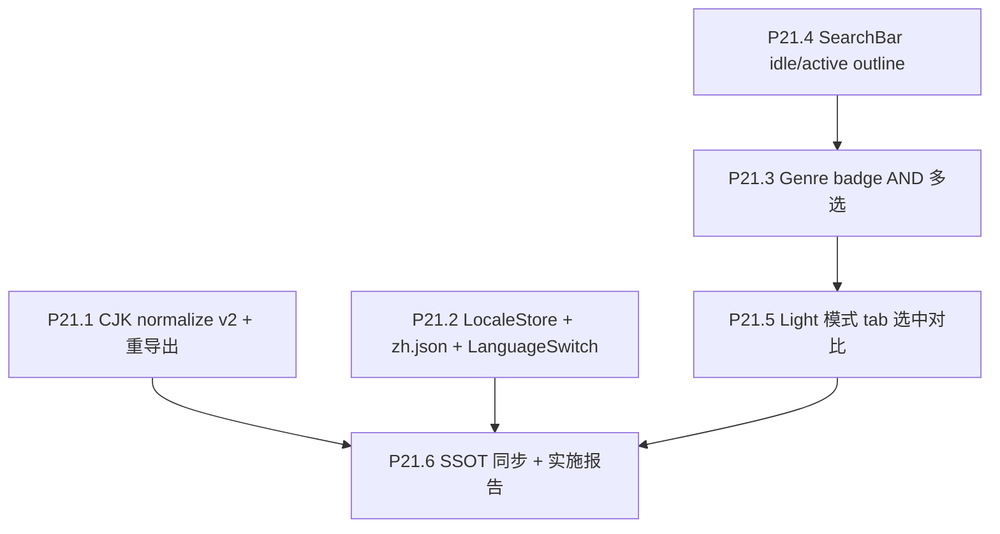

# Phase 21 — 搜索 v2 + i18n

## 范围与不做

**做**：
- CJK / Unicode normalize v2（Python + TS 同步）+ 重导出
- EN/中文双语切换（HUD 文案 only）+ HUD 右上加 LanguageSwitch
- Genre tab 改 AND 多选 badge + 死路 disable
- SearchBar 容器 idle/active 双态（outline / 实底）
- Light 模式 tab 选中态对比度修复

**不做**：
- 不翻译 movie title / overview / 人名 / genre 名等数据库字段（沿用原文）
- 不动 UMAP / Procrustes / scene 渲染
- 不动 People 星座线（留 P22）
- 不引入 react-i18next 等外部 i18n 库（沿用现有 `lib/strings.ts` 自管模式）

## 决策快照

- CJK normalize：**NFKC + 滤 Mn combining marks + casefold**；同时升级 title / 人名 / genre
- i18n 范围：**仅 HUD**，DB 字段不翻译；起步 EN + 中文
- LanguageSwitch 位置：**右上 Info → Lang → Fullscreen**
- Genre 多选：**AND** + **死路 badge disable**（计算交集为 0 即灰）
- SearchBar idle/active 触发：**focus 内 OR hover 容器内 OR results panel 展开**，三者任一即 active
- Light 模式 tab：选中态从 `secondary` 升级到 `default` 颜色对比

## 子节点执行顺序



P21.1 / P21.2 互相独立，可并行。P21.4 (SearchBar 容器) → P21.3 (重写 genre tab) → P21.5 (验证 light) 顺序串行避免合并冲突。

---

## P21.1 CJK / Unicode normalize v2

### 现状

[`scripts/export/export_search_index.py`](scripts/export/export_search_index.py) L27-31：

```python
def normalize_for_search(text: str) -> str:
    s = unicodedata.normalize("NFKD", str(text).strip())
    s = s.encode("ascii", "ignore").decode("ascii")  # 杀手锏：ASCII fold
    return s.casefold()
```

`「映画 五等分の花嫁」` 经此函数后 → `""` —— 日/中/俄/阿/韩等非拉丁脚本完全丢失。

被 5 个文件复用（grep 已确认）：
- [`scripts/export/export_search_index.py`](scripts/export/export_search_index.py) — 人名 key + genre normalize
- [`scripts/export/export_galaxy_json.py`](scripts/export/export_galaxy_json.py) — `title_normalized` 字段
- [`scripts/cron/nightly_vote_refresh.py`](scripts/cron/nightly_vote_refresh.py) — Supabase 写入
- [`scripts/supabase/initial_import.py`](scripts/supabase/initial_import.py) — 一次性导入
- [`frontend/src/utils/searchScore.ts`](frontend/src/utils/searchScore.ts) L9-18 — 前端 query normalize

### 实施

**Python 侧** — 在 [`scripts/export/export_search_index.py`](scripts/export/export_search_index.py) 加新函数（保留旧函数让 fixture 测试可比对）：

```python
def normalize_for_search_v2(text: str) -> str:
    """NFKC + strip Mn combining marks + casefold.
    
    Unicode-friendly: keeps CJK / Cyrillic / Arabic / Hangul / Devanagari.
    Still folds European accents ('Café' → 'cafe') and uppercase variants ('ß' → 'ss')."""
    s = unicodedata.normalize("NFKC", str(text).strip())
    s = "".join(c for c in s if unicodedata.category(c) != "Mn")
    return s.casefold()
```

把 5 处调用切到 `normalize_for_search_v2`（旧函数仅作 backward compat 保留至本 phase 收尾后下个 release 再删）。

**前端侧** — [`frontend/src/utils/searchScore.ts`](frontend/src/utils/searchScore.ts) L9-18 替换为：

```ts
/** NFKC + strip Mn combining marks + casefold (mirror Python normalize_for_search_v2). */
export function normalizeForSearch(text: string): string {
  return text.normalize('NFKC').replace(/\p{M}/gu, '').toLowerCase()
}
```

注：`/\p{M}/gu` 匹配所有 mark 类（Mn/Mc/Me），等效于 Python 的 `category == 'Mn'` 子集语义；JS 没有细分到 Mn 的便利 API，用 `\p{M}` 略宽但实际差异可忽略（Mc/Me 极少出现在标题里）。`toLowerCase()` 与 `casefold` 在 99% 拉丁字符上等价；ß / Σ 等极端 case 差异接受。

**meta 字段**：

`scripts/export/export_galaxy_json.py` 的 `meta` 加 `"search_normalize_version": "v2"`；前端 `loadGalaxyData` 读取后若发现 v1 → console.warn（旧数据兼容），不阻断。

**重新导出**：

仅需 `scripts/cron/export_from_supabase.py` + `scripts/cron/upload_galaxy_r2.py`（不动 UMAP）。可由 nightly 自动覆盖，或 workflow_dispatch 立即触发。

### 单测

[`frontend/src/utils/searchScore.spec.ts`](frontend/src/utils/searchScore.spec.ts) 加：

```ts
describe('normalizeForSearch (v2 Unicode)', () => {
  it('preserves Japanese kana / kanji', () => {
    expect(normalizeForSearch('映画 五等分の花嫁')).toContain('五等分')
  })
  it('preserves Chinese characters', () => {
    expect(normalizeForSearch('霸王别姬')).toBe('霸王别姬')
  })
  it('preserves Cyrillic', () => {
    expect(normalizeForSearch('Москва')).toBe('москва')
  })
  it('preserves Hangul', () => {
    expect(normalizeForSearch('기생충')).toBe('기생충')
  })
  it('still folds European accents', () => {
    expect(normalizeForSearch('Café Amélie')).toBe('cafe amelie')
  })
  it('strips combining marks', () => {
    expect(normalizeForSearch('e\u0301')).toBe('e')
  })
})

describe('scoreMoviesForQuery with CJK', () => {
  it('matches Japanese substring', () => {
    const movies = [baseMovie({ id: 1, title: 'The Quintessential Quintuplets', original_title: '映画 五等分の花嫁', title_normalized: 'the quintessential quintuplets 映画 五等分の花嫁' })]
    expect(scoreMoviesForQuery(movies, '五等分').length).toBe(1)
  })
})
```

新增 [`scripts/tests/test_normalize_for_search_v2.py`](scripts/tests/test_normalize_for_search_v2.py)（pytest）覆盖 Python 端同样 case。

### 验收

- 5 个 Python 调用点切到 v2，单元测试通过
- 前端 `normalizeForSearch` v2 + 6 例新单测通过
- 重新导出后抽样：搜 "五等分" / "霸王" / "Москва" 各能命中至少 1 条；搜 "Cafe" 仍命中 "Café"
- `meta.search_normalize_version === "v2"` 在 R2 部署后可 curl 验证

---

## P21.2 i18n EN/中文 + LanguageSwitch

### 现状

[`frontend/src/lib/strings.ts`](frontend/src/lib/strings.ts) 是 `export const STRINGS = { ... } as const`，模块级单例，无法 reactive 切换。`useThemeFromQuery` 已是同套 query → DOM 模式可参考。

[`frontend/src/App.tsx`](frontend/src/App.tsx) L249-250 当前右上是 `<InfoButton />` + `<FullscreenButton />`。

### 实施

**新增** [`frontend/src/lib/locales/zh.json`](frontend/src/lib/locales/zh.json)：mirror en.json 全量翻译（schema 完全一致；翻译范围限 HUD 标签 / 按钮 / 错误说明 / 提示）。技术性 console error（`STRINGS.scene.webgl2Required`）也翻译，但 `console.log` 内部日志不翻译（在代码里写死英文 prefix 即可，不进 STRINGS）。

**新增** [`frontend/src/lib/locales/index.ts`](frontend/src/lib/locales/index.ts)：

```ts
import en from './en.json'
import zh from './zh.json'

export const LOCALES = { en, zh } as const
export type LocaleId = keyof typeof LOCALES   // 'en' | 'zh'
export const LOCALE_IDS: readonly LocaleId[] = ['en', 'zh'] as const
export const DEFAULT_LOCALE: LocaleId = 'en'
```

**新增** [`frontend/src/store/localeStore.ts`](frontend/src/store/localeStore.ts) Zustand store：

```ts
interface LocaleState {
  locale: LocaleId
  setLocale: (l: LocaleId) => void
}
```

初始化逻辑：`?lang=zh` query → localStorage `tmc.locale` → `navigator.language` 前缀（`zh*` → `'zh'`，否则 `'en'`）→ DEFAULT_LOCALE。`setLocale` 写 localStorage 持久化。

**新增** [`frontend/src/hooks/useLocaleFromQuery.ts`](frontend/src/hooks/useLocaleFromQuery.ts)：在 App 顶层调用一次，读 `?lang=` 写入 store（mirror `useThemeFromQuery`）。

**重写** [`frontend/src/lib/strings.ts`](frontend/src/lib/strings.ts) 为 hook：

```ts
import { LOCALES, type LocaleId } from './locales'
import { useLocaleStore } from '@/store/localeStore'

type LocaleStrings = ReturnType<typeof buildStrings>

function buildStrings(localeId: LocaleId): typeof STRINGS_EN_TYPE { ... }   // 把现有 interpolate 逻辑封装

const STRINGS_BY_LOCALE: Record<LocaleId, LocaleStrings> = {
  en: buildStrings('en'),
  zh: buildStrings('zh'),
}

export function useStrings(): LocaleStrings {
  const locale = useLocaleStore((s) => s.locale)
  return STRINGS_BY_LOCALE[locale]
}

/** Non-React contexts (initial render before mount, console logs). Returns current snapshot. */
export function getStrings(): LocaleStrings {
  return STRINGS_BY_LOCALE[useLocaleStore.getState().locale]
}

/** @deprecated import { useStrings } in components; this is kept only for one-shot module-level usage. */
export const STRINGS: LocaleStrings = STRINGS_BY_LOCALE.en
```

**调用点迁移**：grep `from '@/lib/strings'` + `STRINGS.` 全量替换成 `useStrings()` hook（约 20-30 处）。Storybook fixture 改为传入 prop 或继续用 `STRINGS` 静态英文（更简单）。Console 日志统一保留 `STRINGS` 静态英文，避免 hook 在非 React context 出错。

**新增** [`frontend/src/hud/LanguageSwitch.tsx`](frontend/src/hud/LanguageSwitch.tsx)：button group 风格，类似现有 InfoButton；显示当前 locale label（`EN` / `中`），点击切换；持久化由 store 处理。位置：`fixed top-* right-*`，与 InfoButton/FullscreenButton 用同一 z-index 与水平对齐。

**App.tsx 调整**：右上 HUD 顺序确保 Info → Lang → Fullscreen 从左到右；可能需要把 `<InfoButton />` `<FullscreenButton />` 内部硬编码 right offset 改为受外部容器布局，或让三个按钮挂在统一容器 `<div className="fixed top-3 right-3 flex gap-2">`。

### 验收

- `?lang=zh` 加载 → 全 HUD 中文；切换按钮可在中/英之间切；刷新后保留
- localStorage 第一次访问根据 `navigator.language` 自动猜测
- en.json / zh.json schema 一致（pre-commit 或单测断言）
- 所有 `useStrings()` 调用点不在 hook rules 之外被使用（lint 通过）
- `getStrings()` 在 console.log 中可用且返回当前 locale
- Storybook 仍可正常构建

---

## P21.3 Genre badge AND 多选

### 现状

[`frontend/src/components/SearchBar.tsx`](frontend/src/components/SearchBar.tsx) 三个 tab 共用 input 联想模式。Genre tab 体验差：用户记不全 19 个英文 genre 名，输入"动作"也搜不到。

`useGalaxyInteractionStore` 的 `selectionIds: number[] | null` 已经被 scene 消费（不需要改下游）。

`SearchIndex.genres[name]: { count, movie_ids }` 已有完整 `movie_ids` 列表，可在前端做交集计算。

### 实施

**SearchBar 内部 state 重构**（仅 hudTab === 'genre' 分支）：

```tsx
const [selectedGenres, setSelectedGenres] = useState<string[]>([])

const allGenreNames = useMemo(() => Object.keys(genrePalette ?? {}).sort(), [genrePalette])

const movieIdsByGenre = useMemo(() => {
  const m = new Map<string, Set<number>>()
  for (const [name, g] of Object.entries(searchIndex?.genres ?? {})) {
    m.set(name, new Set(g.movie_ids))
  }
  return m
}, [searchIndex])

const currentIntersection = useMemo(() => {
  if (selectedGenres.length === 0) return null   // exit search mode
  let acc: Set<number> | null = null
  for (const g of selectedGenres) {
    const ids = movieIdsByGenre.get(g) ?? new Set()
    acc = acc === null ? new Set(ids) : new Set([...acc].filter((x) => ids.has(x)))
  }
  return acc
}, [selectedGenres, movieIdsByGenre])

/** For each unselected genre, compute (current ∩ that genre) size to predict dead ends. */
const previewCountIfAdded = useMemo(() => {
  const map = new Map<string, number>()
  for (const g of allGenreNames) {
    if (selectedGenres.includes(g)) continue
    const ids = movieIdsByGenre.get(g) ?? new Set()
    if (currentIntersection === null) {
      map.set(g, ids.size)
    } else {
      let n = 0
      for (const x of currentIntersection) if (ids.has(x)) n++
      map.set(g, n)
    }
  }
  return map
}, [allGenreNames, selectedGenres, movieIdsByGenre, currentIntersection])
```

**写回 store**：

```tsx
useEffect(() => {
  if (currentIntersection === null) {
    if (useGalaxyInteractionStore.getState().searchMode === 'genre') {
      clearSearch()
    }
    return
  }
  const ids = sortIdsByRelease([...currentIntersection], movieById)
  useGalaxyInteractionStore.setState({
    searchMode: 'genre',
    selectionIds: ids,
    selectionPersonKey: null,
    selectedMovieId: null,
    searchQuery: selectedGenres.join(' + '),
  })
}, [currentIntersection, selectedGenres, movieById])
```

**UI 结构**：

```tsx
{hudTab === 'genre' && (
  <div className="flex flex-col gap-2 p-1">
    {selectedGenres.length > 0 && (
      <div className="flex flex-wrap gap-1.5 border-b border-border/40 pb-2">
        {selectedGenres.map((g) => (
          <GenreBadge key={g} name={g} color={genrePalette?.[g]} selected onRemove={...} />
        ))}
        <span className="ml-auto text-xs text-muted-foreground">
          {currentIntersection?.size ?? 0} {STRINGS.searchBar.genreMultiMatches}
        </span>
      </div>
    )}
    <div className="flex flex-wrap gap-1.5">
      {allGenreNames.map((g) => {
        const isSelected = selectedGenres.includes(g)
        const previewN = previewCountIfAdded.get(g) ?? 0
        const disabled = !isSelected && previewN === 0
        return (
          <GenreBadge
            key={g}
            name={g}
            color={genrePalette?.[g]}
            selected={isSelected}
            disabled={disabled}
            onClick={...}
            previewCount={!isSelected ? previewN : undefined}
          />
        )
      })}
    </div>
    <p className="px-1 text-xs text-muted-foreground">{STRINGS.searchBar.genreMultiHelp}</p>
  </div>
)}
```

**新增 GenreBadge 组件**（基于现有 [`frontend/src/components/GenreBadgesList.tsx`](frontend/src/components/GenreBadgesList.tsx) 风格扩展）：states = idle / hover / selected / disabled；selected 用 genre palette 颜色填充；disabled 灰底 + opacity-40 + `cursor-not-allowed`。

**i18n 增加键**（en.json / zh.json）：

```json
"searchBar": {
  ...,
  "genreMultiHelp": "Click multiple genres to filter (AND).",
  "genreMultiMatches": "matches"
}
```

中文：`"点击多个流派以筛选（AND 同时满足）"` / `"部"`。

### 验收

- 进 Genre tab 看到 19 个 badge，颜色正确
- 点 1 个 → scene 高亮该 genre 全部电影
- 再点 1 个 → 高亮交集；右上"matches"数字实时更新
- 第 3 个 badge 后大部分剩余 badge 已变灰；点不动
- 移除已选 badge → 死路 badge 重新激活
- ESC / 全清 → searchMode 回 idle，scene 退出 select 态
- e2e 抽样：Drama + Comedy AND 命中数 > 0；Western + Animation 抽样验证

---

## P21.4 SearchBar idle/active outline 态

### 现状

[`SearchBar.tsx`](frontend/src/components/SearchBar.tsx) L268-274：

```tsx
<div
  ref={panelRootRef}
  className={cn(
    'rounded-xl border border-border/80 bg-popover/95 p-2 shadow-lg backdrop-blur-md',
    isBlocked && 'pointer-events-none',
  )}
>
```

固定填充 + 模糊，对星空遮挡明显。

### 实施

加 hover state + 派生 active 标记：

```tsx
const [hoverInside, setHoverInside] = useState(false)
const [focusInside, setFocusInside] = useState(false)
const isActive = hoverInside || focusInside || panelVisible

<div
  ref={panelRootRef}
  data-state={isActive ? 'active' : 'idle'}
  onMouseEnter={() => setHoverInside(true)}
  onMouseLeave={() => setHoverInside(false)}
  onFocusCapture={() => setFocusInside(true)}
  onBlurCapture={(e) => {
    // panelRoot 失焦：仅当 nextFocus 不在 panel 内时设 false
    if (!panelRootRef.current?.contains(e.relatedTarget as Node | null)) setFocusInside(false)
  }}
  className={cn(
    'rounded-xl p-2 transition-[background-color,backdrop-filter,box-shadow,border-color] duration-150',
    'border data-[state=idle]:border-border/40 data-[state=active]:border-border/80',
    'data-[state=idle]:bg-transparent data-[state=active]:bg-popover/95',
    'data-[state=idle]:backdrop-blur-none data-[state=active]:backdrop-blur-md',
    'data-[state=idle]:shadow-none data-[state=active]:shadow-lg',
    isBlocked && 'pointer-events-none',
  )}
>
```

input / tab 按钮的 `bg-background/80` 在 idle 态也需调整（保留可读性 vs 完全透明的 trade-off）：
- 推荐：input 在 idle 态用 `data-state=idle`-scoped `bg-background/40` 而非完全透明，保证文字依然可读。

### 验收

- 鼠标移开 + input 不在 focus + panel 未展开 → 容器透明只剩 outline
- 鼠标进入容器任意位置 → 立即变 active 实底
- input focus → 同样 active
- 输入 query 触发 panelVisible → active 持续
- query 已输入但 input blur 且鼠标离开 → 回 idle 态，但 query **保留在 input 中**
- 切换 light/dark theme 都视觉合理

---

## P21.5 Light 模式 tab 选中态对比

### 现状

[`SearchBar.tsx`](frontend/src/components/SearchBar.tsx) L281-284：

```tsx
className={cn(
  buttonVariants({ variant: hudTab === tab ? 'secondary' : 'ghost', size: 'xs' }),
  'flex-1 capitalize',
)}
```

light 模式下 `secondary` 是浅灰，`ghost` hover 也是 `bg-muted` 浅色 → 三个 tab 在浅背景上几乎无区分（用户截图证实）。

### 实施

切到 `default` variant（light 下是 primary 深色对比），并加保留 dark 路径：

```tsx
className={cn(
  buttonVariants({ variant: hudTab === tab ? 'default' : 'ghost', size: 'xs' }),
  'flex-1 capitalize',
  hudTab === tab && 'shadow-sm',
)}
```

**风险**：`default` 在 dark 模式下也是 primary 色（亮色块），可能比目前 `secondary` 太突出。需 dial：
- 备选：自定义 class
  
  ```tsx
  hudTab === tab
    ? 'bg-foreground text-background shadow-sm dark:bg-secondary dark:text-secondary-foreground'
    : 'bg-transparent text-muted-foreground hover:bg-muted/50'
  ```

我建议先实现备选（条件分 light/dark），不动 buttonVariants。

### 验收

- light 模式：3 个 tab 一眼能看出哪个 selected（深 vs 浅）
- dark 模式：与当前观感无明显回退（视觉验收）
- a11y：`aria-pressed` 不变；focus ring 仍可见

---

## P21.6 SSOT 同步 + 实施报告

### 改动

**Tech Spec** ([`docs/project_docs/TMDB 电影宇宙 Tech Spec.md`](docs/project_docs/TMDB%20电影宇宙%20Tech%20Spec.md))：
- §4.3 / §4.5 把 `normalize_for_search` v2 写法和 `meta.search_normalize_version` 字段加上
- §HUD 加 i18n 小节：`useLocaleStore` + `?lang=` query + LanguageSwitch 位置

**Design Spec** ([`docs/project_docs/TMDB 电影宇宙 Design Spec.md`](docs/project_docs/TMDB%20电影宇宙%20Design%20Spec.md))：
- §搜索：Genre tab 改 AND 多选 badge；列举死路 disable 行为
- §搜索：SearchBar idle/active 双态；列触发条件
- §HUD：右上按钮组顺序 Info → Lang → Fullscreen

**Data Pipeline** ([`docs/project_docs/TMDB 电影宇宙 Data Pipeline.md`](docs/project_docs/TMDB%20电影宇宙%20Data%20Pipeline.md))：
- 4.x 章节注明 `title_normalized` 已升级 v2，旧 v1 数据兼容策略

**README** ([`README.md`](README.md))：§HUD / 多语言一段简介

**实施报告** [`docs/reports/Phase 21 P21 搜索 v2 与 i18n 实施报告.md`](docs/reports/Phase%2021%20P21%20搜索%20v2%20与%20i18n%20实施报告.md)：背景、决策、变更清单、验收记录、风险与回滚。

---

## 验收清单（出口）

- [ ] P21.1 Python + TS normalize 同步切到 v2；CJK / 重音 / Cyrillic / Hangul 6 例单测通过；重导出后 `meta.search_normalize_version === "v2"`
- [ ] P21.1 Smoke：搜 "五等分" 命中至少 1 部；搜 "霸王别姬" 命中；搜 "Café" 仍命中
- [ ] P21.2 `?lang=zh` / `?lang=en` 双向切换工作；localStorage 持久化；首次访问根据浏览器语言猜测
- [ ] P21.2 LanguageSwitch 出现在右上 Info 与 Fullscreen 之间；三个按钮垂直对齐
- [ ] P21.2 zh.json schema 与 en.json 一致（lint or 单测）
- [ ] P21.3 Genre tab 不再是输入联想；19 个 badge 颜色正确；多选交集计算实时；死路 badge 灰且不可点
- [ ] P21.4 SearchBar 不交互时透明 outline；hover/focus/panel 任一即实底
- [ ] P21.5 light 模式 tab 选中明显可辨；dark 模式无明显回退
- [ ] P21.6 三份 SSOT 文档与实施报告归档

## 风险与回滚

| 风险                                                                               | 影响 | 缓解                                                                                         |
| ---------------------------------------------------------------------------------- | ---- | -------------------------------------------------------------------------------------------- |
| `\p{M}/gu` 与 Python `Mn` 范围细微差异导致 v2 normalize Python/TS 不严格一致       | 低   | 单测覆盖 ≥6 例；不一致仅影响极端字符（Mc/Me），实用搜索基本无感；如需严格用 `\p{Mn}/gu` 替代 |
| v2 normalize 让某些之前能搜到的 ASCII 词不再是同源 token（理论上 NFKC 不破 ASCII） | 低   | 加 ASCII smoke 测试                                                                          |
| useStrings hook 切换大量调用点导致大 PR / 合并冲突                                 | 中   | 单 commit 完整迁移；同步 Storybook 用静态 STRINGS 兜底                                       |
| `default` variant 在 dark 模式下过度突出 tab                                       | 低   | 实施期采用条件 light/dark class（不改 buttonVariants）；验收时 dial                          |
| Genre badge 多选交集计算开销（19 × 60K id × 5 选）慢                               | 低   | `Set<number>` 交集实测 ms 级；如需优化可改 `Uint32Array` + 排序双指针                        |
| zh 翻译质量参差导致 HUD 误导                                                       | 中   | 关键术语保留英文（"UMAP"、"Procrustes"）；翻译评审一次                                       |

## 出口准入

- 所有 P21.1–P21.6 todos `completed`
- CJK / Unicode 6 例 + 中文 i18n 切换 + Genre AND 多选 + idle/active 状态 + light tab 对比，5 类用户感知项均已 demo 通过
- 三份 SSOT 文档 + 实施报告归档
- 部署到 prod，至少手动 smoke 5 类场景
