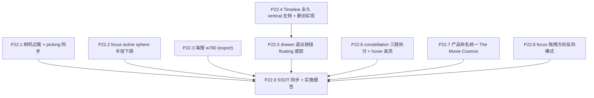
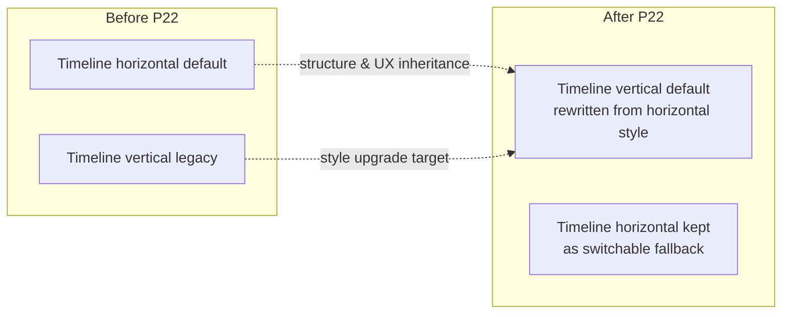

# Phase 22 — 视觉 & 交互精修

## 范围与不做

**做**：
- 相机最近裁剪（按世界 Z 距离）+ picking 同步
- focus active sphere 半径下调（dial 留 review 拍板）
- drawer SheetClose 删除 + 屏幕底部 floating 退出按钮（focus 退出）
- Timeline vertical 左侧按 horizontal 样式升级并默认启用（保留 horizontal 与切换能力）
- constellation 拆 3 mesh（producers / crew / cast）+ 每条独立 opacity uniform；默认 0.04 / hover 0.18 起步；hover 一颗星 → 该星所属 chain 高亮
- focus 轨道拖拽新增方向反转测试模式（更贴合遮挡背景下的直觉）
- 海报 `w500 → w780`（export 阶段换 URL，不前端 dpr 自适应）
- 产品命名统一 "The Movie Cosmos"（仅文档 + HUD，不动 repo / git remote / scripts 目录）

**不做**：
- 不动 UMAP / Procrustes / 数据契约（除海报 URL 字段值）
- 不改 Phase 19 已敲定的 active 路径 A / B 切换逻辑
- 不动搜索 / i18n（P21）、起始页 / 域名（P23）

## 决策快照（来自前几轮对话）

- 相机近裁判定量纲：**世界 Z 距离**（`abs(cameraWorldZ - starZ)`）
- focus 例外：focus 那颗 active 不应被裁
- focus R 修改对象：**active sphere 半径下调**（不是 `FOCUS_PERLIN_CAMERA_STANDOFF`）
- drawer 退出按钮：**viewport 屏幕底部 floating**（不是 drawer 内 sticky）
- Timeline 改 vertical 后，底部空间让给该退出按钮
- constellation hover 起步值：**默认 0.04 / hover 0.18**，留 dial-in 余地
- constellation hover 触发对象：**hover 该岗位的某颗星**（不是 hover 线本身）
- focus 拖拽方向：新增 **反向模式** 供 A/B 测试，默认仍保持当前方向
- 海报：**export 阶段换 URL**
- 命名统一：**仅文档 / HUD**

## 子节点执行顺序



P22.4 必须先于 P22.5（floating 退出按钮位置依赖底部空出）。其余项互相独立。

---

## P22.1 相机最近裁剪（世界 Z 距离）

### 现状

`galaxy_data.json` 中每颗星的 `z` 是 decimal year (~1874–2026)，世界单位即 1 单位 = 1 年。当相机沿 +Z 推近时，离相机极近的 idle 星（如距离 < 0.3 年）会被透视投影放大到屏占比极大，看起来与 active 球难以区分。

picking ray 与 vertex shader 现在是分开两条路径，需要保持几何裁剪一致性，否则会出现"看不见但能戳到"的鬼影。

### 实施

**新增常量** [`frontend/src/three/scene.ts`](frontend/src/three/scene.ts)（或挪到独立 const 文件）：

```ts
/** P22.1 — Stars closer than this world-Z distance to the camera are not rendered (idle path).
 *  Focus's selected star is exempt (always rendered regardless of distance). */
export const NEAR_CULL_WORLD_Z = 0.5  // ≈ 半年；dial-in 验收
```

**Shader 改动** — 在 idle / active vertex shader 起始处（位置取决于现有结构，[`frontend/src/three/galaxyMeshes.ts`](frontend/src/three/galaxyMeshes.ts) 或 `planet.ts`）：

```glsl
uniform float uNearCullWorldZ;
uniform vec3  uCameraWorldPos;

void main() {
  float dz = abs(uCameraWorldPos.z - aZ);  // aZ = per-instance Z
  if (dz < uNearCullWorldZ) {
    gl_Position = vec4(2.0, 2.0, 2.0, 1.0);  // off-clip-cube → discarded by clipper
    vSize = 0.0;
    return;
  }
  // ... 原有 size / lighting 计算
}
```

**focus 例外** — 已有 `selectedMovieId` instance 在 instanced material 中走专门路径（focus active sphere），不经过这个 cull check；或在 cull 前加 `if (aInstanceId == uSelectedMovieInstanceId) skip cull`。具体由 `scene.ts` 现有 active focus 单例渲染逻辑决定，不通用走 instance shader。

**Picking 同步** — [`frontend/src/three/interaction.ts`](frontend/src/three/interaction.ts) raycaster 命中后追加距离检查：

```ts
if (Math.abs(camera.position.z - hitMovie.z) < NEAR_CULL_WORLD_Z && hitMovie.id !== focusMovieId) {
  continue   // 跳过被裁的星
}
```

**uniform 推送** — 每帧 `uCameraWorldPos.value.copy(camera.position)`（已经在 RAF 里有相机更新；新增一行）。

### 验收

- 推近到某星条带使其极大遮挡画面 → 该星消失（dz < 0.5）
- focus 进入并停在该星 → 该星仍正常显示（focus 例外生效）
- mouse hover 极近条带：原"看不见的星仍能戳到"消失
- 调 `NEAR_CULL_WORLD_Z = 0.2 / 0.5 / 1.0` 视觉对比记录到验收报告，用于 dial-in 决定

---

## P22.2 focus active sphere 半径下调

### 现状

[`frontend/src/three/camera.ts`](frontend/src/three/camera.ts) L11：`FOCUS_PERLIN_CAMERA_STANDOFF = 1`（已确认不动）。

active 自身世界半径来自 `getActiveWorldRadius` callback（`constellation.ts` L84 调用），实际定义在 active mesh 渲染端（`galaxyMeshes.ts` / `planet.ts`）—— 与 `vote_count` 通过 `galaxyVoteSize.ts` 派生，并带最小/最大保护范围。

### 实施

**定位半径主控点** — 通过 `Grep` 锁定 `getActiveWorldRadius` / `activeRadius` 等定义点（执行时确认）。

**降低半径** — 不是只改上限 cap，而是下调 active sphere 半径映射本身（包含常规区间）；建议以当前整体半径的 0.6–0.7 倍起步，再 dial-in。

**同步链路**：
- `constellation.ts` 用同一 `getActiveWorldRadius` → 不需要改
- focus camera standoff 不动（保持视距感）
- `FocusSizeReferenceRings.ts` / `FocusLReference.tsx` 等"参考刻度"如果以 active R 为基准画环，跟随自动
- picking ray 半径如果硬编码也需同步（有则改）

### 验收

- focus 进入一部高 vote_count 影片 → active 球比 P19/P21 旧版显著缩小
- 多次 focus 不同电影目视确认大小合理（不与画面边缘冲突）
- `vote_count` 极小的电影 active 球仍可见（最小半径下限保留）
- 视觉验收时 dial 至最终值，写入 [`docs/project_docs/视觉参数总表.md`](docs/project_docs/视觉参数总表.md)

---

## P22.3 海报 w780

### 现状

[`scripts/export/export_galaxy_json.py`](scripts/export/export_galaxy_json.py) L44：

```python
POSTER_BASE = "https://image.tmdb.org/t/p/w500"
```

drawer 主图区在桌面 ~512×768 物理像素，retina 屏需要 ~1024px 宽，**`w780`** 是 TMDB 标准档位中最贴合的（再上是 `w1280` / `original` 体积过大）。

### 实施

**单点改动** [`export_galaxy_json.py`](scripts/export/export_galaxy_json.py) L44：

```python
POSTER_BASE = "https://image.tmdb.org/t/p/w780"
```

**Storybook fixture** [`frontend/src/storybook/fixtures/subsampleMovies.ts`](frontend/src/storybook/fixtures/subsampleMovies.ts) 4 处 `w500` 替换为 `w780`（不影响数据契约，只是 fixture）。

**重导出**：与 P21.1 normalize v2 共享一次重导出（cron 自动覆盖；workflow_dispatch 立即触发）。

**前端兼容**：旧数据若仍 v1 / w500，drawer 仍能加载（URL 都返回 200）；不需要前端做兼容判断。

### 验收

- prod drawer 海报视觉锐度提升（hover-zoom 时不模糊）
- gzip JSON 体积变化可忽略（poster_url 长度 +0%—字段长度不变）
- TMDB image CDN 返回 200，无 404 抽样测
- 兼容性：旧 v1 数据用户首次访问仍能看到海报（向后兼容）

---

## P22.4 Timeline vertical 默认 + 保留 horizontal 切换

### 现状

[`frontend/src/components/Timeline.tsx`](frontend/src/components/Timeline.tsx) 当前是双路径：
- **L198-290 横版**：底部居中条带；视觉与交互目前认为更成熟
- **L292-381 vertical**：左轨；质量需向 horizontal 看齐

[`frontend/src/hooks/useTimelineOrientationFromQuery.ts`](frontend/src/hooks/useTimelineOrientationFromQuery.ts) 当前控制 `?timeline=` query 选档。

### 实施

**重写策略**（用户决策）：以当前**horizontal** 成熟样式为基线，更新 **vertical** 的布局与交互（`zToTrack*` 调用方向等）以对齐手感与视觉；保留 horizontal 实现与 `?timeline=` 切换能力，但默认使用 vertical。

**新版 vertical 布局**（基于横版骨架）：
- 容器 `fixed left-3 top-[8vh] z-30 h-[80vh] w-12 sm:left-5`（左侧、纵向 80vh、窄宽）
- 主轨（原 horizontal `top-2 left-0 right-0` 带 `height`）→ 改 `left-1/2 top-0 bottom-0 -translate-x-1/2` 带 `width`
- thumb 位置 `left-* + transform: translateX(-50%)` → `bottom-* + transform: translateY(50%)`
- thumb label 显示在 thumb 右侧或上方（避免被左屏边缘裁掉）
- ticks 用 `bottom: ${f * 100}%` 替代 `left: ${f * 100}%`
- 拖动改用 `clientY → zFromClientY`（`zFromClientY` 已经存在 L55-62）

注：`zToTrackBottomFraction` 与 `zToTrackLeftFraction` 已经实现完整，**保留底层算法不动**，只重构 vertical 的 UI layer 和 pointer handler。

**App.tsx 调整** — 保留 orientation 透传能力，但将默认 orientation 设为 `vertical`（无 query 时走 vertical）。

**Storybook** — 新增/更新 vertical 默认态 story；horizontal story 保留用于回归对照。

### 视觉对照



### 验收

- 新 vertical Timeline 视觉风格与 horizontal 一致（tick label fade、thumb 形态、拖动手感）
- ESC / 键盘方向键仍可调（ArrowUp = 增 z，ArrowDown = 减 z）
- 默认进入 vertical（无 query / 无显式设置时）
- `?timeline=horizontal` 切换路径仍可用（保留回归与 A/B 可能）
- 移动端窄屏（<sm）布局可读

---

## P22.5 drawer 退出按钮（屏幕底部 floating）

### 现状

[`frontend/src/components/Drawer.tsx`](frontend/src/components/Drawer.tsx) L154-156：

```tsx
<SheetClose
  render={<CloseButton variant="secondary" className="absolute right-5 top-5 z-30" />}
/>
```

drawer 唯一关闭口在右上角 X。用户决定：**删除该 X**，改为 viewport 屏幕底部居中 floating 的退出按钮（"Exit focus"），与 drawer **解耦**（按钮在 focus 任意阶段可见，不一定要 drawer 已打开才生效）。

drawer 当前 `disablePointerDismissal` 已禁，"点击外部退出"不会触发 —— 用户明确不要这个路径。

### 实施

**删除** Drawer.tsx 内 `<SheetClose>` 块。

**新建** [`frontend/src/hud/FocusExitButton.tsx`](frontend/src/hud/FocusExitButton.tsx)：

```tsx
export function FocusExitButton() {
  const selectedMovieId = useGalaxyInteractionStore((s) => s.selectedMovieId)
  const t = useStrings()   // P21.2 hook

  if (selectedMovieId === null) return null

  return (
    <div className="pointer-events-none fixed inset-x-0 bottom-6 z-[60] flex justify-center">
      <button
        type="button"
        aria-label={t.hud.exitFocus}
        onClick={() => useGalaxyInteractionStore.setState({ selectedMovieId: null })}
        className="pointer-events-auto rounded-full border border-border/80 bg-popover/90 px-5 py-2 text-sm font-medium text-foreground shadow-lg backdrop-blur-md hover:bg-popover focus-visible:ring-2 focus-visible:ring-ring/50"
      >
        {t.hud.exitFocus}
      </button>
    </div>
  )
}
```

**i18n 字段** — en.json / zh.json `hud` 段加：

```json
"exitFocus": "Exit focus"   // en
"exitFocus": "退出聚焦"      // zh
```

**App.tsx 挂载** — 在 `<MovieDetailDrawer />` 旁加 `<FocusExitButton />`。

**ESC 行为不变** — Design Spec §4.6 焦点栈仍生效；按钮只是新增一个鼠标可达路径。

**z-index 与 Timeline 共存** — Timeline 已搬到左侧（P22.4），底部不再冲突。退出按钮 `z-60` 高于 Timeline `z-30`、低于 `Sheet` 内容（避免被 drawer 内容遮挡，但仍在 drawer 视野下方）。

### 验收

- focus 进入 → 屏幕底部出现 "Exit focus" 按钮
- 点按钮 → drawer 关闭 + 相机回宏观（行为等同 ESC）
- focus 不在时按钮不渲染
- drawer 右上角无 X 按钮
- 键盘可达（Tab 到按钮 + Enter）
- 移动端 / 窄屏底部位置不被系统 UI（home indicator）遮挡

---

## P22.6 constellation 三链拆分 + hover 高亮

### 现状

[`frontend/src/three/constellation.ts`](frontend/src/three/constellation.ts) 当前是**单 LineSegments mesh**，所有 producers/crew/cast 共用一个 `LineBasicMaterial`，opacity 固定 `0.07`（L108）。无法对单链单独调透明度。

`searchIndex.people[personKey].movie_roles[movieId]` 已有每片角色 mask（[`searchIndex.ts`](frontend/src/types/searchIndex.ts) L17）。

### 实施

**重构 constellation.ts**：

```ts
type ChainKey = 'producers' | 'crew' | 'cast'

const DEFAULT_OPACITY = 0.04
const HOVER_OPACITY   = 0.18

interface ChainHandle {
  mesh: THREE.LineSegments
  material: THREE.LineBasicMaterial
  geometry: THREE.BufferGeometry
  positions: Float32Array
}

export interface ConstellationHandle {
  /** Three meshes share this group (added to scene as children). */
  readonly group: THREE.Group
  /** Per-frame opacity update by chain key. */
  setChainOpacity(chain: ChainKey, opacity: number): void
  sync(p: ConstellationSyncParams): void
  dispose(): void
}

export function createConstellation(maxSegmentsPerChain = 200): ConstellationHandle {
  const group = new THREE.Group()
  const chains: Record<ChainKey, ChainHandle> = {
    producers: makeChain(maxSegmentsPerChain),
    crew:      makeChain(maxSegmentsPerChain),
    cast:      makeChain(maxSegmentsPerChain),
  }
  for (const k of Object.keys(chains) as ChainKey[]) {
    chains[k].material.opacity = DEFAULT_OPACITY
    group.add(chains[k].mesh)
  }
  // ... sync 把 emitChain 拆成按 chain 写各自 BufferGeometry
}
```

**hover 联动** — [`frontend/src/three/scene.ts`](frontend/src/three/scene.ts) hover 处理（已有 hover instance index → movie 反查）：

```ts
function updateConstellationHover(hoveredMovieId: number | null) {
  if (selectionPersonKey == null || hoveredMovieId == null) {
    constellation.setChainOpacity('producers', DEFAULT_OPACITY)
    constellation.setChainOpacity('crew',      DEFAULT_OPACITY)
    constellation.setChainOpacity('cast',      DEFAULT_OPACITY)
    return
  }
  const personEntry = searchIndex.people[selectionPersonKey]
  const roleMask = personEntry?.movie_roles?.[String(hoveredMovieId)] ?? 0
  // 一颗星可同时属于多条 chain（如演员兼导演 → cast + crew）
  constellation.setChainOpacity('cast',      (roleMask & MASK_CAST)      ? HOVER_OPACITY : DEFAULT_OPACITY)
  constellation.setChainOpacity('crew',      (roleMask & MASK_CREW)      ? HOVER_OPACITY : DEFAULT_OPACITY)
  constellation.setChainOpacity('producers', (roleMask & MASK_PRODUCERS) ? HOVER_OPACITY : DEFAULT_OPACITY)
}
```

**dial 余地** — 把 `DEFAULT_OPACITY` / `HOVER_OPACITY` 作为模块级常量；P22 验收时若 0.04/0.18 不够明显，调到 0.03/0.22 等。

**视觉参数表**同步：[`docs/project_docs/视觉参数总表.md`](docs/project_docs/视觉参数总表.md) 加一行 `Constellation chain opacity (idle / hover) = 0.04 / 0.18`。

### 验收

- person select 模式下默认看到 3 条 chain 都极淡
- hover 一颗星（既是导演又是制片）→ crew 链 + producers 链同时高亮，cast 链保持淡
- 鼠标移开 → 全部回 default
- 切到 idle/movie/genre searchMode → 3 条链全部隐藏（与现状一致）
- dispose 时 3 个 geometry / material 都释放

---

## P22.7 产品命名统一 "The Movie Cosmos"

### 现状

混用：仓库目录 `chronicle_v3_3d_galaxy`、CF Pages 项目 `the-movie-cosmos`、文档常用"TMDB 电影宇宙" / "Chronicle v3"、HUD 含 `STRINGS.cover.title = "Ready"`、`STRINGS.info.introBody = "TMDB Movie Cosmos: ..."`。

### 实施

**改动范围（仅文档 + HUD）**：

1. [`README.md`](README.md) §标题与各引用 → `# The Movie Cosmos（TMDB Movie Cosmos / Chronicle v3）`，正文统一英文 product name 为 "The Movie Cosmos"，中文术语保留"电影宇宙"作为别称
2. [`docs/project_docs/`](docs/project_docs/) 各文件标题与 H1：
   - `TMDB 电影宇宙 Tech Spec.md` → 标题首句改为 "The Movie Cosmos — Tech Spec"，文件名暂不改（避免外链全坏）
   - 其它同理：内容首段统一品牌；文件名保留中文以避免破坏现有反向链接
3. [`frontend/src/lib/locales/en.json`](frontend/src/lib/locales/en.json) 与 `zh.json`：
   - `cover.title`: `"The Movie Cosmos"`（替换 `"Ready"`）
   - `info.introBody` 把 "TMDB Movie Cosmos" → "The Movie Cosmos"
   - drawer / loading 等无品牌字段不动
4. `<title>` 与 `<meta name="description">` （[`frontend/index.html`](frontend/index.html)）：title 改 "The Movie Cosmos"；description 一句产品说明

**不动**：
- 仓库目录名 / git remote
- `scripts/` 目录结构
- CF Pages 项目名（已是 the-movie-cosmos）
- 实施报告文件名（历史归档）

### 验收

- prod 浏览器 tab 显示 "The Movie Cosmos"
- HUD info modal 中产品名一致
- README 与 docs 无 grep 出 "Chronicle v3" / "TMDB 电影宇宙" 作为正式品牌（仅作为历史/别称提及保留）
- CI 不变（路径未动）

---

## P22.8 focus 拖拽方向反向模式（实验）

### 现状

[`frontend/src/three/camera.ts`](frontend/src/three/camera.ts) 的 orbit 拖拽使用：

```ts
export const ORBIT_YAW_SPEED = 0.003
export const ORBIT_PITCH_SPEED = 0.003
```

当前 focus 态鼠标拖动与相机旋转方向一致。用户希望新增“方向相反”的可切换模式，便于在遮挡背景较重（尤其开始页）时测试直觉是否更好。

### 实施

在 orbit 输入链路新增方向乘子（不改默认）：

```ts
type OrbitDragDirectionMode = 'normal' | 'inverted'

function orbitDirectionSign(mode: OrbitDragDirectionMode): number {
  return mode === 'inverted' ? -1 : 1
}
```

在处理 pointer delta 的地方（`scene.ts` 或 `camera.ts` 当前 focus orbit 分支）：

```ts
const sign = orbitDirectionSign(currentMode)
yaw += dx * ORBIT_YAW_SPEED * sign
pitch += dy * ORBIT_PITCH_SPEED * sign
```

**切换入口（测试用）**：
- `?orbitDrag=inverted|normal` query（推荐，最轻）
- 可选 dev-only 全局开关：`window.__galaxyOrbitDragMode = 'inverted'`

默认 `normal`，不影响线上既有手感；仅在显式指定时启用 `inverted`。

### 与 P23 关系

P23 的开始页 cover/perlin 交互复用同一 orbit 输入链路。引入本模式后可直接在开始页阶段 A/B 测：
- `normal`: 当前行为基线
- `inverted`: 遮挡背景下“拖动像转动球体本身”的直觉路径

### 验收

- `?orbitDrag=normal`：行为与当前版本一致
- `?orbitDrag=inverted`：yaw/pitch 方向与 normal 完全相反
- focus 态拖拽稳定，不引入 pitch 上下限抖动
- 开始页（P23）同样可读取该模式并生效
- 未传 query 时默认 `normal`

---

## P22.9 SSOT 同步 + 实施报告

### 改动

**Tech Spec** ([`docs/project_docs/TMDB 电影宇宙 Tech Spec.md`](docs/project_docs/TMDB%20电影宇宙%20Tech%20Spec.md))：
- §渲染：加 `NEAR_CULL_WORLD_Z` 章节（P22.1）
- §Active sphere：注明 P22.2 半径下调与 dial 值
- §Timeline：注明 vertical 默认启用，horizontal 保留可切换

**Design Spec** ([`docs/project_docs/TMDB 电影宇宙 Design Spec.md`](docs/project_docs/TMDB%20电影宇宙%20Design%20Spec.md))：
- §交互：drawer 右上 X 已删除；focus 退出由屏幕底部 floating 按钮触发；不接受"点击空白退出 focus"
- §视觉：海报档位 w780；constellation chain 默认 0.04 / hover 0.18；hover 触发对象 = 该岗位某颗星

**视觉参数总表** ([`docs/project_docs/视觉参数总表.md`](docs/project_docs/视觉参数总表.md))：
- 加 NEAR_CULL_WORLD_Z 行
- 加 Constellation chain opacity 行
- 改 active sphere 半径参数值

**Data Pipeline** ([`docs/project_docs/TMDB 电影宇宙 Data Pipeline.md`](docs/project_docs/TMDB%20电影宇宙%20Data%20Pipeline.md))：
- §poster_url 字段 base 改 w780

**README** ([`README.md`](README.md))：
- §标题与 §1 项目结构里的 product name 替换为 "The Movie Cosmos"

**实施报告** [`docs/reports/Phase 22 P22 视觉与交互精修 实施报告.md`](docs/reports/Phase%2022%20P22%20视觉与交互精修%20实施报告.md)：背景、决策快照、变更清单、dial-in 最终值、验收记录、风险与回滚。

---

## 验收清单（出口）

- [ ] P22.1 推近条带极近 idle 星消失，focus 例外保留；picking 同步无鬼影；dial 值写入参数总表
- [ ] P22.2 focus active sphere 半径整体下调、`vote_count` 极值两端目视检验通过；dial 值写入参数总表
- [ ] P22.3 海报 w780 在 prod drawer 视觉锐度提升；TMDB CDN 200；旧 v1 数据兼容
- [ ] P22.4 Timeline 默认 vertical 且样式对齐 horizontal；horizontal 与切换能力保留
- [ ] P22.5 drawer 右上 X 删除；屏幕底部 "Exit focus" 按钮 focus 时可见可点；i18n EN/zh 双语
- [ ] P22.6 constellation 拆 3 mesh；hover 一颗星该岗位高亮（多岗位星支持多链同时高亮）
- [ ] P22.7 README / Tech Spec / Design Spec / index.html title / locales 内品牌统一
- [ ] P22.8 focus 拖拽反向模式可通过 query 切换；默认 normal；开始页可复用
- [ ] P22.9 五份 SSOT 文档与实施报告归档

## 风险与回滚

| 风险                                                                   | 影响 | 缓解                                                                   |
| ---------------------------------------------------------------------- | ---- | ---------------------------------------------------------------------- |
| `NEAR_CULL_WORLD_Z` 取值过大 → focus 邻近的非 focus 星被裁，造成空洞感 | 中   | 默认 0.5 起步 + dial-in；focus 例外保护选中那颗                        |
| picking 同步漏检                                                       | 中   | 单测覆盖 raycaster 命中后过滤；prod smoke 测多次推近 hover             |
| Timeline 重写后 a11y 回退（aria-orientation / 键盘方向键）             | 低   | 复用现有 `keyStepHandler` 逻辑（已支持 vertical 分支）；Storybook 检验 |
| floating 退出按钮 z-index 与未来 HUD 冲突                              | 低   | z-60 现有 HUD 最高 z 之下；Tech Spec 记录 z-index 表                   |
| constellation 拆 3 mesh 导致绘制次数 ×3，性能回退                      | 低   | 实测 60K instance 主体下 3 LineSegments 几乎无成本（< 0.1ms/frame）    |
| 海报 w780 在弱网用户首次 drawer 加载更慢                               | 低   | 本来就是 lazy 加载（drawer 才请求）；可加 `loading="lazy"`（已有）     |
| 反向拖拽模式与用户长期肌肉记忆冲突                                     | 低   | 默认保持 normal；inverted 仅作实验模式，通过 query 显式开启            |
| 命名统一不完整（漏 grep 某些字串）                                     | 低   | 完工前 grep "Chronicle v3" / "TMDB 电影宇宙" 双关键字；列表化 review   |

## 出口准入

- 所有 P22.1–P22.9 todos `completed`（文档同步为最后一项 P22.9）
- prod 部署后 7 类用户感知项 smoke 全部通过
- dial-in 最终参数（NEAR_CULL_WORLD_Z / focus active R cap / constellation opacity 起步值）写入视觉参数总表
- 五份 SSOT 文档与实施报告归档；Timeline 默认 vertical 且 horizontal 切换能力保留（grep 验证）
