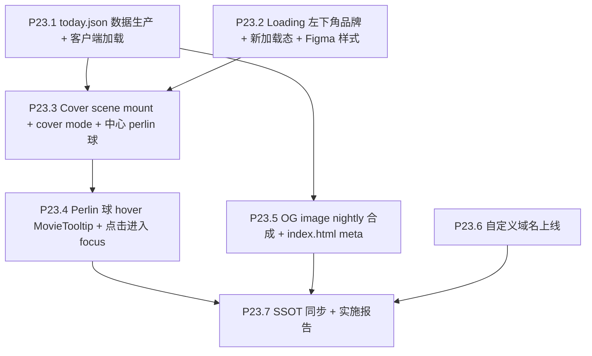

# Phase 23 — The Movie Today + 域名 + OG image

## 范围与不做

**做**：
- nightly cron 服务端预选 today_movie_id，写独立 `today.json` + 兜底 fallback
- Loading 阶段：the movie cosmos / today 双品牌字 + 百分比阶段词；加载进度不用旧条形进度条，用 Figma 规定的新样式（Figma 为 SSOT）
- 加载完成 → **移除 Start 按钮** → scene mount cover mode：保留 the movie cosmos / today 文本（无 click hint）+ 中心 perlin 球
- Perlin 球**复用主体交互**：hover 白圈 + MovieTooltip（沿用主体字段 = title + genres）；click / Enter / Space 进入该电影 focus + drawer 自动展开
- cover 空白/非球体处拖拽复用 focus 的 orbit 相机环绕；相机角度沿用到进入主体后
- nightly cron 用 Pillow 合成 `og-today.png`（1200×630），index.html 引用
- 自定义域名上线（DNS + CF Pages binding + TLS + R2 CORS + docs URL 替换）

**不做**：
- 不动 UMAP / 数据契约（仅新增 today.json + og-today.png）
- 不做国内 ICP 备案
- 不做 The Movie Today 选取范围阈值（min_vote_count = 0，留接口未来加）
- 不做引导动画（用户说统一未来做）
- 不动 P20-P22 已交付内容

## 依赖前置

- **P20** 已完成：LoadFailurePage 在网络/格式失败时兜底（today.json 失败不进 LoadFailurePage，走客户端 fallback）
- **P21** 已完成：cover 文案 "The Movie Cosmos" / "The Movie Today" / "Click the perlin sphere to begin" 进 en.json + zh.json
- **P22** 已完成：Timeline 已 vertical 左侧；focus 退出按钮 floating 底部；focus active R 已调

## 决策快照

- today_movie_id 数据源：**独立 today.json**（与 galaxy_data.json.gz 分缓存策略）
- 选取规则：**全 60K 中确定性 by UTC date**（hash("YYYY-MM-DD") mod N）；预留 `min_vote_count` 默认 0
- today.json 加载失败 fallback：**降级为 vote_count Top-1000 内随机一部**，用户感知不到出错
- cover 阶段：**scene 必须已 mount**，cover mode 通过 uniform 屏蔽非 today instance 渲染
- **移除 Start 按钮**：加载完成后不再显示按钮，球本体即入口
- Perlin 球 hover：**完全复用主体 MovieTooltip 交互**（白圈 + tooltip），字段沿用主体（当前为 title + genres，不再做单独 compact 分支）
- 其它 idle 星：**屏蔽 hover/click**（pickable mask）
- cover 空白/非球体拖拽：复用主体 focus 的 orbit 相机环绕（含 P22.9 的 `normal` / `inverted` A/B）；**相机角度沿用进入主体 focus 后**（不重置）
- cover 文案：保留 `the movie cosmos / today`，**移除 click hint**，不新增其它提示
- cover 入口动作：click 球 / Enter / Space 等价 → 进入该电影 focus + drawer 自动展开
- OG image：**nightly Pillow 合成** 一张 1200×630 png
- 域名：**用户自购**，我负责接入；保留 *.pages.dev 作备线

## 子节点执行顺序



P23.1 / P23.2 互相独立可并行；P23.3 集合两者；P23.5 / P23.6 独立可任意顺序。

---

## P23.1 today.json 数据生产 + 客户端加载

### 数据契约

新文件 `today.json`（写入 [`frontend/public/data/today.json`](frontend/public/data/today.json) + 同步 R2 副本，路径选择见下）：

```json
{
  "date": "2026-05-08",
  "movie_id": 12345,
  "selected_at": "2026-05-08T20:00:00Z",
  "selection_strategy": "deterministic_by_utc_date",
  "min_vote_count": 0
}
```

`movie_id` 必须存在于当前 `galaxy_data.json` 的 `movies[]`。

### 服务端选取（nightly cron）

新增 [`scripts/cron/pick_movie_today.py`](scripts/cron/pick_movie_today.py)：

```python
def pick_today_movie_id(
    movie_ids_pool: list[int],
    *,
    date_utc: datetime.date,
    min_vote_count: int = 0,
    movies_by_id: dict[int, dict],
) -> int:
    """Deterministic by UTC date: hash(date) mod N over filtered pool."""
    pool = [mid for mid in movie_ids_pool 
            if movies_by_id[mid].get("vote_count", 0) >= min_vote_count]
    assert len(pool) > 0, "empty pool after min_vote_count filter"
    pool_sorted = sorted(pool)   # 顺序稳定
    seed = int(hashlib.sha256(date_utc.isoformat().encode()).hexdigest()[:16], 16)
    return pool_sorted[seed % len(pool_sorted)]
```

集成到 [`scripts/cron/nightly_vote_refresh.py`](scripts/cron/nightly_vote_refresh.py) 的 export 阶段后：
- 读已写入磁盘的 `galaxy_data.json` movie list
- 调 `pick_today_movie_id`
- 写 `frontend/public/data/today.json`
- 同步上传到 R2（与 galaxy_data 一致策略）

### 客户端加载

新增 [`frontend/src/data/loadToday.ts`](frontend/src/data/loadToday.ts)：

```ts
export interface TodayPayload {
  date: string
  movie_id: number
  selected_at?: string
  selection_strategy?: string
  min_vote_count?: number
}

export async function loadTodayPayload(): Promise<TodayPayload | null> {
  // 优先 R2 manifest 提供 today_url（如果 P20 manifest 扩展），其次 /data/today.json
  ...
}
```

[`frontend/src/lib/galaxyAssetUrls.ts`](frontend/src/lib/galaxyAssetUrls.ts) 的 manifest 接口扩展：

```ts
export interface GalaxyAssetsManifest {
  ...
  today_url?: string   // P23.1
}
```

[`scripts/cron/upload_galaxy_r2.py`](scripts/cron/upload_galaxy_r2.py) 同步上传 today.json 到 R2 并写入 manifest。

### Fallback（用户感知不到错误）

[`loadToday.ts`](frontend/src/data/loadToday.ts) 失败路径：

```ts
function fallbackTodayMovieId(movies: readonly Movie[]): number {
  const top = [...movies].sort((a, b) => b.vote_count - a.vote_count).slice(0, 1000)
  const idx = Math.floor(Math.random() * top.length)
  console.warn('[Today] fallback random Top-1000', { picked: top[idx]?.id })
  return top[idx]!.id
}
```

触发条件（任一）：
- today.json 网络失败
- JSON parse 失败
- `today.movie_id` 不存在于 `movies[]`（极小概率：选片后 monthly 把它移除）
- `today.date` 与浏览器 UTC 日期相差 > 1 天（数据陈旧）

### 验收

- nightly workflow_dispatch 跑一次 → R2 + Pages 上看到 today.json + manifest 含 today_url
- 同一 UTC 日期连续刷新页面 movie_id 一致
- 跨日刷新 movie_id 改变
- 模拟 today.json 损坏 → 控制台 warn + cover 仍然能起步（fallback 生效）
- 模拟 today.movie_id 不在 movies 中 → fallback
- `min_vote_count=0` 默认；脚本支持 `--min-vote-count 1000` flag

---

## P23.2 Loading — 左下角 the movie cosmos + 新加载态 + Figma SSOT

### 设计来源（等待 Figma 链接后定稿）

- **具体颜色、间距、标题字重、加载态组件形态、动画时序/缓动、品牌最终落位**：以用户提供的 **Figma 文件** 为唯一视觉 SSOT。链接到位后，用 **Figma MCP**（`get_design_context` / `get_screenshot` 等）读取对应 frame，再映射到 Tailwind / CSS 变量与 `@font-face` / motion token。
- 在 Figma 未提供前，先冻结为需求清单，不提交视觉数值，避免与最终稿偏离。

### 现状

[`frontend/src/components/Loading.tsx`](frontend/src/components/Loading.tsx) 当前用 `bg-background/80 backdrop-blur-sm`，文案 `STRINGS.loading.title = "Loading galaxy data"`；含条形进度与多步指示。

### 实施

**视觉重做** Loading.tsx（与 Figma 对齐后定稿 class / token）：
- **背景**：按 Figma 更新全屏背景色（不再沿用文档里写死的 `bg-zinc-900` / `bg-zinc-200` 方案；以设计稿为准）。
- **品牌 `the movie cosmos`**（UI 身份面小写，见 branding 规则）：**迁移到新位置**（最终锚点与安全区以 Figma 为准，不预设左下角）。
- **条形进度条与旧 4 步进度 UI**：**删除**；改为 Figma 中的**新加载表示**（例如环形、脉冲、文案+轻量动效等——以 Figma 节点为准）。
- **标题字体**：新增 Figma 指定的 **标题专用 webfont**（`@font-face` + `font-display`；仅用于 Loading 标题/品牌区，避免全站无差别替换）。字体文件路径与授权以 Figma / 设计交付为准。
- **动画交互效果**：补充 Figma 定义的进入/循环/悬停（如有）动效，明确时长、延迟、缓动曲线；同时提供 `prefers-reduced-motion` 降级。
- `mode='loading'`：新位置 brand + 新加载态。
- `mode='await-start'`：在 P23.3 中替换为 Cover stage（不再用按钮）。

**i18n** — `STRINGS.cover.title` 对应 UI 文案保持 **the movie cosmos**（小写品牌面）；`STRINGS.cover.todayTitle` 仍供 P23.3 Cover 使用；`STRINGS.cover.todayHint` 词条保留但 P23.3 起 **cover 阶段不再渲染**（移除 click hint）。

### 验收

- 加载阶段背景色与 Figma 一致（或经设计签字的 token 表）
- **the movie cosmos** 在新位置与 Figma 一致，各断点不裁切、不与加载态重叠冲突
- **无**旧条形进度条；新加载态行为与 Figma 一致（含若有动效的性能与 `prefers-reduced-motion`）
- 标题使用指定新字体；`aria-busy` 与合理 heading/landmark 与现状一致或优于现状
- Storybook story 更新

---

## P23.3 Cover scene mount + cover mode + 中心 perlin 球（无 Start，球即入口）

### 关键状态机变化

P23.2 当前 `Loading` 实现保留 `mode='await-start'` 与居中 `Start` 按钮（占位），P23.3 删除该按钮分支，由 cover mode 直接接管：

```
galaxy-loading → galaxy-error
              → index-loading → cover-loading-today [拉 today.json, scene mount, coverMode=true]
                              → cover-ready [Loading 退出 + Cover 文案 + 中心 perlin 球可交互]
                              → focused [coverMode=false, drawer 自动展开, 相机角度沿用]
```

要点：

- `Loading` 中的 `Start` 按钮渲染分支删除（`mode='await-start'` 残留代码同步清理或仅作内部过渡占位）
- scene 在 today.json 拉到（或 fallback 决定）后立即 mount，不再等待用户点击

### Cover mode uniform

[`frontend/src/three/scene.ts`](frontend/src/three/scene.ts) 新增 uniform：

```ts
const uniforms = {
  ...,
  uCoverMode: { value: 0.0 },           // 0 = normal, 1 = cover (only today renders)
  uCoverTodayInstanceId: { value: -1 },
}
```

**Idle / Active vertex shader** 早期 cull：

```glsl
if (uCoverMode > 0.5 && float(gl_InstanceID) != uCoverTodayInstanceId) {
  gl_Position = vec4(2.0, 2.0, 2.0, 1.0);
  vSize = 0.0;
  return;
}
```

**Pickable mask** 同步：cover mode + 非 today 直接跳过 raycaster 命中。

### Cover 视觉层（CoverBackdrop）

P23.2 已经把 `the movie cosmos / today` 双品牌字落位到 Loading 的过渡画面；P23.3 把 `cover-ready` 阶段的同款文字抽到独立 [`frontend/src/hud/CoverBackdrop.tsx`](frontend/src/hud/CoverBackdrop.tsx)，与 Loading 解耦，便于 cover 独立持续显示：

- 文案：仅保留 `the movie cosmos`（左）+ `today`（右），位置和字号沿用 P23.2 定稿
- **不显示** click hint（移除 `STRINGS.cover.todayHint` 在 cover 阶段的渲染；i18n 词条本身可保留以兼容）
- 不新增其它提示文字
- 中心区域**不挡 canvas**：让 perlin 球完整显示并可被指针/键盘命中
- 文案层 `pointer-events: none`（不挡住 cover orbit 拖拽）；右上角 HUD（Info/Lang/Fullscreen）继续显示

### 状态 store

新增 [`frontend/src/store/coverModeStore.ts`](frontend/src/store/coverModeStore.ts):

```ts
interface CoverModeState {
  coverMode: boolean
  todayMovieId: number | null
  setCover: (movieId: number) => void
  exitCoverIntoFocus: () => void   // 进入主体 focus（替代旧 exitCover 命名）
}
```

- `setCover(id)` → `coverMode = true, todayMovieId = id`；scene 设 uniform 并把相机定位到 today
- `exitCoverIntoFocus()` → 不重置相机角度；`coverMode = false` + `useGalaxyInteractionStore.setState({ selectedMovieId: todayMovieId })`（drawer 自动展开 + 进入 P11.1 perlin focus）

### 相机：cover 自带 orbit + 角度沿用

cover 阶段相机行为**完全复用主体 focus 的 orbit drag 路径**，不再使用静态居中：

- 进入 cover 时：用现有 `setFocusOrbitCameraPosition`（[`camera.ts`](frontend/src/three/camera.ts) L19）把 today 摆到屏幕中心，初始 yaw/pitch 与主体 focus 默认一致
- cover 拖拽空白/非球体处：触发与 focus 一致的 orbit 环绕（绕 today 旋转），含 P22.9 `?orbitDrag=normal|inverted` A/B
- cover 内部维护 `coverFocusId = todayMovieId` 用于驱动相机/active 渲染，但 `selectedMovieId` 在 cover 阶段保持 `null`，避免 drawer 提前展开
- `exitCoverIntoFocus()` 时**不调用任何相机重置**：直接把当前 cover 的 yaw/pitch/distance 透传给主体 focus 路径，实现“角度沿用”
- 拾取规则：cover 阶段只有 today 可被 hover/click，空白拖拽走 orbit；这也意味着不能误命中其它星

### 文案/i18n

- `STRINGS.cover.todayTitle`（"the movie today" 或等价文案）：在 P23.2 的双品牌字方案下，该词条由 cover 视觉中的 `today` 字承载，是否继续作为单独 sr-only / aria-label 由 P23.4 的 a11y 段决定
- `STRINGS.cover.todayHint`：保留词条以保兼容，但 **cover 阶段不再渲染**

### 验收

- 加载完成（galaxy + index ready）→ 自动拉 today → cover 启动；**全程没有 Start 按钮**
- cover 阶段画面：`the movie cosmos`（左）+ `today`（右）+ 中心 perlin 球；**无 click hint**
- 中心 perlin 球可见、可 hover、可 click；其它 idle 星不可见、不可 hover、不可 click
- cover 阶段拖拽空白/非球体：相机绕 today 环绕，方向与 P22.9 `?orbitDrag` 设定一致
- 进入主体 focus 后：相机 yaw/pitch/distance 与 cover 退出瞬间一致（不重置）
- 切 dark/light 主题：cover 文案与背景对应

---

## P23.4 Perlin 球 hover/Tooltip 复用主体 + 点击进入 focus

### Hover 交互：完全复用主体路径

cover 阶段 hover today 那颗的视觉与逻辑与主体 idle hover 一致，**不引入 compact 分支**：

- 白色 hover 描边圈：复用主体 idle hover 的现有实现（不另外做样式）
- [`frontend/src/components/MovieTooltip.tsx`](frontend/src/components/MovieTooltip.tsx)：cover 阶段直接渲染原 tooltip，字段沿用主体当前实现（即 `title + genres`），不再加 `compact` prop / 不裁剪字段

含义：今后主体 MovieTooltip 字段如有调整（例如未来加上年份），cover 同步生效，避免双源维护。

### 点击 / Enter / Space 触发进入 focus

scene 的 click handler 在 cover mode 下命中 today 即进入 focus（不再叫"退出 cover"，统一动作语义）：

```ts
function onCanvasClick(e: PointerEvent) {
  if (coverModeStore.getState().coverMode) {
    const hit = raycastFromPointer(e)
    if (hit && hit.movieId === coverModeStore.getState().todayMovieId) {
      coverModeStore.getState().exitCoverIntoFocus()
    }
    return   // cover 阶段非 today 命中已在 P23.3 mask 屏蔽，这里再兜一层
  }
  // ...原 click 流程
}
```

**键盘 Enter / Space fallback** — App.tsx 全局 keydown handler 增加（无障碍 fallback，等价于 click today）：

```ts
if ((e.key === 'Enter' || e.key === ' ') && coverModeStore.getState().coverMode) {
  e.preventDefault()
  coverModeStore.getState().exitCoverIntoFocus()
}
```

`exitCoverIntoFocus()` 行为见 P23.3：把 `selectedMovieId` 设为 today，并保留当前相机 yaw/pitch/distance。

### 进入 focus 的视觉/相机过渡

- `coverMode = false` → CoverBackdrop（`the movie cosmos / today` 文案）按 P23.2 时序淡出
- 同时 `setSelectedMovieId(todayId)` → drawer 自动展开（P19 ESC 流程已支持）
- 相机：**沿用 cover 当前角度**，不再重置；如需平滑过渡仅在 distance 上对齐 P11.1 focus 默认半径，yaw/pitch 不动
- 拖拽方向：`?orbitDrag=normal|inverted` 在 cover 与 focus 阶段语义保持一致，用户无感切换

### 非目标点击行为

cover 阶段点击空白/非球体处：**无事发生**，停留 cover；空白拖拽则触发相机环绕（见 P23.3）。click 与 drag 的判定阈值复用主体已有判定，避免拖拽尾点误触进入 focus。

### a11y / 键盘可达性

- 在 cover 阶段为 perlin 球提供一个不可见的可 focus 元素（如绝对定位的透明 `<button aria-label="The Movie Today: <title>">` 覆盖中心区域），保证 Tab 可达 + Enter/Space 等价 click
- ESC 在 cover 阶段**不响应**（用户没有"取消 today"的语义；ESC 行为留给 focus 阶段退出，沿用 P22）

### 验收

- Hover today perlin 球：白圈出现 + tooltip 弹出，**字段与主体 hover 完全一致**（当前为 title + genres，跟随主体改动）
- 鼠标移开 today：白圈与 tooltip 消失
- Click today 球：cover 文案淡出 + drawer 滑入 + 进入 P11.1 perlin focus；**相机 yaw/pitch 不重置**
- Enter / Space：等同 click（含 Tab 聚焦后键盘触发）
- 点击/拖拽空白处：不进入 focus；拖拽产生 orbit 环绕
- `?orbitDrag=inverted` 在 cover 与 focus 阶段方向一致
- ESC 在 cover 阶段不退出（不存在"取消 today"语义）

---

## P23.5 OG image nightly 合成

### 设计

`og-today.png` 1200×630 png，元素：
- 左侧：今日电影 poster（w500 缩放裁剪，圆角阴影）
- 右侧：title（大字）+ tagline 或 release year + 1-3 genre badge + 底部 brand "The Movie Cosmos" + URL
- 整体深色背景配合 genre[0] 色 accent

### 实施

新增 [`scripts/cron/render_og_today.py`](scripts/cron/render_og_today.py)：

```python
def render_og_card(movie: dict, *, output: Path, brand: str = "The Movie Cosmos") -> None:
    from PIL import Image, ImageDraw, ImageFont
    canvas = Image.new("RGB", (1200, 630), color=(20, 20, 24))
    draw = ImageDraw.Draw(canvas)
    
    # 1. 拉 poster
    poster = download_poster(movie["poster_url"])
    poster_resized = poster.resize((420, 630), Image.LANCZOS)
    canvas.paste(poster_resized, (0, 0))
    
    # 2. title
    font_title = ImageFont.truetype(repo_root / "assets/fonts/Inter-Bold.ttf", 60)
    draw.text((460, 120), movie["title"], font=font_title, fill="white")
    
    # 3. genre badges, brand, URL
    ...
    
    canvas.save(output, format="PNG", optimize=True)
```

集成到 [`nightly_vote_refresh.py`](scripts/cron/nightly_vote_refresh.py) 在选完 today 之后：
- 写 `frontend/public/data/og-today.png`
- 同步上传 R2

**字体**：Inter 或类似免费中性字体 commit 到 `assets/fonts/`（一次性，~300KB）。中文 fallback 暂不做（OG 卡片永远显示英文 title 比较稳）。

### index.html meta

[`frontend/index.html`](frontend/index.html) 加：

```html
<meta property="og:title" content="The Movie Cosmos">
<meta property="og:description" content="A 2.5D galaxy of ~60,000 films from TMDB. Today's pick refreshes every UTC midnight.">
<meta property="og:image" content="https://the-movie-cosmos.com/data/og-today.png">
<meta property="og:type" content="website">
<meta property="og:url" content="https://the-movie-cosmos.com/">
<meta name="twitter:card" content="summary_large_image">
<meta name="twitter:image" content="https://the-movie-cosmos.com/data/og-today.png">
```

注：og:image **必须绝对 URL**；hostname 在 P23.6 域名上线后填实际域名（在那之前用 `the-movie-cosmos.pages.dev`）。

### Cache-Control

[`frontend/public/_headers`](frontend/public/_headers)（P20.4 已建）追加：

```
/data/og-today.png
  Cache-Control: public, max-age=300, must-revalidate
```

短 TTL（5min）让 social media re-fetch。

### 验收

- nightly 跑一次后 `og-today.png` 1200×630 写入 prod
- `curl -I https://.../data/og-today.png` 返回 PNG content-type + 短 cache header
- 把 prod URL 投入 [opengraph.xyz](https://www.opengraph.xyz) 或 Twitter Card validator → 显示卡片预览
- 隔日刷新 → 新片对应新 og-today.png

---

## P23.6 自定义域名上线

### 用户预先操作（非自动化）

1. 用户从注册商购买域名（推荐 Cloudflare Registrar，DNS 同账号最顺）
2. 用户告诉我域名

### 我负责的步骤

1. **CF Pages 自定义域名绑定**（`Pages → the-movie-cosmos → Custom domains → Add`），CF 自动签发 TLS
2. **DNS** 在 CF DNS（如域名也托管在 CF）：自动 CNAME → `<project>.pages.dev`；如域名在外部注册商，手动加 CNAME（root 域用 ALIAS / ANAME 或 Cloudflare flatten）
3. **R2 CORS allowlist** ([`scripts/cron/upload_galaxy_r2.py`](scripts/cron/upload_galaxy_r2.py) 不动，CORS 在 R2 bucket 配置侧)：
   - 在 CF dashboard R2 bucket → CORS policy 增加 `https://<custom-domain>` 与 `https://the-movie-cosmos.pages.dev`（保留备线）
4. **替换文档 / HUD 中的 hostname**：
   - [`README.md`](README.md) §标题 / §6 部署拓扑链接
   - [`frontend/index.html`](frontend/index.html) og:image / og:url
   - [`frontend/public/_headers`](frontend/public/_headers) 不需改
   - 相关 docs / guides / 实施报告**不动**（历史归档）
5. **重定向**（可选）：CF Pages dashboard 加 redirect rule 把 `*.pages.dev` 301 → 自定义域名（**推荐**，避免 SEO 重复）；或在 [`frontend/public/_redirects`](frontend/public/_redirects) 配置
6. **OG image hostname** 同步替换（P23.5）
7. **CF Web Analytics** site 记录里加新域名（P20.5 接入过 beacon，token 同一个无需换）

### 不做

- 国内 ICP 备案（用户明确）
- email forwarding 等域名衍生服务
- DNSSEC（CF 默认开启即可）

### 验收

- `https://<custom-domain>` 加载站点 200，TLS valid
- `<custom-domain>/data/galaxy_data.json.gz` 经 R2 manifest 跳转加载成功（CORS pass）
- og:image URL 用新域名，social media validator 通过
- *.pages.dev 仍可访问（备线）或 301 → 新域名（按用户最后选择）
- README §部署拓扑反映新域名

---

## P23.7 SSOT 同步 + 实施报告

### 改动

**Tech Spec** ([`docs/project_docs/TMDB 电影宇宙 Tech Spec.md`](docs/project_docs/TMDB%20电影宇宙%20Tech%20Spec.md))：
- §状态机加 `cover-loading-today` / `cover-ready` / `focused` 三相
- §cover mode uniform `uCoverMode` / `uCoverTodayInstanceId` 写入 §渲染章节
- §部署拓扑：自定义域名 + R2 CORS

**Data Pipeline** ([`docs/project_docs/TMDB 电影宇宙 Data Pipeline.md`](docs/project_docs/TMDB%20电影宇宙%20Data%20Pipeline.md))：
- §nightly cron 加 today.json + og-today.png 产出
- §产物表加 today.json schema、og-today.png 规格

**Design Spec** ([`docs/project_docs/TMDB 电影宇宙 Design Spec.md`](docs/project_docs/TMDB%20电影宇宙%20Design%20Spec.md))：
- §首屏：Loading（the movie cosmos / today 双品牌字、百分比阶段词、无条形进度条、新加载态、Butler 字体；附 Figma 链接与 MCP 对齐记录）
- §Cover：移除 Start 按钮；保留 the movie cosmos / today 文本、无 click hint；中心 perlin 球复用主体 hover 白圈 + MovieTooltip（字段同主体 = title + genres）；空白拖拽=focus orbit；点击/Enter/Space 进入 focus；相机角度沿用

**README** ([`README.md`](README.md))：
- §标题 / §6 反映新域名 + The Movie Today 概念
- §5 Secrets 表加（如有）OG 字体路径或新 env

**实施报告** [`docs/reports/Phase 23 P23 The Movie Today 域名 OG 实施报告.md`](docs/reports/Phase%2023%20P23%20The%20Movie%20Today%20域名%20OG%20实施报告.md)：背景、决策、变更清单、验收记录、风险与回滚。

---

## 验收清单（出口）

- [ ] P23.1 nightly 写出 today.json + R2 + manifest；客户端连续刷新一致 / 跨日变；fallback 三类失败兜底有效
- [ ] P23.2 加载阶段：Figma 背景 + 左下角 the movie cosmos + 新加载态（无条形进度条）+ 标题字体
- [ ] P23.3 加载完成 → cover mode：无 Start 按钮；保留 the movie cosmos / today 文本（无 click hint）+ 中心 perlin 球；其它 idle 星不渲染不可拾；空白拖拽 = focus orbit 环绕
- [ ] P23.4 hover today 球出现白圈 + MovieTooltip（字段与主体一致 = title + genres）；点击 / Enter / Space 进入 focus → drawer 展开；相机角度沿用 cover 当前 yaw/pitch
- [ ] P23.5 og-today.png 每日刷新；Twitter / Facebook validator 显示卡片
- [ ] P23.6 自定义域名 + TLS + R2 CORS + og:image hostname 全部更新；备线 / 重定向策略明确
- [ ] P23.7 四份 SSOT 文档与实施报告归档

## 风险与回滚

| 风险                                                           | 影响 | 缓解                                                                                   |
| -------------------------------------------------------------- | ---- | -------------------------------------------------------------------------------------- |
| Cover mode shader 改动破坏现有 idle/active 渲染                | 中   | uniform 默认 0；P19 路径 A/B 切换不动；本地 storybook + prod smoke 多场景              |
| today.json 加载快于 galaxy_data 导致 fallback 误触发           | 低   | 客户端等 galaxy_data ready 之后再读 today；fallback 仅在 today 真正 fail 时触发        |
| Cover mode 下 today 那颗 vote_count 极小 → perlin 球太小看不到 | 中   | cover 模式强制 active sphere 用一个固定较大半径 (覆盖 P22.2 的 cap)，仅作 cover 视觉用 |
| OG 卡片因 social media 缓存隔日不更新                          | 低   | 短 TTL + ?v=YYYYMMDD query 字符串；social validator 手动 re-scrape                     |
| R2 CORS 没加新域名 → galaxy_data fetch 报 CORS 错              | 高   | P23.6 验收清单内强制；CF dashboard 截图存档                                            |
| Pillow 依赖在 GHA 运行体积变化                                 | 低   | `Pillow` 加入 [`requirements.cpu.txt`](requirements.cpu.txt)；CI 装包 < 30s            |
| TMDB poster 拉取失败导致 og 卡片空白                           | 低   | render_og_today 失败时复用上一日 og-today.png（不覆盖）                                |
| Cover stage 在弱网下 today.json 拉取慢 → 用户长时间看灰屏      | 低   | 拉取超时 5s 后启用 fallback                                                            |

## 出口准入

- 所有 P23.1–P23.7 todos `completed`
- prod 部署后 7 类用户感知项 smoke 全部通过：(1) Loading 双品牌字 + 百分比阶段词 (2) 加载完成 cover 自动启动且无 Start 按钮 (3) Perlin 球可见 + 空白拖拽 orbit (4) hover 出现白圈 + 主体 MovieTooltip (5) 点击/Enter/Space 进入 focus + drawer 展开 + 相机角度沿用 (6) Twitter validator OG (7) 自定义域名 TLS
- 4 份 SSOT 文档与实施报告归档
- 备线 *.pages.dev 仍可访问（按 P23.6 决策可重定向）
