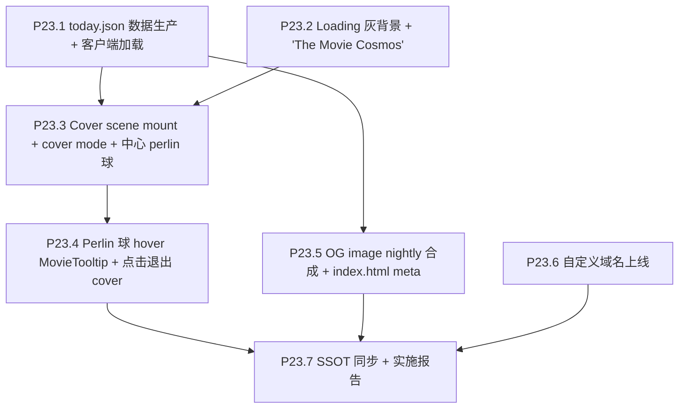

# Phase 23 — The Movie Today + 域名 + OG image

## 范围与不做

**做**：
- nightly cron 服务端预选 today_movie_id，写独立 `today.json` + 兜底 fallback
- Loading 阶段灰背景 + "The Movie Cosmos"
- 加载完成 → scene mount cover mode：灰背景 + "The Movie Today" + 中心 perlin 球
- Perlin 球 hover MovieTooltip（仅 title + genre 子集）；点击/Enter 退出 cover 进入正常 focus + drawer
- nightly cron 用 Pillow 合成 `og-today.png`（1200×630），index.html 引用
- 自定义域名上线（DNS + CF Pages binding + TLS + R2 CORS + docs URL 替换）

**不做**：
- 不动 UMAP / 数据契约（仅新增 today.json + og-today.png）
- 不做国内 ICP 备案
- 不做 The Movie Today 选取范围阈值（min_vote_count = 0，留接口未来加）
- 不做引导动画（用户说统一未来做）
- 不动 P20-P22 已交付内容

## 依赖前置

- **P20** 已完成：LoadFailurePage 在网络/格式失败时兜底（today.json 失败不进 LoadFailurePage，走客户端 fallback）
- **P21** 已完成：cover 文案 "The Movie Cosmos" / "The Movie Today" / "Click the perlin sphere to begin" 进 en.json + zh.json
- **P22** 已完成：Timeline 已 vertical 左侧；focus 退出按钮 floating 底部；focus active R 已调

## 决策快照

- today_movie_id 数据源：**独立 today.json**（与 galaxy_data.json.gz 分缓存策略）
- 选取规则：**全 60K 中确定性 by UTC date**（hash("YYYY-MM-DD") mod N）；预留 `min_vote_count` 默认 0
- today.json 加载失败 fallback：**降级为 vote_count Top-1000 内随机一部**，用户感知不到出错
- cover 阶段：**scene 必须已 mount**，cover mode 通过 uniform 屏蔽非 today instance 渲染
- Perlin 球 hover：**保留正常 MovieTooltip**，但内容剪裁为 title + genres（不显示评分 / 年份等）
- 其它 idle 星：**屏蔽 hover/click**（pickable mask）
- cover/perlin 拖拽：复用 P22.9 的 orbit 方向模式（支持 `normal` / `inverted` A/B）
- OG image：**nightly Pillow 合成** 一张 1200×630 png
- 域名：**用户自购**，我负责接入；保留 *.pages.dev 作备线

## 子节点执行顺序



P23.1 / P23.2 互相独立可并行；P23.3 集合两者；P23.5 / P23.6 独立可任意顺序。

---

## P23.1 today.json 数据生产 + 客户端加载

### 数据契约

新文件 `today.json`（写入 [`frontend/public/data/today.json`](frontend/public/data/today.json) + 同步 R2 副本，路径选择见下）：

```json
{
  "date": "2026-05-08",
  "movie_id": 12345,
  "selected_at": "2026-05-08T20:00:00Z",
  "selection_strategy": "deterministic_by_utc_date",
  "min_vote_count": 0
}
```

`movie_id` 必须存在于当前 `galaxy_data.json` 的 `movies[]`。

### 服务端选取（nightly cron）

新增 [`scripts/cron/pick_movie_today.py`](scripts/cron/pick_movie_today.py)：

```python
def pick_today_movie_id(
    movie_ids_pool: list[int],
    *,
    date_utc: datetime.date,
    min_vote_count: int = 0,
    movies_by_id: dict[int, dict],
) -> int:
    """Deterministic by UTC date: hash(date) mod N over filtered pool."""
    pool = [mid for mid in movie_ids_pool 
            if movies_by_id[mid].get("vote_count", 0) >= min_vote_count]
    assert len(pool) > 0, "empty pool after min_vote_count filter"
    pool_sorted = sorted(pool)   # 顺序稳定
    seed = int(hashlib.sha256(date_utc.isoformat().encode()).hexdigest()[:16], 16)
    return pool_sorted[seed % len(pool_sorted)]
```

集成到 [`scripts/cron/nightly_vote_refresh.py`](scripts/cron/nightly_vote_refresh.py) 的 export 阶段后：
- 读已写入磁盘的 `galaxy_data.json` movie list
- 调 `pick_today_movie_id`
- 写 `frontend/public/data/today.json`
- 同步上传到 R2（与 galaxy_data 一致策略）

### 客户端加载

新增 [`frontend/src/data/loadToday.ts`](frontend/src/data/loadToday.ts)：

```ts
export interface TodayPayload {
  date: string
  movie_id: number
  selected_at?: string
  selection_strategy?: string
  min_vote_count?: number
}

export async function loadTodayPayload(): Promise<TodayPayload | null> {
  // 优先 R2 manifest 提供 today_url（如果 P20 manifest 扩展），其次 /data/today.json
  ...
}
```

[`frontend/src/lib/galaxyAssetUrls.ts`](frontend/src/lib/galaxyAssetUrls.ts) 的 manifest 接口扩展：

```ts
export interface GalaxyAssetsManifest {
  ...
  today_url?: string   // P23.1
}
```

[`scripts/cron/upload_galaxy_r2.py`](scripts/cron/upload_galaxy_r2.py) 同步上传 today.json 到 R2 并写入 manifest。

### Fallback（用户感知不到错误）

[`loadToday.ts`](frontend/src/data/loadToday.ts) 失败路径：

```ts
function fallbackTodayMovieId(movies: readonly Movie[]): number {
  const top = [...movies].sort((a, b) => b.vote_count - a.vote_count).slice(0, 1000)
  const idx = Math.floor(Math.random() * top.length)
  console.warn('[Today] fallback random Top-1000', { picked: top[idx]?.id })
  return top[idx]!.id
}
```

触发条件（任一）：
- today.json 网络失败
- JSON parse 失败
- `today.movie_id` 不存在于 `movies[]`（极小概率：选片后 monthly 把它移除）
- `today.date` 与浏览器 UTC 日期相差 > 1 天（数据陈旧）

### 验收

- nightly workflow_dispatch 跑一次 → R2 + Pages 上看到 today.json + manifest 含 today_url
- 同一 UTC 日期连续刷新页面 movie_id 一致
- 跨日刷新 movie_id 改变
- 模拟 today.json 损坏 → 控制台 warn + cover 仍然能起步（fallback 生效）
- 模拟 today.movie_id 不在 movies 中 → fallback
- `min_vote_count=0` 默认；脚本支持 `--min-vote-count 1000` flag

---

## P23.2 Loading 灰背景 + "The Movie Cosmos"

### 现状

[`frontend/src/components/Loading.tsx`](frontend/src/components/Loading.tsx) 当前用 `bg-background/80 backdrop-blur-sm`，文案 `STRINGS.loading.title = "Loading galaxy data"`。

### 实施

**视觉重做** Loading.tsx：
- 去掉 `bg-background/80 backdrop-blur-sm`，改为纯 `bg-zinc-900` (dark) / `bg-zinc-200` (light) 灰
- 顶部 / 中心区显示大字 brand `<h1>The Movie Cosmos</h1>`（class 大字号 letter-spacing widedark:text-zinc-100）
- 进度条 / 4 步指示器保留在 brand 下方
- `mode='loading'`：brand 静态显示
- `mode='await-start'`：在 P23.3 中替换为 Cover stage（不再用按钮）

**i18n key** — `STRINGS.cover.title` 已经在 P21 改为 "The Movie Cosmos"；P23 新增 `STRINGS.cover.todayTitle = "The Movie Today"` 与 `STRINGS.cover.todayHint = "Click the sphere to begin"`（zh: "今日影片" / "点击球面开始"）。

### 验收

- 加载阶段灰背景 + 大字 brand 居中显示
- 进度条 4 步可见（不被新背景压迫）
- a11y `<h1>` 标签 + `aria-busy` 与现状一致
- 切 dark/light 主题灰度合理
- Storybook story 更新

---

## P23.3 Cover scene mount + cover mode + 中心 perlin 球

### 关键状态机变化

当前 [`App.tsx`](frontend/src/App.tsx) phase 流程：

```
galaxy-loading → galaxy-error
              → index-loading → await-start [显示 Loading mode=await-start, scene 未 mount]
                              → started [setStarted(true) 后 mount scene]
```

P23 修改为：

```
galaxy-loading → galaxy-error
              → index-loading → cover-loading-today [拉 today.json, scene mount, cover mode true]
                              → cover-ready [灰背景 + Perlin 球可点]
                              → focused [coverMode false, drawer 自动展开]
```

`started` 概念被 `coverMode` 取代；scene 在 today.json 拉到（或 fallback 决定）后立即 mount。

### Cover mode uniform

[`frontend/src/three/scene.ts`](frontend/src/three/scene.ts) 新增 uniform：

```ts
const uniforms = {
  ...,
  uCoverMode: { value: 0.0 },           // 0 = normal, 1 = cover (only today renders)
  uCoverTodayInstanceId: { value: -1 },
}
```

**Idle / Active vertex shader** 早期 cull：

```glsl
if (uCoverMode > 0.5 && float(gl_InstanceID) != uCoverTodayInstanceId) {
  gl_Position = vec4(2.0, 2.0, 2.0, 1.0);
  vSize = 0.0;
  return;
}
```

**Pickable mask** 同步：cover mode + 非 today 直接跳过 raycaster 命中。

### 灰背景层

新增 [`frontend/src/hud/CoverBackdrop.tsx`](frontend/src/hud/CoverBackdrop.tsx)：

```tsx
export function CoverBackdrop() {
  const coverMode = useCoverModeStore((s) => s.coverMode)
  const t = useStrings()
  if (!coverMode) return null
  return (
    <div className="pointer-events-auto fixed inset-0 z-40 flex flex-col items-center justify-start bg-zinc-900/95 dark:bg-zinc-900/95 light:bg-zinc-200/95 transition-opacity duration-500">
      <h1 className="mt-[12vh] text-3xl font-bold tracking-wide text-zinc-100">{t.cover.todayTitle}</h1>
      <p className="mt-3 text-sm text-zinc-400">{t.cover.todayHint}</p>
      {/* 中心圆形 mask 露出 perlin 球 */}
      <div className="absolute left-1/2 top-1/2 h-[40vh] w-[40vh] -translate-x-1/2 -translate-y-1/2 rounded-full"
           style={{ pointerEvents: 'none', mask: 'radial-gradient(circle at center, transparent 30%, black 60%)', WebkitMask: 'radial-gradient(circle at center, transparent 30%, black 60%)' }} />
    </div>
  )
}
```

注：因 cover shader 已经只渲染 today，灰背景实际可以做成"全屏 div + 中心透出 mask"或"全屏 div 带 z-index 低于 canvas"。**推荐用 CSS mask** 让中心圆形区域透出 webgl canvas 的 perlin 球；mask 边缘 soft fade 避免硬边。

### 状态 store

新增 [`frontend/src/store/coverModeStore.ts`](frontend/src/store/coverModeStore.ts):

```ts
interface CoverModeState {
  coverMode: boolean
  todayMovieId: number | null
  setCover: (movieId: number) => void
  exitCover: () => void
}
```

`setCover(id)` → `coverMode = true`, `todayMovieId = id`，scene 把 uniform 置位 + 相机自动定位到该星 focus。

`exitCover()` → `coverMode = false`，并 `useGalaxyInteractionStore.setState({ selectedMovieId: todayMovieId })`（触发 drawer 展开）。

### 相机定位

cover 进入时相机要把 today 那颗放在屏幕中心。复用现有 focus 路径 + `setFocusOrbitCameraPosition`（[`camera.ts`](frontend/src/three/camera.ts) L19）。但 selectedMovieId 不能设（drawer 会展开），需要 scene 内部独立 `coverFocusId` 路径：
- scene 检测 `coverModeStore.coverMode === true && todayMovieId`
- 直接调 focus camera 路径（active mesh 渲染 + perlin shader），但 `selectedMovieId` 仍为 null
- drawer 不开

### 验收

- 加载完成（galaxy + index ready）→ 自动拉 today → cover 启动
- 灰背景遮全屏；中心透出 perlin 球
- "The Movie Today" 文字 + "Click the sphere to begin" 提示
- 其它 idle 星不可见、不可 hover、不可 click
- 切 dark/light 主题灰背景对应

---

## P23.4 Perlin 球 hover MovieTooltip + 点击退出 cover

### Hover MovieTooltip 内容裁剪

[`frontend/src/components/MovieTooltip.tsx`](frontend/src/components/MovieTooltip.tsx) 当前显示什么需 grep 确认（执行时）；目标：cover 模式下 hover today 那颗，tooltip 仅显示 **title + genres**，**不显示** vote_average / vote_count / release_date。

实现方式（推荐）：MovieTooltip 加 prop `compact?: boolean`；`coverMode === true && hoveredId === todayId` 时 `compact = true`。compact 模式只渲染 title 行 + genre badge 行。

### 点击 / Enter 触发退出

scene 的 click handler 在 cover mode 下：

```ts
function onCanvasClick(e: PointerEvent) {
  if (coverModeStore.getState().coverMode) {
    const hit = raycastFromPointer(e)
    if (hit && hit.movieId === coverModeStore.getState().todayMovieId) {
      coverModeStore.getState().exitCover()
    }
    return   // cover mode 下点其它（也不可能命中）也吞掉
  }
  // ...原 click 流程
}
```

**键盘 Enter fallback** — App.tsx 全局 keydown handler 增加：

```ts
if ((e.key === 'Enter' || e.key === ' ') && coverModeStore.getState().coverMode) {
  e.preventDefault()
  coverModeStore.getState().exitCover()
}
```

### 退出动效

- coverMode false → CoverBackdrop opacity 500ms 淡出（已在 P23.3 transition 类）
- 同时 setSelectedMovieId(todayId) → drawer 自动展开（P19 ESC 流程已支持）
- 相机平滑过渡：cover focus → normal focus 复用现有 `transitionDriver`

### 验收

- Hover today perlin 球：tooltip 显示 title + 1-3 个 genre badge；不显示评分 / 年份
- 鼠标移开 today：tooltip 消失
- Click today 球：背景淡出 + drawer 滑入 + 进入 P11.1 perlin focus
- Enter / Space 等同点击
- `?orbitDrag=inverted` 在 cover/perlin 阶段同样生效（用于直觉测试）
- ESC 在 cover 阶段不退出（用户没有"取消 today"语义；ESC 留给 focus 退出 P22）—— 或一致退出至"无 cover 无 focus"，**待验收时拍**
- a11y：cover 阶段 `<button role="button">` 包裹 perlin 球？或仅依赖 canvas + Enter — 推荐前者（可 Tab focus）

---

## P23.5 OG image nightly 合成

### 设计

`og-today.png` 1200×630 png，元素：
- 左侧：今日电影 poster（w500 缩放裁剪，圆角阴影）
- 右侧：title（大字）+ tagline 或 release year + 1-3 genre badge + 底部 brand "The Movie Cosmos" + URL
- 整体深色背景配合 genre[0] 色 accent

### 实施

新增 [`scripts/cron/render_og_today.py`](scripts/cron/render_og_today.py)：

```python
def render_og_card(movie: dict, *, output: Path, brand: str = "The Movie Cosmos") -> None:
    from PIL import Image, ImageDraw, ImageFont
    canvas = Image.new("RGB", (1200, 630), color=(20, 20, 24))
    draw = ImageDraw.Draw(canvas)
    
    # 1. 拉 poster
    poster = download_poster(movie["poster_url"])
    poster_resized = poster.resize((420, 630), Image.LANCZOS)
    canvas.paste(poster_resized, (0, 0))
    
    # 2. title
    font_title = ImageFont.truetype(repo_root / "assets/fonts/Inter-Bold.ttf", 60)
    draw.text((460, 120), movie["title"], font=font_title, fill="white")
    
    # 3. genre badges, brand, URL
    ...
    
    canvas.save(output, format="PNG", optimize=True)
```

集成到 [`nightly_vote_refresh.py`](scripts/cron/nightly_vote_refresh.py) 在选完 today 之后：
- 写 `frontend/public/data/og-today.png`
- 同步上传 R2

**字体**：Inter 或类似免费中性字体 commit 到 `assets/fonts/`（一次性，~300KB）。中文 fallback 暂不做（OG 卡片永远显示英文 title 比较稳）。

### index.html meta

[`frontend/index.html`](frontend/index.html) 加：

```html
<meta property="og:title" content="The Movie Cosmos">
<meta property="og:description" content="A 2.5D galaxy of ~60,000 films from TMDB. Today's pick refreshes every UTC midnight.">
<meta property="og:image" content="https://the-movie-cosmos.com/data/og-today.png">
<meta property="og:type" content="website">
<meta property="og:url" content="https://the-movie-cosmos.com/">
<meta name="twitter:card" content="summary_large_image">
<meta name="twitter:image" content="https://the-movie-cosmos.com/data/og-today.png">
```

注：og:image **必须绝对 URL**；hostname 在 P23.6 域名上线后填实际域名（在那之前用 `the-movie-cosmos.pages.dev`）。

### Cache-Control

[`frontend/public/_headers`](frontend/public/_headers)（P20.4 已建）追加：

```
/data/og-today.png
  Cache-Control: public, max-age=300, must-revalidate
```

短 TTL（5min）让 social media re-fetch。

### 验收

- nightly 跑一次后 `og-today.png` 1200×630 写入 prod
- `curl -I https://.../data/og-today.png` 返回 PNG content-type + 短 cache header
- 把 prod URL 投入 [opengraph.xyz](https://www.opengraph.xyz) 或 Twitter Card validator → 显示卡片预览
- 隔日刷新 → 新片对应新 og-today.png

---

## P23.6 自定义域名上线

### 用户预先操作（非自动化）

1. 用户从注册商购买域名（推荐 Cloudflare Registrar，DNS 同账号最顺）
2. 用户告诉我域名

### 我负责的步骤

1. **CF Pages 自定义域名绑定**（`Pages → the-movie-cosmos → Custom domains → Add`），CF 自动签发 TLS
2. **DNS** 在 CF DNS（如域名也托管在 CF）：自动 CNAME → `<project>.pages.dev`；如域名在外部注册商，手动加 CNAME（root 域用 ALIAS / ANAME 或 Cloudflare flatten）
3. **R2 CORS allowlist** ([`scripts/cron/upload_galaxy_r2.py`](scripts/cron/upload_galaxy_r2.py) 不动，CORS 在 R2 bucket 配置侧)：
   - 在 CF dashboard R2 bucket → CORS policy 增加 `https://<custom-domain>` 与 `https://the-movie-cosmos.pages.dev`（保留备线）
4. **替换文档 / HUD 中的 hostname**：
   - [`README.md`](README.md) §标题 / §6 部署拓扑链接
   - [`frontend/index.html`](frontend/index.html) og:image / og:url
   - [`frontend/public/_headers`](frontend/public/_headers) 不需改
   - 相关 docs / guides / 实施报告**不动**（历史归档）
5. **重定向**（可选）：CF Pages dashboard 加 redirect rule 把 `*.pages.dev` 301 → 自定义域名（**推荐**，避免 SEO 重复）；或在 [`frontend/public/_redirects`](frontend/public/_redirects) 配置
6. **OG image hostname** 同步替换（P23.5）
7. **CF Web Analytics** site 记录里加新域名（P20.5 接入过 beacon，token 同一个无需换）

### 不做

- 国内 ICP 备案（用户明确）
- email forwarding 等域名衍生服务
- DNSSEC（CF 默认开启即可）

### 验收

- `https://<custom-domain>` 加载站点 200，TLS valid
- `<custom-domain>/data/galaxy_data.json.gz` 经 R2 manifest 跳转加载成功（CORS pass）
- og:image URL 用新域名，social media validator 通过
- *.pages.dev 仍可访问（备线）或 301 → 新域名（按用户最后选择）
- README §部署拓扑反映新域名

---

## P23.7 SSOT 同步 + 实施报告

### 改动

**Tech Spec** ([`docs/project_docs/TMDB 电影宇宙 Tech Spec.md`](docs/project_docs/TMDB%20电影宇宙%20Tech%20Spec.md))：
- §状态机加 `cover-loading-today` / `cover-ready` / `focused` 三相
- §cover mode uniform `uCoverMode` / `uCoverTodayInstanceId` 写入 §渲染章节
- §部署拓扑：自定义域名 + R2 CORS

**Data Pipeline** ([`docs/project_docs/TMDB 电影宇宙 Data Pipeline.md`](docs/project_docs/TMDB%20电影宇宙%20Data%20Pipeline.md))：
- §nightly cron 加 today.json + og-today.png 产出
- §产物表加 today.json schema、og-today.png 规格

**Design Spec** ([`docs/project_docs/TMDB 电影宇宙 Design Spec.md`](docs/project_docs/TMDB%20电影宇宙%20Design%20Spec.md))：
- §首屏：cover 流程 + perlin 球可达性
- §MovieTooltip compact 模式

**README** ([`README.md`](README.md))：
- §标题 / §6 反映新域名 + The Movie Today 概念
- §5 Secrets 表加（如有）OG 字体路径或新 env

**实施报告** [`docs/reports/Phase 23 P23 The Movie Today 域名 OG 实施报告.md`](docs/reports/Phase%2023%20P23%20The%20Movie%20Today%20域名%20OG%20实施报告.md)：背景、决策、变更清单、验收记录、风险与回滚。

---

## 验收清单（出口）

- [ ] P23.1 nightly 写出 today.json + R2 + manifest；客户端连续刷新一致 / 跨日变；fallback 三类失败兜底有效
- [ ] P23.2 加载阶段灰背景 + "The Movie Cosmos" 大字 + 进度可见
- [ ] P23.3 加载完成 → cover mode：灰背景 + "The Movie Today" + 中心 perlin 球；其它 idle 星不渲染不可拾
- [ ] P23.4 hover 弹 compact MovieTooltip（title + genres）；点击 / Enter / Space 退出 cover → drawer 展开 + focus 平滑过渡
- [ ] P23.5 og-today.png 每日刷新；Twitter / Facebook validator 显示卡片
- [ ] P23.6 自定义域名 + TLS + R2 CORS + og:image hostname 全部更新；备线 / 重定向策略明确
- [ ] P23.7 四份 SSOT 文档与实施报告归档

## 风险与回滚

| 风险                                                           | 影响 | 缓解                                                                                   |
| -------------------------------------------------------------- | ---- | -------------------------------------------------------------------------------------- |
| Cover mode shader 改动破坏现有 idle/active 渲染                | 中   | uniform 默认 0；P19 路径 A/B 切换不动；本地 storybook + prod smoke 多场景              |
| today.json 加载快于 galaxy_data 导致 fallback 误触发           | 低   | 客户端等 galaxy_data ready 之后再读 today；fallback 仅在 today 真正 fail 时触发        |
| Cover mode 下 today 那颗 vote_count 极小 → perlin 球太小看不到 | 中   | cover 模式强制 active sphere 用一个固定较大半径 (覆盖 P22.2 的 cap)，仅作 cover 视觉用 |
| OG 卡片因 social media 缓存隔日不更新                          | 低   | 短 TTL + ?v=YYYYMMDD query 字符串；social validator 手动 re-scrape                     |
| R2 CORS 没加新域名 → galaxy_data fetch 报 CORS 错              | 高   | P23.6 验收清单内强制；CF dashboard 截图存档                                            |
| Pillow 依赖在 GHA 运行体积变化                                 | 低   | `Pillow` 加入 [`requirements.cpu.txt`](requirements.cpu.txt)；CI 装包 < 30s            |
| TMDB poster 拉取失败导致 og 卡片空白                           | 低   | render_og_today 失败时复用上一日 og-today.png（不覆盖）                                |
| Cover stage 在弱网下 today.json 拉取慢 → 用户长时间看灰屏      | 低   | 拉取超时 5s 后启用 fallback                                                            |

## 出口准入

- 所有 P23.1–P23.7 todos `completed`
- prod 部署后 7 类用户感知项 smoke 全部通过：(1) 灰背景品牌 (2) 加载完成 cover (3) Perlin 球可见 (4) hover compact tooltip (5) 点击退出 + drawer (6) Twitter validator OG (7) 自定义域名 TLS
- 4 份 SSOT 文档与实施报告归档
- 备线 *.pages.dev 仍可访问（按 P23.6 决策可重定向）
