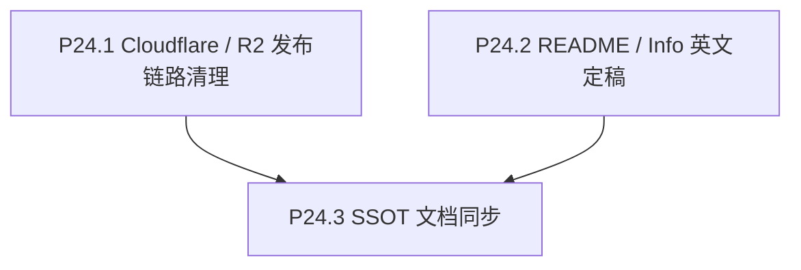

# Phase 24 — 上线收口与公开内容

## 目标

让项目公开发布链路干净、可解释、可重复，并把用户可见的英文说明补齐到可上线状态。

## 范围

**做**：
- 修复 Cloudflare Pages Git 自动构建路径误触发后直接校验 `frontend/public/data/galaxy_data.json.gz` 的问题。
- 固定生产发布职责：Cloudflare Pages 托管 `frontend/dist` app shell；Cloudflare R2 托管 `galaxy_data.json.gz` / `galaxy_search_index.json.gz` 等大对象。
- 从仓库跟踪中移除大 gzip 文件，仅保留必要的小 manifest / 静态 app 资产。
- 给构建产物加单文件大小 guard，避免未来回归到 Pages 25 MiB 限制。
- 将 `InfoModal` 英文文案和根 `README.md` 的公开说明补齐。

**不做**：
- 不改 UMAP、embedding、genre/lang 权重或坐标体系。
- 不改 focus / drawer / timeline 主交互。
- 不同步多语言；英文定稿后再进入后续 phase。

## 背景与决策

用户已确认：当前 merge 到默认分支后，Cloudflare Pages 在“Validating asset output directory”阶段报错：

```text
Pages only supports files up to 25 MiB in size
frontend/public/data/galaxy_data.json.gz is 31.2 MiB in size
```

该日志显示 Cloudflare Git 自动构建路径没有执行项目构建命令，也没有使用现有 GitHub Actions Direct Upload + R2 流程。因此应视为发布链路配置/仓库资产边界问题，而不是前端应用构建失败。

## 子节点执行顺序



P24.1 和 P24.2 可并行；P24.3 在两者完成后收口。

## P24.1 Cloudflare / R2 发布链路清理

### 实施要点

- 在 Cloudflare Pages 控制台禁用或断开 Git 自动部署路径，避免 merge 后自动走错误的仓库校验。
- 保留 GitHub Actions workflow 中的 `cloudflare/wrangler-action@v3` + `workingDirectory: frontend` + `pages deploy dist` 作为生产发布入口。
- 从 Git 跟踪中移除：
  - `frontend/public/data/galaxy_data.json.gz`
  - `frontend/public/data/galaxy_search_index.json.gz`（若继续超过或接近 Pages 限制，也应迁出 Pages 包）
- 保留本地开发与 CI 生成这些文件的能力，但它们不应作为 Pages 静态资产提交。
- 确认 `galaxy_assets_manifest.json` 是小文件，由 Pages 托管并指向 R2 对象 URL。
- 增加 CI / script guard：扫描 `frontend/dist`，任意单文件超过 25 MiB 则 fail。

### 验收

- merge 到默认分支后不再出现 Cloudflare Pages Git 构建的 25 MiB 报错。
- 手动触发 nightly / monthly 或发布 workflow 后，Cloudflare Pages 正常更新 app shell。
- 线上主域通过 manifest 从 R2 加载 `galaxy_data.json.gz`，Network 无 CORS 报错。
- `frontend/dist` 内不存在超过 25 MiB 的文件。

## P24.2 README / Info 英文定稿

### 实施要点

- 更新 `frontend/src/lib/locales/en.json` 中 `info.*` placeholder 文案。
- 更新 `frontend/src/hud/InfoModal.tsx` 结构（如需要），支持 attribution / links 更清晰展示。
- 更新根 `README.md`：
  - The Movie Cosmos 是什么。
  - 数据来源与更新方式。
  - Kaggle / TMDB attribution。
  - TMDB 非官方关系声明。
  - 字体 attribution：Inter、Butler。
  - 技术栈：Vite、React、Three.js、Zustand、Python pipeline、Cloudflare Pages/R2。
  - 隐私/analytics 简述。

### 验收

- Info 页不再显示 placeholder。
- README 与 Info 对数据来源、TMDB 非官方关系、字体 attribution 的表述一致。
- 英文文案可作为后续多语言翻译 SSOT。

## P24.3 SSOT 文档同步

### 实施要点

- 同步 `docs/project_docs/TMDB 电影宇宙 Data Pipeline.md` 中 Pages/R2 职责描述。
- 同步 `docs/guides/P23.6 自定义域名上线后运维清单.md` 中关于 Cloudflare Git 自动构建与 GHA Direct Upload 的说明。
- 如发生 `.gitignore` / workflow / manifest 行为变化，更新 README 的部署拓扑章节。

### 验收

- 文档中不存在“把大 gzip 作为 Pages 静态资产提交”的过时建议。
- 运维路径清楚区分：
  - Cloudflare Pages Git 自动构建：不用作生产入口。
  - GitHub Actions Direct Upload：生产入口。
  - R2：大数据对象入口。
