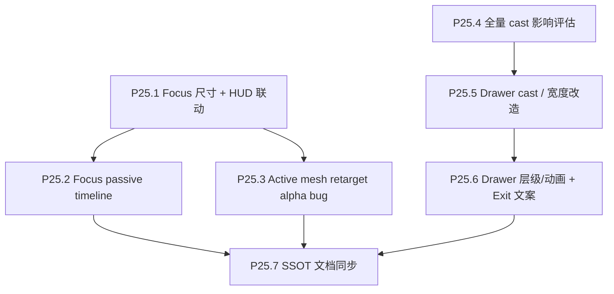

# Phase 25 — 核心体验 Polish

## 目标

提升用户在“选中电影 → focus 星球 → 查看 drawer → 在邻域星球间跳转 → 退出 focus”这条主路径上的视觉质量、可控性和布局稳定性。

## 范围

**做**：
- focus 星球明显放大，暂定约 1.5x。
- focus HUD 跟随新星球尺度调整，尤其 rating reference 与 exit button。
- focus 时 timeline 可见但不可操作。
- 修复 focus 内换星时 active mesh 透明度跳变。
- 评估并实现全量 cast 展示。
- 改造 drawer cast 布局、宽度、层级和动画。
- 调整 `Exit focus` 文案。

**不做**：
- 不处理 Cloudflare Pages / R2 发布链路（Phase 24）。
- 不做 HDR / Mac / Windows 跨设备色彩实验（Phase 26）。
- 不做 Donate、onboarding、share、人名点击搜索（Phase 27）。

## 已确认决策

- 全量 cast 希望进入 `galaxy_data.json.gz`，但需要先评估工程量与影响面。
- cast 不参与当前 UMAP 特征，因此取消 cast 截断不会改变星系坐标。
- focus 星球视觉目标暂定放大约 1.5x，具体数值根据视觉效果微调。
- focus 下 timeline 保持可见但不可操作。

## 子节点执行顺序

P25.1 / P25.4 可并行；P25.5 依赖 cast 影响评估结果；P25.7 在本 phase 行为与契约稳定后收口。

## P25.1 Focus 尺寸 + HUD 联动

### 实施要点

- 从 `frontend/src/three/camera.ts` 的 `FOCUS_PERLIN_CAMERA_STANDOFF` 入手，按 1.5x 视觉目标初试 `1 -> 0.67` 左右。
- 验证 Perlin planet、vote size reference rings、hover ring、tooltip anchor 是否仍匹配。
- 调整 `FocusLReference` 与 `FocusExitButton` 的 viewport 定位：
  - 大屏保持围绕中心星球。
  - 小屏 / MacBook 默认缩放下不要离中心过远。
  - 避免遮挡 drawer 和 search。

### 验收

- focus 星球明显变大但不裁切。
- rating reference 与 exit button 相对星球位置自然。
- focus orbit 拖拽仍稳定。
- MacBook 小屏视口下 HUD 不明显偏远。

## P25.2 Focus 下 Timeline 可见但不可操作

### 实施要点

- `Timeline` 读取 `selectedMovieId`。
- focus 时仍渲染 `TimelineHud`，但不传 `onZCurrentChange` 或传入 disabled 模式。
- focus 时移除 slider role / tabIndex / pointer 写入 / keyboard 写入。
- 保持 `cameraZ` / bridge 年份读数可见。

### 验收

- focus 下拖动 / 点击 / 键盘操作 timeline 不改变 `zCurrent`。
- 退出 focus 后 timeline 恢复可操作。
- 无障碍语义不把禁用 timeline 暴露为可操作 slider。

## P25.3 Active Mesh Retarget Alpha Bug

### 问题假设

focus 内从一个 activeR 星球跳到另一个星球时，当前选择动画可能让 `uFocusCameraBlend` 从 0 重新开始，导致非目标 active mesh 的 alpha 短暂从 dim 回到 1，再随相机移动恢复半透明。

### 实施要点

- 在 `scene.ts` 区分：
  - macro → focus 的进入进度。
  - focus → macro 的退出进度。
  - focus 内 retarget 的相机移动进度。
  - active mesh dim alpha 的状态。
- focus 内 retarget 时保持非目标 active alpha dim，不回到全不透明。
- 保留宏观进入 focus 时的渐进 dim 效果。

### 验收

- macro → focus：背景 active mesh 平滑变暗。
- focus 内换星：背景 active mesh 不闪回不透明。
- focus → macro：active mesh 正常恢复。

## P25.4 全量 Cast 影响评估

### 实施要点

- 导出默认全量 cast：`scripts/export/export_galaxy_json.py` 默认 `--cast-max 0`（可选正整数截断）。
- 准备一个评估脚本或临时导出参数，对比：
  - 20 人截断 gzip 体积。
  - 全量 cast gzip 体积。
  - 浏览器主包下载、decompress、parse 时间。
  - 内存峰值。
  - 极端长 cast 电影 drawer 表现。
- 明确结论：cast 是展示字段，不参与 embedding / UMAP / Procrustes。

### 验收

- 产出可量化体积/性能对比。
- 若增量可接受，进入 P25.5 实装。
- 若增量过大，改为设计独立详情包或延迟加载方案，不直接扩大主包。

## P25.5 Drawer Cast / 宽度改造

### 实施要点

- 移除 cast 序号。
- 桌面三列；小屏按宽度降为两列或一列。
- 支持全量 cast，可滚动且不撑爆 drawer。
- 调整 drawer 宽度：
  - 大屏不宜过窄。
  - MacBook 小屏不宜占据过多横向视野。

### 验收

- cast 长列表可读、可滚动。
- 无序号后视觉简洁。
- 小屏 drawer 不显著过宽。

## P25.6 Drawer 层级 / 动画 / 文案

### 实施要点

- 提升 drawer z-index，使其高于 hover ring、tooltip、timeline、focus HUD 等常规 HUD。
- 梳理 drawer 与 info modal 的层级关系。
- 调整 sheet starting / ending transform，实现明确的右侧向左滑入、向右退出。
- `Exit focus` 文案候选：
  - `Back to cosmos`
  - `Return to cosmos`
  - `View cosmos`

### 验收

- drawer 打开时不被其它 HUD 压住。
- 进入/退出动画方向符合右侧抽屉直觉。
- 最终文案在按钮动作语义上清晰。

## P25.7 SSOT 文档同步

### 实施要点

- 同步 `docs/project_docs/TMDB 电影宇宙 Tech Spec.md` 中 focus / timeline / drawer / cast 契约。
- 同步 `docs/project_docs/TMDB 电影宇宙 Design Spec.md` 中 focus HUD、drawer 动画、timeline 禁用态与文案。
- 如 focus camera standoff、HUD offset、active alpha、drawer width 等生产参数变化，同步 `docs/project_docs/视觉参数总表.md`。
- 如 `cast` 导出契约从截断改为全量，同步 `docs/project_docs/TMDB 电影宇宙 Data Pipeline.md` 与相关报告。
- 写 Phase 25 实施报告。

### 验收

- 文档中不再保留 cast 截断、focus HUD 位置或 timeline focus 交互的过时描述。
- 代码行为、数据契约、设计文档与实施报告一致。
