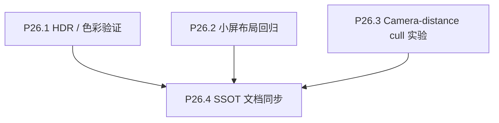

# Phase 26 — 跨设备与空间感优化

## 目标

解决 Mac/Windows/HDR 环境中的视觉偏差疑问，并探索更自然的 idle 浏览速度感，让近处星星从眼前掠过时有透明过渡，而不是突兀显示/消失。

## 范围

**做**：
- 用设备/浏览器矩阵验证 Mac idle/active 颜色偏色问题。
- 验证 Windows HDR 是否启用、是否影响同类色彩表现。
- 对小屏布局做系统化回归。
- 实验基于 camera distance 的 idle 裁切和 alpha fade。
- 验证 shader、CPU picking、透明排序、性能之间的一致性。

**不做**：
- 不直接凭单设备主观感受调色。
- 不在验证前改全局色彩 token 或 shader 输出。
- 不做 drawer/focus 主体验改造（Phase 25）。
- 不做分享/onboarding/donate 等增长功能（Phase 27）。

## 子节点执行顺序

P26.1 / P26.2 / P26.3 可并行；P26.4 收口。

## P26.1 HDR / 色彩验证矩阵

### 背景

用户在 Mac 上观察到 idle / active 颜色偏色，怀疑与 HDR 有关；同时希望验证 Windows 上 HDR 是否启用或产生影响。

### 验证矩阵

- macOS：
  - Chrome HDR on/off（如系统/显示器可切换）。
  - Safari HDR on/off。
  - 同一页面、同一电影、同一主题。
- Windows：
  - Chrome / Edge。
  - Windows HDR on/off。
  - 同一显示器或尽量记录显示器型号/色域。

### 采样对象

- idle 星星。
- active 星星。
- focus Perlin 星球。
- rating reference。
- cover / loading 品牌字。
- drawer / HUD 白色与边框。

### 实施要点

- 可增加临时 debug 色卡或固定测试电影入口，保证每台设备对比同一颜色源。
- 优先记录截图、系统 HDR 状态、浏览器、显示器信息。
- 如需要，读取 canvas 像素或对 shader 输出做固定样本验证，区分渲染输出与显示链路差异。

### 验收

- 明确偏色是否可复现。
- 明确偏色更可能来自：
  - CSS OKLCH token。
  - WebGL `SRGBColorSpace` 输出。
  - 浏览器/系统 HDR 色彩管理。
  - 显示器或截图链路。
- 得出是否需要调色的结论。

## P26.2 小屏布局系统化验收

### 实施要点

- 使用 MacBook 默认缩放作为重点目标。
- 回归以下 HUD：
  - drawer 宽度。
  - focus rating reference。
  - focus exit button。
  - vertical/horizontal timeline。
  - search bar。
  - info modal。
- 收敛 viewport clamp，不做大量单点 magic number。

### 验收

- 小屏下主要 HUD 不遮挡核心星球。
- drawer 不占据过多横向视野。
- focus reference / exit button 不离中心过远。

## P26.3 Camera-distance Idle Near-cull 实验

### 背景

旧方案基于 Z 裁切，不符合直觉：靠近 camera XY 的星星可能很近才被裁掉，远离 camera XY 的星星可能很早被裁掉。用户希望未来尝试 camera distance 裁切，并从“显示/不显示”改成“不透明/半透明”的渐变。

### 实施要点

- 在 shader 中以 camera world position 到 star world position 的距离为基础计算 near fade。
- 提供 debug uniforms：
  - near distance。
  - fade width。
  - min alpha。
  - enable flag。
- 先在 dev/debug 路径验证，不直接作为 production 默认。
- 同步 CPU picking：
  - 视觉已接近透明的星星不应仍被强命中。
  - focus selected instance 需要豁免或独立处理。
- 关注透明排序与性能：
  - idle mesh 当前是 opaque + depthWrite 的重要优化路径。
  - 如果引入 idle alpha，可能改变深度排序与 overdraw 成本。

### 验收

- 近处星星有掠过感，而不是突然消失。
- 未出现明显闪烁、排序错误、性能下降。
- picking 与视觉透明度基本一致。
- 决定是否进入 production 默认，或保留为实验开关。

## P26.4 SSOT 文档同步

### 实施要点

- 同步 `docs/project_docs/TMDB 电影宇宙 Design Spec.md` 中跨设备布局、色彩验证结论和空间浏览体验决策。
- 如 near-cull / alpha fade 进入生产默认，同步 `docs/project_docs/视觉参数总表.md` 中相关 shader uniform 与默认值。
- 如渲染管线或 picking 契约变化，同步 `docs/project_docs/TMDB 电影宇宙 Tech Spec.md`。
- 写实施报告或决策记录，包含：
  - 色彩/HDR 验证矩阵与结论。
  - 小屏布局最终参数。
  - near-cull 实验参数、截图/录屏、性能观察。
  - 是否 production 化。

### 验收

- 后续调色和空间裁切不再依赖口头记忆。
- 若不 production 化，也明确保留/回滚原因。
- 代码、参数表、设计说明与决策记录一致。
