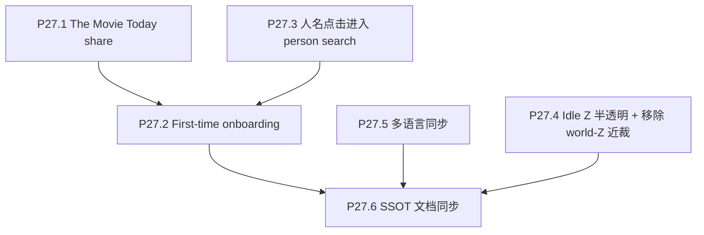

# Phase 27 — 增长与轻量功能

## 目标

在发布链路、公开说明、focus/drawer 主体验和跨设备验证稳定后，补充分享、引导、搜索联动，提高传播、回访和完整度。（支持、Tally 反馈与 Discord 见 Phase 28。）

## 范围

**做**：
- The Movie Today 分享。
- OG / Twitter 卡片图 URL 按 UTC 日 `?v=` cache-bust（P27.1a，构建期注入，已落地）。
- LocalStorage first-time onboarding。
- Drawer 中人名点击进入 person search。
- Galaxy idle 时间轴 Z 半透明与 world-Z 近裁移除（P27.4，见下节）。
- 英文文案定稿后的多语言同步。

**不做**：
- 不修 Cloudflare Pages / R2 发布链路（Phase 24）。
- 不改 focus / drawer 主体验结构（Phase 25）。
- 不做 HDR / near-cull 实验（Phase 26）。
- 不引入后端服务；当前仍以静态前端 + R2 数据为边界。

## 子节点执行顺序

P27.1 / P27.3 / P27.4 可独立推进；P27.5 应等英文内容稳定后做；P27.6 在本 phase 行为定稿后收口（含 P27.4 涉及的文档用语更新）。

## P27.1 The Movie Today Share

### 已落地（OG 预览 URL）

- **P27.1a**：生产 `index.html` 中 `og:image` / `twitter:image` 在 **Vite build** 时由插件写入 `https://themoviecosmos.com/data/og-today.png?v=<YYYY-MM-DD>`，日期与 `frontend/public/data/today.json` 的 `date` 一致（nightly 在写出 `today.json` 与 `og-today.png` 之后再 `npm run build` 即对齐）。源码 `index.html` 仍为无 query 的基 URL，避免手改两处日期。
- 可选覆盖：环境变量 `VITE_OG_TODAY_V=YYYY-MM-DD`。曾修复 `vite.config.ts` 内 **`dirname` 重复声明** 导致 `tsc -b` 失败的问题。

### 实施要点

- 增加 share 入口，优先放在 The Movie Today 相关界面或 Info 中，不打扰主 HUD。
- 优先使用 Web Share API：
  - title：The Movie Today / 当前电影标题。
  - text：简短描述。
  - url：生产主域或带可解析参数的链接。
- fallback：copy link + toast/短提示。
- 复用现有 `today.json` 与 `og-today.png`，确保社交平台预览可用。

### 验收

- 支持 Web Share 的设备可打开系统分享面板。
- 不支持 Web Share 的浏览器可复制链接。
- 分享链接在社交平台使用当前 OG 信息。
- 部署后的首页 HTML 中 `og-today.png` 带 `?v=` 且与当日 `today.json.date` 一致（构建日志含 `[og-today-image-cache-bust]`）。

## P27.2 First-time Onboarding

### 实施要点

- 基于 `localStorage` 记录是否已看过 onboarding。
- 轻量，不做复杂 tour 系统。
- 覆盖核心动作：
  - 进入 galaxy / The Movie Today。
  - 搜索 title / person / genre。
  - 使用 timeline。
  - 点击星球进入 focus。
  - 返回 cosmos。
- 提供 Skip / Done。

### 验收

- 首次访问出现，完成或跳过后不再自动出现。
- 不阻断数据加载或 WebGL 初始化。
- 键盘与屏幕阅读器基本可用。

## P27.3 人名点击进入 Person Search

### 实施要点

- Drawer 中 cast / crew 人名可点击。
- 点击后进入 person search session。
- 复用现有 search index 的 person key / normalization，避免展示名与索引 key 不一致。
- 需要处理同名人物或找不到 key 的 fallback。

### 验收

- 点击 cast 人名后，高亮该人的相关电影。
- 点击 director / producer / writer 等 crew 人名后行为一致。
- 找不到索引 key 时不报错，并提供合理无操作或提示。

## P27.4 Galaxy idle 时间轴 Z 半透明与移除 P22.1 world-Z 近裁

本节汇总已落地实现（见会话 [Idle Z 半透明与调参](6bbe4ddd-c9e9-4096-83d5-3f6eda724f8e)、[移除 nearCullWorldZ](2aced334-1914-4d93-b8c5-9cecbf4282a1)）。

### A. 移除 `nearCullWorldZ`（P22.1 world-Z 近裁）

- **删除** `frontend/src/three/nearCullWorldZ.ts`。
- **`galaxyIdle.vert.glsl` / `galaxyActive.vert.glsl`**：去掉 `uNearCullWorldZ` 及「相机世界 Z 与粒子 Z 差值小于阈值则裁掉顶点」的分支；idle 侧 focus/cover 豁免变量统一为 `exemptIdleNearFade`（语义与近距淡出豁免一致）。
- **`galaxyActive.vert.glsl`**：active 不再需要 `uCameraWorldPos` 时一并移除声明。
- **`galaxyMeshes.ts`**：去掉 `NEAR_CULL_WORLD_Z` 的 import/re-export 与 `uNearCullWorldZ` uniform。
- **`screenRadius.ts`**：`pickClosestActiveMovieAlongRay` 不再按 world-Z 条带跳过候选；去掉 `cameraWorldZ` 参数；原 `nearCullExemptMovieId` 重命名为 **`idleNearFadeExemptMovieId`**（仅服务 P26.3 idle 近距淡出拾取豁免，与 shader 一致）。
- **`interaction.ts`**：按新参数名传入，不再传 `cameraWorldZ`。

**SSOT 正文**：`docs/project_docs/TMDB 电影宇宙 Tech Spec.md`（**§1.4.5a**）、`TMDB 电影宇宙 Design Spec.md`、`视觉参数总表.md` 已与 **P27.4** 对齐；其余子文档若仍出现旧符号，以 Tech Spec 为准。

### B. Idle 时间轴 Z 半透明（硬边界，无 ramp / margin）

**目标**：仅对 **idle** 层按上映年 `aZ`（与 `zCurrent`、`zVisWindow` 同单位）乘透明度因子；与 **近距淡出**（P26.3）相乘；CPU 拾取与 GPU 一致。

**参数（最终形态）**：

| 参数             | Uniform / 调试                                                    | 含义                                                                                                                                                                                   |
| ---------------- | ----------------------------------------------------------------- | -------------------------------------------------------------------------------------------------------------------------------------------------------------------------------------- |
| **mode**         | `uIdleZFadeMode`，`window.__galaxyIdleZFade.mode`                 | `1`：`aZ > zCurrent + zVisWindow` 时 idle 乘以 `outsideAlpha`；`0`：关闭；`-1`：`aZ < zCurrent` 时乘以 `outsideAlpha`。条带内 `zCurrent ≤ aZ ≤ zCurrent + zVisWindow` 不被本规则压暗。 |
| **outsideAlpha** | `uIdleZFadeOutsideAlpha`，`window.__galaxyIdleZFade.outsideAlpha` | 被压暗一侧的 alpha 乘子，范围 0～1（CPU/GPU clamp）。                                                                                                                                  |

**默认**：`frontend/src/three/idleZFade.ts` 中 `IDLE_Z_FADE_DEFAULTS`：**`mode`** / **`outsideAlpha`** 以该文件为准（当前仓库为 **`−1`** 与 **`0.5`**）；进站行为与控制台 **`window.__galaxyIdleZFade`** 一致。

**涉及文件**：`idleZFade.ts`、`idleZFade.spec.ts`、`galaxyIdle.vert.glsl`、`galaxyMeshes.ts`、`scene.ts`（`__galaxyIdleZFade`、`log()`、**`uIdleMacroFadesActive`**、idle 材质：**宏观**且（近距开或 Z-mode 非关）→ 透明路径）、`interaction.ts`（**`getIdleMacroFadesActive`**）、`screenRadius.ts`（**`idleMacroFadesActive`**、`prod` / `floorA`、豁免 focus/cover today）。

**实现过程备忘（维护者）**：

- 曾用 smoothstep + margin/ramp；用户要求简化为硬边界后已删除 ramp/margin 及相关 uniform。
- CPU 侧若使用 `THREE.MathUtils.smoothstep`，其签名为 **`(x, min, max)`**，与 GLSL `smoothstep(edge0, edge1, x)` 顺序不同；当前硬边界实现不再依赖该差异，但若日后恢复软边需对齐。
- `vite-plugin-glsl` 会扫描 GLSL 注释：**注释内反引号 `` ` `` 可能触发类 JS 解析错误**；idle 顶点着色器注释已改为纯标识符写法（无反引号）。
- **focus 会话**（`selectionPhase` 为 **selecting / selected / deselecting**）：**`uIdleMacroFadesActive = 0`**，**P26.3** 与 **P27.4** 在 idle 顶点着色器内**不应用**；idle 材质 **opaque + depthWrite**；**CPU 拾取** 不应用 idle fade 门控（**`getIdleMacroFadesActive`**）。

### 验收（P27.4）

- 无 `nearCullWorldZ` / `uNearCullWorldZ` / `NEAR_CULL_WORLD_Z` 残留引用；`tsc` / 相关单测通过。
- `mode` 为 0 时视觉与拾取与未开 Z 淡出一致；`1` / `-1` 时仅对应侧的 idle 变半透明，条带内不变。
- **focus**（selecting / selected / deselecting）下 idle **不透明**、无 idle fade 拾取门控，与 **`uIdleMacroFadesActive`** 一致。
- **宏观 idle**：开 Z 淡出或近距淡出时 idle 材质透明路径与拾取门控与 shader 一致；focus / cover today **exempt** 仍生效。

## P27.5 多语言同步

### 实施要点

- 以 `frontend/src/lib/locales/en.json` 定稿内容为 SSOT。
- 同步 `zh`、`zh-Hant`、`ja`、`es`、`fr`、`ar` 等 locale。
- 更新 locale schema / tests（如有）。

### 验收

- 所有 locale key 完整。
- UI 不出现英文 placeholder 或缺 key fallback。
- RTL / Arabic 不出现明显布局破坏。

## P27.6 SSOT 文档同步

### 实施要点

- 同步 `docs/project_docs/TMDB 电影宇宙 PRD.md` 中分享、onboarding 与回访/传播相关需求（支持/反馈/社区见 Phase 28）。
- 同步 `docs/project_docs/TMDB 电影宇宙 Design Spec.md` 中 onboarding、share、person search 点击态的交互规范。
- 同步 `docs/project_docs/TMDB 电影宇宙 Tech Spec.md` 中 localStorage key、Web Share fallback、person search 入口、locale 同步策略。
- 写 Phase 27 实施报告。

### 验收

- 文档能解释新增轻量功能的用户入口、状态持久化、fallback 和多语言策略。
- README / Info / locales / PRD / Design Spec / Tech Spec 对用户可见功能的描述一致。
