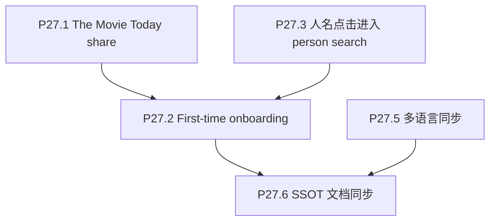

# Phase 27 — 增长与轻量功能

## 目标

在发布链路、公开说明、focus/drawer 主体验和跨设备验证稳定后，补充分享、引导、搜索联动，提高传播、回访和完整度。（支持、Tally 反馈与 Discord 见 Phase 28。）

## 范围

**做**：
- The Movie Today 分享。
- LocalStorage first-time onboarding。
- Drawer 中人名点击进入 person search。
- 英文文案定稿后的多语言同步。

**不做**：
- 不修 Cloudflare Pages / R2 发布链路（Phase 24）。
- 不改 focus / drawer 主体验结构（Phase 25）。
- 不做 HDR / near-cull 实验（Phase 26）。
- 不引入后端服务；当前仍以静态前端 + R2 数据为边界。

## 子节点执行顺序

P27.1 / P27.3 可独立推进；P27.5 应等英文内容稳定后做；P27.6 在本 phase 行为定稿后收口。

## P27.1 The Movie Today Share

### 实施要点

- 增加 share 入口，优先放在 The Movie Today 相关界面或 Info 中，不打扰主 HUD。
- 优先使用 Web Share API：
  - title：The Movie Today / 当前电影标题。
  - text：简短描述。
  - url：生产主域或带可解析参数的链接。
- fallback：copy link + toast/短提示。
- 复用现有 `today.json` 与 `og-today.png`，确保社交平台预览可用。

### 验收

- 支持 Web Share 的设备可打开系统分享面板。
- 不支持 Web Share 的浏览器可复制链接。
- 分享链接在社交平台使用当前 OG 信息。

## P27.2 First-time Onboarding

### 实施要点

- 基于 `localStorage` 记录是否已看过 onboarding。
- 轻量，不做复杂 tour 系统。
- 覆盖核心动作：
  - 进入 galaxy / The Movie Today。
  - 搜索 title / person / genre。
  - 使用 timeline。
  - 点击星球进入 focus。
  - 返回 cosmos。
- 提供 Skip / Done。

### 验收

- 首次访问出现，完成或跳过后不再自动出现。
- 不阻断数据加载或 WebGL 初始化。
- 键盘与屏幕阅读器基本可用。

## P27.3 人名点击进入 Person Search

### 实施要点

- Drawer 中 cast / crew 人名可点击。
- 点击后进入 person search session。
- 复用现有 search index 的 person key / normalization，避免展示名与索引 key 不一致。
- 需要处理同名人物或找不到 key 的 fallback。

### 验收

- 点击 cast 人名后，高亮该人的相关电影。
- 点击 director / producer / writer 等 crew 人名后行为一致。
- 找不到索引 key 时不报错，并提供合理无操作或提示。

## P27.5 多语言同步

### 实施要点

- 以 `frontend/src/lib/locales/en.json` 定稿内容为 SSOT。
- 同步 `zh`、`zh-Hant`、`ja`、`es`、`fr`、`ar` 等 locale。
- 更新 locale schema / tests（如有）。

### 验收

- 所有 locale key 完整。
- UI 不出现英文 placeholder 或缺 key fallback。
- RTL / Arabic 不出现明显布局破坏。

## P27.6 SSOT 文档同步

### 实施要点

- 同步 `docs/project_docs/TMDB 电影宇宙 PRD.md` 中分享、onboarding 与回访/传播相关需求（支持/反馈/社区见 Phase 28）。
- 同步 `docs/project_docs/TMDB 电影宇宙 Design Spec.md` 中 onboarding、share、person search 点击态的交互规范。
- 同步 `docs/project_docs/TMDB 电影宇宙 Tech Spec.md` 中 localStorage key、Web Share fallback、person search 入口、locale 同步策略。
- 写 Phase 27 实施报告。

### 验收

- 文档能解释新增轻量功能的用户入口、状态持久化、fallback 和多语言策略。
- README / Info / locales / PRD / Design Spec / Tech Spec 对用户可见功能的描述一致。
