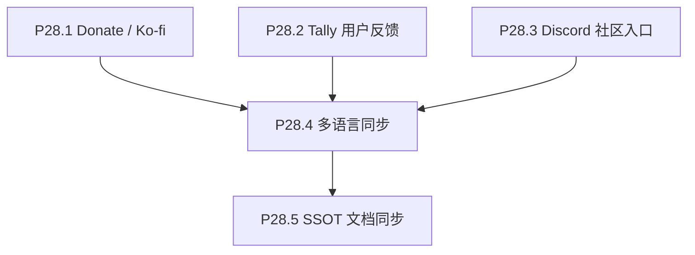

# Phase 28 — 反馈、支持与社区

## 目标

在公开说明（attribution、非官方关系、隐私）稳定的前提下，提供可持续的支持入口（Ko-fi）、结构化用户反馈（Tally）与 Discord 上的深度交流入口。支持入口**暂定**与反馈、Info 同处主 HUD 工具条；若后续体验不合适可再调整布局，文案仍保持克制、不抢占核心观影操作。

## 范围

**做**：

- Donate / **Ko-fi**（自 Phase 27 P27.4 迁入；**不使用** Buy Me a Coffee / bmac）。
- Tally：嵌入或外链表单，用于功能建议、问题报告、主观体验等反馈。
- Discord：展示长期有效的邀请链接（应用内、README、**或** Tally thank you page 等任一/组合策略），用于讨论与共建；**服务器由项目维护者自行创建与管理**。
- 英文文案定稿后的多语言同步（与本 phase 新增文案相关部分）。
- SSOT 文档与实施报告。

**不做**：

- 不实现自建后端或用户账号体系；Tally 与 Discord 均为第三方。
- 不承担 Phase 27 的 Today 分享、first-time onboarding、人名 person search（仍在 Phase 27）。
- 不在此 phase 解决 TMDB / 数据管线或 focus/drawer 主体验改造。

## 子节点执行顺序

P28.1 / P28.2 / P28.3 可在前置条件满足后并行推进；P28.4 待英文相关 copy 稳定；P28.5 在行为与文案定稿后收口。

## 前置条件

- Phase 24 起英文 attribution、非官方关系、隐私说明已稳定；避免在公开说明不完整时单独上线收款或强收集个人信息入口。
- Tally 表单与 Discord 邀请链接由维护者在各平台后台创建；仓库内仅保留**可配置的 URL**（如环境变量或构建时注入），不把私密 webhook 写入前端。

## P28.1 Donate / Ko-fi

### 平台与链接

- **收款平台**： [Ko-fi](https://ko-fi.com)（**不再**接入 Buy Me a Coffee / bmac）。
- **链接来源**：维护者在**执行本任务的对话**中提供 Ko-fi 页面 URL；仓库内通过 **环境变量或单一配置模块** 注入（建议 `VITE_KOFI_URL`，与 `VITE_TALLY_FEEDBACK_URL` 模式一致），未配置时隐藏入口或合理降级。
- **可选补充**：Info / README 可放同链或一句说明（非本项硬性验收；主入口以 HUD 为准）。

### 入口位置（暂定）

- **主 HUD**：与 `FeedbackButton`、`InfoButton` 等同层，挂在 `App.tsx` 右上工具条（与 P28.2 反馈入口并列）；视觉与交互复用现有 HUD 图标按钮模式（`styleMode`、aria-label / title）。
- **布局可演进**：若后续认为主 HUD 过挤或打扰沉浸，可再迁至 Info、分享下拉等；本 phase 以「先上线、可访问」为优先。

### 实施要点

- 文案克制（短 label，如 “Support” / 本地化等价），不暗示 TMDB 或数据方背书。
- 外链：`target="_blank"` + `rel="noopener noreferrer"`。
- 与 TMDB 非官方关系及数据 attribution 表述一致。

### 验收

- 配置有效 Ko-fi URL 时，主 HUD 支持入口可打开 Ko-fi 页面。
- 未配置时行为与产品决策一致（隐藏或降级），且不破坏工具条布局。
- 与非官方关系 / 数据 attribution 不冲突；文案与图标层级不压过核心 galaxy 操作。

## P28.2 Tally 用户反馈

### 实施要点

- 在 Tally 后台创建表单（字段建议：反馈类型、描述、可选联系方式、浏览器/设备可选）。
- 前端策略二选一或组合：**外链打开 Tally**（实现快、易维护）或 **嵌入 Tally iframe/弹层**（注意 CSP 与移动端高度）；优先不阻塞 WebGL 主线程。
- 表单 URL 使用 **环境变量或单一配置模块**（例如 `VITE_TALLY_FEEDBACK_URL`），未配置时隐藏入口或显示「即将开放」类降级（与产品决策一致即可）。
- 在 Info 或反馈入口旁用一两句话说明：数据由 Tally 处理，请用户勿在表单中提交密码或敏感信息。

### 验收

- 生产构建可切换表单地址而不改业务逻辑。
- 用户可完成一次提交（或明确看到未配置时的合理提示）。
- 隐私说明与项目整体隐私页不矛盾。

## P28.3 Discord 社区入口

### 实际收口（与初版计划差异）

- **Discord 邀请链接已在 Tally 后台配置于表单的 thank you page**（用户完成反馈提交后可见），由 Tally 托管展示与跳转；**仓库内无新增 Discord 专用 UI 块**。
- **可选补充入口**（未作为本项验收硬性要求）：Phase 27.1 已在 HUD「The Movie Today」分享下拉中支持 `**VITE_DISCORD_INVITE_URL`**（见 `ShareMovieTodayButton.tsx`）；Info/README 并列文案仍可放在 P28.4 / P28.5 视需要补齐。

### 实施要点（初版计划，仍作运维参考）

- 使用 Discord **服务器邀请链接**（建议设置不过期或定期在各平台后台轮换）。
- 若在应用内增加**独立** Discord 区块（当前未做）：与 Ko-fi / Tally 并列或同区块，保持视觉层级低于核心观影操作。
- 文案说明：社区用于讨论与反馈跟进，**非** TMDB 官方渠道、**非** 工单 SLA。
- 应用内外链：`target="_blank"` + `rel="noopener noreferrer"`（Tally 感谢页内链由 Tally 侧配置）。

### 验收（修订后）

- 通过 **Tally 提交流程** 可在 thank you page 到达 Discord 邀请。**已满足**。
- 链接失效时在 **Tally / Discord 后台** 更新即可，无需发版（建议在 P28.5 Tech Spec 中记一句维护责任边界）。

## P28.4 多语言同步

### 实施要点

- 以 `frontend/src/lib/locales/en.json` 为结构与英文 SSOT。
- 为 Donate / Ko-fi、反馈（Tally）、Discord 增加或调整 key 后，同步其余 bundle；不破坏插值与 HTML 片段规则（见仓库 `sync-doc`）。
- 运行 `npx vitest run frontend/src/lib/locales/locales.schema.spec.ts` 通过。

### 验收

- 所有 locale key 与 `en.json` 同构。
- RTL（如 `ar`）下链接区块无严重错位。

## P28.5 SSOT 文档同步

### 实施要点

- 更新 `docs/project_docs/TMDB 电影宇宙 PRD.md`：支持、反馈、社区相关需求一句到位。
- 更新 `docs/project_docs/TMDB 电影宇宙 Design Spec.md`：主 HUD 支持（Ko-fi）/ Info / 外链入口层级、反馈入口交互（打开方式、不打断 galaxy）。
- 更新 `docs/project_docs/TMDB 电影宇宙 Tech Spec.md`：环境变量名（含 `VITE_KOFI_URL`）、Tally URL 配置策略、Discord 链接维护说明。
- 根 `README.md` / `README.en.md` 如增加社区或反馈说明，按品牌规范（叙述用 The Movie Cosmos，UI 标识用 the movie cosmos）与既有 attribution 对齐。

### 验收

- 文档中支持、Tally 反馈、Discord 的职责边界清晰。
- README / Info / locales / PRD / Design Spec / Tech Spec 对同一入口的描述一致。

