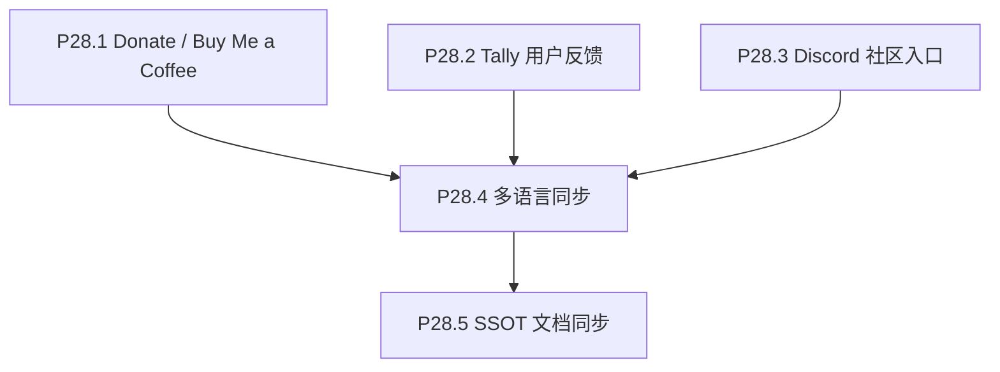

# Phase 28 — 反馈、支持与社区

## 目标

在公开说明（attribution、非官方关系、隐私）稳定的前提下，提供可持续的支持入口、结构化用户反馈（Tally）与 Discord 上的深度交流入口，三者统一收口，避免在主沉浸 HUD 中过度打扰。

## 范围

**做**：
- Donate / Buy Me a Coffee（自 Phase 27 P27.4 迁入）。
- Tally：嵌入或外链表单，用于功能建议、问题报告、主观体验等反馈。
- Discord：展示长期有效的邀请链接（或落地页跳转），用于讨论与共建；**服务器由项目维护者自行创建与管理**。
- 英文文案定稿后的多语言同步（与本 phase 新增文案相关部分）。
- SSOT 文档与实施报告。

**不做**：
- 不实现自建后端或用户账号体系；Tally 与 Discord 均为第三方。
- 不承担 Phase 27 的 Today 分享、first-time onboarding、人名 person search（仍在 Phase 27）。
- 不在此 phase 解决 TMDB / 数据管线或 focus/drawer 主体验改造。

## 子节点执行顺序

P28.1 / P28.2 / P28.3 可在前置条件满足后并行推进；P28.4 待英文相关 copy 稳定；P28.5 在行为与文案定稿后收口。

## 前置条件

- Phase 24 起英文 attribution、非官方关系、隐私说明已稳定；避免在公开说明不完整时单独上线收款或强收集个人信息入口。
- Tally 表单与 Discord 邀请链接由维护者在各平台后台创建；仓库内仅保留**可配置的 URL**（如环境变量或构建时注入），不把私密 webhook 写入前端。

## P28.1 Donate / Buy Me a Coffee

### 实施要点

- 入口优先放在 Info 页 / README，而不是主 HUD。
- 文案克制，避免打扰沉浸体验。
- 外链使用 `target="_blank"` + `rel="noopener noreferrer"`。
- 与 TMDB 非官方关系及数据 attribution 表述一致，不暗示 TMDB 背书。

### 验收

- 支持入口可访问。
- 不影响主体验。
- 与非官方关系 / 数据 attribution 不冲突。

## P28.2 Tally 用户反馈

### 实施要点

- 在 Tally 后台创建表单（字段建议：反馈类型、描述、可选联系方式、浏览器/设备可选）。
- 前端策略二选一或组合：**外链打开 Tally**（实现快、易维护）或 **嵌入 Tally iframe/弹层**（注意 CSP 与移动端高度）；优先不阻塞 WebGL 主线程。
- 表单 URL 使用 **环境变量或单一配置模块**（例如 `VITE_TALLY_FEEDBACK_URL`），未配置时隐藏入口或显示「即将开放」类降级（与产品决策一致即可）。
- 在 Info 或反馈入口旁用一两句话说明：数据由 Tally 处理，请用户勿在表单中提交密码或敏感信息。

### 验收

- 生产构建可切换表单地址而不改业务逻辑。
- 用户可完成一次提交（或明确看到未配置时的合理提示）。
- 隐私说明与项目整体隐私页不矛盾。

## P28.3 Discord 社区入口

### 实施要点

- 使用 Discord **服务器邀请链接**（建议设置不过期或定期在文档中轮换并更新仓库）。
- 入口位置与 Donate / Tally 并列或同区块（如 Info「社区与反馈」），保持视觉层级低于核心观影操作。
- 文案说明：社区用于讨论与反馈跟进，**非** TMDB 官方渠道、**非** 工单 SLA。
- 同样 `target="_blank"` + `rel="noopener noreferrer"`。

### 验收

- 新用户可从应用内或 README 找到 Discord 入口。
- 链接失效时有计划内更新路径（文档或 issue 说明即可）。

## P28.4 多语言同步

### 实施要点

- 以 `frontend/src/lib/locales/en.json` 为结构与英文 SSOT。
- 为 Donate、反馈（Tally）、Discord 增加或调整 key 后，同步其余 bundle；不破坏插值与 HTML 片段规则（见仓库 `sync-doc`）。
- 运行 `npx vitest run frontend/src/lib/locales/locales.schema.spec.ts` 通过。

### 验收

- 所有 locale key 与 `en.json` 同构。
- RTL（如 `ar`）下链接区块无严重错位。

## P28.5 SSOT 文档同步

### 实施要点

- 更新 `docs/project_docs/TMDB 电影宇宙 PRD.md`：支持、反馈、社区相关需求一句到位。
- 更新 `docs/project_docs/TMDB 电影宇宙 Design Spec.md`：Info / 外链入口层级、反馈入口交互（打开方式、不打断 galaxy）。
- 更新 `docs/project_docs/TMDB 电影宇宙 Tech Spec.md`：环境变量名、Tally URL 配置策略、Discord 链接维护说明。
- 根 `README.md` / `README.en.md` 如增加社区或反馈说明，按品牌规范（叙述用 The Movie Cosmos，UI 标识用 the movie cosmos）与既有 attribution 对齐。
- 撰写 Phase 28 实施报告（`docs/reports/`）。

### 验收

- 文档中支持、Tally 反馈、Discord 的职责边界清晰。
- README / Info / locales / PRD / Design Spec / Tech Spec 对同一入口的描述一致。
