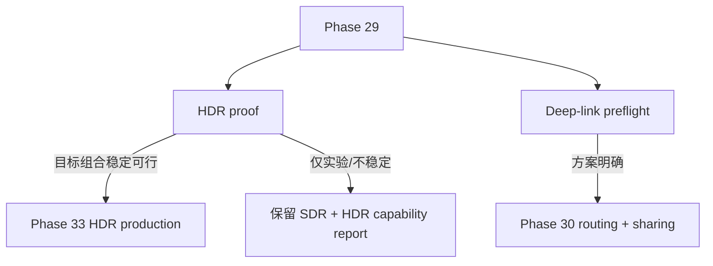

# Phase 29 — 发布门槛与技术判定

## 目标

Phase 29 的目标不是直接做完整产品功能，而是把两个会影响后续投入方向的基础问题先判清：

- **HDR 输出是否可作为当前版本发布门槛**：必须区分“真实扩展亮度输出”和“SDR 画得更亮”。
- **深链 URL 是否具备安全落地路径**：为 Phase 30 的 `/movie/:id`、`/today`、分享按钮迁移扫清架构风险。

Phase 29 完成后，应能明确进入以下分支：

## 范围边界

### 本 Phase 要做

- 建立 HDR 能力探测与最小 proof。
- 明确 HDR 支持矩阵、失败条件、降级行为。
- 预检当前前端 URL 状态、Zustand 状态流、静态部署 rewrite 风险。
- 输出 Phase 30 和 Phase 33 的实施前置结论。

### 本 Phase 不做

- 不实现完整 `/movie/:id`、`/today` 路由产品化。
- 不迁移 drawer 分享按钮。
- 不默认开启 Bloom。
- 不把 SDR 提亮当作 HDR 验收。
- 不承诺每部电影独立 OG 卡片。

## 关键现状

- 渲染入口在 [frontend/src/three/scene.ts](frontend/src/three/scene.ts)，当前 `WebGLRenderer` 使用 `renderer.outputColorSpace = THREE.SRGBColorSpace`，默认是 SDR 输出语义。
- Bloom 在 [frontend/src/three/scene.ts](frontend/src/three/scene.ts) 中构造但默认不进入 render loop，仍是调试/实验入口。
- 星系亮度参数主要在 [frontend/src/three/galaxyMeshes.ts](frontend/src/three/galaxyMeshes.ts)，但这些参数属于 SDR 可读性标定，不等同 HDR。
- App 入口在 [frontend/src/App.tsx](frontend/src/App.tsx)，当前没有 React Router；选中态由 [frontend/src/store/galaxyInteractionStore.ts](frontend/src/store/galaxyInteractionStore.ts) 的 `selectedMovieId` 驱动。
- Cover/today 状态在 [frontend/src/store/coverModeStore.ts](frontend/src/store/coverModeStore.ts) 与 [frontend/src/data/loadToday.ts](frontend/src/data/loadToday.ts) 相关；Phase 30 前需要明确 today SSOT。

## 工作拆分

### 29.1 HDR 支持矩阵定义

先定义要验收的环境组合，避免实现目标漂移。

建议矩阵字段：

- OS：Windows HDR on/off、macOS HDR on/off。
- Browser：Chrome/Edge/Safari 稳定版；如需实验 flag，必须单独标注。
- Rendering API：当前 WebGL2、可能的 canvas HDR API、可能的 WebGPU proof。
- Display：HDR 显示器可用、普通 SDR 显示器可用。
- 判定：`supported` / `experimental` / `fallback-sdr` / `blocked`。

输出物：一份简短技术记录，说明哪些组合进入发布门槛，哪些只作为实验能力。

### 29.2 HDR capability probe 设计

目标是在运行时能清楚知道当前链路实际处于什么模式。

候选模块：

- 新增能力探测模块，建议路径：`frontend/src/three/hdrCapabilities.ts` 或 `frontend/src/lib/hdrCapabilities.ts`。
- 在 [frontend/src/three/scene.ts](frontend/src/three/scene.ts) 初始化 renderer 后记录：
  - WebGL2 是否可用。
  - renderer output color space。
  - 是否存在可用 HDR canvas / WebGPU 能力。
  - 是否满足目标 HDR 组合。
- 通过 `console.log` 暴露关键结果，符合当前项目“状态可见性”规则。

注意：probe 只能判断能力，不能单独证明像素真的超过 SDR 参考白。

### 29.3 最小 HDR proof

目标是最小化、可复现地证明扩展亮度是否存在。

建议 proof 形态：

- 在现有主场景之外做受控 test patch，避免影响主体验。
- 同一画面输出两组高光：
  - SDR reference white。
  - HDR candidate highlight。
- 在 HDR 开/关、支持/不支持组合中对比。
- 记录截图、浏览器能力日志、主观观感和可测差异。

可选实施位置：

- 独立调试入口：`window.__hdrProbe`。
- Storybook/lab 页面：如果要可视化更方便，可放到现有 Storybook 实验路径旁。
- 不建议直接把 proof 混入默认 galaxy shader。

判定标准：

- 如果 candidate highlight 只是被 SDR clamp 或 tone map 成同一亮度，则判定不满足“真实 HDR 输出”。
- 如果只有实验 flag 可行，则记录为实验能力，不作为普通用户发布门槛。

### 29.4 SDR 降级策略

即使 HDR 可行，也必须定义不支持时的行为。

要求：

- HDR 关或不支持时，保持现有 SDR 主路径。
- 不支持组合不得出现黑屏、颜色异常、过曝或 Bloom 默认开启导致的回归。
- SDR 可读性优化留给 Phase 32，不在 Phase 29 回写视觉参数。

相关文件：

- [frontend/src/three/scene.ts](frontend/src/three/scene.ts)
- [frontend/src/three/galaxyMeshes.ts](frontend/src/three/galaxyMeshes.ts)
- [frontend/src/three/galaxyUniformDefaults.ts](frontend/src/three/galaxyUniformDefaults.ts)

### 29.5 深链路由预检

Phase 29 只做预检和契约定义，不做完整实现。

需要确认：

- URL parser 方案：建议轻量手写，不先引入完整 router。
- 路径契约：
  - `/`：现有 cover/home。
  - `/movie/:id`：Phase 30 实现时，数据 ready 后直接 focus 该电影并打开 drawer。
  - `/today`：建议数据 ready 后 focus 今日电影并打开 drawer。
- 状态契约：
  - URL → `selectedMovieId`。
  - `selectedMovieId` → URL。
  - ESC / drawer close / Back / Forward 的优先级。
- Query 保留：`lang`、`theme`、`timeline` 等不能被 path 更新误删。

相关文件：

- [frontend/src/App.tsx](frontend/src/App.tsx)
- [frontend/src/main.tsx](frontend/src/main.tsx)
- [frontend/src/store/galaxyInteractionStore.ts](frontend/src/store/galaxyInteractionStore.ts)
- [frontend/src/store/coverModeStore.ts](frontend/src/store/coverModeStore.ts)
- [frontend/src/data/loadToday.ts](frontend/src/data/loadToday.ts)

### 29.6 静态部署 rewrite 预检

目标是确认 Phase 30 深链刷新不会在 Vercel/static hosting 上 404。

需要检查并确定：

- 是否已有 `vercel.json` 或等价 rewrite 配置。
- `/movie/:id`、`/today` 是否 rewrite 到 `/index.html`。
- `/data/*`、assets、manifest、icons 是否仍然按静态资源返回。
- `import.meta.env.BASE_URL` 与 path routing 是否冲突。

Phase 29 输出为明确部署方案；实际添加配置可放入 Phase 30。

### 29.7 Gate report 与后续分支决策

汇总 29.1–29.6 的结论，输出 Phase 29 go/no-go。

需要明确：

- 是否进入 Phase 33 HDR production。
- 如果不进入 Phase 33，HDR capability probe 和技术结论如何保留。
- Phase 30 实现 `/movie/:id`、`/today` 前需要满足哪些前置条件。
- 哪些风险转入 Phase 32、Phase 34 或长期 backlog。

## 验收标准

Phase 29 完成时应具备以下结论：

- HDR 支持矩阵已定，能清楚说明哪些组合支持、哪些组合降级。
- 最小 HDR proof 已验证，能判断是否存在真实扩展亮度输出。
- SDR fallback 行为明确，且不会依赖 Bloom 或 HDR 才能正常浏览。
- `/movie/:id`、`/today` 的路由契约已定。
- 静态部署 rewrite 风险已识别，有 Phase 30 可直接执行的方案。
- 明确是否进入 Phase 33 HDR production；如果不进入，也要保留 capability probe 和技术结论。

## 验证计划

- HDR：在目标 OS/browser/display 组合中记录 capability probe 输出、截图或测量证据。
- SDR：在 HDR 关、不支持 HDR、普通 SDR 显示器下确认现有画面无回归。
- 路由预检：用预期路径列出刷新、Back/Forward、query 保留、静态资源访问的测试矩阵。
- 构建检查：Phase 29 如引入探测代码，至少需要通过前端 typecheck/build；如果只输出技术报告，则无需构建。

## Phase 29 交付物

- HDR support matrix。
- HDR proof 结果记录。
- SDR fallback 说明。
- Phase 30 路由契约。
- Static hosting rewrite 方案。
- Phase 33 是否启动的 go/no-go 决策。