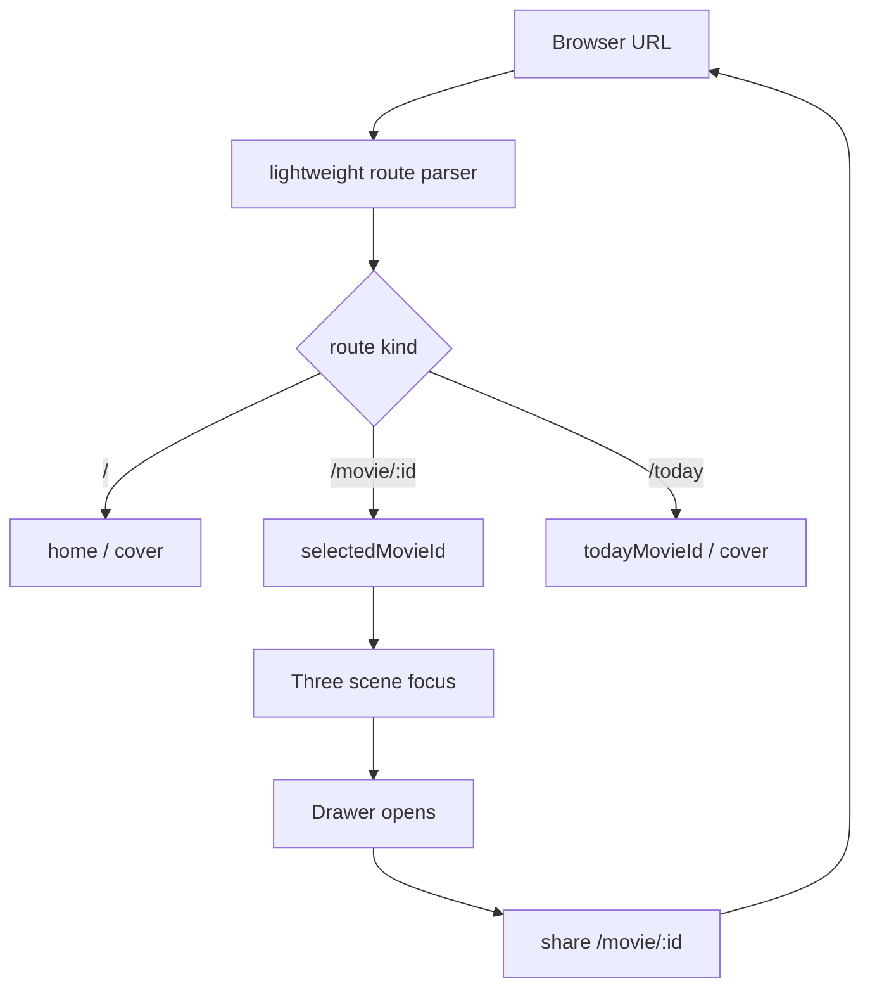

# Phase 30 — 深链路由与分享落地

## 目标

Phase 30 把 Phase 29 的深链预检转成可发布功能：

- `/movie/:id` 可刷新直达：数据 ready 后 focus 该电影并打开 Drawer。
- `/today` 可刷新直达：进入今日影片体验，并明确从 Today cover 到 movie focus 的 URL 迁移规则。
- Drawer 内提供当前影片分享，分享 URL 指向 `/movie/:id`，不再只分享站点根路径。
- 静态部署下深链刷新不 404，且 `/data/*`、assets、fonts 不被误 rewrite 成 `index.html`。

## 范围边界

### 本 Phase 要做

- 新增轻量 URL parser 和 route action 层，不引入完整 React Router。
- 实现 URL → Zustand 状态同步：`/`、`/movie/:id`、`/today`。
- 实现 Zustand/用户动作 → URL 同步：点击影片、搜索选中、关闭 Drawer、ESC、Back/Forward。
- 把分享入口迁移到 Drawer，分享当前影片深链。
- 新增或调整 locale 文案，并保持 `frontend/src/lib/locales/en.json` 作为 SSOT 的全语言同构。
- 增加静态部署 rewrite 配置，确保深链刷新进入 SPA。
- 补充 parser、URL 构造、locale parity、data URL/base path 的测试。

### 本 Phase 不做

- 不引入 React Router 或服务端路由。
- 不做每部电影独立 OG 图片/metadata。
- 不做 HDR production。
- 不重构 Three.js 选中/飞行动画主流程。
- 不改变数据 pipeline 或 `galaxy_data.json` schema。

## 关键现状

- App 入口：[frontend/src/App.tsx](frontend/src/App.tsx) 负责数据加载、cover boot、scene mount 和全局 ESC。
- 选中态 SSOT：[frontend/src/store/galaxyInteractionStore.ts](frontend/src/store/galaxyInteractionStore.ts) 的 `selectedMovieId`。
- Today/cover 状态：[frontend/src/store/coverModeStore.ts](frontend/src/store/coverModeStore.ts) 与 [frontend/src/data/loadToday.ts](frontend/src/data/loadToday.ts)。
- Three focus 响应：[frontend/src/three/scene.ts](frontend/src/three/scene.ts) 订阅 `selectedMovieId` 并驱动 focus、mask、Perlin、相机。
- 当前分享按钮：[frontend/src/hud/ShareMovieTodayButton.tsx](frontend/src/hud/ShareMovieTodayButton.tsx)，目前分享站点根路径 `/`，语义是 `The Movie Today`。
- Drawer 当前无分享区：[frontend/src/components/Drawer.tsx](frontend/src/components/Drawer.tsx)。
- i18n 出口：[frontend/src/lib/strings.ts](frontend/src/lib/strings.ts) 与 [frontend/src/lib/locales/en.json](frontend/src/lib/locales/en.json)。
- 当前未发现 Vercel/SPA rewrite 配置；已有 [frontend/public/_headers](frontend/public/_headers) 只处理 headers，不处理 rewrite。

## 工作拆分

### 30.1 文档落地与 Phase 29 前置确认

先创建并维护计划文件：`.cursor/plans/phase_30_routing_sharing.plan.md`。

#### 30.1.1 计划文件状态

| 项                   | 状态                                                                                                                                             |
| -------------------- | ------------------------------------------------------------------------------------------------------------------------------------------------ |
| 计划路径             | `.cursor/plans/phase_30_routing_sharing.plan.md`（本文件）                                                                                       |
| Phase 29 计划        | 全部 TODO 29.0–29.7 **completed**（见 [phase_29_release_gates_technical_decision.plan.md](./phase_29_release_gates_technical_decision.plan.md)） |
| Phase 29 Gate        | **Go** — Phase 30 深链产品化可开工（[P29.7 报告](../docs/reports/Phase%2029.7%20P29.7%20Phase%2029%20Gate%20report%20实施报告.md) §6）           |
| Phase 30 与 Phase 33 | **无依赖** — HDR production 为 No-go，不阻塞本 Phase                                                                                             |

#### 30.1.2 Phase 29 前置检查（2026-05-19）

**路由契约（spec §5 — P29.5）— 可执行，无变更**

| 检查项                                   | 结论                                                                  | SSOT                                                        |
| ---------------------------------------- | --------------------------------------------------------------------- | ----------------------------------------------------------- |
| Path 集合 `/` · `/movie/:id` · `/today`  | **已锁定**                                                            | `RouteKind`: `home` \| `movie` \| `today` \| `unknown`      |
| `:id` 规则                               | 正整数；非法 → R1 `replaceState('/')`；不在 galaxy → R2               | spec §5.2                                                   |
| Query 保留 `lang` / `theme` / `timeline` | path 变更仅改 `pathname`（R5）                                        | spec §5.3                                                   |
| URL ↔ store                              | `selectedMovieId` + `coverMode` + `todayMovieId`；B1–B9 表            | spec §5.4                                                   |
| cover boot 竞态                          | **R4** + `pendingRoute`（movie 深链跳过 `setCover`）                  | spec §5.5；`App.tsx` 现仍无条件 `resolveToday` → `setCover` |
| Today cover → focus                      | **R6** push `/movie/:todayId`                                         | spec §5.7                                                   |
| ESC / Back / Forward                     | B3–B5 replace `/`；popstate 无二次 push（R7–R8）                      | spec §5.6                                                   |
| 建议模块路径                             | `frontend/src/lib/routes.ts` + `useRouteController`（或 App 内 hook） | spec §5.1                                                   |

**静态 rewrite（spec §6 — P29.6）— 方案已锁定，配置文件待 30.7**

| 检查项                                            | 结论                                                                 | 备注                                        |
| ------------------------------------------------- | -------------------------------------------------------------------- | ------------------------------------------- |
| 生产 CF Pages 隐式 SPA                            | **已具备**（无顶层 `404.html` → `/movie/*` 刷新 200 + `index.html`） | 30.7 仍加显式 `_redirects` 作契约文档（W2） |
| `/data/*` 不被 rewrite                            | **D8** — 实体文件优先；`_headers` 仅 cache，与 fallback 正交         | `frontend/public/_headers` 已存在           |
| `/fonts/*` · `/assets/*` · favicon/manifest/icons | **豁免**                                                             | dist 抽样与 spec §6.3 一致                  |
| GHP 备线                                          | **缺口** — 无 `404.html`；30.7 须 `cp dist/index.html dist/404.html` | W3                                          |
| `vercel.json`                                     | **不存在**；未来启用见 spec §6.5 模板                                | 非当前主部署                                |
| `vite preview`                                    | **不能**作深链刷新验收                                               | 30.8 用 CF / `wrangler pages dev`           |

**仓库现状核对（30.1 执行日）— 与 Phase 29 预检一致**

| 资产                         | 预期（29.x）               | 现状                                    |
| ---------------------------- | -------------------------- | --------------------------------------- |
| `frontend/src/lib/routes.ts` | 30.2 新增                  | **不存在** ✓                            |
| `frontend/public/_redirects` | 30.7 新增                  | **不存在** ✓                            |
| `ShareMovieTodayButton`      | HUD 分享根路径 `/`         | **存在**于 `App.tsx` ✓                  |
| `Drawer.tsx` 分享区          | 30.5 新增                  | **无** ✓                                |
| `galaxyAssetUrls`            | `import.meta.env.BASE_URL` | `frontend/src/lib/galaxyAssetUrls.ts` ✓ |

#### 30.1.3 对后续 TODO 的实施约束（自 Phase 29 继承）

- **30.2–30.4**：严格实现 spec §5 的 R1–R9 与 B1–B9；`pendingRoute` 必须在 `galaxyData` ready 前缓存深链。
- **30.5**：分享 URL 从 `origin/` 迁至 `origin + BASE_URL + '/movie/:id'`（保留 query）。
- **30.7**：落地 `frontend/public/_redirects`（CF）+ GHP `404.html`；**不**改 `_middleware.js`（仅域名 301）。
- **30.8**：验收矩阵引用 spec §5.8 T1–T8 与 spec §6 R1–R8。

**Phase 29 结论无变更** — 30.2 起可直接按本计划与 [Phase 29 spec](../docs/project_docs/Phase%2029%20发布门槛与技术判定%20spec.md) §5–§6 实施。

### 30.2 轻量 URL parser 与 URL builder

新增纯函数模块，建议路径：`frontend/src/lib/routes.ts`。

职责：

- `parseRoute(location)`：识别 `/`、`/movie/:id`、`/today`、unknown。
- `buildMoviePath(id, currentSearch)`：生成 `/movie/:id` 并保留允许的 query。
- `buildTodayPath(currentSearch)`：生成 `/today` 并保留允许的 query。
- `buildHomePath(currentSearch)`：生成 `/` 并保留允许的 query。

约束：

- 不引入 React Router。
- `movie id` 只接受正整数；非法 id 走可控 fallback。
- 更新 path 时保留 `lang`、`theme`、`timeline` 等已有 query，不误删数据/调试参数。
- parser 是纯函数，便于 Vitest 覆盖。

### 30.3 App 层 route controller

在 [frontend/src/App.tsx](frontend/src/App.tsx) 增加轻量 route controller hook，或拆到 `frontend/src/lib/useRouteController.ts`。

职责：

- 初始加载时读取 URL，但等 galaxy data ready 后再落到 store。
- `/movie/:id`：验证电影存在后关闭/绕过 cover，并写入 `selectedMovieId=id`。
- `/today`：解析今日 id，进入 today cover 或 today focus，并保证 scene bootstrap 能读到 cover 状态。
- `/`：保持 home/cover 默认体验；如果来自 focus close，则清空 `selectedMovieId`。
- 监听 `popstate`，处理 Back/Forward。
- 使用内部 guard 防止 URL→store 与 store→URL 互相 push 循环。

关键风险：

- 当前 `App.tsx` 有默认 cover boot；`/movie/:id` 必须阻止 cover boot 覆盖已选电影。
- `scene.ts` 对 cover 有 mount-time bootstrap；`/today` 的状态应尽量在 scene mount 前确定。

### 30.4 用户动作到 URL 同步

把所有会改变 focus 的入口收敛到 route action，而不是各处直接改 URL。

需要覆盖：

- Three 点击电影：选中后 push `/movie/:id`。
- 搜索选中电影：[frontend/src/components/SearchBar.tsx](frontend/src/components/SearchBar.tsx) 选中 suggestion 后 push `/movie/:id`。
- Drawer close：[frontend/src/components/Drawer.tsx](frontend/src/components/Drawer.tsx) 关闭后回到 `/` 或 `/today`，具体按当前 route 来源决定。
- ESC：[frontend/src/App.tsx](frontend/src/App.tsx) 清 focus 时同步 URL。
- Focus exit：[frontend/src/hud/FocusExitButton.tsx](frontend/src/hud/FocusExitButton.tsx) 清 focus 时同步 URL。
- Today cover 进入 focus：明确从 `/today` push/replace 到 `/movie/:todayId`，避免 URL 停留 Today 但状态是 movie focus。

建议规则：

- 用户主动进入影片 focus：`pushState('/movie/:id')`。
- Back/Forward 驱动状态：只响应，不再次 push。
- 程序修正非法路径：`replaceState('/')` 或显示 fallback，不制造历史噪音。

### 30.5 Drawer 当前影片分享迁移

把分享入口从 HUD Today-only 按钮迁移到 Drawer 内的当前影片分享。

实施方向：

- 在 [frontend/src/components/Drawer.tsx](frontend/src/components/Drawer.tsx) 增加 share section 或 compact action row。
- 复用 [frontend/src/hud/ShareMovieTodayButton.tsx](frontend/src/hud/ShareMovieTodayButton.tsx) 中的平台打开、clipboard、toast 逻辑；建议抽出共享工具，例如 `frontend/src/lib/shareLinks.ts` 或 `frontend/src/components/MovieShareButton.tsx`。
- 分享 URL 使用当前影片 `/movie/:id`，而不是根路径 `/`。
- 分享标题/正文改为当前影片语义，不再使用 `The Movie Today` 文案。
- `today` 专属分享如仍需要，可作为 Drawer 内同一组件的上下文文案，而不是保留 HUD 顶栏按钮。

### 30.6 i18n 文案同步

如果新增 Drawer 分享文案，必须按项目规则同步所有 locale。

涉及文件：

- [frontend/src/lib/locales/en.json](frontend/src/lib/locales/en.json) 作为结构 SSOT。
- [frontend/src/lib/locales/zh.json](frontend/src/lib/locales/zh.json)
- [frontend/src/lib/locales/zh-Hant.json](frontend/src/lib/locales/zh-Hant.json)
- [frontend/src/lib/locales/ja.json](frontend/src/lib/locales/ja.json)
- [frontend/src/lib/locales/es.json](frontend/src/lib/locales/es.json)
- [frontend/src/lib/locales/fr.json](frontend/src/lib/locales/fr.json)
- [frontend/src/lib/locales/ar.json](frontend/src/lib/locales/ar.json)
- [frontend/src/lib/strings.ts](frontend/src/lib/strings.ts)

建议新增在 `drawer` 命名空间下：

- `drawer.sections.share`
- `drawer.share.copyLink`
- `drawer.share.linkCopied`
- `drawer.share.title`
- `drawer.share.text`
- `drawer.share.ariaX`
- `drawer.share.ariaFacebook`
- `drawer.share.ariaTelegram`
- `drawer.share.ariaReddit`
- `drawer.share.ariaDiscord`
- `drawer.share.ariaEmail`

注意：保留 `{{title}}`、`{{releaseYear}}` 等插值变量，不翻译变量名。

### 30.7 静态部署 rewrite 与 base path 验证

补 SPA fallback 配置，**优先 Cloudflare Pages**（当前生产）：`frontend/public/_redirects`；**GitHub Pages 备线** build 后 `cp index.html 404.html`（spec §6.4）。若未来启用 Vercel，再追加根目录 `vercel.json`（spec §6.5）。

要求：

- `/movie/:id`、`/today`、未知前端 path 刷新返回 `index.html`。
- `/data/*` 不 rewrite。
- `/assets/*` 不 rewrite。
- `/fonts/*` 不 rewrite。
- favicon、manifest、icons、robots、sitemap 等 public root assets 不 rewrite。
- `VITE_BASE_PATH` 非根部署时，data URL 仍通过 `import.meta.env.BASE_URL` 命中正确路径。

重点检查：

- [frontend/vite.config.ts](frontend/vite.config.ts)
- [frontend/src/lib/galaxyAssetUrls.ts](frontend/src/lib/galaxyAssetUrls.ts)
- [frontend/src/data/loadGalaxyGzip.ts](frontend/src/data/loadGalaxyGzip.ts)
- [frontend/src/data/loadToday.ts](frontend/src/data/loadToday.ts)
- [frontend/public/_headers](frontend/public/_headers)

### 30.8 测试与验收

新增或更新测试：

- `routes` parser/builder 单测：合法/非法 id、query 保留、unknown fallback。
- route controller 行为测试：初始 `/movie/:id`、`/today`、Back/Forward、close focus。
- share link builder 单测：平台 URL 编码、clipboard URL 指向 `/movie/:id`。
- locale parity：确保所有 bundle 与 `en.json` 同构。
- data/base path 相关既有测试保持通过。

建议命令：

- `npm run test -w frontend -- src/lib/locales/locales.schema.spec.ts`
- `npm run test -w frontend -- src/data/loadToday.spec.ts src/data/loadSearchIndex.test.ts src/utils/loadGalaxyData.test.ts`
- `npm run test -w frontend`
- `npm run lint -w frontend`
- `npm run build -w frontend`
- `npm run preview -w frontend` 后手测刷新路径。

## 验收标准

Phase 30 完成时应满足：

- 直接访问 `/movie/:id` 可在数据 ready 后 focus 目标影片并打开 Drawer。
- 直接访问 `/today` 可稳定进入今日影片体验；从 Today 进入影片 focus 后 URL 状态一致。
- 点击影片、搜索选中、Drawer close、ESC、Back/Forward 都不会造成 URL 与 `selectedMovieId` 失配。
- Drawer 内分享当前影片，复制和各平台链接都指向 `/movie/:id`。
- HUD 顶栏不再保留 Today-only 分享按钮，或其职责被明确降级且不重复。
- 所有 locale JSON 与 `en.json` 同构，插值变量保持完整。
- Vercel/static 深链刷新不 404，且 `/data/*`、assets、fonts 返回真实静态资源。
- 前端 test/lint/build 通过，preview 下完成刷新矩阵验证。

## Phase 30 交付物

- `.cursor/plans/phase_30_routing_sharing.plan.md`
- 轻量 route parser/builder。
- App route controller。
- `/movie/:id` 与 `/today` 深链行为。
- Drawer 当前影片分享入口。
- 分享/i18n 文案全语言同步。
- 静态部署 rewrite 配置。
- 路由、分享、locale、data/base path 测试。

