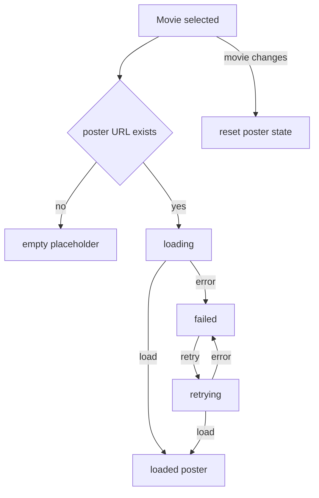

# Phase 31 — HUD 小体验与 i18n 同步

## 目标

Phase 31 只做低风险、高感知的 HUD 体验补强：

- Drawer poster 从“失败后统一占位”升级为明确的 `empty` / `loading` / `loaded` / `failed` / `retrying` 状态。
- 海报空 URL、加载失败、慢网加载和手动重试有可区分的 UI 与文案。
- 搜索 placeholder 更准确地说明可搜索内容：电影标题可用英文或原语言；人物搜索建议使用英文名。
- 所有新增 HUD 文案按 `en.json` SSOT 同步到全部 locale，并通过 schema parity 校验。

## 范围边界

### 本 Phase 要做

- 改进 [frontend/src/components/Drawer.tsx](frontend/src/components/Drawer.tsx) 中 `DrawerPoster` 的状态展示。
- 复用或轻量接入 [frontend/src/components/ui/spinner.tsx](frontend/src/components/ui/spinner.tsx) 作为 loading/retrying 反馈。
- 新增 poster 状态与 retry 所需文案。
- 优化 [frontend/src/components/SearchBar.tsx](frontend/src/components/SearchBar.tsx) 使用的 placeholder 文案。
- 同步 [frontend/src/lib/locales/*.json](frontend/src/lib/locales) 与 [frontend/src/lib/strings.ts](frontend/src/lib/strings.ts)。
- 补充必要测试和手测矩阵。

### 本 Phase 不做

- 不修改搜索算法、搜索索引结构或数据导出。
- 不新增人物多语言别名搜索能力。
- 不改 Phase 30 的 `/movie/:id`、`/today` 路由同步逻辑。
- 不迁移 Drawer 分享入口；若 Phase 30 尚未完成，只在现有 Drawer 结构上处理 poster。
- 不引入图片代理、CDN 重写或服务端海报缓存。

## 关键现状

- `DrawerPoster` 当前位于 [frontend/src/components/Drawer.tsx](frontend/src/components/Drawer.tsx)，只有 `failed` boolean；加载失败和空 URL 都展示 `str.drawer.posterPlaceholder`。
- 当前 poster `` 使用 `loading="lazy"`、`decoding="async"` 和 `onError`，没有 `onLoad`、loading spinner、retry button 或 cache-bust。
- 搜索 placeholder 当前来自 [frontend/src/lib/locales/en.json](frontend/src/lib/locales/en.json) 的：
  - `searchBar.placeholderMovie`: `Search movie titles…`
  - `searchBar.placeholderPerson`: `Director / Producer / Cast …`
  - `searchBar.placeholderGenre`: `Drama / Comedy / Thriller …`
- `strings.ts` 当前直接导出 `raw.searchBar`，Drawer 文案则通过 `drawer` 命名空间手动映射；新增 drawer 插值函数时需要同步更新。
- locale schema 测试在 [frontend/src/lib/locales/locales.schema.spec.ts](frontend/src/lib/locales/locales.schema.spec.ts)，会检查非 `en.json` bundle 与 `en.json` 的叶子键路径同构。

## 工作拆分

### 31.1 文档落地与 Phase 30 兼容预检

创建并维护计划文件：`.cursor/plans/phase_31_hud_polish_i18n.plan.md`。

预检要点：

- 如果 Phase 30 已经改动 Drawer 分享区，poster 改动不得破坏 Drawer header、overview、details、cast 和 share layout。
- 如果 Phase 30 尚未完成，Phase 31 只能依赖当前 Drawer 结构，不提前实现分享或路由逻辑。
- 只处理 HUD 表现和文案，不把搜索语义问题扩展成数据导出任务。

#### 31.1 预检结论（2026-05-20）

**Phase 30 状态**：`phase_30_routing_sharing.plan.md` 全部 TODO（30.1–30.8）已在 `main` 标记 `completed`。深链 parser（`frontend/src/lib/routes.ts`）、route controller（`routeControllerSync.ts` / `routeActions.ts`）、Drawer 分享（`DrawerMovieShare`）、locale `drawer.share.*`、静态 SPA fallback（`frontend/public/_redirects` + `spaRedirects.spec.ts`）均已落地。**Phase 31 不阻塞、也不需再改路由/分享层。**

**Drawer 布局与 Phase 31 边界**（`frontend/src/components/Drawer.tsx`）：

| 区域                      | 位置                                             | Phase 31 可改范围            |
| ------------------------- | ------------------------------------------------ | ---------------------------- |
| `DrawerMovieShare`        | `SheetHeader` 内，genre/TMDB/IMDb 链接下方       | **不改**（仅 poster 状态机） |
| `DrawerPoster`            | 可滚动 body 顶部 `AspectRatio`（`group/poster`） | **主改区**（31.2–31.3）      |
| overview / details / cast | body 下方 sections                               | **不改**                     |

分享与 poster 在 DOM 上分离：header 固定、body 独立滚动；poster loading/retry overlay 应限制在 `AspectRatio` 容器内，避免影响 header 高度或 share 图标行。

**当前 `DrawerPoster` 基线**（预检快照）：

- 单 boolean `failed`；`onError` 置位后回退占位。
- 空 `posterUrl` 与加载失败共用 `str.drawer.posterPlaceholder`（`en.json` → `drawer.posterPlaceholder`）。
- 无 `onLoad`、无 spinner、无 retry；``。
- 切换电影：`key={\`${movie.id}|${movie.poster_url}\`}` 强制 remount——31.2 可保留 key 策略，并在组件内增加 `reloadToken` 供 retry cache-bust。

**可复用资产**：

- `frontend/src/components/ui/spinner.tsx`：`Loader2Icon` + `role="status"`，可供 loading/retrying（31.2）。
- `strings.ts`：`drawer.posterAlt(title)` 已存在；新增 `drawer.poster.*` 时需同步 `strings.ts` 映射（31.5）。

**搜索 placeholder 基线**（31.4 仅文案）：

- `SearchBar.tsx` 按 tab 读取 `ui.searchBar.placeholderMovie` / `placeholderPerson` / `placeholderGenre`。
- 当前 `en.json`：`Search movie titles…` / `Director / Producer / Cast …` / `Drama / Comedy / Thriller …`——与计划建议文案不一致，31.4 再改。

**风险与约束（已确认可接受）**：

1. **不碰** `routes.ts`、`routeControllerSync.ts`、`shareLinks.ts`、`DrawerMovieShare.tsx`。
2. **不扩展** 搜索索引或人物多语言别名（留 Phase 35 或数据任务）。
3. Poster retry 仅用客户端 cache-bust query，不引入图片代理/CDN。
4. `drawer.posterPlaceholder` → `drawer.poster.placeholder` 迁移时须一次性改全 locale + `strings.ts`（31.5）。
5. Phase 30 测试（`routes.spec.ts`、`routeActions.spec.ts`、`shareLinks.spec.ts`）与 Phase 31 poster 测试正交，31.7 只需补 Drawer/SearchBar/locale 相关用例。

**结论**：Phase 30 已完成；Phase 31 可安全在 `DrawerPoster` + locale/search placeholder 范围内推进，无需等待或并行修改路由/分享。

### 31.2 Drawer poster 状态机

在 [frontend/src/components/Drawer.tsx](frontend/src/components/Drawer.tsx) 中把 `DrawerPoster` 从单个 `failed` boolean 调整为明确状态机。

建议状态：

- `empty`：`posterUrl.trim()` 为空。
- `loading`：有 URL，图片尚未 `onLoad` / `onError`。
- `loaded`：图片成功加载。
- `failed`：图片加载失败。
- `retrying`：用户点击 retry 后重新发起加载。

要求：

- 切换电影时重置状态和 retry key。
- 慢网加载时显示非阻塞 loading UI。
- `onLoad`、`onError` 只更新当前图片请求，避免旧请求晚到污染新电影状态。
- 保持 poster `alt` 使用 `str.drawer.posterAlt(title)`。

### 31.3 海报失败与重试 UI

为 `empty`、`failed`、`retrying` 提供可区分表现。

建议文案键位于 `drawer.poster` 命名空间：

- `drawer.poster.placeholder`
- `drawer.poster.loading`
- `drawer.poster.empty`
- `drawer.poster.failed`
- `drawer.poster.retry`
- `drawer.poster.retrying`

兼容策略：

- 可以保留旧 `drawer.posterPlaceholder` 一轮，或一次性迁移到 `drawer.poster.placeholder`；如果迁移键结构，必须同步全部 locale。
- Retry 可通过递增 `reloadToken` 或对 URL 添加轻量 cache-bust query 实现。
- Retry button 必须是可聚焦 `<button>`，带明确 aria label 或可见文本。

### 31.4 搜索 placeholder 文案优化

只改文案，不改搜索算法。

建议英文源文案：

- `searchBar.placeholderMovie`: `Search English or original titles…`
- `searchBar.placeholderPerson`: `Search people by English name…`
- `searchBar.placeholderGenre`: 保持 `Drama / Comedy / Thriller …`，除非发现当前 UI 空间不足。

注意：

- 不承诺人物搜索支持中文、日文、阿拉伯文等本地化姓名。
- 如果后续要支持人物多语言别名，应进入 Phase 35 的搜索数据语义审计或单独数据导出任务。

### 31.5 i18n 与 `strings.ts` 同步

按用户规则进入 locale 同步，因为本 Phase 明确涉及 i18n。

必须同步：

- [frontend/src/lib/locales/en.json](frontend/src/lib/locales/en.json)
- [frontend/src/lib/locales/zh.json](frontend/src/lib/locales/zh.json)
- [frontend/src/lib/locales/zh-Hant.json](frontend/src/lib/locales/zh-Hant.json)
- [frontend/src/lib/locales/ja.json](frontend/src/lib/locales/ja.json)
- [frontend/src/lib/locales/es.json](frontend/src/lib/locales/es.json)
- [frontend/src/lib/locales/fr.json](frontend/src/lib/locales/fr.json)
- [frontend/src/lib/locales/ar.json](frontend/src/lib/locales/ar.json)
- [frontend/src/lib/strings.ts](frontend/src/lib/strings.ts)

要求：

- `en.json` 是结构 SSOT。
- 所有 locale 的叶子键路径和数组长度与 `en.json` 完全一致。
- 不破坏 `{{title}}` 等插值变量。
- 如果 `drawer.posterPlaceholder` 迁移为嵌套结构，所有使用点一次性迁移，避免运行时缺键。

### 31.6 可访问性、键盘与 RTL 验证

验证 HUD 小改动不引入交互回归。

检查点：

- Loading/retrying 状态不会抢焦点。
- Retry button 可键盘 Tab 到达，并可用 Enter/Space 触发。
- Drawer 打开、关闭、切换电影后焦点管理仍符合现有 Sheet 行为。
- Arabic locale 下 retry UI、placeholder 和 poster 状态文本不破坏布局。
- 图片加载失败时读屏可理解当前状态。

### 31.7 测试与验收

建议测试：

- locale schema parity：确认所有语言与 `en.json` 同构。
- `DrawerPoster` 组件测试或轻量交互测试：空 URL、loading、load success、error、retry、切换 movie reset。
- SearchBar placeholder 测试：movie/person/genre tab 下展示正确文案。

建议命令：

- `npm run test -w frontend -- src/lib/locales/locales.schema.spec.ts`
- `npm run test -w frontend -- src/components/Drawer*.test.tsx src/components/SearchBar*.test.tsx`（如新增对应测试）
- `npm run test -w frontend`
- `npm run lint -w frontend`
- `npm run build -w frontend`

手测矩阵：

- 正常 poster URL。
- 空 poster URL。
- 坏 poster URL。
- DevTools slow network 下 poster loading。
- 失败后 retry 成功与 retry 再失败。
- 快速切换两部电影，旧图片请求不污染新电影状态。
- `en`、`zh`、`ja`、`ar` 下搜索 placeholder 和 poster 状态显示。

## 验收标准

Phase 31 完成时应满足：

- Drawer poster 慢网加载、空 URL、坏 URL、重试、切换电影都表现稳定。
- Poster 状态文案明确，不再把空 URL 和加载失败混成同一个占位。
- SearchBar movie/person placeholder 准确反映当前搜索能力。
- 所有 locale JSON 与 `en.json` 同构。
- `strings.ts` 导出形状与新增/迁移文案一致。
- `locales.schema.spec.ts`、相关组件测试、lint、build 通过。

## Phase 31 交付物

- `.cursor/plans/phase_31_hud_polish_i18n.plan.md`
- Drawer poster 状态机。
- Poster loading/failed/empty/retry UI。
- 搜索 placeholder 文案更新。
- 全 locale 文案同步。
- `strings.ts` 导出同步。
- locale parity 与必要组件测试。