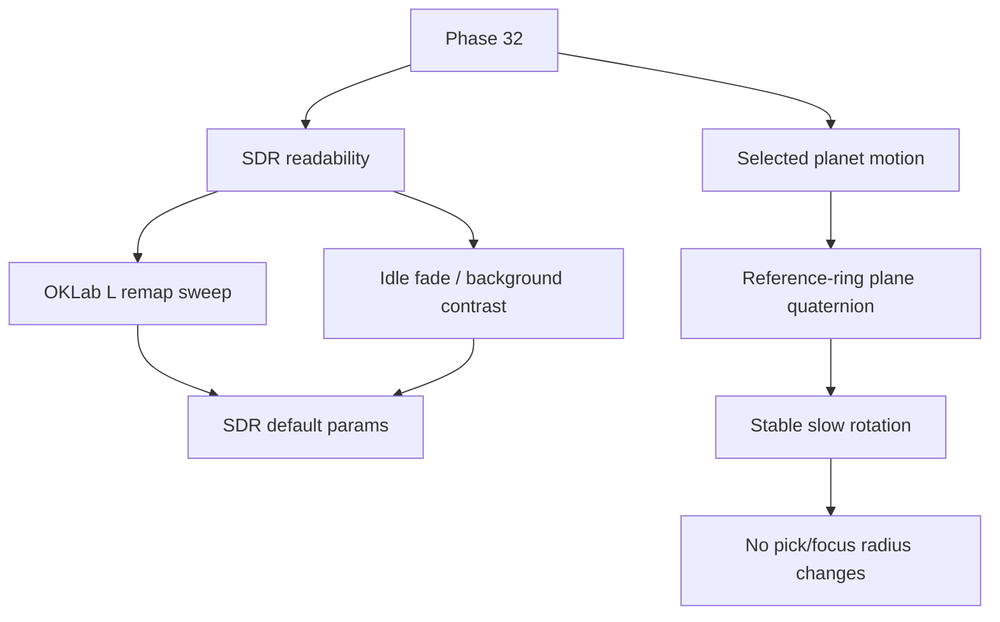

# Phase 32 — SDR 可读性与选中动效

## 目标

Phase 32 改善两个用户能直接感知的问题，但严格留在 SDR 主路径内：

- **主场景 SDR 可读性**：解决普通显示器上星系偏暗、层次不够清楚的问题。
- **选中星球生命感**：给 focus 选中星球增加稳定、缓慢、低干扰的自转。

本阶段不把 SDR 提亮伪装成 HDR，也不默认开启 Bloom。HDR production 仍由 Phase 33 根据 Phase 29 结论单独处理。

## 范围边界

### 本 Phase 要做

- 建立当前 SDR 视觉基线和 A/B 对比矩阵。
- 调整星系 OKLab lightness 映射和 idle fade 参数。
- 保持 WebGL2 + `renderer.outputColorSpace = THREE.SRGBColorSpace` 主路径稳定。
- 为选中 Perlin 星球增加缓慢自转。
- 复用 size reference plane 的稳定方向，保证自转轴与参考环视觉逻辑一致。
- 输出最终 SDR 参数和验证记录。

### 本 Phase 不做

- 不实现 HDR 输出链路。
- 不默认开启 Bloom 或 composer render path。
- 不改 UMAP、Z 轴、数据 pipeline 或 `galaxy_data.json`。
- 不改变 hover/click 拾取半径。
- 不改变 focus fly-to 时长、相机轴约束或 Drawer 行为。
- 不引入新的后处理依赖。

## 关键现状

- SDR 星系亮度参数在 [frontend/src/three/galaxyMeshes.ts](frontend/src/three/galaxyMeshes.ts)：`uLMin=0.2`、`uLMax=1.0`、`uHighRatingT=0.85`、`uHighTierTRangeScale=0.4`、`uLightnessRatingExponent=3.0`、`uDistanceLightnessFloor=0.5`。
- Idle near fade 默认在 [frontend/src/three/idleNearFade.ts](frontend/src/three/idleNearFade.ts)：`enabled=1`、`startDist=20`、`width=10`、`minAlpha=0.05`。
- Idle Z fade 默认在 [frontend/src/three/idleZFade.ts](frontend/src/three/idleZFade.ts)：`mode=-1`、`outsideAlpha=0.5`。
- Galaxy shader 在 [frontend/src/three/shaders/galaxyIdle.vert.glsl](frontend/src/three/shaders/galaxyIdle.vert.glsl) 与 [frontend/src/three/shaders/galaxyActive.vert.glsl](frontend/src/three/shaders/galaxyActive.vert.glsl) 中使用 OKLab L remap。
- 选中星球由 [frontend/src/three/planet.ts](frontend/src/three/planet.ts) 的 `createSelectionPlanet()` 创建，当前没有独立自转契约。
- 参考环在 [frontend/src/three/FocusSizeReferenceRings.ts](frontend/src/three/FocusSizeReferenceRings.ts)，已有 `seededRingPlaneQuaternion(movieId)`，可作为每部电影稳定的参考平面方向。
- Scene 集成在 [frontend/src/three/scene.ts](frontend/src/three/scene.ts)，负责 selection planet、focus reference rings、render loop 和 debug tuning 入口。

## 工作拆分

### 32.1 文档落地与 Phase 29/33 边界确认

创建并维护计划文件：`.cursor/plans/phase_32_sdr_readability_motion.plan.md`。

确认边界：

- Phase 32 只处理 SDR 默认体验。
- Phase 29 若证明 HDR 可行，也不影响本阶段先稳定 SDR fallback。
- Phase 33 才处理 HDR active、HDR capability UI、Bloom/HDR 高光等生产链路。

### 32.2 SDR 可读性基线采集

先记录当前画面，不直接调参。

基线场景：

- 首屏 cover 后进入 macro roam。
- 时间轴不同年代段：早期稀疏区、中段密集区、近年高 vote 区。
- 搜索结果高亮状态。
- focus 进入、focus 内切换、退出 focus。
- 普通 SDR 显示器、系统 HDR 开但浏览器仍 SDR 输出的组合。

记录内容：

- 截图或短录屏。
- 当前 uniforms 日志。
- `window.__galaxyColor`、`window.__galaxyIdleNearFade`、`window.__galaxyIdleZFade` 当前值。
- 主观问题：偏黑、过曝、颜色发灰、层次丢失、密集区糊成一片。

### 32.3 OKLab lightness remap sweep

优先从星体自身 L 映射解决可读性，而不是先开 Bloom。

重点参数：

- `uLMin`：提高低评分/暗星最低可见度。
- `uLightnessRatingExponent`：降低高评分星与普通星之间过强的非线性压暗。
- `uHighTierTRangeScale`：控制高分段压缩，避免高分星全部顶白。
- `uDistanceLightnessFloor`：控制距离衰减下限，避免远处层次完全消失。

约束：

- `uLMax` 默认保持 1.0，不制造超 SDR 语义。
- 保持 OKLab hue/chroma 逻辑，不把所有类型拉成灰白。
- 每次只改一组参数，并记录效果。
- 调整后保留 `console.log`/assert 可见性，符合当前项目可验证生成规则。

### 32.4 Idle fade 与背景对比标定

在 L remap 后再标定宏观层次。

涉及模块：

- [frontend/src/three/idleNearFade.ts](frontend/src/three/idleNearFade.ts)
- [frontend/src/three/idleZFade.ts](frontend/src/three/idleZFade.ts)
- [frontend/src/three/universeBackground.ts](frontend/src/three/universeBackground.ts)
- [frontend/src/three/shaders/galaxyIdle.vert.glsl](frontend/src/three/shaders/galaxyIdle.vert.glsl)

检查点：

- idle near fade 不应让近处粒子低到不可见。
- idle Z fade 不应让时间窗外信息完全消失。
- 背景亮度不应压低星体对比，也不应变成灰雾。
- focus session 下 `uIdleMacroFadesActive=0` 的行为保持不变。

### 32.5 SDR runtime tuning 入口整理

保留调试入口，但把可发布参数固化到 defaults。

要求：

- 确认 `window.__galaxyColor` 可调整并打印当前 L/chroma/Hunt 参数。
- 确认 `window.__galaxyIdleNearFade` 与 `window.__galaxyIdleZFade` 可用于 A/B。
- 最终默认值写入源码常量或 uniform defaults，不依赖手动 console patch 才可用。
- 在计划或实施报告中记录最终参数和放弃的候选值。

### 32.6 选中星球自转轴定义

为选中星球定义稳定自转轴。

建议方案：

- 从 [frontend/src/three/FocusSizeReferenceRings.ts](frontend/src/three/FocusSizeReferenceRings.ts) 复用或导出 `seededRingPlaneQuaternion(movieId)`。
- 由该 quaternion 推导参考平面法线，作为 planet visual mesh 的自转轴。
- 每部电影自转轴稳定，不随 session 随机改变。
- 自转轴与 size reference rings 的视觉平面一致，避免 ring 与 planet 动效互相冲突。

约束：

- 自转只影响 selected planet visual mesh。
- 不改变 selection pick radius、focus neighbor radius 或 raycast 逻辑。
- 不改变相机轴始终平行 Z 的约束。

### 32.7 选中星球自转 runtime 接入

把自转接入 render loop。

要求：

- 进入 focus 时记录基准 rotation/quaternion。
- 切换选中电影时重置基准，避免累计漂移。
- focus 内换片时自转连续但不继承上一部电影错误轴向。
- 自转速度低，避免抢走阅读 Drawer 和观察星系的注意力。
- Cover today、普通 movie focus、focus 内 neighbor 切换都稳定。
- 如果 selection planet opacity 为 0 或未选中，不做无意义更新。

### 32.8 验证与验收

建议命令：

- `npm run lint -w frontend`
- `npm run build -w frontend`
- 如新增纯函数或参数测试：`npm run test -w frontend -- <新增测试路径>`
- 必要时运行前端 preview 进行视觉手测。

视觉验收矩阵：

- Macro roam：稀疏区、密集区、近年高 vote 区。
- Search：movie/person/genre selection mask 下的星体可读性。
- Focus：进入、退出、邻居切换、Drawer 打开时的 planet 自转。
- Cover today：cover 到 focus 的 planet/参考环方向稳定。
- 设备：普通 SDR 显示器、系统 HDR 开但 SDR 输出、不同浏览器缩放比例。

## 验收标准

Phase 32 完成时应满足：

- 主场景 SDR 下不再明显偏黑，低亮星仍可见，高亮星不过曝成白片。
- 宏观 idle fade 保持时间深度层次，但不牺牲基础可读性。
- 背景与星体对比稳定，默认仍不依赖 Bloom。
- 选中星球缓慢自转，轴向与 size reference plane 视觉一致。
- 切换电影、cover today、focus neighbor 切换不会出现 rotation 累积漂移。
- 自转不改变拾取半径、focus 半径、相机约束或 Drawer 行为。
- lint/build 通过，最终 SDR 参数有记录。

## Phase 32 交付物

- `.cursor/plans/phase_32_sdr_readability_motion.plan.md`
- SDR 可读性基线记录。
- OKLab L remap 与 idle fade 默认参数更新。
- SDR runtime tuning 入口确认。
- 选中星球稳定自转。
- 视觉验收矩阵结果。
- 参数结论与剩余风险记录。