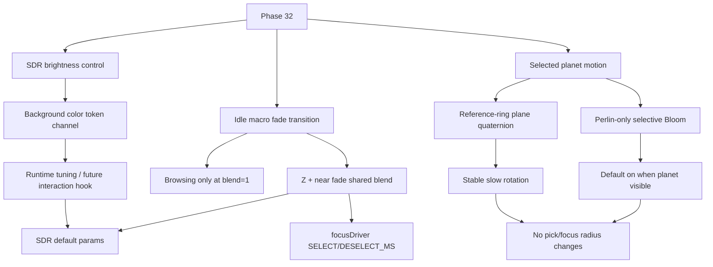

# Phase 32 — SDR 亮度可控性与选中动效

## 目标

Phase 32 改善三个用户能直接感知的问题，但严格留在 SDR 主路径内：

- **主应用总体亮度可控性**：解决部分屏幕上主场景显得太黑、背景与星体层次不清的问题；优先开放宇宙背景色 token 的运行时修改通道，而不是默认引入 HDR/全局 Bloom。
- **浏览态宏观虚化过渡**：idleZFade 与 idleNearFade 共用同一套 browsing/focus 渐变；宏观虚化仅在 browsing 全强度生效，browsing/focus 切换时接入既有 `focusDriver`（`transitionDriver.ts`）过渡，避免二元 `uIdleMacroFadesActive` 造成的亮度瞬跳。
- **选中星球生命感**：给 focus 选中星球增加稳定、缓慢、低干扰的自转，并为 Perlin 单体星球默认开启 selective Bloom，增强 focus 态的发光质感。

本阶段不把 SDR 提亮伪装成 HDR，也不默认开启全局 Bloom。Perlin Bloom 仅作为 `planet.mesh` 的 selective focus polish 默认启用，不让 `galaxy.idle` / `galaxy.active` 进入 Bloom。HDR production 仍由 Phase 33 根据 Phase 29 结论单独处理。

## Phase 29 / Phase 33 边界确认（32.1 锁定）

**SSOT**：[`docs/reports/Phase 29.7 P29.7 Phase 29 Gate report 实施报告.md`](../docs/reports/Phase%2029.7%20P29.7%20Phase%2029%20Gate%20report%20实施报告.md) · [`docs/project_docs/Phase 29 发布门槛与技术判定 spec.md`](../docs/project_docs/Phase%2029%20发布门槛与技术判定%20spec.md) §4–§10。

| 决策 | 结论 | 对 Phase 32 的含义 |
| :--- | :--- | :--- |
| **Phase 32 SDR 可读性** | **Go（并行）** | 与 HDR gate **解耦**；**不依赖** Phase 33 完成或 go |
| **Phase 33 HDR production（33.5 主路径）** | **No-go** | P0/P1 无 `supported`；D1 proof 未通过 → **不得**用本阶段 L remap / Bloom 冒充 HDR |
| **Phase 33（收窄路径）** | **Go（条件）** | 仅 probe / proof / `renderMode` / SDR fallback 文档化；**33.5 冻结** |
| **当前生产渲染** | **不变** | `WebGL2` + `SDR_FALLBACK_OUTPUT_COLOR_SPACE`（`THREE.SRGBColorSpace`）；`postFxBloomEnabled === false` |

### Phase 32 独占 vs 移交 Phase 33

| 主题 | Phase 32（本阶段） | Phase 33（条件阶段） |
| :--- | :--- | :--- |
| OKLab **L** remap、`uLMin`、`uLightnessRatingExponent`、`uDistanceLightnessFloor` | ✅ 调参并固化 SDR 默认 | ❌ 不得覆盖 32 标定后的 SDR fallback |
| Idle near / Z fade、背景对比 | ✅ | ❌ |
| `window.__galaxyColor` / idle fade 调试入口 | ✅ 整理并记录最终默认 | ❌ |
| 选中星球缓慢自转 | ✅ | ❌ |
| HDR 输出、`hdr-active`、`renderMode` 切换 | ❌ | ✅（仅 29.7 允许的子项） |
| Bloom 作为默认或 HDR 替代 | ❌ **禁止** | ❌ SDR 默认仍关；仅 `hdr-active` 实验路径（若将来解冻 33.5） |
| `window.__hdrCapabilities` / `__hdrProbe` | ❌ 不改动契约 | ✅ 产品化 / lab |
| WebGPU extended 主场景接入 | ❌ | ❌ **冻结**（见 29.7 backlog `phase_33b_webgpu_hdr_spike`） |

### 不变量（29.4 SDR fallback，32.x 不得破坏）

- 生产 RAF 默认 **`renderer.render(scene, camera)`**，不依赖 `composer.render()`。
- `hdr-capable` 探测结果 **不** 切换星系 renderer 或 `outputColorSpace`。
- Focus 会话下 **`uIdleMacroFadesActive = 0`** 行为保持不变。
- **不得** 改变 hover/click 拾取半径、focus 半径、相机 Z 轴约束、Drawer / 路由行为。

**32.1 结论**：即使 Phase 29 日后在实验环境证明 HDR 可行，Phase 32 仍先交付 **SDR 主路径可读性与选中动效**；Phase 33 仅在独立 spike 通过后再考虑 `hdr-active`，且不得回退本阶段 SDR 默认标定。



## 范围边界

### 本 Phase 要做

- 偏暗与 browsing/focus 透明度跳变视为已确认问题，不再单独安排基线采集任务。
- 开放宇宙背景色 token 的开发期手调通道，并保留未来按交互行为驱动背景色变化的扩展边界。
- 优化 idleZFade + idleNearFade 宏观虚化规则与过渡：browsing 全强度、focus 归零，browsing/focus 切换时经 `focusDriver` 共享渐变 multiplier。
- 保持 WebGL2 + `renderer.outputColorSpace = THREE.SRGBColorSpace` 主路径稳定。
- 为选中 Perlin 星球增加缓慢自转。
- 为 `planet.mesh` 接入 perlin-only selective Bloom，默认开启但仅在选中星球可见期间参与合成。
- 复用 size reference plane 的稳定方向，保证自转轴与参考环视觉逻辑一致。
- 输出最终背景色 token、idle 宏观虚化（Z + near）参数、macro-fade blend 过渡策略、Perlin Bloom 参数和验证记录。

### 本 Phase 不做

- 不实现 HDR 输出链路。
- 不默认开启全局 Bloom，不让 `galaxy.idle` / `galaxy.active` 进入 Bloom。
- 不用 Bloom 解决主应用偏暗问题；主应用亮度仍由背景色 token 与 idle 宏观虚化（Z + near）负责。
- 不改 UMAP、Z 轴、数据 pipeline 或 `galaxy_data.json`。
- 不改变 hover/click 拾取半径。
- 不改变 focus fly-to 时长、相机轴约束或 Drawer 行为。
- 不引入新的后处理依赖。

## 关键现状

- 宇宙背景在 [frontend/src/three/universeBackground.ts](frontend/src/three/universeBackground.ts)，当前需要补齐可被开发期 runtime 调参调用的背景色 token 通道。
- Idle Z fade 默认在 [frontend/src/three/idleZFade.ts](frontend/src/three/idleZFade.ts)：`mode=-1`、`outsideAlpha=0.5`。
- Idle near fade 默认在 [frontend/src/three/idleNearFade.ts](frontend/src/three/idleNearFade.ts)：`enabled=1`、`startDist=20`、`width=10`、`minAlpha=0.05`。
- 二者均在 `galaxyIdle.vert.glsl` 的 `uIdleMacroFadesActive` 门控下运行；当前为 **0/1 硬切**（`scene.ts`：`selectionPhase === 'idle' ? 1 : 0`），切换 selecting/deselecting 时会与 `uFocusCameraBlend` 不同步，造成亮度瞬跳——本阶段改为 **共享 blend multiplier** 并接入既有过渡。
- 状态切换过渡 SSOT：[frontend/src/three/transitionDriver.ts](frontend/src/three/transitionDriver.ts) 的 `createTransitionDriver()`；[frontend/src/three/scene.ts](frontend/src/three/scene.ts) 中 `focusDriver` 已在 `selecting`/`deselecting` 驱动相机、`uFocusCameraBlend`、`uFocusActiveDimBlend` 与 `zCurrent` 插值（`SELECT_MS=700`、`DESELECT_MS=450`）。
- SDR 星系亮度参数在 [frontend/src/three/galaxyMeshes.ts](frontend/src/three/galaxyMeshes.ts)：`uLMin=0.2`、`uLMax=1.0`、`uHighRatingT=0.85`、`uHighTierTRangeScale=0.4`、`uLightnessRatingExponent=3.0`、`uDistanceLightnessFloor=0.5`；本阶段不优先重做 rating→OKLab L 映射，只有背景色与 idle 宏观虚化修正后仍无法达标时才小范围兜底调整。
- Galaxy shader 在 [frontend/src/three/shaders/galaxyIdle.vert.glsl](frontend/src/three/shaders/galaxyIdle.vert.glsl) 与 [frontend/src/three/shaders/galaxyActive.vert.glsl](frontend/src/three/shaders/galaxyActive.vert.glsl) 中使用 OKLab L remap。
- 选中星球由 [frontend/src/three/planet.ts](frontend/src/three/planet.ts) 的 `createSelectionPlanet()` 创建，当前没有独立自转契约。
- 当前 Bloom 收尾态在 [frontend/src/three/scene.ts](frontend/src/three/scene.ts)：`UnrealBloomPass` 与 `window.__bloom` 保留，但全局 Bloom 默认关闭；Phase 10.3 的失败点主要来自 idle/active 小星体、透明混合和全场景后处理，本阶段只允许 `planet.mesh` 进入 selective Bloom。
- 参考环在 [frontend/src/three/FocusSizeReferenceRings.ts](frontend/src/three/FocusSizeReferenceRings.ts)，已有 `seededRingPlaneQuaternion(movieId)`，可作为每部电影稳定的参考平面方向。
- Scene 集成在 [frontend/src/three/scene.ts](frontend/src/three/scene.ts)，负责 selection planet、focus reference rings、render loop 和 debug tuning 入口；生产使用 `SDR_FALLBACK_OUTPUT_COLOR_SPACE`，Bloom 经 `postFxBloomEnabled` 默认关。
- Phase 29 已落地：`frontend/src/lib/hdrCapabilities.ts`、`hdrProof.ts`、`sdrFallback.ts`（本阶段只读引用，不改 HDR 契约）。

## 工作拆分

### 32.1 文档落地与 Phase 29/33 边界确认

创建并维护计划文件：`.cursor/plans/phase_32_sdr_readability_motion.plan.md`。

**交付（32.1）**：

- 计划文件存在且与仓库现状、Phase 29 spec / 29.7 gate、Phase 33 plan 对齐。
- 上文 **「Phase 29 / Phase 33 边界确认（32.1 锁定）」** 表为后续 32.2–32.8 的前置约束；32.3+ 调参不得违反该表「不变量」列。

**边界摘要**（详表见上文锁定节）：

- Phase 32 只处理 **SDR 默认体验**（含选中星球自转）；与 29.7 **Go（并行）** 一致。
- Phase 29 已判定 **No-go Phase 33 HDR production**；本阶段 **不等待** 33.5，也不把 L remap / Bloom 当作 HDR。
- Phase 33（收窄）负责 probe / proof / `renderMode` / fallback 说明；**不得** 在本阶段覆盖 `galaxyMeshes` / idle fade 的 SDR 标定意图。

### 32.2 宇宙背景色 token 修改通道

优先从主应用整体背景亮度入手，开放可调背景色 token，而不是直接重做星体 rating→OKLab L 映射。

目标：

- 将宇宙背景色整理为明确 token，而不是散落在渲染初始化或背景材质内部的硬编码值。
- 暴露开发期 runtime 修改通道，支持在浏览器 console 中手动调整并立即看到效果。
- 修改通道应能覆盖 renderer clear color、scene background、宇宙背景材质中实际参与视觉输出的背景色来源。
- 保留未来扩展点：后续可以根据用户交互行为、浏览/focus 状态或时间段动态改变背景色。

约束：

- 默认仍走 SDR 主路径，不引入 HDR/Bloom 作为“提亮”手段。
- 背景 token 调整不得改变数据坐标、粒子大小、拾取半径或相机行为。
- token 修改后需要打印当前值，方便截图、复现和回滚。
- 如果背景色动态变化，需要明确状态来源和优先级，避免多个入口互相覆盖。

### 32.3 idle 宏观虚化（idleZFade + idleNearFade）与 browsing/focus 渐变

将 **idleZFade** 与 **idleNearFade** 纳入同一套宏观虚化渐变，并接入 scene 已有的 **focus 状态切换过渡**（`focusDriver`），替换当前 `uIdleMacroFadesActive` 的 0/1 硬切。

#### 规则

- **browsing 全强度**（`selectionPhase === 'idle'` 且 blend = 1）：Z 向虚化与近距虚化按各自 uniform 规则生效，保留宏观时间深度与近距层次。
- **focus 归零**（`selected` 且 blend = 0）：两类虚化目标强度均为 0，不继续压暗 focus 内星体与选中星球周边。
- **browsing → focus**（`selecting`）：blend 随 `focusDriver.progress` 从 1 → 0（与 `uFocusCameraBlend` 同向递增的 progress 取 **反相**：`1 - progress`），Z fade 与 near fade 同步退场。
- **focus → browsing**（`deselecting`）：blend 随 `focusDriver.progress` 从 0 → 1（`progress` 直接驱动），同步恢复。
- **focus 内换星**（`selectingEnteredFromMacro === false`）：宏观虚化保持关闭（blend = 0），不因 neighbor 切换重新打开 Z/near fade。

#### 实现要求

- **共享 multiplier**：将 `uIdleMacroFadesActive`（bool 门）演进为 **float blend**（建议 `uIdleMacroFadesBlend`，范围 0…1）；shader 内 P26.3 near 与 P27.4 Z 两段均在 `blend > 0` 时生效，并将各自 alpha 乘子按 blend 向 1 插值（blend=0 时两段均不压暗）。
- **接入既有过渡**：不新建平行时长常量；`selecting` 复用 `focusDriver.start(SELECT_MS)` 的 tick/progress，`deselecting` 复用 `focusDriver.reverse(DESELECT_MS)`。macro-fade blend 与 `uFocusCameraBlend` / `uFocusActiveDimBlend` 同一帧更新。
- **CPU 拾取对齐**：[frontend/src/three/screenRadius.ts](frontend/src/three/screenRadius.ts) 的 idle near/Z pick gate 使用同一 blend（`interaction.ts` 传入），避免 GPU 已渐变而拾取仍按硬切跳过/命中。
- **idle 材质透明路径**：`idleMat.transparent` 在 **near 或 Z 配置启用** 且 **blend > 0**（或过渡中）时保持 transparent；blend 完全为 0 且不在 `selecting`/`deselecting` 时可恢复 opaque，避免 focus 静止态仍走透明混合。
- **不把状态机写进 shader**：shader 只读 blend uniform；`selectionPhase` 与 `focusDriver` 留在 `scene.ts`。
- **快速连续切换**：`focusDriver.reverse()` 已从当前 `progress` 起算（见 `transitionDriver.ts`）；macro-fade blend 须同样从当前值接续，禁止每次 `start` 重置为 0 导致闪烁。
- **不改**：hover/click 半径、focus 邻居半径、相机轴约束、fly-to 时长常量本身。

#### 涉及文件（实施时）

| 文件                                 | 变更                                                                                       |
| ------------------------------------ | ------------------------------------------------------------------------------------------ |
| `galaxyMeshes.ts`                    | 注册 `uIdleMacroFadesBlend`（或重命名并迁移 `uIdleMacroFadesActive`）                      |
| `galaxyIdle.vert.glsl`               | near + Z 段乘以 blend；blend≈0 时跳过                                                      |
| `scene.ts`                           | RAF 中由 `focusDriver.progress` 写 blend；`selecting`/`deselecting`/`idle`/`selected` 分支 |
| `screenRadius.ts` / `interaction.ts` | pick gate 使用 blend                                                                       |
| `idleZFade.ts` / `idleNearFade.ts`   | 可选：导出 `applyMacroFadeBlend(alpha, blend)` 供 CPU 镜像                                 |

### 32.4 SDR runtime tuning 入口整理

保留调试入口，但把可发布参数固化到 defaults。

要求：

- 确认背景色 token runtime 通道可调整并打印当前 token 值。
- 确认 `window.__galaxyIdleZFade` 与 `window.__galaxyIdleNearFade` 可分别调 Z/near 规则，且 browsing/focus 切换时可观察 **共享 macro-fade blend** 进退场（与 `focusDriver` 同步）。
- `window.__galaxyColor` 保留为辅助入口，但不再作为本轮“太暗”问题的主路径。
- 最终默认值写入源码常量或 token defaults，不依赖手动 console patch 才可用。
- 在计划或实施报告中记录最终背景色 token、idleZFade / idleNearFade 参数、macro-fade blend 与 `SELECT_MS`/`DESELECT_MS` 对齐方式及放弃的候选值。

#### 32.4 实施备忘（shipped defaults + console）

| 通道           | SSOT                                                 | 发布默认                                                        | Dev 入口                                             |
| -------------- | ---------------------------------------------------- | --------------------------------------------------------------- | ---------------------------------------------------- |
| 宇宙背景       | `universeBackground.ts` `COSMOS_UNIVERSE_BG_DEFAULT` | `#000002`                                                       | `__galaxyUniverseBg`（`.color` / `.reset` / `.log`） |
| idle 近距      | `idleNearFade.ts` `IDLE_NEAR_FADE_DEFAULTS`          | enabled=1, start=20, width=10, minA=0.1                         | `__galaxyIdleNearFade` + `.reset()`                  |
| idle Z         | `idleZFade.ts` `IDLE_Z_FADE_DEFAULTS`                | mode=-1, outsideA=0.5                                           | `__galaxyIdleZFade` + `.reset()`                     |
| 宏观虚化 blend | `scene.ts` + `focusDriver`                           | browsing=1, focus=0, 过渡 `FOCUS_SELECT_MS`/`FOCUS_DESELECT_MS` | `__galaxyIdleMacroFade`（只读 blend/phase/progress） |
| 汇总           | `sdrRuntimeTuning.ts` `SDR_RUNTIME_DEFAULTS`         | 上表聚合                                                        | `__sdrTuning.log()` / `__sdrTuning.resetAll()`       |

**Console 示例：**

```js
__sdrTuning.log()              // 一行汇总 + 分项 log
__sdrTuning.resetAll()         // 背景 + near + Z 恢复 SSOT（blend 随 focus 状态变化）
__galaxyIdleMacroFade.blend    // browsing→focus 时 1→0，与相机同帧
__galaxyColor.log()            // 辅助 OKLCH，非 SDR 提亮主路径
```

**放弃候选：** 纯黑背景 `#000000`（32.2 验收后改为 `#000002`）；`minAlpha=0.05`（32.3 验收后改为 `0.1`）；启动时自动 `__galaxyColor.log()`（32.4 改为仅 `__sdrTuning.log()`）。

### 32.5 选中星球自转轴定义

为选中星球定义稳定自转轴。

建议方案：

- 从 [frontend/src/three/FocusSizeReferenceRings.ts](frontend/src/three/FocusSizeReferenceRings.ts) 复用或导出 `seededRingPlaneQuaternion(movieId)`。
- 由该 quaternion 推导参考平面法线，作为 planet visual mesh 的自转轴。
- 每部电影自转轴稳定，不随 session 随机改变。
- 自转轴与 size reference rings 的视觉平面一致，避免 ring 与 planet 动效互相冲突。

约束：

- 自转只影响 selected planet visual mesh。
- 不改变 selection pick radius、focus neighbor radius 或 raycast 逻辑。
- 不改变相机轴始终平行 Z 的约束。

### 32.6 选中星球自转 runtime 接入

把自转接入 render loop。

要求：

- 进入 focus 时记录基准 rotation/quaternion。
- 切换选中电影时重置基准，避免累计漂移。
- focus 内换片时自转连续但不继承上一部电影错误轴向。
- 自转速度低，避免抢走阅读 Drawer 和观察星系的注意力。
- Cover today、普通 movie focus、focus 内 neighbor 切换都稳定。
- 如果 selection planet opacity 为 0 或未选中，不做无意义更新。

### 32.7 Perlin 选中星球 selective Bloom

为选中 Perlin 单体星球接入 selective Bloom，作为 focus 态视觉增强。该能力默认开启，但只作用于 `planet.mesh`，不恢复 Phase 10 的全局 Bloom 默认路径。

规则：

- `planet.mesh`：允许进入 Bloom，默认开启。
- `galaxy.idle`：不进入 Bloom。
- `galaxy.active`：不进入 Bloom。
- browsing 态、选中星球不可见或 opacity 为 0 时，不应为了 Bloom 长期切换到 composer render path。
- focus / selecting / selected 中选中星球可见时，才启用 perlin-only Bloom 合成。

要求：

- 暴露独立 runtime debug 入口，例如 `window.__perlinBloom`，避免复用 `window.__bloom.enable()` 的全局语义。
- 支持调整 `enabled`、`strength`、`radius`、`threshold`，并打印当前值。
- Bloom 默认值应偏克制，增强星球边缘和高光质感，不制造大面积雾化光晕。
- 不改变选中星球世界半径、拾取半径、focus neighbor 半径、相机约束或 Drawer 行为。
- 快速切换电影、cover today 进入 focus、focus 内 neighbor 切换时，Bloom 不应残留到上一部电影或空场景。
- 若验证发现设备性能或观感不稳定，允许保留 perlin-only 管线，但将默认值回退为关闭；该回退不得影响主线亮度与自转任务。

### 32.8 验证与验收

不再单独执行问题基线采集；偏暗与 browsing/focus 透明度跳变视为已确认问题。验收阶段只记录最终参数、前后对比截图/短录屏和剩余风险。

建议命令：

- `npm run lint -w frontend`
- `npm run build -w frontend`
- 如新增纯函数或参数测试：`npm run test -w frontend -- <新增测试路径>`
- 必要时运行前端 preview 进行视觉手测。

视觉验收矩阵：

- Macro roam：稀疏区、密集区、近年高 vote 区，重点观察背景是否仍吞掉低亮星体。
- Background token：开发期手动修改背景色后，renderer clear color、scene background、宇宙背景材质输出保持一致。
- State transition：browsing → focus、focus → browsing、快速连续切换，idleZFade **与** idleNearFade 随共享 blend 同步渐变，无亮度瞬跳或闪烁。
- Search：movie/person/genre selection mask 下的星体可读性。
- Focus：进入、退出、邻居切换、Drawer 打开时的 planet 自转与 perlin-only Bloom 表现。
- Perlin Bloom：默认开启时只有 `planet.mesh` 发光；`galaxy.idle` / `galaxy.active` 不出现全局 Bloom、糊化或背景噪声。
- Cover today：cover 到 focus 的 planet/参考环方向稳定，perlin Bloom 不残留到空场景或上一部电影。
- 设备：普通 SDR 显示器、系统 HDR 开但 SDR 输出、不同浏览器缩放比例。

## 验收标准

Phase 32 完成时应满足：

- 主应用 SDR 下不再明显偏黑，背景不吞掉低亮星体，默认仍不依赖全局 Bloom。
- 宇宙背景色有明确 token 和 runtime 修改通道，开发期可手调、可打印、可复现，并为后续交互驱动背景色变化保留边界。
- idleZFade 与 idleNearFade 仅在 browsing 全强度（blend=1）生效；focus 静止态 blend=0，不压暗 focus 视觉信息。
- browsing/focus 切换时两类虚化经 `focusDriver` 共享 blend 渐变（`SELECT_MS`/`DESELECT_MS`），无明显亮度瞬跳或闪烁；GPU 与 CPU pick gate 一致。
- near fade 与 OKLab L remap 不再作为本轮提亮主路径；如有兜底调整，必须记录原因和参数。
- 选中星球缓慢自转，轴向与 size reference plane 视觉一致。
- Perlin 选中星球 selective Bloom 默认开启，但只作用于 `planet.mesh`，不让 idle/active 主星系进入 Bloom。
- perlin Bloom 有独立 runtime debug 入口，可开关、可调参、可打印当前值。
- 切换电影、cover today、focus neighbor 切换不会出现 rotation 累积漂移或 Bloom 残留。
- 自转与 perlin Bloom 不改变拾取半径、focus 半径、相机约束或 Drawer 行为。
- lint/build 通过，最终背景色 token、idle 宏观虚化（Z + near）参数、macro-fade blend / `focusDriver` 过渡策略和 perlin Bloom 策略有记录。

## Phase 32 交付物

- `.cursor/plans/phase_32_sdr_readability_motion.plan.md`
- 最终参数与视觉对比记录。
- 宇宙背景色 token runtime 修改通道。
- idleZFade + idleNearFade 共享 macro-fade blend，接入 `focusDriver` browsing/focus 过渡。
- SDR runtime tuning 入口确认。
- 选中星球稳定自转。
- Perlin 选中星球 selective Bloom 默认开启路径。
- `window.__perlinBloom` runtime debug 入口。
- 视觉验收矩阵结果。
- 背景色 token、idle 宏观虚化（Z + near）参数、macro-fade blend 过渡策略、perlin Bloom 策略与剩余风险记录。