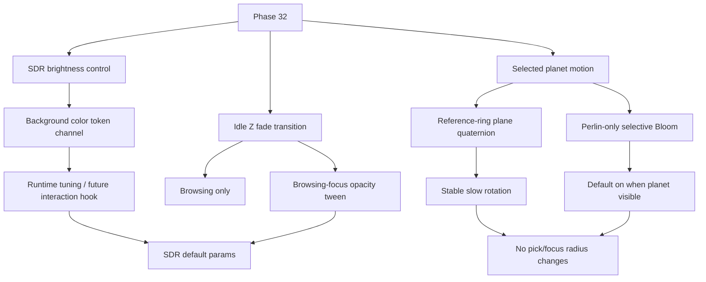

# Phase 32 — SDR 亮度可控性与选中动效

## 目标

Phase 32 改善三个用户能直接感知的问题，但严格留在 SDR 主路径内：

- **主应用总体亮度可控性**：解决部分屏幕上主场景显得太黑、背景与星体层次不清的问题；优先开放宇宙背景色 token 的运行时修改通道，而不是默认引入 HDR/全局 Bloom。
- **浏览态 Z 向虚化过渡**：优化 idleZFade 的启用边界与表现；虚化仅在 browsing 态生效，browsing/focus 态切换时通过透明度渐变衔接，避免状态切换瞬间跳变。
- **选中星球生命感**：给 focus 选中星球增加稳定、缓慢、低干扰的自转，并为 Perlin 单体星球默认开启 selective Bloom，增强 focus 态的发光质感。

本阶段不把 SDR 提亮伪装成 HDR，也不默认开启全局 Bloom。Perlin Bloom 仅作为 `planet.mesh` 的 selective focus polish 默认启用，不让 `galaxy.idle` / `galaxy.active` 进入 Bloom。HDR production 仍由 Phase 33 根据 Phase 29 结论单独处理。

## 范围边界

### 本 Phase 要做

- 偏暗与 browsing/focus 透明度跳变视为已确认问题，不再单独安排基线采集任务。
- 开放宇宙背景色 token 的开发期手调通道，并保留未来按交互行为驱动背景色变化的扩展边界。
- 优化 idleZFade 虚化规则和过渡效果：仅 browsing 态启用，browsing/focus 态切换时透明度渐变。
- 保持 WebGL2 + `renderer.outputColorSpace = THREE.SRGBColorSpace` 主路径稳定。
- 为选中 Perlin 星球增加缓慢自转。
- 为 `planet.mesh` 接入 perlin-only selective Bloom，默认开启但仅在选中星球可见期间参与合成。
- 复用 size reference plane 的稳定方向，保证自转轴与参考环视觉逻辑一致。
- 输出最终背景色 token、idleZFade 参数、Perlin Bloom 参数、过渡策略和验证记录。

### 本 Phase 不做

- 不实现 HDR 输出链路。
- 不默认开启全局 Bloom，不让 `galaxy.idle` / `galaxy.active` 进入 Bloom。
- 不用 Bloom 解决主应用偏暗问题；主应用亮度仍由背景色 token 与 idleZFade 负责。
- 不改 UMAP、Z 轴、数据 pipeline 或 `galaxy_data.json`。
- 不改变 hover/click 拾取半径。
- 不改变 focus fly-to 时长、相机轴约束或 Drawer 行为。
- 不引入新的后处理依赖。

## 关键现状

- 宇宙背景在 [frontend/src/three/universeBackground.ts](frontend/src/three/universeBackground.ts)，当前需要补齐可被开发期 runtime 调参调用的背景色 token 通道。
- Idle Z fade 默认在 [frontend/src/three/idleZFade.ts](frontend/src/three/idleZFade.ts)：`mode=-1`、`outsideAlpha=0.5`；规则已限定仅 browsing 态启用，本阶段重点验证边界并补齐 browsing/focus 切换时的透明度渐变。
- Idle near fade 默认在 [frontend/src/three/idleNearFade.ts](frontend/src/three/idleNearFade.ts)：`enabled=1`、`startDist=20`、`width=10`、`minAlpha=0.05`；本阶段不把 near fade 作为主要提亮路径，只在与 idleZFade 叠加导致过暗时做必要校准。
- SDR 星系亮度参数在 [frontend/src/three/galaxyMeshes.ts](frontend/src/three/galaxyMeshes.ts)：`uLMin=0.2`、`uLMax=1.0`、`uHighRatingT=0.85`、`uHighTierTRangeScale=0.4`、`uLightnessRatingExponent=3.0`、`uDistanceLightnessFloor=0.5`；本阶段不优先重做 rating→OKLab L 映射，只有背景色与 idleZFade 修正后仍无法达标时才小范围兜底调整。
- Galaxy shader 在 [frontend/src/three/shaders/galaxyIdle.vert.glsl](frontend/src/three/shaders/galaxyIdle.vert.glsl) 与 [frontend/src/three/shaders/galaxyActive.vert.glsl](frontend/src/three/shaders/galaxyActive.vert.glsl) 中使用 OKLab L remap。
- 选中星球由 [frontend/src/three/planet.ts](frontend/src/three/planet.ts) 的 `createSelectionPlanet()` 创建，当前没有独立自转契约。
- 当前 Bloom 收尾态在 [frontend/src/three/scene.ts](frontend/src/three/scene.ts)：`UnrealBloomPass` 与 `window.__bloom` 保留，但全局 Bloom 默认关闭；Phase 10.3 的失败点主要来自 idle/active 小星体、透明混合和全场景后处理，本阶段只允许 `planet.mesh` 进入 selective Bloom。
- 参考环在 [frontend/src/three/FocusSizeReferenceRings.ts](frontend/src/three/FocusSizeReferenceRings.ts)，已有 `seededRingPlaneQuaternion(movieId)`，可作为每部电影稳定的参考平面方向。
- Scene 集成在 [frontend/src/three/scene.ts](frontend/src/three/scene.ts)，负责 selection planet、focus reference rings、render loop 和 debug tuning 入口。

## 工作拆分

### 32.1 文档落地与 Phase 29/33 边界确认

创建并维护计划文件：`.cursor/plans/phase_32_sdr_readability_motion.plan.md`。

确认边界：

- Phase 32 只处理 SDR 默认体验。
- Phase 29 若证明 HDR 可行，也不影响本阶段先稳定 SDR fallback。
- Phase 33 才处理 HDR active、HDR capability UI、Bloom/HDR 高光等生产链路。

### 32.2 宇宙背景色 token 修改通道

优先从主应用整体背景亮度入手，开放可调背景色 token，而不是直接重做星体 rating→OKLab L 映射。

目标：

- 将宇宙背景色整理为明确 token，而不是散落在渲染初始化或背景材质内部的硬编码值。
- 暴露开发期 runtime 修改通道，支持在浏览器 console 中手动调整并立即看到效果。
- 修改通道应能覆盖 renderer clear color、scene background、宇宙背景材质中实际参与视觉输出的背景色来源。
- 保留未来扩展点：后续可以根据用户交互行为、浏览/focus 状态或时间段动态改变背景色。

约束：

- 默认仍走 SDR 主路径，不引入 HDR/Bloom 作为“提亮”手段。
- 背景 token 调整不得改变数据坐标、粒子大小、拾取半径或相机行为。
- token 修改后需要打印当前值，方便截图、复现和回滚。
- 如果背景色动态变化，需要明确状态来源和优先级，避免多个入口互相覆盖。

### 32.3 idleZFade 虚化规则与透明度渐变

优化 idleZFade 的规则表达和实际视觉效果。本阶段确认“仅 browsing 态启用”这个现有边界，并补齐 browsing/focus 状态切换时的透明度渐变。

规则：

- browsing 态：idleZFade 按当前 Z 向虚化规则生效，用于保留宏观时间深度层次。
- focus 态：idleZFade 目标强度降为 0，不继续压暗 focus 内星体和选中星球周边信息。
- browsing → focus：idleZFade 透明度平滑退场，避免点击选中后粒子亮度瞬间跳变。
- focus → browsing：idleZFade 透明度平滑恢复，避免退出 focus 后宏观层次突然压暗。

实现要求：

- 用独立 transition progress / multiplier 表示 idleZFade 的状态切换，不把状态机写死进 shader 分支。
- transition 时长应短于 focus fly-to 的主要感知窗口，目标是“顺滑但不拖沓”。
- 切换期间只改变 idleZFade 的视觉强度，不改变 hover/click 判定、focus 半径或相机约束。
- 快速连续切换 browsing/focus 时，渐变应从当前可见强度继续过渡，而不是重置闪烁。

### 32.4 SDR runtime tuning 入口整理

保留调试入口，但把可发布参数固化到 defaults。

要求：

- 确认背景色 token runtime 通道可调整并打印当前 token 值。
- 确认 `window.__galaxyIdleZFade` 可用于调整 Z 向虚化参数，并能观察 browsing/focus 过渡强度。
- `window.__galaxyIdleNearFade` 与 `window.__galaxyColor` 保留为辅助入口，但不再作为本轮“太暗”问题的主路径。
- 最终默认值写入源码常量或 token defaults，不依赖手动 console patch 才可用。
- 在计划或实施报告中记录最终背景色 token、idleZFade 参数、transition 时长和放弃的候选值。

### 32.5 选中星球自转轴定义

为选中星球定义稳定自转轴。

建议方案：

- 从 [frontend/src/three/FocusSizeReferenceRings.ts](frontend/src/three/FocusSizeReferenceRings.ts) 复用或导出 `seededRingPlaneQuaternion(movieId)`。
- 由该 quaternion 推导参考平面法线，作为 planet visual mesh 的自转轴。
- 每部电影自转轴稳定，不随 session 随机改变。
- 自转轴与 size reference rings 的视觉平面一致，避免 ring 与 planet 动效互相冲突。

约束：

- 自转只影响 selected planet visual mesh。
- 不改变 selection pick radius、focus neighbor radius 或 raycast 逻辑。
- 不改变相机轴始终平行 Z 的约束。

### 32.6 选中星球自转 runtime 接入

把自转接入 render loop。

要求：

- 进入 focus 时记录基准 rotation/quaternion。
- 切换选中电影时重置基准，避免累计漂移。
- focus 内换片时自转连续但不继承上一部电影错误轴向。
- 自转速度低，避免抢走阅读 Drawer 和观察星系的注意力。
- Cover today、普通 movie focus、focus 内 neighbor 切换都稳定。
- 如果 selection planet opacity 为 0 或未选中，不做无意义更新。

### 32.7 Perlin 选中星球 selective Bloom

为选中 Perlin 单体星球接入 selective Bloom，作为 focus 态视觉增强。该能力默认开启，但只作用于 `planet.mesh`，不恢复 Phase 10 的全局 Bloom 默认路径。

规则：

- `planet.mesh`：允许进入 Bloom，默认开启。
- `galaxy.idle`：不进入 Bloom。
- `galaxy.active`：不进入 Bloom。
- browsing 态、选中星球不可见或 opacity 为 0 时，不应为了 Bloom 长期切换到 composer render path。
- focus / selecting / selected 中选中星球可见时，才启用 perlin-only Bloom 合成。

要求：

- 暴露独立 runtime debug 入口，例如 `window.__perlinBloom`，避免复用 `window.__bloom.enable()` 的全局语义。
- 支持调整 `enabled`、`strength`、`radius`、`threshold`，并打印当前值。
- Bloom 默认值应偏克制，增强星球边缘和高光质感，不制造大面积雾化光晕。
- 不改变选中星球世界半径、拾取半径、focus neighbor 半径、相机约束或 Drawer 行为。
- 快速切换电影、cover today 进入 focus、focus 内 neighbor 切换时，Bloom 不应残留到上一部电影或空场景。
- 若验证发现设备性能或观感不稳定，允许保留 perlin-only 管线，但将默认值回退为关闭；该回退不得影响主线亮度与自转任务。

### 32.8 验证与验收

不再单独执行问题基线采集；偏暗与 browsing/focus 透明度跳变视为已确认问题。验收阶段只记录最终参数、前后对比截图/短录屏和剩余风险。

建议命令：

- `npm run lint -w frontend`
- `npm run build -w frontend`
- 如新增纯函数或参数测试：`npm run test -w frontend -- <新增测试路径>`
- 必要时运行前端 preview 进行视觉手测。

视觉验收矩阵：

- Macro roam：稀疏区、密集区、近年高 vote 区，重点观察背景是否仍吞掉低亮星体。
- Background token：开发期手动修改背景色后，renderer clear color、scene background、宇宙背景材质输出保持一致。
- State transition：browsing → focus、focus → browsing、快速连续切换，idleZFade 透明度平滑变化且无闪烁。
- Search：movie/person/genre selection mask 下的星体可读性。
- Focus：进入、退出、邻居切换、Drawer 打开时的 planet 自转与 perlin-only Bloom 表现。
- Perlin Bloom：默认开启时只有 `planet.mesh` 发光；`galaxy.idle` / `galaxy.active` 不出现全局 Bloom、糊化或背景噪声。
- Cover today：cover 到 focus 的 planet/参考环方向稳定，perlin Bloom 不残留到空场景或上一部电影。
- 设备：普通 SDR 显示器、系统 HDR 开但 SDR 输出、不同浏览器缩放比例。

## 验收标准

Phase 32 完成时应满足：

- 主应用 SDR 下不再明显偏黑，背景不吞掉低亮星体，默认仍不依赖全局 Bloom。
- 宇宙背景色有明确 token 和 runtime 修改通道，开发期可手调、可打印、可复现，并为后续交互驱动背景色变化保留边界。
- idleZFade 仅在 browsing 态生效；focus 态不继续压暗 focus 视觉信息。
- browsing/focus 态切换时 idleZFade 透明度渐变，无明显亮度瞬跳或闪烁。
- near fade 与 OKLab L remap 不再作为本轮提亮主路径；如有兜底调整，必须记录原因和参数。
- 选中星球缓慢自转，轴向与 size reference plane 视觉一致。
- Perlin 选中星球 selective Bloom 默认开启，但只作用于 `planet.mesh`，不让 idle/active 主星系进入 Bloom。
- perlin Bloom 有独立 runtime debug 入口，可开关、可调参、可打印当前值。
- 切换电影、cover today、focus neighbor 切换不会出现 rotation 累积漂移或 Bloom 残留。
- 自转与 perlin Bloom 不改变拾取半径、focus 半径、相机约束或 Drawer 行为。
- lint/build 通过，最终背景色 token、idleZFade 参数、transition 策略和 perlin Bloom 策略有记录。

## Phase 32 交付物

- `.cursor/plans/phase_32_sdr_readability_motion.plan.md`
- 最终参数与视觉对比记录。
- 宇宙背景色 token runtime 修改通道。
- idleZFade browsing/focus 透明度渐变。
- SDR runtime tuning 入口确认。
- 选中星球稳定自转。
- Perlin 选中星球 selective Bloom 默认开启路径。
- `window.__perlinBloom` runtime debug 入口。
- 视觉验收矩阵结果。
- 背景色 token、idleZFade 参数、transition 策略、perlin Bloom 策略与剩余风险记录。