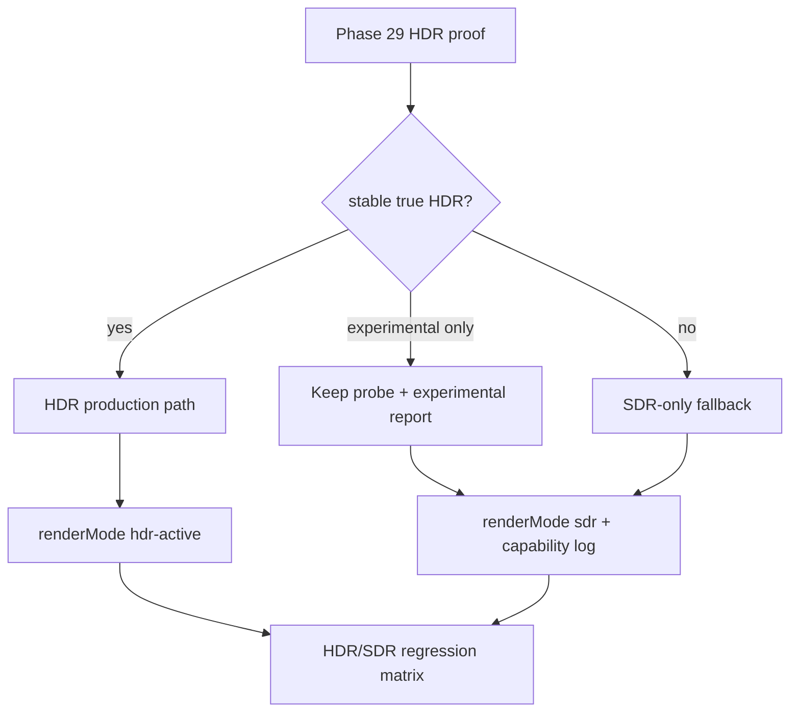

# Phase 33 — HDR 生产链路或明确降级

## 目标

Phase 33 是条件阶段，取决于 Phase 29 的 HDR proof 结论：

- 如果目标 OS / browser / display 组合能稳定产生真实扩展亮度输出，则把 proof 收敛为可控生产路径。
- 如果只能在实验 flag、不可控环境或不稳定组合中成立，则保留 capability probe 和技术记录，不作为发布门槛。
- 如果 HDR 链路不可行，则明确 SDR-only fallback，并继续使用 Phase 32 标定后的 SDR 主路径。

## 范围边界

### 本 Phase 要做

- 读取并落实 Phase 29 的 HDR support matrix 与 proof 结论。
- 建立 `renderMode`：`sdr` / `hdr-capable` / `hdr-active`。
- 将 HDR 能力探测结果暴露到 console 或 debug UI。
- 在稳定可行时接入 HDR 输出路径；不稳定时固化降级说明。
- 明确 Bloom 和 HDR 高光只在 `hdr-active` 下可用。
- 验证 HDR 关、不支持 HDR、普通 SDR 显示器下无回归。

### 本 Phase 不做

- 不把 SDR 参数调亮称为 HDR。
- 不默认开启 Bloom 来替代 HDR。
- 不重写现有 Three.js WebGL2 交互管线。
- 不改变 UMAP、Z 轴、数据 pipeline 或 HUD 路由。
- 不承诺所有浏览器都有 HDR。

## 关键现状

- 渲染入口在 [frontend/src/three/scene.ts](frontend/src/three/scene.ts)。当前 `EffectComposer` 与 `UnrealBloomPass` 已构造，但生产默认关闭。
- 当前默认 render loop 使用直接 `renderer.render(scene, camera)`，Bloom 仅通过 `window.__bloom.enable()` 调试启用。
- `renderer.outputColorSpace = THREE.SRGBColorSpace`，默认是 SDR 输出语义。
- Phase 32 已负责 SDR 可读性；Phase 33 不应覆盖 Phase 32 的 SDR fallback 参数。
- 如 Phase 29 新增 `hdrCapabilities` 模块，本阶段应以该模块为能力事实来源。

## 工作拆分

### 33.1 文档落地与 Phase 29 gate 复核

创建并维护计划文件：`.cursor/plans/phase_33_hdr_production_fallback.plan.md`。

复核 Phase 29 输出物：

- HDR support matrix。
- HDR proof 截图、测量或观测记录。
- 浏览器/OS/display 组合分类。
- `supported` / `experimental` / `fallback-sdr` / `blocked` 判定。

如果 Phase 29 没有得出稳定 supported 组合，Phase 33 不进入生产实现，只做 probe 固化和降级说明。

### 33.2 HDR decision gate

明确三条分支：

- `production`：稳定可行，进入 HDR active 实现。
- `experimental`：只在 flag 或小范围组合可行，保留调试入口，不默认对用户启用。
- `fallback-sdr`：不可行或不可验证，继续 SDR 主路径。

输出要求：

- 一张简短决策表。
- 说明是否影响发布门槛。
- 说明是否进入 Phase 34/35 的文档或监控补充。

### 33.3 `renderMode` 状态模型

建议在渲染初始化附近建立明确模式：

- `sdr`：默认路径，直接 `renderer.render(scene, camera)`。
- `hdr-capable`：检测到潜在能力，但未进入 HDR active。
- `hdr-active`：已启用可验证 HDR 输出链路。

约束：

- `renderMode` 只能来自 capability probe 与用户/环境判定，不由视觉参数猜测。
- 模式切换必须有日志：当前模式、原因、关键能力字段。
- SDR 下不得依赖 `composer.render()` 才能正常浏览。

### 33.4 HDR capability runtime 暴露

如果 Phase 29 已有 probe，本阶段负责产品化接入；否则先补最小 probe。

建议记录：

- WebGL2 是否可用。
- renderer output color space。
- Browser / OS 关键能力标识。
- 是否存在可用 HDR canvas / WebGPU proof。
- 当前 `renderMode`。
- 降级原因。

遵循状态可见性规则：在初始化时 `console.log` 关键结果，便于用户反馈和复现。

### 33.5 HDR render path 接入

仅在 Phase 29 证明稳定可行时执行。

可选路线：

- 当前 WebGL2 canvas 若可稳定输出 HDR，则在最小范围内接入。
- 如必须使用 WebGPU proof，应隔离成实验路径，不强行重写现有 WebGL2 interaction。
- 若只能通过浏览器实验 flag 成立，则不进入默认生产路径。

实现原则：

- HDR path 与 SDR path 可切换。
- HDR 失败必须回到 SDR，无黑屏。
- 不破坏 `selectedMovieId`、hover/click、camera、Drawer 状态流。

### 33.6 Bloom 与高光策略

明确 Bloom 不是 HDR 替代品。

策略：

- SDR 默认仍不 attach Bloom pass。
- `window.__bloom` 可保留为调试入口。
- 只有 `hdr-active` 下才允许使用扩展亮度范围或 HDR 高光策略。
- SDR 下如需要亮度改善，回到 Phase 32 参数，不在本阶段叠 Bloom。

### 33.7 Fallback 与说明固化

如果 HDR 不稳定或不可行，需要把结论固化为工程事实。

输出：

- SDR fallback 行为说明。
- HDR capability report 保存位置或文档引用。
- 对用户不可见或开发者可见的 debug 说明。
- 不支持组合的降级原因。

### 33.8 验证与验收

设备矩阵：

- Windows HDR on/off + Chrome/Edge。
- macOS HDR on/off + Safari/Chrome。
- 普通 SDR 显示器。
- 系统 HDR 开但浏览器仍 SDR 输出。

命令：

- `npm run lint -w frontend`
- `npm run build -w frontend`
- 如新增 probe 纯函数：`npm run test -w frontend -- <新增测试路径>`

验收标准：

- HDR active 组合下有可测扩展亮度差异。
- HDR 关或不支持时稳定进入 SDR。
- SDR 主路径视觉不回退 Phase 32 标定。
- 性能不低于当前可接受范围。
- Bloom 不会在 SDR 默认路径中被误启用。

## Phase 33 交付物

- `.cursor/plans/phase_33_hdr_production_fallback.plan.md`
- HDR go/no-go 决策表。
- `renderMode` 状态模型。
- capability runtime log/debug 暴露。
- HDR active 或 fallback 实现。
- HDR/SDR 验收矩阵结果。
- 降级说明与剩余风险记录。