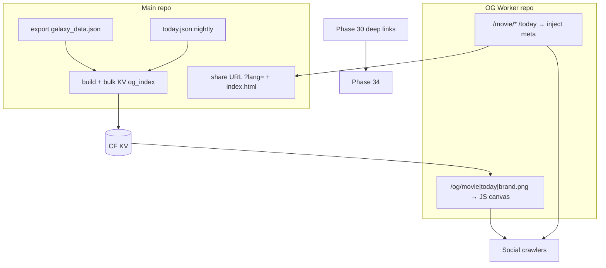

# Phase 34 — 社交预览与传播能力（Worker 动态 OG）

## 目标

Phase 34 在 **Phase 30 深链稳定** 后，让分享链接在社交平台呈现 **与影片一致的预览卡**（海报 + 图上片名），并统一 **The Movie Today** 与 **任意 galaxy 内 `/movie/:id`** 的 OG 体系：

- **任意 galaxy 内 id**：`/og/movie/{id}.png?v={G}-{M}`，缓存键 = 内容身份。
- **`/today`**：与 movie **同一套渲染器**，仅 URL / `og:url` / today 语义不同；`v` 含 UTC `date`。
- **不在 galaxy 的 id**：Worker **品牌模板**（动态 PNG，无静态 `og-brand.png` 依赖）。
- **HTML meta**：同 zone Worker 对 `/movie/*`、`/today` **注入 `<head>`**（不区分爬虫 UA）；浏览器仍跑 SPA。
- **存储**：不落地 60k R2/Pages PNG；可选 **KV** 仅存元数据索引；边缘按 URL **immutable** 长缓存 PNG。
- **一刀切**：停用 [scripts/cron/render_og_today.py](scripts/cron/render_og_today.py) 与 nightly `og-today.png`；today 仅 Worker `/og/today.png`。



## 策略 SSOT（已决策，34.2 审计仅作基线输入）

| 维度                   | 决策                                                                                                    |
| ---------------------- | ------------------------------------------------------------------------------------------------------- |
| 架构                   | **独立 repo** Cloudflare Worker；**同 zone** `themoviecosmos.com`                                       |
| 画图                   | **方案 A**：Worker 内 **JS 画布**（port `render_og_today` 版式：海报左、片名、genre 色条、品牌 footer） |
| 索引                   | **Cloudflare KV**：`movie:{id}`、`today`、`meta:G`                                                      |
| 缓存                   | `v = {G}-{M}`；PNG `Cache-Control: public, max-age=31536000, immutable`（**仅**当 URL 含正确 `v`）      |
| 海报拉取               | fetch 时将 `w780` → **`w342`**；失败 → **占位图**（`placeholderFlag` 进入 `M`）                         |
| 多语言                 | **OG 图与 meta 简介不随 HUD locale**；分享链接 **带 `?lang=`** 只影响 SPA / intent 文案                 |
| Movie `og:title`       | `{片名} ({年份}) — The Movie Cosmos`                                                                    |
| Movie `og:description` | **不设** overview（必要时仅固定极短品牌句）                                                             |
| 图上文字               | **要片名**（与 title 一致）                                                                             |
| `og:url`               | 与分享链接一致：`/movie/:id` 或 `/today`（可含 query，不含 lang 进 PNG `v`）                            |
| 无效 / 非 galaxy id    | Worker **品牌模板**                                                                                     |
| Today                  | **并入** `/og/today.png`；**停** cron PNG                                                               |
| Drawer 分享 UI         | **不改** 平台 intent 结构；仅修正 **URL 带 lang**                                                       |
| 平台验收               | **X、Facebook、Telegram、Discord** 各抽 `/movie` + `/today`                                             |
| 合规                   | 站点 attribution + 条款核对；**不写**「个人项目/成功率免责」类表述                                      |

### 内容身份：`G` 与 `M`

- **`G`**：`galaxy_data.json` → `meta.version`（与 R2 manifest `data_version` 对齐）。
- **`M`**：`hash8(layoutVersion, id, title, release_date, genres[0], poster_url, placeholderFlag)` — **不含** `lang`、不含 overview。
- **`layoutVersion`**：初值 `og-v1`；改 OG 版式时 bump，使旧 URL 自然失效。
- **Today `v`**：`{G}-{M}` 且 `M` 含当日 `today.json` 的 `movie_id`；另在 overline 使用 `date`（与现 today 卡一致）。

### 拒绝 / Backlog

| 项                                                   | 说明                     |
| ---------------------------------------------------- | ------------------------ |
| 静态双 shell + `og-share.png`                        | 不采用                   |
| 60k 预生成 PNG / R2 图库                             | 不采用                   |
| Vercel Edge / 独立 Serverless 栈                     | 不采用                   |
| OG 图内 HUD 多语言 / 每片 overview 翻译              | 不采用（需另开数据管线） |
| Reddit / Email 全平台矩阵                            | 本 Phase 不强制          |
| nightly 预热 Top-N、海报 Cache API、Container+Pillow | 先不做（最简 MVP）       |

## 范围边界

### 本 Phase 要做

- 34.1–34.2：计划与 **现有静态 OG 基线审计**（切换前快照）。
- 主仓：导出后 **KV bulk**；nightly 更新 `today` + `meta:G`；**移除** `render_og_today` 调用与 `og-today.png` 发布路径。
- 子 repo Worker：`/og/*` PNG + `/movie/*`、`/today` HTML meta 注入。
- 前端：`buildMovieSharePageUrl` **显式** `?lang=`（`localeStore`）；`index.html` 的 `og:image` 改为 Worker 绝对 URL（或由注入覆盖）。
- 合规 TODO 落地（页脚/About TMDB 归属）。
- 34.8 平台抽样 + 34.9 单测/构建/回滚文档。

### 本 Phase 不做

- 不引入 Postgres / 业务后端。
- 不改变 Phase 30 客户端路由契约（`routes.ts`、Zustand 同步规则不变）。
- 不把 Drawer 分享按钮迁移到新 UI（Phase 30 已完成）。
- 不做 SEO 全站、sitemap、结构化数据。
- 不保证所有平台 100% 预览成功（验收为抽样 + 记录 known issues）。

## 关键现状（切换前）

- 静态 [frontend/index.html](frontend/index.html) 全站共用 meta；`og:image` → `og-today.png`（**movie 深链会显示当日另一部片**，需消除）。
- [scripts/cron/render_og_today.py](scripts/cron/render_og_today.py) + nightly → `frontend/public/data/og-today.png`；[frontend/vite.config.ts](frontend/vite.config.ts) `ogTodayImageCacheBustPlugin`。
- 导出 [scripts/export/export_galaxy_json.py](scripts/export/export_galaxy_json.py) `poster_url` 为 `w780`；Worker 拉取时降为 **w342**。
- Phase 30：**completed** — `/movie/:id`、`/today`、Drawer 分享、[frontend/public/_redirects](frontend/public/_redirects) 不 rewrite `/data/*`（除 OG 路径迁移后需保证 `/og/*` 不被误 fallback）。

## 工作拆分

### 34.1 计划与 Phase 30 前置

| 检查项            | 期望                                                  |
| ----------------- | ----------------------------------------------------- |
| `/movie/:id` 刷新 | focus + Drawer                                        |
| `/today` 刷新     | today 体验                                            |
| Drawer 分享 URL   | `/movie/:id`（本 Phase 加 `?lang=`）                  |
| `_redirects`      | 不吞 `/og/*`、assets、fonts、`/data/*`（galaxy 数据） |

交付：本计划文件；Go/No-Go 记入 34.1 实施报告（验收后）。

#### 34.1 前置检查实施（2026-05-22）

| 检查项            | 期望                                   | 证据                                                                                                      | 结果                               |
| ----------------- | -------------------------------------- | --------------------------------------------------------------------------------------------------------- | ---------------------------------- |
| `/movie/:id` 刷新 | focus + Drawer                         | `routeControllerSync.spec.ts` T1/T2 + `runInitialRouteBoot`；`Drawer.tsx` 在 `selectedMovieId` 有效时打开 | **Pass**                           |
| `/today` 刷新     | today 体验                             | `routeControllerSync.spec.ts` T3；`parseLogicalPath('/today')`                                            | **Pass**                           |
| Drawer 分享 URL   | `/movie/:id`                           | `DrawerMovieShare` → `buildMovieSharePageUrl`；`shareLinks.spec.ts`                                       | **Pass**（`?lang=` 留待 **34.6**） |
| `_redirects`      | 不吞 `/og/*`、assets、fonts、`/data/*` | `frontend/public/_redirects` 仅 `/movie/*`、`/today`；`spaRedirects.spec.ts`（含 `/og/` 负向断言）        | **Pass**                           |
| Phase 30 计划     | 深链 TODO 全部完成                     | `phase_30_routing_sharing.plan.md` todos `completed`                                                      | **Pass**                           |

**Go/No-Go：Go** — Phase 30 深链契约满足，可进入 34.2 静态 OG 基线审计。

**已知缺口（不阻塞 34.2）**

- 分享 URL 尚未显式附加 `?lang=`（34.6）。
- `/og/*` 尚无 Worker 路由；当前 Pages `_redirects` 未误 rewrite，34.5 需在 CF dashboard 将 `/og/*` 先于 SPA 绑定 Worker。
- 生产 `/movie/:id` 刷新仍依赖 `verify-spa-fallback-dist.mjs` 与 dist `_redirects` 拷贝（build 链路已覆盖）。

**本地验证（34.1）**

```text
cd frontend && npx vitest run src/lib/routeControllerSync.spec.ts src/lib/spaRedirects.spec.ts src/lib/shareLinks.spec.ts src/lib/routes.spec.ts
→ 4 files, 22 tests passed
```

### 34.2 现有 OG 基线审计

审计对象（切换前一次性）：

- [scripts/cron/render_og_today.py](scripts/cron/render_og_today.py)、`today.json`、`og-today.png`
- [frontend/index.html](frontend/index.html) meta
- nightly / [scripts/cron/upload_galaxy_r2.py](scripts/cron/upload_galaxy_r2.py) 是否上传 `og-today.png`
- `vite` cache-bust 与 [frontend/public/_headers](frontend/public/_headers)

输出（供 34.3+ 对照）：

- `/today` vs `/movie/:id` 当前 crawler 所见 title/image/url
- 每日更新资源清单 → 映射为 **KV keys + Worker `v`**

#### 34.2 基线审计实施（2026-05-22）

**范围**：只读审计；未改管线代码。分支 `chore/p34.2-og-baseline-audit`。实施报告待验收后写入 `docs/reports/`。

##### A. 管线与产物（当前 SSOT）

| 环节         | 文件 / 行为                                                     | 说明                                                                                                                                                           |
| ------------ | --------------------------------------------------------------- | -------------------------------------------------------------------------------------------------------------------------------------------------------------- |
| 选片         | `pick_movie_today.py` → `frontend/public/data/today.json`       | 字段：`date`（UTC ISO）、`movie_id`、`selected_at`、`selection_strategy`、`min_vote_count`                                                                     |
| 画图         | `render_og_today.py` → `frontend/public/data/og-today.png`      | 1200×630 PNG；读 `today.json` + `galaxy_data.json` 中该片；原子写入；海报失败 **不覆盖** 旧 PNG                                                                |
| 调用链       | `nightly_vote_refresh.py` L508–511、`monthly_refit.py` L834–837 | 顺序：`write_today_json_after_galaxy_export` → `render_og_today_after_galaxy_export`；失败仅 WARN                                                              |
| R2           | `upload_galaxy_r2.py` L236–246、L261–263                        | 若存在则上传 `{prefix}/og-today.png`，`Cache-Control: public, max-age=300, must-revalidate`；manifest 写 `og_today_url` = `{base}/og-today.png?v={today.date}` |
| Pages bundle | `_maybe_prune` **保留** `og-today.png`（L107–108 注释）         | 与 `index.html` 中 `og:image` 直连 Pages 同源                                                                                                                  |
| 入仓         | `.gitignore` L43–45                                             | `og-today.png` / `.tmp` **不入 git**；CI artifact 仍打包                                                                                                       |
| CI artifact  | `nightly_vote_refresh.yml` / `monthly_refit.yml` L83、L162      | 含 `og-today.png`；其后 `npm run build -w frontend` 再 Pages deploy                                                                                            |

**`render_og_today` 消费的 galaxy 字段**（单卡，无 per-route）：`title`、`genres`、`release_date`、`poster_url`（导出为 `https://image.tmdb.org/t/p/w780/...`，见 `export_galaxy_json.py` `POSTER_BASE`）。版式常量：`layoutVersion` 尚未存在（Phase 34 拟 `og-v1`）。

**本地抽样**（仓库内 `today.json`）：`date=2026-05-08`，`movie_id=301334`（审计日构建日志与 dist 一致）。

##### B. 静态 HTML meta + Vite cache-bust

| 项                           | 源 `index.html`                                | 生产构建 `dist/index.html`（本次 `npm run build -w frontend`） |
| ---------------------------- | ---------------------------------------------- | -------------------------------------------------------------- |
| `og:title` / `twitter:title` | `The Movie Cosmos`                             | 同左                                                           |
| `og:description`             | 全站 galaxy 简介 + “Today's pick refreshes…”   | 同左                                                           |
| `og:url`                     | `https://themoviecosmos.com/`                  | 同左（**apex `/`**，非深链路径）                               |
| `og:image` / `twitter:image` | `https://themoviecosmos.com/data/og-today.png` | `.../og-today.png?v=2026-05-08`（来自 `today.json.date`）      |
| `og:image:alt`               | Today's pick…                                  | 同左                                                           |

**`ogTodayImageCacheBustPlugin`**（`frontend/vite.config.ts`）：`readOgTodayCacheBustDate()` 优先级 `VITE_OG_TODAY_V` → `public/data/today.json.date` → UTC 当天；`replaceAll` 基 URL `OG_TODAY_IMAGE_BASE`。**仅**改写 `index.html` 内两处 image URL；**不**改 `og:url` / title。

**`frontend/public/_headers`**：`/data/og-today.png` → `max-age=300, must-revalidate`（与 R2 短 TTL 一致，利于日更 re-scrape）。

##### C. 爬虫视角：`/` vs `/today` vs `/movie/:id`（切换前缺陷）

Pages SPA：凡未命中静态文件的路径均回 **同一份** `index.html`（含上述 meta）。**无** UA 分流、**无** 按路径注入。

| 分享 / 抓取 URL                         | 爬虫所见 `og:title` | 爬虫所见 `og:url`             | 爬虫所见 `og:image`          | 与页面内容一致性                        |
| --------------------------------------- | ------------------- | ----------------------------- | ---------------------------- | --------------------------------------- |
| `https://themoviecosmos.com/`           | The Movie Cosmos    | `https://themoviecosmos.com/` | 当日 `og-today.png?v={date}` | 与 today 卡一致（预期）                 |
| `https://themoviecosmos.com/today`      | **同上（全站）**    | **同上（apex `/`）**          | **同上（today 图）**         | SPA 为 today；**`og:url` 错误**         |
| `https://themoviecosmos.com/movie/{id}` | **同上（全站）**    | **同上（apex `/`）**          | **同上（today 另一部片）**   | **严重错位**：预览图/标题均非被分享影片 |

Drawer 分享 URL（`buildMovieSharePageUrl`）已指向 `/movie/:id`，但 **head meta 仍全站 today** → Phase 34 核心动机。

**`?lang=`**：分享 URL **未** 附加（34.6）；对当前静态 meta **无影响**（meta 无 locale 变体）。

##### D. 每日 / 版本化资源 → Phase 34 KV + Worker `v` 映射

| 当前资源 / 行为                       | 更新节奏                             | 34.3+ 目标                                                 |
| ------------------------------------- | ------------------------------------ | ---------------------------------------------------------- |
| `galaxy_data.json` → `meta.version`   | 导出（nightly 票选 / monthly refit） | KV `meta:G`                                                |
| `today.json`                          | nightly（+ monthly 后重写）          | KV `today`：`{ date, movie_id }`                           |
| 全量 `movies[]` OG 字段               | 随 export                            | KV `movie:{id}`：`title, release_date, genres, poster_url` |
| `og-today.png` + R2 `og_today_url`    | nightly                              | **移除**；改为 `GET /og/today.png?v={G}-{M}`               |
| —                                     | —                                    | `GET /og/movie/{id}.png?v={G}-{M}`（per-id）               |
| `index.html` `?v=YYYY-MM-DD`          | 每次 frontend build                  | **移除** 或 apex 仅品牌图；`v` 由 Worker URL 承担          |
| `_headers` / R2 短 TTL on PNG         | 日更                                 | Worker PNG `immutable` + URL 含 `G-M`                      |
| `render_og_today_after_galaxy_export` | nightly + monthly                    | **删除调用**（34.3 一刀切）                                |
| manifest `og_today_url`               | nightly                              | 删除或改为 Worker canonical URL                            |

**`v` 对照（目标 SSOT，本审计仅记录现状）**

| 现状                                             | 目标（计划 § 内容身份）                                                                                                   |
| ------------------------------------------------ | ------------------------------------------------------------------------------------------------------------------------- |
| HTML image query：`?v=2026-05-08`（仅 UTC 日期） | `?v={G}-{M}`，`G=meta.version`，`M=hash8(layoutVersion, id, title, release_date, genres[0], poster_url, placeholderFlag)` |
| 全路由共用一张 today 图                          | `/movie/:id` → 该片图；`/today` → today 图；miss → `/og/brand.png`                                                        |

##### E. 34.3+ 切换检查清单（自本基线导出）

- [ ] 从 `nightly_vote_refresh` / `monthly_refit` 移除 `render_og_today_after_galaxy_export`
- [ ] `upload_galaxy_r2` 停止上传 / manifest `og_today_url`（或改 Worker URL）
- [ ] 停止将 `og-today.png` 作为生产 SSOT（Pages bundle / artifact 可逐步剔除）
- [ ] 评估移除 `ogTodayImageCacheBustPlugin` + `index.html` 对 `/data/og-today.png` 依赖（34.6）
- [ ] Worker HTML 注入修正 `/movie/*`、`/today` 的 `og:url` / `og:title` / `og:image`（34.5）
- [ ] KV bulk：`meta:G`、`today`、`movie:*`（34.3）

**Go/No-Go：Go** — 基线清晰，可进入 34.3（KV 索引）与 Worker 子 repo 并行准备。

### 34.3 KV 索引与管线切换

**KV 约定**

| Key          | 值                                                               |
| ------------ | ---------------------------------------------------------------- |
| `meta:G`     | `data_version` 字符串                                            |
| `today`      | `{ "date": "YYYY-MM-DD", "movie_id": number }`                   |
| `movie:{id}` | `{ title, release_date, genres, poster_url }`（OG 所需最小字段） |

**主仓脚本**（新建或扩展现有 export 后步骤）：

- 读 `galaxy_data.json` + `today.json` → bulk put KV（注意 CF KV 写入批次与限流）。
- nightly：`today` + `meta:G` 必更新；galaxy 月更后全量 refresh `movie:*`。

**一刀切移除**

- `nightly_vote_refresh` / `monthly_refit` 中 **删除** `render_og_today_after_galaxy_export`（或等价调用）。
- R2 upload **不再** 依赖 `og-today.png`（若 manifest 有 `og_today_url` 改为 Worker URL 或删除该字段）。
- [frontend/public/data/og-today.png](frontend/public/data/og-today.png) 不再作为生产 SSOT。

### 34.4 OG Worker 子 repo（PNG）

**仓库**：独立 git repo（与主仓通过文档约定版本；部署同一 CF account）。

**路由**

| 路径                    | 行为                                                                                                            |
| ----------------------- | --------------------------------------------------------------------------------------------------------------- |
| `GET /og/movie/:id.png` | 查 KV → 画片名+海报卡；query `v` 须与算出的 `G-M` 一致（不一致可 302 到 canonical `v` 或仍画但靠 URL 隔离缓存） |
| `GET /og/today.png`     | KV `today` + `movie:{id}`；overline 含 date                                                                     |
| `GET /og/brand.png`     | 无 id / KV miss → 品牌模板；`v=og-brand-{layoutVersion}`                                                        |

**响应头（canonical URL）**

```http
Content-Type: image/png
Cache-Control: public, max-age=31536000, s-maxage=31536000, immutable
```

**实现要点**

- JS 画布 port 现 today 布局；字体可用 woff 子集或系统 fallback。
- `downloadPoster(url)`：URL 规范化 `image.tmdb.org` only；`w780`→`w342`；超时 → 占位。
- `computeOgVersion(record)`：与主仓文档 **同一算法**（可共享 npm 包或复制单测 golden）。

### 34.5 同 zone HTML meta 注入

**原则**：**不**做 UA 黑名单；凡 `GET /movie/*`、`GET /today`（Accept text/html）返回 **同一份** SPA `index.html` 模板 + **替换/注入** head meta。

| 路由         | `og:title`                         | `og:image`                                               | `og:url`                                                                          |
| ------------ | ---------------------------------- | -------------------------------------------------------- | --------------------------------------------------------------------------------- |
| `/movie/:id` | `{片名} ({年}) — The Movie Cosmos` | `https://themoviecosmos.com/og/movie/{id}.png?v={G}-{M}` | `https://themoviecosmos.com/movie/{id}` + 保留分享 query（**lang 不进 image v**） |
| `/today`     | The Movie Today 语义 + 当日片名    | `/og/today.png?v=…`                                      | `https://themoviecosmos.com/today`                                                |

- **无** `og:description` overview（可选极短固定句）。
- Worker 路由顺序：**先于** Pages SPA fallback（`_routes.json` / dashboard routes）。
- 回滚：解绑 Worker 路由 → 回退 index 静态 meta（临时品牌图 URL）。

### 34.6 主仓前端与静态 meta

- [frontend/src/lib/shareLinks.ts](frontend/src/lib/shareLinks.ts) + [DrawerMovieShare.tsx](frontend/src/components/DrawerMovieShare.tsx)：`buildMovieSharePageUrl` 从 `localeStore` **显式** `?lang=`；`useMemo` 依赖 `locale`。
- [frontend/index.html](frontend/index.html)：移除对 `/data/og-today.png` 的依赖；默认 `og:image` 可指向品牌或占位 Worker URL（最终由 34.5 注入覆盖 `/movie`、`/today`）。
- 评估 **移除** `ogTodayImageCacheBustPlugin`（`v` 由 Worker URL 承担）；若保留 apex `/` 静态页，单独约定 apex `og:image`（品牌 `/og/brand.png`）。

### 34.7 TMDB 合规

- 在站点 **About / footer / index** 增加 TMDB API 要求 attribution（具体措辞对照 [TMDB API Terms](https://www.themoviedb.org/documentation/api/terms-of-use)）。
- 可选：OG 图 footer 一行 “Data from TMDB”。
- Worker：仅允许 fetch `https://image.tmdb.org/...` 海报。
- 交付：合规检查项写入实施报告；**不**包含项目规模或成功率免责声明。

### 34.8 分享平台验证

| 平台     | 工具             |
| -------- | ---------------- |
| X        | Card Validator   |
| Facebook | Sharing Debugger |
| Telegram | 贴链接预览       |
| Discord  | 贴链接预览       |

每条链路至少：

- `https://themoviecosmos.com/movie/{valid_id}?lang=zh`
- `https://themoviecosmos.com/today`

记录：title、image URL、`v`、是否需 “Scrape Again”。

### 34.9 测试与验收

**主仓**

- `npm run lint -w frontend`
- `npm run build -w frontend`
- 单测：分享 URL 含 `lang`；`computeOgVersion` golden（若放主仓）；`_redirects` 不 rewrite `/og/*`

**Worker repo**

- 单测：`M`/`G` hash、w342 URL 替换、KV miss → brand
- 本地 `wrangler dev` 抽 3 id + today + invalid id

**验收标准**

- galaxy 内任意抽测 id：预览图含 **该片** 海报与片名；title 含年份与品牌。
- `/today`：图与 `today.json` 一致；`og:url` 为 `/today`。
- 无效 id：品牌图，非 500。
- nightly **不再** 产出 `og-today.png`。
- Phase 30 深链刷新仍通过。
- 34.8 四平台抽样有记录。

**建议命令**

```bash
npm run lint -w frontend
npm run build -w frontend
npx vitest run frontend/src/lib/shareLinks.spec.ts
# Worker repo:
npm test && npx wrangler deploy --dry-run
```

## 部署与回滚

| 组件   | 生产                                          |
| ------ | --------------------------------------------- |
| Pages  | 现有 `themoviecosmos.com` SPA                 |
| Worker | 同 zone；routes `/og/*`、`/movie/*`、`/today` |
| KV     | `OG_INDEX` namespace；nightly sync 自 CI      |

**回滚**：Worker 路由解绑 → 恢复 index 静态 meta + 可选临时恢复 `render_og_today`（文档化，非默认）。

## Phase 34 交付物

- 本计划（SSOT）
- 34.2 基线审计记录（`docs/reports/`）
- 主仓：`og_index` → KV 脚本 + nightly 挂钩；移除 cron OG PNG
- 子 repo：Worker 源码 + `wrangler.toml` + 部署说明
- 前端分享 `?lang=` + index/meta 调整
- 合规文案与检查记录
- 34.8 平台验证矩阵
- 34.9 单测与验收报告

## 风险（已知）

| 风险                      | 缓解                                  |
| ------------------------- | ------------------------------------- |
| Worker 冷启动 + 画 PNG 慢 | w342；immutable 边缘缓存；仅首 URL 慢 |
| Facebook 缓存旧 URL       | 新 `v`；Sharing Debugger 重抓         |
| KV bulk 写入超时/限额     | 分批 put；月更全量 vs 日更 today      |
| JS 版式与 Pillow 漂移     | `layoutVersion` + 视觉抽样            |
| 平台偶发无预览            | 34.8 记录；不阻塞合并                 |

## 与 Phase 35+ 关系

- Phase 35 质量运维可纳入 **KV 同步失败**、Worker 5xx 告警。
- 多语言 overview、Top-N 预热、R2 图库缓存等为 **Backlog**，不在本 Phase。
