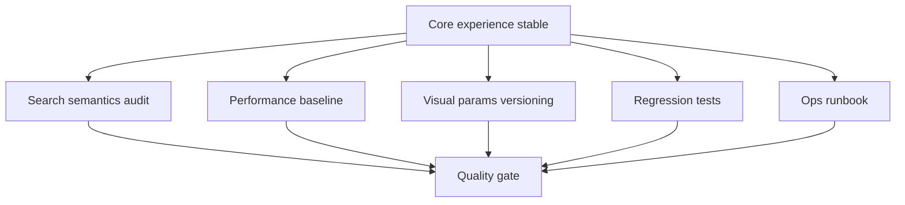

# Phase 35 — 数据与运营质量补强

## 目标

Phase 35 不再新增大功能，而是把核心体验稳定后的长期维护能力补齐：

- 搜索索引语义清楚，前端文案不误导用户。
- 全量数据性能有基线，后续改动能比较。
- SDR/HDR/视觉参数有版本记录，避免“调了但不知道为什么”。
- 关键用户路径有回归测试。
- 数据更新、today、OG、缓存、部署和回滚有运维 runbook。

## 范围边界

### 本 Phase 要做

- 审计搜索索引字段与 UI 文案的一致性。
- 记录全量数据加载与渲染性能基线。
- 将视觉参数和 HDR/SDR 决策写入可追踪文档或配置说明。
- 补齐关键回归测试。
- 整理运维 runbook。

### 本 Phase 不做

- 不重算 UMAP 或重新设计 pipeline。
- 不直接读取 `data/raw/TMDB_all_movies.csv`。
- 不新增大型产品功能。
- 不把每个 backlog 都塞进当前版本。
- 不改变 Phase 30–34 已稳定的用户契约。

## 关键现状

- 搜索索引加载与导出涉及 `galaxy_search_index.json.gz`、[frontend/src/store/searchIndexStore.ts](frontend/src/store/searchIndexStore.ts)、[frontend/src/data/loadSearchIndex.ts](frontend/src/data/loadSearchIndex.ts) 和导出脚本。
- 前端构建脚本在 [frontend/package.json](frontend/package.json)，`build` 已包含 `tsc -b`、`vite build` 和 `scripts/check-dist-max-file-size.mjs`。
- today 与 OG 运维涉及 [scripts/cron/render_og_today.py](scripts/cron/render_og_today.py)、`today.json`、`og-today.png` 和 R2/static hosting 缓存。
- 视觉参数分散在 [frontend/src/three/galaxyMeshes.ts](frontend/src/three/galaxyMeshes.ts)、[frontend/src/three/idleNearFade.ts](frontend/src/three/idleNearFade.ts)、[frontend/src/three/idleZFade.ts](frontend/src/three/idleZFade.ts)、[frontend/src/three/scene.ts](frontend/src/three/scene.ts)。
- 项目已有多份 reports 和 guides，可作为 runbook 的基础，但需要聚合成当前阶段可执行清单。

## 工作拆分

### 35.1 文档落地与稳定范围确认

创建并维护计划文件：`.cursor/plans/phase_35_quality_ops.plan.md`。

确认前置：

- Phase 30 深链与分享策略稳定。
- Phase 31 HUD/i18n 小体验稳定。
- Phase 32 SDR 参数稳定。
- Phase 33 HDR 结论明确。
- Phase 34 OG 策略明确。

如果前置阶段未完成，Phase 35 可以先做审计和 runbook，但不要固化尚未稳定的参数。

### 35.2 搜索数据语义审计

目标：确认搜索能力、索引字段和 UI 文案一致。

审计内容：

- movie title / original title 是否都进入索引。
- person name 字段来源和语言语义。
- genre 搜索是否只来自固定 genre palette / search index。
- `meta.has_search_index`、`search_normalize_version` 等元信息是否足够判断兼容性。
- UI placeholder 是否准确描述能力。

约束：

- 不直接读取 raw 大文件。
- 使用导出脚本、subsample、现有 reports 或程序化检查。
- 如发现需要新增字段，进入单独 pipeline phase 或 backlog，不在本阶段临时破坏 schema。

### 35.3 性能基线

建立全量数据下可复测的性能记录。

指标：

- 首屏数据下载耗时。
- gzip 解压耗时。
- JSON parse 耗时。
- GPU BufferAttribute / InstancedMesh 初始化耗时。
- search index 下载/解压/parse 耗时。
- Macro roam FPS。
- Focus enter/exit 体感耗时。
- bundle/dist 体积。

实现建议：

- 优先使用已有 loading phase 日志和 performance marks。
- 如新增测量，使用 `performance.now()` 并 `console.log` 关键耗时。
- 记录机器、浏览器、数据版本、构建模式。

### 35.4 视觉参数版本化

把 Phase 32/33 的关键参数变成可追踪事实。

记录对象：

- `uLMin`
- `uLMax`
- `uLightnessRatingExponent`
- `uHighRatingT`
- `uHighTierTRangeScale`
- `uDistanceLightnessFloor`
- idle near fade defaults。
- idle Z fade defaults。
- Bloom 默认策略。
- HDR `renderMode` 与降级结论。

输出形式：

- 技术报告或 Design/Tech Spec 更新。
- 参数表包含：默认值、原因、验证环境、回滚值、相关 phase。

### 35.5 回归测试补齐

优先覆盖已经稳定且容易回归的路径。

测试候选：

- route parser：`/`、`/movie/:id`、`/today`、非法 id、query 保留。
- share URL builder：复制链接与平台编码。
- poster 状态机：empty/loading/failed/retry/movie switch。
- locale parity：所有 bundle 与 `en.json` 同构。
- today fallback：manifest、remote today、bundled today、Top-1000 fallback。
- data loader：gzip magic 与 HTTP-transparent gzip。

### 35.6 构建与部署 guardrails

强化当前已有 build checks。

检查点：

- `npm run build -w frontend`。
- `scripts/check-dist-max-file-size.mjs` 阈值是否仍合理。
- `/data/*`、assets、fonts、manifest、icons 是否在静态部署中返回真实资源。
- R2 manifest、`today_url`、`galaxy_search_index.json.gz` 路径是否一致。
- preview 环境与 production base path 是否一致。

### 35.7 运维 runbook

聚合现有 reports/guides，形成当前可执行清单。

runbook 内容：

- 月度/定期数据更新步骤。
- today pick 生成与验证。
- OG today 生成与验证。
- R2 上传与 manifest 更新。
- 缓存清理与 cache-bust。
- 回滚策略。
- 性能异常排查。
- 用户反馈需要收集的环境信息。

### 35.8 最终质量验收

验收矩阵：

- 全量数据冷启动。
- `/`、`/today`、`/movie/:id` 刷新。
- 搜索 title/person/genre。
- Drawer poster 与 share。
- SDR/HDR fallback。
- today/OG 更新。
- locale 切换，至少覆盖 `en`、`zh`、`ja`、`ar`。

建议命令：

- `npm run test -w frontend`
- `npm run lint -w frontend`
- `npm run build -w frontend`
- 相关 Python cron/export 脚本 `--help` 或 dry run。

## 验收标准

Phase 35 完成时应满足：

- 搜索索引字段语义与 UI 文案一致，风险进入明确 backlog。
- 性能基线可复测，包含环境和数据版本。
- 视觉参数有版本记录和回滚依据。
- 核心路径回归测试覆盖到位。
- 构建/部署 guardrails 明确。
- 运维 runbook 可用于数据更新、today/OG、缓存和回滚。

## Phase 35 交付物

- `.cursor/plans/phase_35_quality_ops.plan.md`
- 搜索语义审计记录。
- 性能基线报告。
- 视觉参数版本表。
- 回归测试补齐。
- 构建/部署 guardrails。
- 运维 runbook。
- 后续 backlog。