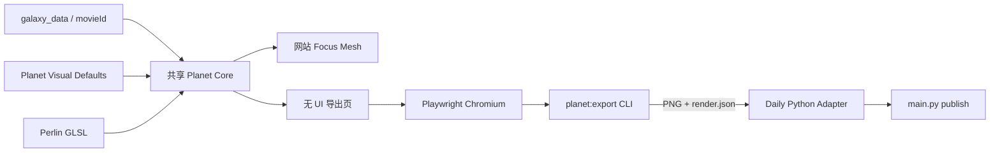

# Phase 36 — Focus 星球图像导出与 Daily Stargazing 集成

## 目标

Phase 36 将 Chronicle 中现有 focus mesh 变成可被本地 Daily Stargazing 稳定调用的图片生成能力，同时保证网站与导出结果共享同一套视觉事实来源：

- 输入 TMDB `movieId`，输出透明 PNG。
- 图片仅包含 focus mesh，保留 Shader Lambert 光照；不包含背景、银河、参考环或 UI。
- 默认 `3000×3000`、正交相机、星球居中。
- 所有电影共用固定世界→像素比例；最大星球每边留白 8%，小星球保留真实尺寸差异。
- Chronicle 负责视觉计算与 WebGL 渲染；Daily Stargazing 只通过 CLI、PNG 和 JSON metadata 调用。
- 网站修改正式 Shader、半径算法或默认视觉参数后，下一次导出自动使用新源码，不维护第二份配置。



## 范围边界

### 本 Phase 要做

- 抽出 focus mesh 的默认参数、外观计算和半径计算共享模块。
- 保持现有网站 focus 行为与视觉基线不变。
- 增加无 UI、透明背景、确定性姿态的独立导出场景。
- 使用项目自带 Playwright 固定版 Chromium 执行真实 WebGL Shader。
- 提供 Windows 可调用的本地 CLI，写出 PNG 和渲染 metadata。
- 在 Daily Stargazing 增加 Python 子进程适配器。
- 将图片生成默认接入 `main.py publish`，并提供显式跳过选项。
- 人工比较 Bloom on/off，确定发布流程默认值。

### 本 Phase 不做

- 不把图片导出入口放进网站 HUD，不新增面向网站用户的按钮或文案。
- 不在 Python 中重写 Three.js、GLSL、颜色或噪声算法。
- 不复制 focus Shader 或维护导出专用视觉参数表。
- 不读取 Leva、Zustand、当前相机、页面实时旋转等运行态。
- 不修改 UMAP、数据清洗、embedding 或片单筛选逻辑。
- 不直接读取 `data/raw/TMDB_all_movies.csv`。
- 不建设长期运行的本地 HTTP 服务；当前调用频率使用一次性 CLI 即可。
- 不在一个提交或 PR 中混合两个仓库的改动。

## 已确认决策

- 标识：使用 TMDB `movieId`。
- 输出：透明 PNG，默认 `3000×3000`。
- 构图：正交相机、居中、统一比例、最大星球每边 8% 留白。
- 姿态：使用电影 ID 对应的确定性基准姿态，不运行实时自转。
- 参数：使用 Chronicle 共享正式默认值；允许 CLI 显式覆盖输出参数，但不隐式读取页面运行态。
- Bloom：支持 `on/off`；实现阶段初始默认 `off`，最终默认值由 36.5 人工验收决定。
- 浏览器：Chronicle 自带 Playwright 固定版 Chromium，首次安装允许下载浏览器运行时。
- Daily 集成：`main.py publish` 默认生成图片，`--no-planet-image` 可跳过。
- 失败语义：默认 publish 图片生成失败时以非零退出，不静默缺图继续发布。

## 关键现状

- Focus mesh 创建、CPU noise、色带、Shader uniforms 与电影绑定集中在 [frontend/src/three/planet.ts](frontend/src/three/planet.ts)。
- 现有顶点与片元 Shader 位于 [frontend/src/three/shaders/perlin.vert.glsl](frontend/src/three/shaders/perlin.vert.glsl) 和 [frontend/src/three/shaders/perlin.frag.glsl](frontend/src/three/shaders/perlin.frag.glsl)。
- 确定性基准姿态与旋转逻辑位于 [frontend/src/three/selectionPlanetRotation.ts](frontend/src/three/selectionPlanetRotation.ts)。
- Focus 基础半径来自 `movie.size × uSizeScale × uActiveSizeMul`，当前 CPU 对应逻辑位于 [frontend/src/three/screenRadius.ts](frontend/src/three/screenRadius.ts)。题材台阶还会扩大实际外接半径。
- Galaxy 数据类型定义在 [frontend/src/types/galaxy.ts](frontend/src/types/galaxy.ts)，数据加载器位于 [frontend/src/data/loadGalaxyGzip.ts](frontend/src/data/loadGalaxyGzip.ts)。
- 当前发布数据由 [frontend/public/data/galaxy_assets_manifest.json](frontend/public/data/galaxy_assets_manifest.json) 指向版本化 R2 gzip；本地 `public/data` 不保证存在完整 `galaxy_data.json.gz`。
- Chronicle 已使用 npm workspace，但当前仅包含 `frontend`；根配置见 [package.json](package.json)。
- Daily Stargazing 是 Python CLI 项目，选定电影后的生产入口为 `T:/themoviecosmos-daily-stargazing/scripts/main.py publish --tmdb-id ...`。

## 工作拆分

### 36.1 计划落地与跨仓库契约冻结

创建并维护 `.cursor/plans/phase_36_planet_image_export.plan.md`。

冻结以下契约：

- Chronicle CLI 参数、退出码与 stdout/stderr 分工。
- PNG 与 `*.render.json` 命名规则。
- 数据源优先级：`--data-file` → `--data-url` → manifest R2 URL。
- Daily 通过 `MOVIE_COSMOS_GALAXY_ROOT` 定位 Chronicle，不硬编码盘符。
- Chronicle 与 Daily 分别使用自己的分支、测试、报告和 PR 流程。

前置检查：

- Chronicle 当前 focus mesh 与默认参数可正常构建。
- Daily 当前 `main.py publish` 测试基线通过。
- 两个仓库均不存在会与本 Phase 直接冲突的未合并实现。

### 36.2 抽出共享 Planet Core

目标：网站 focus 与导出器共同依赖一个视觉核心，不复制实现。

建议模块：

- [frontend/src/three/planetVisualDefaults.ts](frontend/src/three/planetVisualDefaults.ts)：`PLANET_VISUAL_DEFAULTS` 和可序列化版本/hash 输入。
- [frontend/src/three/planetAppearance.ts](frontend/src/three/planetAppearance.ts)：电影→题材色带、亮度、噪声 seed、阈值和确定性姿态。
- [frontend/src/three/planetSizing.ts](frontend/src/three/planetSizing.ts)：基础半径、题材台阶外扩系数和实际外接半径纯函数。

实施要求：

- [frontend/src/three/planet.ts](frontend/src/three/planet.ts) 保留 `createSelectionPlanet()` facade，但改为消费共享模块。
- [frontend/src/three/screenRadius.ts](frontend/src/three/screenRadius.ts) 调用共享半径函数，避免点击范围、网站视觉和导出尺寸漂移。
- 共享默认值涵盖 geometry detail、noise、色带、阶梯、光照和颜色参数；不得在导出器中再次硬编码。
- 保留现有 Shader、电影 ID seed 和 `selectionPlanetBaseQuaternion()` 行为。

验证：

- 默认参数快照测试。
- 同一 movieId 的噪声、色带和姿态确定性测试。
- 不同题材层数的外接半径测试。
- 重构前后 focus mesh uniforms、scale 和 quaternion 一致。
- `npm run test -w frontend`、`npm run lint -w frontend`、`npm run build -w frontend`。

### 36.3 实现无 UI 导出场景

目标：在独立页面中只渲染一颗 selection planet。

建议入口：

- [frontend/planet-export.html](frontend/planet-export.html)
- [frontend/src/planet-export/main.ts](frontend/src/planet-export/main.ts)
- [frontend/src/planet-export/renderPlanetImage.ts](frontend/src/planet-export/renderPlanetImage.ts)

实施要求：

- 不挂载 React、不初始化 HUD、不创建 galaxy macro/active mesh。
- 严格校验 `movieId`、数据 URL、resolution、padding 与 Bloom。
- 加载 `GalaxyData` 后建立 `movieId → Movie` 索引，并 `console.log` 电影数量、目标 ID 和目标样本摘要。
- 扫描片单，通过共享 `planetSizing` 计算最大实际外接半径；按每边 8% 留白建立固定正交视野。
- 将目标星球平移到原点，保留电影 ID 的规范 quaternion；不运行时间动画。
- 透明清屏，保持 sRGB 输出和现有 Shader Lambert 光照。
- `bloom=off` 使用直接渲染；`bloom=on` 使用独立 composer/render target，背景仍保持 alpha=0。
- 实质 Shader 验证前先用 `MeshBasicMaterial` 检查相机、透明通道、居中和比例，再切换共享 focus material。

验证：

- 请求校验、movieId 查找和全局半径计算单元测试。
- 基础材质与 Shader 两条视觉 smoke 路径。
- PNG 尺寸、透明背景、非空可见像素和不裁切检查。

### 36.4 建立 Playwright 本地导出 CLI

目标：为 Daily 提供与语言无关、可自动化的命令行边界。

建议结构：

- [tools/planet-exporter/package.json](tools/planet-exporter/package.json)
- [tools/planet-exporter/src/cli.ts](tools/planet-exporter/src/cli.ts)
- 根 [package.json](package.json) 增加 workspace 和 `planet:export` script。

公开命令：

```powershell
npm run planet:export -- --movie-id 157336 --output "...\2026-07-13_157336_planet.png" --resolution 3000 --padding 0.08 --bloom off
```

实施要求：

- 使用 Vite programmatic server 加载当前 Chronicle 源码，再由 Playwright 固定 Chromium执行 WebGL。
- 默认读取 manifest 中版本化 R2 gzip；支持 `--data-url` 与 `--data-file` 固定数据源或离线运行。
- stdout 只输出单个机器可读成功 JSON；进度和诊断写 stderr。
- 未知 movieId、数据 schema 错误、WebGL 初始化失败、`MAX_TEXTURE_SIZE < resolution`、PNG 编码失败均返回非零退出码。
- 先写临时 PNG/JSON，全部成功后原子重命名，避免留下半成品。
- metadata 至少记录：`tmdb_id`、data version/source、resolution、padding、Bloom、Chronicle Git commit、视觉配置 hash、Chromium 版本、WebGL renderer 和生成时间。
- 无论成功失败都关闭页面、浏览器和 Vite server；连续调用不得残留端口或进程。

验证：

- CLI 参数、数据源优先级、退出码和 stdout JSON 单元测试。
- 小分辨率 Playwright 集成测试，不在普通测试中生成 3000×3000 大图。
- 连续运行两次并检查资源清理。
- `npm test`、`npm run lint`、`npm run build`。

### 36.5 Chronicle 图像质量验收 `[需人工验收]`

自动检查：

- 选择小、中、最大三个实际外接半径档位。
- 每个档位各导出 Bloom off/on。
- 检查目标居中、最大星球每边约 8% 留白、小星球尺寸差异、透明 alpha、光照和轮廓完整性。
- 同一环境重复导出，比较尺寸、alpha bounds、metadata 和稳定统计；不使用跨 GPU 脆弱的整图 golden hash。
- 确认导出入口、Playwright 和 Chromium 不进入网站默认页面或生产 bundle。

人工确认：

- Focus mesh 颜色、地形和光照与网站正式默认效果一致。
- Bloom off 的透明区干净；Bloom on 的半透明光晕可接受。
- 确定 Daily 发布流程的 Bloom 默认值。

验收通过前，不开始 Daily 仓库集成。

### 36.6 Daily Stargazing Python 适配器

目标：Python 只负责调用 Chronicle CLI 和校验产物，不理解 Three.js。

建议改动：

- 新增 `T:/themoviecosmos-daily-stargazing/scripts/lib/planet_renderer.py`。
- 更新 `T:/themoviecosmos-daily-stargazing/.env.example`，增加 `MOVIE_COSMOS_GALAXY_ROOT`。
- 新增 `T:/themoviecosmos-daily-stargazing/tests/test_planet_renderer.py`。

适配器接口：

```python
def render_planet(
    tmdb_id: int,
    output_path: Path,
    *,
    bloom: bool,
) -> PlanetRenderResult:
    ...
```

实施要求：

- 全部函数使用类型标注，路径使用 `pathlib.Path`。
- 启动前检查 Chronicle 根目录、`package.json` 和导出 script。
- 使用参数数组调用 npm，不用拼接 shell 字符串，确保 Windows 空格路径安全。
- 解析 stdout JSON，检查退出码、PNG signature、`3000×3000`、RGBA/alpha、非空可见像素及 metadata 一致性。
- 打印 `tmdb_id`、输出路径、文件大小和 alpha bounds；失败抛出明确异常。
- 普通 pytest 使用 mock subprocess 和小 PNG fixture，不启动 Chromium。

验证：

- 成功参数拼装与 Windows 路径。
- Chronicle 路径缺失、CLI 失败、非法 JSON、PNG 缺失/损坏、metadata 不一致。
- `python -m pytest tests/test_planet_renderer.py`。

### 36.7 接入 Daily `main.py publish`

目标：总编确定电影后，默认同时生成发布星球图片。

实施要求：

- 修改 `T:/themoviecosmos-daily-stargazing/scripts/main.py`：定位 candidate 后、调用付费 C2 文案生成前执行 `render_planet()`。
- 默认生成图片；增加 `--no-planet-image` 显式跳过。
- 增加 `--planet-bloom on|off`，默认使用 36.5 人工确认值。
- 输出：
  - `output/Daily_Briefing/{date}_{tmdb_id}_planet.png`
  - `output/Daily_Briefing/{date}_{tmdb_id}_planet.render.json`
- 图片失败时 publish 返回非零且不进入 C2；避免产生文案成功、图片缺失的半完成发布。
- 保持现有 `{date}_copy.md` 主体契约；成功信息可附加图片和 metadata 路径，不修改检索、候选筛选或 C2 写作职责。

验证：

- 默认调用一次适配器。
- `--no-planet-image` 不调用适配器。
- Bloom 参数和输出路径正确传递。
- 图片失败时不调用 `compose.run_publish()`。
- 扩展相关 publish 测试，并运行对应 `python -m pytest`。

### 36.8 跨仓库端到端验收 `[需人工验收]`

端到端步骤：

- 从 Daily 真实 `{date}_candidates.json` 选取一个 `tmdb_id`。
- 运行 `python scripts/main.py publish --date ... --tmdb-id ...`。
- 确认生成 copy、PNG 和 render metadata，且 metadata 的 movieId、数据版本、视觉 hash 与请求一致。
- 在测试分支临时修改一个可见的共享光照默认值，分别验证网站 focus 与 CLI 导出同步变化；恢复参数后重新验证，证明不存在复制配置或陈旧 build。
- 人工查看 Daily 最终发布素材中的透明边缘、构图、尺寸和 Bloom 默认效果。

完成要求：

- Chronicle 与 Daily 分别运行各自测试。
- 两个仓库分别写报告、提交和创建 PR，不混合历史。
- 人工验收通过前，不标记本 Phase complete。

## 验收标准

Phase 36 完成时应满足：

- 网站 focus 与导出器共享 Shader、geometry、外观算法、半径算法和正式默认值，不存在第二份视觉参数表。
- 同一 data version、movieId、视觉 hash 和 Chromium 版本下，重复导出结果稳定。
- 最大星球不裁切并满足约 8% 每边留白；小星球保留真实尺寸差异。
- PNG 为 `3000×3000` RGBA；Bloom off 不含轮廓外光晕，Bloom on 保留半透明光晕。
- CLI 错误可诊断、无半成品、无残留浏览器或 Vite 进程。
- Daily 不依赖 Three.js 实现细节，只依赖稳定 CLI/JSON/文件协议。
- `main.py publish` 默认生成星球图；图片失败不会静默继续。
- 修改 Chronicle 共享正式参数后，网站与下一次 CLI 导出同步变化。

## Phase 36 交付物

- `.cursor/plans/phase_36_planet_image_export.plan.md`
- 共享 Planet Core 与回归测试。
- 无 UI 星球导出页与透明渲染实现。
- Playwright Chromium 导出 CLI。
- PNG 与 `*.render.json` 文件协议。
- Chronicle 图像质量验收报告。
- Daily Python 适配器与测试。
- Daily publish 集成与测试。
- 跨仓库端到端验收报告。