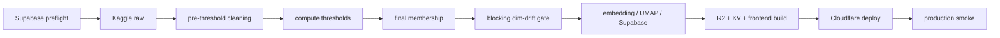

# Phase 37 — 生产数据流水线健康恢复

## 目标

Phase 37 恢复 The Movie Cosmos 的自动数据更新与发布闭环，并消除当前两个根因：

- nightly 无法解析 Supabase Project URL，票数刷新自 2026-06-11 后停止。
- monthly 在 362K pre-threshold 语料上执行阻断式维度检查，把不会进入最终建模 membership 的长尾语言也判为扩维需求。

## 范围边界

### 本 Phase 要做

- 恢复现有 Supabase 项目及 GitHub Actions Secrets 的有效连接。
- 在昂贵下载和计算前增加脱敏、只读 Supabase preflight。
- 将 monthly 的阻断式维度漂移检查移动到最终建模 membership。
- 审计最终 membership 中真实存在的未知语言，必要时升级语言词表并重建 canonical embedding bundle。
- 恢复 monthly、nightly、R2、KV、Cloudflare Pages 的完整发布链。
- 增加部署后 production smoke，并确认下一次 scheduled nightly 成功。

### 本 Phase 不做

- 不使用 `force_skip_dim_check` 作为正式恢复方案。
- 不因 pre-threshold 长尾语言直接扩大 one-hot 维度。
- 不修改 UMAP `random_state=42`、feature fusion 权重、genre 权重或 Z 轴尺度。
- 不重建或迁移 Supabase 数据库；已确认现有项目仍存在且可恢复。
- 不直接读取 `data/raw/TMDB_all_movies.csv` 到会话；全量分析只通过脚本执行。
- 不修改与流水线健康无关的前端视觉、交互或 HUD 文案。

## 已确认决策

- Supabase：恢复现有项目，不新建数据库。
- Drift SSOT：只有最终进入 embedding/UMAP 的 membership 才能触发阻断；pre-threshold drift 只记录。
- 阈值一致性：计算、membership 过滤、阈值版本写库使用同一份 `thresholds_json`。
- Palette：只纳入最终 membership 中真实存在的未知语言；至少验证日志已出现的 `rm`。
- Bundle：一旦语言维度变化，必须重建 `cleaned.csv` 与三个 `.npy`，禁止新 palette 搭配旧 `language_vectors.npy`。
- 生产验收：manual dispatch 成功不够；下一次 scheduled nightly 也必须成功。

## 关键现状

- Nightly workflow 位于 [.github/workflows/nightly_vote_refresh.yml](.github/workflows/nightly_vote_refresh.yml)，当前在读取 active `threshold_versions` 时出现 `httpx.ConnectError: Name or service not known`。
- Monthly workflow 位于 [.github/workflows/monthly_refit.yml](.github/workflows/monthly_refit.yml)，2026-06 与 2026-07 均在 drift gate 主动退出。
- Monthly 当前在 [scripts/cron/monthly_refit.py](scripts/cron/monthly_refit.py) 的 `df_pre` 上调用 `assert_no_dim_drift()`，随后才计算阈值和最终 `cleaned`。
- 阈值计算与过滤能力已存在于 [scripts/pipeline/cleaning.py](scripts/pipeline/cleaning.py)：`compute_year_to_vote_threshold()`、`apply_frozen_vote_threshold()`。
- Frozen language vocabulary 位于 [scripts/feature_engineering/language_palette.py](scripts/feature_engineering/language_palette.py)，统一 gate 位于 [scripts/feature_engineering/dim_drift_detector.py](scripts/feature_engineering/dim_drift_detector.py)。
- 现有 drift 测试位于 [scripts/tests/test_dim_drift_detector.py](scripts/tests/test_dim_drift_detector.py)，尚未覆盖 pre-threshold 与 final membership 的不同失败语义。

## 工作拆分

### 37.1 恢复 Supabase 并建立只读 preflight `[需人工验收]`

目标：在下载 Kaggle 数据之前，以可诊断方式证明数据库可用。

实施要求：

- 在 Supabase Dashboard 恢复项目并确认状态为 `Active`。
- 对照 Dashboard 当前 Project URL 与 `service_role` key，仅在不匹配时更新 GitHub Secrets；任何日志和报告不得记录 secret 原文。
- 新增 [scripts/cron/check_supabase_health.py](scripts/cron/check_supabase_health.py)，可独立 CLI 运行并使用 `pathlib.Path`、完整类型标注。
- Preflight 依次校验：环境变量存在、URL 结构、DNS、TLS/PostgREST、读取唯一 active `threshold_versions`。
- 日志只输出脱敏 hostname hash/尾段、错误分类、状态码、active threshold 数量和 years min/max。
- 将 preflight 放到 nightly/monthly 的 Python 安装后、Kaggle 下载或 refit 之前。

验证：

- 覆盖 URL 缺失、非法 URL、DNS 失败、401/403、无 active threshold、多个 active threshold 和成功路径。
- 人工确认 GitHub Actions preflight 成功且没有 secret 泄漏。
- 此 TODO 只允许只读数据库请求，不执行 monthly/nightly 写入。

### 37.2 修正 monthly drift gate 与阈值数据流

目标：只让真实建模维度变化阻断 monthly。

实施要求：

- 在 [scripts/cron/monthly_refit.py](scripts/cron/monthly_refit.py) 中先生成 `df_pre` 和 `thresholds_json`，再调用 `apply_frozen_vote_threshold(df_pre, thresholds_json)` 得到唯一 final membership。
- 对 `df_pre` 执行非阻断 observation，对 final membership 执行阻断式 `assert_no_dim_drift()`。
- 删除同一路径内动态阈值的重复重算，确保 membership、写入 `threshold_versions` 和后续 UMAP 使用同一份 threshold map。
- 输出 pre/final `.shape`、threshold min/max、未知语言计数 min/max、每个未知代码数量；断言 final membership 非空、ID 唯一且与后续 fit count 一致。
- Monthly meta 同时记录 `pre_threshold_drift` 和 `membership_drift`，失败状态仅由后者决定。

验证：

- 未知语言只存在于阈值外时 monthly 不阻断。
- 未知语言进入 final membership 时必须阻断。
- Threshold map 被计算一次，过滤与持久化使用同一对象。
- 既有 genre drift、force-skip 记录语义和 nightly frozen threshold 行为不回归。

### 37.3 审计未知语言并迁移 palette/bundle

目标：对真正进入生产宇宙的语言变化完成版本化迁移。

实施要求：

- 新增小型 CLI 审计最新 Kaggle 快照，输出 pre-threshold 与 final membership 的未知语言代码、数量和样本 TMDB ID；不把百万行数据写入对话或报告。
- 明确验证 `rm` 是否仍进入 final membership；其余日志中的长尾代码按审计结果决定是否纳入。
- 若 final membership 无未知语言，保留 v1，不执行昂贵重建；若存在未知语言，则更新 [scripts/feature_engineering/language_palette.py](scripts/feature_engineering/language_palette.py)，bump `LANG_PALETTE_VERSION` 并冻结稳定列顺序。
- 将 active palette API 从硬编码 `*_V1` 使用点收敛到“当前版本”导出，同时保留历史版本用于兼容和审计。
- 词表变更时，按既有 pipeline 一次性重建 `cleaned.csv`、`text_embeddings.npy`、`genre_vectors.npy`、`language_vectors.npy`，更新 canonical zip 与 `GALAXY_EMBED_BUNDLE_URL`。
- 断言四件套行数一致、text=384d、language width=active palette length、矩阵无 NaN/Inf、L2 范数与既有契约一致，并打印 shape/min/max。

验证：

- Palette 无重复、顺序稳定、版本与向量宽度一致。
- 新 bundle fingerprint 与旧 bundle 不同，且 workflow 能下载并通过完整校验。
- 固定 `random_state=42`，不改变 genre/text 维度和 feature fusion 参数。

### 37.4 自动测试、dry-run 与文档对齐

目标：在生产写入前关闭可本地验证的风险。

验证范围：

- 扩充 [scripts/tests/test_dim_drift_detector.py](scripts/tests/test_dim_drift_detector.py)。
- 新增 Supabase preflight、monthly membership、threshold single-source 和 bundle parity 测试。
- 运行相关 `python -m pytest scripts/tests/...`；只在范围要求时扩大到全部 `scripts/tests/`。
- 使用 fixture 执行 nightly/monthly dry-run，确认不写 Supabase、不跑昂贵 UMAP、不部署。
- 更新 [docs/project_docs/TMDB 电影宇宙 Tech Spec.md](docs/project_docs/TMDB%20电影宇宙%20Tech%20Spec.md)、[docs/project_docs/TMDB 电影宇宙 Data Pipeline.md](docs/project_docs/TMDB%20电影宇宙%20Data%20Pipeline.md) 及 P18.4/P18.5 指南，明确 final membership drift SSOT 与恢复操作。

通过门槛：

- 所有聚焦测试通过。
- Dry-run 的 final membership、unknown language report、threshold years 与预期一致。
- 没有使用 `force_skip_dim_check` 获得绿色结果。

### 37.5 恢复 monthly/nightly 生产发布 `[需人工验收]`

前置：37.1–37.4 已合并，Supabase 已只读验收，生产写入与部署获得明确批准。

执行顺序：

1. 手动 dispatch monthly，保持 `force_skip_dim_check=false`。
2. 验收 bundle fingerprint、final membership、palette parity、UMAP/Procrustes、threshold 激活、Supabase upsert、JSON schema、R2/KV、frontend build、Cloudflare deploy。
3. Monthly 完整成功后手动 dispatch nightly。
4. 验收 active threshold 读取、票数更新、pending diff、artifact、R2/KV、frontend build 和 Cloudflare deploy。
5. 在两个 workflow 末尾执行 production smoke：manifest 指向当前 run/date，gzip 可下载解压，JSON schema 合法，movie count 非零且与 artifact 一致。

失败语义：

- 任一步失败都保留 Action、artifact/meta 和脱敏日志证据，回到最早不确定边界。
- 不通过跳过 gate、重跑到偶然成功或手工上传旧产物完成验收。

### 37.6 线上与 scheduled run 最终验收 `[需人工验收]`

验收步骤：

- 浏览器检查 The Movie Cosmos 首屏、星系渲染、搜索、电影详情和当日数据 URL；无新增 console/network error。
- 证明页面实际加载本次 R2 data version，而不是浏览器或 CDN 缓存中的旧 gzip。
- 等待下一次 scheduled nightly，确认 preflight、refresh、R2/KV、build、deploy 和 production smoke 全部成功。
- 检查运行时间、下载量、movie/pending/unknown-language 数量没有异常漂移。
- 将故障时间线、根因、Secrets 人工操作、palette/bundle 决策、测试命令、Action/Deployment URL 和线上版本写入 `docs/reports/Phase37-production-pipeline-health-recovery-report.md`。

验收通过前，不将 Phase 37 标记为 complete。

## 验收标准

Phase 37 完成时应满足：

- Supabase preflight 能区分配置、DNS、TLS、鉴权和数据契约错误，且不泄漏 secret。
- Monthly 只因 final membership 的真实维度漂移失败，pre-threshold 长尾仅记录。
- Threshold 计算、membership 与持久化共享同一份 map。
- Active language palette 与 canonical embedding bundle 完全同构。
- Monthly 与 nightly 均在 `force_skip_dim_check=false` 下完整成功。
- R2、KV、Cloudflare Pages 和 production smoke 全部成功。
- 下一次 scheduled nightly 仍成功，线上 manifest/gzip 与该 Action 版本一致。
- 网站首屏、星系、搜索和电影详情正常，无数据陈旧或缓存旧版本。

## Phase 37 交付物

- `.cursor/plans/phase_37_production_pipeline_health_recovery.plan.md`
- Supabase 只读 preflight CLI、workflow 接线和测试。
- Monthly final-membership drift gate 与单一 threshold 数据流。
- 未知语言审计 CLI 与审计结果。
- 必要时升级的 language palette 和 canonical embedding bundle。
- Production manifest/gzip smoke check。
- 更新后的 Tech Spec、Data Pipeline 与 P18.4/P18.5 操作指南。
- `docs/reports/Phase37-production-pipeline-health-recovery-report.md`。