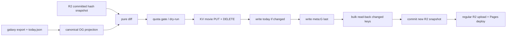

# Phase 38 — OG Index KV 增量同步与配额保护

## 前置与目标

- 前置：Phase 37.6 完成 scheduled nightly 健康验收，确保本 Phase 从稳定生产基线开始。
- 最近成功 monthly 实际写入 `61,533` 个 KV key、62 个 bulk 批次，而 `merged_pending_count=0`；本 Phase 消除这种无差别覆盖。
- 目标：nightly 与 monthly 都按 OG 最小字段投影计算差异，只写新增或变化 key、删除消失 key，并保留 `today` / `meta:G` 控制键语义。
- Cloudflare bulk 继续用于降低 HTTP 请求数；额度按实际变更 key 数计算。



## 范围边界

### 本 Phase 要做

- 建立 OG 投影、稳定哈希、快照 schema 和纯函数 diff。
- 在 R2 保存 gzip hash 快照，作为上次成功 KV 提交的发布状态。
- KV 支持增量 PUT、DELETE、read-back，控制键最后提交。
- 把 KV 同步从 [scripts/cron/nightly_vote_refresh.py](scripts/cron/nightly_vote_refresh.py) 和 [scripts/cron/monthly_refit.py](scripts/cron/monthly_refit.py) 移到 workflow 独立发布步骤。
- 增加 dry-run、写入/删除配额门槛、首次远端只读审计 bootstrap 和生产验收。
- 更新流水线 SSOT 与 P34.3/P18.6b 运维指南。

### 本 Phase 不做

- 不修改 `themoviecosmos-og-worker`；继续使用 `movie:{id}`、`today`、`meta:G`。
- 不把一部电影拆成一次 HTTP 请求；变化 key 仍合并为 bulk 请求。
- 不引入 generation-scoped movie key，不追求 KV 跨 key 强事务；接受 Cloudflare KV 最终一致性，并通过小增量、`meta:G` 最后提交和 read-back 缩短不一致窗口。
- 不把 `meta:G` 拆成独立 OG generation；缓存身份解耦留作后续优化。
- 不自动退化为 full sync，不因快照缺失或损坏静默覆盖 6.1 万 key。
- 不运行全量数据重建；实现验证使用 fixture、现有导出或 Action artifact。

## 已确认设计

### D1 · OG projection 是 diff 的唯一比较边界

新增 [scripts/cron/og_index_state.py](scripts/cron/og_index_state.py)，复用 [scripts/cron/og_index_kv.py](scripts/cron/og_index_kv.py) 的 `movie_og_record()` 语义，把每部电影规范化为仅含：

- `title`
- `release_date`
- `genres`
- `poster_url`

规范化 JSON 固定 key 顺序和分隔符，再计算 SHA-256。票数、评分、热度、XYZ、更新时间等变化不得触发 `movie:*` 写入。

### D2 · R2 snapshot 是 writer checkpoint，不是运行时数据

快照默认写入 `ops/og-index/state-v1.json.gz`，不进入前端 manifest、不由 Worker 读取，并设置 `Cache-Control: no-store`。schema 至少包含：

```json
{
  "schema_version": 1,
  "projection_version": "og-index-v1",
  "source_data_version": "2026.07.15.monthly.9",
  "committed_at": "...",
  "movie_count": 61531,
  "movie_hashes": {
    "movie:301334": "sha256..."
  },
  "control": {
    "today_value": "{...}",
    "meta_g_value": "..."
  }
}
```

快照缺字段、数量不一致、未知 schema/projection version、重复或非法 key 均快速失败；不得据此执行删除。

### D3 · 增量提交顺序与失败恢复

增量 diff 产生 `puts`、`deletes`、`unchanged`：

1. 所有 `movie:*` PUT。
2. 所有消失 `movie:*` DELETE。
3. `today` 变化时写入。
4. `meta:G` 变化时最后写入。
5. 批量读回本次变化/删除 key 与控制键，核对实际值。
6. 全部成功后才覆盖 R2 committed snapshot。

任一 KV 批次、read-back 或 R2 snapshot 提交失败都不吞错。旧快照保留，下一次按旧状态幂等重放；不得推进错误 checkpoint。

### D4 · 配额门槛先于第一笔写入

默认保护：

- `OG_INDEX_MAX_PUTS=900`
- `OG_INDEX_MAX_DELETES=900`
- PUT 数包含变化 movie 与控制键。
- DELETE 使用独立门槛，因为 Cloudflare 分别计算写入和删除额度。

超限时在第一笔 HTTP 写入前失败，日志输出 current/previous/put/delete/unchanged/batch 数和有限 sample key。只有人工 CLI 可显式覆盖门槛；scheduled workflow 禁止自动 full fallback。

### D5 · 首次切换使用远端只读审计 bootstrap

现有 namespace 已有成功 full sync，但没有 snapshot。首次生产切换采用显式 `remote-audit`：

- 分页列出远端 `movie:*` key。
- 每批最多 100 key 读取值，解析并按当前 projection 重新规范化、计算 hash。
- 与当前导出比较，得到真实 PUT/DELETE，而不是假设远端一致。
- 差异在配额门槛内时按正常增量协议修正并提交首份 R2 snapshot；超过门槛则停止并等待人工决策。
- 审计约读取 6.1 万 key；只在人工 gate 执行一次，不进入 scheduled nightly。

后续 snapshot 缺失、损坏或 projection version 变化时，scheduled run 必须失败并提示重新执行人工 audit，不自动重建。

### D6 · 计算层与发布层分离

- [scripts/cron/nightly_vote_refresh.py](scripts/cron/nightly_vote_refresh.py) 和 [scripts/cron/monthly_refit.py](scripts/cron/monthly_refit.py) 只负责 Supabase、export、validate、`today.json`，不 import KV 模块、不持有 KV/R2 发布凭据。
- [scripts/cron/sync_og_index_kv.py](scripts/cron/sync_og_index_kv.py) 作为独立发布适配器，拥有完成“R2 checkpoint + KV mutation”所需的最小凭据。
- [.github/workflows/nightly_vote_refresh.yml](.github/workflows/nightly_vote_refresh.yml) 与 [.github/workflows/monthly_refit.yml](.github/workflows/monthly_refit.yml) 在计算成功后、常规 R2 upload/prune 前执行同一个 incremental CLI。
- `--scope full` 仅保留为显式灾难恢复能力，scheduled workflow 不调用。

## 工作拆分

### 38.1 `[domain]` OG 投影、快照 schema 与纯函数 diff

- 新增 [scripts/cron/og_index_state.py](scripts/cron/og_index_state.py)：canonical JSON、SHA-256、snapshot schema 校验、`build_snapshot()`、`diff_snapshots()`。
- 保证输入顺序不影响 hash；无关 galaxy 字段变化不产生 PUT。
- 输出 current/previous/put/delete/unchanged 数量并断言集合互斥、并集与当前/旧 key 集一致。

验收：

- 新增、OG 字段变化、删除、完全相同四类 diff 精确。
- `vote_count`、`vote_average`、`popularity`、XYZ 单独变化时 movie PUT 为 0。
- 非法 schema/projection/key/hash 快速失败且不产生 mutation plan。

### 38.2 `[adapters]` KV 增量传输与 R2 snapshot repository

- 扩展 [scripts/cron/og_index_kv.py](scripts/cron/og_index_kv.py)：bulk DELETE、bulk GET/read-back、分页 list；保留现有 bulk PUT 与 dedicated token 优先级。
- 新增 [scripts/cron/og_index_snapshot_r2.py](scripts/cron/og_index_snapshot_r2.py)：读取可选 gzip snapshot、schema 校验、候选快照 gzip、成功后覆盖写入。
- R2 404 与损坏采用不同错误类型；404 只允许显式 bootstrap，损坏一律停止。
- 网络测试全部使用 stub，不访问真实 Cloudflare。

验收：

- PUT/DELETE/GET/list 的分页、批大小、403/404/429/超时均有可定位错误。
- snapshot 上传失败不破坏旧对象语义；invalid snapshot 不执行删除。
- read-back 能验证变化值与删除结果。

### 38.3 `[orchestration]` Incremental CLI、dry-run、配额与 bootstrap

- 重构 [scripts/cron/sync_og_index_kv.py](scripts/cron/sync_og_index_kv.py)，默认模式改为 `incremental`。
- 增加 `--dry-run`、显式 `--bootstrap-remote-audit`、配额参数和机器可检索 summary。
- dry-run 完成完整投影、快照读取、diff 和门槛判断，但执行 0 KV mutation、0 snapshot 覆盖。
- 正常模式严格执行 D3；full recovery 必须同时给出显式授权参数，不能由快照异常触发。

验收：

- 无变化时 movie mutation 为 0；控制键仅在值变化时写入。
- 超限、部分 PUT/DELETE 失败、控制键失败、read-back 失败、snapshot commit 失败均不推进快照。
- 重跑同一 candidate 幂等；日志不输出 token、R2 secret 或完整 61k key 列表。

### 38.4 `[pipeline]` Nightly/monthly 独立发布步骤

- 从 [scripts/cron/nightly_vote_refresh.py](scripts/cron/nightly_vote_refresh.py) 与 [scripts/cron/monthly_refit.py](scripts/cron/monthly_refit.py) 删除 KV import/call和 KV warning；保留 export/validate/today 边界。
- 更新 [.github/workflows/nightly_vote_refresh.yml](.github/workflows/nightly_vote_refresh.yml) 与 [.github/workflows/monthly_refit.yml](.github/workflows/monthly_refit.yml)：
  - 计算步骤只接收 Supabase/Kaggle 凭据。
  - 新增独立 `Sync OG index KV incrementally` 步骤，注入 KV dedicated token 与 R2 snapshot 所需凭据。
  - 同步完成后才执行现有 `upload_galaxy_r2.py` 和 prune。
  - `workflow_dispatch` 增加一次性 bootstrap audit 输入；schedule 永远使用 incremental。
- 更新 [scripts/tests/test_og_pipeline_phase34.py](scripts/tests/test_og_pipeline_phase34.py) 或新增 Phase 38 workflow contract test，锁定“计算层无 KV、workflow 有独立 sync step、sync 在 prune 前”。

验收：

- nightly/monthly 使用同一增量入口，不再存在 daily/full 行为漂移。
- 缺 snapshot 的 scheduled run 明确失败，不静默 skip 或 full sync。
- 缺完整发布凭据时 sync step 明确失败；不把未同步状态当作成功部署。

### 38.5 `[tests+docs]` 回归、fixture dry-run 与 SSOT 对齐

- 新增 [scripts/tests/test_og_index_state.py](scripts/tests/test_og_index_state.py)、[scripts/tests/test_sync_og_index_kv.py](scripts/tests/test_sync_og_index_kv.py)、[scripts/tests/test_og_index_snapshot_r2.py](scripts/tests/test_og_index_snapshot_r2.py)。
- 扩展 [scripts/tests/test_og_index_kv.py](scripts/tests/test_og_index_kv.py) 和 cron/workflow 边界测试。
- 使用合成 61k hash fixture 验证内存、gzip 大小和 diff 时间；不读取 raw CSV、不调用真实 KV/R2。
- 更新：
  - [docs/project_docs/TMDB 电影宇宙 Data Pipeline.md](docs/project_docs/TMDB%20电影宇宙%20Data%20Pipeline.md)
  - [docs/guides/P34.3 OG Index KV 上线操作指南.md](docs/guides/P34.3%20OG%20Index%20KV%20上线操作指南.md)
  - [docs/guides/P18.6b Cloudflare R2 上线操作手册.md](docs/guides/P18.6b%20Cloudflare%20R2%20上线操作手册.md)
  - [.env.example](.env.example)
- 文档明确 bootstrap、配额、失败恢复、full disaster recovery 和 Worker 不变契约。

验证：

- 运行相关 `python -m pytest scripts/tests/...`。
- fixture dry-run 输出预期 put/delete/unchanged 且 0 网络 mutation。
- 不运行昂贵 monthly UMAP 或全量数据重建。

### 38.6 `[GATE]` 远端 bootstrap、生产增量与 scheduled nightly `[需人工验收]`

执行顺序：

1. 在合并前用当前 Action artifact 执行 dry-run，确认 projection count 与 export movie count 一致。
2. 获得生产授权后，通过 `workflow_dispatch` 执行一次 `remote-audit` bootstrap；记录远端/current/mismatch/put/delete/read 数，不记录 key 全表。
3. 若差异超过门槛，停止，不绕过保护；先定位远端为何漂移。
4. 审计及小差异修正成功后，确认 R2 snapshot 存在、schema/count/data version 正确。
5. 验证 `/og/movie/{sample}.png`、`/og/today.png` 与 `/movie/{sample}` meta 正常，Worker 无需部署。
6. 验收下一次 scheduled nightly：movie PUT/DELETE 符合真实增量，`today`/`meta:G` 正常，snapshot 前进，R2/Pages/production smoke 全绿。
7. 在 Cloudflare usage 中确认 monthly 不再产生约 61k 全量写入。
8. 人工 Go 后更新 canonical plan 状态，并写入 [docs/reports/Phase 38 P38 KV 增量同步与配额保护 实施报告.md](docs/reports/Phase%2038%20P38%20KV%20增量同步与配额保护%20实施报告.md)。

未获人工 Go 前，不将 38.6 标为 complete，不写最终报告，不执行发布交付。

## Phase 38 验收标准

- Nightly 与 monthly 都只按 OG projection 差异写 KV。
- 无关票数/坐标变化不会触发 `movie:*` 写入。
- 增量仍使用 bulk；HTTP 请求数与 key 写入数均随 delta 缩小。
- `meta:G` 最后提交，变化 key 经 read-back 后才更新 R2 snapshot。
- Snapshot 缺失/损坏、超配额或部分失败均快速失败，不自动 full sync。
- 计算脚本不持有 KV/R2 发布职责；workflow 发布步骤边界清晰。
- 首次 bootstrap 不重写 6.1 万 key，远端审计结果可复现。
- 下一次 scheduled nightly 和 OG Worker production smoke 通过。

## Phase 38 交付物

- `.cursor/plans/phase_38_og_index_kv_incremental_sync.plan.md`
- OG projection/hash/diff domain module。
- KV PUT/DELETE/read-back 与 R2 snapshot adapters。
- 独立 incremental sync CLI 和 nightly/monthly workflow 接线。
- 聚焦测试、fixture dry-run 与更新后的 Data Pipeline/P34.3/P18.6b 文档。
- `docs/reports/Phase 38 P38 KV 增量同步与配额保护 实施报告.md`。