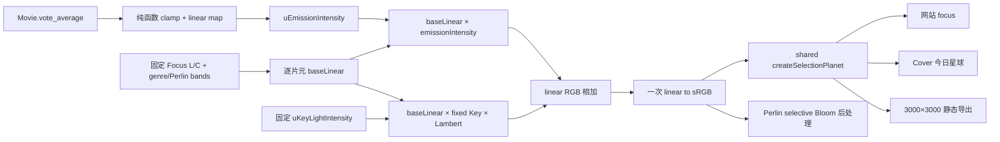

# Phase 39 — Focus 评分自发光、颜色空间与三端视觉统一

## 前置与目标

- 非 focus 的 idle / active / select 继续使用现有评分 → OKLab Lightness 映射，不改 [`frontend/src/lib/colorMath.ts`](frontend/src/lib/colorMath.ts) 与宏观 galaxy shader 的视觉语义。
- focus Perlin 星球改为固定基础 Lightness/Chroma；`vote_average` 只进入独立的评分 → Emission 强度线性函数，不再改变 Focus 的基础 L 或 Key Light。
- Emission 使用 Perlin/genre band 合成后的逐片元局部底色：蓝色区域发蓝光，黄色区域发黄光，不叠加白色 Emission 改写局部色相。
- 不引入 Three.js `PointLight` / `DirectionalLight`；固定 Key Light 仍由 [`frontend/src/three/shaders/perlin.frag.glsl`](frontend/src/three/shaders/perlin.frag.glsl) 的中性 Lambert uniform 模型实现，只负责球体、地形和 band 塑形。
- 网站 focus、Cover 今日星球、静态星球导出继续共同消费 [`createSelectionPlanet()`](frontend/src/three/planet.ts)，不得形成三套参数或分支。
- [`FocusLReference`](frontend/src/hud/FocusLReference.tsx) 与 [`FocusSizeReferenceRings`](frontend/src/three/FocusSizeReferenceRings.ts) 完整退役，不保留隐藏渲染、每帧同步、Store 快照、locale 接口或旋转命名依赖。



## 范围边界

### 本 Phase 要做

- 建立可测试纯函数 `focusEmissionIntensityFromVoteAverage(voteAverage, minIntensity, maxIntensity)`；输入评分先 clamp 到 `0…10`，再线性映射到明确的最低/最高 Emission 强度。
- 将 focus appearance 收敛为固定 `lightness/chroma/keyLightIntensity`、genre hues 和评分派生 `emissionIntensity`；删除 focus 对宏观 galaxy Lightness uniform 快照的依赖。
- 删除与同色 Emission 数学重复的独立 ambient 参数；最低可见辐射由 `emissionIntensityMin` 承担。
- 把 Perlin 颜色流程改为：OKLab/OKLCH → 逐片元 `baseLinear` → 局部底色 Emission + 固定 Lambert Key → 单次 sRGB 输出。
- 更新共享视觉默认值与 `planetVisualConfigHashInput()`，使 Emission 曲线端点、固定 Key 和颜色空间语义参与导出 hash。
- 删除两个旧 Reference 及其 scene/HUD/store/CSS/i18n/test 边界；保留并去除旧术语后的确定性星球姿态与自转。
- 完成自动化检查、同一 movie fixture 的受控低/中/高评分矩阵、真实样本验证、3000×3000 导出检查和人工视觉 Gate。

### 本 Phase 不做

- 不改 `Movie` / `Meta` 数据类型、Python pipeline、后端或 `galaxy_data.json`。
- 不改 vote_count → size、focus 半径、拾取、相机、地形噪声、genre band、星球自转和宏观状态机行为。
- 不让 focus 新曲线反向影响 idle / active / select，也不强行复用宏观 Lightness 曲线。
- 不让评分驱动 Key Light；不预埋 E+K 运行时模式、隐藏开关、第二条评分曲线或入口专属参数。
- 不新增独立 emissive buffer、GI、AO 或让星球照亮其他对象；本 Phase 的“自发光”指星球自身逐片元辐射与现有 selective Bloom 表现。
- 不默认开启全局 Bloom，不让 idle / active 粒子进入 Perlin selective Bloom。
- 不用 CSS 隐藏代替 Reference 退役，不保留“以后可能再用”的运行时死接口。

## 已确认设计

### D1 · Focus 与宏观评分视觉分层

- 宏观层：保持现有 `lightnessFromVoteAverage()` 和 galaxy shader 参数不变。
- Focus 层：[`frontend/src/three/planetAppearance.ts`](frontend/src/three/planetAppearance.ts) 独立计算 `emissionIntensity`；基础 Lightness/Chroma 与 Key Light 读取共享 focus defaults，不再读取 `PlanetGalaxyColorSnap`。
- `PlanetAppearance` 明确包含 `lightness`、`chroma`、`emissionIntensity`、`keyLightIntensity`。评分不得再写入 `uPerlinL` 或 `uKeyLightIntensity`。
- `keyLightIntensity` 保留在 appearance 中作为最终视觉状态的一部分，但对所有评分保持固定且由共享 defaults 提供。

### D2 · 独立 Emission 线性曲线

采用以下纯函数语义：

```ts
const t = clamp(voteAverage, 0, 10) / 10
return minIntensity + t * (maxIntensity - minIntensity)
```

- `emissionIntensityMin`、`emissionIntensityMax` 是 [`PLANET_VISUAL_DEFAULTS`](frontend/src/three/planetVisualDefaults.ts) 中可序列化的 Focus 自发光参数；`keyLightIntensity` 是独立的固定标量。
- 函数对非有限评分、非有限端点、负端点、`maxIntensity < minIntensity` 快速失败；只对有限的越界评分执行 clamp，不静默修复非法配置。
- `vote_average=0` 精确得到 min，`10` 精确得到 max；相等端点合法，用于固定 Emission 的诊断对照。
- Emission 端点与固定 Key 的最终数值由 39.8 人工 Gate 固化。实现阶段记录候选值和截图，不把临时 console patch 当发布配置。

### D3 · 局部底色自发光、固定 Key 与单次终点转换

[`frontend/src/three/shaders/perlin.frag.glsl`](frontend/src/three/shaders/perlin.frag.glsl) 调整为：

1. genre hue + 固定 L/C 转成 linear RGB；只在底色边界处理 gamut/负通道安全。
2. Perlin/genre band 完成逐片元合成后得到 `baseLinear`；Emission 必须使用这份最终局部底色，而不是统一白色、单一 genre 色或 band 合成前的中间色。
3. 在线性 RGB 中计算：

```glsl
vec3 emissiveLinear = baseLinear * uEmissionIntensity;
vec3 keyLitLinear = baseLinear * uKeyLightIntensity * lambert;
vec3 litLinear = emissiveLinear + keyLitLinear;
```

4. `uKeyLightIntensity` 是中性固定主光标量；不同评分不得改变它。删除独立 `uAmbient`，不得同时保留 `baseLinear * ambient` 与同色 Emission 两个不可辨识项。
5. 保留现有导数法线、几何法线混合、band 选择、alpha 和 lighting enable 诊断行为；关闭/开启 lighting 仍共用同一个颜色空间输出边界，不创建第二条 sRGB 分支。
6. 片元末尾只调用一次 `linear_to_srgb`；不得在相加或乘光前 gamma encode，也不得再叠加 `colorspace_fragment` 等第二次转换。
7. 保留高于 1 的 Emission/受光结果供 selective Bloom 使用，只防止负值进入 gamma；是否需要上限处理以现有 SDR/Bloom 合成实测为准，不能提前截断亮部层级。

### D4 · 三个入口只有一个视觉 SSOT

- [`frontend/src/three/planetVisualDefaults.ts`](frontend/src/three/planetVisualDefaults.ts) 保存固定 L/C、Emission 最低/最高强度、固定 Key 强度/方向和颜色流程版本；不再保存独立 ambient 或 Key 最低/最高端点。
- [`frontend/src/three/planet.ts`](frontend/src/three/planet.ts) 的 `setFromMovie()` 不再接收 galaxy Lightness 快照；网站 focus 与 Cover 的 [`frontend/src/three/scene.ts`](frontend/src/three/scene.ts)、导出的 [`frontend/src/planet-export/renderPlanetImage.ts`](frontend/src/planet-export/renderPlanetImage.ts) 调用同一简化接口。
- 三个入口只能通过 `resolvePlanetAppearance()` 获得评分派生 Emission 和固定 Key，不得自行重建评分函数、端点或局部颜色。
- `PLANET_VISUAL_DEFAULTS.schemaVersion` 升级，增加明确的 Emission/color-pipeline version 标识；[`frontend/src/planet-export/main.ts`](frontend/src/planet-export/main.ts) 继续把完整配置写入 `visualHash`，使 [`tools/planet-exporter/src/browser.ts`](tools/planet-exporter/src/browser.ts) 生成新的 `visual_config_hash`，旧图不能被误判为相同配置。

### D5 · E+K 是 Gate 未通过后的独立决策

- Phase 39 的唯一生产候选是 `E(rating) + KFixed`，不同时实现 `K(rating)`，避免在同一轮引入两条评分曲线和四个可调端点。
- 若 39.8 仅发现亮度范围或 Bloom 问题，继续一次只调整一个 Emission 端点、固定 Key 或既有 Bloom 参数，不以评分 Key 掩盖问题。
- 若受控矩阵证明高 Emission 必然抬平地形、而固定 Key 无法同时满足低/高评分，39.8 保持 pending：尚未交付时新增明确的后续 TODO 评估 E+K；若当前视觉契约已经交付或需要重新定义，则另开后续 Phase。
- 后续 E+K 必须有自己的纯函数、hash 版本和人工 Gate，不在本 Phase 预留隐藏运行时分支。

### D6 · Reference 完整退役，但不误删自转

- 删除 [`frontend/src/hud/FocusLReference.tsx`](frontend/src/hud/FocusLReference.tsx)、[`frontend/src/three/FocusSizeReferenceRings.ts`](frontend/src/three/FocusSizeReferenceRings.ts) 及专属测试。
- 从 [`frontend/src/App.tsx`](frontend/src/App.tsx) 移除 HUD 挂载；从 [`frontend/src/three/scene.ts`](frontend/src/three/scene.ts) 移除 ring 创建、scene 挂载、每帧更新、dispose 和 `focusLightnessSnap` 写入。
- 从 [`frontend/src/store/galaxyInteractionStore.ts`](frontend/src/store/galaxyInteractionStore.ts) 删除 `FocusLightnessSnap` 与 `focusLightnessSnap`。
- 从 [`frontend/src/lib/strings.ts`](frontend/src/lib/strings.ts) 和所有 locale bundle 删除 `focusLReference` / `focusVoteReference`；运行 locale schema parity 测试。
- 删除 [`frontend/src/index.css`](frontend/src/index.css) 的专属 `--hud-focus-ref-*` token。
- 若 [`frontend/src/lib/galaxyVoteSize.ts`](frontend/src/lib/galaxyVoteSize.ts) 的 tier/ring helpers 已无消费者，则连同专属测试删除；不删除仍被真实粒子尺寸逻辑消费的代码。
- [`frontend/src/three/selectionPlanetRotation.ts`](frontend/src/three/selectionPlanetRotation.ts) 保留确定性姿态、自转轴、自转速度和 quaternion 行为，但将 `REFERENCE_RING_*` / `RingPlane` 术语改为 planet-local spin/base-orientation 术语，并用测试锁定数值行为不变。

## 工作拆分

### 39.1 `[contract]` 锁定现状与非 focus 不变量

**依赖：** 无。

- 在 [`frontend/src/three/planetCore.spec.ts`](frontend/src/three/planetCore.spec.ts) 和必要的 colorMath 聚焦测试中记录代表性评分输入、现有宏观 Lightness 输出与当前 Focus `uPerlinL/uAmbient/uDiffuse`（或实际等价命名）uniform 契约。
- 使用已有 `renderMode=basic` 路径先确认几何、相机、可见性和 3000×3000 canvas 基线，避免把传值/坐标问题误判为 shader 问题。
- 记录网站 focus、Cover、导出当前截图/metadata 与旧 `visual_config_hash`；选择一个可清楚观察两种局部颜色和地形的固定 movie fixture，并记录真实低/中/高评分样本 ID 供后续二级验证。

**验收：**

- 非 focus 代表性评分 → Lightness 输出被测试锁定。
- 当前 Focus 的 ambient/key/base-L uniform、基础材质 smoke、三端截图和旧 visual hash 已记录。
- 固定 movie fixture、受控评分值与真实样本清单可复现；基线只记录，不在本 TODO 调视觉参数。

### 39.2 `[domain]` 建立评分 → Emission 强度线性纯函数

**依赖：** 39.1。

- 在 [`frontend/src/three/planetAppearance.ts`](frontend/src/three/planetAppearance.ts) 建立 `focusEmissionIntensityFromVoteAverage()` 和必要的输入校验。
- 在 [`frontend/src/three/planetVisualDefaults.ts`](frontend/src/three/planetVisualDefaults.ts) 增加固定 Focus Lightness/Chroma、`emissionIntensityMin/Max` 与固定 `keyLightIntensity`；删除独立 ambient 和 Key 曲线端点配置。
- 测试 `0/5/10`、有限越界评分 clamp、端点精确值、线性、单调性、相等端点，以及非有限评分/端点、负端点、倒置端点快速失败。

**验收：**

- `vote_average=0` 精确得到 min，`10` 精确得到 max，区间内严格线性且单调不降。
- 新函数不 import 或调用 `lightnessFromVoteAverage()`，也不计算或返回 Key Light。
- Emission 端点、固定 L/C 与固定 Key 均可序列化并进入 visual hash。

### 39.3 `[appearance+uniform]` 固定 Focus L/C 与 Key 并让评分只驱动 Emission

**依赖：** 39.2。

- 扩展 `PlanetAppearance.emissionIntensity/keyLightIntensity`；`lightness/chroma/keyLightIntensity` 固定读取 Focus visual defaults，只有 `emissionIntensity` 读取评分映射结果。
- 将 `uDiffuse` 收敛为固定语义的 `uKeyLightIntensity`，新增 `uEmissionIntensity`，删除独立 `uAmbient`；`setFromMovie()` 按电影评分只写 Emission，`uPerlinL` 与 Key 始终写固定值。
- 删除 `PlanetGalaxyColorSnap`、`setFromMovie(..., galaxyColor)` 参数，以及 [`frontend/src/three/scene.ts`](frontend/src/three/scene.ts) 从 galaxy uniforms 每帧同步 `uLMax/uHuntGamma/uHuntApplyMask` 的耦合；若 Hunt 色度保护仍保留，只读取 Focus defaults，不跟随宏观 runtime 调参。
- 更新现有 `[Planet]` 日志，输出 `vote_average`、固定 L/C、映射后的 Emission 和固定 Key；断言 uniform 有限、Emission 位于端点范围、Key 等于共享配置。

**验收：**

- 对同一 movie fixture 仅替换低/中/高评分时，`uPerlinL`、Chroma 与 `uKeyLightIntensity` 完全相同，只有 `uEmissionIntensity` 按线性函数单调变化。
- 网站 focus、Cover、导出调用 `setFromMovie()` 时不再传宏观 Lightness 快照，也不自行写 Emission/Key。
- 修改 `window.__galaxyColor` 不再改变已定义的 Focus 基础 L/C、Emission 曲线或固定 Key。

### 39.4 `[shader]` 实现逐片元局部底色 Emission、linear RGB 固定主光与单次 sRGB 输出

**依赖：** 39.3。

- 重构 [`frontend/src/three/shaders/perlin.frag.glsl`](frontend/src/three/shaders/perlin.frag.glsl)：底色函数返回 linear RGB，band 合成得到逐片元 `baseLinear`，再按 D3 公式计算 `emissiveLinear + keyLitLinear`。
- 保留现有导数法线、几何法线混合、band 选择、alpha 和 lighting enable 诊断行为。
- 增加 shader contract 测试，锁定局部底色 Emission、固定 Lambert Key、“先在线性空间合成、后单次 `linear_to_srgb`”、无 ambient 重复项和 Bloom 前不截断 HDR。

**验收：**

- 蓝/黄等每个局部区域均以自己的 `baseLinear` 计算 Emission；不存在白色 Emission 或统一 genre 色覆盖局部 band。
- shader 中没有“sRGB base × shade”，也没有 `baseLinear * ambient + baseLinear * emission` 两个等价方向无关项。
- `linear_to_srgb` 只位于最终输出边界；关闭/开启 lighting 共用该边界。
- 受控评分提高时暗面与受光面输出均单调不降，Key 项保持不变；高于 1 的正值在 Bloom 前不被提前截断。

### 39.5 `[shared consumers+hash]` 统一网站 Focus、Cover 与静态导出

**依赖：** 39.3–39.4。

- 简化 [`frontend/src/three/scene.ts`](frontend/src/three/scene.ts) 的普通 focus 与 Cover today 初始化，两者只提供 movie/palette/radius。
- 简化 [`frontend/src/planet-export/renderPlanetImage.ts`](frontend/src/planet-export/renderPlanetImage.ts) 的 `prepareExportPlanet()`，不得自行重建评分、Emission、Key 或 Lightness 参数。
- 升级 [`PLANET_VISUAL_DEFAULTS`](frontend/src/three/planetVisualDefaults.ts) schema/Emission/color-pipeline 标识；扩展 [`frontend/src/three/planetCore.spec.ts`](frontend/src/three/planetCore.spec.ts)、[`frontend/src/planet-export/planetExport.spec.ts`](frontend/src/planet-export/planetExport.spec.ts) 与 exporter metadata 测试。

**验收：**

- 三个入口均经 `resolvePlanetAppearance()` → `createSelectionPlanet()`，不存在入口专属 Emission 端点、固定 Key 或颜色转换。
- 新配置生成的新 `visual_config_hash` 与基线不同；同配置重复导出 hash 稳定；修改 Emission 端点、固定 Key 或颜色流程版本会改变 hash。
- 3000×3000 Bloom ON 导出使用与网站相同的固定 L/C、评分 Emission、固定 Key 和逐片元局部色公式。

### 39.6 `[retirement]` 完整退役两个旧 Reference

**依赖：** 39.5。

- 按 D6 删除 HUD、Three scene object、Store snapshot、每帧更新、CSS token、locale keys、专属尺寸 tier helper 与测试。
- 同步删除全部 7 个 locale bundle 的对应键，保持 [`en.json`](frontend/src/lib/locales/en.json) SSOT 与其他 bundle 同构。
- 重命名旋转模块中的 ring/reference 术语，保持 seeded 姿态、自转轴、速度与运行时自转逻辑不变。
- 全仓搜索确保生产代码、类型、测试和文档待更新列表中没有 Reference 运行时消费者。

**验收：**

- `App` 不挂载 Reference；scene 不创建、更新或 dispose rings；Store 不保存 `focusLightnessSnap`。
- locale schema parity 通过，`strings.ts` 不再暴露旧文案接口。
- 自转相关测试证明退役 rings 前后同一 movie ID 的姿态和转速不变。

### 39.7 `[verification]` 自动化回归、受控评分矩阵与导出一致性

**依赖：** 39.1–39.6。

- 运行聚焦 Vitest：planet appearance、shader contract、rotation、export、locale schema。
- 运行 `npm test`、`npm run lint`、`npm run build`（工作目录 [`frontend`](frontend)）。
- 运行 [`tools/planet-exporter`](tools/planet-exporter) 的 test/typecheck。
- 在测试/导出验证层对 39.1 的同一 movie fixture 仅覆盖 `vote_average` 为低/中/高三个值，保持 movie ID、genre、Perlin seed、姿态、相机、L/C 和 Key 不变；各导出 3000×3000 Bloom OFF 与 Bloom ON PNG、`.render.json`。
- 再对真实低/中/高评分样本导出 3000×3000 Bloom ON 作为实际构图验证；真实样本不替代受控矩阵。
- 检查日志和 metadata 中的固定 L/C、单调 Emission、固定 Key 与新 visual hash；不读取 raw CSV，不运行 Python 全量数据重建。

**验收：**

- 自动化检查无新增错误，非 focus Lightness 测试保持 39.1 基线结果。
- 受控矩阵只改变评分与 Emission；固定 Key、种子、姿态、相机和其余视觉配置一致，输出可复现。
- Bloom OFF 能隔离验证表面 Emission/Key 层级；Bloom ON 能验证蓝/黄等局部颜色光晕且不改变 hash/config 归属。
- 所有导出尺寸、透明背景、metadata 与 hash 正确；相同输入重复导出稳定。

### 39.8 `[GATE]` Emission 低中高评分视觉验收与文档回写 `[需人工验收]`

**依赖：** 39.7。

1. 先检查同一 movie fixture 的受控低/中/高评分矩阵，确认只有 Emission 随评分单调增强，固定 L/C、Key、姿态、相机和局部 band 构图不变。
2. Bloom OFF 下检查暗面与受光面均随评分合理变亮；高评分不能因 Emission 过强而明显抬平地形、吞掉法线或让 genre band 不可读。
3. 检查蓝色区域保持蓝色自发光、黄色区域保持黄色自发光；允许 HDR/Bloom 引起的自然高光变浅与相邻光晕加色混合，但不能大面积漂白或失去局部色相身份。
4. 再检查真实低/中/高评分电影，确认受控结论在实际 genre、seed 和构图下成立；不同电影只作为实际覆盖，不用于证明单变量因果。
5. 对同一电影比较网站 focus、Cover 今日星球、3000×3000 Bloom ON 导出，确认基础色、Emission 层级、明暗关系和固定主光方向一致。
6. 分别开启/关闭 Perlin selective Bloom，确认 Bloom 增强自发光但不重新定义低/中/高亮度层级；必要时只调整一个 `emissionIntensityMin/Max` 端点、固定 `keyLightIntensity` 或既有 Bloom 参数，并记录候选值与截图。
7. 回到 idle / active / select 检查宏观评分亮度、色相、大小、拾取和状态切换无视觉回归。
8. 人工 Go 后固化 Emission 端点与固定 Key，更新 [`docs/project_docs/星球状态机 spec.md`](docs/project_docs/星球状态机%20spec.md) 及实际受影响的视觉映射说明，并写入 [`docs/reports/Phase 39 P39 Focus 评分自发光与颜色空间统一 实施报告.md`](docs/reports/Phase%2039%20P39%20Focus%20评分自发光与颜色空间统一%20实施报告.md)。

若 E(rating) + KFixed 因高评分地形抬平而 No-Go，不在本 TODO 内临时加入评分 Key 或隐藏模式：39.8 保持 pending，并按 D5 决定新增后续 TODO 或独立 Phase。未获人工 Go 前，不将 39.8 标为 complete，不宣称最终参数定稿，不写最终实施报告或执行发布交付。

## Phase 39 验收标准

- 非 focus 的评分 → OKLab Lightness 视觉与数值保持不变。
- Focus 基础 Lightness/Chroma 与 Key Light 固定，评分只通过独立线性函数控制逐片元局部底色 Emission。
- 蓝色、黄色等局部区域使用自身 `baseLinear` 发光，不以白色 Emission 或单一 genre 色覆盖 band。
- Perlin shader 在 linear RGB 中相加 Emission 与固定 Lambert Key，并只在输出边界转换一次 sRGB；不存在独立 ambient 重复项或 Bloom 前 HDR 截断。
- 网站 focus、Cover 今日星球、静态导出共用同一 appearance、uniform 与 visual defaults。
- visual hash 能识别 Emission 曲线、固定 Key 与颜色流程，旧导出不会误复用。
- `FocusLReference`、`FocusSizeReferenceRings` 及其运行时状态/更新/文案/测试契约彻底消失。
- 确定性姿态与自转保留；受控评分矩阵可复现，Bloom 不破坏评分亮度层级和局部色相身份。
- 自动化检查、3000×3000 导出矩阵和人工 Gate 全部通过。
- Phase 39 不包含评分驱动 Key；若固定 Key 模型 No-Go，按 D5 独立规划 E+K。

## Phase 39 交付物

- `.cursor/plans/phase_39_focus_lighting.plan.md`
- Focus 评分 → Emission 强度纯函数、固定 Key 与共享 visual defaults。
- 使用逐片元局部底色的 Perlin Emission + linear Lambert Key → 单次 sRGB shader。
- 三入口共用的 planet appearance/uniform 链路与新 visual hash。
- 两个 Reference 的完整退役 diff。
- 同一 movie fixture 受控低/中/高评分矩阵、真实样本导出、聚焦测试、状态机 spec 更新与 Phase 39 实施报告。