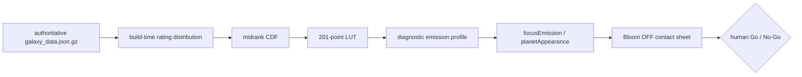

# Phase 41.5 — Focus Rating Emission: Midrank CDF + LUT Diagnostic Gate

## 前置与目标

- 前置：Phase 41.4 已锁定 Focus 的 Lightness、Key Light、方向与 `flatShadingMix=0.8`；Phase 41.5 的首个 anchored smoothstep 候选已生成 Bloom OFF 证据，但人工验收发现 `4.5–5.5` 的亮度变化不符合预期。
- 当前不把整个 41.5 判为 NOGO；将 anchored smoothstep 记录为 `candidate-no-go` 历史基线，在同一个父级 Gate 内验证新的数据分布驱动候选。
- 本次候选为 `rating-midrank-cdf-lut-v1`：构建/证据阶段从权威 `frontend/public/data/galaxy_data.json.gz` 统计 rating 分布，使用 midrank CDF 生成固定网格 LUT，运行时只做 LUT 线性插值。
- 本 TODO 只回答“数据分布驱动的 rating→emission 视觉规则是否成立”；如果 CDF + LUT 视觉通过，用户可将父级 41.5 标记为 pass，随后进入 41.6 Bloom ON 联调。
- monthly refit 的生产化、数据 schema、网站/exporter/diagnostics 三端发布契约、月间漂移检测和失败保护不属于本 TODO，另立后续 Phase。



## 范围边界

### 本 TODO 要做

- 保留现有 anchored smoothstep contact sheet、manifest、sidecar 与原始 PNG，作为不可覆盖的历史基线。
- 实现 `rating-midrank-cdf-lut-v1` 诊断 profile：midrank CDF、201 点 LUT、有限值/单调性/端点校验和运行时线性插值。
- 以相同 fixtures、相同固定造型和 Bloom OFF 生成 CDF + LUT 的完整视觉证据。
- 验证新旧候选之间除 `rating/emission` 外没有其他参数变化。
- 完成人工视觉 Gate，并根据结果决定父级 41.5 是否通过。

### 本 TODO 不做

- 不在本阶段修改 `frontend/src/types/galaxy.ts` 的生产 `Meta` schema。
- 不把 LUT 写入网页生产数据，不改变 `PLANET_VISUAL_DEFAULTS` 的生产曲线，不切换网站默认行为。
- 不实现 monthly refit、monthly smoothing、上月曲线比较或发布失败保护。
- 不在本阶段加入固定 rating anchor、exponent、CDF 混合权重或第二条运行时评分曲线。
- 不修改 Lightness、Chroma、Key、direction、`flatShadingMix`、Bloom 参数、shader 结构、相机、geometry 或 fixture 选择。
- 不进入 41.6 Bloom ON 联调，除非 CDF + LUT 通过本 TODO 的人工 Gate。

## 已确认设计

### D1 · Rating 只驱动 Focus Emission

- `lightness`、`chroma`、`keyLightIntensity`、`direction` 与 `flatShadingMix=0.8` 继续从固定视觉 profile 提供。
- Bloom OFF 是本 TODO 的唯一视觉状态。
- `frontend/src/three/planetAppearance.ts` 只消费 emission profile 并返回 `emissionIntensity`，不负责统计 rating 分布。
- `frontend/src/three/shaders/perlin.frag.glsl` 继续只消费 `uEmissionIntensity`；不新增 LUT texture 或 shader 分支。

### D2 · Midrank CDF 处理重复 Rating

当前数据的 rating 不是连续测量值，而是大量重复档位。普通经验 CDF 会在 `6.2`、`6.5` 等密集档位产生阶梯跳变，因此候选使用 midrank：

```text
percentile(rating) = (count(< rating) + 0.5 * count(= rating)) / N
```

- 输入样本必须来自最终会被渲染的电影集合，即权威前端 gzip 中的 `movies`。
- 统计阶段显式断言样本非空、有限且位于 `[0,10]`；不读取 raw CSV，不使用过期未压缩 JSON 作为权威输入。
- 纯 raw CDF 只允许作为机器诊断对照，不进入最终视觉候选。

### D3 · 固定网格 LUT 与运行时插值

- LUT 覆盖 `0.0..10.0`，步长 `0.05`，共 201 个采样点。
- LUT 输出范围保持当前诊断范围 `intensityMin=0.005`、`intensityMax=0.65`；本阶段不调整显示尺度。
- 运行时对 rating 执行 clamp，查找相邻 LUT 点并进行线性插值；低于 0 使用首点，高于 10 使用末点。
- LUT profile 具备明确的 `modelVersion`、`ratingMin`、`ratingMax`、`sampleStep`、`samples`、`intensityMin` 和 `intensityMax` 字段，便于写入 sidecar 与 visual diagnostics。
- 生成器和 evaluator 保持职责分离：构建/诊断入口生成 LUT，`focusEmission.ts` 提供校验与纯查表函数。

### D4 · Candidate 与 Production 隔离

- `tools/planet-exporter/src/p41EmissionEvidence.ts` 同时保留 anchored smoothstep 历史基线与 CDF + LUT 诊断候选。
- 新候选不得提前写入 `PLANET_VISUAL_DEFAULTS`，不得污染普通网站 URL/API 或生产数据加载路径。
- manifest/sidecar 必须记录 data version、movie count、curve model version、LUT step、intensity range、固定视觉 profile、Git commit 和可复制复现命令。
- 同一 gzip、同一 Git commit、同一 profile 重跑必须得到 byte-stable LUT/manifest；旧证据目录不得覆盖。

### D5 · 人工 Gate 与后续分流

- 人工重点检查：`4.5–5.5` 不出现不自然的局部跳变；`5.5–7.5` 层级连续且可辨；`6.0–7.0` 承担主要变化；`8.0+` 不过早挤成白核；低分主体仍由 Key 保持轮廓。
- CDF + LUT 通过表示 rating→emission 视觉规则通过，不表示 monthly refit 生产契约已经完成。
- CDF + LUT 失败时，父级 41.5 保持 pending；是否加入固定基线混合另行讨论，不在本 TODO 中隐式扩张候选。

## 工作拆分

### 41.5.1 `[contract]` 基线封存与候选边界

**依赖：** Phase 41.4；现有 P41.5 anchored smoothstep 证据。

- 保留 `data/runs/phase41/p41.5-emission-curve-bloom-off/` 现有 contact sheet、manifest、sidecar 与 PNG，不覆盖历史产物。
- 在 `tools/planet-exporter/src/p41EmissionEvidence.ts` 中将现有曲线标记为历史基线候选，并定义 `rating-midrank-cdf-lut-v1` 诊断候选。
- 固定权威数据版本、电影数量、`intensityMin/Max` 与 P41.4 approved fixed profile；记录新旧候选允许变化的字段只有 `rating/emission`。

**验收：**

- 基线目录仍可独立复现，原始 PNG/hash 未被覆盖。
- 新候选的 model version、数据输入和固定视觉 profile 已明确。
- 普通生产入口没有被接入新候选，`PLANET_VISUAL_DEFAULTS` 未提前改变。

### 41.5.2 `[domain+frontend]` Midrank CDF LUT 纯函数

**依赖：** 41.5.1。

- 在 `frontend/src/three/focusEmission.ts` 中增加 LUT profile 类型、有限值校验、采样点校验、midrank CDF 结果校验与 rating 查表插值函数；保留 anchored smoothstep evaluator 供历史对照。
- LUT 生成逻辑只接受已排序 rating 样本或构建期统计结果，显式断言样本非空、rating 范围为 `[0,10]`、LUT 长度为 201、rating 单调、emission 单调且端点精确。
- 在 `frontend/src/three/planetAppearance.ts` 中只接入统一 diagnostic profile，不把分布统计职责扩散到 appearance 模块。
- 不修改 shader 结构；Perlin fragment 继续消费单一 `uEmissionIntensity`。

**验收：**

- 重复 rating 使用 midrank，不产生 raw CDF 的整档跳变。
- rating 在 LUT 节点上和节点之间均能得到确定性结果。
- 越界 rating 正确 clamp；非法 profile、NaN/Infinity、错误长度和非单调样本快速失败。

### 41.5.3 `[tests+contract]` 自动测试、不变量与可复现证据

**依赖：** 41.5.2。

- 更新 `focusEmission` 及相关 planet appearance 测试，覆盖重复 rating、节点命中、节点间线性插值、端点、越界、NaN/Infinity、单调性和有限值。
- 更新 `tools/planet-exporter/src/p41EmissionEvidence.ts` contract/invariant，要求 Bloom OFF、固定 profile 和 declared variation 约束不变。
- 验证相同 gzip、相同 Git commit、相同 profile 重跑得到 byte-stable LUT/manifest。
- 将 data version、movie count、curve model version、LUT step、完整 profile 和 hashes 纳入机器证据。

**验收：**

- 前端聚焦测试、exporter 相关测试和类型检查通过。
- 自动断言证明 CDF LUT 具备确定性、有限值、单调性、端点精确性和重复 rating 处理。
- 不变量检查证明 rating 矩阵除 `rating/emission` 外没有其他视觉参数变化。

### 41.5.4 `[evidence]` Bloom OFF CDF + LUT 视觉证据

**依赖：** 41.5.3。

- 使用当前 P41.5 相同的真实 fixtures、hue/seed/genre 行、相机、分辨率和 Bloom OFF profile；只替换 rating emission profile。
- 评分列扩展为 `4.0/4.5/5.0/5.5/6.0/6.5/7.0/7.5/8.0/8.2/9.5`，覆盖当前数据最密集的 `5.5–7.5` 与 `6.0–7.0`。
- 输出独立候选目录，包含未缩放单格 PNG、sidecar、contact sheet、manifest、validation 和可复制复现命令。
- 保留 anchored smoothstep 与 CDF + LUT 的机器参数对照，但不在同一候选目录覆盖旧 evidence。

**验收：**

- contact sheet 图内有明确的候选、rating、emission、Bloom OFF 和固定 profile 标签。
- 每格 sidecar、manifest、PNG hash 和 validation 相互一致。
- 机器证据确认 Lightness、Key、direction、flat、Bloom、seed、hue、geometry 和 fixture 均未变化。

### 41.5.5 `[需人工验收]` Rating Emission Gate 与父级状态

**依赖：** 41.5.4。

- 以 CDF + LUT contact sheet 和任意原始 PNG 为主要人工验收入口；不得只依据缩放后的 contact sheet 判断最终结果。
- 如果 CDF + LUT 通过，将父级 41.5 视为通过候选 Gate，允许用户把 41.5 标记为 pass，并以该候选作为 41.6 Bloom ON 的输入。
- 如果 CDF + LUT 不通过，父级 41.5 保持 pending，不进入 41.6；后续固定基线混合方案需要新的明确决策。
- monthly refit 生产化另立后续 Phase，负责数据 schema、LUT 写入、网站/exporter/diagnostics 三端统一消费、月间漂移检测与失败保护。

**人工验收：**

- `4.5–5.5` 的亮度变化不再突兀。
- `5.5–7.5` 的主要人口密集区有连续、可辨识的层级。
- `6.0–7.0` 承担主要明度变化，但不出现局部刺眼跳变。
- `8.0+` 不过早挤成大面积白核；高分低票电影不异常刺眼。
- `<=4.5` 仍接近黑但由 Key 保持轮廓和地形可读性。

## 验证与交付

- 代码/测试阶段不更新父级 41.5 状态；只有 41.5.5 人工 Go 后才允许将父级 TODO 标记为 pass。
- 不在本计划内执行 monthly refit、全量 UMAP、远程发布、生产部署或删除历史证据。
- 若父级 41.5 通过，后续 Phase 仍需单独定义 monthly refit 的生产数据契约，不得把诊断 LUT 直接视为已发布能力。

## 风险控制

- raw CDF 只作为阶梯问题的机器对照，不进入视觉候选；正式候选使用 midrank CDF + LUT。
- 所有候选证据写入独立 ignored 目录；不覆盖 P41.5 anchored smoothstep 的原始 PNG、sidecar 或 manifest。
- 任何涉及固定造型、Bloom、相机、geometry 或 fixture 的变化都必须停止当前候选，回到最早不确定层，不允许混入 CDF Gate。
- 月度数据库变化可能改变分布曲线；本阶段只验证当前权威数据上的视觉效果，不对未来月份的生产稳定性做未经验证的承诺。