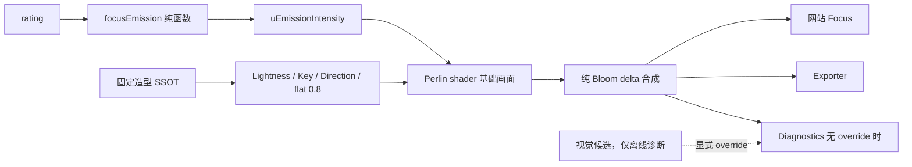

# Phase 41 · Focus 评分自发光、固定造型与 Bloom 联调

## 计划文件与范围

- 正式文件按既有命名落在 `e:/projects/chronicle_v3_3d_galaxy/.cursor/plans/phase_41_focus_rating_emission_lighting_bloom.plan.md`。
- 建立在 P39.10 的 `pure-bloom-delta-v1` 正确合成契约上；不重新拆 Bloom source。
- 评分只影响 `emission`。`lightness`、Key、光线方向、`flatShadingMix` 和 Bloom 参数均为全电影共享常量。
- `flatShadingMix = 0.8` 直接冻结，不进入候选扫描。
- Bloom OFF 是底色/地形/光照/Emission 的诊断基线；Bloom ON 是最终验收状态。ON 联调允许回调 `intensityMax` 或曲线高端。
- Bloom `strength/radius/threshold` 只做人工指定候选的受控比较，不自动扫 threshold，不以“核心平均亮度约 +8%”作为硬指标。
- 权威数据只读实际网页消费的 `frontend/public/data/galaxy_data.json.gz`；不使用同目录过期未压缩 JSON。

## 模块边界



- 新建 [`frontend/src/three/focusEmission.ts`](e:/projects/chronicle_v3_3d_galaxy/frontend/src/three/focusEmission.ts)，独立负责曲线类型、校验和纯映射；[`planetAppearance.ts`](e:/projects/chronicle_v3_3d_galaxy/frontend/src/three/planetAppearance.ts) 只负责把电影数据投影为材质输入，避免继续扩张位置参数。
- [`planetVisualDefaults.ts`](e:/projects/chronicle_v3_3d_galaxy/frontend/src/three/planetVisualDefaults.ts) 仍是生产视觉 SSOT；最终升级 schema，并保存唯一生产曲线和固定造型参数。
- Diagnostic override 只存在于 exporter 的离线证据入口，不进入普通网站 URL/API；每次 override 必须被校验、写入 visual hash 和 sidecar。无 override 时 diagnostics 必须与网站/exporter 共用 SSOT。
- 不保留 `exponent` 作为新生产接口。新模型采用 `vote-average-anchored-smoothstep-v1`，字段为 `ratingLowAnchor/ratingHighAnchor/intensityMin/intensityMax`；旧 P39 sidecar 作为历史证据保留，但运行时代码不维护双模型分支。

候选曲线定义为：先将评分按上下锚点 clamp 到 `[0,1]`，再应用 `t²(3−2t)`，最后映射到强度区间。首轮视觉候选使用 `low=4.5`、`high=8.2`、`min=0.005`、`max=0.65`；它不是生产锁定值。

## 视觉证据契约

新增 [`tools/planet-exporter/src/contactSheet.ts`](e:/projects/chronicle_v3_3d_galaxy/tools/planet-exporter/src/contactSheet.ts) 和 CLI 入口，复用现有 `sharp`：

- 输入 manifest 明确 `title`、有序行/列 key 与 label、每格 `input/caption/parameters`。
- 在生成前快速失败：输入缺失、重复格、缺格、未知行列、尺寸/宽高比不一致。
- 固定排序和布局；PNG 图内显示总标题、行标签、列标签及每格 caption，不再依赖文件名猜语义。
- 同时原子输出 `contact-sheet.png` 与 `contact-sheet.manifest.json`；manifest 记录源图/输出 hash、尺寸、参数、Git commit 和可复制命令。
- 每个 `[需人工验收]` checkpoint 必须提供：contact sheet、所有未缩放单格 PNG、每格 `.render.json`、validation/manifest、复现命令。缺任一项不得请求 Go/No-Go。

统一证据目录：

```text
data/runs/phase41/<checkpoint>/
├─ contact-sheet.png
├─ contact-sheet.manifest.json
├─ validation.json
└─ cells/
   ├─ <cell>.png
   └─ <cell>.png.render.json
```

## Todo 41.1 · 基线冻结、评分统计与代表性 fixtures

- 从权威 gzip 生成可复现评分分布摘要，并断言数据版本、电影数、评分范围和非空样本；重点记录 `4.5–7.5`、P99、`>=9` 数量及 vote_count 分布。
- 扩展/替代 [`phase39Fixtures.ts`](e:/projects/chronicle_v3_3d_galaxy/tools/planet-exporter/src/phase39Fixtures.ts)，建立 Phase 41 fixtures：受控评分 `4.0/4.5/5.5/6.5/7.5/8.2/9.5`，以及覆盖不同 hue、seed、类型数量和高分低票异常的确定性真实样本。
- 记录当前 P39.11 生产配置和基线 PNG/hash；0/10 只保留为自动边界测试，不作为主要视觉优化对象。

**验收：** 同一 gzip 和 Git commit 重跑得到相同样本清单；过期未压缩 JSON 被拒绝；fixture 每格恰好一部电影且字段完整。

## Todo 41.2 · 通用 contact-sheet 工具

- 实现上述 contact-sheet 库、CLI、manifest schema、原子输出和单测，并在 [`package.json`](e:/projects/chronicle_v3_3d_galaxy/tools/planet-exporter/package.json) 增加稳定命令。
- 将 Phase 41 evidence generator 全部接入该工具；不要求追溯重写 P39 历史产物，但删除 Phase 41 内任何复制的 `writeContactSheet`。

**验收：** 正常矩阵输出有图内标签且 byte-stable；缺格、重复格、文件不存在、尺寸不一致均快速失败；PNG 与 manifest hash 相符。

## Todo 41.3 · 通用视觉诊断 profile 与不变量

- 建立单一 Phase 41 diagnostic profile，可显式覆盖 emission curve、Lightness、Key、direction 和 Bloom 参数；替代继续新增 `p3911Checkpoint*` 式专用渲染器。
- 普通 [`request.ts`](e:/projects/chronicle_v3_3d_galaxy/frontend/src/planet-export/request.ts) 不暴露这些视觉参数；诊断入口必须显式标记 `diagnostic_only`。
- sidecar/diagnostics 输出完整曲线、固定造型、Bloom、camera、seed、rotation 和 visual config hash。
- 增加矩阵不变量断言：每个实验只允许声明的变量变化；rating 行只能变化 `rating/emission`。

**验收：** 未声明参数、非法范围、NaN/Infinity、普通入口夹带诊断参数均失败；无 override 的三端配置 hash 一致。

## Todo 41.4 · Bloom OFF 固定造型 Gate [需人工验收]

按依赖顺序执行三个单变量 checkpoint，全部使用低 emission、Bloom OFF 和同一组 hue/seed fixtures：

1. 固定 Lightness/Key，比较侧后方 light direction 候选；批准后固定方向。
2. 固定方向/Key，比较 Lightness 候选；批准后固定 Lightness。
3. 固定方向/Lightness，比较 Key intensity 候选；批准后固定 Key。

每个 checkpoint 都单独生成 contact sheet；行是代表性 seed/hue，列是当前单变量候选，caption 写明完整参数。若某一步 No-Go，只调整该变量并生成新版本证据，不带动其他层。

**人工验收：** 低分主体接近黑但轮廓可辨；侧后方 Key 能稳定形成地形明暗；不同 seed/hue 下无整球死黑或正面洗平；`flatShadingMix=0.8` 的细碎明暗交界保留。

## Todo 41.5 · rating→emission 新契约与 Bloom OFF Gate [需人工验收]

- 在固定造型上实现并测试 anchored smoothstep；首轮使用 `4.5/8.2/0.005/0.65` 候选，必要时一次只调整一个锚点或强度端点。
- contact sheet 以代表性 seed/hue 为行、`4.0/4.5/5.5/6.5/7.5/8.2/9.5` 为列；所有格 Bloom OFF，manifest 断言除 rating/emission 外完全一致。
- 自动测试覆盖：有限值校验、锚点顺序、clamp、端点精确值、单调性、dense range 可区分性，以及 rating 不进入 Lightness/Key/direction/flat/Bloom。
- Gate 通过后升级 [`PLANET_VISUAL_DEFAULTS`](e:/projects/chronicle_v3_3d_galaxy/frontend/src/three/planetVisualDefaults.ts) schema/modelVersion，移除生产 `exponent` 字段和相关位置参数。

**人工验收：** `4.5–7.5` 的人口密集区有可辨层级；`<=4.5` 接近黑但由 Key 保形；`>=8.2` 平稳饱和，9–10 分低票电影不会异常刺眼。

## Todo 41.6 · Bloom ON 手工联调 Gate [需人工验收]

- 以 41.5 批准值为起点，生成同格 Bloom OFF/ON 成对证据；保留 `pure-bloom-delta-v1` 和 `assertPureBloomCore`，不拆 source。
- Bloom 参数由用户按观感指定/手调；工具只渲染指定候选，不自动扫描 threshold。
- 若 ON 状态主体过亮、高光拥堵或层级压缩，允许回调 `intensityMax` 或高端锚点；任何回调必须重新跑 41.5 的 Bloom OFF 不变量和本 Gate 的 ON contact sheet。
- 记录 core luma、饱和像素、halo bounds 等诊断值，但仅用于发现回归，不代替人工审美判断。

**人工验收：** 最终 Bloom ON 有轻微整体光晕但不吞地形；中段评分层级仍清楚；高分不形成大面积白核；OFF/ON 核心差异符合纯 delta 合成，没有基础画面重复叠加。

## Todo 41.7 · 三端契约、回归与最终证据

- 网站 Focus、普通 exporter、无 override diagnostics 统一消费最终 SSOT；[`renderPlanetImage.ts`](e:/projects/chronicle_v3_3d_galaxy/frontend/src/planet-export/renderPlanetImage.ts) 不复制参数。
- 更新 diagnostics、sidecar 和 visual hash 契约；确认 diagnostic override 不污染生产构建或普通请求。
- 运行前端相关 tests/lint/build 与 exporter tests/typecheck/lint；保留 P39.10 Bloom 合成回归。
- 生成最终两张 contact sheet：受控评分的 Bloom OFF/ON 对照；真实低/中/高、人口密集区及高分低票异常样本的 Bloom ON。附全部单图和机器证据。

**验收：** 三端同输入得到相同 appearance/配置 hash；生产构建无诊断候选泄漏；重复渲染 byte-stable；所有自动检查通过。

## Todo 41.8 · 最终生产 Go/No-Go [需人工验收]

- 用户以 41.7 两张最终 contact sheet 为主入口，并可抽查任意原始 3000×3000 PNG、sidecar 和复现命令。
- Go 后才锁定最终常量、更新 Phase 41 状态并编写 `docs/reports/Phase 41 Focus 评分自发光、固定造型与 Bloom 联调 实施报告.md`；同步受影响的 Design Spec/Tech Spec/3D 映射文档，但不改无关文档或 locale。
- No-Go 时回到最早不确定层：造型问题回 41.4，评分层级回 41.5，光晕问题回 41.6；禁止跨层盲调。

**人工验收：** 网站最终状态与批准 sheet 一致；所有电影共享相同造型/摄影规则；rating 只控制 emission；Bloom ON 为正式观感且无 P39.10 回归。

## 风险控制

- 不在视觉 Gate 前把候选值宣称为生产定稿；候选 override 与生产 SSOT 必须物理隔离。
- `direction` 固定在当前平行 Z 相机规则下的统一世界空间方向，seeded planet rotation 只改变地形朝向，不改变光源规则。
- contact sheet 只用于并排审核，原始 PNG 才是像素级证据；缩放拼图不得替代单图检查。
- 不读取 raw CSV；评分统计和真实样本均来自权威前端 gzip。