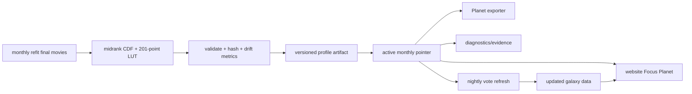

# Phase 42 · Monthly Rating Emission CDF/LUT Lifecycle

## 前置与范围

- 前置：Phase 41.5–41.8 已完成，当前生产 profile 为 `rating-midrank-cdf-lut-v1`。
- 目标仓库：`e:/projects/chronicle_v3_3d_galaxy`。
- 本 Phase 只处理 Focus Planet 的 `movie.vote_average → uEmissionIntensity`；不修改宏观星系粒子的旧 `Movie.emissive` 线性导出逻辑。
- monthly refit 成功后生成并激活当月 profile；nightly vote refresh 更新电影数据但不得重新计算或替换 profile。
- 同一自然月默认只允许一个 active profile；手动重跑只生成 candidate，除非显式使用 force activation。
- profile 生成输入必须是 monthly refit 最终导出的 `movies` 集合，不读取 raw CSV 计算 CDF，不在浏览器启动时按当天数据重算。
- 保留当前源码内冻结 profile 作为 legacy fallback；新 production 数据缺失或 profile 校验失败时必须可定位失败，不能静默接受错配曲线。

## 目标数据流

## 核心设计决策

### D1 · Profile 是独立发布产物

新增可版本化的 rating-emission profile contract，至少包含 `schema_version`、`profile_id`、`period`、`model_version`、`method`、rating domain、sample step、201 个 samples、emission endpoints、source data version、source movie count、source threshold version、curve hash、生成时间和 Git commit。

- profile 路径或 URL 必须可被网站、exporter 和 diagnostics 共同解析。
- profile 的内容必须 byte-stable；相同输入、相同 profile 版本和相同排序得到相同 JSON/hash。
- active pointer 只指向最后一次完整校验成功的 profile。

### D2 · 月内冻结，月度显式切换

- monthly refit 在 profile 生成、校验和发布全部成功后才更新 active pointer。
- 同月已有 active profile 时，普通重跑不得覆盖 active profile；只保留 candidate 和运行证据。
- `force activation` 必须是显式 CLI/workflow 输入，并记录旧 profile、新 profile、原因和操作者来源。
- monthly 失败、profile 校验失败、上传失败或 pointer 更新失败时，继续使用上一份 active profile。

### D3 · 三个消费面统一读取 profile

统一以下入口的 profile 解析和校验，禁止各自保留不同的 production LUT：

- 网站：`frontend/src/three/planetAppearance.ts`、`frontend/src/three/planet.ts`、`frontend/src/three/scene.ts`。
- Planet exporter：`frontend/src/planet-export/renderPlanetImage.ts`、`tools/planet-exporter/src/data-source.ts` 及其浏览器注入路径。
- diagnostics/evidence：`tools/planet-exporter/scripts/generate-p417-final-evidence.ts` 与现有 Phase 41 contract。

`focusEmission.ts` 继续负责纯函数、profile validation 和 LUT interpolation；统计分布与发布状态不扩散进 appearance 或 shader 模块。

### D4 · nightly 只复用 active profile

`.github/workflows/nightly_vote_refresh.yml` 不生成 CDF/LUT，只读取当前 active profile 并随数据 manifest 一起部署。monthly 与 nightly 的发布 manifest 必须能证明：

- galaxy `data_version`；
- active `profile_id`；
- profile hash；
- 两者的 source/provenance 关系。

### D5 · 失败保护与月间漂移观测

每次 monthly candidate 记录与上月 active profile 的差异：LUT mean absolute delta、最大 delta、关键 rating 节点变化、样本数量变化和源数据版本变化。

- 结构错误、非有限值、非单调、长度错误、hash 不一致直接失败。
- 首版异常漂移先生成 warning 和 artifact，不在没有多月观测数据的情况下硬编码视觉阈值。
- active profile 变更必须可审计、可回滚，不删除历史 profile。

## Todo 42.1 · [contract] profile schema、period freeze 与 active pointer

**依赖：** 无。

**改动：**

- 在 `frontend/src/three/focusEmission.ts` 中抽取可序列化 production profile contract，复用已有 midrank CDF/LUT 校验规则。
- 在 `frontend/src/types/galaxy.ts` 和 `frontend/src/lib/galaxyAssetUrls.ts` 中补充 profile provenance / active pointer 的最小类型和解析边界，避免把整份 profile 塞入无关 HUD 状态。
- 明确 `profile_id`、`period`、active/candidate、legacy fallback 和 force activation 语义。
- 为 profile JSON、active pointer、路径安全和 hash 建立纯函数测试。

**验收：**

- profile 可独立读取、验证和序列化；201 个 samples、rating/emission domain、单调性和端点均快速失败。
- 路径只允许受控 profile 资源，不接受任意本地路径或未经注册的 URL。
- 同一输入产生 byte-stable profile；同月普通重复运行不会改变 active pointer。
- active pointer 只能指向完整校验成功的历史 profile。

## Todo 42.2 · [pipeline] monthly final movies → profile generator

**依赖：** 42.1。

**改动：**

- 在 `scripts/cron/monthly_refit.py` 或其独立的 `scripts/cron` adapter 中接入 profile 生成，输入使用最终 monthly export 的 `vote_average` 集合。
- 复用 `generateRatingMidrankCdfLutProfile` 的算法契约，Python 侧输出与 TypeScript 校验规则一致的 profile JSON。
- 在 `scripts/export/export_galaxy_json.py` 的调用边界增加 profile provenance，不改变宏观 `Movie.emissive` 的现有语义。
- 输出 `shape`、rating/emission min/max、movie count、profile hash，并对空集合、NaN/Infinity、越界 rating、重复/不稳定排序显式断言。

**验收：**

- profile 的样本集合与当月最终导出的 `movies` 集合一致，排序规则确定。
- CDF/LUT 结果与现有 TypeScript 纯函数在 fixture 上逐点一致。
- 生成失败不会更新 active pointer，不留下伪造的 ready profile。
- 不触碰 `data/raw/TMDB_all_movies.csv` 的对话读取约束。

## Todo 42.3 · [runtime+exporter] 网站、Planet exporter、diagnostics 统一消费

**依赖：** 42.1–42.2。

**改动：**

- 更新 `frontend/src/three/planetAppearance.ts`、`frontend/src/three/planet.ts` 和 `frontend/src/three/scene.ts`，让 Focus Planet 在数据加载完成后使用已验证的 active profile，而不是永远直接依赖源码常量。
- 更新 `frontend/src/planet-export/renderPlanetImage.ts` 和 `tools/planet-exporter/src/data-source.ts`，让 exporter 使用与网站相同的 profile provenance；profile 缺失或 hash 不匹配时明确失败。
- 更新 `frontend/src/three/productionFocusEmissionProfile.ts`，将当前冻结 profile 降级为 legacy fixture/fallback，不再作为 monthly production 的唯一事实来源。
- 更新 Phase 41 evidence contract，确保 diagnostic override 与 production profile 的边界继续清晰。
- 前端接收 profile 时输出 `profile_id`、source data version、movie count 和样本摘要，满足状态可见性要求，但不在每帧或每次选片重复日志。

**验收：**

- 网站与 exporter 对同一电影、同一 profile 得到相同 emission intensity。
- shader 仍只接收单一 `uEmissionIntensity`，不新增 LUT texture 或 shader 分支。
- profile 加载一次并缓存；选片和重新选片不会重新请求或重新计算 CDF。
- profile 缺失、schema 不兼容、hash 错配均快速失败或明确使用 legacy fallback，并在诊断信息中标明来源。

## Todo 42.4 · [workflow] monthly/nightly 发布与 R2/Pages manifest

**依赖：** 42.2–42.3。

**改动：**

- 更新 `.github/workflows/monthly_refit.yml`：monthly export 后生成、校验、上传 versioned profile，再原子更新 active pointer，最后部署网站。
- 更新 `.github/workflows/nightly_vote_refresh.yml`：只获取和部署 active profile，不执行生成步骤，不覆盖 profile 对象或 pointer。
- 更新 `scripts/cron/upload_galaxy_r2.py`，让 galaxy assets manifest 同时携带 profile URL、profile ID、hash 和 period；保持旧 manifest 可解析。
- 保留历史 profile，避免使用固定对象覆盖后无法回滚；profile URL 使用版本 query 或不可变对象键。
- 将 `monthly_refit_meta.json` 扩展为包含 profile candidate/active 状态、hash、drift 指标和失败原因。

**验收：**

- monthly 成功链路为：profile ready → pointer 更新 → galaxy/profile 上传 → Pages build/deploy；任一前置失败都不切 active。
- nightly 成功后 profile ID/hash 与运行前一致，即使 `vote_average` 数据发生变化。
- monthly 同月普通重跑不替换 active；force activation 有明确审计信息。
- 缺少 R2/manifest 配置时不静默发布错配 profile，错误可定位。

## Todo 42.5 · [tests+observability] 跨端回归、月中不变量与漂移证据

**依赖：** 42.1–42.4。

**改动：**

- 扩展 `frontend/src/three/focusEmission.spec.ts`、`frontend/src/three/planetAppearance.spec.ts`、`frontend/src/three/planetCore.spec.ts`，覆盖 profile load/cache/provenance、legacy fallback 和跨端数值一致性。
- 在 `scripts/tests/` 增加 monthly generator、profile freeze、failure rollback、drift metrics 和 manifest compatibility 测试。
- 在 `tools/planet-exporter/src/` 增加 exporter profile mismatch、missing profile、same-profile output 和 diagnostic evidence 测试。
- 增加一个最小的 fake monthly/nightly fixture，证明 nightly 更新 vote 数据不会改变 active profile hash。
- 检查 frontend、Python pipeline、exporter 的类型/格式和显式断言；不运行完整 UMAP 或真实远程发布作为普通单测。

**验收：**

- 相关 Python 测试、frontend tests/typecheck/build、planet-exporter tests 全部通过。
- 自动证据至少能证明：同月冻结、nightly 复用、monthly 失败回滚、force activation 审计、网站/exporter hash 一致。
- 漂移指标可在 monthly artifact 中读取，并与 profile/source provenance 对齐。

## Todo 42.6 · [需人工验收] 首次月度切换与生产 Go/No-Go

**依赖：** 42.1–42.5。

**执行：**

1. 使用一个临时 monthly fixture 生成 candidate profile，确认网站、exporter 和 diagnostics 三端读取同一 profile。
2. 执行 nightly fixture，改变电影 `vote_average`，确认 active profile 的 `profile_id`、hash 和 LUT samples 不变。
3. 让 profile 生成、上传或 pointer 更新中的一个步骤失败，确认旧 profile 继续 active，且失败原因进入 artifact。
4. 在同月执行普通 workflow 重跑，确认不会切换 active；再显式 force activation，确认审计记录完整。
5. 检查 Focus Planet 的低分、中段密集区和高分视觉层级没有超出 Phase 41.5–41.8 已验收的视觉契约。

**人工验收：**

- 月初切换一次，月中保持不变。
- nightly 不会隐式改变 rating→emission 曲线。
- 网站、Planet exporter 和 diagnostics 没有 profile 错配。
- 失败时旧 profile 可继续服务，历史 profile 可回滚。
- 未通过人工 Go 前不将本 Phase 标记为 complete，不做生产发布声明。

## 风险与约束

- 不把 CDF 统计职责放进 `planetAppearance.ts`、shader 或 render loop。
- 不把 daily vote refresh 当成 monthly refit；daily 只能消费 active monthly profile。
- 不用一个可覆盖的固定 R2 key 作为唯一 profile 存储；必须保留历史版本。
- 不修改宏观粒子的 `Movie.emissive` 线性映射，除非另开明确范围的视觉 Phase。
- 不删除当前 Phase 41 evidence、legacy profile 或历史数据产物。
- 不执行完整 UMAP、真实 R2 上传或生产部署，除非对应 TODO 和人工验收明确要求。