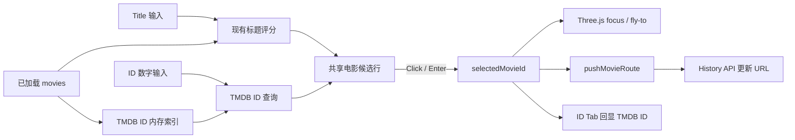

# Phase 43 · TMDB ID Search & Movie Suggestion Redesign

## 前置与范围

- 目标仓库：`e:/projects/chronicle_v3_3d_galaxy`。
- 前置：现有搜索栏已支持 Title、Person、Genre；电影 focus 由 `selectedMovieId` 驱动，路由由 History API 同步为 `/movie/:tmdbId`。
- 本 Phase 增加第 4 个 `ID` Tab，仅支持 TMDB ID；不支持 IMDb ID 输入、匹配或候选标识。
- Title 与 ID 使用同一套电影候选行；Person 保留人物候选结构，Genre 保留多选 badge 结构。
- 本 Phase 不修改 galaxy 数据 schema、Three.js 选中态协议、相机动画或渲染材质。

## 交互契约

### ID 查询

- 输入只接受十进制数字。
- 任意长度都执行精确匹配，确保短 TMDB ID 可直接命中。
- 输入达到 4 位后追加 TMDB ID 前缀匹配。
- 最多显示 8 部候选；精确命中优先，其余按 TMDB ID 数值升序。
- 点击候选进入 focus；按 `Enter` 选择第一候选；上下方向键移动高亮。
- 无效输入和无结果必须给出明确反馈，不静默触发片名搜索。

### focus 回显

- 任意方式进入星球 focus 后，只有当前位于 `ID` Tab 时，输入区显示该电影的 `Movie.id`，右侧显示固定 `TMDB` tag。
- 切换到 Title、Person 或 Genre 时不显示 TMDB ID，也不覆盖这些 Tab 的原查询内容。
- 用户在 ID 输入区开始编辑后，从 focus 回显态切回查询态。
- 退出 focus 后清除仅用于回显的值，不污染其他搜索会话。

### 共用电影候选行

```text
Fight Club                              TMDB 550
1999
```

- 第一层：展示片名，作为主要识别内容。
- 固定主标识：`TMDB <id>`，Title 与 ID 候选都必须显示。
- 第二层：上映年份；原始片名与展示片名不同时追加原始片名。
- 候选行不显示 Genre；Genre 仍只属于独立的 Genre Tab 搜索维度。
- 窄屏优先保住展示片名与 TMDB ID；次级信息允许截断。
- RTL locale 保持信息语义顺序正确；TMDB ID 数字区域固定 `dir="ltr"`。

## 状态与数据流



## 核心设计决策

### D1 · TMDB 是唯一 ID 搜索域

`Movie.id` 已是数据主键、Zustand 选中键和 `/movie/:tmdbId` 路由参数。本 Phase 不为 `Movie.imdb_id` 建立第二套索引，不引入 ID 类型切换，也不制造 IMDb 命中后再转换到 TMDB 身份的双重语义。

### D2 · 不新增 `searchMode: 'id'`

ID 是单电影寻址方式，不是 Person/Genre 的多电影选择会话。命中结果继续只写入 `selectedMovieId`；ID 查询文本和 focus 回显值留在 SearchBar 局部状态，避免扩大全局状态机。

### D3 · 搜索与展示职责分离

- `tmdbIdSearch.ts` 负责输入规范化、索引、精确/前缀匹配、排序和上限。
- `searchScore.ts` 继续负责标题匹配与评分，但电影展示信息改为结构化字段。
- SearchBar 负责 Tab、输入、候选导航和状态切换。
- 共用电影候选行只负责布局与可访问性，不执行搜索或 focus 副作用。

### D4 · 复用现有无刷新导航

候选选择只设置 `selectedMovieId`。`useRouteController.ts` 继续订阅该变化并调用 `pushMovieRoute`，禁止使用 `window.location`、页面 reload 或第二套路由入口。

### D5 · ID Tab 独立于搜索索引包

TMDB ID 查询只依赖已加载的 `movies`。当 `galaxy_search_index` 缺失或失败时，Title/Person/Genre 仍按现有规则禁用或降级，但 ID Tab 必须可用。

## Todo 43.1 · [search-contract] TMDB ID 索引与查询规则

**依赖：** 无。

**改动：**

- 新增 `frontend/src/utils/tmdbIdSearch.ts`，从 `Movie.id` 构建只读精确映射与有序前缀条目。
- 提供纯函数输入解析与查询 API；只接受数字，禁止负数、小数、指数形式、空白夹杂和非数字字符。
- 实现“精确始终启用、4 位起前缀、最多 8 条、精确优先、ID 数值升序”。
- 开发环境构建索引时输出 movie 数量、索引数量和首尾 ID 样本；断言 ID 为正整数且无重复，避免静默覆盖。
- 新增 `frontend/src/utils/tmdbIdSearch.spec.ts`。

**验收：**

- 1–3 位输入可命中完整短 ID，但不展开大规模前缀候选。
- 4 位及以上输入返回精确项和受限前缀项；精确项固定第一。
- 无效输入返回明确的解析状态；无结果与格式错误可被 UI 区分。
- 结果不超过 8 条，输入和电影顺序变化不影响最终排序。

## Todo 43.2 · [ui-model] Title/ID 共用电影候选行

**依赖：** 43.1。

**改动：**

- 调整 `frontend/src/utils/searchScore.ts`，为电影命中提供结构化展示字段：展示片名、原始片名、年份和 TMDB ID；不再让 UI 反解析单一长 label。
- 从 `frontend/src/components/SearchBar.tsx` 抽出共用电影候选行；Title 和 ID 结果共用，Person 候选不受影响。
- 保留标题匹配高亮；TMDB ID 使用稳定 tag/徽标，不参与标题高亮。
- 为桌面、窄屏和 RTL 定义收敛规则，避免长片名挤掉 TMDB ID。
- 更新 `frontend/src/utils/searchScore.spec.ts`，确保标题匹配、排序与高亮语义不变。

**验收：**

- Title 候选与 ID 候选都同时显示片名和 `TMDB <id>`。
- 年份和不同的原始片名位于次级层，不与 TMDB ID 争夺主要视觉层级。
- 长片名、缺失/异常年份和 RTL 文案不破坏候选行。
- Person/Genre 搜索交互无回归。

## Todo 43.3 · [interaction] ID Tab、候选导航与 focus 回显

**依赖：** 43.1–43.2。

**改动：**

- 在 `frontend/src/components/SearchBar.tsx` 增加 `ID` Tab 和独立 `idQuery`/debounced query 状态。
- 复用现有候选下拉、点击、上下方向键和 Enter 选择状态机，不复制第二套交互分支。
- 选择候选时仅设置 `selectedMovieId`；保留 `useRouteController.ts` 的 History API 同步。
- 订阅当前 `selectedMovieId`：ID Tab 在 focus 时显示 TMDB ID + `TMDB` tag，编辑后切回查询态；其他 Tab 不显示该回显。
- 将 SearchBar 的阻塞状态改为按 Tab 判定，使 ID Tab 不依赖 search-index hydrate 结果。
- 保持清除、ESC、Tab 切换、Cmd/Ctrl+K 与浏览器前进/后退语义一致。
- ID 索引接收 movies 后记录长度和样本；选择候选时记录 query、candidate count 与 selected TMDB ID，不在输入每次按键产生高频日志。

**验收：**

- ID 候选点击和 Enter 均触发现有 fly-to/focus，页面不 reload。
- URL 更新为 `/movie/:tmdbId`；浏览器前进/后退可恢复 home/focus。
- focus 态只在 ID Tab 回显 TMDB ID；切换其他 Tab 不覆盖其查询。
- search index 不可用时 ID Tab 仍可完成查询和 focus。

## Todo 43.4 · [需人工验收] i18n、回归与响应式视觉门禁

**依赖：** 43.1–43.3。

**改动：**

- 以 `frontend/src/lib/locales/en.json` 为结构 SSOT，同步 7 个 locale 的 `tabId`、TMDB ID placeholder、无效格式、无候选和候选可访问性文案。
- 核对 `frontend/src/lib/strings.ts` 导出形状，运行 locale schema parity 测试。
- 运行 TMDB ID、标题评分、全量 frontend test、lint 和 build。
- 在浏览器检查桌面、窄屏和 RTL：4 Tab 宽度、长片名截断、TMDB tag、候选滚动、键盘高亮和 focus 回显。

**自动验证：**

- `npx vitest run frontend/src/utils/tmdbIdSearch.spec.ts frontend/src/utils/searchScore.spec.ts`
- `npx vitest run frontend/src/lib/locales/locales.schema.spec.ts`
- `npm test`
- `npm run lint`
- `npm run build`

**人工验收：**

- Title 与 ID 候选的信息层级清楚，片名和 TMDB ID 均能快速识别。
- 窄屏下 TMDB ID 不被片名挤出，次级信息按预期收敛。
- 任意星球 focus 时，ID Tab 正确显示当前 TMDB ID；其他 Tab 不显示。
- ID 候选选择、URL 更新和浏览器历史均无页面重载。
- 未通过人工验收前不将 Phase 43 标记为 complete。

## 风险与约束

- 不支持 IMDb ID；不建立 `imdb_id` 索引，不显示 IMDb tag。
- 不把 ID 查询文本写入 `galaxyInteractionStore.searchQuery`，避免破坏 Title/Person/Genre 会话。
- 不新增第二套选中态、相机命令或路由控制器。
- 不让候选行组件承担匹配、排序或状态更新职责。
- 不执行数据重建、UMAP、远程上传或生产部署。