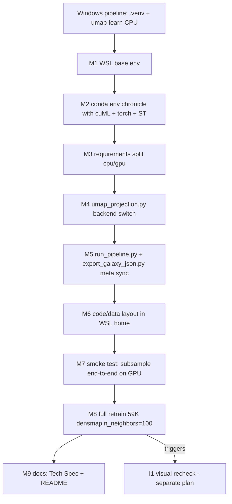

# Phase 6.0 §8 — 管线全链路 GPU 化（WSL Ubuntu）

> 依据 [docs/reports/Phase 6.0 项目回顾与下一阶段规划报告.md](docs/reports/Phase%206.0%20%E9%A1%B9%E7%9B%AE%E5%9B%9E%E9%A1%BE%E4%B8%8E%E4%B8%8B%E4%B8%80%E9%98%B6%E6%AE%B5%E8%A7%84%E5%88%92%E6%8A%A5%E5%91%8A.md) §8 "Phase 6.0 基础设施升级 · 管线全链路 GPU 化"。本 plan 为 Phase 6.0 的 enabler，独立于 I1–I6 的 feature plan（后者另行出计划）。

## 决策（本轮澄清）

- **迁移范围**：全链路（Phase 1 + 2.1 + 2.2/2.3 + 2.4 + 2.5）。Windows `.venv` 仍保留，但不再是主路径。
- **RAPIDS 安装方式**：**conda/mamba 优先**（rapidsai channel），失败 fallback pip wheels（`cuml-cu12`）。新建 conda env 名 `chronicle`。
- **代码/数据位置**：默认 clone 到 **WSL home `~/chronicle_v3_3d_galaxy`**；产物通过 rsync/cp 回写到 Windows 侧 `/mnt/e/projects/chronicle_v3_3d_galaxy/frontend/public/data/` 与 `data/output/`。
- **CPU 回退保留**：Windows 侧 `.venv` + `umap-learn` backend 作为 fallback；`requirements.txt` 拆分为 `.cpu.txt` / `.gpu.txt`，Windows 兼容性不破坏。

## 迁移流程图

## 关键文件与改动要点

- `scripts/feature_engineering/umap_projection.py` — 新增 `--backend {umap,cuml}`；cuml 分支支持 `--densmap` 与 `--n-neighbors=100`；输出 `(n, 2) float32` 保持不变
- `scripts/run_pipeline.py:41-55` `run_phase2_through_export()` — 透传 backend/densmap/n_neighbors；`--cpu` 强制回退到 `umap-learn`
- `scripts/export/export_galaxy_json.py:179-187` + `:350-355` — CLI 增加 `--densmap`；`meta.umap_params` 写入 `densmap` 布尔字段（前端 `galaxy_data.json` schema 同步扩展）
- `requirements.txt` → 拆 `requirements.cpu.txt`（Windows 现状）+ `requirements.gpu.txt`（注释指向 conda env）或 `environment.gpu.yml`
- 新增 `scripts/env/rapids_env.yml`（conda env 规格）+ `scripts/env/bootstrap_wsl.sh`（幂等安装脚本）
- `docs/project_docs/TMDB 电影宇宙 Tech Spec.md` §2 管线章节 — 追加 GPU/WSL 分支；前端 `meta.umap_params.densmap` 在 [frontend/src/data/types.ts](frontend/src/data/types.ts) 同步（读前端类型若有）

## 工程原则（延续报告 §8.4）

- **agent 自治优先**；每次 sudo / 交互式输入前先请示用户
- **每个 M* 完成后单独产出一篇 `docs/reports/Phase 6Mn ... 实施报告.md`**（n 为里程碑序号，如 Phase 6M1、Phase 6M2）
- **不破坏现有 Windows 管线**：M3 完成前 Windows `.venv` 必须仍能运行 Phase 1 + CPU UMAP
- **数值结果差异**：cuML DensMAP 与 `umap-learn` 会有差异，旧 `umap_xy.npy` 备份为 `umap_xy.umap-learn.npy`，随报告留存

## 里程碑

- **M6.0.8.A — WSL GPU 管线就绪**：M1–M7 完成（子样本端到端在 WSL GPU 上跑通）
- **M6.0.8.B — I1 发动条件具备**：M8 全量重训完成，产物 `galaxy_data.json` 加载到前端
- **M6.0.8.C — 对外化基础**：M9 文档同步

## 风险与对策（延续报告 §8.5）

- **conda 解析/下载慢或失败** → fallback 到 pip wheels（`cuml-cu12`），保留 `scripts/env/bootstrap_wsl.sh` 里的 B 分支入口
- **WSL GPU 显存不足**（59K × ~800d + densmap）→ 先 M7 子样本实测占用；若超限，评估 `init='random' → 'spectral'` 切换 / PCA 前处理 / float32 强制
- **cuML 与 PyTorch CUDA ABI 冲突** → conda 一次性解析 `cuda-version` 元包，env 锁定
- **I3 / I4 若在 M8 重训后仍指向深度/拾取更大改造** → 不在本 §8 plan 内处理，按报告 §10.3 上升为 Phase 6.1 设计
