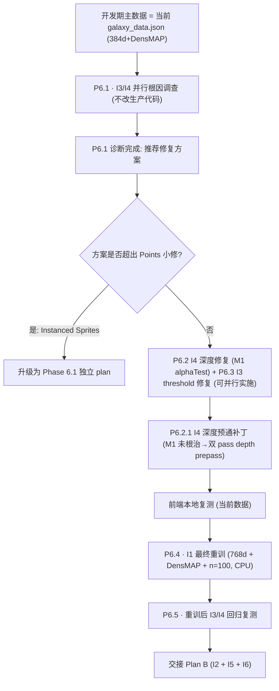

# Phase 6.0 Plan A — I1 收尾 + I3 / I4 攻坚

> 基于 Phase 6.0 路线图，承接已完成的 [phase_6_gpu_migration_202aac8f.plan.md](.cursor/plans/phase_6_gpu_migration_202aac8f.plan.md)。

## 本轮澄清（用户决策）

- **I1 最终参数**：**768d mpnet + DensMAP + n_neighbors=100 + min_dist=0.4**（由于 cuML GPU UMAP 不支持 DensMAP，此组合只能走 CPU `umap-learn`，耗时较长，因此放到**开发最后**一次性跑完）
- **开发期主数据**：继续沿用当前 [`frontend/public/data/galaxy_data.json`](frontend/public/data/galaxy_data.json)（384d + DensMAP via CPU fallback）——"当前数据也还不错"
- **I3 / I4 调查方式**：**并行两条根因路径**（I4 深度 + I3 threshold），先完成诊断，再决定修复方案
- **本 plan 不含**：I2 视觉参数总表 / I5 INFO 按键 / I6 DATA.md 与架构图——归入 Plan B
- **升级兜底**：若 I3 / I4 诊断指向 `Points → InstancedSprites` 的大改造，**升为 Phase 6.1 独立设计 plan**，不在本 plan 内塞改

## 执行顺序与依赖

> 编号说明：已完成的 GPU 迁移 enabler 保留原 **M1–M9** 前缀（前置任务历史文件不改）；本 plan 是 Phase 6 **非前置任务**的起点，从 **P6.1** 开始；后续 Plan B（I2 + I5 + I6）续接 **P6.6+**。



## 关键文件与改动面

- I4 深度/排序：[`frontend/src/three/galaxy.ts`](frontend/src/three/galaxy.ts)（`transparent:true / depthWrite:false / depthTest:true`）
- I3 拾取阈值：[`frontend/src/three/interaction.ts`](frontend/src/three/interaction.ts) `computeFocusSlabPointsThreshold()`
- meta.xy_range 与实际坐标一致性：[`scripts/export/export_galaxy_json.py`](scripts/export/export_galaxy_json.py)（若路径 1 成立，强制从 `movies[].x/y` 计算而非 `meta_template` 透传）
- I1 重训入口：[`scripts/run_pipeline.py`](scripts/run_pipeline.py) + [`scripts/feature_engineering/umap_projection.py`](scripts/feature_engineering/umap_projection.py) + [`scripts/feature_engineering/text_embedding.py`](scripts/feature_engineering/text_embedding.py)（`--model-id` mpnet 已就绪）
- 变体产物现状：`frontend/public/data/galaxy_data_gpu768_n100.json`（768d + cuML 无 DensMAP）作为**对照参考**保留，最终被 **768d + DensMAP** 覆盖为主数据

## 诊断与修复要点

### I4（§5） 深度/前后关系
- **Step 1 诊断（最小侵入）**：临时把 `galaxy.ts` 三层 `PointsMaterial` / `ShaderMaterial` 的 `depthWrite` 设为 `true` + `alphaTest: 0.5`，截图 / 录屏复测"近星被远星遮挡"是否消失，确认主因是否是 `depthWrite:false`
- **Step 2 方案选择**：M1-M4 中择一：
  - M1（推荐起点）：`depthWrite:true + alphaTest`（可能出硬边）
  - M2：CPU 每帧按相机距离排序 geometry index（59K 成本实测）
  - M4：按 slab 分层 mesh + 分别 `depthWrite`（与 5.1.6 三层架构天然契合）
- **硬边不可接受 / CPU 排序抖动 / 分层重排**超出本 plan 代价——**升 Phase 6.1**

### I4 · P6.2.1 深度预通补丁（M1 未根治的后续）
- **M1 残留 bug**：`point.frag.glsl` 背景层 `a = 0.55 * edgeSoft`，α 上限仅 0.55；`alphaTest:0.5` 下背景点仅核心极小圆盘（r≲0.80）写深度，外圈透明光晕**完全不写深度**——近处背景点无法遮挡远处焦点点的核心，错位残留。
- **硬约束（本补丁立项前提）**：① Bloom 无黑边（→ 排除 `transparent:false`、`alphaToCoverage`、高 `alphaTest`）；② 真 alpha blending 半透明；③ 前后遮挡正确。
- **方案 B（双 pass）**：
  - Pass 1 深度预通：`colorWrite:false / depthWrite:true / depthTest:true / transparent:false`；新 `point.depth.frag.glsl` 仅按 `r > GALAXY_DEPTH_PREPASS_RADIUS (默认 0.65)` discard，其余 `gl_FragColor = vec4(0.0)`；`renderOrder = -1`；`raycast = () => {}` 防 hover 命中翻倍。
  - Pass 2 颜色通：材质回归原 `transparent:true / depthWrite:false / depthTest:true`，**移除 alphaTest**，`point.frag.glsl` 不变。
  - 两 `Points` 共享同一 `BufferGeometry`；`point.vert.glsl` 不变；Pass 1 的 `uPixelRatio/uSizeScale/uZCurrent/uZVisWindow/uBgPointSizePx` 与 Pass 2 同步（否则核心印记尺寸错位）。
- **代码面**：
  - 新文件：[`frontend/src/three/shaders/point.depth.frag.glsl`](frontend/src/three/shaders/point.depth.frag.glsl)
  - 改 [`frontend/src/three/galaxy.ts`](frontend/src/three/galaxy.ts)：撤回 `GALAXY_POINT_ALPHA_TEST`，新增 `GALAXY_DEPTH_PREPASS_RADIUS`；`GalaxyPointsHandle` 扩展 `depthPoints / depthMaterial`，`dispose` 一并清理。
  - 改 [`frontend/src/three/scene.ts`](frontend/src/three/scene.ts)：`scene.add(galaxy.depthPoints)` 放在 `scene.add(galaxy.points)` 之前。
- **调参边界**：`GALAXY_DEPTH_PREPASS_RADIUS` 0.55–0.70；偏小→远处点透过近处亮区；偏大→近处"实心盘"切断后方光晕致弱黑环。
- **验收**：
  - 肉眼目检近/远遮挡完全一致（无"远处球透过近处球核心"）
  - 光晕外缘无硬边/黑环；Bloom 强度与 P5 基线视觉一致
  - 三层 shader（`vInFocus` / 背景层尺寸 `uBgPointSizePx`）/ uZCurrent & uZVisWindow 过渡不退化
  - hover 命中数不因多一个 Points 而翻倍（`raycast` 禁用生效）
  - draw call 从 1→2，59K 点帧时间增量 < 0.5ms
- **风险与回退**：若羽化重叠区的细粒度顺序瑕疵仍不可接受，升级到 M2（CPU 每帧 index 排序，59K radix 2–5 ms，可按相机静止节流）；B 与 M2 可叠加。

### I3（§4） hover 偏移
- **路径 1 验证**：console 打印当前 `meta.xy_range` vs `movies.map(m=>m.x/y)` 的 `min/max`；若 `xy_range` 与实际坐标错位，主因为导出链路 meta 透传 bug
- **路径 2 验证**：在 `interaction.ts` 加诊断日志打印 `threshold` 与相邻两星 XY 距离；若 threshold ≥ 局部点间距，主因为 `avgXYSpacing * 0.75` 对局部密度估计过粗
- **修复策略**：
  - 路径 1 → 在 `export_galaxy_json.py` 强制从实际坐标重算 `xy_range`，并输出单测/校验
  - 路径 2 → `interaction.ts` threshold 从"slab 均值"改为"点视觉半径 × 世界尺度"或局部 kNN 估计；至少把 `0.75` 系数收紧到诊断推导的合理值

## I1 最终重训（P6.4）

> 触发时机：I3 / I4 修复完成且前端本地复测通过后，再做最后一次。

- 备份：`data/output/umap_xy.npy` → `data/output/umap_xy.densmap384.npy`；`frontend/public/data/galaxy_data.json(.gz)` → `galaxy_data.densmap384.json(.gz)`（归档，便于对比）
- 在 WSL `chronicle` 环境内执行（MiniLM 不再使用，Phase 2.1 切 mpnet 768d；UMAP 强制 CPU densmap）：
  ```bash
  python scripts/run_pipeline.py --through-phase-2 \
    --text-model sentence-transformers/paraphrase-multilingual-mpnet-base-v2 \
    --umap-backend umap --densmap --n-neighbors 100 --min-dist 0.4
  ```
  （如当前 `run_pipeline.py` 尚未透传 `--text-model/--model-id`，本 P6.4 内补齐——M8 阶段 `text_embedding.py` 已支持 `--model-id`）
- `meta.umap_params` 需完整写入 `densmap=true / n_neighbors=100 / min_dist=0.4` 且 `meta.version` bump（Tech Spec 约定）
- `scripts/validate_galaxy_json.py` 通过；回写 Windows 侧 `frontend/public/data/galaxy_data.json(.gz)`
- 接 P6.5 回归复测：在最终坐标上重跑 I3 阈值诊断（若修复用了路径 2 的局部 kNN，需确认在新分布下仍合理）

## 验收

- **I4**：近星不再被远星遮挡；三层 shader / Bloom / 视距窗口边缘过渡无退化
- **I3**：鼠标悬停命中率在高密度星团内肉眼一致；诊断日志撤除/改为 dev-only
- **I1**：重训后 `galaxy_data.json` 加载正常；肉眼对比旧主数据，局部高密度星团由"糖浆"转为"可辨别星云"；`meta.umap_params` 与文件一致

## 风险

| 风险                                                       | 对策                                                               |
| ---------------------------------------------------------- | ------------------------------------------------------------------ |
| I4 诊断后 M1 `alphaTest` 边缘硬边不可接受                  | 本 plan 最多做到 M2 CPU 排序；若仍不行→升 Phase 6.1                |
| P6.2.1 `GALAXY_DEPTH_PREPASS_RADIUS` 取值与 Bloom 视觉冲突 | 0.55–0.70 范围内人工调参；实在不行→升级 M2（CPU 排序），两者可叠加 |
| I3 路径 2 局部 kNN 估计在 59K 上过慢                       | fallback 为"点视觉半径 × 世界尺度系数"静态策略                     |
| I1 最终 CPU 重训耗时/内存不可接受（59K × 890d + DensMAP）  | 先子样本 smoke；必要时 PCA 前处理到 128/256d 再 UMAP               |
| `run_pipeline.py` 未透传 `--model-id` 到 Phase 2.1         | P6.4 内补丁，属小改动但需与现有 CLI 兼容                           |
| I3 / I4 指向 Points → InstancedSprites 级重构              | 立即停手、出 Phase 6.1 独立 plan，不在本 plan 内扩张               |