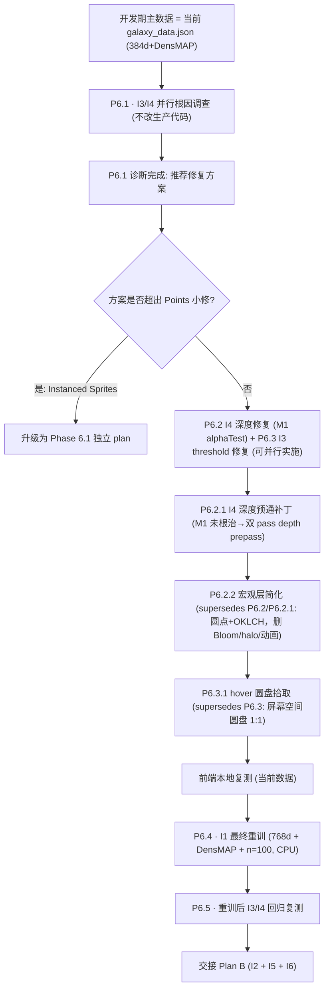

# Phase 6.0 Plan A — I1 收尾 + I3 / I4 攻坚

> 基于 Phase 6.0 路线图，承接已完成的 [phase_6_gpu_migration_202aac8f.plan.md](.cursor/plans/phase_6_gpu_migration_202aac8f.plan.md)。

## 本轮澄清（用户决策）

- **I1 最终参数**：**768d mpnet + DensMAP + n_neighbors=100 + min_dist=0.4**（由于 cuML GPU UMAP 不支持 DensMAP，此组合只能走 CPU `umap-learn`，耗时较长，因此放到**开发最后**一次性跑完）
- **开发期主数据**：继续沿用当前 [`frontend/public/data/galaxy_data.json`](frontend/public/data/galaxy_data.json)（384d + DensMAP via CPU fallback）——"当前数据也还不错"
- **I3 / I4 调查方式**：**并行两条根因路径**（I4 深度 + I3 threshold），先完成诊断，再决定修复方案
- **本 plan 不含**：I2 视觉参数总表 / I5 INFO 按键 / I6 DATA.md 与架构图——归入 Plan B
- **升级兜底**：若 I3 / I4 诊断指向 `Points → InstancedSprites` 的大改造，**升为 Phase 6.1 独立设计 plan**，不在本 plan 内塞改

## 执行顺序与依赖

> 编号说明：已完成的 GPU 迁移 enabler 保留原 **M1–M9** 前缀（前置任务历史文件不改）；本 plan 是 Phase 6 **非前置任务**的起点，从 **P6.1** 开始；后续 Plan B（I2 + I5 + I6）续接 **P6.6+**。



## 关键文件与改动面

- I4 深度/排序：[`frontend/src/three/galaxy.ts`](frontend/src/three/galaxy.ts)（`transparent:true / depthWrite:false / depthTest:true`）
- I3 拾取阈值：[`frontend/src/three/interaction.ts`](frontend/src/three/interaction.ts) `computeFocusSlabPointsThreshold()`
- meta.xy_range 与实际坐标一致性：[`scripts/export/export_galaxy_json.py`](scripts/export/export_galaxy_json.py)（若路径 1 成立，强制从 `movies[].x/y` 计算而非 `meta_template` 透传）
- I1 重训入口：[`scripts/run_pipeline.py`](scripts/run_pipeline.py) + [`scripts/feature_engineering/umap_projection.py`](scripts/feature_engineering/umap_projection.py) + [`scripts/feature_engineering/text_embedding.py`](scripts/feature_engineering/text_embedding.py)（`--model-id` mpnet 已就绪）
- 变体产物现状：`frontend/public/data/galaxy_data_gpu768_n100.json`（768d + cuML 无 DensMAP）作为**对照参考**保留，最终被 **768d + DensMAP** 覆盖为主数据

## 诊断与修复要点

### I4（§5） 深度/前后关系
- **Step 1 诊断（最小侵入）**：临时把 `galaxy.ts` 三层 `PointsMaterial` / `ShaderMaterial` 的 `depthWrite` 设为 `true` + `alphaTest: 0.5`，截图 / 录屏复测"近星被远星遮挡"是否消失，确认主因是否是 `depthWrite:false`
- **Step 2 方案选择**：M1-M4 中择一：
  - M1（推荐起点）：`depthWrite:true + alphaTest`（可能出硬边）
  - M2：CPU 每帧按相机距离排序 geometry index（59K 成本实测）
  - M4：按 slab 分层 mesh + 分别 `depthWrite`（与 5.1.6 三层架构天然契合）
- **硬边不可接受 / CPU 排序抖动 / 分层重排**超出本 plan 代价——**升 Phase 6.1**

### I4 · P6.2.1 深度预通补丁（M1 未根治的后续）
- **M1 残留 bug**：`point.frag.glsl` 背景层 `a = 0.55 * edgeSoft`，α 上限仅 0.55；`alphaTest:0.5` 下背景点仅核心极小圆盘（r≲0.80）写深度，外圈透明光晕**完全不写深度**——近处背景点无法遮挡远处焦点点的核心，错位残留。
- **硬约束（本补丁立项前提）**：① Bloom 无黑边（→ 排除 `transparent:false`、`alphaToCoverage`、高 `alphaTest`）；② 真 alpha blending 半透明；③ 前后遮挡正确。
- **方案 B（双 pass）**：
  - Pass 1 深度预通：`colorWrite:false / depthWrite:true / depthTest:true / transparent:false`；新 `point.depth.frag.glsl` 仅按 `r > GALAXY_DEPTH_PREPASS_RADIUS (默认 0.65)` discard，其余 `gl_FragColor = vec4(0.0)`；`renderOrder = -1`；`raycast = () => {}` 防 hover 命中翻倍。
  - Pass 2 颜色通：材质回归原 `transparent:true / depthWrite:false / depthTest:true`，**移除 alphaTest**，`point.frag.glsl` 不变。
  - 两 `Points` 共享同一 `BufferGeometry`；`point.vert.glsl` 不变；Pass 1 的 `uPixelRatio/uSizeScale/uZCurrent/uZVisWindow/uBgPointSizePx` 与 Pass 2 同步（否则核心印记尺寸错位）。
- **代码面**：
  - 新文件：[`frontend/src/three/shaders/point.depth.frag.glsl`](frontend/src/three/shaders/point.depth.frag.glsl)
  - 改 [`frontend/src/three/galaxy.ts`](frontend/src/three/galaxy.ts)：撤回 `GALAXY_POINT_ALPHA_TEST`，新增 `GALAXY_DEPTH_PREPASS_RADIUS`；`GalaxyPointsHandle` 扩展 `depthPoints / depthMaterial`，`dispose` 一并清理。
  - 改 [`frontend/src/three/scene.ts`](frontend/src/three/scene.ts)：`scene.add(galaxy.depthPoints)` 放在 `scene.add(galaxy.points)` 之前。
- **调参边界**：`GALAXY_DEPTH_PREPASS_RADIUS` 0.55–0.70；偏小→远处点透过近处亮区；偏大→近处"实心盘"切断后方光晕致弱黑环。
- **验收**：
  - 肉眼目检近/远遮挡完全一致（无"远处球透过近处球核心"）
  - 光晕外缘无硬边/黑环；Bloom 强度与 P5 基线视觉一致
  - 三层 shader（`vInFocus` / 背景层尺寸 `uBgPointSizePx`）/ uZCurrent & uZVisWindow 过渡不退化
  - hover 命中数不因多一个 Points 而翻倍（`raycast` 禁用生效）
  - draw call 从 1→2，59K 点帧时间增量 < 0.5ms
- **风险与回退**：若羽化重叠区的细粒度顺序瑕疵仍不可接受，升级到 M2（CPU 每帧 index 排序，59K radix 2–5 ms，可按相机静止节流）；B 与 M2 可叠加。

### I4+I2 · P6.2.2 宏观层简化（supersedes P6.2 / P6.2.1）

> 用户在 P6.2.1 完成后重新评估视觉方向：当前"halo+core + HDR emissive + Bloom + 深度预通双 pass"链路为了自洽互相支撑，**复杂度超出设计阶段所需**。决定把宏观层降级为"简单圆点 + OKLCH 编码"，I4 在新架构下天然消失。

- **总原则**
  - 宏观层单 pass、不透明、无后处理——I4 从"排序问题"变成"不存在"
  - 颜色语义从 HDR 亮度 + 色相 双通道，改为 **OKLCH 单通道统一承载 genre + vote_average**
  - 焦点切片（Phase 5.1.6 三层）**仅保留 size 调制**，作为"时间轴导航线索"的最小幸存者
  - Bloom / halo / 选中过渡动画 **当前阶段禁用**但保留 revive path，Spec 标记 "deferred to polish"
- **用户定稿（本轮对话）**
  - ① 焦点切片：保留，仅 size 调制（内/外两个系数），颜色与 alpha 在焦点内外一致
  - ② 颜色：OKLCH，`vote_average → L / genre0 → H / C 固定`；**不扫描 palette H 重合**，未来若出现"同色系 genre 看不出差别"再处理
  - ③ 选中动画：camera fly-in/fly-out（600–800ms lerp）保留；`uPointsOpacity` 淡出与 `planet.setOpacity` 淡入**全删**，改用方案 **X**（飞入过程 points 与 planet 同时渲染，t=1 硬切 `visible`）
  - ④ `.cursor/rules/frontend-threejs.mdc` 同步改写
- **方案与实现路径**
  - **OKLCH 现算于顶点着色器**（不改 Python 管线 / JSON 契约）：
    - 输入：`color` attribute（sRGB genre_color）、`voteNorm` attribute（`m.vote_average / 10` clamp [0,1]）
    - 流程：`srgbToLinear → linearToOklab → H = atan2(b, a)` → 用 `mix(uLMin, uLMax, voteNorm)` 覆盖 L、`uChroma` 覆盖 C → `oklabToLinear → linearToSrgb` → `vColor`
    - 矩阵常量采用 Björn Ottosson OKLab 定义，~25 行 GLSL
  - **焦点切片降级为 size-only**：
    - `gl_PointSize = size * uPixelRatio * (500.0 / dist) * mix(uBgSizeMul, uFocusSizeMul, vInFocus) * uSizeScale`
    - 删 `uBgPointSizePx`；新增 `uBgSizeMul=0.4 / uFocusSizeMul=1.0`
    - `vInFocus` varying 只透给 vert 自己用（frag 不再读）
  - **片元精简**：
    - `if (r > 1.0) discard; float a = 1.0 - smoothstep(0.95, 1.0, r); gl_FragColor = vec4(vColor, a);`
    - 保留 1 行 smoothstep 仅为抗锯齿软边（不是 halo）
    - 材质 `transparent: false / depthWrite: true / depthTest: true`（边缘 alpha 经由 discard 近似 cutout——圆盘边缘 4 px 内的抗锯齿薄带影响可忽略）
  - **GPU attribute 重命名**：`emissive` → `voteNorm`（仅前端；JSON 与 `Movie.emissive` TS 字段不动）
  - **选中动画（方案 X）**：
    - `selecting` 起点：`planet.mesh.visible = true`；points 不动（保持全亮）
    - `selecting` 落定（t=1）：`galaxy.points.visible = false`
    - `deselecting` 起点：`galaxy.points.visible = true`
    - `deselecting` 落定（t=1）：`planet.mesh.visible = false`
    - 删 `uPointsOpacity`、`planet.setOpacity`、`SelectionPhase` 里所有 ramp 计算
  - **Bloom 禁用但保留 revive**：
    - `EffectComposer / RenderPass / UnrealBloomPass` 实例化保留
    - 不 `composer.addPass(bloomPass)`，改用 `renderer.render(scene, camera)`
    - 显式 `renderer.outputColorSpace = THREE.SRGBColorSpace`（Bloom 链路之前帮忙做 tonemap/color conversion，直渲必须显式）
    - `window.__bloom.enable() / disable()` 热开关：enable 时切回 `composer.render()` 并 addPass
- **改动面清单**
  - 新增：无（删掉 `point.depth.frag.glsl`，不新增 shader）
  - 删除：[`frontend/src/three/shaders/point.depth.frag.glsl`](frontend/src/three/shaders/point.depth.frag.glsl)
  - 重写：[`frontend/src/three/shaders/point.frag.glsl`](frontend/src/three/shaders/point.frag.glsl)（halo+core → 圆盘 discard + 抗锯齿边）
  - 修改：[`frontend/src/three/shaders/point.vert.glsl`](frontend/src/three/shaders/point.vert.glsl)（OKLCH + size-only 焦点）
  - 修改：[`frontend/src/three/galaxy.ts`](frontend/src/three/galaxy.ts)（删 `depthMaterial/depthPoints/GALAXY_DEPTH_PREPASS_RADIUS/uPointsOpacity/uBgPointSizePx`；新 `uLMin/uLMax/uChroma/uBgSizeMul/uFocusSizeMul`；attribute `emissive` → `voteNorm`；material `transparent:false + depthWrite:true`）
  - 修改：[`frontend/src/three/scene.ts`](frontend/src/three/scene.ts)（删 selection opacity ramp；Bloom pass 不 add；`outputColorSpace`；新增 `window.__galaxyColor` debug；删 `scene.add(depthPoints)`）
  - 修改：[`frontend/src/three/planet.ts`](frontend/src/three/planet.ts)（`setOpacity` 可保留但外部不再调用——先不删，后续 polish 时再清理）
  - 修改：[`.cursor/rules/frontend-threejs.mdc`](.cursor/rules/frontend-threejs.mdc)（Macro layer / Post-processing 段整段改写）
  - 归档 banner：[`docs/reports/Phase 6.2 I4 深度修复 实施报告.md`](docs/reports/Phase%206.2%20I4%20深度修复%20实施报告.md) + [`docs/reports/Phase 6.2.1 I4 深度预通 P6.2.1 实施报告.md`](docs/reports/Phase%206.2.1%20I4%20深度预通%20P6.2.1%20实施报告.md) 顶部加 `**SUPERSEDED by P6.2.2**`
- **默认 uniform 起点**（皆可 debug 调整）
  - `uLMin = 0.40 / uLMax = 0.85`（OKLCH 亮度窗口）
  - `uChroma = 0.15`（色度定值；过高偏霓虹、过低趋灰）
  - `uBgSizeMul = 0.4 / uFocusSizeMul = 1.0`（背景点屏幕半径按 focus 的 40%）
- **验收**
  - ① 单 pass 宏观层下近/远遮挡直觉正确，I4 现象消失
  - ② OKLCH 颜色：高评分点明显偏亮、低评分偏暗；焦点内外同一星**颜色/alpha 完全一致**，仅 size 变化
  - ③ camera fly-in/fly-out 节奏与 P6.2.1 一致，**无任何透明度闪烁**；t=1 的 `visible` 硬切肉眼可接受
  - ④ hover / raycast 命中数与 P6.2.1 等价（仍仅一个 `Points`）
  - ⑤ 帧时间较 P6.2.1 下降（-1 Bloom pass - 1 depth prepass pass）
  - ⑥ `window.__bloom.enable()` 可热恢复 Bloom 到 P6.2.1 近似视觉（作为 revive 通道的 smoke）
  - ⑦ `.cursor/rules/frontend-threejs.mdc` 更新后与 `docs/project_docs/TMDB 电影宇宙 Tech Spec.md` / `Design Spec.md` 的 Bloom 段不再矛盾（Spec 侧仅打 deferred banner、不做大改，避免扩张 scope）
- **风险与回退**
  - OKLCH 暴露 genre palette H 重合 → 用户已同意"未来再解决"；必要时可把 `uChroma` 降到 0.08–0.10 暂时弱化色相差异、或重排 palette（归入后续 polish）
  - "圆盘 + 纯色 + 无 Bloom" 视觉过于扁平 → `window.__bloom.enable()` 即可恢复；若需永久 polish 再在后续 plan 里重启 Bloom + 调 `uChroma/uLMax`
  - `transparent:false` 下 smoothstep 抗锯齿边缘可能有轻微边界硬感 → 实测若不可接受，可退回 `transparent:true, depthWrite:true`（单 pass 不透明但允许片元 alpha 参与 blend）
  - camera 飞入过程中"一堆星里飞向其中一颗"的视觉锚点模糊 → 用户已接受方案 X；未来若需锚点可加 `uSelectedIdx` 在 vert 中把单星 size 置 0
  - Bloom 架构保留的代码体积（~10 行注释 + 条件 addPass）→ 可接受，作为 revive 明确入口

### I3（§4） hover 偏移
- **路径 1 验证**：console 打印当前 `meta.xy_range` vs `movies.map(m=>m.x/y)` 的 `min/max`；若 `xy_range` 与实际坐标错位，主因为导出链路 meta 透传 bug
- **路径 2 验证**：在 `interaction.ts` 加诊断日志打印 `threshold` 与相邻两星 XY 距离；若 threshold ≥ 局部点间距，主因为 `avgXYSpacing * 0.75` 对局部密度估计过粗
- **修复策略**：
  - 路径 1 → 在 `export_galaxy_json.py` 强制从实际坐标重算 `xy_range`，并输出单测/校验
  - 路径 2 → `interaction.ts` threshold 从"slab 均值"改为"点视觉半径 × 世界尺度"或局部 kNN 估计；至少把 `0.75` 系数收紧到诊断推导的合理值

### I3 · P6.3.1 hover 圆盘拾取（supersedes P6.3）

> 用户在 P6.3 落地后复测：从 P6.1 的"难触发"变成了"鼠标不在视觉圆盘内也被 hover/click 命中"。根因：`Raycaster.params.Points.threshold` 是**世界空间**的均匀圆柱半径，与片元着色器实际画出的**屏幕空间圆盘**（`gl_PointSize = size * uPixelRatio * (500/dist) * uSizeScale * mix(uBgSizeMul, uFocusSizeMul, inFocus)`，`r ≤ 1.0` 硬切）没有闭式对应——P6.3 把密度估计从"全局均匀 Z"改成 slab 实际人数只是校准系数，未解决"维度不匹配"，必然在"太松/太紧"之间摆动。

- **总原则**
  - 抛弃 `Raycaster.params.Points` 路径，改用 **CPU 屏幕空间圆盘命中**——CPU 侧镜像 `point.vert.glsl` 的 `gl_PointSize` 公式，视觉可见圆盘与交互几何 1:1 对齐
  - 背景 slab（`uBgSizeMul = 0.4`）小圆点**不**可 hover（Phase 5.1.7 约束不变，避免扩张 scope）
  - 不引入 InstancedMesh / GPU pick——当前 59K 点、密集 slab ≤ 5K，CPU 遍历每次 `pointermove` << 1ms
- **用户定稿（本轮对话）**
  - ① 边缘判定阈值 `r ≤ 1.0`（与 shader `discard` 完全对齐，含 ~2.5% 抗锯齿半透明边带）
  - ② 多点重叠命中策略：**front-most**（`distCam` 最小者胜），与 `depthTest:true / depthWrite:true` 的视觉压顶一致
  - ③ Z-slab 过滤保留（只有 `z ∈ [zCurrent, zCurrent+zVisWindow]` 可拾），背景 slab 点即使屏幕上能看见也不可 hover/click
- **方案与实现路径**
  - **命中公式（CSS 像素，DPR 自相抵消）**：
    - `mvPos = modelViewMatrix * vec4(m.x, m.y, m.z, 1)`；`distCam = max(0.001, -mvPos.z)`
    - `diameterDevicePx = size * uPixelRatio * (500 / distCam) * uSizeScale * uFocusSizeMul`
    - `radiusCssPx = diameterDevicePx / (2 * uPixelRatio) = size * (500 / distCam) * uSizeScale * uFocusSizeMul / 2`
    - 把 `(m.x, m.y, m.z)` 投影到 CSS 像素 `(sx, sy)`（已有 `movieToScreenCss` 工具可复用）
    - 命中：`(mouseCssX - sx)² + (mouseCssY - sy)² ≤ radiusCssPx²`
  - **遍历策略**：只对 focus slab 内的点遍历（沿用 `movieInZFocusSlab`）；无空间索引；命中多颗时选 `distCam` 最小（front-most）
  - **`uFocusSizeMul` 读取**：从 `material.uniforms` 运行时读，保证 `window.__galaxyPointScale.focusSizeMul / scale` debug hook 改动后 hover 半径**即时**同步
  - **封装**：新增 `computePointScreenRadiusCss(movie, camera, uniforms, inFocus)` 辅助函数，文件头注释强约束"必须与 `point.vert.glsl` 的 `gl_PointSize` 公式同步；改 shader 时须同步改这里"
- **改动面清单**
  - 改 [`frontend/src/three/interaction.ts`](frontend/src/three/interaction.ts)：
    - 删 `computeFocusSlabPointsThreshold` / `countMoviesInFocusSlab` / `syncPickThreshold` / `raycaster.params.Points = {...}` / `raycaster.intersectObject(points)` 调用链
    - 新 `computePointScreenRadiusCss()` + 新 `pickIndex()`：slab 遍历 + 屏幕距离平方比较 + 取 `distCam` 最小
    - `attachGalaxyPointsInteraction(options)` 入参新增 `material: THREE.ShaderMaterial`
    - `Raycaster` 实例可删（或保留空壳，不再设 `params.Points`）——倾向全删，减少误导
  - 改 [`frontend/src/three/scene.ts`](frontend/src/three/scene.ts)：`attachGalaxyPointsInteraction(...)` 调用新增 `material: galaxy.material`
  - 新增实施报告：[`docs/reports/Phase 6.3.1 hover 圆盘拾取 实施报告.md`](docs/reports/Phase%206.3.1%20hover%20%E5%9C%86%E7%9B%98%E6%8B%BE%E5%8F%96%20%E5%AE%9E%E6%96%BD%E6%8A%A5%E5%91%8A.md)
  - 归档 banner：[`docs/reports/Phase 6.3 P6.3 I3 hover 拾取阈值 实施报告.md`](docs/reports/Phase%206.3%20P6.3%20I3%20hover%20%E6%8B%BE%E5%8F%96%E9%98%88%E5%80%BC%20%E5%AE%9E%E6%96%BD%E6%8A%A5%E5%91%8A.md) 顶部加 `**SUPERSEDED by P6.3.1**`
  - 改 [`.cursor/rules/frontend-threejs.mdc`](.cursor/rules/frontend-threejs.mdc) 交互段：一句话强约束"hover/click 用屏幕空间圆盘命中，公式见 `interaction.ts::computePointScreenRadiusCss`，与 `point.vert.glsl` 的 `gl_PointSize` 公式强耦合——改 shader 时须同步"
- **验收**
  - ① 鼠标**严格进入视觉圆盘**才触发 hover / click；圆盘外（哪怕 1 px）不再误拾
  - ② focus slab 内高密度年份稳定命中前景点（front-most）
  - ③ 背景 slab 小圆点不可 hover（与 Phase 5.1.7 约束一致）
  - ④ `window.__galaxyPointScale.scale / focusSizeMul` 运行时改动后，hover 命中半径**即时**同步（无需重 mount）
  - ⑤ `pointermove` 下 Performance 面板无明显新增抖动；59K 数据 / 密集 slab ≤ 5K 下 CPU 遍历开销 << 1ms
  - ⑥ 拖拽（超过 `CLICK_MAX_MOVE_PX`）不触发 click、Tooltip 锚点（`hoverAnchorCss`）与原先一致
- **风险与回退**
  - Shader 公式未来再改（比如加 hover highlight 放大、新增视距衰减）→ CPU 命中不同步 → 集中辅助函数 + 文件头注释 + rules 强约束缓解；进一步保险可把 `gl_PointSize` 的常量（`500.0` 视距基准）抽成 TS/GLSL 共享常量
  - 数据膨胀到 >> 59K、密集 slab >> 10K → 遍历可见 → 按年份预切片 slab 索引 / 屏幕格点 bucket（本 plan 范围外）
  - 边缘 2.5% 抗锯齿带仍可 hover（`r ≤ 1.0`）若用户体感"幽灵命中"→ 切 `r ≤ 0.95` 即可（一行常量变更）

## I1 最终重训（P6.4）

> 触发时机：I3 / I4 修复完成且前端本地复测通过后，再做最后一次。

- 备份：`data/output/umap_xy.npy` → `data/output/umap_xy.densmap384.npy`；`frontend/public/data/galaxy_data.json(.gz)` → `galaxy_data.densmap384.json(.gz)`（归档，便于对比）
- 在 WSL `chronicle` 环境内执行（MiniLM 不再使用，Phase 2.1 切 mpnet 768d；UMAP 强制 CPU densmap）：
  ```bash
  python scripts/run_pipeline.py --through-phase-2 \
    --text-model sentence-transformers/paraphrase-multilingual-mpnet-base-v2 \
    --umap-backend umap --densmap --n-neighbors 100 --min-dist 0.4
  ```
  （如当前 `run_pipeline.py` 尚未透传 `--text-model/--model-id`，本 P6.4 内补齐——M8 阶段 `text_embedding.py` 已支持 `--model-id`）
- `meta.umap_params` 需完整写入 `densmap=true / n_neighbors=100 / min_dist=0.4` 且 `meta.version` bump（Tech Spec 约定）
- `scripts/validate_galaxy_json.py` 通过；回写 Windows 侧 `frontend/public/data/galaxy_data.json(.gz)`
- 接 P6.5 回归复测：在最终坐标上重跑 I3 阈值诊断（若修复用了路径 2 的局部 kNN，需确认在新分布下仍合理）

## 验收

- **I4**（P6.2.2 定稿口径）：近星不再被远星遮挡（单 pass `transparent:false + depthWrite:true` 天然写深度）；OKLCH 颜色在焦点内外一致，仅 size 随 `vInFocus` 变化；`window.__bloom.enable()` 可热恢复 Bloom revive 通道。原"三层 shader / Bloom 不退化"的 P6.2 / P6.2.1 验收口径随 supersede 作废。
- **I3**（P6.3.1 定稿口径）：鼠标**严格进入视觉圆盘**才触发 hover/click，圆盘外不再误拾；密集 slab 内取 front-most；背景 slab 不可拾；运行时改 `window.__galaxyPointScale` 命中半径即时同步。原 P6.3 的"`Raycaster.params.Points.threshold` × slab 密度"口径随 supersede 作废。
- **I1**：重训后 `galaxy_data.json` 加载正常；肉眼对比旧主数据，局部高密度星团由"糖浆"转为"可辨别星云"；`meta.umap_params` 与文件一致

## 风险

| 风险                                                               | 对策                                                                                                                                                   |
| ------------------------------------------------------------------ | ------------------------------------------------------------------------------------------------------------------------------------------------------ |
| I4 诊断后 M1 `alphaTest` 边缘硬边不可接受                          | 本 plan 最多做到 M2 CPU 排序；若仍不行→升 Phase 6.1                                                                                                    |
| P6.2.1 `GALAXY_DEPTH_PREPASS_RADIUS` 取值与 Bloom 视觉冲突         | 0.55–0.70 范围内人工调参；实在不行→升级 M2（CPU 排序），两者可叠加                                                                                     |
| I3 路径 2 局部 kNN 估计在 59K 上过慢                               | fallback 为"点视觉半径 × 世界尺度系数"静态策略                                                                                                         |
| I1 最终 CPU 重训耗时/内存不可接受（59K × 890d + DensMAP）          | 先子样本 smoke；必要时 PCA 前处理到 128/256d 再 UMAP                                                                                                   |
| `run_pipeline.py` 未透传 `--model-id` 到 Phase 2.1                 | P6.4 内补丁，属小改动但需与现有 CLI 兼容                                                                                                               |
| I3 / I4 指向 Points → InstancedSprites 级重构                      | 立即停手、出 Phase 6.1 独立 plan，不在本 plan 内扩张                                                                                                   |
| P6.2.2 OKLCH 暴露 genre palette H 重合（"同色 genre"）             | 用户已同意"未来再解决"；临时可调低 `uChroma` 弱化色相差异或重排 palette，归入后续 polish plan                                                          |
| P6.2.2 删 Bloom 后视觉过于扁平                                     | `window.__bloom.enable()` 热开关为 revive 通道；后续 polish plan 可永久重启 Bloom 并重调 `uChroma/uLMax`                                               |
| P6.3.1 CPU 屏幕命中公式与 `point.vert.glsl` 的 `gl_PointSize` 脱耦 | 集中 `computePointScreenRadiusCss()` 辅助函数 + 文件头强约束注释 + `.cursor/rules/frontend-threejs.mdc` 明文要求"改 shader 时须同步"；必要时抽共享常量 |
| P6.3.1 数据膨胀至 >> 59K / 密集 slab >> 10K 后 CPU 遍历变慢        | 按年份预切片 slab 索引 / 屏幕格点 bucket；本 plan 范围外，归入后续 perf polish                                                                         |
| P6.3.1 边缘 2.5% 抗锯齿半透明带仍可 hover（"幽灵命中"）            | 一行常量从 `r ≤ 1.0` 切到 `r ≤ 0.95` 即可（用户默认 1.0，如后续复测体感不佳再切）                                                                      |