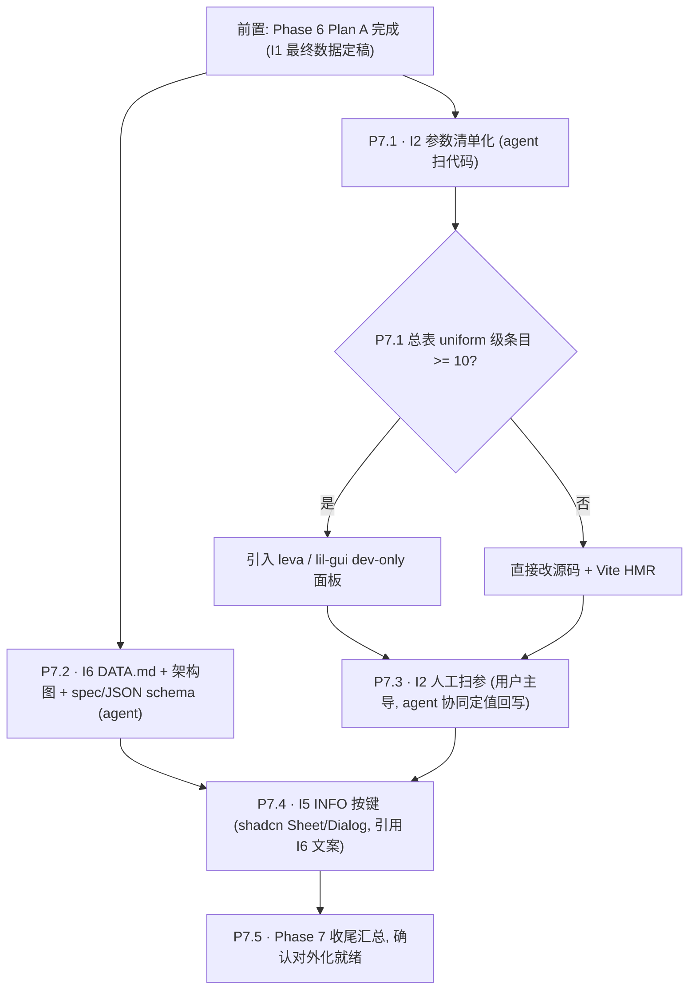

# Phase 7 — 视觉定稿与对外化（I2 + I5 + I6）

> 承接 [Phase 6.0 项目回顾与下一阶段规划报告](docs/reports/Phase%206.0%20%E9%A1%B9%E7%9B%AE%E5%9B%9E%E9%A1%BE%E4%B8%8E%E4%B8%8B%E4%B8%80%E9%98%B6%E6%AE%B5%E8%A7%84%E5%88%92%E6%8A%A5%E5%91%8A.md) §3 / §6 / §7 / §9 收尾，依赖 [phase_6_i1_i3_i4_adfb5e1b.plan.md](.cursor/plans/phase_6_i1_i3_i4_adfb5e1b.plan.md) 中 P6.4 I1 最终数据已定稿。

## 本轮澄清（用户决策）

- **范围**：仅 I2 + I5 + I6；Phase 5 pending（5.3.3 搜索 / 5.4.1 Vitest / 5.4.2 Bundle / 5.4.3 far）不纳入 Phase 7，仍留在 Phase 5 plan 按需重启
- **I2 调试面板（leva / lil-gui）**：**暂不定**；待 P7.1 产出 `视觉参数总表.md` 看 uniform 级调参项数量——<10 项直接改源码 + HMR，≥10 项再引入 dev-only GUI
- **I6 现状**：根 `README.md` 在 M9 已交付，Phase 7 仅补 **DATA.md**（TMDB CC-BY）、**架构总览 mermaid**、**`galaxy_data.json` 对外 schema 文档**、Tech Spec / Design Spec 视觉参数回写
- **I5 文案**：不重写；**引用** I6 的 DATA.md / README 片段，保证对外文案单源
- **前置硬条件**：`frontend/public/data/galaxy_data.json` 已是 768d + DensMAP + n=100 最终版（meta.version bump 已出现）；否则 I2 人工扫参结果可能再次失效

## 执行顺序与依赖

## 关键文件与改动面

### I2 视觉参数清单（P7.1 扫描源 → P7.3 回写目标）
- 相机 / 视距：`frontend/src/three/*`（FOV、`zCamDistance`、`zVisWindow`、near/far）+ `frontend/src/store/galaxyInteractionStore.ts`
- 粒子通用：`frontend/src/three/galaxy.ts`（`uPixelRatio` clamp、`sizeAttenuation`、HDR emissive 比例）
- 三层着色器：`frontend/src/three/shaders/point.{vert,frag}.glsl`（A 背景 + B 焦点 size/alpha/窗口边缘）+ `perlin.{vert,frag}.glsl`（C 选中：`uScale/uOctaves/uPersistence/uThreshold` / smoothstep 宽度）
- 后处理：`frontend/src/three/*Bloom*`（`strength / radius / threshold`）
- 交互 / 动画：相机飞入 duration + easing、hover 光晕透明度、Drawer 开合曲线
- HUD：Timeline 高度、Drawer 宽度、字体层级、暗化叠加
- Storybook 现场：`frontend/src/storybook/GalaxyThreeLayerLab.tsx`（可直接作为扫参时的隔离场景）

### I6 对外化文档
- 新增 [`docs/project_docs/DATA.md`](docs/project_docs/DATA.md)：TMDB 数据集出处、抓取时间、字段定义链接、**CC-BY Attribution** 文案（在 README / INFO 按键共享同一源）
- 新增 / 增补 [`docs/project_docs/架构总览.md`](docs/project_docs/架构总览.md)：Python 管线 → UMAP → JSON 导出 → Three.js 三层 → HUD 一图（mermaid）
- 补 `galaxy_data.json` 对外 schema 文档：可内嵌 Tech Spec §4，或独立 `docs/project_docs/galaxy_data_schema.md`
- Tech Spec / Design Spec 中三层视觉参数小节，由 P7.3 扫参定稿后回写
- 根 `README.md` 可选小补丁：加"数据来源 / 许可"小节 → 链到 DATA.md（文案单源）

### I5 HUD INFO 按键
- 新增 `frontend/src/hud/InfoButton.tsx` + `frontend/src/hud/InfoSheet.tsx`（复用 shadcn `Sheet` 或 `Dialog`，看位置选型）
- 放置点候选：右上角独立按钮 / Timeline 侧边 `i` 图标 → P7.4 内与用户确认
- 文案分区：项目简介、数据来源 + CC-BY、技术栈、交互说明、GitHub 链接——全部从 DATA.md / README 片段引用，不双写

## I2 人工扫参节奏（P7.3）

1. P7.1 产出总表后，**先 count uniform / 可调参数**
2. <10 项 → 直接源码 + Vite HMR 手调，截图比对；≥10 项 → 先加 dev-only leva 或 lil-gui（由 `import.meta.env.DEV` 守卫，不打生产）
3. 扫参流程延续 Design Spec §2：**三层视觉层级可辨 / Bloom 不淹没 genre 色 / C 层 Perlin 边界清晰**
4. 用户以"截图 + 主观感受"下结论；agent 只负责把最终值写回源码与 Tech/Design Spec，不替代审美判断
5. 若扫参暴露 shader 结构性问题（非参数可解），停手并汇报，视规模升为独立 plan

## 验收

- **I2**：`视觉参数总表.md` 内每项都有当前值 / 文件 / 行号 / 作用 / 取值范围；人工扫参定稿值已回写源码 + spec，前端三层视觉层级清晰可辨
- **I6**：DATA.md / 架构图 / schema 文档三项可达；根 README 有数据来源小节指向 DATA.md
- **I5**：HUD INFO 按键可用；弹出 Sheet/Dialog 文案与 DATA.md / README 一致（无双写）
- 对外化就绪：新用户首次访问能在 INFO 中看到"项目是什么 / 数据从哪来 / 怎么交互"；版权声明可见

## 风险

| 风险                                                   | 对策                                                                                                       |
| ------------------------------------------------------ | ---------------------------------------------------------------------------------------------------------- |
| P7.3 扫参中暴露 shader 结构性问题（参数不可解）        | 停手、汇报、独立 plan；不在 Phase 7 内扩张                                                                 |
| TMDB CC-BY 文案归属细节与实际下载源条款不一致          | DATA.md 草稿阶段贴原文链接 + 截图归档，由用户最终拍板可发布文案                                            |
| I5 Sheet 内容与 README / DATA.md 因多次 tweak 出现漂移 | 文案通过 import 或 `<ReactMarkdown src=...>` 方式引用单文件，避免人工复制                                  |
| P7.1 扫描遗漏隐式常量（shader 内 magic number）        | 允许总表标注 "TODO: 定位中"；P7.3 扫参过程补全                                                             |
| Plan A 的 I1 最终数据若未完成便开工 P7.3               | P7.3 启动前显式校验 `meta.umap_params` 含 `densmap=true, n_neighbors=100` 与 `meta.version` bump，否则回压 |

## 报告节奏

延续 Plan A 风格：**实施报告不在 todo 执行过程中自动生成**。每个 P7.N 完成后先交付用户验收与 tweak 往返；确认定稿后，由用户显式要求再补 `docs/reports/Phase 7.N ... 实施报告.md`。