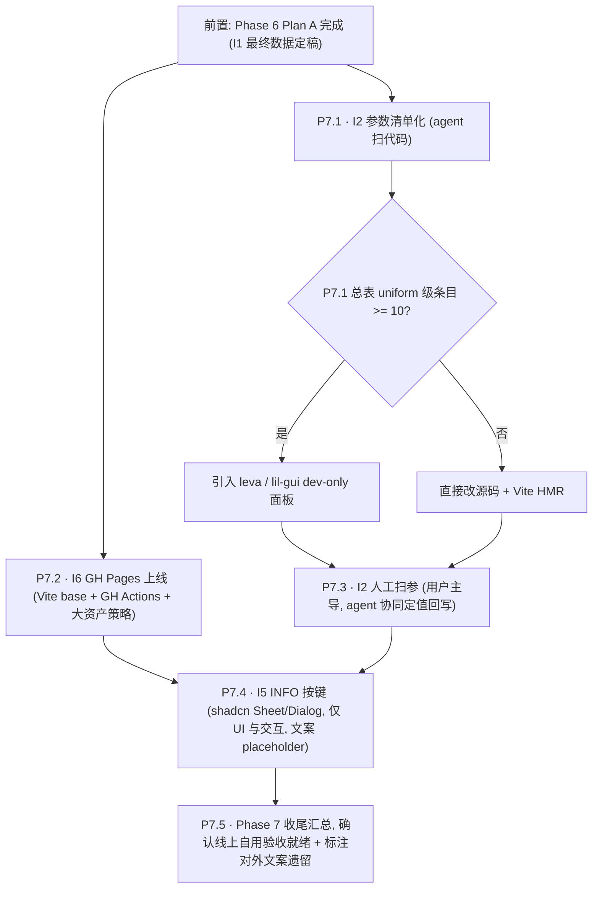

# Phase 7 — 视觉定稿与上线自用验收（I2 + I5 + I6）

> 承接 [Phase 6.0 项目回顾与下一阶段规划报告](docs/reports/Phase%206.0%20%E9%A1%B9%E7%9B%AE%E5%9B%9E%E9%A1%BE%E4%B8%8E%E4%B8%8B%E4%B8%80%E9%98%B6%E6%AE%B5%E8%A7%84%E5%88%92%E6%8A%A5%E5%91%8A.md) §3 / §6 / §7 / §9 收尾，依赖 [phase_6_i1_i3_i4_adfb5e1b.plan.md](.cursor/plans/phase_6_i1_i3_i4_adfb5e1b.plan.md) 中 P6.4 I1 最终数据已定稿。

## 本轮澄清（用户决策）

- **范围**：仅 I2 + I5 + I6；Phase 5 pending（5.3.3 搜索 / 5.4.1 Vitest / 5.4.2 Bundle / 5.4.3 far）不纳入 Phase 7，仍留在 Phase 5 plan 按需重启
- **I2 调试面板（leva / lil-gui）**：**暂不定**；待 P7.1 产出 `视觉参数总表.md` 看 uniform 级调参项数量——<10 项直接改源码 + HMR，≥10 项再引入 dev-only GUI
- **I6 形态调整（两轮迭代）**：
  - 第一轮：**从"写对外化文档（DATA.md / 架构图 / schema）"改为"把站点上线到 GitHub Pages"**
  - 第二轮：**再剥离所有对外文案**——不新建根 README、不写 TMDB attribution、不主动公开线上 URL，所有对外内容一并延到项目真正收尾阶段（独立 Phase）补齐
  - 本阶段解释源**只留在** `docs/project_docs/*`（PRD / Design Spec / 数据处理规则 / 特征工程总表 / 视觉参数总表）；GH Pages 上线本身只服务自用验收
- **I5 文案取向**：P7.4 **只做 UI / 交互骨架**；所有分区文案以 `TODO: fill at project wrap-up` 占位；不引用任何 `docs/project_docs/*` 片段，不预埋 attribution，避免在项目还在迭代时被迫反复 tweak
- **大数据资产投放方案已定：B（压缩版直传 + `DecompressionStream`）**——理由详见上一轮评估；浏览器兼容 Safari ≥ 16.4 / Chrome ≥ 80 / Firefox ≥ 113，本项目为展示类不兼容更老浏览器；后续若需多数据集切换或回访秒开，再评估升级到方案 C（IndexedDB）
- **TMDB ToS 合规处理**：路径 2——**不主动公开线上 URL**（不分享到社媒 / 简历 / 外链），直到后续收尾阶段补齐 attribution 后再开放。线上部署本身只作内部验收闭环
- **前置硬条件**：
  - `frontend/public/data/galaxy_data.json` 已是 768d + DensMAP + n=100 最终版（meta.version bump 已出现）；否则 I2 人工扫参结果可能再次失效
  - `frontend/public/data/galaxy_data.json.gz` 已存在（当前仓库已有 ~31 MB），P7.2 只需把前端加载路径切到 .gz 并把未压缩版移出仓库

## 执行顺序与依赖

## 关键文件与改动面

### I2 视觉参数清单（P7.1 扫描源 → P7.3 回写目标）
- 相机 / 视距：`frontend/src/three/*`（FOV、`zCamDistance`、`zVisWindow`、near/far）+ `frontend/src/store/galaxyInteractionStore.ts`
- 粒子通用：`frontend/src/three/galaxy.ts`（`uPixelRatio` clamp、`sizeAttenuation`、HDR emissive 比例）
- 三层着色器：`frontend/src/three/shaders/point.{vert,frag}.glsl`（A 背景 + B 焦点 size/alpha/窗口边缘）+ `perlin.{vert,frag}.glsl`（C 选中：`uScale/uOctaves/uPersistence/uThreshold` / smoothstep 宽度）
- 后处理：`frontend/src/three/*Bloom*`（`strength / radius / threshold`）
- 交互 / 动画：相机飞入 duration + easing、hover 光晕透明度、Drawer 开合曲线
- HUD：Timeline 高度、Drawer 宽度、字体层级、暗化叠加
- Storybook 现场：`frontend/src/storybook/GalaxyThreeLayerLab.tsx`（可直接作为扫参时的隔离场景）

### I6 GitHub Pages 上线
- `frontend/vite.config.ts`：新增 `base: '/chronicle_v3_3d_galaxy/'`（与远端仓库名对齐：`XYBuilds/chronicle_v3_3d_galaxy`）
- 新增 `.github/workflows/deploy-pages.yml`：`actions/checkout@v4` → `actions/setup-node@v4`（Node 20）→ 全局 npm 10.8.3 → **Linux runner 上**删根 `package-lock.json` + `node_modules` 后 `npm install --include=optional` → `npm run build -w frontend` → `actions/upload-pages-artifact@v3`（`path: frontend/dist`）→ `actions/deploy-pages@v4`；触发 `push` 到默认分支 + `workflow_dispatch`；权限 `pages: write` / `id-token: write`（规避 [npm/cli#4828](https://github.com/npm/cli/issues/4828) optional 原生绑定）
- GitHub 仓库一次性配置：Settings → Pages → Source = GitHub Actions；首次成功后记录线上 URL = `https://xybuilds.github.io/chronicle_v3_3d_galaxy/`（**本阶段仅自用验收，不主动公开**）
- 大数据资产策略 = **方案 B（压缩版直传 + `DecompressionStream`）**，具体落地：
  - 仓库只保留 `frontend/public/data/galaxy_data.json.gz`（~31 MB）；其余历史 JSON 变体（`galaxy_data.densmap384.json(.gz)` / `galaxy_data_gpu768_n100.json(.gz)`）与未压缩 `galaxy_data.json` 一并从仓库移除
  - 根 `.gitignore` 与 `frontend/.gitignore` 新增规则：忽略 `frontend/public/data/*.json`（只收 `.gz`），并为实验变体加白名单例外（如需保留本地）
  - 实现为 [`frontend/src/data/loadGalaxyGzip.ts`](../../frontend/src/data/loadGalaxyGzip.ts)：`fetch` → 整段 body 读入 → **gzip 魔数**分支（必要时 `DecompressionStream('gzip')`）或 UTF-8 JSON 直解析；下载进度与 UI 见 `loadGalaxyData` / `Loading`
  - 加载 UI：接入现有 HUD / 首屏 loading 容器，显示"下载 x / 31 MB → 解压 → 解析"三阶段进度条；错误态兜底（网络失败 / 解压失败 / JSON parse 失败）给 retry 按钮
  - Pipeline 侧配套：`scripts/` 或 Python 导出链末端确保 `.gz` 与 `.json` 同步产出（若当前是手工 gzip，补一条 `gzip -k -9 galaxy_data.json` 在导出脚本里）；`meta.version` 字段保持跨格式一致
  - 开发环境：Vite dev server 静态服务 `public/data/*.gz` 与生产行为一致；不保留未压缩 JSON 的 dev 分支路径，避免双路径漂移
- **本阶段不新增根 `README.md`、不写 TMDB attribution、不做任何对外文案**；延至后续独立"对外收尾"Phase 一并补齐（README + INFO 实文案 + attribution + URL 公开节奏）
- **不新增**：`docs/project_docs/DATA.md`、`docs/project_docs/架构总览.md`、`docs/project_docs/galaxy_data_schema.md`（本阶段已取消；如未来有外部引用需求再起独立 plan）
- Tech Spec / Design Spec 中三层视觉参数小节，仍由 P7.3 扫参定稿后回写（与本项解耦，属于内部文档维护）

### I5 HUD INFO 按键（P7.4 已落地）
- 新增 `frontend/src/hud/InfoButton.tsx`（右上角入口）+ `frontend/src/hud/InfoModal.tsx`（居中 Modal）+ `frontend/src/components/ui/dialog.tsx`（Base UI Dialog 封装，与 `sheet.tsx` 同源）
- 放置点：**定稿为右上角**；Timeline 侧边曾实现后按用户反馈撤回
- 新增 `frontend/src/hud/infoCopy.ts` **仅作为占位常量模块**：各分区（项目简介 / 数据来源 / 技术栈 / 链接）字段均为 `TODO: fill at project wrap-up` + 可视 placeholder 文本；后续对外收尾阶段主要改此模块
- **不做**：runtime 引用 `docs/project_docs/*` 片段 / 预埋 attribution 字符串 / 链外部 README / 链 GitHub 仓库真实地址——全部留空或占位
- 验收聚焦 UI / 交互层：打开关闭动效、键盘可达性（ESC 关闭、焦点陷阱）、内容区滚动、与 Timeline / Drawer 的 z-index 和手势不打架；实施报告见 `docs/reports/Phase 7.4 P7.4 I5 HUD INFO 按键 实施报告.md`

## I2 人工扫参节奏（P7.3）

1. P7.1 产出总表后，**先 count uniform / 可调参数**
2. <10 项 → 直接源码 + Vite HMR 手调，截图比对；≥10 项 → 先加 dev-only leva 或 lil-gui（由 `import.meta.env.DEV` 守卫，不打生产）
3. 扫参流程延续 Design Spec §2：**三层视觉层级可辨 / Bloom 不淹没 genre 色 / C 层 Perlin 边界清晰**
4. 用户以"截图 + 主观感受"下结论；agent 只负责把最终值写回源码与 Tech/Design Spec，不替代审美判断
5. 若扫参暴露 shader 结构性问题（非参数可解），停手并汇报，视规模升为独立 plan

## 验收

- **I2**：`视觉参数总表.md` 内每项都有当前值 / 文件 / 行号 / 作用 / 取值范围；人工扫参定稿值已回写源码 + spec，前端三层视觉层级清晰可辨
- **I6**：`https://xybuilds.github.io/chronicle_v3_3d_galaxy/` 可访问（**仅自用，不主动公开**）；首屏加载 `galaxy_data.json.gz` 成功、三层渲染正常、Timeline / Drawer 交互无异常；GH Actions workflow 成功跑通一次且后续 push 自动部署；仓库内**无新增 README / 对外 attribution 文案**
- **I5**：HUD INFO 按键 UI / 交互可用（打开关闭、键盘可达、与其它 HUD 不打架）；`infoCopy.ts` 内所有字段为 placeholder / TODO，**不包含任何对外正式文案**
- **对外收尾遗留**（显式记录，不在 Phase 7 做）：README 建站、INFO 实文案、TMDB attribution、线上 URL 公开节奏——延至后续独立 Phase

## 风险

| 风险                                                                     | 对策                                                                                                                                                 |
| ------------------------------------------------------------------------ | ---------------------------------------------------------------------------------------------------------------------------------------------------- |
| P7.3 扫参中暴露 shader 结构性问题（参数不可解）                          | 停手、汇报、独立 plan；不在 Phase 7 内扩张                                                                                                           |
| 方案 B 下客户端 `DecompressionStream` 解压 + `JSON.parse` 耗时过长卡首屏 | 加载 UI 三阶段进度条明示（下载 / 解压 / 解析）；Chrome M1 级设备上 31 MB gz → 91 MB JSON 解析实测 <2 s 可接受；若实测 > 3 s 再考虑分片或 worker 迁移 |
| 方案 B 浏览器不兼容 `DecompressionStream`（Safari < 16.4 等）            | 检测 `typeof DecompressionStream === 'undefined'` 时展示"请使用较新浏览器"提示，不做 polyfill 兜底                                                   |
| Git 仓库历史里残留 91 MB 未压缩 JSON 导致 clone 慢                       | P7.2 开工前用 `git filter-repo` 或 `git rm --cached` + 新提交清理；历史改写需用户确认（若仓库未公开分叉则低成本）                                    |
| `.gz` 与源 JSON 不同步（pipeline 产出脱节）                              | Python 导出链末端强制同时吐 `.json` 与 `.json.gz`（`gzip -k -9`），CI 中加校验 `meta.version` 字段一致                                               |
| GH Pages 部署路径与 Vite `base` 不一致导致静态资源 404                   | `vite.config.ts` 的 `base` 与仓库名严格对齐；CI 构建后本地 `npm run preview -- --base=/chronicle_v3_3d_galaxy/` 冒烟                                 |
| 本阶段无 TMDB attribution，线上 URL 若被意外分享 → ToS 违规风险          | 路径 2：线上 URL 不放入任何公开渠道（README / 社媒 / 简历 / 截图上水印）；仅作自用验收；后续独立对外收尾 Phase 补 attribution 后再开放               |
| P7.4 placeholder 文案被误以为成品 / 留到后续 Phase 时被遗忘              | `infoCopy.ts` 所有字段显式写 `TODO: fill at project wrap-up`；P7.5 收尾汇总把"对外文案遗留"列入已知遗留项清单                                        |
| P7.1 扫描遗漏隐式常量（shader 内 magic number）                          | 允许总表标注 "TODO: 定位中"；P7.3 扫参过程补全                                                                                                       |
| Plan A 的 I1 最终数据若未完成便开工 P7.3                                 | P7.3 启动前显式校验 `meta.umap_params` 含 `densmap=true, n_neighbors=100` 与 `meta.version` bump，否则回压                                           |
| GH Actions 首次部署失败（权限 / Source 未切换到 Actions / 路径问题）     | 首次部署由用户在 repo Settings 侧完成一次性开关并观察 workflow run；失败信息按 deploy-pages action 错误码对照修复                                    |

## 报告节奏

延续 Plan A 风格：**实施报告不在 todo 执行过程中自动生成**。每个 P7.N 完成后先交付用户验收与 tweak 往返；确认定稿后，由用户显式要求再补 `docs/reports/Phase 7.N ... 实施报告.md`。