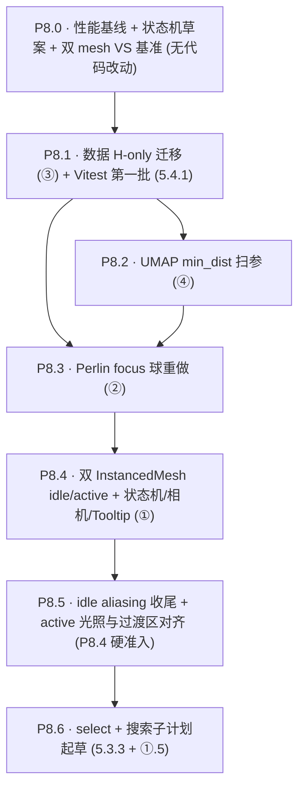

# Phase 8 — 视觉层级与数据契约升级

> 承接 [Phase 7 plan](.cursor/plans/phase_7_i2_i5_i6_05eeb9b1.plan.md) 收尾后的状态。来源：用户在 [星球视觉层级重新设计](docs/project_docs/星球视觉层级重新设计%2034ef460b49b380d79d64da1675534c49.md) 与 [perlin noise星球表面实现方案](docs/project_docs/perlin%20noise星球表面实现方案%2034ef460b49b380fba7a0fbccd7a493bf.md) 中沉淀的想法 + 上一轮评估。

## 用户决策（已确认）

- **范围**：Full —— 4 项原始 + P8.0 性能基线 + P8.5 idle/active 视觉与过渡区收尾 + P8.6 select/搜索子计划
- **focus 相机距离规则**：物理距离一致（`相机距离 = 固定常数`），保留 `vote_count` 在 focus 态的视觉权重；小星球 focus 后偏小是预期行为
- **数据迁移策略**（默认）：双字段过渡期（`genre_color` + `genre_hue` 共存一个 minor `meta.version`），所有消费点切完后再 bump major 移除旧字段；保护 GH Pages 自用验收链路不中断
- **渲染管线形态**：**双 InstancedMesh（idle + active）+ focus 独立 Perlin 球**（弃 Points 路径）。`InstancedMesh` 不能 per-instance 改 detail，故用两份几何：`IcosahedronGeometry(1, 0)`（idle）与 `IcosahedronGeometry(1, 1)`（active）；各 60K instance，共享 hue/voteNorm/aZ/aSize 等 attribute；`inFocus = smoothstep(z 边界 ± W)` 后 **idle scale ∝ (1−inFocus)**、**active scale ∝ inFocus**，互补叠加完成渐变。focus 时两颗 mesh 上该 instance scale 归零（或极小），由 P8.3 的 detail=6 Perlin 球单独呈现
- **idle↔active 切换机制**：两份 mesh 全量常驻，timeline 拖动零 CPU partition；仅 uniform（`uZCurrent` 等）更新
- **smoothstep 过渡宽度 W**：`W = zVisWindow × 0.2`（约几个月～一两年），过渡明显可见，不至于把 active 区拉模糊
- **WebGL2 / `gl_InstanceID`**：启动时 `assert renderer.capabilities.isWebGL2`，不通过直接抛错并提示升级浏览器（与 Phase 7.2 浏览器红线一致）；**不**维护 `aInstanceId` fallback
- **材质分工**：idle mesh — `transparent: true`、`depthWrite: false`，fragment 以 alpha 衰减治亚像素 aliasing；active mesh — `alphaTest: 0.01`、`depthWrite: true`，fragment 做 Lambert（+ 可选 rim），与 idle 的透明路径分离，避免单 shader 内 opaque/transparent 冲突
- **hover ring**：HTML/CSS overlay，**与 tooltip 一致即时显隐**，本阶段不做淡入淡出
- **P8.2 min_dist 扫参（④，范围收窄）**：主数据 `min_dist=0.4` 已确认过小，实验仅对比 **0.5 / 0.7 / 0.9**；为控制单次生成耗时，实验产物仅为 **z ∈ [2020, 2025]** 的电影子集（同一套 embedding/UMAP 设定，导出阶段过滤）；验收用 **`npm run dev`** 切换 `?dataset=` 肉眼比选，**不用** Storybook `GalaxyThreeLayerLab`；本阶段 **只** 关注 min_dist，不测 `uZVisWindow` 与 hover 命中；用户选定最优值后 **单独执行一次全量** 重训/导出并替换当前 `galaxy_data.json.gz`（该全量替换写入计划收尾说明，**不**作为 P8.2 子任务 closure）

## 执行顺序与依赖



依赖说明：
- P8.1 阻塞 P8.3（Perlin 球用新 H 配色）与 P8.4（双 mesh shader 直接消费 hue attribute）
- P8.2：产出 **z∈[2020,2025] 子集** 的 3 份实验 `.gz` 供比选；**不**在 P8.2 内替换主全量数据。用户选定 `min_dist` 并完成 **一次全量** 重训/导出后，再 bump `meta.version` 并替换 `frontend/public/data/galaxy_data.json.gz`；P8.3 **定稿前**须在该全量坐标上回归（P8.3 可与 P8.2 并行开发，但以全量替换后的坐标为最终验收依据）
- P8.5 是 P8.4 的硬准入：idle mesh 亚像素无闪烁、过渡区无双影、active mesh 低 chroma 仍有可读明暗；不通过则 **idle 回退 `THREE.Points`** + active mesh 保留（plan 写明为显式降级，非默认）
- P8.6 放最后：`select` 态会消费 P8.4 的最终 draw-call / bloom 分层形态

---

## P8.0 · 性能基线 + 状态机草案 + 双 mesh VS 基准（前置）

**无代码改动**，2–3 小时。

### 现状性能录制
- 用 Chrome DevTools Performance 录三个 5 秒片段：idle (z 远离窗口) / timeline 拖动跨 0–100 年 / focus 一颗高 vote_count 电影；记 GPU time、JS time、长任务、fps 中位数
- 在 [`docs/project_docs/Phase 8 基线 P8.0 性能与 P8.4 准入.md`](../../docs/project_docs/Phase%208%20基线%20P8.0%20性能与%20P8.4%20准入.md) 记录 Phase 8 基线数值（`视觉参数总表.md` 仍 Git 跟踪，见 `.cursorignore`）

### 双 mesh VS 开销基准（为 P8.4 准入定门槛）
- 临时新建 `frontend/src/storybook/InstancedMeshBench.tsx`（一次性 story，本 P 验收后可保留也可删）：**同屏**两个 InstancedMesh——MeshA 60K×detail=0（12 verts）+ MeshB 60K×detail=1（42 verts），shader 最小负载（纯色或跳过 OKLab 亦可），模拟 P8.4 最坏 steady-state
- 理论 VS：`60K×12 + 60K×42 = 3.24M` verts/frame（focus 时另加 Perlin 球，本基准可单独加第三 draw 作为附录）
- 记录在用户开发机（桌面独显）+ 至少一台对比设备（笔电集成显卡 / 手机 emulation throttle 4× CPU + 4× GPU）的 fps 中位数
- 准入门槛：双 mesh 组合在两台设备上 idle 片段 ≥ 50fps（集成显卡可放宽到 ≥ 35fps 但须用户书面接受）；若不达标，优先砍 post-processing 强度或 Bloom 半径，**不**先砍 detail=1（active 圆度是产品承诺）
- 注意：本基准不测 idle 透明 blending 的最终代价；P8.5 验收时再对照一次 fps

### 状态机 spec
- 草拟 `docs/project_docs/星球状态机 spec.md`：四态（idle / active / hover / focus）+ 一个延后态 (select)
- 每态明确 `z 范围`、`大小公式`（含 smoothstep W=zVisWindow×0.2）、`色彩参数 (hue/L/C 来源)`、`可交互性`、`进入/退出动画`
- 显式标注 "vote_count 在 focus 态保留视觉权重，小星球 focus 后偏小是 intended"
- 后续 P8.1–P8.5 都按这份 spec 回写

## P8.1 · 数据 H-only 迁移（你的 ③）

**目标**：把 L/C 从数据资产变成视觉 uniform，为未来交互式 L/C 铺路；同时还掉 5.4.1 Vitest 这条债。

### 字段方案
- `meta.version` minor bump（如 `1.x → 1.x+1`），加 `meta.has_genre_hue: true`
- 每条电影新增 `genre_hue: float`（**弧度**，与 shader `atan` 输出同制式），由 `scripts/export/export_galaxy_json.py` 在 `build_genre_palette` 里同步产出（`H_i = 2π · i / N`）
- 保留 `genre_color`、`genre_palette`（hex）作为 fallback，hex 的语义改为"由 pipeline 用定稿 L/C 生成、仅供 HUD swatch"
- 大版本移除旧字段时再起一次 plan，本阶段不动

### 关键文件（注意：本 P 仅在现有 Points shader 上改 attribute，P8.4 会再迁到 InstancedMesh shader；这两步分开是为了让 ③ 的数据迁移与 ① 的渲染管线重构各自独立验收）
- [scripts/export/export_galaxy_json.py](scripts/export/export_galaxy_json.py)：`build_genre_palette` + `_movie_row` 增加 `genre_hue`；assert `0 <= hue < 2π`；`print` 每个流派的 hue 度数与 hex 对照（按工作流准则的"状态可见性"）
- [frontend/src/types/galaxy.ts](frontend/src/types/galaxy.ts)：`Movie` 类型加 `genre_hue?: number`，`Meta` 加 `has_genre_hue?: boolean`
- [frontend/src/three/galaxy.ts](frontend/src/three/galaxy.ts) `fillMovieBuffers`：新增 `hueAttr: Float32Array(n)`，写法 `m.genre_hue ?? hueFromGenreColor(m.genre_color)`（fallback CPU 重算一次）
- [frontend/src/three/shaders/point.vert.glsl](frontend/src/three/shaders/point.vert.glsl)：去掉 OKLab 解码块（62–68 行），新增 `attribute float hue`，shader 直接 `a = uChroma * cos(hue); b = uChroma * sin(hue);`；保留 `srgb_to_linear`/`oklab_to_linear_srgb` 函数（仍要做 OKLab→sRGB 输出）；P8.4 中这套 hue 消费代码会以 helper 形式被新 mesh shader 复用
- [frontend/src/three/planet.ts](frontend/src/three/planet.ts) `resolveGenreColor`：改为 `resolveGenreHue(name, meta)`，颜色构造在 fragment shader 里完成；旧 `palette[hex]` 保留作 HUD 用
- HUD 消费点（grep `genre_color` / `genre_palette`）：`MovieTooltip`、`Drawer`、Storybook stories——swatch 改读 `meta.genre_palette` hex（语义不变）

### Vitest 第一批（顺手还 5.4.1）
- 安装 `vitest` + `@vitest/ui` 到 `frontend/devDependencies`
- 配 `frontend/vitest.config.ts`，加 `npm test -w frontend` 脚本
- 三条用例：
  1. `loadGalaxyData` schema 校验：`has_genre_hue=true` 时 `movie.genre_hue` 必须存在且在 `[0, 2π)`
  2. `hueFromGenreColor` round-trip：旧 `genre_color` 反推出的 hue 与导出端 `H_i` 误差 < 1e-3 rad（gamut clamp 容差）
  3. `point.vert.glsl` 的 OKLab 路径在 CPU 复刻一次（用同一组 OKLab 系数）：给定 `(hue, voteNorm, uLMin, uLMax, uChroma)`，输出 sRGB 与已知值匹配

### 验收
- pipeline 重跑 `galaxy_data.json.gz`、`meta.version` bump、本地 + GH Pages dev 构建均通过
- 前端三层视觉与 Phase 7 定稿肉眼一致（用户截图比对）
- `npm test -w frontend` 全绿
- 包体减少（gzip 后），数值写回报告

## P8.2 · UMAP min_dist 扫参（你的 ④）

**目标**：在「邻近电影难分辨」问题上，**仅** 对比更大 `min_dist` 对 XY 疏密的影响；当前主数据 **`min_dist=0.4` 已确认过小**，故本阶段 **只扫 `min_dist ∈ {0.5, 0.7, 0.9}`**（共 3 档）。

### 数据范围（为缩短单次生成时间）

- **实验集 JSON**：最终文件里**只含** `z ∈ [2020, 2025]`（按项目既有 `release_date → z` 规则过滤）的电影行；用于 dev 加载与肉眼比「邻近疏密」。
- **控时策略（推荐顺序，实施时在脚本/README 写死其一）**：
  1. **首选**：在全量电影上已得到的 **768d embedding（或与当前主数据同源的矩阵）** 上，**仅重跑 UMAP** 三次（`min_dist` = 0.5 / 0.7 / 0.9），再对输出按 z 过滤 —— 与全量替换后的坐标定义一致，仅省 embedding 与无关行的写出。
  2. **若仍过长**：与用户书面确认后，方可采用「仅 z 子集参与 UMAP」的捷径；须在 `meta` 标明 `subset_umap=true` 且文档说明**与全量流形不可逐点对比**，全量替换后必须再主观验收一次。
- **全量替换**：不在 P8.2 验收内完成。用户根据 dev 比选确定最优 `min_dist` 后，**单独执行一次全量** 重训/导出，生成新的 `galaxy_data.json.gz` 替换当前主数据，并 bump `meta.version`；该步完成后 P8.3 等后续 P 以全量坐标做最终回归。

### 实施要点

- 在 `scripts/` 下实现（新建或扩展 `experiments/min_dist_sweep.py`）：对三个 `min_dist` 各产一份 **`galaxy_data.mindist{05|07|09}.json.gz`**（命名可自定但须稳定），落 `frontend/public/data/experiments/`；`print` 每份子集的 `n`、`z` min/max、`meta.min_dist`（或等价字段）做状态可见性。
- [frontend/src/data/loadGalaxyGzip.ts](frontend/src/data/loadGalaxyGzip.ts)：`?dataset=mindist05` 等查询参数旁路加载实验 `.gz`；**默认**仍指向主 `galaxy_data.json.gz`，避免误提交切换。
- **验收方式**：用户使用 **`npm run dev`**（Vite dev）切换 query 肉眼对比三档在 **z=2020–2025 切片** 下的疏密与「邻近可辨」主观感受；**不使用** Storybook `GalaxyThreeLayerLab` 并排截图流程。
- **本阶段不测**：`uZVisWindow` 厚度、hover 命中 / Raycaster 容差等交互变量；若需再扫，另起后续 plan 或并入 P8.4 后调试。

### 验收（P8.2 closure）

- 3 份实验 `.gz` 可加载、meta 标明 `min_dist` 与 **子集 z 范围**；控制台/文档记录每份 `n` 与 z 极值。
- 用户在 dev 下完成三档比选并**书面记录**胜出 `min_dist`（可记入 `docs/project_docs/` 或 Phase 8 报告草稿）。
- **不要求**本 P 内替换主全量 `galaxy_data.json.gz`；全量替换为用户决策后的**独立一步**，并在替换后更新主导出脚本默认 `min_dist` 与文档。

## P8.3 · Perlin focus 球重做（你的 ②，修正版）

**目标**：用 detail=6 Icosahedron + 排序百分位算法实现"绝对精确等比面积"，并接 movie.id 作 seed。

### 修正你文档里的两点
- `IcosahedronGeometry(1, 6)` ≈ 81,920 三角形 / 40,962 顶点，已是甜点；文档里 `detail=64` 在 Three.js 不可能（`20 × 4^detail`）
- N 实际有上界（`maxSlots=4`），不需要动态 shader 元编程；用**固定 4 阈值的 GLSL** 即可

### 实施
- [frontend/src/three/planet.ts](frontend/src/three/planet.ts) 几何升级：`new THREE.IcosahedronGeometry(1, 6)`；标记 `geometry.attributes.position.usage = StaticDrawUsage`
- 引入 PRNG：`xmur3(String(movie.id))` → seed → `mulberry32(seed)` → 喂 `simplex-noise@4` 的 `createNoise3D(rng)`（依赖已在前端，`package.json` 里查 `simplex-noise`，没有再加）
- CPU 端：每次 `setFromMovie` 时
  1. 遍历所有顶点算 noise → `noiseValues: Float32Array`
  2. `noiseValues` 排序
  3. 等比数列 `[1, x, x², x³]` 归一化为累计百分比 → 取索引位置的值作为 4 个阈值 `t1..t4`
  4. assert `t1 < t2 < t3 < t4`，console.log 实际占比 vs 期望占比
- [frontend/src/three/shaders/perlin.frag.glsl](frontend/src/three/shaders/perlin.frag.glsl) 升级：用 `step()` 链 + `smoothstep()` 边界软化，4 颜色通过 `uColor0..3` + `uThresh1..4`（替换现有单一 `uThreshold`）；颜色仍由 P8.1 的 hue + uniform L/C 决定
- 面积比例 `x` 暴露为 uniform `uAreaRatio`（默认 `1/φ`），P7.3 leva 面板顺手挂上
- [frontend/src/three/shaders/perlin.vert.glsl](frontend/src/three/shaders/perlin.vert.glsl)：保持，noise 在 CPU 算完后阈值喂 fragment

### 验收
- 测 5 部不同 id 的电影：每次 setFromMovie 后看到稳定相同的纹理（PRNG 确定性）
- console.log 显示实际面积占比与 `[1, x, x², x³]/sum` 误差 < 0.5%
- detail=6 + 单球渲染 fps 与 P8.0 基线 focus 片段对比无回归（≥ 95% 原 fps）

## P8.4 · 双 InstancedMesh（idle detail=0 + active detail=1）+ 状态机/相机/Tooltip（你的 ① 完整版）

**目标**：实现「按层级不同 detail」——**idle = 0、active = 1、focus = 6（P8.3 Perlin 独立 mesh）**。`InstancedMesh` 不能在同一 draw 里 per-instance 换几何，故用 **两份** InstancedMesh 全量 60K instance，shader 内用同一套 `inFocus = smoothstep(z 边界 ± W)`，**idle scale ∝ (1−inFocus)**、**active scale ∝ inFocus**，互补叠加完成渐变；focus 时该 `instanceId` 在 **idle + active 两份 mesh 上 scale 均归零**（或压到不可见），仅 Perlin 球呈现。同时落地状态机命名、camera 物理距离 focus、HTML hover ring（**即时**，与 tooltip 一致）、tooltip 防偏移。

### 启动硬前置（用户已拍板）

- WebGLRenderer 创建后：`console.assert(renderer.capabilities.isWebGL2, ...)`，**失败则抛错**，提示与 Phase 7.2 一致的浏览器升级文案；**不**维护 WebGL1 / `aInstanceId` fallback
- focus 态用 `gl_InstanceID == uFocusedInstanceId`（`-1` 表示无 focus）

### 渲染管线重构（核心）

#### 几何、材质、draw 顺序

| Mesh                 | 几何                        | 实例数 | 材质要点                                                             | renderOrder（建议） |
| -------------------- | --------------------------- | ------ | -------------------------------------------------------------------- | ------------------- |
| `galaxyIdle`         | `IcosahedronGeometry(1, 0)` | 60K    | `transparent: true`, `depthWrite: false`, `blending: NormalBlending` | 0                   |
| `galaxyActive`       | `IcosahedronGeometry(1, 1)` | 60K    | `transparent: false`, `alphaTest: 0.01`, `depthWrite: true`          | 1                   |
| Perlin focus（P8.3） | `IcosahedronGeometry(1, 6)` | 1      | 现有 ShaderMaterial                                                  | 2                   |

场景中加入顺序：idle → active →（后处理 Bloom）→ Perlin 在 focus 时 `visible=true`。

#### 共享 per-instance attribute

两份 mesh **共用同一份** `Float32Array` 数据源（或各写一份相同数据，验收时 assert 一致）：

- `aHue`, `aVoteNorm`, `aSize`, `aZ` — 含义同 P8.1 / 原 `galaxy.ts`
- `instanceMatrix`：`Matrix4.compose(position(x,y,z), identity, scale=1)`，`setUsage(StaticDrawUsage)`

顶点着色器 **两份各一**（避免单文件里分支爆炸）：

- [frontend/src/three/shaders/galaxyIdle.vert.glsl](frontend/src/three/shaders/galaxyIdle.vert.glsl)
- [frontend/src/three/shaders/galaxyActive.vert.glsl](frontend/src/three/shaders/galaxyActive.vert.glsl)

公共片段（可复制或抽 `common.glsl` 若构建链支持 `#include`）：

```glsl
float zHi = uZCurrent + uZVisWindow;
float W = uTransitionWidth;  // = uZVisWindow * 0.2，或由 TS 写入
float inFocus =
    smoothstep(uZCurrent - W, uZCurrent, aZ) *
    (1.0 - smoothstep(zHi, zHi + W, aZ));

bool isFocused = (uFocusedInstanceId >= 0) && (gl_InstanceID == uFocusedInstanceId);
float sIdle = (1.0 - inFocus) * uIdleScale * aSize;
float sActive = inFocus * uActiveScale * aSize;
if (isFocused) { sIdle = 0.0; sActive = 0.0; }

// idle.vert: 最终 scale = sIdle；active.vert: 最终 scale = sActive
// 随后对 instanceMatrix 列向量乘 scale，算 mvPosition / gl_Position
// varying: vColor（OKLab 路径与 P8.1 一致）, vScreenRadius（CSS px 近似）, vNormal（仅 active 需要）
```

**片元**：P8.4 最小可验收版 — idle.frag 输出 `vec4(vColor, alpha)`（alpha 可先恒为 `inFocus` 的反比或占位）；active.frag 输出 `vec4(litColor, 1.0)`（lit 可先等于 `vColor`，Lambert 细节交给 P8.5）。

### 状态机正名

- [frontend/src/store/galaxyInteractionStore.ts](frontend/src/store/galaxyInteractionStore.ts)：`interactionPhase: 'idle' | 'active' | 'hover' | 'focus'` 派生；常量表与 P8.0 spec 对齐（`uIdleScale`、`uActiveScale`、`uTransitionWidth` 等）
- **hover** 不改变 mesh scale，仅驱动 HTML ring + tooltip

### camera-distance 驱动 focus（物理距离一致）

- [frontend/src/three/camera.ts](frontend/src/three/camera.ts)：`flyToFocus(targetWorldPos, FOCUS_CAM_DIST)`；删除 scene/planet 里旧渐隐+渐变 lerp
- `uFocusedInstanceId` 与 Perlin `setFromMovie` 同步；宏观双 mesh 上该 instance 双清零，避免与 Perlin z-fight

### Hover ring（HTML overlay，即时）

- 新建 [frontend/src/hud/HoverRing.tsx](frontend/src/hud/HoverRing.tsx)：`div` + `border-radius: 50%`，**无 CSS transition**（与 tooltip 一致，后续需求再加）
- 位置：`hoverAnchorCss` + [frontend/src/three/screenRadius.ts](frontend/src/three/screenRadius.ts) 给出的 `planetScreenRadiusCss`（ring 半径 = 星球屏幕半径 + 少量 padding）

### 拾取

- [frontend/src/three/interaction.ts](frontend/src/three/interaction.ts)：优先 `raycaster.intersectObject(galaxyActive, false)`；`instanceId` 即电影下标（`assert count === movies.length`）
- 仅当 CPU 侧 `inFocus > 0.5`（与 P8.0 spec 阈值一致）时接受命中；否则视为未命中（背景层不可点）
- 可选：active 极小时第二近邻 + 数 px 容差（**不在 P8.2** 内决定；交互专项或 P8.4 后迭代）
- 删除原 `computePointScreenRadiusCss` **圆盘命中**逻辑；若需对照调试可暂时保留在 dev-only 分支

### Tooltip 防遮挡

- `translate(calc(${planetScreenRadiusCss + 12}px), -50%)` 等同 P8.4 前版

### 关键文件汇总

- 新建：[frontend/src/three/galaxyMeshes.ts](frontend/src/three/galaxyMeshes.ts)（或 `galaxyDualMesh.ts`）、`galaxyIdle.{vert,frag}.glsl`、`galaxyActive.{vert,frag}.glsl`、[frontend/src/three/screenRadius.ts](frontend/src/three/screenRadius.ts)、[frontend/src/hud/HoverRing.tsx](frontend/src/hud/HoverRing.tsx)
- 可选：抽 [frontend/src/three/shaders/oklab.glsl](frontend/src/three/shaders/oklab.glsl) 供 idle/active/perlin 共用
- 重写：[frontend/src/three/interaction.ts](frontend/src/three/interaction.ts)、[frontend/src/three/scene.ts](frontend/src/three/scene.ts)、store
- 拆除：[frontend/src/three/galaxy.ts](frontend/src/three/galaxy.ts) 的 Points 路径与 `point.{vert,frag}.glsl` 生产引用（P8.1 仍可短期保留 point shader 供 Vitest / 对比截图，P8.4 收尾时删）

### 验收

- 四态符合 P8.0 spec；**idle↔active 过渡带**肉眼可见 smoothstep，无双份「实心球」错层（若有两影，记入 P8.5）
- timeline 拖动 fps ≥ P8.0 双 mesh 基线 95%
- focus：双 mesh 该星隐藏 + Perlin 独占，无 z-fight
- Raycaster 与旧圆盘拾取抽样 20 颗对比 ≤ 1px（或用户接受「active 略小更难点」时放宽并文档化）
- tooltip / hover ring 即时、不淡入淡出
- **idle 亚像素闪烁若仍明显**：P8.5 专攻 idle.frag；本 P 只记录现象

## P8.5 · idle aliasing 收尾 + active 光照与过渡区对齐（P8.4 硬准入）

**目标**：双 mesh 已分离 idle（透明）与 active（opaque+alphaTest），本 P **不再**在单一 fragment 里做 opaque/transparent 三分支；改为：**idle.frag** 专治亚像素亮点（alpha 曲线 + floor），**active.frag** 专治低多边形球体明暗（Lambert + 可选 rim），并消除 **idle+active 在过渡区的「双影 / 过亮」**。

### idle mesh（`galaxyIdle.frag.glsl`）

- 输入：`vColor`、`vScreenRadius`（CSS px 近似，vert 传入）
- 核心：`alpha = clamp(vScreenRadius * vScreenRadius, uAlphaFloor, 1.0)` — `uAlphaFloor` 约 `0.05～0.12`，避免 `radius→0` 时整颗被 discard 导致闪烁
- 可选：在 `inFocus` 接近 1 时强制 `alpha → 0`，与 active 互补（由 vert 传 `vInFocus` 或在 frag 用 uniform 重算，**须与 active 侧数学一致**）
- 验收：录屏 idle 远场星空，无「全屏同步闪烁」；与 Phase 7 Points 截图 A/B，整体亮度差 < 10%

### active mesh（`galaxyActive.frag.glsl`）

- 输入：`vColor`、`vNormal`（视空间或世界空间，择一并在文档中写死）
- Lambert：`lit = base * (uAmbient + uDiffuse * max(dot(N, L), 0.0))`，`L` 与 `uLightDir` 由 P7.3 leva 或常量表驱动
- 低 chroma 流派：单独截 Documentary / TV Movie 验收，暗面仍可读；不足则加 `uRim` 或提高 `uAmbient`
- `alphaTest: 0.01` 保留；**不与 idle 共享 depthWrite 语义冲突**

### 过渡区「无双影」

- 数学目标：同一 `(aZ, uZCurrent)` 下，idle 的 `contrib` 与 active 的 `contrib` 在感知亮度上近似 **单颗** 星，而非两颗叠加过曝
- 调参手段：`sIdle`/`sActive` 曲线、idle.frag 里按 `vInFocus` 衰减 alpha、或对 `vColor` 预乘 `1.0 - inFocus` / `inFocus`（择一实现，**在视觉参数总表记录最终式**）
- 验收：timeline 慢拖，过渡带无「实心双球」、无脉冲闪烁

### 性能

- 对比 P8.4 收尾帧时间：透明 idle + opaque active 的 overdraw 成本可接受；若掉帧 > 5%，先降 Bloom 再考虑 idle 简化

### Fallback（显式降级，非默认）

- 若 idle mesh 亚像素仍不可接受：**idle 回退 `THREE.Points`**（沿用 P8.1 后 `point.vert` hue 路径），active mesh + Perlin 保留；过渡区改为 Points 与 active mesh 的互补 scale（工程上重新接 `computePointScreenRadiusCss` 仅用于 Points 拾取对照或仅 active 拾取 — **实施时在 Tech Spec 写死一种**）
- 不在本 plan 内默认触发；仅作为 P8.5 验收失败时的书面出口

## P8.6 · select 态 + 搜索子计划起草

**目标**：起一份 `select` 态 + 搜索 (5.3.3) 的联合 spec 草案；不实装代码。

- 草案文件：`docs/project_docs/搜索与 select 态联合 spec 草案.md`
- 决策点（草案要列出，等用户拍板）：
  - 单选 vs 多选 vs 导演/演员关联高亮（连线？同色？）
  - 搜索框入口：HUD 顶部 vs 命令面板 vs 抽屉内
  - selective bloom 实装路径：`UnrealBloomPass` 走两个 layer 还是 `Selection` 列表 mask
  - 与现有 [Phase 5.0 评估报告](docs/reports/Phase%205.0%20项目全面评估与测试报告.md) 5.3.3 条目对齐

### 验收
- 草案 review 通过即结束本 P；实装独立起 Phase 9（或并入 Phase 9 对外收尾）

---

## 文档同步

每个 P 完成后（且用户验收后）需要回写：
- [`docs/project_docs/Phase 8 基线 P8.0 性能与 P8.4 准入.md`](../../docs/project_docs/Phase%208%20基线%20P8.0%20性能与%20P8.4%20准入.md) + [`视觉参数总表.md`](../../docs/project_docs/%E8%A7%86%E8%A7%89%E5%8F%82%E6%95%B0%E6%80%BB%E8%A1%A8.md)（uniform/常量；`.cursorignore`）
- [docs/project_docs/TMDB 电影宇宙 Tech Spec.md](docs/project_docs/TMDB%20电影宇宙%20Tech%20Spec.md)（数据契约 / 渲染管线）
- [docs/project_docs/TMDB 电影宇宙 Design Spec.md](docs/project_docs/TMDB%20电影宇宙%20Design%20Spec.md)（视觉层级 / 状态机）
- [docs/project_docs/TMDB 数据特征工程与 3D 映射总表.md](docs/project_docs/TMDB%20数据特征工程与%203D%20映射总表.md)（H 计算公式）

延续 Phase 7 风格：**每个 P 完成后先交付用户验收 + tweak 往返；定稿后由用户显式要求再补 `docs/reports/Phase 8.N ... 实施报告.md`**。

## 风险与对策

| 风险                                                        | 对策                                                                                                                       |
| ----------------------------------------------------------- | -------------------------------------------------------------------------------------------------------------------------- |
| P8.1 双字段过渡期被遗忘成永久遗留                           | 在 P8.6 草案末尾显式标"P8.1 双字段移除"待办，纳入下一阶段验收清单                                                          |
| P8.2 三档主观仍难区分                                       | 用户暂定中间档（如 0.7）或补一档实验；**不**在本阶段用 uZVisWindow/hover 拆因；全量替换后再主观复验一次                    |
| P8.3 detail=6 在低端 GPU 卡顿                               | fallback 到 detail=5（20K 顶点），统计精度仍可接受；阈值偏差容忍调到 1%                                                    |
| P8.4 物理距离一致导致小星球 focus 后过小                    | spec 文档里显式标"intended"；可选在 HUD 底部加 vote_count 数值显示，让信息不在视觉里也能读出                               |
| **P8.4 双 mesh（3.24M vert VS）在集成显卡 / 移动端卡顿**    | P8.0 双 mesh 基准准入；先调 Bloom/post；**不**以牺牲 active detail=1 为首选；实在不行用户书面接受 30fps 或降分辨率缩放实验 |
| **P8.4 WebGL2 / `gl_InstanceID` 不可用**                    | 启动 `assert isWebGL2` 直接失败（用户已拍板）；不维护 WebGL1 路径                                                          |
| **P8.5 idle 透明 + active opaque 过渡区过曝 / 双影**        | 按 P8.5「无双影」节调 `sIdle/sActive` 与 idle alpha；仍失败则触发 **idle→Points** 显式降级（见 P8.5 Fallback）             |
| P8.5 球面 Lambert 在低 chroma 流派色（如近灰）上反差弱      | Documentary / TV Movie 截图验收；提高 `uAmbient` 或加 `uRim`                                                               |
| **idle 全透明层与 Bloom 交互异常**                          | Storybook 单测 idle-only / active-only / 双 mesh；调 Bloom threshold 或 idle 预乘；记录最终组合到视觉参数总表              |
| GH Pages 自用验收链路被 P8.1 schema 改动打断                | 双字段过渡 + loader fallback 已对冲；首次部署后 smoke test 三条电影颜色与本地一致                                          |
| 性能基线 P8.0 没写就开始改                                  | 强制把 P8.0 设为 P8.1 的硬前置，CI 不写测试但人工 gating                                                                   |
| **P8.4 拾取从 CPU 圆盘 → Raycaster 后，hover 命中精度回归** | 验收阶段对 20 颗采样星球做新旧拾取对比，误差 ≤ 1px；超出则保留旧路径作 debug 对照                                          |
| **P8.3 Perlin 球叠在 P8.4 mesh focus instance 上 z-fight**  | Perlin 球半径略小于 focus instance 的 worldRadius；或 Perlin 球 `renderOrder = 2` + `depthTest=true`                       |

## 总验收

- **数据**：`galaxy_data.json.gz` 含 `genre_hue`，meta.version bump，包体减小
- **渲染**：**双 InstancedMesh**（idle detail=0 + active detail=1）互补 scale + smoothstep 渐变；focus = Perlin detail=6 独立 mesh；相机物理距离一致；Perlin 面积比例精确；邻近电影可分辨（数据 + 交互）
- **交互**：HTML hover ring **即时**（无 CSS transition），tooltip 不遮挡；WebGL2 + `gl_InstanceID` 路径；Raycaster 以 active mesh 为主，抽样对齐旧圆盘（误差 ≤ 1px 或文档化放宽条件）
- **性能**：每 P 后 fps ≥ P8.0 基线 95%；集成显卡 / 移动端 emulation 4× 下目标 ≥ 30fps（若书面接受 30fps 则在 Tech Spec 标注）
- **视觉**：idle 无灾难性闪烁；过渡区无双影；active 低 chroma 仍有可读明暗
- **文档**：四份 `docs/project_docs/*.md` 同步，状态机 spec 与 select/搜索草案落盘
- **已知遗留**：P8.1 旧字段移除、P8.5 **idle→Points** 降级（若触发）、P8.6 实装 — 列入 Phase 9 候选
