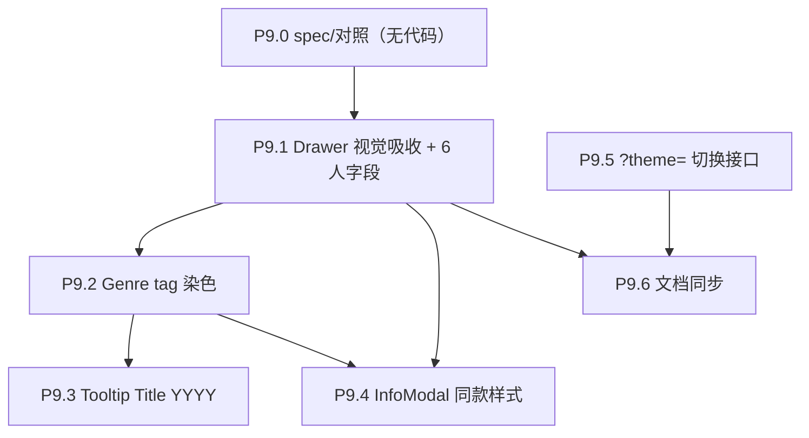

# Phase 9 — HUD 收尾与产品打磨

> 与 Phase 8 收尾后的渲染管线（双 InstancedMesh + focus Perlin 球）解耦。本 Phase **不动 shader、不动数据契约**，只在 React 层与 shadcn 组件层调整视觉与接线。前置：无；并行：可与 Phase 10 错峰，不强依赖。

## 范围

- 子节点：P9.0 → P9.6
- 涉及目录：`frontend/src/components/`、`frontend/src/hud/`、`frontend/src/App.tsx`
- 数据契约：**不变**（用户提供示例 [`docs/temp/drawer example.js`](docs/temp/drawer%20example.js) 仅作视觉参考，骨架保留 shadcn Sheet/Dialog/AspectRatio/ScrollArea）

## 执行顺序

## P9.0 spec 与对照（无代码）

- 在 `docs/project_docs/` 备一份"HUD 视觉吸收对照清单"（可附在 Design Spec 或新建短文件），列出从 [`docs/temp/drawer example.js`](docs/temp/drawer%20example.js) 中要吸收的 typography 项：zinc 层级、blockquote slogan、grid Details、cast 数字编号、外部链接按钮位置
- 明确 **保留** 项：shadcn Sheet/Dialog 骨架、AspectRatio 海报、ScrollArea cast 列表、`SHEET_OPEN_EASE` 时序
- 用户决策回写：`?theme=light|dark` 仅 dev 验收，不做 canvas 端配色适配

## P9.1 Drawer 视觉吸收 + 6 人字段

- 关键文件：[frontend/src/components/Drawer.tsx](frontend/src/components/Drawer.tsx)
- 视觉调整（保持现有 props/exports 与 `MovieDetailDrawerHud` 接口不变）：
  - SheetHeader：标题字号/行高对齐示例（`text-2xl font-bold leading-tight`）；`original_title` 移到副标题位（保留现有"等于 title 时不显示"逻辑）
  - 评分行：`★ + score + N votes + Date` 单行 + `gap-x-4 gap-y-2`；`Badge` 改为同尺寸更紧凑
  - 海报：维持 AspectRatio 2/3，外加示例的 `rounded-xl shadow-sm` + hover transition（保留 `DrawerPoster` failover）
  - Tagline：`border-l-2` slogan 块，斜体灰
  - Overview：`Section` 标题改 `tracking-wider uppercase text-[0.65rem]`；正文 `text-sm leading-relaxed`
  - Details：从 `dl` 改 `grid grid-cols-2 gap-y-5 gap-x-4`，每项 `font-semibold` label + `text-muted-foreground` value
  - Cast：保留 ScrollArea，列表样式改示例的"数字 + truncate"两列网格（在抽屉宽度 < `sm` 时退化为单列）
- 6 人字段全展（数据已就绪，见 [frontend/src/types/galaxy.ts](frontend/src/types/galaxy.ts) 81–86）：
  - 现有：`director` / `writers` / `cast`
  - 新增：`director_of_photography` / `producers` / `music_composer`
  - 新增字段块各自空数组时**整块隐藏**（沿用现有 presence-only 风格）
- 顺手新增：IMDb 外链按钮（`movie.imdb_id` 非空时显示），ghost button 链接 `https://www.imdb.com/title/{imdb_id}/`
- 验收：截图与示例对照（视觉接近 80%+），缺失 dop/producers/composer 的电影不出现空块；既有的 `MovieDetailDrawer` 与 raycaster 选中链路无回归

## P9.2 Genre tag 染色

- 关键文件：[frontend/src/components/ui/badge.tsx](frontend/src/components/ui/badge.tsx)（扩展 variant），[frontend/src/components/Drawer.tsx](frontend/src/components/Drawer.tsx)，[frontend/src/components/MovieTooltip.tsx](frontend/src/components/MovieTooltip.tsx)
- 实施：
  - Badge 加 `genre` variant：通过 inline style 接受 `--genre-color: <hex>`（来自 `meta.genre_palette[g]`），CSS 内三段式：
    - `background: color-mix(in oklch, var(--genre-color) 18%, transparent)`
    - `border-color: color-mix(in oklch, var(--genre-color) 60%, transparent)`
    - `color: var(--foreground)`
  - 如果 `color-mix` 兼容性差，回退用 `rgb(...)/0.18` 与 `0.6` 显式（`hex → rgb` 走小工具函数）
  - Drawer 中渲染 `movie.genres` 全量（去掉 `slice(0, 4)`，让用户全见）
- 顺手新增：tooltip 也显示 genre 染色 badge（与抽屉一致）
- 验收：暗色面板上文字与 tag 背景对比度 ≥ 4.5；hex 缺失时回退到现有未染色 outline 样式

## P9.3 Tooltip Title (YYYY)

- 关键文件：[frontend/src/components/MovieTooltip.tsx](frontend/src/components/MovieTooltip.tsx)
- 实施：第一行改 `${movie.title} (${movie.release_date.slice(0, 4)})`；第二行 `genres[0]` 不变；`release_date` 异常（不足 4 字符）时退回纯标题
- `MovieTooltipHud` 的 `title` prop 类型保持 `string`（拼接在 `MovieTooltip` 包装层做）
- 验收：tooltip 出现年份；hover 不同电影时年份正确切换；缺日期不崩

## P9.4 InfoModal 同款样式

- 关键文件：[frontend/src/hud/InfoModal.tsx](frontend/src/hud/InfoModal.tsx)
- 实施：把 `Section` 内部排布与 Drawer 同款 typography 对齐（标题 `tracking-wider uppercase text-[0.65rem]`、正文 `text-sm leading-relaxed`）；保留 `infoCopy.ts` 占位文案不动
- 验收：与 Drawer 视觉同源，作为 Phase 9 的"风格统一"节点

## P9.5 `?theme=light|dark` 切换接口

- 关键文件：[frontend/src/App.tsx](frontend/src/App.tsx)（或新建小 hook `frontend/src/hooks/useThemeFromQuery.ts`）
- 实施：
  - 在 App mount 时读 `new URLSearchParams(window.location.search).get('theme')`，命中 `light|dark` 则 `document.documentElement.dataset.theme = ...`
  - 默认仍为 dark（无 query 时不动 `<html>`）
  - shadcn 通过现有 CSS 变量响应 `[data-theme="light"]`（无需改 canvas 配色）
- 验收：`?theme=light` URL 下 HUD 切到亮模式；canvas 仍然黑底；切换不需刷新生效允许（query 变更监听非必须，stretch goal）

## P9.6 文档同步

- [docs/project_docs/TMDB 电影宇宙 Design Spec.md](docs/project_docs/TMDB%20电影宇宙%20Design%20Spec.md)：HUD 节追加 Phase 9 视觉规则（typography、6 人字段策略、genre tag 三段式色规则）
- [docs/project_docs/视觉参数总表.md](docs/project_docs/视觉参数总表.md)：登记 genre tag 三段式 alpha 18%/60%
- 不要求实施报告（沿用 Phase 7/8 风格，由用户显式要求时再补）

## 验收（Phase 9 总）

- Drawer 视觉与 [`docs/temp/drawer example.js`](docs/temp/drawer%20example.js) 神似
- 6 人字段全展且空块隐藏
- Genre tag 在 drawer + tooltip 染色一致
- Tooltip 显示 `Title (YYYY)`
- InfoModal 视觉与 Drawer 同款
- `?theme=light` URL 切到亮 HUD（dev only）
- 现有 raycaster / hover ring / focus 飞入 / Bloom 状态全部无回归

## 风险与对策

| 风险                                                      | 对策                                                                                                 |
| --------------------------------------------------------- | ---------------------------------------------------------------------------------------------------- |
| `color-mix(oklch)` 兼容性                                 | hex→rgb fallback；测试 Chrome/Firefox/Safari 现行版本                                                |
| 抽屉新加块导致 ScrollArea 高度溢出                        | 新加 dop/producers/composer 用 grid-cols-2 紧凑布局，cast ScrollArea 高度从 `h-48` 视情况调到 `h-40` |
| `?theme=light` 下 shadcn 默认浅色变量与 canvas 黑底反差大 | 文档明确"dev-only 验收，非产品形态"，不投入 canvas 配色                                              |
