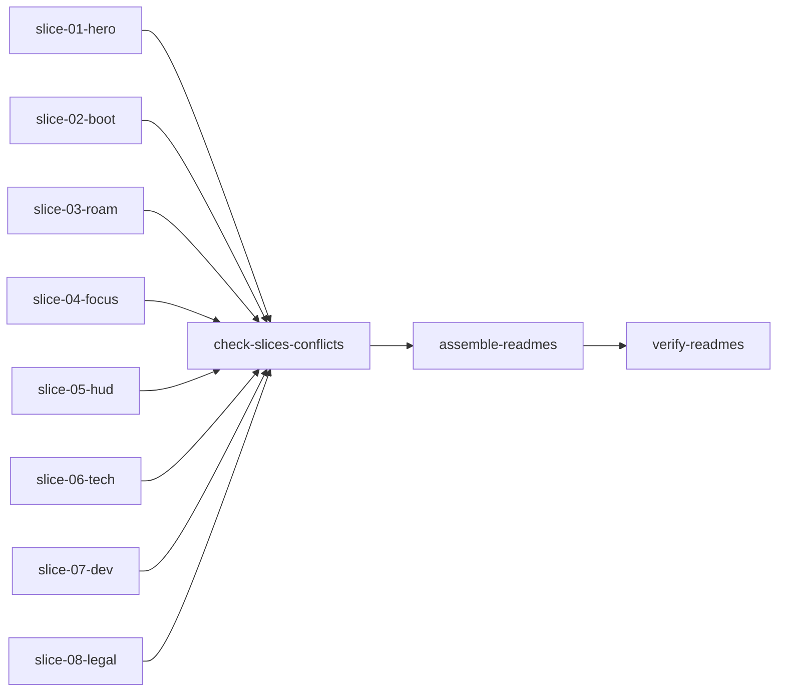
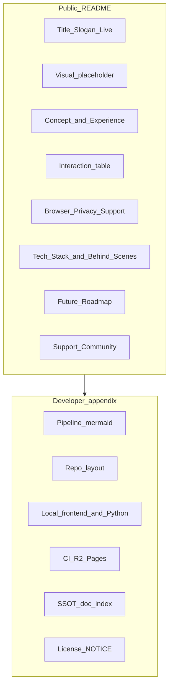

# README 交互艺术模板重构计划

## 目标与原则

- **源模板**：[docs/temp/Interactive Art README Template.md](docs/temp/Interactive%20Art%20README%20Template.md) — 作章节骨架，**可删改**（你已选：保留「视觉呈现」为占位、不删整节）。
- **受众**：观赏者 + 贡献者并重 — 体验叙事用模板语气；**不**把 `docs/project_docs/` 长文搬进 README，但保留现有 README 中「本地运行 / 管线 / CI / 文档索引 / 许可」的**信息量级**（表格与 mermaid 可压缩措辞，不砍章节）。
- **品牌**（[branding-name-convention.mdc](.cursor/rules/branding-name-convention.mdc)）：
  - 标题下 Slogan、正文、About：**The Movie Cosmos**
  - 提及 HUD/封面标识时：**the movie cosmos**
  - 避免 **TMDB Movie Cosmos** 作主品牌名
- **双语**：`README.md`（简中）与 `README.en.md`（English）**同构**；实现时按 [sync-doc.mdc](.cursor/rules/sync-doc.mdc) 做跨语言同步（用户已明确要求双文件重构）。
- **仓库 URL**：`https://github.com/XYBuilds/chronicle_v3_3d_galaxy.git`（`git remote origin`）
- **撰写纪律（强制）**：每个 TODO 是 **同一 Agent 内** 的「先读后写」原子单元；必须先打开所列文件（必要时追 1 层调用），在 slice 文件顶部用 HTML 注释记录 3–8 条「行为事实」，再写正文；**禁止**只读计划摘要或旧 README。
- **多 Agent 协作（推荐）**：**一 TODO = 一 Agent**；各 Agent **只写** `docs/temp/readme-parts/` 下自己的 `{id}.{zh,en}.md`，避免并行改 `README.md` 冲突。全部 slice 完成后由 **`check-slices-conflicts`** 专 Agent 通读 parts、消除交叉重复与矛盾，再 **`assemble-readmes`** 拼接根 README。

---

## 为何采用「读 xx → 写 xx」单 TODO

| 模式                       | 问题                                                       | 本计划做法                                                                               |
| -------------------------- | ---------------------------------------------------------- | ---------------------------------------------------------------------------------------- |
| 读、写拆成 12 个 TODO      | 后写 Agent 拿不到前读 Agent 的 context，仍要重读代码或瞎写 | 每个 slice TODO **读完即写** 对应段落                                                    |
| 一个 Agent 写整份 README   | context 易爆（全库 + 双语文档）                            | 8 个 slice Agent + **1 冲突检查** + 1 组装 + 1 验收                                      |
| 每 TODO 只写中文、最后再译 | 翻译 Agent 无代码上下文，易漏改 OG/分享                    | 每 slice **同时产出 `.zh.md` + `.en.md`**（英文为专业翻译，事实以该 slice 已读代码为准） |

**你可手动**：每个 TODO 新开 Chat/Agent 并粘贴该 TODO 的 `content` + 本计划「分节必读」表中对应行。  
**我可自动**：并行派发 `slice-01`…`08` → `check-slices-conflicts` → `assemble-readmes` → `verify-readmes`。

---

## Slice 输出约定（每个 Agent 必遵）

- **目录**：`docs/temp/readme-parts/`（实施前由 slice-01 Agent 或你创建 `.gitkeep`）
- **命名**：`{序号}-{slug}.zh.md` / `.en.md`，与 frontmatter `id` 一致
- **文件头**（固定格式，供组装与验收）：

```markdown
<!-- readme-slice: 04-focus-share-og -->
<!-- readme-facts:
- fact 1 from code
- fact 2
-->
（正文 Markdown，可含表格，不含一级标题 #，从 ## 或段落起）
```

- **不要**在 slice 里写与己无关的章节；**不要**改其他 slice 文件
- **一级标题 `#`** 仅由 `slice-01` 或 `assemble` 写入最终 README

---

## 执行顺序（TODO 依赖）



- **可并行**：`slice-01` … `slice-08` 彼此无依赖（8 个 Agent 同时跑，context 各自独立）
- **必须串行**：`check-slices-conflicts` 在 **全部 slice 落盘之后、assemble 之前**；`verify-readmes` 在组装之后

---

## Slice 章节归属（防重叠；冲突检查对照用）

| 仅允许出现在 slice | 章节 / 内容                                                                                                        |
| ------------------ | ------------------------------------------------------------------------------------------------------------------ |
| `01`               | `#` 标题、Slogan、在线体验、互链、视觉占位、概念与灵感、艺术体验、**宏观看**视觉简表                               |
| `02`               | 交互表行：加载阶段、Cover、The Movie Today、初次上手短段                                                           |
| `03`               | 交互表行：拖拽、滚轮/时间轴、Space+滚轮、悬停、搜索三模式、ESC                                                     |
| `04`               | 交互表行：单击 focus、邻域切换、抽屉人名、DrawerMovieShare；**聚焦态**视觉简表；OG/深链 **1 段**（勿在 `05` 重复） |
| `05`               | 浏览器要求、隐私/Analytics、Ko-fi/Tally/Discord、Roadmap、参与支持                                                 |
| `06`               | 技术视界、幕后故事（性能 + UMAP/数学）                                                                             |
| `07`               | 面向开发者（mermaid、目录树、npm/Python、env、CI、文档索引）                                                       |
| `08`               | 数据与致谢、许可表                                                                                                 |

**易冲突边界（检查重点）**：`01` 宏观看 vs `04` 聚焦视觉；`04` OG vs `05` 隐私；`06` 管线一句 vs `07` 管线详述（06 只保留「读者向」一句，命令与 CI 只在 `07`）。

---

## Slice 冲突检查（`check-slices-conflicts`）

**目的**：各 slice 独立撰写后，在拼接前消除 **重复、矛盾、缺口**，避免组装 Agent 凭直觉删改。

**输入**：`docs/temp/readme-parts/*.{zh,en}.md` 共 16 个文件 + 上表「章节归属」+ 本计划「交互指南表」行清单。

**步骤**（单 Agent，建议只读根 README、不改代码）：

1. **重复**：同一 `##` 标题或同一交互表行出现在多个 slice → 保留归属 slice 内文，他处删或改为一句「见上文」。
2. **矛盾**：`readme-facts` 或正文对同一行为表述不一致（例：OG 用 `og-today` vs `og/brand`；分享在封面 vs 抽屉）→ 以代码事实为准统一，并同步修 `.zh` / `.en` 一对文件。
3. **缺口**：计划中的交互表行、H2 节无任何 slice 覆盖 → 标出缺口，在归属 slice 补写或记入报告。
4. **中英错位**：`01-hero-concept.zh` 与 `.en` 的表格行数、H2 列表不一致 → 对齐后再 assemble。
5. **术语与品牌**：The Movie Cosmos / the movie cosmos、~60k、WebGL 2、Cloudflare Pages（非 Vercel）全文一致。

**产出**（写入 `docs/temp/readme-parts/CONFLICT-REPORT.md`，可选）：

```markdown
# README slice 冲突检查
- [x] 重复：…（已修 slice NN）
- [x] 矛盾：…
- [ ] 缺口：…（若 assemble 前未修完则阻塞）
```

**完成标准**：报告无未勾选的阻塞项；16 个 slice 文件已就地修改完毕。**然后**才执行 `assemble-readmes`。

---

## 分节必读代码清单（按 slice 索引）

| Slice TODO                | 必读（至少）                                                                                                                                                                                                               | 写出文件                                       |
| ------------------------- | -------------------------------------------------------------------------------------------------------------------------------------------------------------------------------------------------------------------------- | ---------------------------------------------- |
| `slice-01-hero-concept`   | [PRD](docs/project_docs/TMDB%20电影宇宙%20PRD.md) §1–2；[映射总表](docs/project_docs/TMDB%20数据特征工程与%203D%20映射总表.md)；`frontend/src/lib/locales/en.json` `info`                                                  | `01-hero-concept.{zh,en}.md`                   |
| `slice-02-boot-cover`     | `Loading.tsx`，`utils/loadGalaxyData.ts`，`data/loadGalaxyGzip.ts`，`lib/galaxyAssetUrls.ts`，`store/coverModeStore.ts`，`data/loadToday.ts`，`hud/CoverBackdrop.tsx`，`lib/routes.ts`，`useRouteController.ts`            | `02-boot-cover.{zh,en}.md`                     |
| `slice-03-roam-search`    | `three/scene.ts`，`components/Timeline.tsx`，`store/` 内 wheel/Space/zCurrent，`components/SearchBar.tsx`，search 高亮/星座入口                                                                                            | `03-roam-search.{zh,en}.md`                    |
| `slice-04-focus-share-og` | `Drawer.tsx`，`DrawerMovieShare.tsx`，`lib/shareLinks.ts`，`three/planet.ts`，[星球状态机 spec](docs/project_docs/星球状态机%20spec.md)，`frontend/index.html`，`lib/indexOgMeta.spec.ts`，可选 `themoviecosmos-og-worker` | `04-focus-share-og.{zh,en}.md`                 |
| `slice-05-hud-meta`       | `locales/en.json` loading/error，`LanguageSwitch`，`kofiSupport.ts`，`tallyFeedback.ts`，`FeedbackButton`/`SupportButton`，`vite.config.ts`，`TmdbAttribution`                                                             | `05-hud-meta.{zh,en}.md`                       |
| `slice-06-tech-behind`    | `three/galaxyMeshes.ts`，shaders；`scripts/run_pipeline.py`，`umap_projection.py`，`export_galaxy_json.py`；Data Pipeline skim                                                                                             | `06-tech-behind.{zh,en}.md`                    |
| `slice-07-dev-deploy`     | `.github/workflows/nightly_vote_refresh.yml`，`monthly_refit.yml`，`deploy-pages.yml`，`scripts/cron/upload_galaxy_r2.py`，`.env.example`，`vite-env.d.ts`，`package.json`，`data/README.md`                               | `07-dev-deploy.{zh,en}.md`                     |
| `slice-08-legal`          | `NOTICE`，`LICENSE`，`docs/LICENSE`，`assets/fonts/README.md`                                                                                                                                                              | `08-legal.{zh,en}.md`                          |
| `check-slices-conflicts`  | 全部 `readme-parts/*.{zh,en}.md`；本计划「章节归属」「交互指南表」                                                                                                                                                         | `CONFLICT-REPORT.md`（可选）+ **就地修** slice |
| `assemble-readmes`        | 冲突清零后的 `readme-parts/*` + 本计划「建议的新文档结构」表                                                                                                                                                               | 根目录 `README.md`，`README.en.md`             |
| `verify-readmes`          | 组装后的双 README +  spot-check 原 slice 内 `readme-facts`                                                                                                                                                                 | 修正遗漏；grep 过时词                          |

**Agent 提示词模板（复制到子 Agent）**：

> **Slice 撰写**：执行 TODO `{id}`：先阅读「分节必读」表中对应文件并理解，在 `docs/temp/readme-parts/{file}` 顶部写 `readme-facts` 注释，再撰写中英两个 slice 文件。不要改其他 slice，不要改根 README。品牌：正文 The Movie Cosmos，HUD 标识 the movie cosmos。
>
> **冲突检查**：执行 TODO `check-slices-conflicts`：通读 `docs/temp/readme-parts/*.{zh,en}.md`，对照本计划「章节归属」与「交互指南表」。去重、消歧、补缺口，同步修中英对；产出 `CONFLICT-REPORT.md`。未解决阻塞项前不要 assemble。

---

## 建议的新文档结构（两文件镜像）

| 区块                     | 模板对应                        | 本项目的具体内容                                                                                                                                                                                    |
| ------------------------ | ------------------------------- | --------------------------------------------------------------------------------------------------------------------------------------------------------------------------------------------------- |
| 标题 + Slogan + 在线体验 | 标题 / Slogan                   | 链 [themoviecosmos.com](https://themoviecosmos.com/)；互链 `README.en.md` / `README.md`                                                                                                             |
| 视觉呈现                 | Visual Showcase                 | **占位**：`> 演示截图 / GIF 待补充`（不新增资源文件）；可一句链到线站                                                                                                                               |
| 概念与灵感               | Concept & Inspiration           | PRD 三旅程：宏观时空漫游、星空寻宝、文物检视；2.5D「内容平面 + 时间纵深」                                                                                                                           |
| 艺术体验                 | 感知维度                        | 3–4 条 bullet：平面聚类、Z 轴历史、大小/亮度/色相读数（对齐 [en.json `info.sections`](frontend/src/lib/locales/en.json) 与 [映射总表](docs/project_docs/TMDB%20数据特征工程与%203D%20映射总表.md)） |
| 交互指南                 | Interaction Guide               | **一张表**替代当前分散的「浏览态/聚焦态」长列表（见下节）                                                                                                                                           |
| 浏览器 / 隐私 / 支持     | （模板无，保留）                | WebGL2 + DecompressionStream；Cloudflare Analytics 可选；Ko-fi / Tally / Discord — 短段                                                                                                             |
| 技术视界                 | Tech Stack                      | 分「创意视觉」与「框架构建」两小节（Three.js 双 InstancedMesh、GLSL、React 19 HUD、Zustand、Vite 8）                                                                                                |
| 幕后故事                 | Behind The Scenes               | **性能**：~60k 实例、Bloom 默认关、gzip 流式加载；**数学**：UMAP/DensMAP、Z 不参与 UMAP、1/φ 流派权重、log vote_count                                                                               |
| 未来计划                 | Roadmap                         | PRD §4：筛选、聚光灯、自动化数据流 — 标为 **未实现 / 规划中**                                                                                                                                       |
| 参与与支持               | Support                         | GitHub Issues（本仓库）、Ko-fi、Tally、Discord（主路径 = Tally thank-you）                                                                                                                          |
| 面向开发者               | （由模板 Getting Started 扩展） | **保留**现有附录主体：mermaid 数据流、目录树、npm/Python 命令、env 表、CI（R2+Pages）、文档索引表                                                                                                   |
| 数据与致谢 + 许可        | Credits & License               | TMDB/Kaggle/IMDb + [NOTICE](NOTICE)；Apache-2.0 / CC BY 4.0 表                                                                                                                                      |



---

## 交互指南表（核心改写）

将当前 README 中重复的「浏览 / 聚焦」交互合并为 **一张三列表**（与模板一致），行建议：

| 输入 / 动作                  | 反馈                                      | 备注                                                                       |
| ---------------------------- | ----------------------------------------- | -------------------------------------------------------------------------- |
| 加载完成 → 点击封面中心星球  | 进入 **The Movie Today**（UTC 按日换片）  | 规则见 [P23.1 指南](docs/guides/P23.1%20The%20Movie%20Today%20验收指南.md) |
| 画布拖拽                     | 平移 / 旋转观察（宏观与 focus 语义不同）  | focus 下为轨道相机 + 邻域切换                                              |
| 滚轮（未按 Space）/ 时间轴   | 沿 **上映年份纵深** 移动 `zCurrent`       | 宏观漫游                                                                   |
| **Space + 滚轮**             | 局部推近当前年代星野；松开复位            | Design Spec Phase 17                                                       |
| 悬停星球                     | Tooltip：片名 + 主类型                    | 不打断相机                                                                 |
| 顶部搜索（电影 / 人 / 流派） | 定位、person 星座高亮、genre AND 筛选     | **Cmd/Ctrl+K** 聚焦搜索；**ESC** 按栈退出                                  |
| 单击星球                     | focus + 侧栏档案（海报、简介、演职员）    | 邻域点击切换焦点；抽屉人名可触发 person 高亮                               |
| 聚焦态 **DrawerMovieShare**  | 复制 `/movie/:id` 链接、社交平台 composer | **修正旧 README**：分享在**详情抽屉**，非「封面右上角分享菜单」            |
| F                            | 全屏                                      | `FullscreenButton`                                                         |
| `?lang=` / 语言切换          | 7 种 HUD 语言                             | TMDB 字段原文不翻译                                                        |

**聚焦态视觉**保留为 **第二张简表**（4–6 行）：Perlin 色带、1/φ 条带宽度、同心 vote 环、侧栏 L 指针 — 链 [视觉参数总表](docs/project_docs/视觉参数总表.md)。

---

## 必须与代码对齐的修正（旧 README 过时点）

实施时对照以下实现，避免照抄现有 README 的 Phase 27 段落：

1. **社交预览 OG**：根 [frontend/index.html](frontend/index.html) 与 [frontend/src/lib/indexOgMeta.spec.ts](frontend/src/lib/indexOgMeta.spec.ts) 显示默认 **`https://themoviecosmos.com/og/brand.png`**；**不再**以静态 `og-today.png` + 日更 `?v=` 作为首页主叙事（若 Worker 对 `/movie/*`、`/today` 有动态注入，README 只写「深链由 OG Worker 处理」，细节链 Tech Spec / `themoviecosmos-og-worker` 仓库，**不写死已移除的路径**）。
2. **分享入口**：实现为 [frontend/src/components/DrawerMovieShare.tsx](frontend/src/components/DrawerMovieShare.tsx)（focus 抽屉内）；`VITE_DISCORD_INVITE_URL` 经 [shareLinks.ts](frontend/src/lib/shareLinks.ts) 可选 — **删除**「封面右上角 The Movie Today 分享菜单」表述。
3. **部署**：仓库 **无 Vercel**；生产为 **GitHub Actions → R2 + Cloudflare Pages**（保留现有 mermaid 与 wrangler 说明）。
4. **数据规模**：~60k 影片（PRD / 管线 SSOT），与当前 intro 一致。

---

## Slogan 草案（写入两 README 顶部）

任选其一或微调（中英对应）：

- **中文**：「在近六万部电影的星海里，按相似相遇，按时间远行。」
- **English**：「Roam a starfield of ~60,000 films—meet what’s alike, travel through time.»

（与 [PRD 愿景](docs/project_docs/TMDB%20电影宇宙%20PRD.md) 和 HUD `info.modalSubtitle` 语气一致。）

---

## 「面向开发者」附录 — 保留与精简策略

**保留**（来自当前 [README.md](README.md) L107–244 区域，英文镜像）：

- Python 管线一句话 + UMAP `random_state=42`、Z 不进 UMAP
- 生产拓扑 mermaid（Export → R2 → Pages → Browser）
- 概念目录树（不展开 gitignore 目录）
- 根目录 `npm install` / `npm run dev`；管线 smoke + 全量命令（指向 [data/README.md](data/README.md)）
- `VITE_*` 与 `.env.example` 要点
- CI：nightly/monthly、R2 不上 Git、GHP 灰度待下线
- **文档索引表**（7 份 SSOT）

**可压缩**（减重复，不丢信息）：

- 浏览/聚焦交互细节 → 已上移到交互表
- 过长的 Phase 编号脚注 → 改为「见 Tech/Design Spec」
- 宏观看视觉表格 → 概念节保留简表，附录只链映射总表

**不写入 README**：

- 巨型 `data/raw` 操作细节（继续链 `data/README.md`）
- Cursor rules / 内部 Phase 报告全文

---

## 模板章节处理

| 模板节                   | 处理                                                                   |
| ------------------------ | ---------------------------------------------------------------------- |
| Getting Started 三行 npm | 并入「面向开发者 → 本地运行」；clone URL 用真实 origin                 |
| Ko-fi 二维码表           | **不**放二维码图（无资产）；文字链 Ko-fi + 说明由 `VITE_KOFI_URL` 配置 |
| Discord                  | 主路径 Tally thank-you；可选 env                                       |
| 模板 base64 占位图       | **删除**，不带入 README                                                |

---

## 实施步骤（确认计划后执行）

1. **并行派发** `slice-01` … `slice-08`（各 Agent：读表内文件 → 写一对 `{zh,en}.md`）。
2. **`check-slices-conflicts`**：通读 16 个 slice；按「Slice 冲突检查」五类清单修 slice、写报告；**有阻塞项不得进入步骤 3**。
3. **`assemble-readmes`**：按 `01`→`08` 拼接；合并交互表（加载 → 漫游 → 聚焦 → 其他）时仅保留一份表头。
4. **`verify-readmes`**：对组装后的根 README 再做事实与过时词验收。
5. **（可选）** PR 说明注明视觉占位待补 GIF。

---

## 不在此次范围

- 不修改 `frontend/src/lib/locales/*.json`（除非用户另要求 HUD 文案与 README 对齐）。
- 不新增截图/GIF 文件（你已选占位策略）。
- 不提交 git / 不跑 `finish_todo.sh`（非 plan-TODO 工作流，除非你后续明确要求提交）。
- `docs/temp/readme-parts/` 为临时组装用；是否纳入 git 由你决定（建议随 README PR 一并提交，便于 review diff）。
