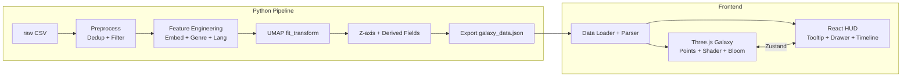

# TMDB 电影宇宙 — 开发计划

## 现状

**已有:**
- 项目文档完备（PRD / Tech Spec / Design Spec / 数据处理规则 / 特征映射总表）
- 6 个 Python 过滤脚本在 `scripts/dataset_processing/`（各自可用，但互相独立、路径不统一）
- 原始数据 `data/raw/tmdb2025.csv`（~59K 行，已含 TMDB + IMDb 字段）
- 20 行 subsample 用于调试
- `.venv` 环境 + `requirements.txt` 已就绪

**缺失:**
- 统一的管线编排器（各 filter 脚本路径各自为政，无串联）
- 整个特征工程层（embedding / genre 编码 / language 编码 / 融合）
- UMAP 降维 + Z 轴生成 + JSON 导出
- 整个前端应用

**已确认决策:**
- Embedding 模型: **Phase A** (`paraphrase-multilingual-MiniLM-L12-v2`, 384d) — 全量也用 A
- PyTorch: **安装 CUDA 版**（用户有 NVIDIA 显卡）
- 旧脚本: **归档到 `scripts/_archive/`**，管线用全新代码
- 前端包管理: **npm**
- UI 组件库: **shadcn/ui**（Tailwind CSS + Radix UI）
- Storybook: **保留**，用于 HUD 组件多状态预览与文档

## 架构总览

---

## Phase 0 — 环境补全

- 卸载 CPU 版 torch，安装 CUDA 版 (`pip install torch --index-url https://download.pytorch.org/whl/cu...`)

**(Checkpoint: 在终端执行 `.venv/Scripts/python -c "import torch; print(torch.cuda.is_available(), torch.cuda.get_device_name(0))"` → 必须输出 `True` 和显卡型号。若为 `False` 则阻塞，不得进入 Phase 2。)**

## Phase 1 — Python 数据清洗管线

**目标:** 从 `data/raw/tmdb2025.csv` 产出一份干净的中间 CSV，严格符合《数据处理规则》。

### 1.0 归档旧脚本

将 `scripts/dataset_processing/` 下全部 6 个现有脚本移至 `scripts/_archive/`。管线用全新统一代码实现，旧脚本仅作参考。

**(Checkpoint: `ls scripts/dataset_processing/` 应为空或仅含新文件；`ls scripts/_archive/` 应含 6 个 .py 文件。)**

### 1.1 统一管线编排脚本

创建 `scripts/run_pipeline.py` 作为单一入口，顺序执行所有步骤，参数可配置。不再依赖各脚本各自的默认路径。

**(Checkpoint: `python scripts/run_pipeline.py --help` 能正常打印参数说明，不报错。)**

### 1.2 预处理（Preprocess）

- **主键去重**: 按 `id` 去重；按 `imdb_id` 去重（合并行）
- 原 `merge_by_tconst.py` 针对旧数据格式（依赖缺失的 `merge_rules.py`），当前 CSV 已自带 IMDb 字段，此脚本**不再需要**，已归档

**(Checkpoint: 终端打印 `[Dedup] Before: {n} rows → After id dedup: {n1} → After imdb_id dedup: {n2}`。subsample 预期 20→20→20（无重复）；全量预期去除极少量行。assert `n2 > 0`。)**

### 1.3 强制剔除（Must Drop-outs）

复用/重构现有 4 个 filter 脚本的逻辑，统一为管线中的函数调用：
- `genres` 为空 → 剔除
- `vote_count` 为 0 或空 → 剔除
- `vote_average` 为 0 或空 → 剔除
- `release_date` 为空 → 剔除
- `overview` 为空 → **title 回退**（拼接 `title` + `original_title`）→ 回退后仍空则剔除
- 动态 `vote_count` 阈值过滤（复用 `filter_dynamic_baseline_vote_count.py` 的核心逻辑）

**(Checkpoint: 每个 filter 步骤独立打印 `[Filter:{name}] Dropped: {d} rows ({pct}%) → Remaining: {r}`。管线末尾打印汇总表。assert 全量最终行数在 55,000–59,000 区间（据 Dataset Report，原始 59,014 行，强制剔除比例应 <10%）。assert 输出 DataFrame 中 `genres`/`vote_count`/`vote_average`/`release_date` 列无 null/零值。)**

### 1.4 输出

- 中间产物: `data/output/cleaned.csv`
- 打印过滤摘要（每步剔除行数、最终留存行数）

**(Checkpoint: `python -c "import pandas as pd; df=pd.read_csv('data/output/cleaned.csv'); print(df.shape); print(df[['id','vote_count','vote_average','release_date','genres']].describe())"` → shape 第二维 = 28（列数不变），四列无零值/空值。文件大小打印确认非空。)**

---

## Phase 2 — Python 特征工程 + UMAP + 导出

**目标:** 从 `cleaned.csv` 产出 `frontend/public/data/galaxy_data.json`，严格符合 Tech Spec §2 和 §4。

### 2.1 文本 Embedding

文件: `scripts/feature_engineering/text_embedding.py`

- 模型: **Phase A** `paraphrase-multilingual-MiniLM-L12-v2` (384d)
- 输入拼接: `Tagline: {tagline}\nOverview: {overview}`（无 tagline 则仅 `Overview:`）
- 截断: 3000 字符（从尾部）
- L2 归一化
- **GPU 编码**（CUDA torch），batch_size 从 64 起，显存充足可提至 128–256

**(Checkpoint: 终端打印 `[Embedding] Device: cuda / Model: paraphrase-multilingual-MiniLM-L12-v2 / Input rows: {n} / Output shape: ({n}, 384)`。assert `output.shape == (n, 384)`。抽样打印前 3 条文本的 embedding L2 norm（应 ≈ 1.0 ± 0.001）。assert 无 NaN 行：`assert not np.isnan(embeddings).any()`。)**

### 2.2 Genre 顺位权重编码

文件: `scripts/feature_engineering/genre_encoding.py`

- 从数据动态获取去重 genre 集合（N_genre 维 one-hot）
- 每个 genre 的 one-hot 乘以 `w_k = (1/phi)^(k-1)`，累加
- L2 归一化

**(Checkpoint: 终端打印 `[Genre] Unique genres: {N_genre} → {sorted_list}`。打印 `Output shape: ({n}, {N_genre})`。抽样 1 条多 genre 影片（如 "Comedy, Drama, Romance"），打印其原始权重向量（应在 Comedy 位为 1.0，Drama 位为 0.618，Romance 位为 0.382）和 L2 归一化后的向量。assert 所有行 L2 norm ≈ 1.0。)**

### 2.3 Language One-hot 编码

文件: `scripts/feature_engineering/language_encoding.py`

- 从数据动态获取去重 `original_language` 集合（N_lang 维）
- 标准 one-hot
- L2 归一化

**(Checkpoint: 终端打印 `[Language] Unique languages: {N_lang} → {top_10_list}...`。打印 `Output shape: ({n}, {N_lang})`。assert 每行恰好有 1 个非零分量（one-hot 校验）。assert L2 归一化后每行 norm ≈ 1.0。)**

### 2.4 多模态融合 + UMAP

文件: `scripts/feature_engineering/umap_projection.py`

- 三组各自 `* (1/sqrt(d)) * w_modal`（默认 w=1.0）
- `np.concatenate` → UMAP `fit_transform(random_state=42)`
- 保存 UMAP 模型为 `.pkl`（供未来增量 `.transform()`）
- 输出 (X, Y) 坐标

**(Checkpoint: 拼接前终端打印三组维度 `[Fusion] text: ({n}, 384) * {scale_text:.6f} | genre: ({n}, {N_genre}) * {scale_genre:.6f} | lang: ({n}, {N_lang}) * {scale_lang:.6f}`。拼接后打印 `Combined shape: ({n}, {384+N_genre+N_lang})`。UMAP 完成后打印 `[UMAP] Output shape: ({n}, 2) | X range: [{xmin:.2f}, {xmax:.2f}] | Y range: [{ymin:.2f}, {ymax:.2f}]`。assert 无 NaN/Inf：`assert np.isfinite(xy).all()`。打印 UMAP 模型文件大小确认序列化成功。)**

### 2.5 Z 轴 + 派生字段 + JSON 导出

文件: `scripts/export/export_galaxy_json.py`

- **Z 轴**: `release_date` → 小数年份；YYYY-01-01 占位符做确定性 jitter（seed = TMDB id）
- **size**: `log10(vote_count + 1)` → 线性映射到 `[2.0, 25.0]`
- **emissive**: `vote_average` → 线性映射到 `[0.1, 1.5]`
- **genre_color**: genres[0] 查 OKLCH 色板 → sRGB hex → `[R, G, B]` 归一化
- **genre_palette**: OKLCH 色相环等间距分配（L≈0.75, C≈0.14），gamut clamp 后转 hex
- **poster_url**: `https://image.tmdb.org/t/p/w500` + `poster_path`
- 组装 `meta` + `movies[]` → 写 JSON（含 gzip 版）

**(Checkpoint: 终端逐项打印：**
- **`[Z-axis] range: [{z_min:.2f}, {z_max:.2f}] | jittered YYYY-01-01 count: {j}`**
- **`[Size] min: {s_min:.2f}, max: {s_max:.2f} (should be ≈ 2.0–25.0)`**
- **`[Emissive] min: {e_min:.2f}, max: {e_max:.2f} (should be ≈ 0.1–1.5)`**
- **`[Palette] {N_genre} genres → {json_snippet_of_palette}`**
- **`[genre_color] sample: movies[0].genre_color = [{r:.3f}, {g:.3f}, {b:.3f}] (all in 0–1?)`**
- **assert `meta.count == len(movies)`**
- **assert 所有 movie 的 x/y/z/size/emissive 均 finite（无 NaN/Inf）**
- **assert 所有 genre_color 分量在 [0, 1] 范围内**
- **打印 JSON 文件大小（raw MB + gzip MB）。)**

### 2.6 Subsample 冒烟测试

- 先用 `data/subsample/tmdb2025_random20.csv` 跑通 Phase 1 + Phase 2 全流程
- 验证输出 JSON 结构、字段完整性

**(Checkpoint: `python scripts/run_pipeline.py --input data/subsample/tmdb2025_random20.csv` 全程无报错。终端打印最终 JSON 中 `meta.count`（应 <= 20，因部分行可能被过滤）。用 `python -c` 加载输出 JSON，逐条打印 `{id}: {title} → x={x:.2f} y={y:.2f} z={z:.2f} size={size:.2f} emissive={emissive:.2f} color={genre_color}`，肉眼确认数值合理。assert 所有 Tech Spec §4.3 中标注为必有的字段均非 null。)**

---

## Phase 3 — 前端脚手架 + 3D 核心渲染

**目标:** Vite + React + Three.js 项目跑起来，能加载 JSON 并渲染 60K 粒子星系。

### 3.0 最小 3D 脚手架 — 快速验证 Phase 2 产物

在搭建完整前端之前，用一个**极简单文件 HTML + Three.js CDN** 页面秒验 subsample JSON 的坐标是否合理。不依赖 Vite/React/npm，纯验证目的，用完可丢弃。

- 创建 `scripts/verify_galaxy_3d.html`（或 `data/output/` 下），内嵌：
  - `<script type="importmap">` 引入 Three.js ESM CDN
  - `fetch('./galaxy_data_subsample.json')` 加载 Phase 2.6 的 subsample 产物
  - 用 `THREE.BufferGeometry` + `THREE.Points` + **`THREE.PointsMaterial({ size: 5, vertexColors: true })`** 渲染
  - 将每条 movie 的 `x, y, z` 写入 position attribute，`genre_color` 写入 color attribute
  - 添加 `OrbitControls`（临时允许自由旋转，方便从各角度检视点云分布）
- 用 Python 起一个临时 HTTP 服务器：`python -m http.server 8080 --directory data/output/`

**(Checkpoint: 浏览器打开 `localhost:8080/verify_galaxy_3d.html` →**
- **看到彩色点云散布在 3D 空间（不是所有点重叠在原点、不是一条线、不是 NaN 黑屏）**
- **旋转视角 → X/Y 平面上点有分散（UMAP 语义聚类），Z 轴方向有纵深（时间跨度）**
- **Console 打印 `Loaded {n} points | X:[{xmin},{xmax}] Y:[{ymin},{ymax}] Z:[{zmin},{zmax}]`**
- **点的颜色对应 genre（相同 genre 的点颜色一致）**
- **确认无误后，此文件可归档或删除，不进入正式前端项目。)**

### 3.1 项目初始化

- `frontend/` 下 `npm create vite@latest` (React + TypeScript)
- 安装核心依赖: `three`, `@types/three`, `zustand`, `vite-plugin-glsl`
- 安装 UI 栈: **Tailwind CSS v4** + **shadcn/ui** (`npx shadcn@latest init`)
- 安装 Storybook: `npx storybook@latest init` (`@storybook/react-vite`)
- 配置 `tsconfig.json` strict mode
- 目录结构按 Tech Spec §6

**(Checkpoint: `npm run dev` 启动无报错，浏览器打开 `localhost:5173` 看到 Vite 默认页。`npm run storybook` 启动无报错，浏览器看到 Storybook 空面板。`npx tsc --noEmit` 无类型错误。)**

### 3.2 TypeScript 类型定义

文件: `frontend/src/types/galaxy.ts`

- 定义 `GalaxyData`, `Meta`, `Movie` 接口（严格对齐 Tech Spec §4 schema）

**(Checkpoint: 将 subsample 冒烟测试产出的 JSON 文件手动复制到 `frontend/public/data/`，在一个临时 `test.ts` 中 `import` 该 JSON 并赋值给 `GalaxyData` 类型变量 → `npx tsc --noEmit` 无错误（证明类型与实际 JSON 兼容）。)**

### 3.3 数据加载 + Loading 页

- `frontend/src/utils/loadGalaxyData.ts` — fetch + parse + 运行时校验
- `frontend/src/components/Loading.tsx` — 全屏居中 spinner（shadcn 风格）
- Zustand store 管理加载状态

**(Checkpoint: 浏览器打开应用 → 先看到全屏 Loading spinner → 加载完成后 spinner 消失。打开 DevTools Console，确认打印 `[GalaxyData] Loaded {n} movies, meta.version={v}`，以及前 5 条 movie 的 `{id}: {title}`。若 JSON 缺失或格式错误，console 应打印明确的错误信息而非白屏。)**

### 3.4 Three.js 场景初始化

- `frontend/src/three/scene.ts` — Renderer、Scene、PerspectiveCamera
- `frontend/src/three/camera.ts` — 自定义控制器（truck/pedestal/Z-scroll，**无旋转**）
- 相机初始位置: XY 中心 + Z = `z_range[0] - 2`，朝向 +Z

**(Checkpoint: 浏览器中能看到黑色全屏 Canvas（无 WebGL 报错）。Console 打印 `[Scene] Renderer: WebGL2 | Canvas: {w}x{h} | Camera initial Z: {z}`。在场景中放入一个临时的 `THREE.AxesHelper(10)` → 能看到 RGB 三轴线（证明场景和相机工作）。滚轮操作 → Console 打印 `[Camera] Z: {z}` 实时变化；拖拽 → Console 打印 `[Camera] X: {x} Y: {y}` 变化。确认相机 Rotation 恒为初始值不变。然后移除 AxesHelper。)**

### 3.5 粒子星系（宏观层）

- `frontend/src/three/galaxy.ts` — `THREE.Points` + `BufferAttribute`（position, size, color, emissive）
- `frontend/src/three/shaders/point.vert.glsl` — gl_PointSize + camera distance 衰减
- `frontend/src/three/shaders/point.frag.glsl` — 圆形 + 径向辉光 + discard + HDR emissive

**(Checkpoint: 分两步走——**
- **Step A（降级验证）: 先用最基础的 `THREE.PointsMaterial({ color: 0xff0000, size: 5 })` 渲染全部粒子坐标 → 浏览器中必须看到红色点云分布（证明 BufferAttribute position 正确、画面不黑屏）。Console 打印 `[Galaxy] Points count: {n} | draw calls: {dc}`（dc 应 = 1）。**
- **Step B（正式 Shader）: 替换为自定义 ShaderMaterial → 浏览器中粒子应呈现多色（genre_color）、大小不一（size）、亮度不一（emissive）。截图对比 Step A，确认视觉差异明显。若 Shader 编译失败，Console 会报 GLSL 错误，不得静默吞掉。)**

### 3.6 后处理（Bloom）

- `frontend/src/three/scene.ts` 中加入 `EffectComposer` + `UnrealBloomPass`
- 参数: strength 0.8–1.2, radius 0.4–0.6, threshold 0.85

**(Checkpoint: 开启 Bloom 后，高 emissive 粒子（高分电影）应出现明显辉光光晕，低 emissive 粒子无光晕。临时在 Console 暴露 `window.__bloom` 对象，手动调节 `strength=0 / strength=2` → 肉眼确认辉光消失/过曝，证明 Bloom pass 生效且参数可控。打印 `[PostFX] Bloom enabled | threshold={t} strength={s} radius={r}`。)**

---

## Phase 4 — 交互 + HUD + 选中态

**目标:** 完成 PRD 定义的三层交互（漫游 → 悬停 → 点击检视）。

### 4.1 Raycaster 交互

- `frontend/src/three/interaction.ts` — Raycaster 拾取 Points 粒子
- hover: 写入 Zustand `hoveredMovieId`
- click: 写入 Zustand `selectedMovieId`

**(Checkpoint: 鼠标在粒子上移动 → Console 实时打印 `[Hover] id={id} title="{title}"` （离开粒子时打印 `[Hover] null`）。点击粒子 → Console 打印 `[Select] id={id} title="{title}"`。在空白处点击 → 打印 `[Select] null`。确认拾取的 id 与实际粒子位置一致（非随机误触发）。)**

### 4.2 HUD — Tooltip（悬停层）

- `frontend/src/components/MovieTooltip.tsx` — 锚定在 hover 星球的屏幕投影位置，显示 title + genres[0]
- 基于 **shadcn Tooltip**：Three.js Raycaster 检测 hover → 将星球 3D 坐标投影为屏幕坐标 → 更新不可见锚点元素的 `position: fixed` → Radix Tooltip 自然锚定并处理边缘碰撞
- 配套 Storybook story

**(Checkpoint: hover 粒子 → Tooltip 出现在星球旁边，内容为 `title` + `genres[0]`，不闪烁。将粒子移至屏幕四个角落 → Tooltip 应自动翻转方向不溢出视口（Radix collision detection）。离开粒子 → Tooltip 消失。Storybook 中可预览 Tooltip 的多种文本长度状态。)**

### 4.3 HUD — 档案详情抽屉（点击层）

- `frontend/src/components/Drawer.tsx` — 基于 **shadcn Sheet** 组件（侧边滑出）
- 展示完整电影档案：海报（shadcn AspectRatio）、标题、评分（Badge）、演职员（ScrollArea）等
- 滑出动画 250–350ms easeOutCubic，收回 400–500ms
- 配套 Storybook story（用 subsample mock 数据）

**(Checkpoint: 点击粒子 → 侧边抽屉滑出，海报图片加载（或显示 fallback），标题/评分/日期/overview 均有内容，演职员可滚动。点击关闭或空白处 → 抽屉收回。Storybook 中测试三种 edge case：无 tagline 的电影、无 poster_url 的电影（应显示占位图）、cast 超过 20 人的长列表。)**

### 4.4 HUD — 全局时间轴

- `frontend/src/components/Timeline.tsx` — 屏幕边缘刻度条，显示当前 Z 轴年代
- 半透明、低存在感；可考虑 shadcn Slider 视觉风格对齐

**(Checkpoint: 时间轴常驻可见。滚轮穿梭 Z 轴 → 时间轴的高亮指示器实时跟随移动，标注的年份刻度与相机 Z 坐标吻合（如 Z ≈ 2000.5 时指示器在 2000 附近）。极端位置（最早年份/最晚年份）不越界。)**

### 4.5 选中态（微观层）

- `frontend/src/three/planet.ts` — IcoSphere + Perlin Noise ShaderMaterial
- `frontend/src/three/shaders/perlin.vert.glsl` + `perlin.frag.glsl`
- 相机推进（600–800ms easeOutCubic）→ 粒子 alpha 渐出 + 球体渐入 → 抽屉滑出
- 取消选中: 反向播放（400–500ms）

**(Checkpoint: 分两步走——**
- **Step A（降级验证）: 先用 `THREE.MeshStandardMaterial({ color: 0x00ff00 })` 替代 Perlin Shader → 点击粒子后应在该位置出现绿色球体，原粒子淡出，相机平滑飞近。取消选中 → 球体消失、粒子恢复、相机飞回。确认整个动画序列无跳帧。**
- **Step B（正式 Shader）: 替换为 Perlin Noise ShaderMaterial → 球体表面应显示多色噪声纹理（按 genres 权重混色）。选中不同 genre 组合的电影，确认纹理颜色差异可辨。Console 打印 `[Planet] genres={list} weights={w_list} colors={hex_list}`。)**

### 4.6 Storybook 配置

- `.storybook/` 已在 3.1 初始化，此处确保：
- Loading、Tooltip、Drawer、Timeline 各有 stories
- Mock 数据从 `data/subsample/` 提取

**(Checkpoint: `npm run storybook` → 左侧导航列出 Loading / MovieTooltip / Drawer / Timeline 四个组件。每个组件至少有 default + edge-case 两个 story，均可正常渲染无报错。)**

---

## 里程碑 (Milestones)

| 里程碑       | 交付物                                | 验收标准                                        |
| ------------ | ------------------------------------- | ----------------------------------------------- |
| M1: 管线 MVP | `galaxy_data.json`（subsample 20 条） | JSON 结构完整，字段无 NaN，可手动检查语义合理性 |
| M2: 管线全量 | `galaxy_data.json`（~55-60K 条）      | 行数在预期范围；gzip 后 8–15 MB                 |
| M3: 粒子渲染 | 浏览器中看到彩色粒子星系 + Bloom      | 60K 粒子 1 draw call；滚轮可沿 Z 穿梭           |
| M4: 完整交互 | hover tooltip + click 选中 + 抽屉     | PRD 三层交互全部可用                            |

---

## 建议开发顺序

**Phase 1 → Phase 2（subsample 先跑通）→ Phase 3 → Phase 2（全量）→ Phase 4**

先用 20 行 subsample 验证管线正确性和 JSON schema，再搭前端骨架让 3D 渲染跑起来，然后回来跑全量数据，最后补交互和 HUD。这样可以最快看到端到端效果。
